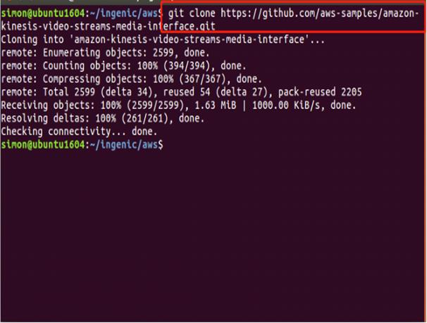
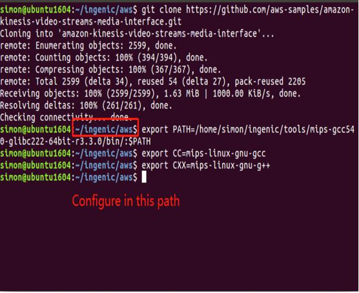
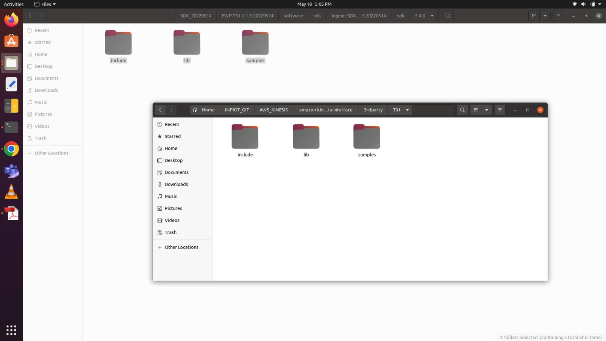
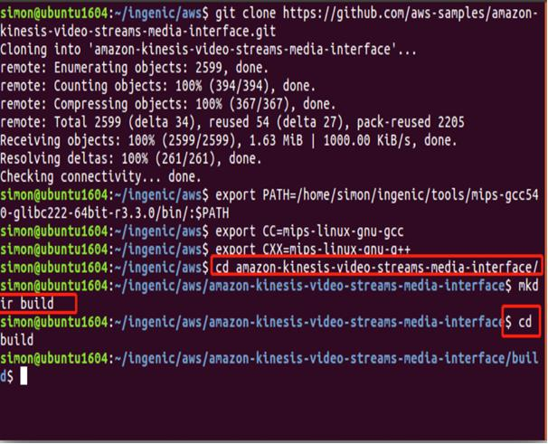
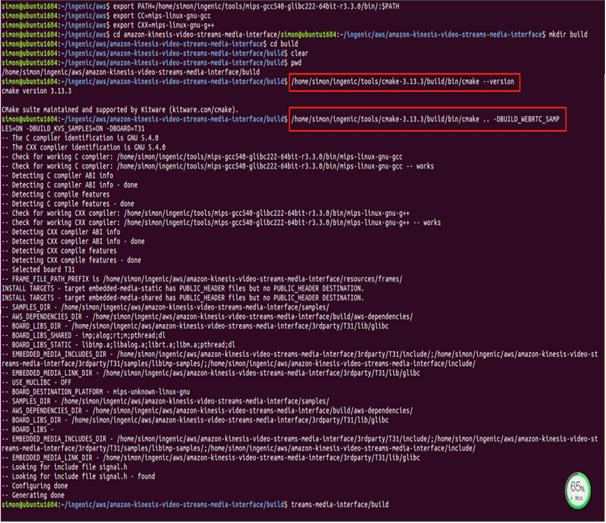
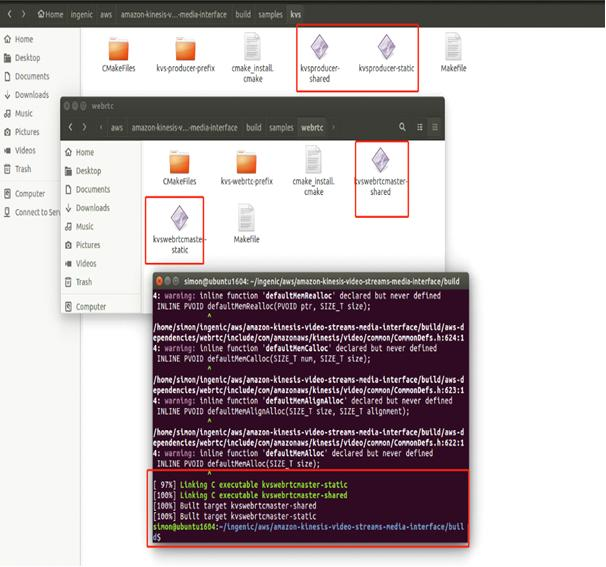

Building AWS KINESIS Video Streaming Application
----------------------------------------------------------------
1. Create an AWS folder and clone the ADK from the cloud.

Git clone: https://github.com/aws-samples/amazon-kinesis-video-streams-media-interface.git

|image1|

Figure 30: Clone ADK from the cloud

2. Run the following command for MIPS GCC5.40

.. code:: shell

    export PATH /home/xxxx/ingenic/tools/mips-gcc540-glibc222-64bit-r3.3.0/bin/:$PATH
    export CC=mips-linux-gnu-gcc
    export CXX=mips-linux-gnu-g++

**Note**: These exports can be added in the environment variables.
Ensure to add the path for cross-compiler binaries.

|image3|

Figure 31: Export - MIPS GCC5.40

3. Copy dependent files from Ingenic SDK to Amazon ADK

.. code:: shell

    cp -rf /home/xxx/INP3201_A WS_DEMO/T31_SNIPE_XXXXXXXX/FREERTOS_SDK_XXXXXXXX/ISVP-T31-1.1.5-XXXXX XXX/software/sdk/Ingenic-SDK-T31-1.1.5-XXXXXXXX/freertos_sdk/5.4.0/\* /home/xxxx/INPIOT_GIT/A WS_KINESIS/amazon-kinesis-video-streams-media-interface/3rdparty/T31/

|image5|

Figure 32: Copy dependent files

4. Enter path: amazon-kinesis-video-streams-media-interface. Create a folder ‘build’ and enter the folder.

.. code:: shell

    cd amazon-kinesis-video-streams-media-interface
    mkdir build;
    cd build;

|image12|

Figure 33: Create build folder

5. Check the cmake version installed. Run cmake to generate - makefile.

.. code-block:: bash

    /home/xxxx/ingenic/tools/cmake-3.13.3/build/bin/cmake –version
    /home/xxxx/ingenic/tools/cmake-3.13.3/build/bin/cmake ..
    -DBUILD_WEBRTC_SAMPLES=ON -DBUILD_KVS_SAMPLES=ON -DBOARD=T31

**Note**: After configuring the environment, install cmake 3.13.3 to
user path and not the system path.

|image18|

Figure 34: Generate makefile

6. Execute make to generate the executed file.

.. code:: shell

    make -j4

|image24|

Figure 35: Execute make

7. Copy kvswebrtcmaster-static to the T31z filesystem, insmod the
   necessary drivers in T31z and execute: kvswebrtcmaster-static to
   stream the video to AWS cloud.

