Checking and Validating the Partition Table
-------------------------------------------

Standard Programming - Appendix
~~~~~~~~~~~~~~~~~~~~~~~~~~~~~~~

Download tool will validate the existing partition table in the EVB, for
the following condition:

.. table:: Table 1: Standard programming: Partition Table – Condition

   +----------------------+-----------------------+-----------------------+
   | **Partition Name**   | **Sector Start**      | **Sector Count**      |
   +======================+=======================+=======================+
   | BOOT                 | 1                     | 63                    |
   +----------------------+-----------------------+-----------------------+
   | VIRT                 | 64                    | >=65                  |
   +----------------------+-----------------------+-----------------------+
   | SYSFS                | 496                   | 16                    |
   +----------------------+-----------------------+-----------------------+

**Case 1: Existing partition matches SSBL programming partition**

If the existing partition does not satisfy the condition mentioned in
Table 1, but matches with the SSBL programming partition, the user is
notified by a pop-up message. The user will then have the option
(Yes/No) to either flash the default partition table or terminate the
action (i.e., correct the deviation manually and try again).

|image26|

.. rst-class:: imagefiguesclass
Figure 34: Deviation from the standard programming partition – matches
SSBL programming partition

If the user selects ‘No’ and chooses not to back-up to the local system,
action is terminated requiring the user to manually correct the
deviation to proceed further.

|image28|

.. rst-class:: imagefiguesclass
Figure 35: Standard programming - action terminated

**Case 2: Existing partition neither satisfies Standard programming
partition, nor SSBL programming partition**

If the existing partition neither satisfies the condition mentioned in
Table 1, nor the SSBL programming partition, the user is notified by a
pop-up message. The user will then have the option (Yes/No) to either
flash the default partition table or terminate the action (i.e., correct
the deviation manually and try again).

|image31|

.. rst-class:: imagefiguesclass
Figure 36: Deviation from the standard programming partition - no match

**Note**: In case the user-defined partition table meets the condition
mentioned in Table 1, but with VIRT partition less than the application
VM image size, a pop-up message notifies the same to the user with an
option of overwriting existing partition with default partition table.

|image32|

.. rst-class:: imagefiguesclass
Figure 37: VM image does not fit in partition

1. If the user chooses to flash the default partition (option: Yes):

Download tool will back-up the contents of SYSFS and DATA partition of
existing partition table. Once the default partition is flashed
successfully, the backed-up contents of SYSFS and DATA partitions are
re-flashed to the corresponding new location as per the default
partition table.

a. In case the backed-up contents of SYSFS does not fit into the
   corresponding new location as per the default partition table
   (regarding size), user will have an option (Yes/No) to either back-up
   the content to local system and clear the data in EVB or correct the
   deviation manually and try again.

..

   |image34|

.. rst-class:: imagefiguesclass
Figure 38: Backed-up contents of SYSFS

i. If the user chooses to back-up to local system (option: Yes):

..

   The contents will be saved in the local system and the user will be
   notified with the folder path through a popup message.

|image36|

.. rst-class:: imagefiguesclass
Figure 39: Contents saved in the local system

ii. If the user does not choose to back-up to local system (option: No):

..

   The action will be terminated, and user will be required to correct
   the deviation manually to proceed further.

|image38|

.. rst-class:: imagefiguesclass
Figure 40: Action terminated requiring to correct the deviation
manually

b. In case the back-up contents of DATA partition do not fit the
   corresponding location in the default partition, the contents will be
   saved in the local system and the user will be notified with the
   folder path through a pop-up message. Also, the user will be
   intimated to write the new certification file to DATA partition using
   Write Files option.

..

   |image40|

.. rst-class:: imagefiguesclass
Figure 41: Back-up contents of DATA partition

c. However, if the user does not choose to flash the default partition
   (option: No):

..

   The action will be terminated, and the user will be required to
   correct the deviation manually to proceed further.

   |image42|

.. rst-class:: imagefiguesclass
Figure 42: User does not choose to flash default partition – action
terminated

SSBL Programming - Appendix
~~~~~~~~~~~~~~~~~~~~~~~~~~~

Download tool will validate the existing partition table in the EVB, for
the following condition:

.. table:: Table 2: SSBL programming: Partition Table – Condition

   +----------------------+-----------------------+-----------------------+
   | **Partition Name**   | **Sector Start**      | **Sector Count**      |
   +======================+=======================+=======================+
   | BOOT                 | 1                     | 31                    |
   +----------------------+-----------------------+-----------------------+
   | BOOT                 | 32                    | 352                   |
   +----------------------+-----------------------+-----------------------+
   | DATA                 | 384                   | 112                   |
   +----------------------+-----------------------+-----------------------+
   | SYSFS                | 496                   | 16                    |
   +----------------------+-----------------------+-----------------------+

If the existing partition does not satisfy the condition mentioned in
Table 2, but matches with the default programming partition, the user is
notified by a pop-up message.

The user will then have the option (Yes/No) to either flash the default
partition table or terminate the action (i.e., correct the deviation
manually and try again).

|image45|

Figure 43: Deviation from the SSBL programming partition – matches
default programming partition

If the user selects ‘No’ and chooses not to flash the default SSBL
partition table, action is terminated requiring the user to manually
correct the deviation to proceed further.

|image48|

.. rst-class:: imagefiguesclass
Figure 44: SSBL programming - action terminated

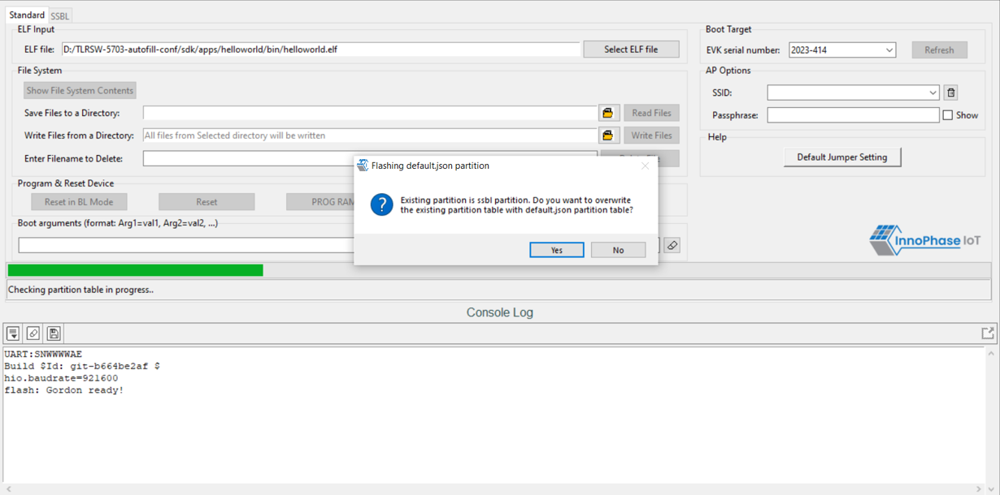
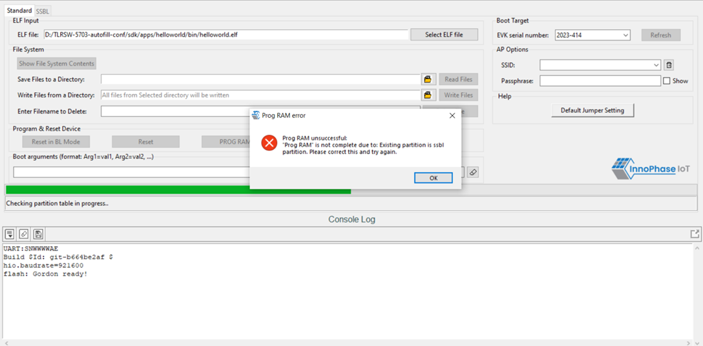
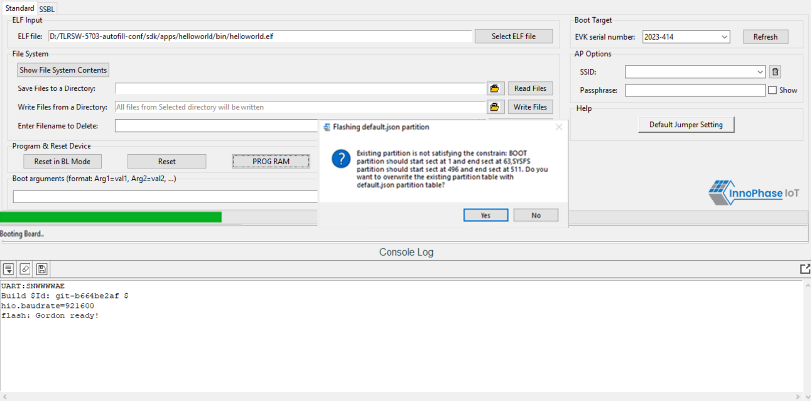
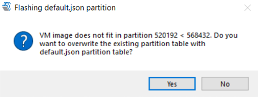
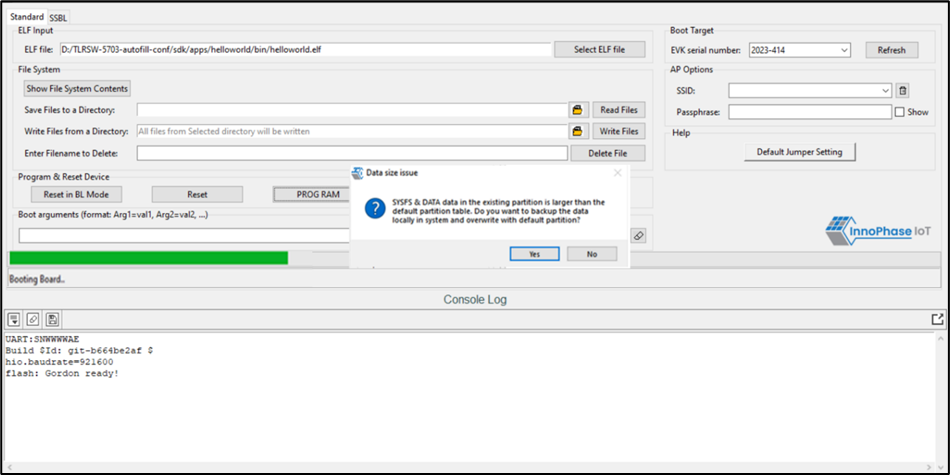
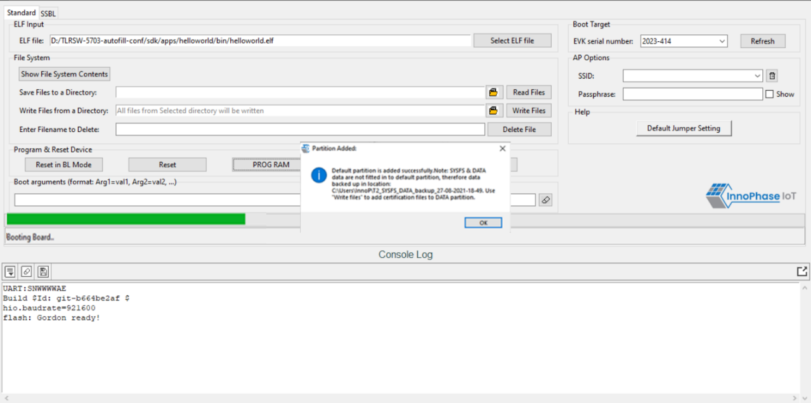
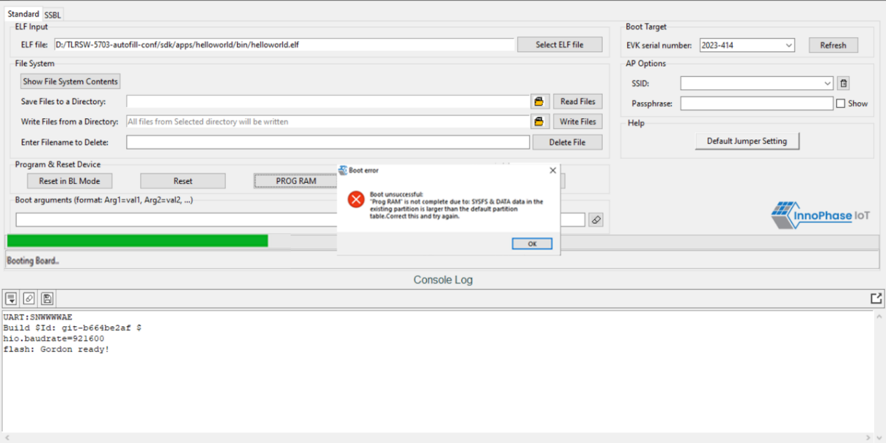
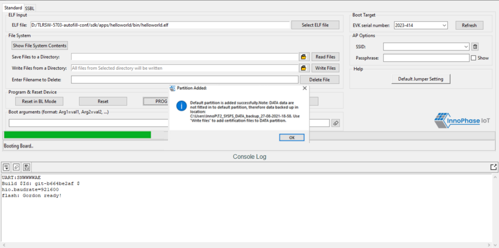
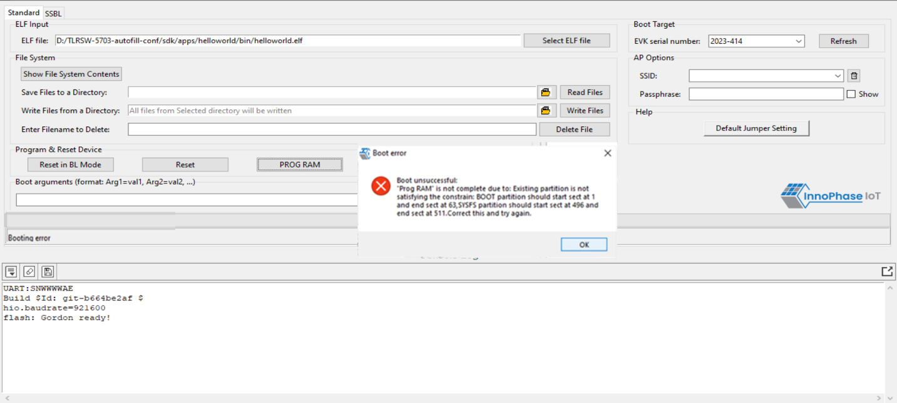
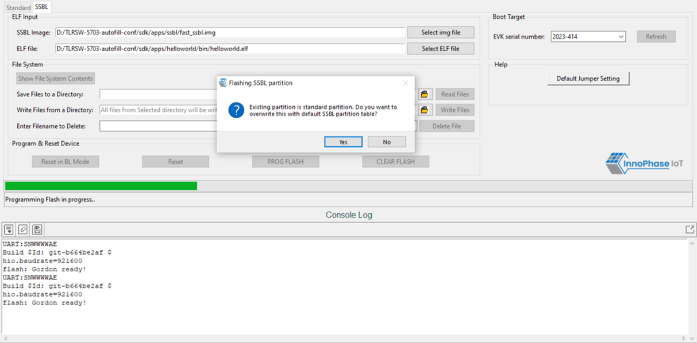
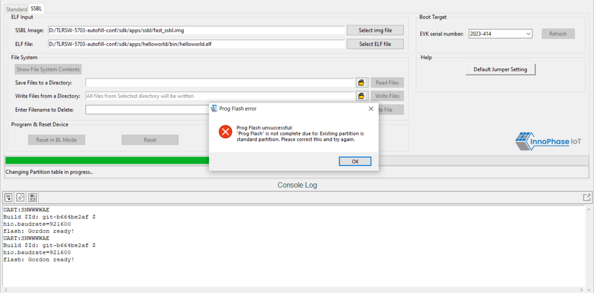

