Create AWS Security Credentials 
--------------------------------

Execute the following steps to create the AWS security credentials
required to enable video streaming:

1. Login to the AWS kinesis portal:
   https://us-east-1.console.aws.amazon.com/kinesisvideo/home?region=us-east-1#/dashboard

|image50|

.. rst-class:: imagefiguesclass
Figure 17: Login to AWS kinesis portal

2. Create a user group.

|image51|

.. rst-class:: imagefiguesclass
Figure 18: Create user group

3. Click on Create user.

|image52|

.. rst-class:: imagefiguesclass
Figure 19: Create user

4. Provide the new user name and click on Next.

|image53|

.. rst-class:: imagefiguesclass
Figure 20: Enter user name

5. Add the user to the user group created in step 2 and click Next.
   Ensure to provide access to the video streaming resources in the
   policy. For example:

.. code:: shell

    {
        "Version": "2012-10-17",
        "Statement":
        [
            {
            "Effect": "Allow",
            "Action": "\*",
            "Resource": "\*"
            }
        ]
    }

|image54|

.. rst-class:: imagefiguesclass
Figure 21: Extend permissions

6. Select the user created previously and click on Create access key.

|image55|

.. rst-class:: imagefiguesclass
Figure 22: Create access key for the user

7. Select the option Application running on an AWS compute service,
   check the confirmation box and click Next.

|image56|

.. rst-class:: imagefiguesclass
Figure 23: Application running on AWS compute service

8. Click on Create access key.

|image57|

.. rst-class:: imagefiguesclass
Figure 24: Create access key

9. Copy the generated access key, secret access key and click Done.

|image60|

.. rst-class:: imagefiguesclass
Figure 25: Access and secret access key

10. Click on the Kinesis Video Streams (search for Kinesis Video Streams
    in the search bar).

|image61|

.. rst-class:: imagefiguesclass
Figure 26: Kinesis video streams

11. Click on Create signaling channel.

|image62|

.. rst-class:: imagefiguesclass
Figure 27: Create signaling channel

12. Provide a name to the new signaling channel and click on Create
    signaling channel.

|image63|

.. rst-class:: imagefiguesclass
Figure 28: Enter signaling channel name

13. A new signaling channel will be created. Copy the Signaling channel
    ARN.

|image64|

.. rst-class:: imagefiguesclass
Figure 29: Signaling channel ARN

14. Upon successfully initiating video streaming from the Host, video
    streaming will be available under Media player viewer.

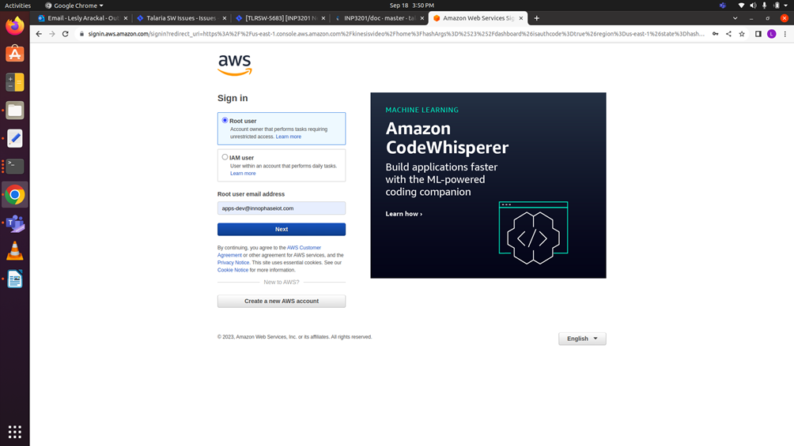
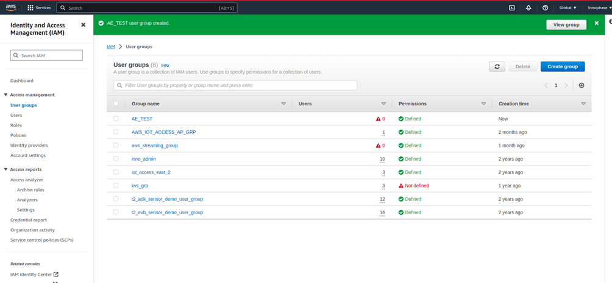
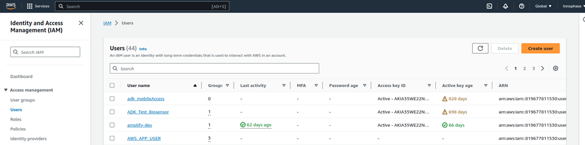
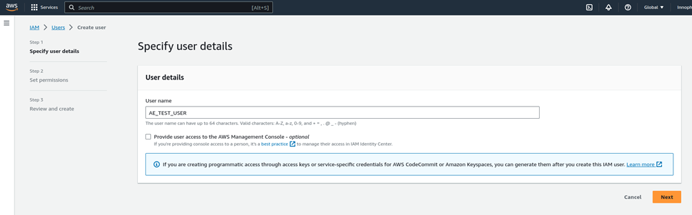
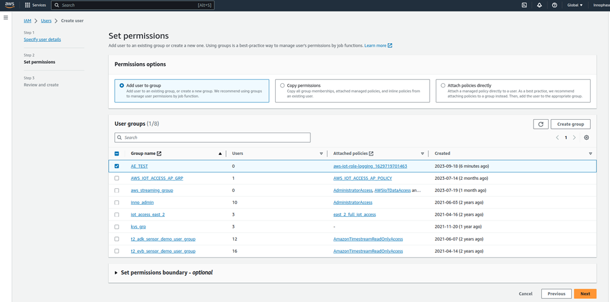
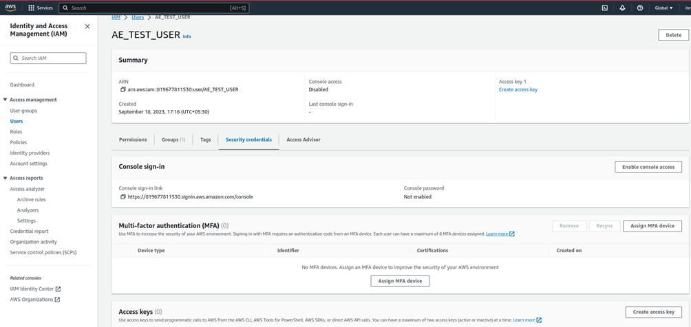
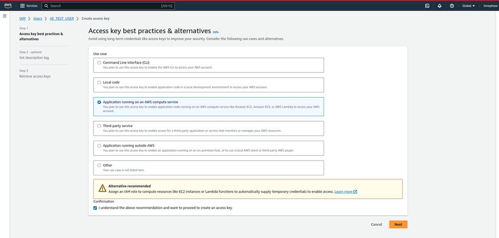
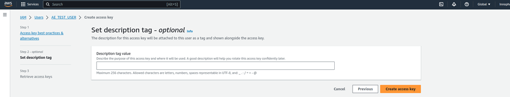
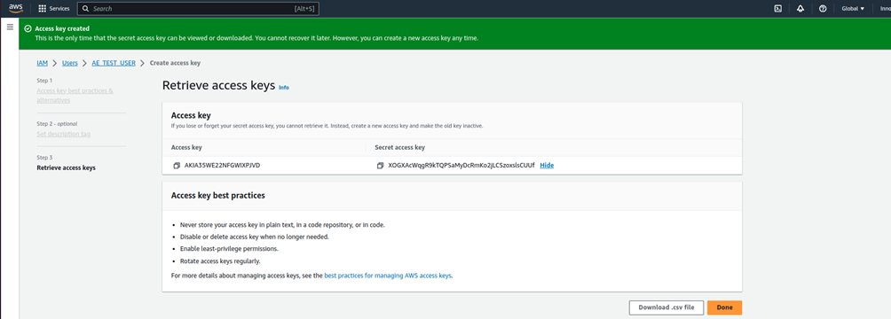
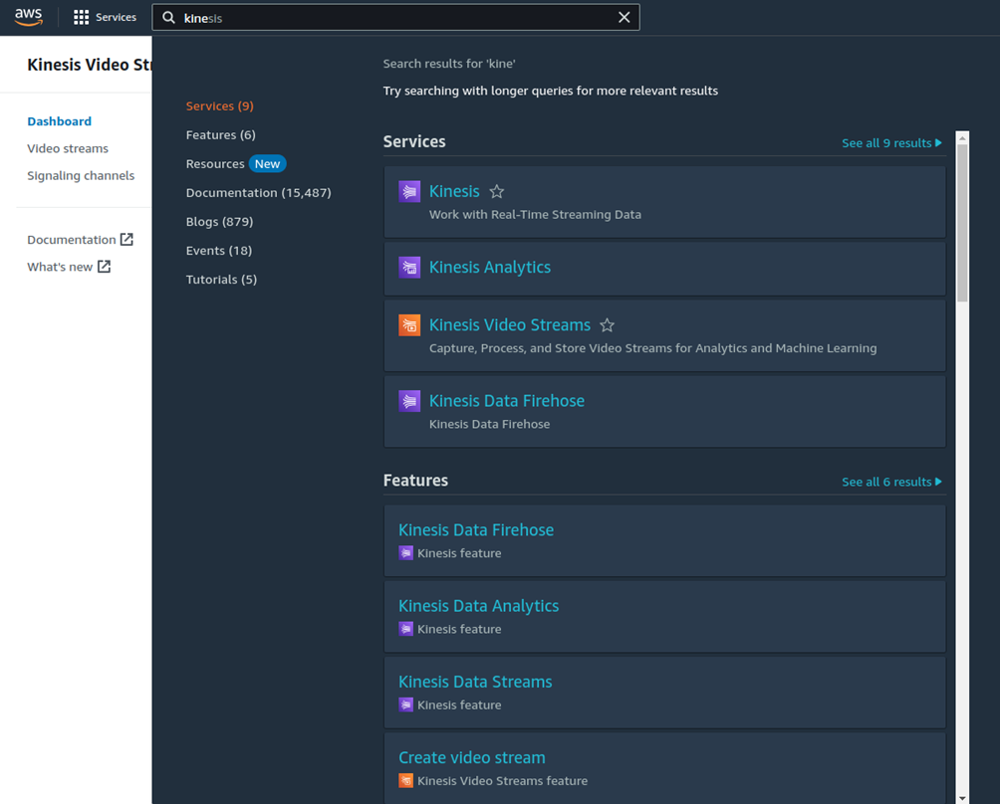
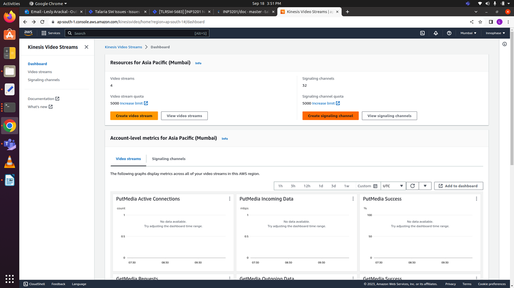
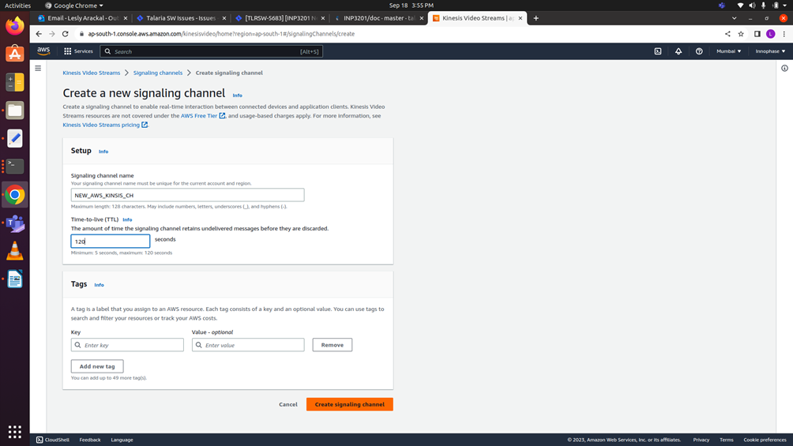
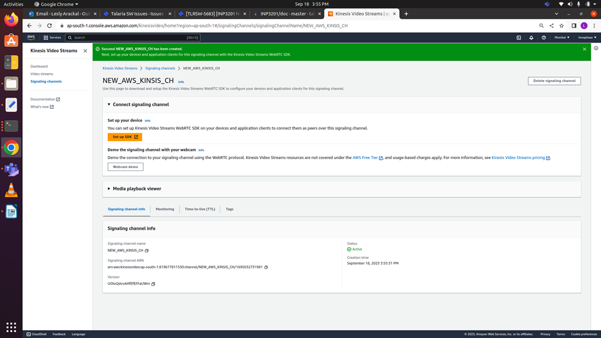

