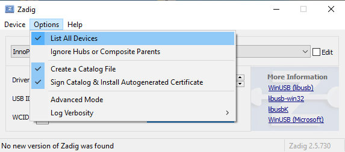
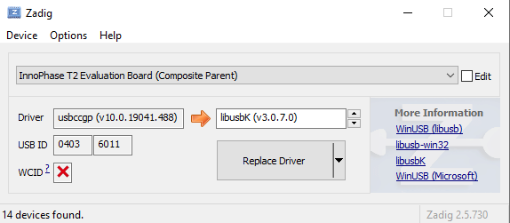

Installation Instructions for libusbK Driver
--------------------------------------------

Download the free software Zadig, available here: -
https://zadig.akeo.ie/\ **.** Connect your Windows PC or Laptop to the
evaluation board using the provided USB cable. Now, open Zadig and click
on Options. Select List All Devices and deselect Ignore Hubs or
Composite Parents as shown in Figure 8.

|A screenshot of a computer Description automatically generated|

.. rst-class:: imagefiguesclass
Figure 8: Listing devices in Zadig

To establish communication with Talaria TWO module via the FTDI device
on the InnoPhase Evaluation Board, the Talaria TWO USB driver must be
libusbK. In case the current driver is not libusbK, use the drop-down
menu to select libusbK and click on Replace Driver which will update the
drivers to libusbK.

|Graphical user interface, text, application, Word Description automatically generated|

.. rst-class:: imagefiguesclass
Figure 9: Updating Talaria TWO USB driver to libusbK

