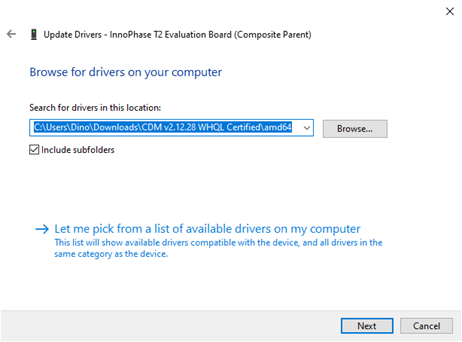

Update Driver from libusK Driver to COM Port
--------------------------------------------

To update and retrieve COM ports, follow the following steps:

1. Go to Device Manager. Expand the libusbK USB Devices and right click
   on the InnoPhase T2 Evaluation Board (Composite Parent). Click on
   Update Driver as shown in Figure 22.

|A screenshot of a social media post Description automatically generated|

Figure 22: Device Manager

2. On the new window, click on Let me pick from a list of available
   drivers on my computer option and click on Next.

|image1|

Figure 23: Update Devices

3. Select USB Composite Device and install the same for reinstalling COM
   posts.

|image2|

Figure 24: Select the device driver

