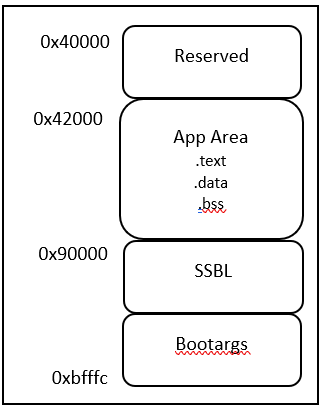
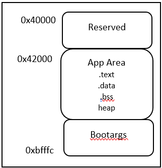
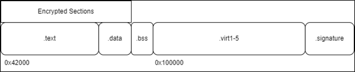
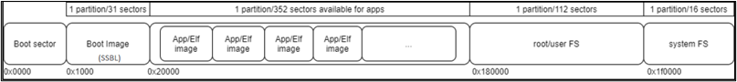
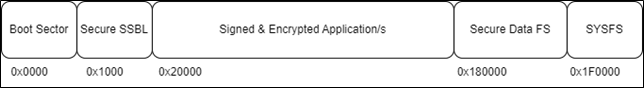
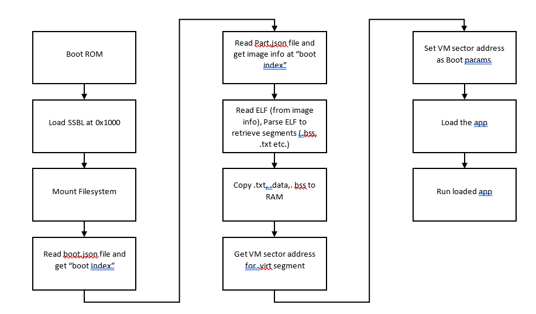
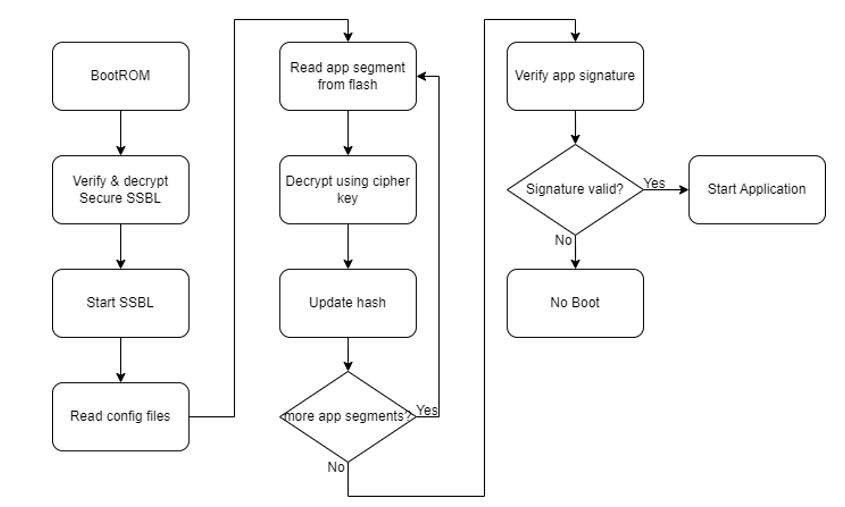
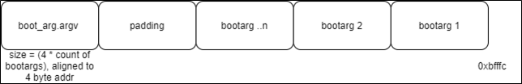
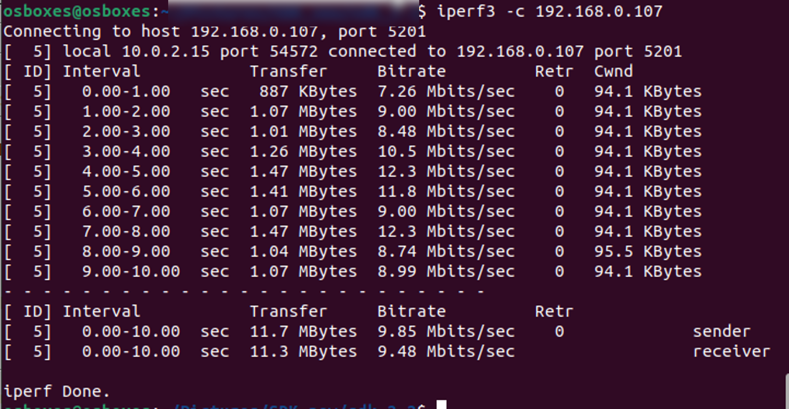

.. ssbl app:

Second Stage Boot Loader
-------------------------

The Second Stage Boot Loader (SSBL) is a part of firmware that can be
installed in Talaria TWO to enhance the flexibility of booting the
applications on the device. SSBL enables the following features on
Talaria TWO:

1. Selective boot of one of the applications loaded into flash.

2. Over the Air (OTA) update of applications (requires additional OTA
   application).

SSBL can be built with secureboot which provides a secure way of loading
encrypted and signed applications. This prevents loading of unauthorized
applications and performing a flash readout of application contents.

Description of Operation 
~~~~~~~~~~~~~~~~~~~~~~~~~~~~

The Second Stage Boot Loader (SSBL) is a special application written
onto Talaria TWO’s flash. On boot-up, the primary bootloader loads &
starts SSBL. SSBL reads the image index from the boot.json file, parses
the part.json file and picks the image information from the array index
read from boot.json file. SSBL then loads the image from the sector
mentioned in part.json onto RAM. Applications supported by SSBL are
stripped ELF files written to flash memory.

In case of secureboot mode, the configuration files are encrypted.

The memory layout mentioned in section 5.1 is for the RAM, where the
SSBL and the application triggered by SSBL are loaded onto the memory
for execution. Section 5.2 explains the flash layout where SSBL and
multiple applications can be stored in flash.

Memory Layout
~~~~~~~~~~~~~~~~~~~~~~~~~~~~

Figure 1 shows the memory layout when using SSBL.

|image46|

.. rst-class:: imagefiguesclass
Figure 1: Memory layout on loading the SSBL application

1. There is a total of 512KB RAM in Talaria TWO

   a. The RAM starts at 0x40000 and ends at 0xc0000.

2. User Application area

   a. Starts at 0x42000 to 0x90000.

   b. Contains application .text, .data and.bss sections.

3. Bootargs

   a. The memory location for bootargs is at 0xbfffc and it grows
      backwards.

4. SSBL area

   a. Starts at 0x90000.

|image47|

.. rst-class:: imagefiguesclass
Figure 2: Memory layout after loading the application

Figure 3 shows the signed and encrypted ELF memory layout when using
SSBL in secureboot mode.

|image48|

.. rst-class:: imagefiguesclass
Figure 3: Signed and encrypted ELF memory layout

1. In this case, only the .text and .data sections of the application
   ELF are encrypted.

2. The .virt segment cannot be encrypted. Ensure no sensitive code is
   placed in this section of the memory layout.

3. Code sections can be forced into .text by either specifying in the
   linker script or by adding \__ramcode in the function declaration.

.. table:: Table 1: SSBL Configuration Files

   +-----------------------------------------------------------------------+
   | int \__ramcode                                                        |
   |                                                                       |
   | main(void)                                                            |
   |                                                                       |
   | {                                                                     |
   |                                                                       |
   | ...                                                                   |
   +=======================================================================+
   +-----------------------------------------------------------------------+

Flash Layout
~~~~~~~~~~~~~~~~~~~~~~~~~~~~

Figure 4 shows the layout of flash memory when using the SSBL. To use
the SSBL, flash must contain at minimum the SSBL, the filesystem, and
one application.

|image49|

.. rst-class:: imagefiguesclass
Figure 4: Flash layout when using the SSBL

Figure 5 shows the layout of flash memory when using secure SSBL.

|image50|

.. rst-class:: imagefiguesclass
Figure 5: Flash layout for SSBL with secureboot

SSBL Operation Flow
~~~~~~~~~~~~~~~~~~~~~~~~~~~~

Non-Secure SSBL
~~~~~~~~~~~~~~~

Secureboot SSBL
~~~~~~~~~~~~~~~

|image51|

.. rst-class:: imagefiguesclass
Figure 6: Secureboot SSBL Flow Diagram

SSBL Configuration 
~~~~~~~~~~~~~~~~~~~~~~~~~~~~

SSBL is configured with JSON files present in the flash-based
filesystem. Table 1 provides a description of the relevant files and
their purpose. The contents of these files can be updated during
installation or by a running application to modify the behavior of SSBL.

+--------------+-------------------------------------------------------+
| **File**     | **Purpose**                                           |
+==============+=======================================================+
| part.json    | 1. Image table is a json array of applications’ image |
|              |    information. Each element in the image array gives |
|              |    information like image name starting sector of the |
|              |    elf, boot arguments and so on.                     |
|              |                                                       |
|              | 2. Application boot arguments                         |
|              |                                                       |
|              | 3. Additional SSBL options                            |
+--------------+-------------------------------------------------------+
| boot.json    | Json file stored in root/user FS. It contains the     |
|              | image index. This is the index in the image           |
|              | information array present in part.json file. SSBL     |
|              | gets the index of the image to be loaded from this    |
|              | file.                                                 |
+--------------+-------------------------------------------------------+

**Note**: For SSBL in secureboot mode, the configuration files are
encrypted.

**part.json**

.. code:: shell

    {
    "image"   : [
        {
            "name"  : "iperf_vm",
            "version" : "1.0",
            "start_sector"  : 32,
            "bootargs_start": 1,
            "ssid" : "innotest",
            "passphrase" : "123467890",
            "bootargs_end" : 1
        },
        {
            "name"  : "hello_world",
            "version" : "1.0",
            "start_sector"  : 232,
            "bootargs_start": 1,
            "ssid" : "innotest",
            "passphrase" : "123467890",
            "bootargs_end" : 1
        }
    ],
        "baudrate": 2560000,
        "timeout" : 0,
        "verbose" : 1
    }

1. General parameters:

   a. baud – baud rate used by SSBL when using hio

   b. timeout – timeout used by SSBL when using hio

   c. verbose – verbosity mode

   d. image []: image information

2. Image information:

   a. name: name of application

   b. version: version number of applications

   c. sector: start sector of image in flash

   d. bootargs_start: The following objects will be boot params

   e. bootargs_end: end of boot arguments

**boot.json**

.. code:: shell

    boot.json
    {    image : 0
    }

where,

image – The image to boot from part.json

SSBL Boot Arguments 
~~~~~~~~~~~~~~~~~~~~~~~~~~~~

SSBL can pass boot arguments (bootargs) to an application by utilizing
the filesystem. SSBL reads the bootargs from the part.json file and
stores the bootargs at memory location 0xbfffc where it grows backwards.
The size occupied by the bootargs is dependent on the length and count
of the bootargs read from the filesystem. Figure 8 shows how they are
stored in memory.

|image52|

.. rst-class:: imagefiguesclass
Figure 7: SSBL Bootargs stored in memory

Building Components
~~~~~~~~~~~~~~~~~~~~~~~~~~~~

This section describes building the required components for SSBL.

Creating File System (root.img) file
~~~~~~~~~~~~~~~~~~~~~~~~~~~~

The root folder at <freertos_sdk>/root_fs contains the files which will
be put into the filesystem image to be flashed onto Talaria TWO. Before
building the filesystem image for the first time, the configuration
files need to be updated based on the applications to be loaded and the
users requirement for using SSBL (refer section 5.3.2).

Once the SSBL configuration files are updated, run the following
commands to build the filesystem image.

.. _non-secure-ssbl-1:

Non-secure SSBL
~~~~~~~~~~~~~~~

For non-secure SSBL, filesystem files come from <freertos_sdk>/root_fs
and the application’s <app>/fs directory. The path to the application
directory is provided in the following command, and the filesystem image
is generated as root.img.

For the purpose of this application note, the root.img is created at:
*freertos_sdk_x.y/apps/ssbl*.

**Note**: x and y refer to the SDK release version.

.. code:: shell

    cd <freertos_sdk>
    python3 ./script/build_rootfs_generic.py --folder_path apps/ssbl

**Note:**

If there is no fs directory present in the application, then the files
from <freertos_sdk>/root_fs are taken into the filesystem image by
default.

If there are files with the same name present in application’s fs
directory and <freertos_sdk>/root_fs, then the files from application’s
fs are taken into the filesystem image.

.. _secureboot-ssbl-1:

Secureboot SSBL
~~~~~~~~~~~~~~~

For secureboot SSBL, filesystem files come from <freertos_sdk>/root_fs
and the application’s <app>/fs_secure directory. The path to the
application directory is provided in the following command, and the
filesystem image is generated as root_secure.img.

For the purpose of this application note, the secureboot SSBL is
demonstrated for the application example/secure_files.

.. code:: shell

    cd <sdk>
    python3 ./script/build_rootfs_generic.py --folder_path examples/secure_files/ --secure True --keyfile ./apps/ssbl/enroll.json

**Note:**

If there is no fs_secure directory present in the application, then the
files from <freertos_sdk>/root_fs are taken into the filesystem image by
default.

If there are files with the same name present in application’s fs_secure
directory and <freertos_sdk>/root_fs, then the files from application’s
fs_secure are taken into the filesystem image.

Building SSBL
~~~~~~~~~~~~~~~~~~~~~~~~~~~~

.. _non-secure-ssbl-2:

Non-secure SSBL
~~~~~~~~~~~~~~~

   Create SSBL binary for non-secure usecase as: *apps/fast_ssbl.img*.

.. code:: shell

    cd <freertos_sdk>/apps/ssbl/
    make clean
    make

.. _secureboot-ssbl-2:

Secureboot SSBL
~~~~~~~~~~~~~~~

1. For emulating/testing SecureSSBL in development, generate combined
   "First" application and SSBL.

.. code:: shell

    cd <freertos_sdk>/apps/ssbl/
    make clean
    make KEY=enroll.json SECUREBOOT=1 DEBUGSECURE=1

..

   This creates the SSBL binary for secureboot emulation usecase as -
   *apps/ssbl/out/both.img*

2. For production:

.. code:: shell

    cd <freertos_sdk>/apps/ssbl/
    make clean
    make KEY=enroll.json SECUREBOOT=1

..

   This creates SSBL binary for secureboot production usecase as -
   *apps/ssbl/out/ssbl_secure.img*

Flashing Components 
~~~~~~~~~~~~~~~~~~~~~~~~~~~~

After the SSBL, filesystem, and applications have been built, follow the
instructions in this section to flash the components onto Talaria TWO.

**Note**: If Talaria TWO has been flashed before, connect GPIO17 to
ground on the peripheral header of the EVK, then press and release reset
before following the instructions here. This will inhibit flash boot and
allow the flash helper to be loaded, provided the fuses have not already
been blown.

.. _non-secure-ssbl-3:

Non-secure SSBL
~~~~~~~~~~~~~~~~~~~~~~~~~~~~

Flashing
~~~~~~~~

Before flashing Talaria TWO, ensure that an appropriate SSBL is
generated after executing a make clean, as instructed in section 6.2.

The following commands will write the SSBL and other components to
flash. Run the commands from the <freertos_sdk> directory:

**Load flash helper**

.. code:: shell

    cd <freertos_sdk>
    ./script/boot.py --device /dev/ttyUSB2 --reset=evk42_bl ./apps/gordon.elf

**Invalidate the boot Image**

.. code:: shell

    cd <freertos_sdk>
    dd if=/dev/zero of=./empty.img bs=1K count=1
    ./script/flash.py --device /dev/ttyUSB2 write 0x1000 ./empty.img

**Write partition**

.. code:: shell

    cd <freertos_sdk>
    ./script/flash.py --device /dev/ttyUSB2 from_json ./tools/partition_files/ssbl_part_table.json

**Flash SSBL**

.. code:: shell

    cd <freertos_sdk>
    ./script/flash.py --device /dev/ttyUSB2 write 0x1000 ./apps/ssbl/fast_ssbl.img

**Flash filesystem**

.. code:: shell

    cd <freertos_sdk>
    ./script/flash.py --device /dev/ttyUSB2 write 0x180000 ./apps/ssbl/root.img

**Flash apps**

For the purpose of this application note, the non-secure SSBL is
demonstrated for the applications *apps/hello-world* and *bins/iperf3*.
Applications supported by the SSBL are stripped ELF files written to
flash memory.

Use following commands to strip the application ELFs

.. code:: shell

    cd <freertos_sdk>
    arm-none-eabi-strip --strip-all ./bins/iperf3.elf -o ./bins/iperf3.elf.strip
    arm-none-eabi-strip --strip-all ./apps/hello_world/bin/hello_world.elf -o ./apps/hello_world/bin/hello_world.elf.strip

iPerf3 should be flashed to 0x2000 (which is start_sector 32 as
mentioned in part.json), while hello_world.elf should be flashed to
0xE8000 (which is start_sector sector 232).

.. code:: shell

    cd <freertos_sdk>
    ./script/flash.py --device /dev/ttyUSB2 write 0x20000 ./bins/iperf3.elf.strip

    ./script/flash.py --device /dev/ttyUSB2 write 0xE8000 ./apps/hello_world/bin/hello_world.elf.strip

..

   Open miniterm at baud rate of 2457600 and reset the EVB.

.. code:: shell

    osboxes@osboxes:~$ miniterm.py /dev/ttyUSB3 2457600
    --- Miniterm on /dev/ttyUSB3  2457600,8,N,1 ---
    --- Quit: Ctrl+] | Menu: Ctrl+T | Help: Ctrl+T followed by Ctrl+H ---

Reset the board either by executing the following command or by pressing
the reset button on the EVB to run the iPerf3 application.

.. code:: shell

    cd <freertos_sdk>
    ./script/boot.py --device /dev/ttyUSB2 --reset=evk42

Expected Output
~~~~~~~~~~~~~~~

.. code:: shell

    Y-BOOT 208ef13 2019-07-22 12:26:54 -0500 790da1-b-7
    ROM yoda-h0-rom-16-0-gd5a8e586
    FLASH:PWAEWWWWAE Build $Id: git-a74c874 $
    Flash detected. flash.hw.uuid: 39483937-3207-0051-002a-ffffffffffff

    Build $Id: git-a74c874 $
    Flash detected. flash.hw.uuid: 39483937-3207-0051-002a-ffffffffffff
    Bootargs: vm.flash_location=0x00034c00 sys.reset_reason=1 passphrase=1234567890 ssid=innotest
    [0.024,055] rfdrv: unknown module type (0)
    addr f8:e9:43:d2:00:e7
    network profile created for ssid: innotest
    [1.535,586] CONNECT:60:32:b1:33:b5:7b Channel:11 rssi:-37 dBm
    [4.370,448] MYIP 192.168.0.107
    [4.370,495] IPv6 [fe80::fae9:43ff:fed2:e7]-link
    IPerf3 server @ 192.168.0.107

    Iperf3 TCP/UDP server listening on 5201
    Run iPerf3 client for this application.

|image63|

.. rst-class:: imagefiguesclass
Figure 9: iPerf3 Client

Changing root.img to Run the Other Application
~~~~~~~~~~~~~~~~~~~~~~~~~~~~~~~~~~~~~~~~~~~~~~

To run the hello_world application, make changes in
*<freertos_sdk>/root_fs/root/boot.json* to boot the image at index 1.

.. code:: shell

    boot.json
    {    image : 1    }

Execute the following command to regenerate the root.img at:
*<freertos_sdk>/apps/ssbl*

.. code:: shell

    cd <freertos_sdk>
    python3 ./script/build_rootfs_generic.py --folder_path apps/ssbl

Flash the newly generated root.img

.. code:: shell

    cd <freertos_sdk>
    ./script/flash.py --device /dev/ttyUSB2 write 0x180000 ./apps/ssbl/root.img

On reboot, the hello_world application will be loaded.

Secure SSBL
~~~~~~~~~~~~~~~~~~~~~~~~~~~~

.. _flashing-1:

Flashing
~~~~~~~~

Before flashing Talaria TWO, ensure that an appropriate SSBL is
generated after executing make clean, as instructed in section 6.2.

The following commands will write the SSBL and other components to
flash. Run the commands from the <freertos_sdk> directory:

1. Load flash helper

.. code:: shell

    cd <freertos_sdk>
    ./script/boot.py --device /dev/ttyUSB2 --reset=evk42_bl ./apps/gordon.elf

2. Invalidate boot image

.. code:: shell

    cd <freertos_sdk>
    dd if=/dev/zero of=./empty.img bs=1K count=1
    ./script/flash.py --device /dev/ttyUSB2 write 0x1000 ./empty.img

3. Enroll keys

   a. For emulating/testing SecureSSBL in development, without burning
      the fuse

.. code:: shell

    cd <freertos_sdk>/apps/ssbl/
    ../../script/flash.py enroll --keyfile=enroll.json --secureboot puf --fuse-location emulated

b. For production SecureSSBL and burning the fuse

.. code:: shell

    cd <freertos_sdk>/apps/ssbl/
    ../../script/flash.py enroll --keyfile=enroll.json --secureboot puf --fuse-location one-time-programmable-fuses

4. Flash SSBL partition table

.. code:: shell

    cd <freertos_sdk>
    ./script/flash.py from_json tools/partition_files/ssbl_part_table.json

5. Flash SSBL image at 0x1000

   a. For emulating/testing SecureSSBL in development

.. code:: shell

    cd <freertos_sdk>
    ./script/flash.py --device /dev/ttyUSB2 write 0x1000 ./apps/ssbl/out/both.img

b. For production SecureSSBL

.. code:: shell

    cd <freertos_sdk>
    ./script/flash.py --device /dev/ttyUSB2 write 0x1000 ./apps/ssbl/out/ssbl_secure.img

6. Build application and filesystem

..

   For the purpose of this application note, secureboot SSBL is
   demonstrated for the application *example/secure_files.*

a. Build the example/secure_files application

.. code:: shell

    cd <freertos_sdk>/examples/secure_files/
    make clean
    make KEY=../../apps/ssbl/enroll.json

..

   This creates a signed and encrypted application binary
   examples/secure_files/out/secure_files.elf.enc

b. Filesystem image for this application is created using following
   command.

.. code:: shell

    cd <freertos_sdk>
    python ./script/build_rootfs_generic.py --folder_path examples/secure_files/ --secure True --keyfile ./apps/ssbl/enroll.json

..

   This creates a root image binary
   examples/secure_files/root_secure.img

7. Flash application at 0x20000

.. code:: shell

    cd <freertos_sdk>
    ./script/flash.py --device /dev/ttyUSB2 write 0x20000 ./examples/secure_files/out/secure_files.elf.enc

8. Flash filesystem at 0x180000

.. code:: shell

    cd <freertos_sdk>
    ./script/flash.py --device /dev/ttyUSB2 write 0x180000 ./examples/secure_files/root_secure.img

9. Reset the board

..

   Reset the board either by executing the following command or by
   pressing the reset button on the EVB to run ‘secure_files’
   application.

.. code:: shell

    cd <freertos_sdk>
    ./script/boot.py --device /dev/ttyUSB2 --reset=evk42

.. _expected-output-1:

Expected Output
~~~~~~~~~~~~~~~~~~~~~~~~~~~~

When DEBUGSECURE=1

.. code:: shell

    Y-BOOT 208ef13 2019-07-22 12:26:54 -0500 790da1-b-7
    ROM yoda-h0-rom-16-0-gd5a8e586
    FLASH:PNWWAE
    FIRST:SWWWWAHE
    Si
    Build $Id: git-a74c874 $
    Flash detected. flash.hw.uuid: 39483937-3207-0051-002a-ffffffffffff

    ***Warning! Make sure to remove this code section once in production***
    secureboot_secret:
    8b5678a045ba66b7ea956d3292aae8dc29ded8de9010efd40980a091734b786b11000000

    ***Warning! Make sure to remove this code section once in production***
    cipher key: 4e3b0b9792183c53ecc78a38c64a45c071b97bc40b0baba308ed76db8a46cef1
    public key: 20b003d2f297be2c5e2c83a7e9f9a5b9eff49111acf4fddbcc0301480e359de6dc809c49652aeb6d63329abf5a52155c766345c28fed3024741c8ed01589d28b
    Build $Id: git- a74c874 $
    Flash detected. flash.hw.uuid: 39483937-3207-0051-002a-ffffffffffff
    Bootargs: vm.flash_location=0x0002d900 passphrase=12346789ssid=innotest
    sys.reset_reason=1

Application Information:
------------------------
Name       : Secure files demo application
Version    : 1.0
Build Date : Aug 26 2023
Build Time : 18:50:21
Heap Available: 402 KB (411896 Bytes)

Original message: Hello! This is a plain text file.
Writing message to encrypted file
Reading file as ciphertext
Cipher text message: 1~␒M}rQo앺{AÛ␒*_/rY0
Reading and decrypting file
Plain text message: Hello! This is a plain text file.

