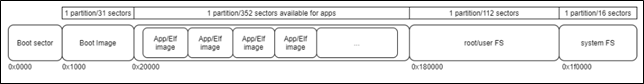
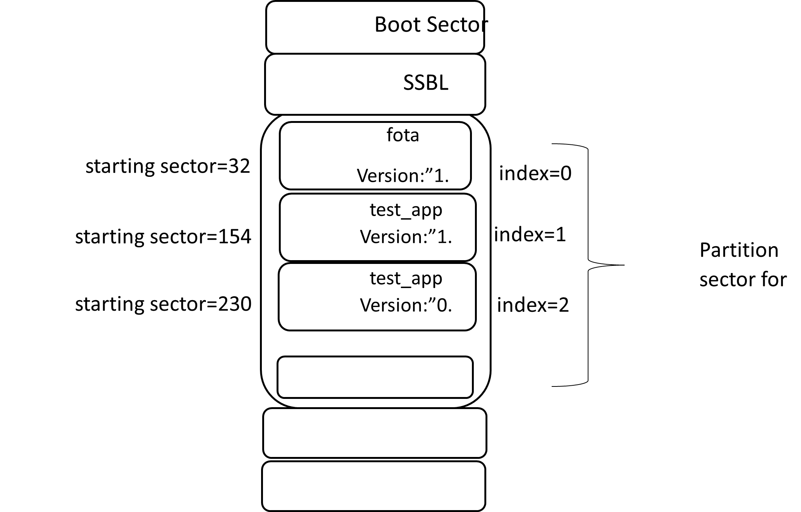
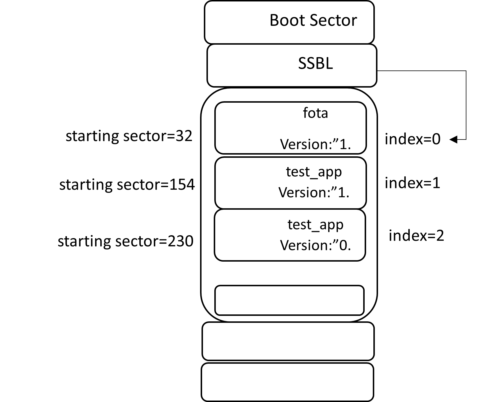

.. _fota app:

Firmware Over The Air Application
----------------------

Firmware-Over-the-Air (FOTA) allows wireless delivery of firmware
updates and/or configurations to embedded devices.

This document describes the FOTA process for the Talaria TWO EVB using
the Talaria TWO SDK with details on how to implement or trigger FOTA in
a customer provided application.

Topology
~~~~~~~~~~~~~~~~~~~~~~~~~~~~
|image55|

Figure 1: Topology

Overview 
~~~~~~~~~~~~~~~~~~~~~~~~~~~~

This implementation of FOTA provides the following features:

1. Check for the availability of new upgrades.

2. Securely download the image into flash.

3. Check the validity of the downloaded image.

4. Set the new image as the boot image.

In conjunction with SSBL, it enables booting the latest image
downloaded. The firmware is downloaded into the application image
partition in the Flash.

List of APIs
~~~~~~~~~~~~~~~~~~~~~~~~~~~~

1. fota_init(): Initializes the FOTA module.

2. fota_perform(): Performs the FOTA update.

3. fota_commit(): After the FOTA update is done, this function is called
      to set the newly updated firmware as the default.

4. fota_deinit(): Releases all the resources allocated during
      fota_init() and other FOTA API calls.

For more information on the APIs, refer: fota_apiref.pdf

Features & Limitations 
~~~~~~~~~~~~~~~~~~~~~~~~~~~~

Following are the FOTA application features:

1. FOTA over HTTP/HTTPS.

2. Image download from Cloud or any HTTP/web server.

3. Two copy solution. Backup copy of the correct firmware always exists.

4. Image integrity check using sha256 hash.

5. Error handling and recovery

   a. In case of any error while downloading the image or updating the
      configuration files (*part.json/boot.json/fota_config.json*), the
      device will remain in the current image.

   b. In case of a reboot (due to issues like power failure) during
      image download or configuration file upgrade, the device will boot
      with the current image.

6. JSON based configuration.

Dependent Talaria TWO Module Information 
~~~~~~~~~~~~~~~~~~~~~~~~~~~~

This section provides a list of modules in Talaria TWO on which FOTA is
dependent. It is important to understand these concepts before
proceeding with the design aspects of the FOTA.

Flash Layout
~~~~~~~~~~~~~~~~~~~~~~~~~~~~

About Talaria TWO Flash:

1. Size: 2MB

2. 512 sectors

3. 4096 bytes/sector

4. 256-byte page

Flash is divided into eight partitions. Partition table information is
stored in the Boot sector. Each partition has a starting sector and a
sector count, along with a type, and some control bits. No two
partitions overlap. The reason for using sector addressing is so that
partitions can be independently erased.

Figure 2 provides the proposed layout of Flash memory when using SSBL.
To use SSBL, Flash must at least contain SSBL, filesystem, and one
application.

|image56|

.. rst-class:: imagefiguesclass
Figure 2: Flash layout when using the SSBL

The Boot Image is the default application that Talaria TWO’s boot ROM
would look for when a Talaria TWO device is powered ON. To support FOTA,
SSBL shall run as Boot image. SSBL is a special application that
determines the final application to load. In a nutshell, on power cycle,
the boot ROM boots the SSBL application which in turn loads the final
application

For detailed documentation on Flash layout, refer:
Application_for_using_SSBL.pdf

Partition Table File (part.json)
~~~~~~~~~~~~~~~~~~~~~~~~~~~~

This is a json file that provides the partition information of the
application images in the Flash. The file is stored in root/user FS
(*freertos_sdk_x.y/apps/fota/fs*). This file mainly contains an array of
image information (represented by the name **image:**).

Each of the image information entry in the array gives image name,
version, starting sector and other information about the application.
Following is the basic content:

.. code:: shell

    {
    "image"   : [
    {
    "name"  : "fota",
    "version" : "1.0",
    "start_sector"  : 32,
    "bootargs_start": 1,
    "ssid" : "inno_test",
    "passphrase" : "1234567890",
    "bootargs_end" : 1
    },
    {
    "name"  : "test_app",
    "version" : "1.0",
    "start_sector"  : 154,
    "bootargs_start": 1,
    "ssid" : "inno_test",
    "passphrase" : "1234567890",
    "bootargs_end" : 1
    },
    {
    "name"  : "test_app",
    "version" : "0.0",
    "start_sector"  : 230,
    "bootargs_start": 1,
    "ssid" : "inno_test",
    "passphrase" : "1234567890",
    "bootargs_end" : 1
    }
    ],
    "baudrate"    : 2560000,
    "timeout" : 0,
    "verbose" : 1
    }

In the part.json file from the above example, the start sector
computation for applications can be done as:

The start sector for the first application (FOTA) in the partition table
is 32. For the next consecutive applications (test_app), start sector
can be calculated based on the size of ELF i.e.,

For example, if the size of FOTA ELF = 519356.

Start sector of FOTA application = 32.

Total number of sectors needed for FOTA application: 519356/4096=122
sectors, where 4096 is the size of one sector.

The next application, “test_app” start sector can be flashed on or after
32+122 sectors = 154th sector.

Boot Index File (boot.json)
~~~~~~~~~~~~~~~~~~~~~~~~~~~~

This is a json file stored in root/user FS. It contains the image index.
This is the index in the image information array present in part.json
file. SSBL gets the index of the image to be loaded from this file.

Following is the content:

.. code:: shell

    {
    image : 0
    }

FOTA Configuration File (fota_config.json)
~~~~~~~~~~~~~~~~~~~~~~~~~~~~

The FOTA configuration file fota_config.json is a json file. This file
is stored in the root/user FS in Flash. The FOTA module gets all the
information required to download the Firmware or a file.

Each object in this file shall give information about the file to be
downloaded. Each object will have the following tokens:

1. type: Type of the file. It can be firmware or file

2. name: Name of the firmware image/ file

3. hostname: Fully Qualified domain name of the server

4. port: Server port

5. uri: This is the location of the firmware/file in the cloud

6. secured: Value for this token will be 2 if the connection is secure
   with server authentication, else 1

7. ca_cert: Certificate file name

8. hash: Hash used for checking the integrity of the firmware/file

Following is the basic content of the file:

.. code:: shell

    {
    "package_version"    : "1.0",
    "files"   : [
    {
    "type" : "configuration",
    "name" : "fota.config",
    "hostname" : "innotestota.s3.us-east-2.amazonaws.com",
    "port" : 443,
    "secured" : 2,
    "uri" : "/fota_config.json",
    "ca_cert" : "/data/fota_ca_cert.pem"
    },
    {
    "type" : "firmware",
    "name" : "test_app",
    "hostname" : "innotestota.s3.us-east-2.amazonaws.com",
    "port" : 443,
    "secured" : 2,
    "uri" : "/test_app.elf",
    "ca_cert" : "/data/fota_ca_cert.pem"
    }
    ]
    }

The group of Firmware and files and its information present in this file
is considered as a package. Each fota_config.json file will have a
package version at the top. The array of objects will provide
information about firmware and files considered as one package.

The package_version provides the version of the package. There will be a
fota_config.json file in the Cloud. If the package_version of the
fota_config.json file present in the Cloud is greater than that of the
file currently present in the device, FOTA needs to be done.

The first object shall give the information about the fota_config.json
file available on Cloud. Device can fetch the file and see if a package
with a higher version is available. The Firmware will be downloaded in
the application partition and files will be stored in root/user FS.

Secure Secondary Boot Loader (SSBL)
~~~~~~~~~~~~~~~~~~~~~~~~~~~~

SSBL is an application that facilitates booting a specific image from
the flash. On boot, the boot-ROM loads & starts SSBL. SSBL reads the
image index from the boot.json file. It parses the part.json file and
picks the image info in the image info array at the index read from
boot.json file. The SSBL then loads and runs the image at the sector
provided by this image information.

For detailed information about the SSBL design, refer:
Application_for_using_SSBL.pdf (*freertos_sdk_x.y/apps/ssbl/doc/*).

Design
======

FOTA process involves the following components:

1. Parsing the FOTA configuration file

2. Checking for the new updates

3. Selecting image area

4. Secured connection

5. Downloading the Firmware

6. Error handling

Checking for New Updates
~~~~~~~~~~~~~~~~~~~~~~~~~~~~

For checking new updates, module fetches the fota_config.json file from
the cloud. The package version of the downloaded file is compared
against the fota_config.json file already present in the device. If the
version is higher, FOTA needs to be done.

This functionality is optional, and the step can be skipped if an
external application like Mobile Application does the check and
provisions the device to trigger the FOTA. The functionality is provided
through API for the applications to be used for polling.

Selecting Image Area
~~~~~~~~~~~~~~~~~~~~~~~~~~~~

This logic will parse the part.json file and selects the image area in
flash for downloading the image.

Each application that can be upgraded using FOTA will have a unique name
in the image information table. Multiple image information entries for
the same application will have the same name. That is, each such
application will have at-least two slots in the table.

For example, if there is an application called app_image, there will be
two entries in the image information table with the same name. There
will be a minimum of two entries for an application which can be
upgraded using FOTA.

The version field in the image information shall represent the FOTA
version and not the application release version. The selection logic
will go through all the entries for a given application and selects area
(image information) with least version number.

For example, if one entry for app_image has version 1 and its starting
sector is 66 and other entry for the same application has the version 0
and its starting sector is 166, the first entry will be selected for
FOTA image download. The new image will be downloaded at sector 66.

Each time after FOTA succeeds, the version number for the selected image
information is changed to one more than the highest currently available
version, so that the newer version will always have the highest version
number.

Secured Connection 
~~~~~~~~~~~~~~~~~~~~~~~~~~~~

The fota_config.json file provides the following information for
connection and download:

1. Server IP/ DNS

2. Port number

3. Firmware location on the server (URI)

4. Root CA certificate to authenticate the server at the time of SSL
   connection

If the DNS name is provided, DNS will be resolved. The root CA
certificate as indicated in the fota_config.json file will be present in
the root/user FS. HTTPS connection will be established with the server.
The connection will be secured using Transport Layer Security (TLS1.2).

Downloading the Firmware
~~~~~~~~~~~~~~~~~~~~~~~~~~~~

Once the HTTPS connection is successfully established, the image is
downloaded using HTTP GET. The URI of the Firmware as provided in the
fota_config.json file is used during the GET. The image is downloaded
into flash at the location selected as detailed in section 9.2.

After successful download, image is authenticated using the certificate
indicated by ca_cert field in fota_config.json file. This will also
ensure that the integrity of the image is intact. This certificate will
be present in the root/user FS.

Setting the new image for boot and reload
~~~~~~~~~~~~~~~~~~~~~~~~~~~~

If the image integrity of the downloaded image is found to be intact,
version number of the selected image information in part.json file will
be increased by one more than the highest version currently in use.
Finally, image index in boot.json file will be updated with the index of
the selected image information and the device is reset. After reboot,
SSBL will automatically load the newly downloaded image.

Error handling
~~~~~~~~~~~~~~~~~~~~~~~~~~~~

The FOTA alternates the image download between two application image
area in flash. At any point of time there will at-least one proper
application image (currently running). This acts as a backup/fallback
image in case FOTA fails. The boot image index in boot.json file is
changed to point to the new image only at the last step of FOTA after
the integrity of the downloaded image is found to be intact.

At any point of time if the error occurs, the procedures can be retried.
The procedure will be retried for FOTA_MAX_RETRIES multiple times before
giving up. If FOTA is not successful, the currently available stable
image will run.

Flow Diagram
~~~~~~~~~~~~~~~~~~~~~~~~~~~~

|image57|

.. rst-class:: imagefiguesclass
Figure 3: Flow Diagram

Continued from the previous flow diagram:

|image58|

.. rst-class:: imagefiguesclass
Figure 4: Flow Diagram - continued

Code Walkthrough
~~~~~~~~~~~~~~~~~~~~~~~~~~~~

Initializing FOTA
~~~~~~~~~~~~~~~~~

The fota_init() API initializes the FOTA module. This will be called
before any other FOTA APIs.

fota_init_param needs to be initialized appropriately before passing it
onto the fota_init() function. Following is the definition for
fota_init_param:

.. code:: shell

    typedef struct {
    uint32_t *cipher_key; /**cipher key used with secureboot*/
    }fota_init_param_t;

cipher_key in fota_init_param will be NULL in case of non-secureboot. In
case of secureboot, this should be initialized appropriately.

.. code:: shell

    fota_handle_t *handle;
    fota_init_param_t *fota_init_param;
    handle=fota_init(&fota_init_param);

FOTA Perform
~~~~~~~~~~~~

The fota_perform() API parameter check_for_update==1 downloads the
remote fota_config.json file, compares the package version with the
local fota_config.json file, and only perform FOTA if the package
version on the cloud is higher than the one present on device.

.. code:: shell

    int
    fota_perform(fota_handle_t *f_handle, int check_for_update,
         int flags)
    {
    fota_files_info_t *files_info;
    int ret = FOTA_ERROR_NONE;
    int update_available;

    os_printf("\n%s check_for_update = %d",
                __FUNCTION__, check_for_update);
    if(check_for_update == 1)
    {
    ret = fota_update_check(f_handle, &update_available);
    if(ret){
        os_printf("\nError: fota_update_check");
        return ret;
    }
    if(!update_available){
        os_printf("\nError: No new update available");
        return FOTA_ERROR_NO_NEW_UPDATE;
     }

The fota_perform() API parameter check_for_update==2 downloads the
remote fota_config.json file and no check is performed.

.. code:: shell

    else if(check_for_update == 2){
    ret = fota_config_file_download(f_handle);
    if(!ret){
        return ret;
    }

Based on the type of the file files_info->type, FOTA is performed as
needed.

.. code:: shell

    /* Loop through the files list*/
    while(files_info){
    os_printf(“\n type = %s”, files_info->type);
    if(!strcmp (files_info->type, “configuration")){
        files_info = files_info->next;
        continue;
    }else if(!strcmp(files_info->type, "firmware")){

        ret = fota_firmware_download(f_handle, files_info);
        if(ret){
            break;
        }
    }else if(!strcmp(files_info->type, "file")){
        ret = fota_file_download(f_handle, files_info);
        if(!ret){
            break;
        }
    }
    files_info = files_info->next;
    }

    return ret;
    }

FOTA Commit
~~~~~~~~~~~

After successful FOTA update, fota_commit() is called to set the new
firmware as the default.

This function will check if the fota_config.json, part.json and
boot.json file is updated successfully and resets the device.

.. code:: shell

    fota_commit(fota_handle_t *f_handle, int do_reset)
    {
    int rval;
    /*Mark that fota was in progress*/
    os_printf("\n%s", __FUNCTION__);
    if(utils_file_touch(FOTA_IN_PROGRESS_FILE_PATH) < 0){
    return -1;
    }

    if(FOTA_ERROR_NONE != (rval = fota_update_config_file(f_handle))){
    os_printf("\nError: updating config file failed");
    return rval;
    }
    if(FOTA_ERROR_NONE != (rval = fota_update_part_file(f_handle))){
    os_printf("\nError: updating part file failed");
    return rval;
    }

    if(FOTA_ERROR_NONE != (rval = fota_set_boot_index(f_handle))){
    os_printf("\nError: updating boot.json failed");
    return rval;
    }
    /*Fota is success*/
    unlink(FOTA_IN_PROGRESS_FILE_PATH);
    os_printf("\n\n\n\n");
    /*Reboot the device*/
    if(do_reset == 1) {
    reset_device();
    }

Deinitialize FOTA
~~~~~~~~~~~~~~~~~

This API releases all the resources allocated during fota_init() and
other FOTA API calls.

It frees up memory allocated for the new configuration file
(f_handle->recv_buff).

Frees up application partition information used during the image
download. (f_handle->image_info_list).

.. code:: shell

    void fota_deinit(fota_handle_t * f_handle)
    {
    fota_image_info_t *img_p, *prev_img;
    fota_files_info_t *p, *prev;

    if(NULL == f_handle)
    return;

    sector_cache_deinit();
    vPortFree(f_handle->recv_buff);
    if (f_handle->cipher_key != NULL)
    vPortFree(f_handle->cipher_key);
    img_p =  f_handle->image_info_list;
    while(img_p){
    prev_img = img_p;
    img_p = img_p->next;
    vPortFree(prev_img);
    }

Frees up memory used to store the local fota_config.json
(f_handle->cfg).

.. code:: shell

    if(f_handle->cfg){
    p = f_handle->cfg->files_info_list;
    while(p){
        prev = p;
        p = p->next;
        vPortFree(prev);
    }
    vPortFree(f_handle->cfg);  }

Frees up memory used to store remote fota_config.json
(f_handle->cfg_remote).

.. code:: shell

    if(f_handle->cfg_remote){
    p = f_handle->cfg_remote->files_info_list;
    while(p){
        prev = p;
        p = p->next;
        vPortFree(prev);
    }
    vPortFree(f_handle->cfg_remote);
    }
    }

Decrement the JSON reference count of part.json, fota_cofig.json and
remote fota_config.json and free up FOTA handle.

.. code:: shell

    json_decref(f_handle->json_part);
    json_decref(f_handle->json_cfg);
    json_decref(f_handle->json_cfg_remote);
    /* free f_handle*/
    vPortFree(f_handle);

Block Diagram 
~~~~~~~~~~~~~~~~~~~~~~~~~~~~

Figure 5 block diagram represents memory layout before SSBL executes.

|image59|

.. rst-class:: imagefiguesclass
Figure 5: Flash layout

SSBL will initially load FOTA application present at image index=0 of
boot.json file as shown in Figure 6.

|image60|

.. rst-class:: imagefiguesclass
Figure 6: Before FOTA

FOTA app will download the test_app.elf from the cloud based on the
fota_config.json package version comparison. The test_app.elf on the
cloud replaces test_app.elf (version="0.0") at index=2, sector 230.

The boot.json gets updated to index=2. When the module gets reset, SSBL
will boot the application at index=2.

|image61|

.. rst-class:: imagefiguesclass
Figure 7: After FOTA

AWS Set-up
~~~~~~~~~~~~~~~~~~~~~~~~~~~~

Amazon S3 bucket must be created to upload the objects such as ELF or
fota_config.json.

Refer user guide to create bucket:
https://docs.aws.amazon.com/AmazonS3/latest/userguide/create-bucket-overview.html

Build and Run FOTA Application 
~~~~~~~~~~~~~~~~~~~~~~~~~~~~

Building and running of FOTA applications can be achieved in two ways:

Using Script
~~~~~~~~~~~~~~~~~~~~~~~~~~~~

With FreeRTOS SDK directory as the current directory, execute the following
command:

.. code:: shell

    cd <freertos_sdk>
    cp ./apps/fota/bin/fota.elf.strip ./apps/fota/bin/fota_stripped.elf
    python3 ./script/program_flash.py -i apps/fota/bin/fota_stripped.elf -spt tools/partition_files/ssbl_part_table.json

where,

1. Mandatory arguments:

..

   -i <elf_path or elf folder>

   For example: *apps/fota* in FreeRTOS SDK or complete ELF path (For example:
   *apps/fota/bin/fota_stripped.elf*)

2. Optional arguments:

   a. -spt <ssbl ptable>: provide the input path for
      ssbl_partition_table along with -spt in case the SSBL partition
      table is being considered.

   b. --no_reset: provide the --no_reset flag if there is no need to
      reset at the end. Please reset using the below command in case of
      this option

.. code:: shell

      ./script/boot.py --device /dev/ttyUSB2 --reset=evk42

After successful programming, open miniterm at baud rate of 2457600 and
reset the EVB either by using the above command or by pressing the reset
button on the EVB.

|image62|

.. rst-class:: imagefiguesclass
Figure 8: Miniterm console output

**Note**:

1. The mentioned script also takes care of generating the root.img in
   the FOTA folder considering changes in fota/fs contents

2. Edit the part.json file and fota_config.json file present in
   *freertos_sdk_x.y/apps/fota/fs* if any configuration needs to be
   changed before issuing this command.

..

   The SSID and passphrase of the Wi-Fi network needs to be updated in
   the part.json. Each time the above command is issued, it creates a
   new root fs image (root.img).

3. Ensure only one EVB is connected to the PC.

Using Manual Programming Discrete Commands
~~~~~~~~~~~~~~~~~~~~~~~~~~~~

Build
~~~~~

.. code:: shell

    cd <freertos_sdk>/apps/fota
    make

Expected output:

|image63|

.. rst-class:: imagefiguesclass
Figure 9: Build fota.img file – Output

Create Root Filesystem Image
~~~~~~~~~~~~~~~~~~~~~~~~~~~~

.. code:: shell

    cd <freertos_sdk>
    python3 ./script/build_rootfs_generic.py --folder_path apps/fota/

Flash Required Images
~~~~~~~~~~~~~~~~~~~~~

Execute the following instructions to flash the different components
into Talaria TWO EVB under the SDK directory:

Load Flash Helper

.. code:: shell

    cd <freertos_sdk>
    ./script/boot.py --device /dev/ttyUSB2 --reset=evk42_bl ./apps/gordon.elf

Invalidate the boot image

.. code:: shell

    dd if=/dev/zero of=./empty.img bs=1K count=1
    ./script/flash.py --device /dev/ttyUSB2 write 0x1000 ./empty.img

Write Partition

.. code:: shell

    ./script/flash.py --device /dev/ttyUSB2 from_json ./tools/partition_files/ssbl_part_table.json

Download root fs image

.. code:: shell

      ./script/flash.py --device /dev/ttyUSB2 write 0x180000 ./apps/fota/root.img

Download SSBL

.. code:: shell

      ./script/flash.py --device /dev/ttyUSB2 write 0x1000 ./apps/ssbl/fast_ssbl.img

Download fota.img

.. code:: shell

      ./script/flash.py --device /dev/ttyUSB2 write 0x20000 ./apps/fota/out/fota.img

Open a miniterm at baud rate of 2457600 and reset the EVB:

|image64|

.. rst-class:: imagefiguesclass
Figure 10: Miniterm console output

Reset the board either by giving the following command or by pressing
the reset button on the EVB:

.. code:: shell

      ./script/boot.py --device /dev/ttyUSB2 --reset=evk42

**Note**: Since GDB does not work with SSBL, it is not possible to use
GDB for debugging as of now.

Expected Output
~~~~~~~~~~~~~~~~~~~~~~~~~~~~

On successful execution of the steps in section 12, reset the Talaria
TWO EVB. The following observation is made:

1. Talaria TWO loads SSBL

2. SSBL loads FOTA test application

3. FOTA test application modifies files in the filesystem to trigger
   FOTA, then reboots

4. Talaria TWO reboots and loads SSBL, SSBL loads the FOTA application

5. FOTA application downloads and flashes application from server and
   reboots

6. Talaria TWO loads SSBL, SSBL loads the downloaded application

Console output:

.. code:: shell

    Y-BOOT 208ef13 2019-07-22 12:26:54 -0500 790da1-b-7
    ROM yoda-h0-rom-16-0-gd5a8e586
    FLASH:PWAE
    WWWWAE4 DWT comparators, range 0x8000
    Build $Id: git- adea113 $
    Flash detected. flash.hw.uuid: 39483937-3207-0051-002a-ffffffffffff
    Build $Id: git- adea113 $
    Flash detected. flash.hw.uuid: 39483937-3207-0051-002a-ffffffffffff
    Bootargs: vm.flash_location=0x0003ba00 passphrase=1234567890 ssid=innotest

Application Information:
------------------------
Name       : FOTA application
Version    : 1.0
Build Date : Oct 13 2023
Build Time : 16:07:24
Heap Available: 293 KB (300312 Bytes)
[APP]data fs mounted
[0.032,797] rfdrv: unknown module type (0)
addr e0:69:3a:00:41:0c
network profile created for ssid: innotest

Connecting to added network : innotest
[1.450,212] CONNECT:d4:da:21:54:d3:c6 Channel:13 rssi:-41 dBm
wcm_notify_callback :WCM_NOTIFY_MSG_LINK_UP
wcm_notify_callback :CM_NOTIFY_MSG_ADDRESS
[2.097,894] MYIP 192.168.31.211
[2.097,942] IPv6 [fe80::e269:3aff:fe00:410c]-link
wcm_notify_callback :_NOTIFY_MSG_CONNECTED

Connected to added network : innotest

[APP]N/w Connection done..
fota_json_init: /data/fota_config.json  f = 0x000af80
Parsing rootfs FOTA config file***
package_version = 1.0
Package version = 1.0
type = configuration
name = fota.config
version, <null>
protocol, <null>
hostname = innotestota.s3.us-east-2.amazonaws.com
port = 443
secured = 2
uri = /fota_config.json
url, <null>
hash, <null>
ca_cert = /data/fota_ca_cert.pem
type = firmware
name = test_app
version, <null>
protocol, <null>
hostname = innotestota.s3.us-east-2.amazonaws.com
port = 443
secured = 2
uri = /test_app.elf
url, <null>
hash, <null>
ca_cert = /data/fota_ca_cert.pem
Fota Init Success: bedf0
[APP]Perform Fota
fota_perform check_for_update = 1
fota_config_file_download 1078
fota_http_connect 688getting cert:/data/fota_ca_cert.pem

fota_http_connect:host=innotestota.s3.us-east-2.amazonaws.com port=443
Calling http_client_open()
  . [SSL_WRAP]Checking input configurations...
  . [SSL_WRAP]Seeding the random number generator...
  . [SSL_WRAP]Loading the CA root certificate ...Cert Len = 1189
  . [SSL_WRAP]Connecting to tcp innotestota.s3.us-east-2.amazonaws.com:443...
  . [SSL_WRAP]Setting up the SSL/TLS structure...
  . [SSL_WRAP]setting configurations..
>auth mode = 2 (0- skip, 1- optional, 2- required
>max fragment len = 0
>Handshake timeout = 30 Sec
. [SSL_WRAP]Performing the SSL/TLS handshake...
. [SSL_WRAP] Handshake done. ok
. [SSL_WRAP]Verifying peer X.509 certificate.

fota_config_file_download 1091
package_version = 3.1
Package version = 3.1
type = configuration
name = fota.config
version, <null>
protocol, <null>
hostname = innotestota.s3.us-east-2.amazonaws.com
port = 443
secured = 2
uri = /fota_config.json
url, <null>
hash, <null>
ca_cert = /data/fota_ca_cert.pem
type = firmware
name = test_app
version, <null>
protocol, <null>
hostname = innotestota.s3.us-east-2.amazonaws.com
port = 443
secured = 2
uri = /test_app.elf
url, <null>
hash, <null>
ca_cert = /data/fota_ca_cert.pem
utils_num_str_cmp
3
1
1
0
deci1 = 3, fracn1 = 1, deci2 = 1, fracn2 = 0

Using the Remote config (Newly fetched) file
type = configuration
type = firmware
fota_json_init: /data/part.json  f = 0x000b8958
Image array size = 3
name = fota
name = test_app
version = 1.0
start_sector = 165
name = test_app
version = 0.0
start_sector = 258
utils_num_str_cmp
1
0
0
0
deci1 = 1, fracn1 = 0, deci2 = 0, fracn2 = 0

Selected index = 2
Download the new f/w @ sector = 258

fota_http_connect 688getting cert:/data/fota_ca_cert.pem

fota_http_connect:host=innotestota.s3.us-east-2.amazonaws.com port=443
Calling http_client_open()
  . [SSL_WRAP]Checking input configurations...
  . [SSL_WRAP]Seeding the random number generator...
  . [SSL_WRAP]Loading the CA root certificate ...Cert Len = 1189
  . [SSL_WRAP]Connecting to tcp innotestota.s3.us-east-2.amazonaws.com:443...
  . [SSL_WRAP]Setting up the SSL/TLS structure...
  . [SSL_WRAP]setting configurations..
>auth mode = 2 (0- skip, 1- optional, 2- required
>max fragment len = 0
>Handshake timeout = 30 Sec
. [SSL_WRAP]Performing the SSL/TLS handshake...
. [SSL_WRAP] Handshake done. ok
. [SSL_WRAP]Verifying peer X.509 certificate.

All data received
Fw download complete
next index = 2
fota_commit
utils_num_str_add
0
0
2
0
deci1 = 0, fracn1 = 0, deci2 = 2, fracn2 = 0

utils_num_str_add : out_str = 2.0
fota_update_part_file: !!!Updated new version = 2.0
fota_json_init: /data/boot.json  f = 0x000a8908
Setting next boot index = 2

Y-BOOT 208ef13 2019-07-22 12:26:54 -0500 790da1-b-7
ROM yoda-h0-rom-16-0-gd5a8e586
FLASH:PWAE
WWWWAE4 DWT comparators, range 0x8000
Build $Id: git-adea113 $
Flash detected. flash.hw.uuid: 39483937-3207-0051-002a-ffffffffffff
4 DWT comparators, range 0x8000
Build $Id: git-13f33b8d7 $
vm.flash_location=0x0010c300 passphrase=87654321 ssid=innotest
Hello World

In case of any error, due to network failure or Wi-Fi disconnection, the
program will exit. Upon resetting the EVB by pressing the reset button,
FOTA application will be loaded again and the firmware upgrade will be
tried again.

Build and Run FOTA Application with Secureboot
~~~~~~~~~~~~~~~~~~~~~~~~~~~~

FOTA application can be built with secureboot.

For more details on secureboot mode, refer
Application_for_using_SSBL.pdf (*freertos_sdk_x.y\\apps\\ssbl\\doc*).

**Note**:

1. Enabling secureboot enables the use of encrypted files.

Flashing and Testing
~~~~~~~~~~~~~~~~~~~~~~~~~~~~

1. Enroll keys & flash SSBL components in secureboot mode (refer section
   6.2.2, and steps 1 to 5 of section: 7.2.1 in Application
   for_using_SSBL.pdf (*freertos_sdk_x.y\\apps\\ssbl\\doc)*

2. Build the filesystem (root_secure.img)

.. code:: shell

    cd <freertos_sdk>
    python ./script/build_rootfs_generic.py --folder_path apps/fota --secure True --keyfile ./apps/ssbl/enroll.json

3. Create signed and encrypted ELF (fota.elf.enc)

.. code:: shell

    cd <freertos_sdk>/apps/fota
    make clean
    make SECUREBOOT=1 KEY=<freertos_sdk>/apps/ssbl/enroll.json

4. Flash application at 0x20000

.. code:: shell

    cd <freertos_sdk>
    ./script/flash.py write 0x20000 apps/fota/out/fota.elf.enc

5. Flash the filesystem

.. code:: shell

    cd <freertos_sdk>
    ./script/flash.py write 0x180000 apps/fota/root_secure.img

.. _expected-output-1:

Expected Output
~~~~~~~~~~~~~~~~~~~~~~~~~~~~

.. code:: shell

    -BOOT 208ef13 2019-07-22 12:26:54 -0500 790da1-b-7
    ROM yoda-h0-rom-16-0-gd5a8e586
    FLASH:PNWWAE
    FIRST:SWWWWAHE
    Si Build $Id: git-adea113 $
    Flash detected. flash.hw.uuid: 39483937-3207-0051-002a-ffffffffffff
    *** Warning! Make sure to remove this code section once in production ***
    secureboot_secret:
    6cd7d2c0c1f5820b83a69b0c1bb961a3a01502ae21b198236a3013b3456bc661ac000000

    *** Warning! Make sure to remove this code section once in production ***
    cipher key: 4e3b0b9792183c53ecc78a38c64a45c071b97bc40b0baba308ed76db8a46cef1
    public key: 20b003d2f297be2c5e2c83a7e9f9a5b9eff49111acf4fddbcc0301480e359de6dc809c49652aeb6d63329abf5a52155c766345c28fed3024741c8ed01589d28b
    Build $Id: git-adea113 $
    Flash detected. flash.hw.uuid: 39483937-3207-0051-002a-ffffffffffff
    Bootargs: vm.flash_location= 0x0003be00 passphrase=1234567890 ssid=innotest

Application Information:

Name       : FOTA application
Version    : 1.0
Build Date : Oct 13 2023
Build Time : 16:07:24
Heap Available: 240 KB (246040 Bytes)

[APP]root fs mounted
[1.716,504] rfdrv: unknown module type (0)
addr f8:e9:43:c6:08:ef
network profile created for ssid: innotest

Connecting to added network : innotest
[2.768,898] CONNECT:60:32:b1:33:b5:7b Channel:11 rssi:-38 dBm
wcm_notify_cb to App Layer - WCM_NOTIFY_MSG_LINK_UP
wcm_notify_cb to App Layer - WCM_NOTIFY_MSG_ADDRESS
[7.508,564] MYIP 192.168.1.16
[7.508,612] IPv6 [fe80::fae9:43ff:fec6:8ef]-link
wcm_notify_cb to App Layer - WCM_NOTIFY_MSG_CONNECTED

Connected to added network : innotest

[APP]N/w Connection done..
Parsing rootfs FOTA config file***
package_version = 1.0
Package version = 1.0
type = configuration
name = fota.config
version, <null>
protocol, <null>
hostname = innosecuredfota.s3.amazonaws.com
port = 443
secured = 2
uri = /fota_config.json
url, <null>
hash, <null>
ca_cert = /data/fota_ca_cert.pem
type = firmware
name = wifi_scan
version, <null>
protocol, <null>
hostname = innosecuredfota.s3.amazonaws.com
port = 443
secured = 2
uri = /wifi_scan.elf.enc
url, <null>
hash, <null>
ca_cert = /data/fota_ca_cert.pem
Fota Init Success: b1728
[APP]Perform Fota
fota_perform check_for_update = 1
fota_config_file_download 1078
fota_http_connect 688getting cert:/data/fota_ca_cert.pem

fota_http_connect:host=innosecuredfota.s3.amazonaws.com port=443
Calling http_client_open()
  . [SSL_WRAP]Checking input configurations...
  . [SSL_WRAP]Seeding the random number generator...
  . [SSL_WRAP]Loading the CA root certificate ...Cert Len = 1201
  . [SSL_WRAP]Connecting to tcp innosecuredfota.s3.amazonaws.com:443...
  . [SSL_WRAP]Setting up the SSL/TLS structure...
  . [SSL_WRAP]setting configurations..
>auth mode = 2 (0- skip, 1- optional, 2- required
>max fragment len = 0
>Handshake timeout = 30 Sec
. [SSL_WRAP]Performing the SSL/TLS handshake...
. [SSL_WRAP] Handshake done. ok
. [SSL_WRAP]Verifying peer X.509 certificate.

fota_config_file_download 1091
package_version = 2.0
Package version = 2.0
type = configuration
name = fota.config
version, <null>
protocol, <null>
hostname = innosecuredfota.s3.amazonaws.com
port = 443
secured = 2
uri = /fota_config.json
url, <null>
hash, <null>
ca_cert = /data/fota_ca_cert.pem
type = firmware
name = wifi_scan
version, <null>
protocol, <null>
hostname = innosecuredfota.s3.amazonaws.com
port = 443
secured = 2
uri = /wifi_scan.elf.enc
url, <null>
hash, <null>
ca_cert = /data/fota_ca_cert.pem
utils_num_str_cmp
2
0
1
0
deci1 = 2, fracn1 = 0, deci2 = 1, fracn2 = 0

Using the Remote config (Newly fetched) file
type = configuration
type = firmware
Image array size = 3
name = fota
name = wifi_scan
version = 1.0
start_sector = 200
name = wifi_scan
version = 2.0
start_sector = 300
utils_num_str_cmp
1
0
2
0
deci1 = 1, fracn1 = 0, deci2 = 2, fracn2 = 0

Selected index = 1
Download the new f/w @ sector = 200

fota_http_connect 688getting cert:/data/fota_ca_cert.pem

fota_http_connect:host=innosecuredfota.s3.amazonaws.com port=443
Calling http_client_open()
  . [SSL_WRAP]Checking input configurations...
  . [SSL_WRAP]Seeding the random number generator...
  . [SSL_WRAP]Loading the CA root certificate ...Cert Len = 1201
  . [SSL_WRAP]Connecting to tcp innosecuredfota.s3.amazonaws.com:443...
  . [SSL_WRAP]Setting up the SSL/TLS structure...
  . [SSL_WRAP]setting configurations..
>auth mode = 2 (0- skip, 1- optional, 2- required
>max fragment len = 0
>Handshake timeout = 30 Sec
. [SSL_WRAP]Performing the SSL/TLS handshake...
. [SSL_WRAP] Handshake done. ok
. [SSL_WRAP]Verifying peer X.509 certificate.

All data received
Fw download complete
next index = 1
fota_commit
utils_num_str_add
1
0
2
0
deci1 = 1, fracn1 = 0, deci2 = 2, fracn2 = 0

utils_num_str_add : out_str = 3.0
fota_update_part_file: !!!Updated new version = 3.0
Setting next boot index = 1

Y-BOOT 208ef13 2019-07-22 12:26:54 -0500 790da1-b-7
ROM yoda-h0-rom-16-0-gd5a8e586
FLASH:PNWWAE
FIRST:SWWWWAHE
Si Build $Id: git-adea113 $
Flash detected. flash.hw.uuid: 39483937-3207-0051-002a-ffffffffffff
*** Warning! Make sure to remove this code section once in production ***
secureboot_secret:
6cd7d2c0c1f5820b83a69b0c1bb961a3a01502ae21b198236a3013b3456bc661ac000000

*** Warning! Make sure to remove this code section once in production ***
cipher key: 4e3b0b9792183c53ecc78a38c64a45c071b97bc40b0baba308ed76db8a46cef1
public key: 20b003d2f297be2c5e2c83a7e9f9a5b9eff49111acf4fddbcc0301480e359de6dc809c49652aeb6d63329abf5a52155c766345c28fed3024741c8ed01589d28b
Build $Id: git-adea113 $
Flash detected. flash.hw.uuid: 39483937-3207-0051-002a-ffffffffffff
Bootargs: vm.flash_location=0x000dd400 passphrase=1234567890 ssid=innotest
SDK Ver: SDK_2.6.3master
Wifi Scan Demo App
[1.814,917] rfdrv: unknown module type (0)
addr f8:e9:43:c6:08:ef
Scan parameters:
    channel_masks: 255 255 255 255 255 255 255 255
    bssid: 0xFFFFFFFFFFFF
    txrate: 0
    waittime: 0
    ie list: 0x
Found 9 nets:
04:42:1a:bd:6e:08 on channel  1 @ -38 'asusax55u_iop' 'WPA2/WPA3-Enterprise+MFPR'
74:da:88:a6:9c:ea on channel  1 @ -39 'low_rssi' 'WPA2-PSK'
58:11:22:71:ee:10 on channel  1 @ -40 'ASUS_Outside' 'WPA2-PSK'
38:6b:1c:c0:da:38 on channel 11 @ -42 'connect_Idle_stability' 'WPA-PSK/WPA2-PSK Mixed Mode'
d4:5d:64:d9:5c:a0 on channel 1 @ -45 'test_shetty' 'WPA2-PSK+MFPR'
24:4b:fe:5e:fd:d8 on channel 1 @ -50 'Asus_86U_2G_iop' 'WPA2-PSK'
62:d4:f7:bf:fe:47 on channel 10 @ -52 '' 'WPA2-PSK'
98:da:c4:d5:89:9b on channel 11 @ -58 'TP-Link_BLE' 'WPA2-PSK'
b0:39:56:93:83:31 on channel 6 @ -62 'innotest_open123' 'OPEN'

.. |image61| image:: media/image61.png
   :width: 8in

