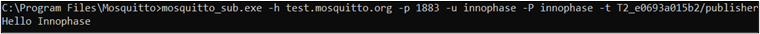

.. _ex blewifibridge:

BLE WiFi Bridge
----------------

This application note describes the accompanying example code in which
Talaria TWO receives a text message from a connected BLE client and
publishes that text message to a MQTT Broker.

MQ Telemetry Transport Protocol
~~~~~~~~~~~~~~~~~~~~~~~~~~~~~~~~~~

MQTT is a messaging protocol based on publish-subscribe pattern. It
works on top of the TCP/IP protocol and is used in internet of things.

Publish-subscribe paradigm is event-driven, and messages are pushed to
the clients. It requires an additional central point, called MQTT
Broker, which takes care of dispatching all the messages between the
senders and the rightful receivers.

When the clients publish messages to the broker, they include a topic
into the message. For the broker, the topic acts as the routing
information. Each client that wants to receive messages subscribes to a
certain topic and the broker takes care of delivering all messages with
the matching topic to the relevant client.

There is no requirement for the clients to know each other directly and
the communication happens only over the topic. This pattern removes the
dependencies of direct connectivity between the data producers and the
data consumers and thus enables scalable solutions.

Apart from this, the protocol has the property of client side requiring
small code footprint and less bandwidth, while the MQTT Broker can do
heavy lifting of receiving messages from thousands of clients
concurrently, filtering and routing each message to the right client who
have subscribed to the topic.

This makes MQTT protocol ideal for resource constrained IoT devices
which needs to be bandwidth-efficient and use little battery power.

Relevant APIs
~~~~~~~~~~~~~~~~~~~~~~~~~~~~~~~~~~

BLE APIs
~~~~~~~~~~~~~~~~~~~~~~~~~~~~~~~~~~

bt_gap_init() 
~~~~~~~~~~~~~~

Creates and initializes all the resources needed to run GAP Service and
must be called before using any of the other functions in the Bluetooth
GAP interface.

bt_gatt_create_service_16()
~~~~~~~~~~~~~~~~~~~~~~~~~~~

Creates a service declaration from a 16-bit UUID given as parameter and
returns the pointer to the GATT service.

.. code:: shell

      struct gatt_service \* bt_gatt_create_service_16(uint16_t uuid16)   

bt_gatt_add_char_16()
~~~~~~~~~~~~~~~~~~~~~

Adds a characteristic with a 16-bit UUID to a created service. It takes
permission, properties and an access callback function as input which is
called by stack when this characteristic is accessed.

.. code:: shell

      struct gatt_char * bt_gatt_add_char_16(struct gatt_service *s, uint16_t uuid16, bt_srv_fcn_t fcn, uint8_t permission, uint8_t property)

bt_gatt_add_service()
~~~~~~~~~~~~~~~~~~~~~

Adds a created service to the local server list. All includes,
characteristics and descriptors should have been added to the created
service before the service is added to the server.

.. code:: shell

      void bt_gatt_add_service(struct gatt_service \*s)     

bt_gap_cfg_adv()
~~~~~~~~~~~~~~~~

Configures the advertisement parameters for the GAP peripheral, through
which the frequency of advertisement transmission in fast and slow mode
can be adjusted. It also configures the Tx power for advertisement and
the channel map used.

.. code:: shell

      bt_gap_error_t bt_gap_cfg_adv(const uint16_t adv_fast_period, const uint16_t adv_slow_period, const uint16_t adv_fast_int, const uint16_t adv_slow_int, const int8_t adv_tx_power , const uint8_t adv_ch_map)

The API takes the following parameters as input:

1. adv_fast_period (ms): for this period, fast advertising is attempted
   every adv_fast_int interval. Once this period is over, slow
   advertising is attempted every adv_slow_int interval. Default value
   of this parameter is 0, representing period infinity, which means
   fast advertising will be attempted forever once started.

2. adv_slow_period (ms): for this period, slow advertising is attempted
   every adv_slow_int interval. Once this period is completed,
   advertising is disabled. Default value of this parameter is 0,
   representing period infinity, which means slow advertising will be
   attempted forever once started.

3. adv_fast_int In 625µs units: This sets the interval between two fast
   advertisements. Range: 0x0020 to 0x4000 (default: 200).

   This implies, when this interval is represented in decimal, the range
   is between 20,000µs (20ms) to 10,240,000µs (10,240ms) configurable in
   the steps of 625µs. Default in decimal is 125,000‬µs, which is, every
   125ms, 8 times per second.

4. adv_slow_int In 625µs units: This sets the interval between two slow
   advertisements. Range: 0x0020 to 0x4000 (default: 1600).

   This implies that when this interval is represented in decimal, the
   range is between 20,000µs (20ms) to 10,240,000µs (10,240ms)
   configurable in the steps of 625µs. Default in decimal is
   1,000,000µs, which is, every 1000ms, once per second.

5. adv_tx_power In dBm, range: -127 to 10, and 127 (127=no preference)
   (default: 127)

6. adv_ch_map Channel map used: bit0=ch37, bit1=ch38, bit2=ch39
   (default: 0x7)

The API returns error code from bt_gap_error_t.

bt_gap_connectable_mode()
~~~~~~~~~~~~~~~~~~~~~~~~~

Sets the device in desired connectable mode.

.. code:: shell

      bt_gap_error_t bt_gap_connectable_mode(const gap_connectable_mode_t mode, const bt_hci_addr_type_t
own_type, const bt_hci_addr_type_t peer_type, const bt_address_t peer_address, const gap_ops_t *ops)

Connection mode can be any one from the following list:

.. code:: shell

      typedef enum {
          /** Disable connectable mode */
          GAP_CONNECTABLE_MODE_DISABLE  = 0,
          /** Do not allow a connection to be established */
          GAP_CONNECTABLE_MODE_NON      = 1,
          /** Accept a connection request from a known peer device */
          GAP_CONNECTABLE_MODE_DIRECT   = 2,
          /** Accept a connection request from a any device */
          GAP_CONNECTABLE_MODE_UNDIRECT = 3,
      } gap_connectable_mode_t;

Other inputs parameters to the API are as follows:

1. own_type: Own address type: 0=public, 1=random, 2=resolvable (or
   public if no local IRK), 3=resolvable (or random if no local IRK)

2. peer_type: Peer address type: 0=public (device or identity), 1=random
   (device or identity)

3. peer_address: Peer address

4. ops: GAP callback functions Ex: connection and disconnection
   callback.

bt_gap_server_link_add()
~~~~~~~~~~~~~~~~~~~~~~~~

Used to add a GATT server to the gap connection.

.. code:: shell

      struct gatt_srv_link \* bt_gap_server_link_add(const uint8_t handle)

It takes connection handle as input and returns pointer to
gatt_srv_link.

bt_gap_server_link_remove()
~~~~~~~~~~~~~~~~~~~~~~~~~~~

Used to remove GATT server from the gap connection.

.. code:: shell

      void bt_gap_server_link_remove(const struct gatt_srv_link \*link) 

It takes pointer to gatt_srv_link to be removed as input.

bt_gatt_add_desc_16()
~~~~~~~~~~~~~~~~~~~~~

   Add a 16-bit UUID descriptor to a characteristic.

.. code:: shell

      struct gatt_desc * bt_gatt_add_desc_16(struct gatt_char *c, uint16_t uuid16, bt_srv_fcn_t fcn, uint8_t permission, uint8_t property)

.. _bt_gap_server_link_remove-1:

bt_gap_server_link_remove()
~~~~~~~~~~~~~~~~~~~~~~~~~~~

Add a 16-bit UUID descriptor to a characteristic.

.. code:: shell

      struct gatt_desc * bt_gatt_add_desc_16(struct gatt_char *c, uint16_t uuid16, bt_srv_fcn_t fcn, uint8_t
permission, uint8_t property)

MQTT APIs
~~~~~~~~~~~~~~~~

MQTTNetworkInit()
~~~~~~~~~~~~~~~~~

Initializes MQTT network object with socket read, write, and disconnect
functions.

.. code:: shell

      void MQTTNetworkInit(MQTTNetwork\* n)   

MQTTNetworkConnect()
~~~~~~~~~~~~~~~~~~~~

Opens a socket and tries to connect the MQTT network object to the
network endpoint.

.. code:: shell

      int MQTTNetworkConnect(MQTTNetwork\* n, char\* addr, int port)   

MQTTNetworkDisconnect()
~~~~~~~~~~~~~~~~~~~~~~~

Closes the socket and tries to connect the MQTT network object to the
network endpoint.

.. code:: shell

      void MQTTNetworkDisconnect(MQTTNetwork \*n)  

MQTTClientInit()
~~~~~~~~~~~~~~~~

Creates an MQTT client object.

.. code:: shell

      void MQTTClientInit(MQTTClient* client, MQTTNetwork* network, unsigned int command_timeout_ms,unsigned char* sendbuf, size_t sendbuf_size, unsigned char* readbuf, size_t readbuf_size);

MQTTConnect()
~~~~~~~~~~~~~

Sends an MQTT connect packet down the network and wait for a Connack.
The network object must be connected to the network endpoint before
calling this.

.. code:: shell

      int MQTTConnect(MQTTClient* client, MQTTPacket_connectData* options);

MQTTDisconnect()
~~~~~~~~~~~~~~~~

Sends an MQTT disconnect packet and closes the connection.

.. code:: shell

      int MQTTDisconnect(MQTTClient\* client);   

MQTTPublish()
~~~~~~~~~~~~~

Sends an MQTT publish packet and waits for all acks to complete.

.. code:: shell

      int MQTTPublish(MQTTClient* client, const char *topic, MQTTMessage *message);

MQTTSubscribe()
~~~~~~~~~~~~~~~

Send an MQTT subscribe packet and wait for suback before returning.

.. code:: shell

      int MQTTSubscribe(MQTTClient* client, const char* topicFilter, enum QoS qos, MQTTMessageHandler messageHandler);

MQTTUnsubscribe()
~~~~~~~~~~~~~~~~~

Send an MQTT unsubscribe packet and wait for unsuback before returning.

.. code:: shell
      int MQTTUnsubscribe(MQTTClient* client, const char* topicFilter);

MQTTYield()
~~~~~~~~~~~

MQTT goes to background for the time (ms) to yield for.

.. code:: shell

      int MQTTYield(MQTTClient\* client, int time);    

Application Flow
~~~~~~~~~~~~~~~~~~~~~~~~~~~~~~~~~~

In this application, Talaria TWO is programmed to become a GATT server
with a characteristic which can be read and written by a connected BLE
client. The written text message is published to the MQTT Broker running
as MQTT instance. A custom BLE service is also created to send the
indications from Talaria TWO to the connected BLE client.

Following are the steps to achieve this:

1. Connect the device to a Wi-Fi network, whose SSID and passphrase are
   given as boot arguments while flashing the binary image.

2. Connect to the MQTT instance using URL, port, username, and password
   of the cloud which are also given as boot arguments.

3. Initialize GAP profile and create GATT services for reading the name
   of BLE device and writing some text to the BLE peripheral device.

4. Create a BLE custom service to send the indications to BLE client.

5. On receiving any texts onto the BLE device, publish it to the MQTT
   client.

6. The published messages can be seen on subscriber’s console window.

7. Upon receiving any messages for the topics subscribed, Talaria TWO
   will send the messages as indications to the connected BLE Client.

Code Walkthrough
~~~~~~~~~~~~~~~~~~~~~~~~~~~~~~~~~~

Reading the Boot Argument 
~~~~~~~~~~~~~~~~~~~~~~~~~~~~~~~~~~

While programming the elf to Talaria TWO using boot.py, we use bootargs
to pass below necessary parameters to the program.

1. SSID and Passphrase of Wi-Fi Network

2. URL, Port, Username and Password of the MQTT server

In main(), first these parameters are retrieved as shown below.

main.c

.. code:: shell

      int main()
      {    
          print_ver("Ble Wifi Bridge Demo App", 1, 3);
          struct network_profile *profile;
          int rval;
          int ret;
          const char *ssid = os_get_boot_arg_str("ssid");
          const char *passphrase = os_get_boot_arg_str("passphrase")?:NULL;
          const char *np_conf_path = os_get_boot_arg_str("np_conf_path")?: NULL; 
          cloud_url = os_get_boot_arg_str("cloud_url") ;
          cloud_port = os_get_boot_arg_int("cloud_port", 1883) ;
          cloud_usr_name = os_get_boot_arg_str("cloud_usr_name") ;
          cloud_usr_psw = os_get_boot_arg_str("cloud_usr_psw") ?: "";

Connecting to a Wi-Fi Network
~~~~~~~~~~~~~~~~~~~~~~~~~~~~~~~~~~

To connect to a Wi-Fi network, wcm_create()API from the Wi-Fi Connection
Manager are used.

main.c

   Initially, the Wi-Fi network interface is created using wcm_create().

.. code:: shell

      h = wcm_create(NULL);  

   wifi_connect_to_network()API, from components library, connects to
   the Wi-Fi network using the AP credentials provided.

.. code:: shell

   rval = wifi_connect_to_network(&h, WCM_CONN_WAIT_INFINITE, &wcm_connect_success);
       if(rval < 0) {
           os_printf("\nError: Unable to connect to network\n");
           return 0;
       }

   Once the Wi-Fi connection is successful, the application begins the
   BLE Wi-Fi bridge services.

.. code:: shell

      start_ble_wifi_bridge_services();  

The on_new_message_via_ble() function publishes the message received
from the BLE device.

.. code:: shell

      int on_new_message_via_ble(char *message, int len)
      {
          vTaskDelay(100);  /* added wait for 100 m sec before publishing*/
          return (bmw_publish_message(message, len));
      }

my_app_init() function creates a thread for BLE, subscribe and publish
operations.

Initializing MQTT Client
~~~~~~~~~~~~~~~~~~~~~~~~~~~~~~~~~~

Once connection to a Wi-Fi network is established, connection to the
MQTT broker can be initiated

In main.c, start_mqtt() is called and the login parameters of the MQTT
broker are passed.

In start_mqtt(), the handle to MQTT network is created by allocating an
MQTT network object mqtt_network of type MQTTNetwork.

Then this network object is initialized using MQTTNetworkInit()and a
connection is established to network endpoint by passing the initialized
handle mqtt_network, cloud_url and cloud_port to MQTTNetworkConnect().

.. code:: shell

      static void start_ble_wifi_bridge_services(void)
      {
          if(start_mqtt((char *)cloud_url, cloud_port, (char *)cloud_usr_name, (char *)cloud_usr_psw) == 0 ){
             os_printf("starting subscriber_publisher_thread\n");
             start_ble();
             bmw_subscribe_message();
          }else{
            if(restart_mqtt_connection() == 0){
                start_ble();
                bmw_subscribe_message();
            }else{
              os_printf("Check if the MQTT broker is active\r\n");
          }
        }
      }

MQTT Client is initialized in the same code.

Object of type MQTTClient is allocated first and held by handle
mqtt_client.

Then MQTTClientInit() is called with the MQTT network object
mqtt_network, pointers to read and send buffers and the MQTTClient
handle mqtt_client.

mqtt.c

.. code:: shell

      static MQTTNetwork *mqtt_network;
      static MQTTClient *mqtt_client;
      . . .
      . . .
      
      int start_mqtt(char *cloud_url, int cloud_port, char *cloud_usr_name, char *cloud_usr_psw)
      {
          int rc;
      
          /*initializing MQTT*/
          mqtt_network=  osal_zalloc(sizeof(MQTTNetwork));
          MQTTNetworkInit(mqtt_network);
      . . .
      . . .
          rc = MQTTNetworkConnect(mqtt_network, cloud_url, cloud_port);
          if(rc != 0) 
          {
          os_printf(“\nMQTTNetworkConnect failed ret:%d (%s)\n”, rc, strerror(rc));
              return (void*)-1;
          }
      . . .
      . . .
      
          return rc;
      }

Then, a connect request packet is made using client_data.client_id as
T2\_<mac_id>, cloud_usr_name and cloud_usr_psw.

And finally, a connection request to MQTT broker is made with the packet
made in above step, using MQTTConnect(). As shown in the following
section:

mqtt.c

.. code:: shell

      int start_mqtt(char *cloud_url, int cloud_port, char *cloud_usr_name, char *cloud_usr_psw)
      {
          int rc;
      . . .
      . . .
          mqtt_client = osal_zalloc(sizeof(MQTTClient));
          /* Opens a socket and tries to connect the MQTT network
          object to the network endpoint. */
          rc = MQTTNetworkConnect(mqtt_network, cloud_url, cloud_port);
      . . .
      . . .
          generate_mqtt_topics(&client_data);
          /* Creates an MQTT client object. */
          MQTTClientInit(mqtt_client, mqtt_network, TIMEOUT_MS,
          sendbuf, sizeof(sendbuf), readbuf, sizeof(readbuf));
          MQTTPacket_connectData data = MQTTPacket_connectData_initializer;
          data.willFlag = 0;
          data.MQTTVersion = 3;
          data.username.cstring = cloud_usr_name;
          data.password.cstring = cloud_usr_psw;
          data.clientID.cstring = client_data.client_id;
          os_printf("***MQTT Client id is %s\r\n",data.clientID.cstring);
          data.keepAliveInterval = MQTT_KEEP_ALIVE_INTERVAL;  //default was 100
          data.cleansession = 0;
          os_printf("Connecting to %s:%d\n", cloud_url, cloud_port);
          /* Sends an MQTT connect packet down the network and wait for a Connect.
              The network object must be connected to the network endpoint
          before calling this. */
          mqtt_client->ping_outstanding = 0;
          rc = MQTTConnect(mqtt_client, &data);
          os_printf("Connected to %s:%d ret:%d\n", cloud_url, cloud_port, rc);
          return rc;
      }

fetch_t2_macid()function fetches the mac ID of the Talaria TWO device
and stores it in mac_id[index] buffer.

.. code:: shell

      const uint8_t *mac_addr = wcm_get_hwaddr(h);
          os_printf("mac id:");
          for(int index =0;index<6;index++){
              mac_id[index] = *(mac_addr+index);
              os_printf("%x",mac_id[index]);

generate_mqtt_topics() function generates the MQTT publish and subscribe
topics by using the mac ID of Talaria TWO and prints these topics onto
the console. The other MQTT client (PC in this example) can
subscribe/publish to these topics.

.. code:: shell

          uint8_t t2_mac_id[LEN_OF_MAC_ID];
          uint8_t len_mqtt_sub_topic,len_mqtt_pub_topic;
          char temp_buf[10];
          int index = 0;
          fetch_t2_macid(t2_mac_id);
          for (int i=0; i < LEN_OF_MAC_ID; i++){
             index += snprintf(&temp_buf[index], 128-index, "%x", t2_mac_id[i]);
          }
          sprintf(mqtt_client_data->client_id,"T2_%s",temp_buf);
          len_mqtt_sub_topic = strlen(mqtt_client_data->client_id)+strlen(topic_subscribe)+1;
          snprintf(mqtt_client_data->subscribe_topic,len_mqtt_sub_topic,"%s%s",mqtt_client_data->client_id,topic_publish);
          len_mqtt_pub_topic = strlen(mqtt_client_data->client_id)+strlen(topic_publish)+1;
          snprintf(mqtt_client_data->publish_topic,len_mqtt_pub_topic,"%s%s",mqtt_client_data->client_id,topic_subscribe);
          os_printf("\r\n------------------------------------------------------\r\n");
          os_printf("MQTT Client id : %s\r\n",mqtt_client_data->client_id);
          os_printf("MQTT publish topic: %s\r\n", mqtt_client_data->publish_topic);
          os_printf("MQTT subscribe topic: %s\r\n", mqtt_client_data->subscribe_topic);
          os_printf("--------------------------------------------------------\r\n");

Publishing Data to the MQTT Instance
~~~~~~~~~~~~~~~~~~~~~~~~~~~~~~~~~~

Function bmw_publish_message()takes pointer and length of a message as
input and publishes it to the remote MQTT Broker running as MQTT
instance.

Message is published using the MQTTPublish() function under the topic
T2\_<mac id of T2>/subscribe.

mqtt.c

.. code:: shell

      int bmw_publish_message(char *pmessage, int len)
      {
          int rc = 0;
          MQTTMessage *publish = osal_zalloc(sizeof(MQTTMessage));
          publish->payload = pmessage;
          publish->payloadlen  =len;
          memcpy(device_data_recieved, pmessage, len);
          device_data_recieved[len]='\0';
              os_printf("\n\n%u:from BLE Client, Message Recieved[%s]",os_systime(), device_data_recieved);
      
              if(mqtt_connection_status_check() == 1){
                 os_printf("\nMQTT connection is Active");
                 restarting_session = false;
              }
              else{
                 restart_mqtt_connection();
              }
      
              rc = MQTTPublish(mqtt_client, client_data.publish_topic, publish);    if(rc != 0)
          {
                os_printf("\nMQTTPublish failed. Ret= %d", rc);
          }
          else
          {
                os_printf("\n%u:Message published successfully [%s]",os_systime(), pmessage);
          }
          osal_free(publish);
          return 0;
      }

Subscribing to MQTT Topic
~~~~~~~~~~~~~~~~~~~~~~~~~~~~~~~~~~

Function bmw_subscribe_message()subscribes to a topic and registers the
call back function MQTTSubscribeCallback (MessageData\* Msg). The call
back gets invoked when there is a message published by a client to the
same topic.

.. code:: shell

      void MQTTSubscribeCallback(MessageData* Msg)
      {
        os_printf("\nMQTTSubscribe Call back:%s \n",(char*)Msg->message->payload);
        send_ble_indications((uint8_t*)Msg->message->payload,Msg->message->payloadlen);
        memset((char*)Msg->message->payload,0,Msg->message->payloadlen);
      }
      int bmw_subscribe_message(void)
      {
        MQTTYield(mqtt_client, 1000);
        MQTTMessageHandler messageHandler = &MQTTSubscribeCallback;
        MQTTSubscribe(mqtt_client, client_data.subscribe_topic, QOS1, messageHandler);
        return 0;
      }

bmw_unsubscribe_message()function unsubscribes to the topic which is
already subscribed to.

.. code:: shell

      int bmw_unsubscribe_message(void)
      {
          MQTTUnsubscribe(mqtt_client, client_data.subscribe_topic);
          return 0;
      }

bmw_Yield()function yields to check if any messages are to be
published/subscribed.

.. code:: shell

      void bmw_Yield(void)
      {
        MQTTYield(mqtt_client, 500);
      }

Running BLE GATT Server
~~~~~~~~~~~~~~~~~~~~~~~~~~~~~~~~~~

Once connection with the MQTT network is established, BLE GAP is
initialized and a GATT service with a write only characteristic is
started.

The message written by any connected BLE client to this characteristic
is published to MQTT broker. A smartphone application is used in this
example to write a message to this characteristic.

Initially, the Bluetooth GAP service is initialized using bt_gap_init()
and then a custom Bluetooth GATT service is created.

The bt_gatt_create_service_16() function creates a custom GATT service
with a 16-bit UUID.

.. code:: shell

      bt_gap_error_t custom_ind_server_create(void)
      {
          srv16 = bt_gatt_create_service_16(CUSTOM_IND_SERVICE_UUID);
          chr_i = bt_gatt_add_char_16(srv16, CUSTOM_IND_SERVICE_CHARACTERISTIC_UUID, NULL, 0, GATT_CHAR_PROP_I);
          bt_gatt_add_desc_16(chr_i, UUID_GATT_CD_CLIENT_CONFIGURATION, indication_cccd, GATT_PERM_RW, GATT_CHAR_PROP_RW);
          bt_gatt_add_service(srv16);
          return GAP_ERROR_SUCCESS;
      }

bt_gatt_add_char_16() is used to add a characteristic with a 16-bit UUID
to that service. Callback function pointer is provided as parameter to
this function which will be called when the characteristic is accessed.
Properties and permissions for the characteristic are also specified.

Following are two such characteristics that are added:

1. UUID_GATT_CT_DEVICE_NAME and the callback associated when accessing
   this characteristic is ‘device_name_read()’.

2. The other one is write only and the callback associated when
   accessing this characteristic is ‘data_receive()’. In example
   UUID_GATT_CT_DEVICE_NAME+1 is used which is UUID_GATT_CT_APPEARANCE.

Finally, bt_gatt_add_service() adds the service to the server.

ble.c

.. code:: shell

      // Initialize GAP and GATT
      int start_ble()
      {
      bt_gap_init();
      create_my_bt_service();
          return 0;
      }
      // Create GATT service
      bt_gap_error_t create_my_bt_service()
      {
          bt_gap_cfg_adv_t bt_adv_handle;
         if (mqtts)
             return GAP_ERROR_SUCCESS;
          mqtts = osal_zalloc(sizeof(mqtts_t));    
          mqtts->srv = bt_gatt_create_service_16(UUID_GATT_S_GENERIC_ACCESS);
          bt_gatt_add_char_16(mqtts->srv, UUID_GATT_CT_DEVICE_NAME, device_name_read,
          GATT_PERM_READ, GATT_CHAR_PROP_R); /* _REA*/
          bt_gatt_add_char_16(mqtts->srv, UUID_GATT_CT_DEVICE_NAME+1, data_receive, 
          GATT_PERM_WRITE, GATT_CHAR_PROP_W);
      . . .
      . . .
      }

Here bt_gap_cfg_adv() sets parameters for advertisement. The parameters
passed for configuring the advertisement are as follows:

1. adv_fast_period is set to 10,240ms which is nearest multiple of 10
   seconds in 625µs units.

   This means the fast advertising will be attempted for nearly 10
   seconds (10.24s) when advertisement is enabled. After this 10.24s
   period, the slow advertisement will be attempted.

2. adv_slow_period is set to 0, this means slow advertisement will be
   attempted indefinitely and there is no time bound programmed after
   which advertisement should stop automatically.

3. adv_fast_int is set to 160, which means (160*625µs) = 100,000µs =
   every 100ms is the interval at which fast advertisement will be
   attempted.

4. adv_slow_int is set to 480, which means (480*625µs) = 300,000‬µs=
   every 300ms will be the interval of slow advertising.

5. bt_gap_cfg_smp() is used to set security parameters. Here it is
   passed as 0, so no security parameter is configured.

6. bt_gap_connectable_mode() makes the device connectable and will
   enable advertisement.

Note that a pointer to a gap_ops_t instance is provided to this function
call which supplies the GAP callback functions connected_cb and
disconnected_cb to be used when a connection or disconnection event
occurs.

ble.c

.. code:: shell

      // Create GATT service
      bt_gap_error_t create_my_bt_service()
      {
      . . .
          custom_ind_server_create(); 
          bt_gatt_add_service(mqtts->srv);
          bt_adv_handle.fast_period = 10240;
          bt_adv_handle.slow_period = 0;
          bt_adv_handle.fast_interval = 160;
          bt_adv_handle.slow_interval = 480;
          bt_adv_handle.tx_power = 0;
          bt_adv_handle.channel_map = BT_HCI_ADV_CHANNEL_ALL;
          bt_gap_cfg_adv_set(&bt_adv_handle);
          /*return gap connectable mode*/
          return bt_gap_connectable_mode(GAP_CONNECTABLE_MODE_UNDIRECT, 
          bt_hci_addr_type_random, 0, address_zero, &gap_ops);
      }

Connection/Disconnection Callbacks
~~~~~~~~~~~~~~~~~~~~~~~~~~~~~~~~~~

At this point in the execution of the server, it is advertising and
ready to receive a connection from the client. When the client connects,
the callback function connected_cb will be called. In the callback, the
GATT server needs to be linked to this GAP connection using
bt_gap_server_link_add()with the following function call:

.. code:: shell

      mqtts->gatt = bt_gap_server_link_add(param->handle);  

The code sample shows how to obtain the argument required for this
function call from the argument provided to the callback by casting
hci_event with bt_hci_evt_le_conn_cmpl_t and fetching its handle.

Similarly, the link is removed using bt_gap_server_link_remove() when
the client disconnects,

.. code:: shell

      bt_gap_server_link_remove(mqtts->gatt);  

Characteristic Access Callback
~~~~~~~~~~~~~~~~~~~~~~~~~~~~~~~~~~

While the client is connected to the server, it can read or write the
custom characteristic based on the characteristic’s properties. This
results in the callback function associated with the characteristic
being called; in this case, device_name_read() and data_receive().

When the read only characteristic UUID_GATT_CT_DEVICE_NAME is accessed,
the callback associated when accessing this characteristic
device_name_read() is called.

It passes inno_mqtt as device name to the client reading this
characteristic.

ble.c

.. code:: shell

      static bt_att_error_t device_name_read(uint8_t bearer, bt_uuid_t *uuid, bt_gatt_fcn_t rw, uint8_t *length, uint16_t offset, uint8_t *data)
      {
          char device_index_str[15];
          snprintf(device_index_str,sizeof(device_index_str),"inno_mqtt");
          uint8_t len = strlen(device_index_str) - offset;
          if (offset >= len)
              return BT_ATT_ERROR_INVALID_OFFSET;
          if (*length > len)
             *length = len;
          memcpy(data, device_index_str, *length);
          os_printf ("\n BLE Device Name Read callback -- [%s]\n", device_index_str);
          return BT_ATT_ERROR_SUCCESS;
      }

When the write only characteristic UUID_GATT_CT_DEVICE_APPEARANCE is
accessed, the callback associated when accessing this characteristic
data_receive() is called. BLE GATT server receives the text messages
from BLE Client.

ble.c

.. code:: shell

      static bt_att_error_t    
      data_receive(uint8_t bearer, bt_uuid_t *uuid, bt_gatt_fcn_t rw, uint8_t *length, uint16_t offset, uint8_t *data)
      {
          on_new_message_via_ble((char *)data,  *length);
          return BT_ATT_ERROR_SUCCESS;
      }

Function on_new_message_via_ble()calls bmw_publish_message() in main.c,
described in section 7.4, and the message written is published to broker
under the topic innophase\_<T2 mac id>/publisher.

Running the Application using Mosquitto Project’s Test Server
~~~~~~~~~~~~~~~~~~~~~~~~~~~~~~~~~~

Eclipse Mosquitto is an open source (EPL/EDL licensed) message broker
that implements the MQTT protocol versions 5.0, 3.1.1 and 3.1.

The Mosquitto project allows to test the MQTT based applications to test
using its test server. Users can use a custom server or any of the
following tested public MQTT brokers:

1. mqtt.eclipseprojects.io

   a. 1883 : MQTT over unencrypted TCP

   b. 8883 : MQTT over encrypted TCP

   c. 80 : MQTT over unencrypted Websocket (note: URL must be */mqtt* )

   d. 443: MQTT over encrypted WebSockets (note: URL must be */mqtt* )

2. mqtt-dashboard.com\ ** **

   a. TCP Port: 1883

   b. TLS TCP Port: 8883

   c. Websocket Port: 8000

   d. TLS Websocket Port: 8884

3. test.mosquitto.org

   a. 1883: MQTT, unencrypted, unauthenticated

   b. 1884: MQTT, unencrypted, authenticated

   c. 8883: MQTT, encrypted, unauthenticated

   d. 8884: MQTT, encrypted, client certificate required

   e. 8080: MQTT over WebSockets, unencrypted, unauthenticated

   f. 8081: MQTT over WebSockets, encrypted, unauthenticated

   g. 8091: MQTT over WebSockets, unencrypted, authenticated

**Note**: test.mosquitto.org is used in this document for illustration
purposes only.

The following steps describes the procedure to test the ble_wifi_bridge
application using Mosquitto project’s test server.

Installing and Running the Mosquitto MQTT Tool
~~~~~~~~~~~~~~~~~~~~~~~~~~~~~~~~~~

1. Download
   `mosquitto-2.0.11-install-windows-x64.exe <file:///C:\C:\Users\91963\Downloads\mosquitto-2.0.11-install-windows-x64.exe>`__
   from https://mosquitto.org/download/ and install the same

2. Open a command prompt window on the PC and subscribe to a topic by
   issuing the following command:

.. code:: shell

      mosquitto_sub.exe -h test.mosquitto.org -p 1883 -u <user name> -P <Password> -t T2_<mac_id>/publisher

   Ensure that the note in section 7.4 is followed and the binary is
   generated.

   In the example, username and password used is innophase. The pub/sub
   topics are computed by the application for Talaria TWO module. For
   this example they are: T2_e0693a015b2/publisher and
   T2_e0693a015b2/subscribe. Ensure to check the console logs on the
   Download Tool for the publish/subscribe topics based on the unique
   MQTT client id generated for the Talaria TWO device.

Figure 1 shows the command prompt window:

|image7|

Figure 1: Command prompt window

Programming the Talaria TWO Module
~~~~~~~~~~~~~~~~~~~~~~~~~~~~~~~~~~

Program
wifi_ble_mqtt.elf\ *(freertos_sdk_x.y\\examples\\ble_wifi_bridge\\bin)*
using the Download tool:

1. Launch the Download tool provided with InnoPhase Talaria TWO SDK.

2. In the GUI window:

   a. Boot Target: Select the appropriate EVK from the drop-down

   b. ELF Input: Load the ELF by clicking on Select ELF File.

   c. AP Options: Provide the SSID and Passphrase under AP Options to
      connect to an Access Point.

   d. Boot arguments: Pass the following boot arguments:

.. code:: shell

      cloud_url=test.mosquitto.org,cloud_port=1883,cloud_usr_name=<user name >,cloud_usr_psw=<password>

e. Programming: Prog RAM or Prog Flash as per requirement.

The console should display a return value of 0 indicating that the
Talaria TWO is able to connect to test.mosquitto.org server.

Console output:

.. code:: shell

      Y-BOOT 208ef13 2019-07-22 12:26:54 -0500 790da1-b-7
      ROM yoda-h0-rom-16-0-gd5a8e586
      FLASH:PWWWWWWWAE
      Build $Id: git-e52d93e $
      Flash detected. flash.hw.uuid: 39483937-3207-0080-0055-ffffffffffff
      Bootargs: ssid=Rczz_2.4G passphrase=rc@9980044013 cloud_usr_name=innophase cloud_usr_psw=innophase cloud_url=mqtt.eclipseprojects.io
      SDK Ver: FREERTOS_SDK_1.0
      Ble Wifi Bridge Demo App
      addr e0:69:3a:00:08:38
      network profile created for ssid: Rczz_2.4G
      
      Connecting to added network : Rczz_2.4G
      [0.920,765] CONNECT:70:4f:57:4a:fc:85 Channel:11 rssi:-57 dBm
      wcm_notify_cb to App Layer - WCM_NOTIFY_MSG_LINK_UP
      wcm_notify_cb to App Layer - WCM_NOTIFY_MSG_ADDRESS
      [1.648,724] MYIP 192.168.0.116
      [1.648,888] IPv6 [fe80::e269:3aff:fe00:838]-link
      wcm_notify_cb to App Layer - WCM_NOTIFY_MSG_CONNECTED
      
      Connected to added network : Rczz_2.4G
      
      /home/osboxes/Work/Freertos/dev/freertos_embedded_apps/components/mqtt/platform/mqtt_nw_tcp.c:MQTTNetworkConnectmac id:e0693a0838
      ------------------------------------------------------
      MQTT Client id : T2_e0693a0838
      MQTT publish topic: T2_e0693a0838/subscribe
      MQTT subscribe topic: T2_e0693a0838/publisher
      --------------------------------------------------------
      ***MQTT Client id is T2_e0693a0838
      Connecting to mqtt.eclipseprojects.io:1883
      
      _mqtt_cycle : packet_type = 2Connected to mqtt.eclipseprojects.io:1883 ret:0
      starting subscriber_publisher_thread
      
       BLE Device Name Read callback -- [inno_mqtt]
      
      _mqtt_cycle : packet_type = 9[37.233,796] BT connect[0]: ia:72:1e:ff:02:d9:73 aa:00:00:00:00:00:00 phy2:0/0 phyC:00
      connected!
      
       BLE Device Name Read callback -- [inno_mqtt] 

Publishing a Topic and Sending Data from BLE to Wi-Fi
~~~~~~~~~~~~~~~~~~~~~~~~~~~~~~~~~~~~~~~~~~~~~~~~~

1. Open the BLE application on the mobile phone and click on the Scan
   button at the top right corner. Look for the device inno_mqtt.

   **Note**: In the example, a mobile application called nRF Connect for
   Mobile, developed by Nordic Semiconductor ASA is used.

2. Click on the CONNECT button adjacent to the device name inno_mqtt to
   connect to the device. This will show the GATT services and custom
   service (shown as unknown service in nRF Connect app) in a new
   window.

|image8|

Figure 2: Publishing a topic - Connecting to inno_mqtt

3. Click on GENRIC ACCESS->WRITE as shown in Figure 3.

|image9|

Figure 3: Publishing a topic - Generic Access - W

4. Sending a message using the nRF Connect app: Select the message type
   from the drop-down, write a message and click SEND.

   |image10|

Figure 4: Selecting message type

   |image11|

Figure 5: Sending a message

5. If message size is more than 30bytes, it is required to change the
      MTU size in nRF Connect Mobile application.

   |image12|

Figure 6: Changing MTU size

6. The message will be published by Talaria TWO and the same is observed
      on the Download Tool’s console window as well indicating that the
      message was successfully published.

   |image13|

Figure 7: Publishing a topic - Output

7. The published message by Talaria TWO can be seen on the subscriber’s
      command prompt window opened during step 2 of section 8.1.

|image14|

Figure 8: Publishing a topic - Command prompt output

Subscribing to a Topic and Sending Data from Wi-Fi to BLE
~~~~~~~~~~~~~~~~~~~~~~~~~~~~~~~~~~

1. Open the BLE application on the mobile phone and click on the Scan
   button at the top right corner and look for the device inno_mqtt.

   **Note**: In the example, a mobile application called nRF Connect for
   Mobile, developed by Nordic Semiconductor ASA is used.

2. Click on the CONNECT button adjacent to the device name inno_mqtt to
   connect to the device. This will show the GATT services and custom
   service (shown as unknown service in nRF connect app) in a new
   window.

|image15|

Figure 9: Subscribing to a topic - Connecting to inno_mqtt

3. Click on Unknown Service (Download symbol) as shown in Figure 10.

|image16|

Figure 10: Subscribing to a topic - Generic Access - I

4. Publish a message from any MQTT client to the topic
   T2\_<mac_id>/publisher. The publish topic computed by the application
   for Talaria TWO module used in this application is
   T2_e0693a015b2/publisher.

   Ensure to check the console logs on the Download Tool for the publish
   topic based on the unique MQTT client id generated for the Talaria
   TWO device.

|image17|

Figure 11: Publishing a message from MQTT client

5. Since Talaria TWO device has subscribed to the topic
   T2_e0693a015b2/subscribe, the subscribe topic computed by the
   application for one of the Talaria TWO module is
   T2_e0693a015b2/subscribe. Ensure to check the console logs on the
   Download Tool for the subscribe topic based on the unique MQTT client
   ID generated for the Talaria TWO device. The same can be observed on
   Talaria TWO’s console:

|image18|

Figure 12: Subscribing to a topic - output

6. Talaria TWO sends the received message over BLE to the BLE client.
   This message will be displayed on the nRF connect app.

|image19|

Figure 13: Message sent to BLE Client over BLE

.. |image8| image:: media/image8.png
   :width: 3.14931in
   :height: 5.42014in

.. |image10| image:: media/image10.png
   :width: 1.57431in
   :height: 2.72431in

