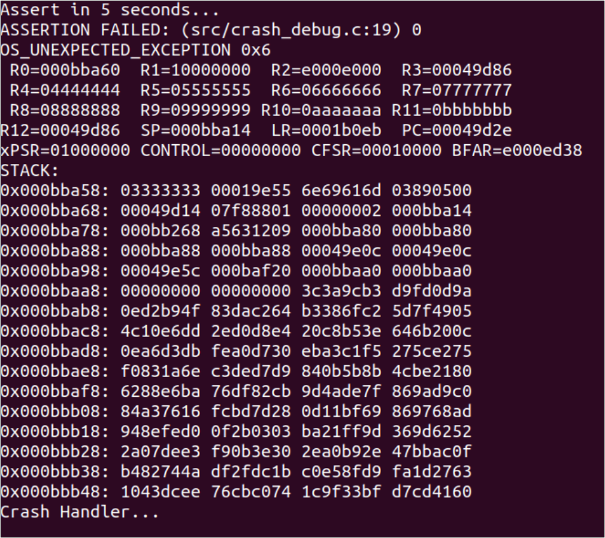

.. _ex crash handling:

Crash Handling
--------------------

This document provides details on using the crash handler API to handle
and debug error cases and interpret the crash printout.

Crash Handler
~~~~~~~~~~~~~~~~~~~~~~~~~~~~~~~~~~

To register a crash handler os_set_crash_handler(void(\*crash_cb)(void))
can be used. The function crash_cb is called a crash. Note that the
crash printout will occur before the registered functions are called.

In the following sample code, we register a function to the crash
handler and then force an assert to demonstrate the functionality of the
crash handler:

.. code:: shell

      #include <assert.h>
      #include <kernel/os.h>
      /* for print_ver */
      #include "utils.h"
      static void __irq
      handle_crash_event()
      {
          os_printf("Crash Handler...\n");
      }
      int
      main(void)
      {
          print_ver("Crash Handling Demo App", 1, 1);
          // register crash handler
          os_set_crash_handler(handle_crash_event);
          os_printf("Assert in 5 seconds...\n");
          vTaskDelay(5000);
          assert(0);
          return 0;} 

|image20|

Figure 1: Crash printout with crash handler

As shown in Figure 1, the function registered using
os_set_crash_handler, gets called after the crash printout.

Crash Output Debug
~~~~~~~~~~~~~~~~~~~~~~~~~~~~~~~~~~

Cortex M3 Crash
~~~~~~~~~~~~~~~~~~~~~~~~~~~~~~~~~~

The main CPU is an ARM Cortex-M3 and this section illustrates the
printout from a crash in the Cortex-M3.

Sample code is available at the following location of the FreeRTOS SDK
package: */examples/crash_handling/crash_debug.c*.

Following is an example from a crash (due to a HardFault exception error
in the application).

Running the Application 
~~~~~~~~~~~~~~~~~~~~~~~~

Program crash_debug.elf *(freertos_sdk_x.y\\examples\\crash_handling\\bin)* using 
the Download tool:

1. Launch the Download tool provided with InnoPhase Talaria TWO SDK.

2. In the GUI window:

   a. Boot Target: Select the appropriate EVK from the drop-down.

   b. ELF Input: Load the crash_debug.elf by clicking on Select ELF
      File.

   c. Programming: Prog RAM or Prog Flash as per requirement.

Expected Output
~~~~~~~~~~~~~~~

.. code:: shell

      Y-BOOT 208ef13 2019-07-22 12:26:54 -0500 790da1-b-7
      ROM yoda-h0-rom-16-0-gd5a8e586
      FLASH:PWWWWAE
      Build $Id: git-b8e2cc1 $
      Flash detected. flash.hw.uuid: 39483937-3207-00a8-0068-ffffffffffff
      $App:git-494766d
      SDK Ver: FREERTOS_SDK_1.0
      Crash Handling Demo App
      Assert in 5 seconds...
      ASSERTION FAILED: (/home/osboxes/InnoPhase/t2/freertos_t2/freertos_embedded_apps/examples/crash_handling/src/crash_debug.c:54) 0
      OS_UNEXPECTED_EXCEPTION 0x6
       R0=00000000  R1=000bab6c  R2=10000000  R3=00051dcc
       R4=00000000  R5=00000000  R6=00000000  R7=00000000
       R8=00000000  R9=00000000 R10=00000000 R11=00000000
      R12=00051dcc  SP=000bb40c  LR=000482b7  PC=00042eb0
      xPSR=61000000 CONTROL=00000000 CFSR=00010000 BFAR=e000ed38
      STACK:
      0x000bb450: 00000000 00049031 00000000 00000000
      0x000bb460: 77ac4780 00000000 00057bb4 1e6b71b1
      0x000bb470: 8c06b1e1 08e76526 3bfc4e2c 84f393a2
      0x000bb480: 35bea23b bac4d2b1 847e3ffa df5f7d69
      0x000bb490: 105bacd9 16ce2cca 44467a5c 6e2dc778
      0x000bb4a0: 407612ae d7eac783 d05fc5a7 633b9993
      0x000bb4b0: daa1d16b 167464d9 7908f26c ac99d8c3
      0x000bb4c0: 3302bbbd cc90eece a93216c8 73eb3672
      0x000bb4d0: 99a3db76 bdeff812 89612ba6 718a31ec
      0x000bb4e0: 7e0735a5 fc67ac19 09d183b5 12bd0905
      0x000bb4f0: 97b4e4a6 1d2e41d8 b7b650f0 84b336c0
      0x000bb500: 2ba44aa1 bf81fe55 d7683a9a 81db3f24
      0x000bb510: 58e5f08c de1052d6 658daa4d c54c1814
      0x000bb520: d44711f8 2d8aac46 31ba27f6 fdce8201
      0x000bb530: 2b6b6cd9 58bc224a 0d6a984d 262aa518
      0x000bb540: 2ee0f187 998eccf1 ef9284af c70d857c
      Crash Handler...

Soft Faults 
~~~~~~~~~~~~~~~~~~~~~~~~~~~~~~~~~~

OS_ERROR N indicates that there is a crash due to a fault detected by
the OS, i.e. a soft fault. The following soft faults exist:

.. table:: Table 1: COPx descriptions

   +---------+------------------------------------------------------------+
   | **Soft  | **Description**                                            |
   | Fault** |                                                            |
   +=========+============================================================+
   | 0x00    | Error in application                                       |
   +---------+------------------------------------------------------------+
   | 0x01    | Heap is out of memory (actually printed explicitly as      |
   |         | "OS_ERROR: HEAP EXHAUSTED")                                |
   +---------+------------------------------------------------------------+
   | 0x02    | Failed to initialize virtual memory                        |
   +---------+------------------------------------------------------------+
   | 0xfa    | Invalid argument in the os function call                   |
   +---------+------------------------------------------------------------+
   | 0xfb    | An event is detected, for which there is no handler        |
   |         | (callback) registered                                      |
   +---------+------------------------------------------------------------+
   | 0xfc    | OS internal error                                          |
   +---------+------------------------------------------------------------+
   | 0xfd    | Timer callback missing                                     |
   +---------+------------------------------------------------------------+
   | 0xfe    | Assertion failure (printed explicitly as "ASSERTION        |
   |         | FAILED: …")                                                |
   +---------+------------------------------------------------------------+

Exceptions
~~~~~~~~~~~~~~~~~~~~~~~~~~~~~~~~~~

OS_UNEXPECTED_EXCEPTION M indicates that there is an exception that the
OS cannot resolve.

For detailed information, please refer the following link:
https://developer.arm.com/documentation/dui0203/h/handling-cortex-m3-processor-exceptions/about-cortex-m3-processor-exceptions/exceptionnumbers

Following are a list of valid exceptions:

.. table:: Table 2: Exception code

   +----------------------+-----------------------------------------------+
   | **Exceptions**       | **Description**                               |
   +======================+===============================================+
   | 1                    | Reset                                         |
   +----------------------+-----------------------------------------------+
   | 2                    | NMI                                           |
   +----------------------+-----------------------------------------------+
   | 3                    | HardFault                                     |
   +----------------------+-----------------------------------------------+
   | 4                    | MemManage                                     |
   +----------------------+-----------------------------------------------+
   | 5                    | BusFault                                      |
   +----------------------+-----------------------------------------------+
   | 6                    | UsageFault                                    |
   +----------------------+-----------------------------------------------+
   | 11                   | SVCall                                        |
   +----------------------+-----------------------------------------------+
   | 12                   | Debug Monitor                                 |
   +----------------------+-----------------------------------------------+
   | 14                   | PendSV                                        |
   +----------------------+-----------------------------------------------+
   | 15                   | SysTick                                       |
   +----------------------+-----------------------------------------------+
   | 16                   | External Interrupt(0)                         |
   +----------------------+-----------------------------------------------+

Registers in the crash dump are explained in the following link:
https://developer.arm.com/documentation/dui0552/a/the-cortex-m3-processor/programmers-model/core-registers

Co-processor Crash
~~~~~~~~~~~~~~~~~~~~~~~~~~~~~~~~~~

There are three co-processors that handle Wi-Fi, Bluetooth, and Host
Interface, and this section describes the printout from a crash in a
co-processor.

Following is an example printout from a crash (due to a watchdog timeout
in the Wi-Fi coprocessor):

.. code:: shell

      COP0 EXCEPTION 0x8 
      COP0 REGDUMP: 
      000bbb38 00000008 00000004 00fc2a39 
      000bbb08 000bbb38 8000000c 00fc2a3b 
      00000000 00000000 00000000 00000000 
      00fc2a39 000a57d8 0005e152 0005dac0

COPx provides information on the coprocessor that crashed:

.. table:: Table 3: COPx descriptions

    +---------------+------------------------------------------------------+
    | **C           | **Description**                                      |
    | o-processor** |                                                      |
    +===============+======================================================+
    | COP0          | Wi-Fi coprocessor                                    |
    +---------------+------------------------------------------------------+
    | COP1          | Bluetooth coprocessor                                |
    +---------------+------------------------------------------------------+
    | COP2          | Host interface coprocessor                           |
    +---------------+------------------------------------------------------+

The exception code is a bitmask of the following bits:

.. table:: Table 4: Exception code

    +---------------+------------------------------------------------------+
    | **Exception   | **Description**                                      |
    | Code**        |                                                      |
    +===============+======================================================+
    | bit0          | Idle (not an error)                                  |
    +---------------+------------------------------------------------------+
    | bit1          | Invalid instruction                                  |
    +---------------+------------------------------------------------------+
    | bit2          | Stopped via regwrite (not an error)                  |
    +---------------+------------------------------------------------------+
    | bit3          | Watchdog timeout                                     |
    +---------------+------------------------------------------------------+
    | bit4          | Alignment fault                                      |
    +---------------+------------------------------------------------------+
    | bit5          | Stack overflow                                       |
    +---------------+------------------------------------------------------+
    | bit6          | Watchpoint                                           |
    +---------------+------------------------------------------------------+

**Note**: The REGDUMP for COPx uses an internal structure. For further
debugging share the same with InnoPhase at the contact information
provided in section 7.

