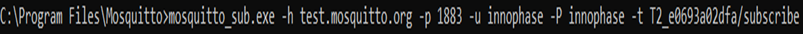
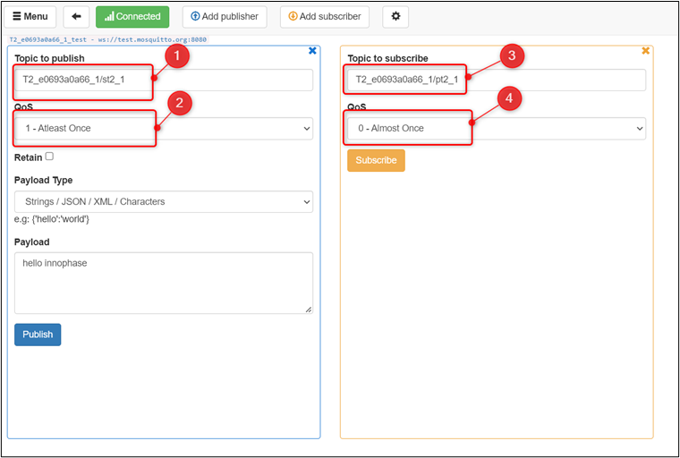
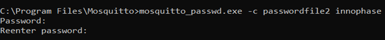

.. _ex mqtt:

MQTT
---------

This application note describes the accompanying example code in which
Talaria TWO publishes a text message to a MQTT Broker and subscribes to
a topic and displays the received message over Talaria TWO’s console.
The application can be evaluated in secure and non-secure modes of MQTT
operations.

MQ Telemetry Transport Protocol
~~~~~~~~~~~~~~~~~~~~~~~~~~~~~~~~~~~~~~~~

MQTT is a messaging protocol based on publish-subscribe pattern. It
works on top of the TCP/IP protocol and is used in internet of things.

The publish-subscribe paradigm is event-driven, and messages are pushed
to the clients. It requires an additional central point, called MQTT
Broker, which takes care of dispatching all the messages between the
senders and the rightful receivers.

When the clients publish messages to the broker, they include a topic
into the message. For the broker, the topic acts as the routing
information. Each client that wants to receive messages subscribes to a
certain topic and the broker takes care of delivering all messages with
the matching topic to the relevant client.

There is no requirement for the clients to know each other directly and
the communication happens only over the topic. This pattern removes the
dependencies of direct connectivity between the data producers and the
data consumers and thus enables scalable solutions.

Apart from this, the protocol has the property of the client side
requiring a small code footprint and less bandwidth, while the MQTT
Broker can do the heavy lifting of receiving messages from thousands of
clients concurrently, filtering and routing each message to the right
client subscribed to the topic.

This makes the MQTT protocol ideal for resource constrained IoT devices,
which need to be bandwidth-efficient and use little battery power.

Relevant APIs
~~~~~~~~~~~~~~~~~~~~~~~~~~~~~~~~~~~~~~~~

MQTT APIs
~~~~~~~~~~~~~~~~~~~~~~~~~~~~~~~~~~~~~~~~

MQTTNetworkInit()
~~~~~~~~~~~~~~~~~

Initializes MQTT network object with socket read, write, and disconnect
functions.

.. code:: shell

      void MQTTNetworkInit(MQTTNetwork\* n)      

MQTTNetworkInit_Tls()
~~~~~~~~~~~~~~~~~~~~~

Initializes MQTT network object with socket read, write, and disconnect
functions for TLS.

.. code:: shell

      void MQTTNetworkInit_Tls(MQTTNetwork\*);     

MQTTNetworkConnect()
~~~~~~~~~~~~~~~~~~~~

Opens a socket and tries to connect the MQTT network object to the
network endpoint.

.. code:: shell

      int MQTTNetworkConnect(MQTTNetwork\* n, char\* addr, int port) 

MQTTNetworkConnect_Tls()
~~~~~~~~~~~~~~~~~~~~~~~~

Opens a socket and tries to connect the MQTT network object to the
network endpoint over TLS.

.. code:: shell

      int MQTTNetworkConnect_Tls(MQTTNetwork *n, char *host, int port, ssl_wrap_cfg_t *cfg);

MQTTNetworkDisconnect()
~~~~~~~~~~~~~~~~~~~~~~~

Closes the socket and tries to disconnect the MQTT network object to the
network endpoint.

.. code:: shell

      void MQTTNetworkDisconnect(MQTTNetwork \*n)  

MQTTNetworkDisconnect_Tls()
~~~~~~~~~~~~~~~~~~~~~~~~~~~

Closes the socket over TLS and tries to disconnect the MQTT network
object to the network endpoint.

.. code:: shell

      void MQTTNetworkDisconnect_Tls(MQTTNetwork\*);     

MQTTClientInit()
~~~~~~~~~~~~~~~~

Creates an MQTT client object.

.. code:: shell

      void MQTTClientInit(MQTTClient* client, MQTTNetwork* network, unsigned int command_timeout_ms,unsigned char* sendbuf, size_t sendbuf_size, unsigned char* readbuf, size_t readbuf_size);

MQTTConnect()
~~~~~~~~~~~~~

Sends an MQTT connect packet down the network and waits for a CONNACK.
The network object must be connected to the network endpoint before
calling this.

.. code:: shell

      int MQTTConnect(MQTTClient* client, MQTTPacket_connectData* options);

MQTTDisconnect()
~~~~~~~~~~~~~~~~

Sends an MQTT disconnect packet and closes the connection.

.. code:: shell

      int MQTTDisconnect(MQTTClient\* client);    

MQTTPublish()
~~~~~~~~~~~~~

Sends an MQTT publish packet and waits for all acks to complete.

.. code:: shell

      int MQTTPublish(MQTTClient* client, const char *topic, MQTTMessage *message);

MQTTSubscribe()
~~~~~~~~~~~~~~~

Sends an MQTT subscribe packet and waits for SUBACK before returning.

.. code:: shell

      int MQTTSubscribe(MQTTClient* client, const char* topicFilter, enum QoS qos, MQTTMessageHandler messageHandler);

MQTTUnsubscribe()
~~~~~~~~~~~~~~~~~

Sends an MQTT unsubscribe packet and waits for UNSUBACK before
returning.

.. code:: shell

      int MQTTUnsubscribe(MQTTClient\* client, const char\* topicFilter); 

MQTTYield()
~~~~~~~~~~~

MQTT goes to the background for the time (ms) to yield for.

.. code:: shell

      int MQTTYield(MQTTClient\* client, int time);   

MQTTNoPollInit()
~~~~~~~~~~~~~~~~

Initializes MQTT without polling for incoming packets. This API blocks
the thread until a message to the subscribed topic is received.

.. code:: shell

      int MQTTNoPollInit(void);   

MQTTNetworkInit_Ws ()
~~~~~~~~~~~~~~~~~~~~~

Initializes the connection handle passed to the API. This API needs to
be called if the intended MQTT connection is over Websocket.

.. code:: shell

      void MQTTNetworkInit_Ws(MQTTNetwork\* handle);    

MQTTNetworkConnect_Ws ()
~~~~~~~~~~~~~~~~~~~~~~~~

Connects to Broker over Websocket. The connection can either be secured
or non-secured.

.. code:: shell

      int MQTTNetworkConnect_Ws(MQTTNetwork* n, websock_config_t * ws_cfg);

Application Flow
~~~~~~~~~~~~~~~~~~~~~~~~~~~~~~~~~~~~~~~~

In this application, Talaria TWO is programmed to publish a message to
the MQTT Broker running as a MQTT instance. Talaria TWO also subscribes
to a topic and displays the received message on the console. The
application supports a secured connection over SSL/TLS to the broker and
can connect to the broker(s) with two different MQTT connections.

Following is the application flow:

1. Connect the device to a Wi-Fi network, whose SSID and passphrase are
   given as boot arguments while flashing the binary image.

2. Connect to the MQTT instance using the URL, port, username, and
   password of the cloud which are also given as boot arguments.

..

   For a secured connection, the URL, port, username, password,
   transport mode, path of CA certificate, path of Client certificate,
   and path of Client key are provided as boot arguments.

   When the mqtt_no_poll boot argument is set to 1, there is no polling
   mechanism involved to yield the incoming messages. It is recommended
   to set the mqtt_no_poll to 1 to reduce power consumption.

3. Subscribe to a topic to receive the messages.

4. Publish a message for another topic every 2 seconds.

5. The published messages can be seen on the subscriber’s console
   window.

6. The messages subscribed to the topic can be seen on the Download
   tool’s console.

Code Walkthrough
~~~~~~~~~~~~~~~~~~~~~~~~~~~~~~~~~~~~~~~~

Mounting the Filesystem
~~~~~~~~~~~~~~~~~~~~~~~~~~~~~~~~~~~~~~~~

The filesystem is mounted to be able to access the certificates required
to perform the SSL/TLS handshake.

.. code:: shell

      rval = utils_mount_rootfs();
      if(0 != rval) {
          os_printf("Error: Mounting rootfs\n");
          return -1;
      }

Reading the Boot Argument 
~~~~~~~~~~~~~~~~~~~~~~~~~~~~~~~~~~~~~~~~

The following bootargs are to be passed to the application while
programming the Talaria TWO with mqtt.elf:

1. SSID and Passphrase of Wi-Fi Network

1. URL, Port, Username ,Password of the MQTT server and the required
   number of MQTT connections.

1. Transport mode(TCP, TLS or WS), Path of CA certificate, Path of
   Client certificate, Path of Client key.

.. code:: shell

      bargs.ssid = os_get_boot_arg_str("ssid");
      bargs.passphrase = os_get_boot_arg_str("passphrase");
      bargs.cloud_url = os_get_boot_arg_str("cloud_url") ;
      bargs.cloud_port = os_get_boot_arg_int("cloud_port", 1883);
      bargs.cloud_usr_name = os_get_boot_arg_str("cloud_usr_name");
      bargs.cloud_usr_psw = os_get_boot_arg_str("cloud_usr_psw");
      bargs.ca_cert = os_get_boot_arg_str("ca_cert");
      bargs.client_cert = os_get_boot_arg_str("client_cert");
      bargs.client_key = os_get_boot_arg_str("client_key");
      bargs.pub_qos = os_get_boot_arg_int("pub_qos", 1);
      bargs.sub_qos = os_get_boot_arg_int("sub_qos", 0);
      bargs.transport_mode = os_get_boot_arg_int("transport_mode", 0);

num_conn boot argument allows the user to configure the number of
connections. The application is configured with the following default
value num_conn = 1. By using this boot argument, user can create a
maximum of two connections.

.. code:: shell

      bargs.num_conn = os_get_boot_arg_int("num_conn", 1);    

mqtt_no_poll boot argument is set to 1 by default to avoid polling
through boot argument. If the application is enabled with no poll
(mqtt_no_poll = 1), the application does not perform polling and the
MQTT thread blocks until the message is received. Set this flag to
reduce the power consumption.

.. code:: shell

      bargs.mqtt_no_poll = os_get_boot_arg_int("mqtt_no_poll", 0);     

websock_url boot argument allows the user to configure the websocket URL
to connect the Talaria TWO websocket client.

.. code:: shell

      bargs.websock_url = os_get_boot_arg_str("websock_url");    

Selecting the Transport Mode 
~~~~~~~~~~~~~~~~~~~~~~~~~~~~~~~~~~~~~~~~

1. Set transport_mode=0 for unencrypted, unauthenticated connection.

2. Set transport_mode=1 for server authentication. This is an encrypted
   connection and will require the server certificate.

3. Set transport_mode=2 for mutual authentication. This mode also
   supports client authentication if the server intends to do so. This
   is an encrypted connection and will require a server certificate and
   the client certificate.

4. Set transport_mode=3 for a secured connection without connection
   verification. This connection is encrypted and does not need
   certificates.

5. Set transport_mode=4 for unencrypted, unauthenticated websocket
   connection.

6. Set transport_mode=5 for websocket server authentication. This is an
   encrypted connection and will require the server certificate. For
   websocket server authentication requires a server certificate.

7. Set transport_mode=6 for secured websocket no certificate
   verification.

.. code:: shell

      if(bargs->transport_mode == TCP){
              m->transport = APP_MQTT_TM_TCP;
          }else if(bargs->transport_mode == TLS){
              m->transport = APP_MQTT_TM_TLS;
          }else if(bargs->transport_mode == TLS_CLIENT_VERFIY){
              m->transport = APP_MQTT_TM_TLS;/*With Client Authentication if the 
                                               Server forces it*/
          }else if(bargs->transport_mode == TLS_NO_CERT_VERIFY){
              m->transport = APP_MQTT_TM_TLS_NO_CERT_VERIFY;
          }else if(bargs->transport_mode == WEBSOCK){
              m->transport = APP_MQTT_TM_WEBSOCK;
          }else if(bargs->transport_mode == SECURED_WEBSOCK){
              m->transport = APP_MQTT_TM_SECURED_WEBSOCK;
          }else if(bargs->transport_mode == SECURED_WEBSOCK_NO_CERT_VERIFY){
              m->transport = APP_MQTT_TM_SECURED_WEBSOCK_NO_CERT_VERIFY;
          }

Connecting to a Wi-Fi Network
~~~~~~~~~~~~~~~~~~~~~~~~~~~~~~~~~~~~~~~~

The wcm_create() API starts creating the Wi-Fi network interface.
wifi_connect_to_network() API connects to the Wi-Fi network. This API
waits indefinitely for the Wi-Fi connection as the argument
WCM_CONN_WAIT_INFINATE is passed.

.. code:: shell

      h= wcm_create(NULL);
      rval = wifi_connect_to_network(&h, WCM_CONN_WAIT_INFINATE, &wcm_connected);
          if(rval < 0) {
              os_printf("\nError: Unable to connect to network\n");
              return 0;
          }
      
      if(wcm_connected != true) {
              os_printf("\nCouldn't Connect to network");    
              wcm_disconnect(h);
              return -1;
          }

If the Wi-Fi connection is successful, wcm_connected flag is set to
True.

Initializing MQTT Client
~~~~~~~~~~~~~~~~~~~~~~~~~~~~~~~~~~~~~~~~

On successfully establishing a Wi-Fi connection, an application thread
is created to handle the MQTT connection, publish and subscribe
operations. It initiates either the polling based MQTT operation or
non-polling-based operation depending upon the value of the bootarg:
mqtt_no_poll.

The app_mqtt_params_set(&bargs, &mqtt_param_1) function copies the MQTT
configuration data received from the boot arguments variable bargs to
mqtt_param_1. The app_auto_generate_params(&mqtt_param_1, 1) function
generates a unique MQTT client ID based on Talaria TWO’s MAC ID. The
subscribe and publish topics are also generated based on the generated
MQTT client ID.

.. code:: shell

      if(bargs.mqtt_no_poll){
             /*NO Polling for incoming packets*/
             MQTTNoPollInit();
          }
          app_mqtt_params_set(&bargs, &mqtt_param_1);
          app_auto_generate_params(&mqtt_param_1, 1);
         
          mqtt_param_2 = mqtt_param_1;
          app_auto_generate_params(&mqtt_param_2, 2);

This application initiates two connection to the broker(s). Hence,
app_auto_generate_params() function is called again to generate another
MQTT client ID, publish and subscribe topics.

app_mqtt_params_set() API copies the MQTT configuration data from
bootargs, selects the appropriate transport mode and provides pointers
to the certificates and the client key.

.. code:: shell

      m->cloud_url = bargs->cloud_url;
      m->cloud_port = bargs->cloud_port;
      m->cloud_usr_name = bargs->cloud_usr_name;
      m->cloud_usr_psw = bargs->cloud_usr_psw;
      m->ca_cert = bargs->ca_cert;
      m->client_cert = bargs->client_cert;
      m->client_key = bargs->client_key;
      m->pub_qos = bargs->pub_qos;
      m->sub_qos = bargs->sub_qos;
      m->websock_url = bargs->websock_url;
      m->mqtt_cmd_timeout = bargs->mqtt_cmd_timeout;
          
      if(bargs->transport_mode == TCP){
              m->transport = APP_MQTT_TM_TCP;
          }else if(bargs->transport_mode == TLS){
              m->transport = APP_MQTT_TM_TLS;
          }else if(bargs->transport_mode == TLS_CLIENT_VERFIY){
              m->transport = APP_MQTT_TM_TLS;/*With Client Authentication if the 
                                               Server forces it*/
          }else if(bargs->transport_mode == TLS_NO_CERT_VERIFY){
              m->transport = APP_MQTT_TM_TLS_NO_CERT_VERIFY;
          }else if(bargs->transport_mode == WEBSOCK){
              m->transport = APP_MQTT_TM_WEBSOCK;
          }else if(bargs->transport_mode == SECURED_WEBSOCK){
              m->transport = APP_MQTT_TM_SECURED_WEBSOCK;
          }else if(bargs->transport_mode == SECURED_WEBSOCK_NO_CERT_VERIFY){
              m->transport = APP_MQTT_TM_SECURED_WEBSOCK_NO_CERT_VERIFY;
          }
      
          m->cfg.auth_mode = SSL_WRAP_VERIFY_NONE;
          if(m->transport == APP_MQTT_TM_TLS || m->transport == APP_MQTT_TM_SECURED_WEBSOCK){
              if(m->ca_cert !=NULL){ 
                  /*CA certificate*/
                  m->cfg.ca_cert.buf = utils_file_get(m->ca_cert, &m->cfg.ca_cert.len);
                  if(m->cfg.ca_cert.buf == NULL){
                      os_printf("Provide a valid path for the CA certificate-1\r\n");
                      return -2;  
                  }
              }else{
                  os_printf("Provide a valid path for the CA certificate\r\n");
                  return -2;
              }
              m->cfg.auth_mode = SSL_WRAP_VERIFY_REQUIRED;
          }
          if(m->client_cert != NULL){
              /*Client certificate*/
              m->cfg.client_cert.buf = utils_file_get(m->client_cert, &m->cfg.client_cert.len);
              if(m->cfg.client_cert.buf == NULL && bargs->transport_mode == TLS_CLIENT_VERFIY){
                  os_printf("Provide a valid path for client certificate\r\n");
                  return -2;  
              }
          }else if(bargs->transport_mode == TLS_CLIENT_VERFIY){
              os_printf("Provide a valid path for client certificate\r\n");
              return -2;
          }
          if(m->client_key != NULL){
              /*Client key*/
              m->cfg.client_key.buf = utils_file_get(m->client_key, &m->cfg.client_key.len);
              if(m->cfg.client_key.buf == NULL && bargs->transport_mode == TLS_CLIENT_VERFIY){
                  os_printf("Provide a valid path for Client key\r\n");
                  return -2;  
              }
          }else if (bargs->transport_mode == TLS_CLIENT_VERFIY){
              os_printf("Provide a valid path for Client key\r\n");
              return -2;
          }
      
          return 0; 

app_auto_generate_params() calls the app_fetch_t2_macid() function to
fetch Talaria TWO’s MAC ID and generate the MQTT client ID, publish and
subscribe topics based on the generated client ID.

.. code:: shell

          uint8_t t2_mac_id[LEN_OF_MAC_ID];
          char buf[6];
          int index = 0;
          
          /*Get MAC ID*/
          app_fetch_t2_macid(t2_mac_id);
          for (int i=0; i < LEN_OF_MAC_ID; i++){
             index += snprintf(&buf[index], 128-index, "%x", t2_mac_id[i]);
          }
          
          snprintf(m->client_id, MAX_MQTT_CLIENT_ID_LEN, "T2_%s_%d",buf, conn_num);
          os_printf("\n%s:%d, size = %d", __FUNCTION__, __LINE__, sizeof(m->publish_topic));
          snprintf(m->publish_topic, MAX_TOPIC_LEN, "%s%s_%d",
                   m->client_id,"/pt2", conn_num);
          snprintf(m->subscribe_topic, MAX_TOPIC_LEN, "%s%s_%d",
                   m->client_id,"/st2", conn_num);
      
          m->mqtt_lwt_enable = 1; 
          m->lwt_qos = QOS1;
          m->lwt_retain_enable = 0; 
          if(conn_num == 1){
              m->lwt_msg_len = strlen(APP_LWT_MESSAGE_1);
              strncpy(m->lwt_topic_name, MQTT_LWT_TOPIC_1, MAX_LWT_TOPIC_LEN);
              memcpy((uint8_t*)m->lwt_message,(uint8_t*)APP_LWT_MESSAGE_1, m->lwt_msg_len); 
          }else{
              m->lwt_msg_len = strlen(APP_LWT_MESSAGE_2);
              strncpy(m->lwt_topic_name, MQTT_LWT_TOPIC_2, MAX_LWT_TOPIC_LEN);
              memcpy((uint8_t*)m->lwt_message,(uint8_t*)APP_LWT_MESSAGE_2, m->lwt_msg_len);
          }
          os_printf("\r\n--------------------------------------------------\r\n");
          os_printf("T2 MQTT Client id      : %s\r\n",m->client_id);
          os_printf("T2 MQTT publish topic  : %s\r\n", m->publish_topic);
          os_printf("T2 MQTT subscribe topic: %s\r\n", m->subscribe_topic);
          os_printf("T2 LWT topic           : %s\r\n", m->lwt_topic_name);
          os_printf("----------------------------------------------------\r\n");

The generated MQTT client ID, Talaria TWO publish topic and the
subscribe topic information is printed on to the console. Users can
publish and subscribe to these topics from the other MQTT clients.

app_fetch_t2_macid()fetches Talaria TWO’s MAC ID by calling
wcm_get_hwaddr() API. Following is the definition of
app_fetch_t2_macid():

.. code:: shell

      const uint8_t *mac_addr = wcm_get_hwaddr(h);
          os_printf("mac id:");
          for(int index = 0;index < 6;index++){
              mac_id[index] = *(mac_addr+index);
              os_printf("%x",mac_id[index]);
          }

app_mqtt_connect()is called and the address of the structure variable of
type app_mqtt_conn_t and struct app_mqtt_param_t are passed.

app_mqtt_connect() initializes the MQTT connection based on the
transport mode configured through the boot argument. The MQTT
application allows the user to configure the connection based on the
mqtt_tranport_mode enum.

The app_mqtt_connect()allocates the required buffers using
app_mqtt_conn_init () and depending on the transport parameter value
selected, the non-secure/secure MQTT network initialization API -
MQTTNetworkInit()/MQTTNetworkInit_Tls() is called followed by
MQTTNetworkConnect/MQTTNetworkConnect_Tls().

.. code:: shell

      os_printf("\n%s %d", __FUNCTION__, __LINE__);
          if(app_mqtt_conn_init(cn) < 0){
              goto exit;
          }
          /*MQTT N/w connect, based on the transport*/
          if(m->transport == APP_MQTT_TM_TCP){
              /*Non secured MQTT*/        
              MQTTNetworkInit(cn->mqtt_network);
              ret = MQTTNetworkConnect(cn->mqtt_network, (char *)m->cloud_url, 
                                       m->cloud_port);
              if (ret != 0) {
                  os_printf("NetworkConnect = %d\n", ret);
       goto exit;}

The MQTT websocket initialization API M MQTTNetworkConnect_Ws() is
called followed by MQTTNetworkInit_Ws() to initialize the
non-secure/secure websocket client connection. websock_config_t contains
all the parameters needed by the websocket.

.. code:: shell

      else if(m->transport == APP_MQTT_TM_WEBSOCK ||
                    m->transport == APP_MQTT_TM_SECURED_WEBSOCK ||
      			  m->transport == APP_MQTT_TM_SECURED_WEBSOCK_NO_CERT_VERIFY) {
              websock_config_t ws_cfg;
              /*Init mqtt*/
              MQTTNetworkInit_Ws(cn->mqtt_network);
              /*Connect to broker over websocket*/
              memset(&ws_cfg, 0, sizeof(ws_cfg));
              os_printf("\nmqttbroker_address = %s", m->cloud_url);
              ws_cfg.hostname = (char *)m->cloud_url;
              ws_cfg.uri = (char *)m->websock_url;
              ws_cfg.port = m->cloud_port;
              ws_cfg.time_out = 300;
              ws_cfg.secured = (m->transport == APP_MQTT_TM_WEBSOCK) ? 0 : 1;
              memcpy((char *)&ws_cfg.ssl_config,(const char *) &m->cfg, sizeof((m->cfg)));
              ret = MQTTNetworkConnect_Ws(cn->mqtt_network, &ws_cfg);
      
              if(ret < 0) {
                  os_printf("\r\nmqtt_connect_ws %d ",
                            ret);
                  goto exit;
              }
          }

Then, MQTTClientInit() is called to configure the client connection with
the parameters like time out and the required buffers. MQTT client is
also initiated with the LWT parameters. When the client performs
rough-hewn disconnect, Talaria TWO LWT topic will be published with the
LWT message. MQTTConnect() is called by passing the pointer to the
client configuration and the MQTT packet connect data to connect to a
broker.

.. code:: shell

      MQTTClientInit(cn->mqtt_client, cn->mqtt_network, 15*1000, cn->sendbuf, 
                         APP_MQTT_SEND_BUF_SIZE, cn->readbuf, 
                         APP_MQTT_READ_BUF_SIZE);
      MQTTPacket_connectData data = MQTTPacket_connectData_initializer;
      data.willFlag = 0;
      data.willFlag = m->mqtt_lwt_enable;
      if(data.willFlag) {
              data.will.qos = m->lwt_qos;
              data.will.struct_version = 3;
              data.will.retained = m->lwt_retain_enable;
              data.will.topicName.lenstring.len = strlen(m->lwt_topic_name);
              data.will.topicName.lenstring.data = m->lwt_topic_name;
              data.will.message.lenstring.len = m->lwt_msg_len;
              data.will.message.lenstring.data = m->lwt_message;
      }

data.willFlag is enabled when mqtt_lwt_enable is enabled. LWT client is
configured with QOS1.

.. code:: shell

      data.MQTTVersion = 3;
      data.clientID.cstring = (char *)m->client_id;
      data.username.cstring = (char *)m->cloud_usr_name;
      data.password.cstring = (char *)m->cloud_usr_psw;
      data.keepAliveInterval = APP_MQTT_DEFAULT_KA_INTR;
      data.cleansession = APP_MQTT_DEFAULT_CLEAN_SESSION;
      data.kaRespTimeout = 0;
         os_printf("\r\nConnecting ...\n");
          ret = MQTTConnect(cn->mqtt_client, &data);
          if(0 == ret){
              cn->connected = 1;
              os_printf("\nMQTTConnect Success. ret = %d", ret);
          }else{
              os_printf("\nMQTTConnect Failed. ret = %d", ret);
          }

On successfully establishing the MQTT connection, app_thread_entry_fn
thread subscribes to the unique topics generated, by calling
app_subscribe(&c1, &mqtt_param_1). Since there are two connections,
app_subscribe(&c1, &mqtt_param_2) is called again with a different
subscription topic.

.. code:: shell

      /* MQTT connect*/
        if(!c1.connected){
            app_mqtt_connect(&c1, &mqtt_param_1);
            /* MQTT Subscribe*/
            app_subscribe(&c1, &mqtt_param_1);
        }

        /* MQTT connect - a second connection*/
        if(bargs.num_conn == 2 && !c2.connected){
            app_mqtt_connect(&c2, &mqtt_param_2);        
            /* MQTT Subscribe*/
            app_subscribe(&c2, &mqtt_param_2);
        }

app_subscribe() function calls MQTTSubscribe() API to subscribe to the
given topic and register a callback.

.. code:: shell

      MQTTSubscribe(cn->mqtt_client, m->subscribe_topic, 
                        m->qos, app_mqtt_subscribe_cb);
          return 0;

Here, the callback function, app_mqtt_subscribe_cb gets invoked when a
message is received from the broker of the subscribed topic. The
callback extracts the topic name, topic length and the message payload.

.. code:: shell

      void app_mqtt_subscribe_cb(MessageData* Msg)
      {
          int i;
          
          os_printf("\nMQTTSubscribe Call back");
          if(Msg->topicName->cstring){
              os_printf("\n\ttopic = %s", Msg->topicName->cstring);
          }else{
              os_printf("\n\ttopic = ");
              for(i= 0; i < Msg->topicName->lenstring.len; i++)
                  os_printf("%c", Msg->topicName->lenstring.data[i]);
              os_printf("\n");
          }
          os_printf("\n\tMessage = ");
          char *p= Msg->message->payload;
          for(i= 0; i < Msg->message->payloadlen; i++)               
              os_printf("%c", p[i]);
          os_printf("\n");
      }

Now, app_thread_entry_fn thread publishes the messages to both the
connections by calling app_mqtt_publish() function. The thread publishes
data every 1 second.

.. code:: shell

        if(c1.connected){
                  app_mqtt_publish(&c1, &mqtt_param_1, "Hello From T2");
              }
              if(c2.connected){
                  os_printf("\n%s:%d", __FUNCTION__, __LINE__);
                  app_mqtt_publish(&c2, &mqtt_param_2, "Hello From T2");
              }
      os_msleep(1000);

app_mqtt_init() API Initializes MQTT. The client connects to the broker
with the specific protocol based on transport mode specified in boot
argument (tcp/tls).

.. code:: shell

      if(app_mqtt_parse_params(param) == 0){
          if(param.cloud_url == NULL || param.cloud_port == 0 ){
              return -1;
          }
          os_printf("\nparam parsing done...");
          
          /* Initialize the mqtt
          */
          if(app_mqtt_init() < 0){
              return -1;
          }
          mqtt_network = os_alloc(sizeof(MQTTNetwork));
          if (NULL == mqtt_network) {        
              os_printf("\nMalloc Fail @%s:%d", __FUNCTION__, 
              __LINE__);
              return -1;
          }    
          mqtt_client = os_alloc(sizeof(MQTTClient));
          if(NULL == mqtt_client){        
              os_printf("\nMalloc Fail @%s:%d", __FUNCTION__, 
              __LINE__);
              return -1;
          }
          
          if(param.transport == APP_MQTT_TRANSPORT_TCP){
              /*Non secured MQTT*/
              MQTTNetworkInit(mqtt_network);
              ret = MQTTNetworkConnect(mqtt_network, (char *)param.cloud_url, param.cloud_port);
              if (ret != 0) {
                  os_printf("NetworkConnect = %d\n", ret);
                  return -3;
              }
              }else if((param.transport == APP_MQTT_TRANSPORT_TLS) || (param.transport == APP_MQTT_TRANSPORT_TLS_NO_CERT_VERIFY)){
              /*Secured MQTT*/
              MQTTNetworkInit_Tls(mqtt_network);
              ret = MQTTNetworkConnect_Tls(mqtt_network, (char*)param.cloud_url,param.cloud_port,&cfg);
              if (ret < 0) {
                  os_printf("\r\nmqtt_connect_tls %d !!", ret);
                  return -3;
              }
            }else{
              os_printf("Set proper MQTT Transport mode\r\n");
          }}

Mqttclientinit() API initializes the MQTT Client. This API is called
with the MQTT network object mqtt_network, pointers to read, send
buffers and the MQTTClient handle mqtt_client as arguments.

.. code:: shell

          MQTTClientInit(mqtt_client, mqtt_network, 15*1000, sendbuf, STW_MQTT_SEND_BUF_SIZE, readbuf, STW_MQTT_READ_BUF_SIZE);
          MQTTPacket_connectData data = MQTTPacket_connectData_initializer;
          data.willFlag = 0;
          data.MQTTVersion = 3;
          data.clientID.cstring = (char *)mqtt_param.client_id;
          data.username.cstring = (char *)mqtt_param.cloud_usr_name;
          data.password.cstring = (char *)mqtt_param.cloud_usr_psw;
          data.keepAliveInterval = STW_MQTT_DEFAULT_KA_INTR;
          data.kaRespTimeout = 20;
          data.cleansession = STW_MQTT_DEFAULT_CLEAN_SESSION;
          os_printf("\r\nConnecting ...\n");
          ret = MQTTConnect(mqtt_client, &data);
          os_printf("\nMQTTConnect ret = %d", ret);
          return ret;

[data.kaRespTimeout = 20] keepalive ensures the connection between the
broker and client is still open and that the broker and the client are
aware of being connected.

Publishing Data to the MQTT Instance
~~~~~~~~~~~~~~~~~~~~~~~~~~~~~~~~~~~~~~~~~~~~~~~~

Function app_mqtt_publish_message() takes a pointer to the message, a
pointer to the topic, the length of a message as arguments and publishes
it to the remote MQTT Broker running a MQTT instance.

The message is published under the topic T2\_<mac id of T2>/publisher.
MQTTPublish()API is used to publish a message. The MQTT client ID,
publish topic and subscribe topic are unique to the Talaria TWO module.

For example, MQTT client ID computed for Talaria TWO module is
T2_e0693a02dfa. Hence, Talaria TWO’s publish topic is
T2_e0693a02dfa/subscribe and the subscribe topic is
T2_e0693a02dfa/publisher. These details are displayed on the Download
Tool’s console.

Commands to publish and subscribe to the given topic are as follows:

Subscribing to a topic from a host(PC):

.. code:: shell

      mosquitto_sub.exe -h test.mosquitto.org -p 1883 -u <user name> -P <Password> -t T2_<mac id of T2>/subscribe

Publishing data to the given topic :

.. code:: shell

      mosquitto_pub.exe -h test.mosquitto.org -p 1883 -u <user name> -P <Password> -t T2_<mac id of T2>/publisher -m “Message to Publish”

**Note**: The actual MQTT Client ID, publish and subscribe topics are
computed by the application and displayed on the Download Tool’s
console.

app_mqtt_publish_message() publishes the MQTT messages to the server.
The pmessage contains the address of the buffer that contains the
message to be published. The length variable contains the length of the
publish message.

.. code:: shell

      char device_data_recieved[MAX_PUBLISH_MSG_SIZE];
         if(len < MAX_PUBLISH_MSG_SIZE){
              /* Message is published under the topic innophase_t2/temperature.
              MQTTPublish()is used for this. */
              MQTTMessage *publish = os_zalloc(sizeof(MQTTMessage));
              publish->payload = pmessage;
              publish->payloadlen  = len;
              /* As we are restarting provisioning, reset the housekeeping 
              and status mssg to default value 'waiting'. */
              memcpy(device_data_recieved, pmessage, len);
              device_data_recieved[len]='\0';
              rc = MQTTPublish(mqtt_client, pub_topic, publish);
              if(rc != 0)
              {
                  os_printf("\nMQTTPublish failed. Ret= %d", rc);
              }
              else
              {
                  os_printf("\n%u:Message published successfully [%s]",os_systime(), device_data_recieved);
              }
              os_free(publish);
              }else{
                os_printf("\n Could not publish the message. Please send a message less than 248 bytes");
          }

Subscribing to MQTT Topic
~~~~~~~~~~~~~~~~~~~~~~~~~~~~~~~~~~~~~~~~

Function app_subscribe() subscribes to a topic and registers the call
back function app_mqtt_subscribe_cb(MessageData\* Msg). The call back
gets invoked when there is a message published by a client on the same
topic.

.. code:: shell

      os_printf("\n%s:%d", __FUNCTION__, __LINE__);
      MQTTSubscribe(cn->mqtt_client, m->subscribe_topic, 
                        m->sub_qos, app_mqtt_subscribe_cb);
          
      os_printf("\n%s: %d", __FUNCTION__, __LINE__);
      return 0;

In the main function, app_subscribe() is called once to register a
handler for MQTT subscribe and app_mqtt_publish() is called every two
seconds to publish a message.

.. code:: shell

      int i;
          os_printf("\nMQTTSubscribe Call back");
          if(Msg->topicName->cstring){
              os_printf("\n\ttopic = %s", Msg->topicName->cstring);
          }else{
              os_printf("\n\ttopic = ");
              for(i= 0; i < Msg->topicName->lenstring.len; i++)
                  os_printf("%c", Msg->topicName->lenstring.data[i]);
              os_printf("\n");
          }
          os_printf("\n\tMessage = ");
          char *p= Msg->message->payload;
          for(i= 0; i < Msg->message->payloadlen; i++)               
              os_printf("%c", p[i]);
          os_printf("\n");

Last Will & Testament
~~~~~~~~~~~~~~~~~~~~~~~~~~~~~~~~~~~~~~~~

In MQTT, Last Will and Testament (LWT) is used to notify other clients
about a rough-hewn disconnected client. All the clients can specify
their last-will message when it connects to a broker. The last-will
message is a normal MQTT message with a topic, retained message flag,
QoS, and payload.

The broker stores the message until it detects that the client has
disconnected ungracefully. In response to the rough-hewn disconnect, the
broker sends the last-will message to all subscribed clients of the
last-will message topic.

If the client disconnects gracefully with a correct DISCONNECT message,
the broker discards the stored LWT message.

LWT publish topics and messages are defined in the application.

.. code:: shell

      /*last will topics for connections*/
      #define MQTT_LWT_TOPIC_1                "will_con1"
      #define MQTT_LWT_TOPIC_2                "will_con2"
      /*LWT messages*/
      #define APP_LWT_MESSAGE_1         "Connection-1 Terminated"
      #define APP_LWT_MESSAGE_2         "Connection-1 Terminated"

If Talaria TWO client disconnects with a rough-hewn disconnect, the
server publishes LWT messages defined in the application to all the LWT
topics after 90 seconds, as Talaria TWO has a default keepalive of 60
seconds. Hence, the server will wait for a period of 90 seconds to
ensure the connection is lost.

Running the Application using Mosquitto Project’s Test Server
~~~~~~~~~~~~~~~~~~~~~~~~~~~~~~~~~~~~~~~~~~~~~~~~~~~~~~~~~~~~~~~~

Eclipse Mosquitto is an open source (EPL/EDL licensed) message broker
that implements the MQTT protocol versions 5.0, 3.1.1 and 3.1.

The Mosquitto project allows to test the MQTT based applications to test
using its test server. Users can use a custom server or any of the
following tested public MQTT brokers:

1. mqtt.eclipseprojects.io

   a. 1883 : MQTT over unencrypted TCP

   b. 8883 : MQTT over encrypted TCP

   c. 80 : MQTT over unencrypted Websocket (note: URL must be */mqtt* )

   d. 443: MQTT over encrypted WebSockets (note: URL must be */mqtt* )

2. mqtt-dashboard.com 

   a. TCP Port: 1883

   b. TLS TCP Port: 8883

   c. Websocket Port: 8000

   d. TLS Websocket Port: 8884

3. test.mosquitto.org

   a. 1883: MQTT, unencrypted, unauthenticated

   b. 1884: MQTT, unencrypted, authenticated

   c. 8883: MQTT, encrypted, unauthenticated

   d. 8884: MQTT, encrypted, client certificate required

   e. 8080: MQTT over WebSockets, unencrypted, unauthenticated

   f. 8081: MQTT over WebSockets, encrypted, unauthenticated

   g. 8091: MQTT over WebSockets, unencrypted, authenticated

**Note**: test.mosquitto.org is used in this document for illustration
purposes only.

The following steps describe the procedure to test the MQTT application
using the Mosquitto project’s test server.

To evaluate the secure MQTT, the certificates (CA certificate, Client
certificate, Client key) bundled along with the MQTT sample app can be
used. The TLS certificates are generated from the following URL:
https://test.mosquitto.org/ssl/.

**Note**:

1. The certificates provided as a part of the MQTT example application
   are generated from https://test.mosquitto.org/ and
   https://test.mosquitto.org/ssl/.

2. The CA certificate: mosquitto.org.crt can be downloaded from
   https://test.mosquitto.org/.

3. The client certificate: client.crt and the client key: client.key can
   be generated from https://test.mosquitto.org/ssl/ by following the
   instruction mentioned in the same website.

The validity of the certificates generated is only 90 days, hence it is
recommended to generate the three certificates while evaluating the MQTT
sample application, to ensure that the expired certificates are not
used.

Refer to section 0 to access the validity of the certificates.

Installing and Running the Mosquitto MQTT Tool
~~~~~~~~~~~~~~~~~~~~~~~~~~~~~~~~~~~~~~~~~~~~~~~~

1. Download
   `mosquitto-2.0.11-install-windows-x64.exe <file:///C:\C:\C:\C:\Users\innop\mqtt\embedded_apps\C:\C:\Users\91963\Downloads\mosquitto-2.0.11-install-windows-x64.exe>`__
   from https://mosquitto.org/download/ and install the same.

2. Open a command prompt window on the PC and subscribe to a topic by
   issuing the following command:

.. code:: shell

      mosquitto_sub.exe -h test.mosquitto.org -p 1883 -u <user name> -P <Password> -t T2_<mac id of T2>/subscribe

Ensure the note in section 0 is followed and the binary is generated.

   In the example, the username and password used are innophase. The
   topic programmed in the application binary mqtt.elf is T2\_<mac_id of
   T2>/subscribe.

   The following picture shows the command prompt window:

   For example, subscribe to a topic of one of the two connections
   initiated over non-secure port:

|image24|

.. rst-class:: imagefiguesclass
Figure 1: Non-secure - Command prompt window

Programming the Talaria TWO module
~~~~~~~~~~~~~~~~~~~~~~~~~~~~~~~~~~~~~~~~

1. Certificates need to be flashed for secure MQTT. In case of
   non-secure MQTT, the user can begin the procedure from step 2.b. The
   certificates for the sample app are present in:
   *freertos_sdk_x.y/examples/mqtt/certs/data* directory.

..

   **Note**: x and y refers to the SDK version. For example:
   freertos_sdk_2.5.

   Provide the path of the certificates stored on host PC in the Write
   files from a directory column to store the certificates on Talaria
   TWO’s file system i.e., /data/

|image25|

.. rst-class:: imagefiguesclass
Figure 2: Flashing the certificates to Talaria TWO file system by
loading from a directory

   After writing the certificates to Talaria TWO’s file system, verify
   the path of the certificates by clicking on Show File System
   Contents. A dialog box pops up and displays the path of the
   certificates written along with the size of each of these
   certificates.

|image26|

.. rst-class:: imagefiguesclass
Figure 3: Certificates along with size displayed

2. Program mqtt.elf (*freertos_sdk_x.y/examples/mqtt/bin*) using the
   Download Tool (*freertos_sdk_x.y/pc_tools/Download_Tool/bin)*.

   a. Launch the Download Tool provided with InnoPhase Talaria TWO SDK.

   b. In the GUI window:

      i.   Boot Target: Select the appropriate EVK from the drop-down.

      ii.  ELF Input: Load the mqtt.elf by clicking on Select ELF File.

      iii. AP Options: Provide the SSID and Passphrase under AP Options
           to connect to an Access Point.

      iv.  Boot arguments: Pass the following boot arguments:

           1. Non-secured MQTT:

.. code:: shell

      cloud_url=test.mosquitto.org,cloud_port=1883,cloud_usr_name=<user name >,cloud_usr_psw=<password>,mqtt_no_poll=1, num_conn=1

2. For secured MQTT (Verifying server certificate) :

.. code:: shell

      cloud_url=test.mosquitto.org,cloud_port=8883, cloud_usr_name=<username>,cloud_usr_psw=<password>,transport_mode=1,pub_qos=1,sub_qos=1,ca_cert=/data/mosquitto.org.crt,mqtt_no_poll=1,num_conn=1

3. For secured MQTT (No certificate verify) :

.. code:: shell

      cloud_url=test.mosquitto.org,cloud_port=8883, cloud_usr_name=<username>,cloud_usr_psw=<password>,transport_mode=3,pub_qos=1,sub_qos=1,mqtt_no_poll=1, num_conn=1

4. For secured MQTT (verify the server certificate and provide the
   client certificate) :

.. code:: shell

      cloud_url=test.mosquitto.org,cloud_port=8884, cloud_usr_name=<username>,cloud_usr_psw=<password>,,transport_mode=2,pub_qos=1,sub_qos=1,ca_cert=/data/mosquitto.org.crt,client_cert=/data/client.crt,client_key=/data/client.key,mqtt_no_poll=1,num_conn=1

5. For MQTT over WebSockets, unencrypted, unauthenticated:

.. code:: shell

      cloud_url=test.mosquitto.org,cloud_port=8080,cloud_usr_name=<username>,cloud_usr_psw=<password>, mqtt_no_poll=1,num_conn=1,transport_mode=4, websock_url=ws://test.mosquitto.org/mqtt

6. For MQTT over WebSockets, encrypted, with certificate verification:

.. code:: shell

      cloud_url=test.mosquitto.org ,cloud_port=8081,cloud_usr_name=innophase,cloud_usr_psw=innophase,mqtt_no_poll=1,num_conn=1,transport_mode=5,pub_qos=1,sub_qos=1, websock_url=ws://test.mosquitto.org/mqtt,ca_cert=/data/mosquitto.org.crt,client_cert=/data/client.crt,client_key=/data/client.key

7. For MQTT over WebSockets, encrypted, without certificate
   verification:

.. code:: shell

      cloud_url=test.mosquitto.org ,cloud_port=8091,cloud_usr_name=<username>,cloud_usr_psw=<password>,mqtt_no_poll=1,num_conn=1,transport_mode=6,pub_qos=1,sub_qos=1,websock_url=ws://test.mosquitto.org/mqtt

v. Programming: Click on Prog Flash.

3. The console window displays MQTTConnect ret = 0 indicating that
   Talaria TWO can connect to the test.mosquitto.org server.

..

   Non-secured MQTT:

.. code:: shell

      Y-BOOT 208ef13 2019-07-22 12:26:54 -0500 790da1-b-7
      ROM yoda-h0-rom-16-0-gd5a8e586
      FLASH:PNWWWWWWAE
      Build $Id: git-df9b9ef $
      Flash detected. flash.hw.uuid: 39483937-3207-00b0-0064-ffffffffffff
      Bootargs: cloud_url=test.mosquitto.org cloud_port=1883 mqtt_no_poll=1 num_conn=1 np_conf_path=/data/nprofile.json ssid=Lucy passphrase=Password@321
      $App:git-94e4627
      SDK Ver: FREERTOS_SDK_1.0
      MQTT Example App 
      
      addr e0:69:3a:00:16:d4
      
      Connecting to added network : Lucy
      [0.580,194] CONNECT:c8:e7:d8:8c:ba:3c Channel:6 rssi:-82 dBm
      wcm_notify_cb to App Layer - WCM_NOTIFY_MSG_LINK_UP
      
      app_wifi_status_cb: status = 124457wcm_notify_cb to App Layer - WCM_NOTIFY_MSG_ADDRESS
      
      app_wifi_status_cb: status = 6881281[0.695,319] MYIP 192.168.1.103
      [0.695,484] IPv6 [fe80::e269:3aff:fe00:16d4]-link
      wcm_notify_cb to App Layer - WCM_NOTIFY_MSG_CONNECTED
      
      app_wifi_status_cb: status = 105
      Connected to added network : Lucy
      
      MQTTNoPollInit:774
      MQTTRun_NoPollThread: 718mac id:e0693a016d4
      
      ------------------------------------------------------
      
      T2 MQTT Client id      : T2_e0693a016d4_1
      
      T2 MQTT publish topic  : T2_e0693a016d4_1/pt2_1
      
      T2 MQTT subscribe topic: T2_e0693a016d4_1/st2_1
      
      T2 LWT topic           : will_con1
      
      --------------------------------------------------------
      
      
      app_mqtt_connect 155
      app_mqtt_conn_init
      /home/synergic/Workspace/FreeRTOS/freertos_embedded_apps/components/mqtt/platform/mqtt_nw_tcp.c:MQTTNetworkConnect
      
      Connecting ...
      
      _mqtt_cycle : packet_type = 2
      MQTTConnect Success. ret = 0
      app_subscribe:307
      _mqtt_cycle : packet_type = 9
      app_subscribe: 311
      _mqtt_cycle : packet_type = 4
      Message Published Successfully
      Publish stats: Success = 1, Failure = 0
      _mqtt_cycle : packet_type = 4
      Message Published Successfully
      Publish stats: Success = 2, Failure = 0
      _mqtt_cycle : packet_type = 4
      Message Published Successfully
      Publish stats: Success = 3, Failure = 0
      _mqtt_cycle : packet_type = 4
      Message Published Successfully
      Publish stats: Success = 4, Failure = 0
      _mqtt_cycle : packet_type = 4
      Message Published Successfully
      Publish stats: Success = 5, Failure = 0
      _mqtt_cycle : packet_type = 4
      Message Published Successfully
      Publish stats: Success = 6, Failure = 0
      _mqtt_cycle : packet_type = 4
      Message Published Successfully
      Publish stats: Success = 7, Failure = 0
      _mqtt_cycle : packet_type = 4
      Message Published Successfully
      Publish stats: Success = 8, Failure = 0
      _mqtt_cycle : packet_type = 4
      Message Published Successfully
      Publish stats: Success = 9, Failure = 0
      _mqtt_cycle : packet_type = 4
      Message Published Successfully
      Publish stats: Success = 10, Failure = 0
      _mqtt_cycle : packet_type = 4
      Message Published Successfully
      Publish stats: Success = 11, Failure = 0
      _mqtt_cycle : packet_type = 4
      Message Published Successfully
      Publish stats: Success = 12, Failure = 0
      _mqtt_cycle : packet_type = 4
      Message Published Successfully
      Publish stats: Success = 13, Failure = 0
      _mqtt_cycle : packet_type = 4
      Message Published Successfully
      Publish stats: Success = 14, Failure = 0
      _mqtt_cycle : packet_type = 4
      Message Published Successfully
      Publish stats: Success = 15, Failure = 0
      _mqtt_cycle : packet_type = 4
      Message Published Successfully
      Publish stats: Success = 16, Failure = 0
      _mqtt_cycle : packet_type = 4
      Message Published Successfully
      Publish stats: Success = 17, Failure = 0
      _mqtt_cycle : packet_type = 4
      Message Published Successfully
      Publish stats: Success = 18, Failure = 0
      _mqtt_cycle : packet_type = 4
      Message Published Successfully
      Publish stats: Success = 19, Failure = 0
      _mqtt_cycle : packet_type = 4
      Message Published Successfully
      Publish stats: Success = 20, Failure = 0
      _mqtt_cycle : packet_type = 4
      Message Published Successfully
      Publish stats: Success = 21, Failure = 0
      _mqtt_cycle : packet_type = 4
      Message Published Successfully
      Publish stats: Success = 22, Failure = 0
      _mqtt_cycle : packet_type = 4
      Message Published Successfully
      Publish stats: Success = 23, Failure = 0
      _mqtt_cycle : packet_type = 4
      Message Published Successfully
      Publish stats: Success = 24, Failure = 0
      _mqtt_cycle : packet_type = 4
      Message Published Successfully
      Publish stats: Success = 25, Failure = 0
      _mqtt_cycle : packet_type = 4
      Message Published Successfully
      Publish stats: Success = 26, Failure = 0
      _mqtt_cycle : packet_type = 4
      Message Published Successfully

..

   Secured MQTT:

.. code:: shell

      Y-BOOT 208ef13 2019-07-22 12:26:54 -0500 790da1-b-7
      ROM yoda-h0-rom-16-0-gd5a8e586
      FLASH:PNWWWWWWAE
      Build $Id: git-df9b9ef $
      Flash detected. flash.hw.uuid: 39483937-3207-00b0-0064-ffffffffffff
      Bootargs: cloud_url=test.mosquitto.org cloud_port=8883 transport_mode=1 pub_qos=1 sub_qos=1 ca_cert=/data/mosquitto.org.crt mqtt_no_poll=1 num_conn=1 np_conf_path=/data/nprofile.json ssid=Lucy passphrase=Password@321
      $App:git-94e4627
      SDK Ver: FREERTOS_SDK_1.0
      MQTT Example App 
      
      addr e0:69:3a:00:16:d4
      
      Connecting to added network : Lucy
      [0.708,336] CONNECT:c8:e7:d8:8c:ba:3c Channel:6 rssi:-80 dBm
      wcm_notify_cb to App Layer - WCM_NOTIFY_MSG_LINK_UP
      
      app_wifi_status_cb: status = 124457wcm_notify_cb to App Layer - WCM_NOTIFY_MSG_ADDRESS
      
      app_wifi_status_cb: status = 6881281[0.907,204] MYIP 192.168.1.103
      [0.907,369] IPv6 [fe80::e269:3aff:fe00:16d4]-link
      wcm_notify_cb to App Layer - WCM_NOTIFY_MSG_CONNECTED
      
      app_wifi_status_cb: status = 105
      Connected to added network : Lucy
      
      MQTTNoPollInit:774
      MQTTRun_NoPollThread: 718
      ------------------------------------------------------
      
      T2 MQTT Client id      : T2_e0693a0a66_1
      
      T2 MQTT publish topic  : T2_e0693a0a66_1/pt2_1
      
      T2 MQTT subscribe topic: T2_e0693a0a66_1/st2_1
      
      T2 LWT topic           : will_con1
      
      --------------------------------------------------------
      
      mac id:e0693a0a66
      app_auto_generate_params:111, size = 64
      ------------------------------------------------------
      
      T2 MQTT Client id      : T2_e0693a016d4_1
      
      T2 MQTT publish topic  : T2_e0693a016d4_1/pt2_1
      
      T2 MQTT subscribe topic: T2_e0693a016d4_1/st2_1
      
      T2 LWT topic           : will_con1
      
      --------------------------------------------------------
      
      
      app_mqtt_connect 155
      app_mqtt_conn_init
      /home/synergic/Workspace/FreeRTOS/freertos_embedded_apps/components/mqtt/platform/mqtt_nw_tls.c:MQTTNetworkConnect_Tls
        . [SSL_WRAP]Checking input configurations...
        . [SSL_WRAP]Seeding the random number generator...
        . [SSL_WRAP]Loading the CA root certificate ...Cert Len = 1477
        . [SSL_WRAP]Connecting to tcp test.mosquitto.org:8883...
        . [SSL_WRAP]Setting up the SSL/TLS structure...
        . [SSL_WRAP]setting configurations..
              >auth mode = 2 (0- skip, 1- optional, 2- required
              >max fragment len = 0
              >Handshake timeout = 30 Sec
        . [SSL_WRAP]Performing the SSL/TLS handshake...
        . [SSL_WRAP] Handshake done. ok
        . [SSL_WRAP]Verifying peer X.509 certificate.
      
      
      Connecting ...
      
      _mqtt_cycle : packet_type = 2
      MQTTConnect Success. ret = 0
      app_subscribe:264
      _mqtt_cycle : packet_type = 9
      _mqtt_cycle : packet_type = 5
      _mqtt_cycle : packet_type = 7
      Message Published Successfully
      Publish stats: Success = 1, Failure = 0
      mqtt_ssl_sock_read: setting rval to 0
      _mqtt_cycle : packet_type = 5
      _mqtt_cycle : packet_type = 7
      Message Published Successfully
      Publish stats: Success = 2, Failure = 0
      mqtt_ssl_sock_read: setting rval to 0
      _mqtt_cycle : packet_type = 5
      _mqtt_cycle : packet_type = 7
      Message Published Successfully
      Publish stats: Success = 3, Failure = 0
      mqtt_ssl_sock_read: setting rval to 0
      _mqtt_cycle : packet_type = 5
      _mqtt_cycle : packet_type = 7
      Message Published Successfully
      Publish stats: Success = 4, Failure = 0
      mqtt_ssl_sock_read: setting rval to 0
      _mqtt_cycle : packet_type = 5
      _mqtt_cycle : packet_type = 7
      Message Published Successfully
      …
      …

4. For testing the MQTT over WebSocket protocol, Mosquitto Websocket
   server is used.

..

   To connect MQTT over Websocket, add the following boot argument to
   the test.mosquitto.org websocket server.

.. code:: shell

      websock_url=ws://test.mosquitto.org/mqtt 

..

   Non-secured MQTT over WebSocket:

.. code:: shell

      Y-BOOT 208ef13 2019-07-22 12:26:54 -0500 790da1-b-7
      ROM yoda-h0-rom-16-0-gd5a8e586
      FLASH:PNWWWWWWAE
      Build $Id: git-df9b9ef $
      Flash detected. flash.hw.uuid: 39483937-3207-00b0-0064-ffffffffffff
      Bootargs: cloud_url=test.mosquitto.org cloud_port=8080 cloud_usr_name=innophase ,cloud_usr_psw=innophase mqtt_no_poll=1 num_conn=1 transport_mode=4  websock_url=ws://test.mosquitto.org/mqtt np_conf_path=/data/nprofile.json ssid=Lucy passphrase=Password@321
      $App:git-94e4627
      SDK Ver: FREERTOS_SDK_1.0
      MQTT Example App 
      
      addr e0:69:3a:00:0a:66
      
      Connecting to added network : Lucy
      [0.812,590] CONNECT:96:6a:1b:0d:62:e4 Channel:1 rssi:-25 dBm
      wcm_notify_cb to App Layer - WCM_NOTIFY_MSG_LINK_UP
      
      app_wifi_status_cb: status = 200wcm_notify_cb to App Layer - WCM_NOTIFY_MSG_ADDRESS
      
      app_wifi_status_cb: status = 202[0.865,350] MYIP 192.168.58.243
      [0.865,630] IPv6 [fe80::e269:3aff:fe00:a66]-link
      wcm_notify_cb to App Layer - WCM_NOTIFY_MSG_CONNECTED
      
      app_wifi_status_cb: status = 204
      Connected to added network : Lucy
      
      MQTTNoPollInit:714mac id:e0693a0a66
      app_auto_generate_params:154, size = 64
      ------------------------------------------------------
      T2 MQTT Client id      : T2_e0693a0a66_1
      T2 MQTT publish topic  : T2_e0693a0a66_1/pt2_1
      T2 MQTT subscribe topic: T2_e0693a0a66_1/st2_1
      T2 LWT topic           : will_con1
      --------------------------------------------------------
      app_mqtt_connect 145
      app_mqtt_conn_init
      mqttbroker_address = test.mosquitto.org
      MQTTNetworkConnect_Ws
      MQTTRun_NoPollThread: 658
      
      Connecting ...
      
      _mqtt_cycle : packet_type = 2
      MQTTConnect Success. ret = 0
      app_subscribe:293
      _mqtt_cycle : packet_type = 9
      app_subscribe: 297
      _mqtt_cycle : packet_type = 4
      Message Published Successfully
      Publish stats: Success = 1, Failure = 0
      _mqtt_cycle : packet_type = 4
      Message Published Successfully
      Publish stats: Success = 2, Failure = 0
      _mqtt_cycle : packet_type = 4
      Message Published Successfully
      Publish stats: Success = 3, Failure = 0
      _mqtt_cycle : packet_type = 4
      Message Published Successfully
      Publish stats: Success = 4, Failure = 0

..

   Secured MQTT over Websocket:

.. code:: shell

      Y-BOOT 208ef13 2019-07-22 12:26:54 -0500 790da1-b-7
      ROM yoda-h0-rom-16-0-gd5a8e586
      FLASH:PNWWWWWWAE
      Build $Id: git-aba7fa2 $
      Flash detected. flash.hw.uuid: 39483937-3207-008d-009d-ffffffffffff
      Bootargs: cloud_url=172.16.16.30 cloud_port=9001 cloud_usr_name=innophase cloud_usr_psw=innophase mqtt_no_poll=1 num_conn=1 transport_mode=5 websock_url=ws://172.16.16.30/mqtt ca_cert=/data/ca.crt client_cert=/data/client.crt client_key=/data/client.key np_conf_path=/data/nprofile.json ssid=Xiaomi_Ax6000_iop passphrase=InnoQA2023$
      $App:git-e719539
      SDK Ver: FREERTOS_SDK_1.0
      MQTT Example App
      addr e0:69:3a:00:16:06
      Connecting to added network : Xiaomi_Ax6000_iop
      [1.197,870] CONNECT:d4:da:21:54:d3:c6 Channel:1 rssi:-21 dBm
      wcm_notify_cb to App Layer - WCM_NOTIFY_MSG_LINK_UP
      app_wifi_status_cb: status = 124457wcm_notify_cb to App Layer - WCM_NOTIFY_MSG_ADDRESS
      app_wifi_status_cb: status = 6881281[1.811,667] MYIP 192.168.31.198
      [1.811,833] IPv6 [fe80::e269:3aff:fe00:1606]-link
      wcm_notify_cb to App Layer - WCM_NOTIFY_MSG_CONNECTED
      app_wifi_status_cb: status = 105
      Connected to added network : Xiaomi_Ax6000_iop
      MQTTNoPollInit:775
      MQTTRun_NoPollThread: 719mac id:e0693a0166  T2 MQTT Client id      : T2_e0693a0166_1
      T2 MQTT publish topic  : T2_e0693a0166_1/pt2_1
      T2 MQTT subscribe topic: T2_e0693a0166_1/st2_1
      T2 LWT topic           : will_con1  app_mqtt_connect 155
      app_mqtt_conn_init
      mqttbroker_address = 172.16.16.30
      MQTTNetworkConnect_Ws
        . [SSL_WRAP]Checking input configurations...
        . [SSL_WRAP]Seeding the random number generator...
        . [SSL_WRAP]Loading the CA root certificate ...Cert Len = 1221
        . Loading the Client(Own) certificate ...Cert Len = 1108
        . [SSL_WRAP]Loading the Client(Own) Key ...Key Len = 1676
        . [SSL_WRAP]Connecting to tcp 172.16.16.30:9001...
        . [SSL_WRAP]Setting up the SSL/TLS structure...
        . [SSL_WRAP]setting configurations..
              >auth mode = 2 (0- skip, 1- optional, 2- required
              >max fragment len = 0
              >Handshake timeout = 30 Sec
        . [SSL_WRAP]Performing the SSL/TLS handshake...
        . [SSL_WRAP] Handshake done. ok
        . [SSL_WRAP]Verifying peer X.509 certificate.
      Connecting ...
      _mqtt_cycle : packet_type = 2
      MQTTConnect Success. ret = 0
      app_subscribe:307
      _mqtt_cycle : packet_type = 9
      app_subscribe: 311
      _mqtt_cycle : packet_type = 4
      Message Published Successfully
      Publish stats: Success = 1, Failure = 0
      _mqtt_cycle : packet_type = 4
      Message Published Successfully
      Publish stats: Success = 2, Failure = 0
      _mqtt_cycle : packet_type = 4
      Message Published Successfully

Publishing the Message 
~~~~~~~~~~~~~~~~~~~~~~~~~~~~~~~~~~~~~~~~

1. Application continues publishing the message “\ **Hello From T2”**
   every second. The published message can be seen on the subscriber’s
   window (command prompt on the PC).

..

   The MAC ID of the Talaria TWO device used in this example is
   e0:69:3a:00:0e:ba. The unique MQTT Client ID generated based on this
   MAC ID is T2_e0693a0eba_1 for the first connection and
   T2_e0693a0eba_2 for the second connection .

   Talaria TWO publishes the messages to the topics
   T2_e0693a0eba_1/pt2_1 from the first connection and
   T2_e0693a0eba_2/pt2_2 from the second connection.

   Hence, the other MQTT Client (PC here) will subscribe to the same
   topic.

|image27|

.. rst-class:: imagefiguesclass
Figure 4: Talaria TWO’s Published messages

Subscribing to a Topic 
~~~~~~~~~~~~~~~~~~~~~~~~~~~~~~~~~~~~~~~~

1. Talaria TWO device has subscribed to the topic T2\_<mac id> \_1/st2_1
   (in this example, Talaria TWO’s subscribed topic is based on the MAC
   ID T2_e0693a0eba_1/st2_1) from the first connection and T2\_<mac id>
   \_1/st2_2 from the second connection (i.e., T2_e0693a0eba_2/st2_2).
   The message published by other MQTT client to this topic will be
   displayed on Talaria TWO’s console.

2. Publish a message to the topic innophase_t2/subscriber for another
   MQTT client (PC) as shown in Figure 5.

..

|image28|

.. rst-class:: imagefiguesclass
Figure 5: The published message will be displayed on Talaria TWO’s
console

|image29|

.. rst-class:: imagefiguesclass
Figure 6: Message received by Talaria TWO for the topic subscribed

Evaluating LWT Feature
~~~~~~~~~~~~~~~~~~~~~~~~~~~~~~~~~~~~~~~~

To evaluate the LWT feature of Talaria TWO example application, an MQTT
client should be subscribed to the LWT topic of Talaria TWO.

.. code:: shell

      mosquitto_sub.exe -h Innophase-SYNEM2043 -p 1883 -u innophase -P innophase -t will_con1

If Talaria TWO client disconnects with a rough-hewn disconnect, the
server publishes LWT messages defined in the application to all the LWT
topics after 90 seconds.

|image30|

.. rst-class:: imagefiguesclass
Figure 7: MQTT client subscriber for LWT Topic

Server-side console:

Server sends the LWT message to all the clients subscribed to LWT topic.

|image31|

.. rst-class:: imagefiguesclass
Figure 8: LWT publish message published to all the clients

Evaluating Websocket Feature
~~~~~~~~~~~~~~~~~~~~~~~~~~~~~~~~~~~~~~~~

To evaluate the websocket feature of Talaria TWO, example application
MQTT Box extension is used. MQTTBox is a developers helper program to
create and test MQTT connectivity protocol, which is available as an
google extension.

|image32|

.. rst-class:: imagefiguesclass
Figure 9: MQTTBox Extension

To test the websocket client, launch the MQTT Box Extension and create a
new MQTT over websocket client.

|image33|

.. rst-class:: imagefiguesclass
Figure 10: MQTTBox Extension settings

1. Add client name.

2. Select **WS** Protocol.

3. Add the host address (test.mosquitto.org:8080)

4. Add username password for the MQTT over websocket client.

5. Click on “Save” button.

After saving, client will connect to the server if the connection is
successful. The connection message will be shown in the publish and
subscribe window.

|image34|

.. rst-class:: imagefiguesclass
Figure 11: MQTTBox Extension publish subscribe window

1. Add Talaria TWO subscribe topic as a publish topic.

2. Select the Publish QOS value.

3. Add Talaria TWO publish topic as a subscribe topic.

4. Select the subscribe QOS value.

5. For publishing the payload click on “Publish” Button.

6. For subscribing click on “Subscribe” Button.

Once the connection is successful, Talaria TWO published messages are
subscribed at the subscription window.

|image35|

.. rst-class:: imagefiguesclass
Figure 12: MQTTBox Extension publish subscribe window

After successfully publishing, the published message will be printed
over Talaria TWO console.

|image36|

.. rst-class:: imagefiguesclass
Figure 13: Published message over the Talaria TWO console

Evaluating the Application using Mosquitto Local Server
~~~~~~~~~~~~~~~~~~~~~~~~~~~~~~~~~~~~~~~~~~~~~~~~~~~~~~~~~

Non-secured 
~~~~~~~~~~~~~~

The application can also be evaluated by setting up a local Mosquitto
server/broker on the host PC. The following steps describe the procedure
to set up a local Mosquitto server and evaluate the example application.

1. Download the
   `mosquitto-2.0.11-install-windows-x64.exe <https://mosquitto.org/files/binary/win64/mosquitto-2.0.11-install-windows-x64.exe>`__
   from https://mosquitto.org/download/ and install it.

2. From the command line create a password file using:

.. code:: shell

      mosquitto_passwd.exe -c < Name of password file > <User name>  

..

   **Note**: Run the command prompt using administrator privileges.

|image37|

.. rst-class:: imagefiguesclass
Figure 14: Password file generation using mosquito_passwd

3. Append the following configuration to mosquito.conf file (open the
   file with administrator privileges). The allow_anonymous true
   parameter can be ignored if a password and username are used\ *.*

.. code:: shell

      listener <Port number>
      allow_anonymous true
      max_keepalive <timeout>
      password_file <Path to the password file>

..

   as shown in the following example:

|image38|

.. rst-class:: imagefiguesclass
Figure 15: mosquito configuration file

4. Start the Mosquitto broker by issuing the following command:

.. code:: shell

      mosquitto -c mosquitto.conf -v    

..

   The output shown in Figure 16 will be displayed.

|image39|

.. rst-class:: imagefiguesclass
Figure 16: Starting the mosquito broker

5. Issue the following command in command prompt and check if the active
   connection with the listener port number is listed as shown in Figure
   17 with port number 1883.

.. code:: shell

      netstat -a 

..

|image40|

.. rst-class:: imagefiguesclass
Figure 17: Output of netstat command

6. In another command prompt window, execute the following command to
   subscribe to the topic T2\_<mac id of T2_1/pt2_1. The MQTT server
   address is the IP address of the machine that is running mosquito.

.. code:: shell

      mosquitto_sub.exe -h <IP address of the host PC running the local MQTT server> -u <user name> -P <Password> -t   T2_<mac id of T2_1/pt2_1   

..

   In the example, the username and password are innophase and the local
   IP address is 192.168.1.8. Talaria TWO publishes to the topic
   T2_e0693a0eba_1/pt2_1. Hence, the other MQTT client (PC here) will
   also subscribe to the same topic.

7. Program the mqtt_non_secured.elf along with the following bootargs
   using the Download Tool (refer steps from section 0 step 2).

.. code:: shell

      cloud_url= < IP address of the host PC running the local MQTT server>,cloud_port=1883,cloud_usr_name=<user name >,cloud_usr_psw=<password>,mqtt_no_poll=1, num_conn =1

8. Output is displayed in the Download Tool console, confirming that
   Talaria TWO is connected to the local mosquito broker running on the
   host PC.

.. code:: shell

      Y-BOOT 208ef13 2019-07-22 12:26:54 -0500 790da1-b-7
      ROM yoda-h0-rom-16-0-gd5a8e586
      FLASH:PNWWWWWWAE
      Build $Id: git-df9b9ef $
      Flash detected. flash.hw.uuid: 39483937-3207-00b0-0064-ffffffffffff
      Bootargs: cloud_url= 192.168.1.105 cloud_port=1883 cloud_usr_name=innophase cloud_usr_psw=innophase ,mqtt_no_poll=1, num_conn =1np_conf_path=/data/nprofile.json ssid=Lucy passphrase=Password@321
      $App:git-94e4627
      SDK Ver: FREERTOS_SDK_1.0
      MQTT Example App 
      
      addr e0:69:3a:00:0a:66
      
      Connecting to added network : Lucy
      [0.801,387] CONNECT:04:d1:3a:b2:48:63 Channel:6 rssi:-35 dBm
      wcm_notify_cb to App Layer - WCM_NOTIFY_MSG_LINK_UP
      wcm_notify_cb to App Layer - WCM_NOTIFY_MSG_ADDRESS
      [0.902,070] MYIP 192.168.43.164
      [0.902,233] IPv6 [fe80::e269:3aff:fe00:a66]-link
      wcm_notify_cb to App Layer - WCM_NOTIFY_MSG_CONNECTED
      
      Connected to added network : Lucy
      
      app_thread_entry_fnmac id:e0693a0a66
      app_auto_generate_params:111, size = 64
      
      ------------------------------------------------------
      
      T2 MQTT Client id      : T2_e0693a0a66_1
      
      T2 MQTT publish topic  : T2_e0693a0a66_1/pt2_1
      
      T2 MQTT subscribe topic: T2_e0693a0a66_1/st2_1
      
      T2 LWT topic           : will_con1
      
      --------------------------------------------------------
      
      mac id:e0693a0a66
      app_auto_generate_params:111, size = 64
      
      ------------------------------------------------------
      
      T2 MQTT Client id      : T2_e0693a0a66_2
      
      T2 MQTT publish topic  : T2_e0693a0a66_2/pt2_2
      
      T2 MQTT subscribe topic: T2_e0693a0a66_2/st2_2
      
      T2 LWT topic           : will_con2
      
      --------------------------------------------------------
      
      
      app_mqtt_connect 134mqtt_init
      
      
      mqtt/platform/mqtt_nw_tcp.c:MQTTNetworkConnect
      
      Connecting ...
      
      _mqtt_cycle : packet_type = 2
      MQTTConnect Success. ret = 0
      app_subscribe:264
      _mqtt_cycle : packet_type = 9
      _mqtt_cycle : packet_type = 5
      _mqtt_cycle : packet_type = 7
      Message Published Successfully
      Publish stats: Success = 1, Failure = 0
      _mqtt_cycle : packet_type = 5
      _mqtt_cycle : packet_type = 7
      Message Published Successfully
      Publish stats: Success = 2, Failure = 0
      _mqtt_cycle : packet_type = 5
      _mqtt_cycle : packet_type = 7
      Message Published Successfully
      Publish stats: Success = 3, Failure = 0
      _mqtt_cycle : packet_type = 5
      _mqtt_cycle : packet_type = 7
      Message Published Successfully
      Publish stats: Success = 4, Failure = 0
      _mqtt_cycle : packet_type = 5
      _mqtt_cycle : packet_type = 7
      Message Published Successfully
      Publish stats: Success = 5, Failure = 0
      _mqtt_cycle : packet_type = 5
      _mqtt_cycle : packet_type = 7
      Message Published Successfully …
      …

9. Open command prompt and issue the following command:

.. code:: shell

      mosquitto_sub.exe -h <IP addr of local machine > -u innophase -P innophase -t T2_e0693a0a66_1/pt2_1

10. The following sample output will be observed on the command prompt
    console:

..

|image41|

.. rst-class:: imagefiguesclass
Figure 18: Command prompt output

   The message gets published every two seconds and the count keeps
   incrementing.

11. In the example, Talaria TWO has subscribed to a topic
    T2_e0693a0a66_1/st2_1. Open another command prompt window and issue
    the following command:

.. code:: shell

      mosquitto_pub.exe -h 192.168.43.3 -p 1883 -u innophase -P innophase -t T2_e0693a0eba_1/st2_1 -m "Sending Data to T2"

12. Talaria TWO received the message when the MQTT Client (host PC)
    published to the topic T2_e0693a0a66_1/st2_1 and the output is
    displayed on the Download Tool’s console.

..

|image42|

.. rst-class:: imagefiguesclass
Figure 19: Download Tool Output

Secured 
~~~~~~~~~~~~

The following steps describe the procedure to set up a local Mosquitto
server and evaluate the example application with a secured SSL/TLS
connection.

**Prerequisites**:

1. Broker: Mosquitto

2. Key and certificate generation: OpenSSL

Key and Certificate Generation for Secured Local Server 
~~~~~~~~~~~~~~~~~~~~~~~~~~~~~~~~~~~~~~~~~~~~~~~~~~~~~~~~

Install OpenSSL
^^^^^^^^^^^^^^^

1. Download the OpenSSL v3.0.0 from the following location and install
   the same: https://slproweb.com/products/Win32OpenSSL.html.

2. Click on the Windows button on your keyboard/taskbar. Search for
   Environment Variables. Select Edit the system environment variables.

..

|image43|

.. rst-class:: imagefiguesclass
Figure 20: Environment variables

3. In the window that pops-up, click on Environment variables.

..

|image44|

.. rst-class:: imagefiguesclass
Figure 21: System properties

4. This pops-up a window showing User variables and System variables. In
   the User variables section, select Path and click Edit.

..

|image45|

.. rst-class:: imagefiguesclass
Figure 22: Environment variables - User variables

5. Click on Browse.

..

|image46|

.. rst-class:: imagefiguesclass
Figure 23: Edit Environment Variable

6. This will already have some automatically added paths for other
   applications. Go to where the openssl.exe is, which should be at This
   PC > Windows (C:) > Program Files > OpenSSL - Win64 > bin and select
   the folder.

7. Click OK.

..

|image47|

.. rst-class:: imagefiguesclass
Figure 24: Edit Environment Variables

8. This will be added at the top. Ensure to click OK on this screen and
   the subsequent screens.

|image48|

.. rst-class:: imagefiguesclass
Figure 25: Modified Environment Variables

Generate Certificates
^^^^^^^^^^^^^^^^^^^^^

For secured Mosquitto on local, there is a need to create certificates
locally using OpenSSL commands in OpenSSL command prompt. The subsequent
sections provide the OpenSSL commands which can be used to generate
certificates.

**Certificate Authority**

1. First, create a key pair for the CA using the following command on
      OpenSSL command prompt:

.. code:: shell

      openssl genrsa -des3 -out ca.key 2048

..

|image49|

.. rst-class:: imagefiguesclass
Figure 26: CA key generation

2. Create a certificate for the CA using the CA key created in step 1.

.. code:: shell

      openssl req -new -x509 -days 1826 -key ca.key -out ca.crt   

..

|image50|

.. rst-class:: imagefiguesclass
Figure 27: CA Certificate generation

3. Now we create a server key pair which will be used by the broker.

.. code:: shell

      openssl genrsa -out server.key 2048    

..

|image51|

.. rst-class:: imagefiguesclass
Figure 28: Server key generation

4. Now, create a certificate request .csr. When filling out the form,
      the common name is important and is usually the domain name of the
      server.

..

   **Note:** Here, the PC name is used as a common name.

.. code:: shell

      openssl req -new -out server.csr -key server.key 

..

|image52|

.. rst-class:: imagefiguesclass
Figure 29: Server.csr generation

5. Now, the CA key is used to verify and sign the server certificate.
      This creates the server.crt file.

.. code:: shell

      openssl x509 -req -in server.csr -CA ca.crt -CAkey ca.key -CAcreateserial -out server.crt -days 360

..

|image53|

.. rst-class:: imagefiguesclass
Figure 30: Server certificate generation

   **Client Certificates**

1. To generate the client key, first create a client private key.

.. code:: shell

      openssl genrsa -out client.key 2048   

..

|image54|

.. rst-class:: imagefiguesclass
Figure 31: Creating client key

2. Next, create a certificate request and use the client’s private key
      to sign it.

.. code:: shell

      openssl req -new -out client.csr -key client.key  

..

|image55|

.. rst-class:: imagefiguesclass
Figure 32: Creating client csr

3. Execute the following command to complete the request and create a
      client certificate.

.. code:: shell

      openssl x509 -req -in client.csr -CA ca.crt -CAkey ca.key -CAcreateserial -out client.crt -days 360

..

|image56|

.. rst-class:: imagefiguesclass
Figure 33: Client.crt generation

   **Mosquitto Configuration File**:

.. code:: shell

      listener <port number>
      #extra listener
      listener < port number >
      per_listener_settings true
      password_file <your_path\passwordfile>
      allow_anonymous false
      cafile <your_path\ca.crt>
      certfile <your_path\server.crt>
      keyfile <your_path\server.key>
      tls_version tlsv1.2

..

|image57|

.. rst-class:: imagefiguesclass
Figure 34: mosquitto.conf file

   Start the Mosquitto broker by issuing the following command:

.. code:: shell

      mosquitto -v -c mosquitto.conf   

..

   Expected output:

|image58|

.. rst-class:: imagefiguesclass
Figure 35: Starting the mosquito broker

   Issue the following command in command prompt and check if the active
   connection with the listener port number is listed as shown in Figure
   36 with port numbers 8884 and 8883.

.. code:: shell

      netstat -a  

..

|image59|

.. rst-class:: imagefiguesclass
Figure 36: Output - netstat command

   Post executing these steps, update the file system of the Talaria TWO
   module with newly generated certificates following the steps from
   section 0 step 1.

|image60|

.. rst-class:: imagefiguesclass
Figure 37: Newly generated certificates to file system

|image61|

.. rst-class:: imagefiguesclass
Figure 38: Certificates available in File System

Programing Talaria TWO 
~~~~~~~~~~~~~~~~~~~~~~~

1. Program mqtt.elf (*freertos_sdk_x.y/examples/mqtt/bin*)using the
      Download Tool.

   a. Launch the Download Tool provided with InnoPhase Talaria TWO SDK.

   b. In the GUI window:

      i.   Boot Target: Select the appropriate EVK from the drop-down.

      ii.  ELF Input: Load the mqtt.elf by clicking on Select ELF File.

      iii. AP Options: Pass the appropriate SSID and passphrase to
              connect to an Access Point.

      iv.  Programming: Prog RAM or Prog Flash as per requirement.

2. Pass the following boot arguments in the Boot Arguments field:

..

   For secured MQTT (Verifying server certificate):

.. code:: shell

      cloud_url < IP address of the host PC running the local MQTT server>,cloud_port=8883,cloud_usr_name=innophase,cloud_usr_psw=innophase,transport_mode=1,pub_qos=2,sub_qos=1,ca_cert=/data/ca.crt,mqtt_no_poll=1, num_conn=1

..

   For secured MQTT (No certificate verify):

.. code:: shell

      cloud_url=< IP address of the host PC running the local MQTT server>,cloud_port=8883,cloud_usr_name=innophase,cloud_usr_psw=innophase,transport_mode=3, pub_qos=2,sub_qos=1,mqtt_no_poll=1, num_conn=1

..

   For secured MQTT (Verifying the server certificate and provide the
   client certificate)

.. code:: shell

      cloud_url= < IP address of the host PC running the local MQTT server>,cloud_port=8884,cloud_usr_name=innophase,cloud_usr_psw=innophase,transport_mode=2,pub_qos=2,sub_qos=1,ca_cert=/data/ca.crt,client_cert=/data/client.crt,client_key=/data/client.key,mqtt_no_poll=1, num_conn=1

..

   Expected Output: Local Secured MQTT:

.. code:: shell

      Y-BOOT 208ef13 2019-07-22 12:26:54 -0500 790da1-b-7
      ROM yoda-h0-rom-16-0-gd5a8e586
      FLASH:PNWWWWWAE4 DWT comparators, range 0x8000
      Build $Id: git-defd1fcaf $
      cloud_url=172.16.16.30 cloud_port=8884 cloud_usr_name=innophase cloud_usr_psw=innophase transport_mode=2 pub_qos=1 sub_qos=1 ca_cert=/data/ca.crt client_cert=/data/client.crt client_key=/data/client.key mqtt_no_poll=1 num_conn=1 np_conf_path=/data/nprofile.json ssid=Xiaomi_Ax6000_iop passphrase=InnoQA2023$
      $App:git-d90a1da0
      SDK Ver: FREERTOS_SDK_1.0
      MQTT Example App
      addr 02:03:04:0c:2d:50
      Connecting to added network : Xiaomi_Ax6000_iop
      [0.876,266] CONNECT:d4:da:21:54:d3:c6 Channel:13 rssi:-21 dBm
      wcm_notify_callback :WCM_NOTIFY_MSG_LINK_UP
      app_wifi_status_cb: status = 757536wcm_notify_callback :CM_NOTIFY_MSG_ADDRESS
      app_wifi_status_cb: status = 755720[3.262,188] MYIP 192.168.31.179
      [3.262,351] IPv6 [fe80::3:4ff:fe0c:2d50]-link
      wcm_notify_callback :_NOTIFY_MSG_CONNECTED
      app_wifi_status_cb: status = 751512
      Connected to added network : Xiaomi_Ax6000_iop
      MQTTNoPollInit:712 - initdone = 0
      MQTTRun_NoPollThread: 658mac id:234c2d50   T2 MQTT Client id      : T2_234c2d50_1
      T2 MQTT publish topic  : T2_234c2d50_1/pt2_1
      T2 MQTT subscribe topic: T2_234c2d50_1/st2_1
      T2 LWT topic           : will_con1
      
      app_mqtt_connect 145
      app_mqtt_conn_init
      mqtt/platform/mqtt_nw_tls.c:MQTTNetworkConnect_Tls
      . [SSL_WRAP]Checking input configurations...
      . [SSL_WRAP]Seeding the random number generator...
      . [SSL_WRAP]Loading the CA root certificate ...Cert Len = 1221
      . Loading the Client(Own) certificate ...Cert Len = 1108
      . [SSL_WRAP]Loading the Client(Own) Key ...Key Len = 1676
      . [SSL_WRAP]Connecting to tcp 172.16.16.30:8884...
      . [SSL_WRAP]Setting up the SSL/TLS structure...
      . [SSL_WRAP]setting configurations..
      
      auth mode = 2 (0- skip, 1- optional, 2- required
      max fragment len = 0
      Handshake timeout = 30 Sec
      . [SSL_WRAP]Performing the SSL/TLS handshake...
      . [SSL_WRAP] Handshake done. ok
      . [SSL_WRAP]Verifying peer X.509 certificate.
      Connecting ...
      _mqtt_cycle : packet_type = 2
      MQTTConnect Success. ret = 0
      app_subscribe:295
      _mqtt_cycle : packet_type = 9
      app_subscribe: 299
      _mqtt_cycle : packet_type = 4
      Message Published Successfully
      Publish stats: Success = 1, Failure = 0
      _mqtt_cycle : packet_type = 4
      Message Published Successfully
      Publish stats: Success = 2, Failure = 0
      _mqtt_cycle : packet_type = 4
      Message Published Successfully
      Publish stats: Success = 3, Failure = 0

..

   Server console:

|image62|

.. rst-class:: imagefiguesclass
Figure 39: Secure MQTT - server – Console

Certificates Validity Assessment
~~~~~~~~~~~~~~~~~~~~~~~~~~~~~~~~~~~~~~~~

The certificate bundled in the MQTT example application may be expired.
Ensure to check the validity of the certificate added with this example
application.

Execute the following command to verify the validity of the x509
certificates:

.. code:: shell

      cat mosquito.org.crt \| openssl x509 -noout -enddate   

|image63|

.. rst-class:: imagefiguesclass
Figure 40: Certificates verification

.. |image26| image:: media/image26.png
   :width: 5.90551in
   :height: 1.28172in

