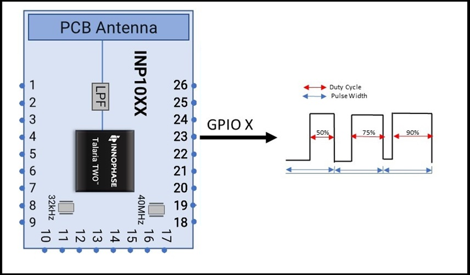
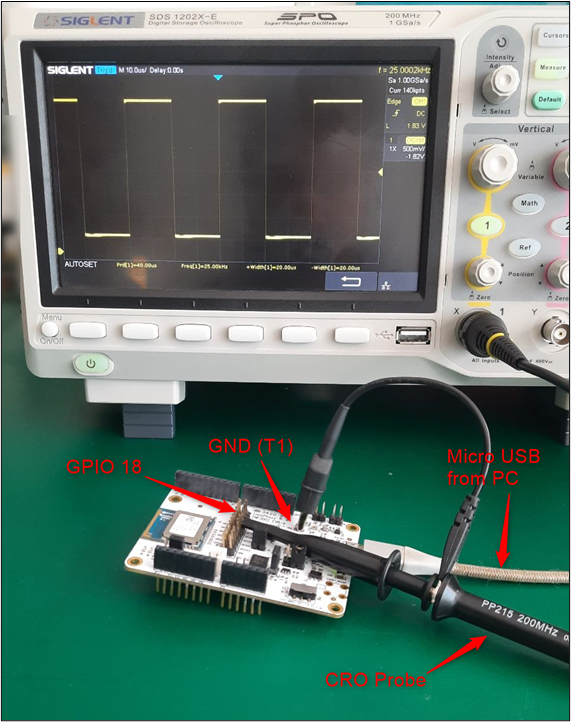
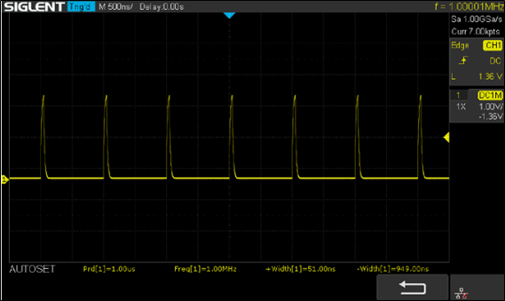
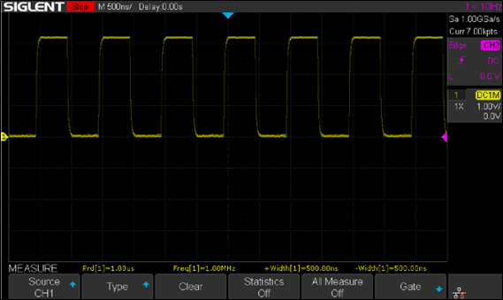
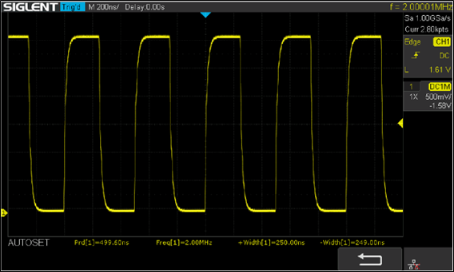
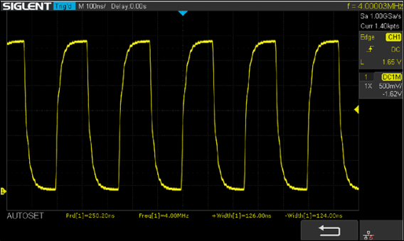
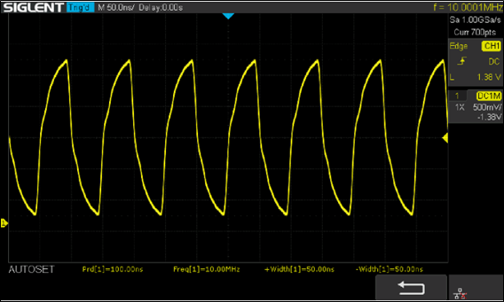
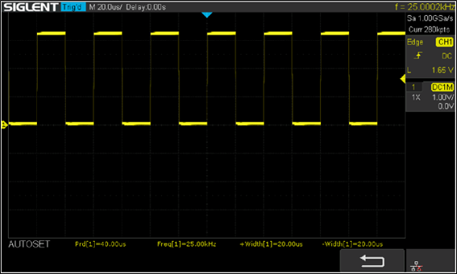

.. _ex pwm:

Pulse Width Modulation
----------------------------

This application note provides details on using the Pulse Width
Modulation (PWM) peripheral of INP1010/INP1011/INP1012/INP1013 Talaria
TWO modules. Two different applications - pwm and pwm_fade are described
in this app note. pwm application generates the PWM frequency of 1MHZ on
four different channels simultaneously and pwm_fade application
generates the PWM with varying duty cycles on one of the channels. The
output of the PWM is connected to LED D1. The brightness of the LED will
change based on varying duty cycle generated by the pwm_fade
application.

PWM Specifications 
~~~~~~~~~~~~~~~~~~~~~~~~~~~~~~~~

The following table contains the PWM specification of Talaria TWO.

.. table:: Table 1: PWM specification details

   +-----------------------------------+-----------------------------------+
   | **PWM Specification**             | **Details**                       |
   +===================================+===================================+
   | Maximum output frequency          | 40MHz                             |
   +-----------------------------------+-----------------------------------+
   | Duty Rate Range                   | 0% to 100%                        |
   +-----------------------------------+-----------------------------------+
   | Pulse Alignment                   | Left Aligned                      |
   +-----------------------------------+-----------------------------------+
   | Other                             | Audio Capable                     |
   +-----------------------------------+-----------------------------------+

Block Diagram
~~~~~~~~~~~~~~~~~~~~~~~~~~~~~~~~

|image64|

.. rst-class:: imagefiguesclass
Figure 1: PWM - Block Diagram

Building
~~~~~~~~~~~~~~~~~~~~~~~~~~~~~~~~

To build the sample application, execute the following commands:

.. code:: shell

      cd examples/pwm
      make

The make command should generate the pwm.elf and pwm_fade.elf in the out
directory.

Sample Code Walkthrough
~~~~~~~~~~~~~~~~~~~~~~~~~~~~~~~~

In this section, source code of pwm application and pwm_fade
applications are described. Following APIs are used in these
applications.

PWM APIs
~~~~~~~~~~~~~~~~~~~~~~~~~~~~~~~~

1. pwm_enable(): Creates a new PWM output on a given channel with a
   given period.

2. pwm_destroy(): Releases a previously created PWM output.

3. pwm_channel_cfg_set(): Configures the PWM Channel.

4. pwm_output_cfg_set(): Configures a specific PWM output.

5. pwm_output_cfg_set_array(): Configures multiple outputs.

6. os_gpio_request(): Allocates specified pins and configures them as
   GPIO. The pins are initially set up to be input. The direction of the
   pins can be changed by configuring the specified GPIO pins to be
   outputs.

7. os_gpio_set_mode(): Sets up GPIO pin mode.

8. os_gpio_mux_sel(): Configures GPIO pin mux.

PWM Application
~~~~~~~~~~~~~~~~~~~~~~~~~~~~~~~~

pwm application generates a PWM frequency of 1MHZ, 50% duty cycle on all
the four channels. In this application, the duty cycle is constant.

To enable PWM output on a specific GPIO, configure the pin mux using
os_gpio_mux_sel().

.. code:: shell

      os_gpio_mux_sel(GPIO_MUX_SEL_PWM_0P, pwm_port0);  
      os_gpio_mux_sel(GPIO_MUX_SEL_PWM_0N, pwm_port2);  
      os_gpio_mux_sel(GPIO_MUX_SEL_PWM_1P, pwm_port1);  
      os_gpio_mux_sel(GPIO_MUX_SEL_PWM_1N, pwm_port3);  

os_gpio_mux_sel() function sets the PWM functionality to the GPIO
specified in the argument.

Next, create a pwm_device using pwm_enable().The struct can be used to
configure the PWM output ports to operate with a certain duty cycle
defined in percentage.

.. code:: shell

          struct pwm_output_cfg cfg[4] = {
              { .port = 0, .duty_cycle = duty_port_0}, // Ch0 +
              { .port = 2, .duty_cycle = duty_port_2}, // Ch0 -
              { .port = 1, .duty_cycle = duty_port_1}, // Ch1 +
              { .port = 3, .duty_cycle = duty_port_3}, // Ch1 -
          };

pwm_enable() generates PWM output on a given channel with a given period
and width of the pulse.

.. code:: shell

      pwm_enable(period)  

To set the PWM duty cycle and port, configure pwm_output_cfg structure.

.. code:: shell

      struct pwm_output_cfg   

PWM fade Application
~~~~~~~~~~~~~~~~~~~~~~~~~~~~~~~~

In the pwm_fade application, PWM output of 1MHZ is generated on one
channel and PWM duty cycle varies continuously. GPIO is connected to LED
D1 of the EVB. When the application is loaded on to Talaria TWO, the LED
D1 is ON and varies the brightness in proportion to the PWM duty cycle.

**Note: Ensure that the jumper J3 on Talaria TWO EVB is connected.**

Application flow:

1. Set the port to operate with a 50% duty cycle.

2. Create a 1000ns (1Mhz) long PWM signal.

3. The infinite while loop runs the pwm_fade application.

This section describes configuring the PWM. To create a signal with a
period of 1000ns and duty cycle of 50% on channel 0, port 0, configure
the PWM via pwm_enable(), pwm_channel_cfg_set(), and
pwm_output_cfg_set().

.. code:: shell

      #define PWM_PIN 14
      #define PWM_PERIOD 1000

The PWM pin needs to be requested by os_gpio_request().
os_gpio_set_mode() sets the operational mode of the pins to the
GPIO_FUNCTION_MODE as PWM will operate the selected GPIO.

.. code:: shell

      struct pwm_output_cfg cfg ={ .port = 0, .duty_cycle = 50 };
          os_printf("PWM demo\n");
          os_gpio_request(PWM_PIN);	
          os_gpio_set_mode(PWM_PIN, GPIO_FUNCTION_MODE);    
          os_gpio_mux_sel(GPIO_MUX_SEL_PWM_0, PWM_PIN); 
          pwm_enable(PWM_PERIOD);
              if (pwm_channel_cfg_set(0, PWM_CTRL_ENABLE)) {
              pr_err("Failed to enable channel 0!\n");
          }

To change PWM width, configure the pwm_output_cfg_set parameter.

.. code:: shell

      struct pwm_output_cfg cfg = { .port = 0, .duty_cycle = 50 };    

Running the Application 
~~~~~~~~~~~~~~~~~~~~~~~~~~~~~~~~

Programming Talaria TWO using Download tool (pwm.elf)
~~~~~~~~~~~~~~~~~~~~~~~~~~~~~~~~

Program pwm.elf (*freertos_sdk_x.y\\examples\\pwm\\bin*) using the
Download tool (*freertos_sdk_x.y\\pc_tools\\Download_Tool\\bin*):

1. Launch the Download tool provided with InnoPhase Talaria TWO SDK.

2. In the GUI window:

   a. Boot Target: Select the appropriate EVK from the drop-down.

   b. ELF Input: Load the pwm.elf by clicking on Select ELF File.

   c. Boot Arguments: Pass the following boot arguments as applicable:

+------------------+-----------------------------+---------------------+
| **Function**     | **Boot Argument**           | **Example**         |
+==================+=============================+=====================+
| Selecting GPIO   | pwm.port_0 ( PWM Channel 0  | pwm.port_0=18       |
| Pin              | +)                          |                     |
+------------------+-----------------------------+---------------------+
|                  | pwm.port_2 ( PWM Channel 0  | pwm.port_2=20       |
|                  | -)                          |                     |
+------------------+-----------------------------+---------------------+
|                  | pwm.port_1 ( PWM Channel 1  | pwm.port_1=19       |
|                  | +)                          |                     |
+------------------+-----------------------------+---------------------+
|                  | pwm.port_3 (PWM Channel 1   | pwm.port_3=21       |
|                  | -)                          |                     |
+------------------+-----------------------------+---------------------+
| Common Duty      | pwm.duty_cycle ( For all    | pwm.duty_cycle=50   |
| Cycle Parameter  | PWM Pins)                   |                     |
+------------------+-----------------------------+---------------------+
| Individual Duty  | pwm.duty0 ( PWM Channel 0   | pwm.duty0=25        |
| Cycle Parameter  | +)                          |                     |
+------------------+-----------------------------+---------------------+
|                  | pwm.duty1 ( PWM Channel 1   | pwm.duty1=50        |
|                  | +)                          |                     |
+------------------+-----------------------------+---------------------+
|                  | pwm.duty2 ( PWM Channel 0   | pwm.duty2=75        |
|                  | -)                          |                     |
+------------------+-----------------------------+---------------------+
|                  | pwm.duty3 ( PWM Channel 1   | pwm.duty3=90        |
|                  | -)                          |                     |
+------------------+-----------------------------+---------------------+
| Setting PWM      | pwm.period                  | pwm.period = 1000   |
| Period           |                             |                     |
+------------------+-----------------------------+---------------------+

d. Programming: Prog RAM or Prog Flash as per requirement.

Expected output 
~~~~~~~~~~~~~~~~~~~~~~~~~~~~~~~~

Expected output is displayed on the console:

.. code:: shell

      UART:SNWWWWAE
      4 DWT comparators, range 0x8000
      Build $Id: git-8bc43d639 $
      hio.baudrate=921600
      flash: Gordon ready!
      
      Y-BOOT 208ef13 2019-07-22 12:26:54 -0500 790da1-b-7
      ROM yoda-h0-rom-16-0-gd5a8e586
      FLASH:PNWWWWAE
      Build $Id: git-adea113 $
      Flash detected. flash.hw.uuid: 39483937-3207-0083-00a1-ffffffffffff
      Bootargs: hio.transport=0 hio.maxsize=4096 ds.pf_method=2
      PWM demo

Programming Talaria TWO using Download tool (pwm_fade.elf)
~~~~~~~~~~~~~~~~~~~~~~~~~~~~~~~~~~~~~~~~~~~~~~~~~~~~~~~~~~~

Program pwm_fade.elf (*freertos_sdk_x.y\\examples\\pwm\\bin*) using the
Download tool:

1. Launch the Download tool provided with InnoPhase Talaria TWO SDK.

2. In the GUI window:

   a. Boot Target: Select the appropriate EVK from the drop-down.

   b. ELF Input: Load the pwm_fade.elf by clicking on Select ELF File.

   c. Programming: Prog RAM or Prog Flash as per requirement.

.. _expected-output-1:

Expected output 
~~~~~~~~~~~~~~~~~~~~~~~~~~~~~~~~

Expected output is displayed on the console:

.. code:: shell

      UART:SNWWWWAE
      4 DWT comparators, range 0x8000
      Build $Id: git-8bc43d639 $
      hio.baudrate=921600
      flash: Gordon ready!
      
      Y-BOOT 208ef13 2019-07-22 12:26:54 -0500 790da1-b-7
      ROM yoda-h0-rom-16-0-gd5a8e586
      FLASH:PNWWWWAE
      Build $Id: git-adea113 $
      Flash detected. flash.hw.uuid: 39483937-3207-0083-00a1-ffffffffffff
      Bootargs: hio.transport=0 hio.maxsize=4096 ds.pf_method=2
      PWM FADE demo

PWM Test Setup
~~~~~~~~~~~~~~~~~~~~~~~~~~~~~~~~

Figure 2 represents the PWM test setup, where Talaria TWO evaluation
board is powered through USB and the pwm.elf is flashed onto the module
using the Download Tool. The GPIO which is configured to work as PWM is
connected to the Oscilloscope along with ground. Once the module is
released from Reset, the waveforms can be observed on the oscilloscope.

|image65|

.. rst-class:: imagefiguesclass
Figure 2: PWM Test Setup

Waveforms captured for 1MHz frequency with less than 5% duty cycle is as
shown in Figure 3.

|image66|

.. rst-class:: imagefiguesclass
Figure 3: Waveforms for 1MHz frequency with less than 5% duty cycle

Waveforms captured for 1MHz frequency with 50% duty cycle is as shown in
Figure 4.

|image67|

.. rst-class:: imagefiguesclass
Figure 4: Waveforms for 1MHz frequency with 50% duty cycle

Waveforms captured for 2MHz frequency with 50% duty cycle is as shown in
Figure 5.

|image68|

.. rst-class:: imagefiguesclass
Figure 5: Waveforms for 2MHz frequency with 50% duty cycle

Waveforms captured for 4MHz frequency with 50% duty cycle is as shown in
Figure 6.

|image69|

.. rst-class:: imagefiguesclass
Figure 6: Waveforms for 4MHz frequency with 50% duty cycle

Waveforms captured for 10MHz frequency with 50% duty cycle is as shown
in Figure 7.

|image70|

.. rst-class:: imagefiguesclass
Figure 7: Waveforms for 10MHz frequency with 50% duty cycle

Waveforms captured for 25KHz frequency with more than 50% duty cycle is
as shown in Figure 8.

|image71|

.. rst-class:: imagefiguesclass
Figure 8: Waveforms for 25KHz frequency with more than 50% duty cycle

