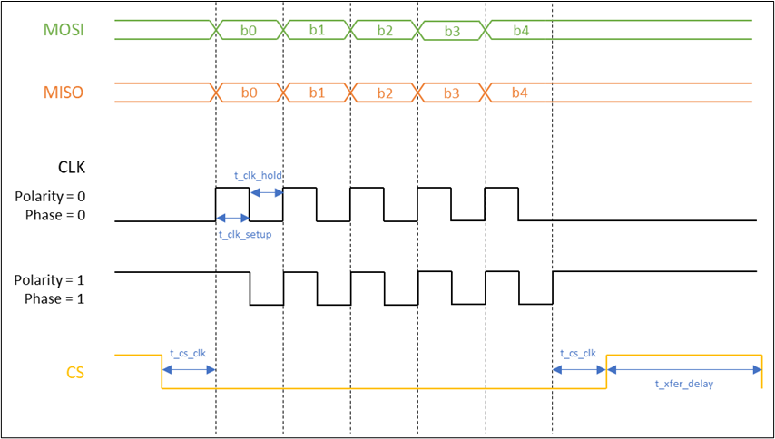
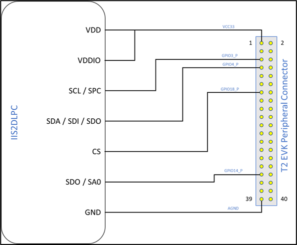
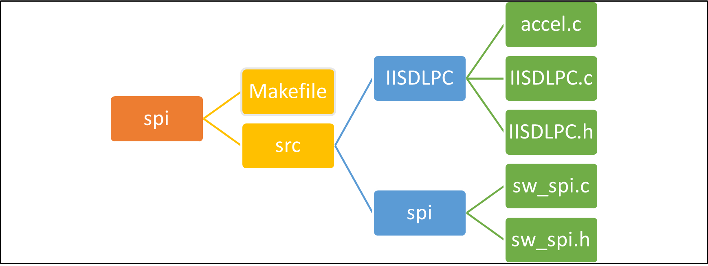

.. _ex software spi master:

Software SPI Master
---------------------

This application note describes the usage of the Software SPI Master
(SSM) on Talaria TWO. SSM enables Talaria TWO to act as SPI master using
the available GPIOs by generating and processing SPI signals in
software. SSM supports a variety of operating modes and the number of
SPI interfaces is limited only by the number of available GPIOs. This
provides flexibility for Talaria TWO to interface with peripherals in
diverse applications.

Supported Modes and Configuration Options
~~~~~~~~~~~~~~~~~~~~~~~~~~~~~~~~

This section describes the operating modes and options supported by SSM.
These options are set in an instance of SPI options structure,
spiopts_t.

Data Length
~~~~~~~~~~~~~~~~~~~~~~~~~~~~~~~~

SSM can be configured to transfer between 1 and 16 bits (inclusive) per
call to spi_xfer().

Shift Direction
~~~~~~~~~~~~~~~~~~~~~~~~~~~~~~~~

Transmit data can be shifted out with MSB first or LSB first.
Additionally, SSM can be configured to interpret received data as either
MSB first or LSB first. Shift direction can be configured independently
for transmit and receive directions.

Clock Phase
~~~~~~~~~~~~~~~~~~~~~~~~~~~~~~~~

SSM supports configuration of clock phase as 0 or 1. This setting is
independent of clock polarity. Figure 1 illustrates how this option
affects the clock generated by the SSM.

Clock Polarity
~~~~~~~~~~~~~~~~~~~~~~~~~~~~~~~~

SSM supports configuration of clock polarity as 0 or 1. This setting is
independent of clock phase. Figure 1 illustrates how this option affects
the clock generated by the SSM.

3-Pin / 4-Pin Modes
~~~~~~~~~~~~~~~~~~~~~~~~~~~~~~~~

SSM supports both 3-pin and 4-pin modes of operation. In 3-pin mode, no
chip select (CS) is used.

GPIOs
~~~~~~~~~~~~~~~~~~~~~~~~~~~~~~~~

SSM can be configured to use any GPIO for each of the SPI signals: CLK,
MOSI, MISO, and CS (optional).

Timing
~~~~~~~~~~~~~~~~~~~~~~~~~~~~~~~~

SSM supports configuration of the timing parameters as shown in Figure
1.

Timing Diagram
~~~~~~~~~~~~~~~~~~~~~~~~~~~~~~~~

Figure 1 illustrates SPI signals generated by the Software SPI Master
for each possible combination of clock polarity and phase. The diagram
illustrates a 5-bit transfer in 4-wire mode. Timing parameters are also
shown.

|image74|

Figure 1: Timing diagram illustrating SSM operation, 5-bit transfer shown

Data is set up on the MOSI and MISO lines at the times indicated by
vertical dotted lines in the diagram (except the last one at the end of
the transfer). Data is sampled on the clock edges between the dotted
lines.

IIS2DLPC 3-axis Accelerometer Sample
~~~~~~~~~~~~~~~~~~~~~~~~~~~~~~~~

Software SPI Master is accompanied by a code sample that communicates
with an IIS2DLPC 3-axis accelerometer over SPI. This sample is provided
in the IIS2DLPC folder alongside the SSM code. The sample puts the
IIS2DLPC in a particular operational mode and reads and displays
acceleration values from the device. Communication with the IIS2DLPC is
accomplished via the SSM.

Running the Application
~~~~~~~~~~~~~~~~~~~~~~~~~~~~~~~~

Before booting Talaria TWO with the sample application, the IIS2DPLC
must be connected using 4 GPIOs for the SPI signals (CLK, MOSI, MISO,
CS) as well as Power and Ground. By default, the sample application uses
the GPIO to SPI signal mapping shown in Table 1. However, any available
GPIOs can be used.

**Note**: With this mapping, the JTAG jumper must be removed from the
baseboard so that GPIO18 is routed to the peripheral connector instead
of being used for JTAG.

.. table:: Table 1: Sample GPIO - SPI signal mapping

   +-----------------------------------+-----------------------------------+
   | **GPIO**                          | **SPI Signal**                    |
   +===================================+===================================+
   | GPIO3                             | CLK                               |
   +-----------------------------------+-----------------------------------+
   | GPIO4                             | MOSI                              |
   +-----------------------------------+-----------------------------------+
   | GPIO14                            | MISO                              |
   +-----------------------------------+-----------------------------------+
   | GPIO18                            | CS                                |
   +-----------------------------------+-----------------------------------+

With this mapping, the connection between the peripheral connecter on
Talaria TWO EVK and the IIS2DLPC looks as shown in Figure 2.

|image75|

Figure 2: Sample connection of IIS2DLPC to Talaria TWO EVK

Once the IIS2DPLC has been connected to Talaria TWO, flash the sample
app spi_sensor.elf using the Download Tool.

Program spi_sensor.elf (*freertos_sdk_x.y\\examples\\spi\\bin*) using
the Download tool (*freertos_sdk_x.y\\pc_tools\\Download_Tool\\bin)*:

1. Launch the Download tool provided with InnoPhase Talaria TWO SDK.

2. In the GUI window:

   a. Boot Target: Select the appropriate EVK from the drop-down

   b. ELF Input: Load the spi_sensor.elf by clicking on Select ELF File.

   c. Boot arguments: Pass the following boot arguments. if a different
      GPIO other than the default pins in Table 1 are to be used for the
      SPI:

.. code:: shell

      clk_pin=<gpio pin>, mosi_pin=<gpio pin>, miso_pin=<gpio_pin>, cs_pin=<gpio_pin>

d. Programming: Prog RAM or Prog Flash as per requirement.

**
**

Following is the sample output that is observed on the Download Tool
console after flashing the spi_sensor.elf.

.. code:: shell

      UART:SNWWWWAE
      4 DWT comparators, range 0x8000
      Build $Id: git-8bc43d639 $
      hio.baudrate=921600
      flash: Gordon ready!
      
      Y-BOOT 208ef13 2019-07-22 12:26:54 -0500 790da1-b-7
      ROM yoda-h0-rom-16-0-gd5a8e586
      FLASH:PNWWWWAE
      Build $Id: git-6576f93 $
      Flash detected. flash.hw.uuid: 39483937-3207-0086-006f-ffffffffffff
      Bootargs: hio.transport=uart hio.maxsize=4096 ds.pf_method=2
      Using GPIOs: CLK [3] MOSI [4] MISO [14] CS [18]
      IIS2DLPC sanity check: [PASSED]
      IIS2DLPC device ID: [0x44]
      Acceleration (x, y, z):
      (32744, -32744, -32744)                          
      (32744, -32744, -32744)                          
      (32744, -32744, -32744)                          
      (32744, -32744, -32744)                          
      (32744, -32744, -32744)                          
      (32744, -32744, -32744)                          
      (32744, -32744, -32744)                          
      (32744, -32744, -32744)                          
      (32744, -32744, -32744)                          
      (32744, -32744, -32744)                          
      (32744, -32744, -32744)                          
      (32744, -32744, -32744)                          
      (32744, -32744, -32744)                          
      (32744, -32744, -32744)                          
      (32744, -32744, -32744)                          
      (32744, -32744, -32744)                          
      (32744, -32744, -32744)                          
      (32744, -32744, -32744)    

Code Overview
~~~~~~~~~~~~~~~~~~~~~~~~~~~~~~~~

Directory structure
~~~~~~~~~~~~~~~~~~~
|image76|

Figure 3: Directory Structure

1. **IISDLPC**

a. accel.c

..

   The accel.c file contains the routines to configure the IIS2DLPC and
   read the acceleration values from the device.

b. IISDLPC.c

..

   The IISDLPC.c file contains the functions for communicating with an
   IIS2DLPC 3-axis accelerometer using the software SPI master.

c. IISDLPC.h

..

   This code contains IIS2DLPC register definitions and function
   prototypes for communicating with an IIS2DLPC 3-axis accelerometer
   using the software SPI master.

2. **spi**

   a. sw_spi.c

..

   This code contains the logic to enable software SPI master to measure
   the readings of the IISDLPC accelerometer and displays the readings
   from sensor periodically.

b. sw_spi.h

..

   This code contains the software SPI master (SSM) definitions and
   function prototypes. It provides prototypes for the following
   functions that initiate, destroy and transfer.

Using SSM
~~~~~~~~~

To use the Software SPI Master, set-up an instance of a spiopts_t
structure to specify SSM options as well as the GPIOs that the SSM will
use. Section 5 provides more details on the different operating modes
and configuration options supported by the SSM.

.. code:: shell

      spiopts_t spiopts = { /* Set up SSM options here */ };

Once a spiopts_t structure has been set up, initialize the SSM by
calling the initialization function with a pointer to the options
structure:

.. code:: shell

      spi_init(&spiopts);   

This will allocate and set up the specified GPIOs for SSM operation,
returning true if successful.

After initialization, data is transferred over SPI by calling the
transfer function:

.. code:: shell

      uint16_t data_rx, data_tx;
      data_rx = spi_xfer(&spiopts, data_tx);

This performs a bidirectional transfer of the number of bits specified
in the spiopts_t structure. Transmit data in data_tx if the data length
is configured to be less than 16 bits. Received data in data_rx.

After the SSM Tx and Rx Operations, Call the destroy function to clean
up the SSM and release the previously allocated GPIOs:

.. code:: shell

      spi_destroy(&spiopts);   

A sample application that makes use of the SSM is described in section 7
of this document.

sw_spi.c
~~~~~~~~

In software SPI master, SPI can be virtualized using software to
simulate the physical SPI port. Its Initialization is based on user
configuration. spi_init() initializes the GPIOs for software SPI master
operation. Verify that the same pin is not assigned to more than one SPI
function.

.. code:: shell

      if( spiopts->clk_pin == spiopts->mosi_pin ||
              spiopts->clk_pin == spiopts->miso_pin ||
              spiopts->mosi_pin == spiopts->miso_pin ||
              (spiopts->cs_en && (spiopts->clk_pin == spiopts->cs_pin ||
                                  spiopts->mosi_pin == spiopts->cs_pin ||
                                  spiopts->miso_pin == spiopts->cs_pin )))
          {
              os_printf("[SPI] ERROR: the same pin cannot be assigned to more than one SPI signal\n");
              return false;
          }

os_gpio_request()configures the selected pin as GPIOs for SSM.

.. code:: shell

      if(!os_gpio_request(pin2gpio(spiopts->clk_pin)))
          {
              os_printf("[SPI] ERROR: Could not configure CLK pin as GPIO\n");
              return false;
          }
          if(!os_gpio_request(pin2gpio(spiopts->mosi_pin)))
          {
              os_printf("[SPI] ERROR: Could not configure MOSI pin as GIPO\n");
              
              os_gpio_free(pin2gpio(spiopts->clk_pin));
              return false;
          }
          if(!os_gpio_request(pin2gpio(spiopts->miso_pin)))
          {
              os_printf("[SPI] ERROR: Could not configure MISO pin as GPIO\n");
              
              os_gpio_free(pin2gpio(spiopts->clk_pin) | pin2gpio(spiopts->mosi_pin));
              return false;
          }
          if(spiopts->cs_en && !os_gpio_request(pin2gpio(spiopts->cs_pin)))
          {
              os_printf("[SPI] ERROR: Could not configure CS pin as GPIO\n");
              os_gpio_free(pin2gpio(spiopts->clk_pin) | pin2gpio(spiopts->mosi_pin) | pin2gpio(spiopts->miso_pin));
              return false;
          }

The GPIO output state is set before configuring as output value using
os_gpio_set_pin().

.. code:: shell

      gpio_write(pin2gpio(spiopts->clk_pin), spiopts->clk_pol);
      os_gpio_clr_pin(pin2gpio(spiopts->mosi_pin));
      if(spiopts->cs_en)
           os_gpio_set_pin(pin2gpio(spiopts->cs_pin));

Configure GPIOs as input or output as appropriate:

.. code:: shell

      os_gpio_set_output(
                  pin2gpio(spiopts->clk_pin) |
                  pin2gpio(spiopts->mosi_pin) |
                  (spiopts->cs_en ? pin2gpio(spiopts->cs_pin) : 0) );
          os_gpio_set_input(pin2gpio(spiopts->miso_pin));

spi_destroy() frees GPIOs previously set up for software SPI master
operation.

.. code:: shell

      void spi_destroy(const spiopts_t * spiopts)
      {
          os_gpio_free(
                  pin2gpio(spiopts->clk_pin) |
                  pin2gpio(spiopts->mosi_pin) |
                  pin2gpio(spiopts->miso_pin) |
                  (spiopts->cs_en ? pin2gpio(spiopts->cs_pin) : 0) );
      }

spi_xfer()performs a bidirectional data transfer using SSM. spi_init()
must first be called with the SPI opts structure before this function is
called. This function returns the received data.

.. code:: shell

      bool clk = (spiopts->clk_phase == spiopts->clk_pol);   

This is initialized to the clock level that will be set when the first
bit is written out on MOSI.

.. code:: shell

      uint16_t mask_tx = spiopts->shiftdir_tx == MSB_FIRST ? (1 << (spiopts->datalen-1)) : 1;

This is initialized to select the first bit of data_tx to transmit.

.. code:: shell

      uint16_t data_rx = 0;

Extra bits are padded with 0s. This sets CS low. The CS line is normally
held high, which disconnects the peripheral from the SPI bus. Just
before data is sent to the peripheral, the line is brought low, which
activates the peripheral.

.. code:: shell

      if(spiopts->cs_en)
          {
              os_gpio_clr_pin(pin2gpio(spiopts->cs_pin));
              os_wait_usec(spiopts->t_cs_clk);
          }
      /* Shift bits */
          for(uint8_t i = 0; i < spiopts->datalen; i++)
          {
              bool bit_tx = data_tx & mask_tx;
              bool bit_rx = 0;

Data is set at the same time as the clock is updated.

.. code:: shell

      os_gpio_set_value( (clk ? pin2gpio(spiopts->clk_pin) : 0) | (bit_tx ? pin2gpio(spiopts->mosi_pin) : 0),
                                 (!clk ? pin2gpio(spiopts->clk_pin) : 0) | (!bit_tx ? pin2gpio(spiopts->mosi_pin) : 0) );
      
              os_wait_usec(spiopts->t_clk_setup);

The following code snippet samples the sensor rx data. It holds the
clock for a second when it starts preparing for the next bit.

.. code:: shell

      clk = !clk;
              gpio_write(pin2gpio(spiopts->clk_pin), clk);
              bit_rx = os_gpio_get_value(pin2gpio(spiopts->miso_pin));
      
              if(spiopts->shiftdir_rx == MSB_FIRST)
                  data_rx = (data_rx << 1) | bit_rx;
              else
                  data_rx = (data_rx >> 1) | ((uint16_t)bit_rx << (spiopts->datalen-1));
               /* Hold */
              os_wait_usec(spiopts->t_clk_hold);
              /* Prepare for next bit */
              clk = !clk;
              if(spiopts->shiftdir_tx == MSB_FIRST)
                  mask_tx >>= 1;
              else
                  mask_tx <<= 1;
          }

The following gpio_write() function sets the clock back to its polarity
value:

.. code:: shell

      gpio_write(pin2gpio(spiopts->clk_pin), spiopts->clk_pol);   

The following code block sets the ‘cs’ to high and master disables the
communication through the SPI protocol with the slave:

.. code:: shell

         if(spiopts->cs_en)
          {        os_wait_usec(spiopts->t_cs_clk);
              os_gpio_set_pin(pin2gpio(spiopts->cs_pin));    }

sw_spi.h
~~~~~~~~

The sw_spi.h file contains the software SPI master (SSM) definitions and
function prototypes. It provides prototypes for the following functions
that initiate, destroy and transfer.

accel.c
~~~~~~~

The accel.c file contains the routines to configure the IIS2DLPC and
reads acceleration values from the device by reading and writing from/to
the IIS2DLPC registers. For communication with the IIS2DLPC, this code
relies on functions and register definitions provided in IIS2DLPC.h and
IIS2DLPC.c.

The get_bootarg_pins() gets the GPIO pins for SPI signals via boot
arguments.

.. code:: shell

          if(!get_bootarg_pins(&clk_pin, &mosi_pin, &miso_pin, &cs_pin))
          {
              print_usage();
              return 1;
          }
          os_printf("Using GPIOs: CLK [%" PRIu8 "] MOSI [%" PRIu8 "] MISO [%" PRIu8 "] CS [%" PRIu8 "]\n",
                  clk_pin, mosi_pin, miso_pin, cs_pin);

IIS2DLPC_init initializes SW SPI master for communication with IIS2DLPC.

.. code:: shell

      if(!IIS2DLPC_init(&spiopts, clk_pin, mosi_pin, miso_pin, cs_pin))
    {
        os_printf("Could not initialize software SPI master for IIS2DLPC communication; aborting\n");
        return 2;
    }

IIS2DLPC_sanity_check runs a sanity check. This delay is only to make it
easier to examine SPI signals with a scope and is not needed for proper
operation. It gives time to examine the initial state of signals after
reset and before the first transfer.

.. code:: shell

          if(IIS2DLPC_sanity_check(&spiopts))
          {
              os_printf("IIS2DLPC sanity check: [PASSED]\n");
          }
          else
          {
              os_printf("IIS2DLPC sanity check: [FAILED]\n");
              os_printf("Aborting\n");
              return 3;
          }
          os_printf("IIS2DLPC device ID: [0x%" PRIX8 "]\n", IIS2DLPC_read_id(&spiopts));

IISDLPC_set_mode sets the IIS2DLPC operating mode.

.. code:: shell

      IIS2DLPC_set_mode(&spiopts);    

This code reads the values from the accelerometer through SPI.

.. code:: shell

      os_printf("Acceleration (x, y, z):\n");
         while(1)
          {
              accel_t accel = {0, 0, 0};
              char dispbuf[DISPBUF_LEN] = "";
              IIS2DLPC_read_accel(&spiopts, &accel);
              snprintf(dispbuf, DISPBUF_LEN, "(%" PRId16 ", %" PRId16 ", %" PRId16 ")", accel.accel_x, accel.accel_y, accel.accel_z);
      os_printf("%-*s\r", DISPBUF_LEN-1, dispbuf);
      os_msleep(ACCEL_READ_PERIOD_MS);
          }

The get_bootarg_pins() retrieves GPIO pin numbers for SPI signals from
boot arguments. If all pin numbers are valid, the pin numbers are stored
in the locations pointed to by the pin_out arguments and the function
returns true. Otherwise, the function returns false, and the memory
pointed to by the pin_out arguments remain unchanged. Also, it prints
all the pin details in the console. If no boot arguments are provided
for the GPIO pins, the default pins are selected for SPI.

.. code:: shell

      uint8_t clk_pin = 0, mosi_pin = 0, miso_pin = 0, cs_pin = 0;
      
      if(!clk_pin_out || !mosi_pin_out || !miso_pin_out || !cs_pin_out)
              return false;
      
          clk_pin = os_get_boot_arg_int("clk_pin", CLK_PIN_DEFAULT);
          mosi_pin = os_get_boot_arg_int("mosi_pin", MOSI_PIN_DEFAULT);
          miso_pin = os_get_boot_arg_int("miso_pin", MISO_PIN_DEFAULT);
          cs_pin = os_get_boot_arg_int("cs_pin", CS_PIN_DEFAULT);
      
      if(!gpio_pin_valid(clk_pin))
          {
              os_printf("Invalid GPIO pin number specified for CLK\n");
              return false;
          }
          if(!gpio_pin_valid(mosi_pin))
          {
              os_printf("Invalid GPIO pin number specified for MOSI\n");
              return false;
          }
          if(!gpio_pin_valid(miso_pin))
          {
              os_printf("Invalid GPIO pin number specified for MISO\n");
              return false;
          }
          if(!gpio_pin_valid(cs_pin))
          {
              os_printf("Invalid GPIO pin number specified for CS\n");
              return false;
          }
      
          *clk_pin_out = clk_pin;
          *mosi_pin_out = mosi_pin;
          *miso_pin_out = miso_pin;
          *cs_pin_out = cs_pin;
      
          return true;
      }

gpio_pin_valid() checks a GPIO pin number against the array of valid
GPIO pin numbers. Returns true if the pin number appears in the list,
false otherwise.

.. code:: shell

          for(size_t i = 0; i < sizeof(VALID_GPIOS) / sizeof(VALID_GPIOS[0]); i++)
              if(pin == VALID_GPIOS[i])
                  return true;
         return false;

The IIS2DLPC functions added in accel.c interact with the IIS2DLPC in a
manner that is specific to these functions and the use of the device by
this application. The IIS2DLPC_sanity_check() runs a sanity check by
writing values to an IIS2DLPC R/W register and reading them back.

.. code:: shell

      uint8_t data8_initial = IIS2DLPC_read8(spiopts, IIS2DLPC_TAP_THS_X);
          if(!IIS2DLPC_reg_wr_test(spiopts, IIS2DLPC_TAP_THS_X, 0xAA, 0xAA))
              return false;
          if(!IIS2DLPC_reg_wr_test(spiopts, IIS2DLPC_TAP_THS_X, 0x55, 0x55))
              return false;
          if(!IIS2DLPC_reg_wr_test(spiopts, IIS2DLPC_TAP_THS_X, 0x0, 0x0))
              return false;
          if(!IIS2DLPC_reg_wr_test(spiopts, IIS2DLPC_TAP_THS_X, 0xFF, 0xFF))
              return false;
          if(!IIS2DLPC_reg_wr_test(spiopts, IIS2DLPC_TAP_THS_X, data8_initial, data8_initial))
              return false;
          return true;

IIS2DLPC_reg_wr_test() writes a value to the IIS2DLPC register, reads
the register, and compares the read value with an expected value.

.. code:: shell

          uint8_t data8_read = 0;
          IIS2DLPC_write8(spiopts, addr, data8_write);
          if((data8_read = IIS2DLPC_read8(spiopts, addr)) != data8_expected)
          {
              os_printf("Register WR test: unexpected register value\n");
              os_printf("Addr: [0x%" PRIX8 "] Wrote: [0x%" PRIX8 "] Read: [0x%" PRIX8 "] Expected: [0x%" PRIX8 "]\n",
                      addr, data8_write, data8_read, data8_expected);
      
              return false;
          }
          return true;
      }

IIS2DLPC_read_id() reads the device ID of the IIS2DLPC.

.. code:: shell

      return IIS2DLPC_read8(spiopts, IIS2DLPC_WHO_AM_I);  

IIS2DLPC_set_mode() sets the IIS2DLPC in the mode that will be used for
this application. Here low noise, low power mode 4, 12.5Hz data rate, on
demand mode and trigger acceleration reading via register bit are
enabled.

.. code:: shell

      data8 = IIS2DLPC_read8(spiopts, IIS2DLPC_CTRL6);
      data8 = setbit(data8, IIS2DLPC_CTRL6_LOW_NOISE_OFFSET);
      IIS2DLPC_write8(spiopts, IIS2DLPC_CTRL6, data8);
        
      IIS2DLPC_write8(spiopts, IIS2DLPC_CTRL1,
                  (0x2 << IIS2DLPC_CTRL1_ODR_OFFSET) |
                  (0x2 << IIS2DLPC_CTRL1_MODE_OFFSET) |
                  (0x3 << IIS2DLPC_CTRL1_LP_MODE_OFFSET));
      
      data8 = IIS2DLPC_read8(spiopts, IIS2DLPC_CTRL3);
      data8 = setbit(data8, IIS2DLPC_CTRL3_SLP_MODE_SEL_OFFSET);
      IIS2DLPC_write8(spiopts, IIS2DLPC_CTRL3, data8);

IIS2DLPC_read_accel()triggers an acceleration reading from the IIS2DLPC
and waits for the result. IIS2DLPC_set_mode must be called before
calling this function.

.. code:: shell

      data8 = IIS2DLPC_read8(spiopts, IIS2DLPC_CTRL3);
      data8 = setbit(data8, IIS2DLPC_CTRL3_SLP_MODE_1_OFFSET);
      IIS2DLPC_write8(spiopts, IIS2DLPC_CTRL3, data8);

This reads the acceleration values from sensor:

.. code:: shell

      accel_x = IIS2DLPC_read8(spiopts, IIS2DLPC_OUT_X_L);
      accel_x |= (uint16_t)IIS2DLPC_read8(spiopts, IIS2DLPC_OUT_X_H) << 8;
      accel_y = IIS2DLPC_read8(spiopts, IIS2DLPC_OUT_Y_L);
      accel_y |= (uint16_t)IIS2DLPC_read8(spiopts, IIS2DLPC_OUT_Y_H) << 8;
      accel_z = IIS2DLPC_read8(spiopts, IIS2DLPC_OUT_Z_L);
      accel_z |= (uint16_t)IIS2DLPC_read8(spiopts, IIS2DLPC_OUT_Z_H) << 8;

Acceleration values are stored in 16-bit 2's complement format. This
conversion relies on implementation-defined behavior.

.. code:: shell

      accel->accel_x = (int16_t)accel_x;
      accel->accel_y = (int16_t)accel_y;
      accel->accel_z = (int16_t)accel_z;

IISDLPC.c
~~~~~~~~~

The functions in IISDLPC.c makes use of the SSM to communicate with an
IIS2DLPC. This contains functions for communicating with an IIS2DLPC
3-axis accelerometer using SSM.

IIS2DLPC_init() initializes SSM for communication with an IIS2DLPC. This
function sets up the supplied SPI options structure with values required
for communicating with an IIS2DLPC and initializes the SSM with the
options structure.

.. code:: shell

      spiopts->datalen = 16;
      spiopts->shiftdir_tx = MSB_FIRST;
      spiopts->shiftdir_rx = MSB_FIRST;
      spiopts->clk_phase = 0;
      spiopts->clk_pol = 1;
      spiopts->cs_en = true;
      spiopts->clk_pin = clk_pin;
      spiopts->mosi_pin = mosi_pin;
      spiopts->miso_pin = miso_pin;
      spiopts->cs_pin = cs_pin;
      spiopts->t_clk_setup = 25;
      spiopts->t_clk_hold = 25;
      spiopts->t_cs_clk = 25;
      spiopts->t_xfer_dly = 25;
      return spi_init(spiopts);

IIS2DLPC_destroy() cleans the resources (GPIOs) allocated by
IIS2DLPC_init(). IIS2DLPC_read8() reads a byte from the IIS2DLPC device
at a given address.

.. code:: shell

      uint16_t data_rx = 0;
      data_rx = spi_xfer(spiopts, 0x8000 | (uint16_t)(addr & 0x7F) << 8);
      return data_rx & 0xFF;

IIS2DLPC_write8() writes a byte to the IIS2DLPC device at a given
address.

.. code:: shell

      spi_xfer(spiopts, (uint16_t)(addr & 0x7F) << 8 \| data);       

IISDLPC.h
~~~~~~~~~

IIS2DLPC_init() initializes spiopts_t structure with the options
required for communicating with an IIS2DLPC device. It has parameters
for GPIO pin numbers to be used for SPI signals, which are registered in
the structure. After initializing the structure, this function calls
spi_init() to initialize the SSM.

IIS2DLPC_read8() reads the value of an IIS2DLPC register at a given
address and returns the data. This function must be passed as a pointer
to spiopts_t structure previously initialized with IIS2DLPC_init().

IIS2DLPC_write8() writes a value to an IIS2DLPC register at a given
address. This function must be passed as a pointer to spiopts_t
structure previously initialized with IIS2DLPC_init().

IIS2DLPC_destroy() frees the resources previously allocated by
IIS2DLPC_init() after the communication with the device is complete.

SPI Throughput
~~~~~~~~~~~~~~~~~~~~~~~~~~~~~~~~

The sample application (spi_throughput.c) demonstrates the SPI
throughput measurement.

This application transfers address and data bytes over the SPI
interface. Each iteration transfers 1 R/W bit, 7 address bits, and data
bits available in the RX_BUF_SZ buffer. After running the throughput
test, the application prints the throughput (in kbps) over the console.

**Application flow:**

1. Application writes ‘0’ on the ctrl register 2 (IIS2DLPC_CTRL2) to
      select SPI 4 wire interface and this disables auto address
      increment.

2. Application reads the sensor ID (IIS2DLPC_WHO_AM_I) from the sensor
      and prints it over the console.

3. Application now starts the throughput test.

4. After 100000 iterations, the application prints throughput over the
      console.

.. _running-the-application-1:

Running the Application
~~~~~~~~~~~~~~~~~~~~~~~~~~~~~~~~

Before booting Talaria TWO with the sample application, IIS2DPLC must be
connected using 4 GPIOs for the SPI signals (CLK, MOSI, MISO, CS) as
well as Power and Ground. By default, the sample application uses the
GPIO to SPI signal mapping shown in Table 1. However, any available
GPIOs can be used. The connection between the peripheral connecter on
Talaria TWO EVK and the IIS2DLPC is as shown in Figure 2.

**Note**: With signal mapping mentioned in Table 1, the JTAG jumper must
be removed from the baseboard so that GPIO18 is routed to the peripheral
connector instead of being used for JTAG.

Once the IIS2DPLC has been connected to Talaria TWO, flash the sample
application spi_throughput.elf using the Download Tool.

Program spi_throughput.elf (*freertos_sdk_x.y\\examples\\spi\\bin*)
using the Download tool:

1. Launch the Download tool provided with InnoPhase Talaria TWO SDK.

2. In the GUI window:

   a. Boot Target: Select the appropriate EVK from the drop-down

   b. ELF Input: Load the spi_throughput.elf by clicking on Select ELF
      File.

   c. Programming: Prog RAM or Prog Flash as per requirement.

Expected Output
~~~~~~~~~~~~~~~~~~~~~~~~~~~~~~~~

Following is a sample output observed on the Download Tool console after
flashing spi_throughput.elf.

.. code:: shell

      UART:SNWWWWAE
      4 DWT comparators, range 0x8000
      Build $Id: git-8bc43d639 $
      hio.baudrate=921600
      flash: Gordon ready!
      
      Y-BOOT 208ef13 2019-07-22 12:26:54 -0500 790da1-b-7
      ROM yoda-h0-rom-16-0-gd5a8e586
      FLASH:PNWWWWAE
      Build $Id: git-6576f93 $
      Flash detected. flash.hw.uuid: 39483937-3207-0086-006f-ffffffffffff
      Bootargs: hio.transport=uart hio.maxsize=4096 ds.pf_method=2
      Chip ID: 0x44
      
      Running throughput test...
      100000 iterations
      40301883 usec
      205600000 bits transferred in 40 seconds (5101 kbps)

