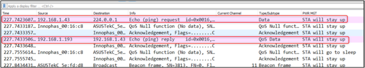

.. _ex wifi power management:

WiFi Power Management
-----------------------

This application note describes the Wi-Fi Connection Manager’s power
management APIs available in the SDK.

WCM Power Management
~~~~~~~~~~~~~~~~~~~~~~~~~~~~~~~~~~

The WCM power management configuration APIs allow the application to
configure the Wi-Fi interface with the following power management flags.

1. WIFI_PM_PS_POLL: Sends PS poll if a beacon was missed.

2. WIFI_PM_DYN_LISTEN_INT: Dynamic listen interval.

3. WIFI_PM_STA_RX_NAP: Turns off receiver for uninteresting frames for
   station.

4. WIFI_PM_STA_ONLY_BROADCAST: Does not receive multicast frames that
   are not broadcast (only effective if rx_nap is used).

5. WIFI_PM_TX_PS: Sends outgoing frames without leaving Wi-Fi power
   save.

6. WIFI_PM_MCAST_DONT_CARE: Ignores the multicast flag in beacons. i.e.,
   does not receive multicast or broadcast frames.

7. WIFI_PM_DTIM_ONLY: Wakes up only at effective listen interval and
   does not switch to listen to every beacon in case of beacon miss.

This application note demonstrates usage of the above flags.

WCM Power Management APIs
~~~~~~~~~~~~~~~~~~~~~~~~~~~~~~~~~~

Following are the WCM power management APIs used in this application

1. wcm_pm_config()

..

   Sets the Power Management configuration of a Wi-Fi interface.

2. wcm_pm_config_get()

..

   Gets Power Management configuration of a Wi-Fi interface.

Source Code Walkthrough
~~~~~~~~~~~~~~~~~~~~~~~~~~~~~~~~~~

WCM_PM with Different Listen Interval
~~~~~~~~~~~~~~~~~~~~~~~~~~~~~~~~~~

Overview
~~~~~~~~

The sample code is in the path *example/wcm_pm/src/wcm_pm.c*. This
describes how the API wcm_pm_config()is used to disable the pm_flags to
achieve optimized power consumption. The two power-save parameters being
used in code are explained below:

1. Listen interval

..

   Specifies how often the device will wake-up and listen for beacons.
   If the listen_interval is set to a number which is not an even
   multiple of DTIMs, the actual listen interval will be set to an even
   multiple of DTIMs which is higher than listen_interval.

2. Traffic timeout (ms)

..

   Keeps the device awake for configured time (default 12ms) after any
   incoming or outgoing traffic. The Wi-Fi interface will go to Wi-Fi
   power save if no traffic has occurred for the traffic timeout time in
   milliseconds. A traffic timeout value of 0 will make the device stay
   awake forever.

Sample Code Walkthrough
~~~~~~~~~~~~~~~~~~~~~~~

1. Connect to a Wi-Fi network

..

   To connect to a Wi-Fi network, wcm_create()API from the Wi-Fi
   Connection Manager is used. Initially, the Wi-Fi network interface is
   created using wcm_create().

.. code:: shell

      h = wcm_create(NULL);   

..

   wifi_connect_to_network()API, from components library, connects to
   the Wi-Fi network using the AP credentials provided.

.. code:: shell

      rval = wifi_connect_to_network(&h, WCM_CONN_WAIT_INFINITE,  
                      &wcm_connected);
      if(rval < 0) {
          os_printf("\nError: Unable to connect to network\n");
          return 0; }

2. Print Power Management Configuration

..

   The function reads the power management configuration such as listen
   interval, traffic timeout and power management flag using
   wcm_pm_config_get() API.

wcm_pm_get_sleep_period()gets the current_sleep_period value.

.. code:: shell

      uint32_t current_listen_interval;
      uint32_t current_traffic_tmo;
      uint32_t current_pm_flags;
      int current_sleep_period;
      wcm_pm_config_get(h, &current_listen_interval, &current_traffic_tmo, 
                        current_pm_flags);
      wcm_pm_get_sleep_period(h, &current_sleep_period);
          os_printf("\n******\n");
          os_printf("listen_interval: %d\n", current_listen_interval);
          os_printf("traffic_tmo: %d\n", current_traffic_tmo);
          os_printf("pm_flags: 0x%x\n", current_pm_flags);
          os_printf("sleep_period: %d ms\n", current_sleep_period/1000);
          os_printf("******\n");
          os_printf((current_pm_flags & WIFI_PM_DTIM_ONLY) ==0 ? "dtim_only disabled\n" : "dtim_only enabled\n");  
      os_printf((current_pm_flags & WIFI_PM_TX_PS) ==0 ? "tx_ps disabled\n" : "tx_ps enabled\n"); 
      os_printf((current_pm_flags & WIFI_PM_MCAST_DONT_CARE)==0 ? "mcast_don't_care disabled \n" : "mcast_don't_care enabled\n"); 
      os_printf((current_pm_flags & WIFI_PM_STA_RX_NAP)==0 ? "rx_nap disabled\n" : "rx_nap enabled\n"); 
      os_printf((current_pm_flags & WIFI_PM_STA_ONLY_BROADCAST)==0 ? "only_broadcast disabled\n" : "only_broadcast enabled\n"); 
      os_printf((current_pm_flags & WIFI_PM_PS_POLL)==0 ? "ps_poll disabled\n" : "ps_poll enabled\n"); 
      os_printf((current_pm_flags & WIFI_PM_DYN_LISTEN_INT)==0 ? "dli disabled\n" : "dli enabled\n"); 
      os_printf("******\n");

3. Set Power Management Configurations

..

   Sets the Power Management configuration of the Wi-Fi interface using
   wcm_pm_config() API.

   In this application, the pm_flag is set to 0 to disable all power
   management flags. The application sets three different
   listen_interval values and stays configured for each of the
   listen_interval values for 20 seconds. For all three listen interval
   values, the traffic time out is set to 12.

   Listen Interval 3

.. code:: shell

      wcm_pm_config(h, LISTEN_INTERVAL_3, TRAFFIC_TMO, pm_mask);
      vTaskDelay(20000);

..

   Listen Interval 10

.. code:: shell

      wcm_pm_config(h, LISTEN_INTERVAL_10, TRAFFIC_TMO, pm_mask);
vTaskDelay(20000);

..

   Listen Interval 20

.. code:: shell

      wcm_pm_config(h, LISTEN_INTERVAL_20, TRAFFIC_TMO, pm_mask);
      vTaskDelay(20000);

Running the Application 
~~~~~~~~~~~~~~~~~~~~~~~~

**Note**: All applicable ELFs are available at:
*freertos_sdk_x.y\\examples\\wcm_pm\\bin* in the FreeRTOS SDK package.

Program wcm_pm.elf using the Download tool
(*freertos_sdk_x.y\\pc_tools\\Download_Tool\\bin*):

1. Launch the Download tool provided with InnoPhase Talaria TWO SDK.

2. In the GUI window:

   a. Boot Target: Select the appropriate EVK from the drop-down

   b. ELF Input: Load the wcm_pm.elf by clicking on Select ELF File.

   c. AP Options: Provide the SSID and Passphrase under AP Options to
      connect to an Access Point.

   d. Boot Arguments: Pass the following boot arguments:

.. code:: shell

      wifi.max_idle_period=600,suspend=1,wifi.arp_grat_period=0

i. suspend

..

   suspend =1 will trigger Talaria TWO suspend state.

ii. wifi.max_idle_period

..

   Some APs disconnect stations when no traffic has occurred for a
   certain time. This parameter specifies how many seconds the device
   can be idle before it must send a keep alive to the AP. To reduce
   power consumption, the keep alive messages are aligned to the next
   beacon reception period. The actual keep alive interval can therefore
   be longer than specified, especially if the wifi.listen_interval is
   set to a high value.

iii. wifi.arp_grat_period

..

   Period in seconds for gratuitous ARP announcements. Set to zero to
   disable.

e. Programming: Prog RAM or Prog Flash as per requirement.

**
**

Console output:

.. code-block:: console

      UART:SNWWWWAE
      4 DWT comparators, range 0x8000
      Build $Id: git-ef87896f9 $
      hio.baudrate=921600
      flash: Gordon ready!
      
      Y-BOOT 208ef13 2019-07-22 12:26:54 -0500 790da1-b-7
      ROM yoda-h0-rom-16-0-gd5a8e586
      FLASH:PNWWWWWWAE
      Build $Id: git-df9b9ef $
      Flash detected. flash.hw.uuid: 39483937-3207-00b0-0064-ffffffffffff
      Bootargs: wifi.max_idle_period=600 suspend=1 wifi.arp_grat_period=0 np_conf_path=/data/nprofile.json ssid=Lucy passphrase=Password@321
      $App:git-6600fea
      SDK Ver: FREERTOS_SDK_1.0
      Wifi PM Demo App
      addr e0:69:3a:00:16:d4
      
      Connecting to added network : Lucy
      [0.616,682] CONNECT:c8:e7:d8:8c:ba:3c Channel:6 rssi:-61 dBm
      wcm_notify_cb to App Layer - WCM_NOTIFY_MSG_LINK_UP
      wcm_notify_cb to App Layer - WCM_NOTIFY_MSG_ADDRESS
      [0.721,841] MYIP 192.168.1.105
      [0.722,122] IPv6 [fe80::e269:3aff:fe00:16d4]-link
      wcm_notify_cb to App Layer - WCM_NOTIFY_MSG_CONNECTED
      
      Connected to added network : Lucy
      Suspend enabled!
      
      setting to listen interval equivalent 3
      ******
      listen_interval: 3
      traffic_tmo: 12
      sleep_period: 102 ms
      dtim_only enabled
      tx_ps enabled
      mcast_don't_care enabled
      rx_nap enabled
      only_broadcast enabled
      ps_poll disabled
      dli disabled
      ******
      
      setting to listen interval equivalent 10
      ******
      listen_interval: 10
      traffic_tmo: 12
      sleep_period: 307 ms
      dtim_only enabled
      tx_ps enabled
      mcast_don't_care enabled
      rx_nap enabled
      only_broadcast enabled
      ps_poll disabled
      dli disabled
      ******
      
      setting to listen interval equivalent 20
      ******
      listen_interval: 20
      traffic_tmo: 12
      sleep_period: 1024 ms
      dtim_only enabled
      tx_ps enabled
      mcast_don't_care enabled
      rx_nap enabled
      only_broadcast enabled
      ps_poll disabled
      dli disabled
      ******

|image77|

.. rst-class:: imagefiguesclass
Figure 1: Otti capture

The console output comprises of the different power management
configurations the sample application goes through. Figure 1 shows the
Otti power consumption, where the listen interval is changed every 20
seconds.

Wi-Fi Power Management Configuration
~~~~~~~~~~~~~~~~~~~~~~~~~~~~~~~~~~~~

1. Configuring the listen_interval

..

   The DTIM value is typically set by the AP and can be configured
   inside the AP settings. To save power, Talaria TWO can carry out
   beacon skipping so that it only listens at certain intervals as
   specified by the listen_interval parameter values in wcm_pm_config()
   API.

   traffic_tmo argument represents the traffic time out in milliseconds,
   described in section 5.1.2 point 2.

   pm_flags represent the power management flags, described in section
   4.

.. code:: shell

      void wcm_pm_config(struct wcm_handle *h, uint32_t listen_interval, uint32_t traffic_tmo, uint32_t pm_flags)

..

   For example:

.. code:: shell

      wcm_pm_config(h, 3, 12, 0);       

..

   The line of code sets the listen interval to 3, which is equivalent
   to DTIM3.

   **Note**: If the listen_interval is set to a number that is not an
   even multiple of DTIMs, the effective listen interval will be set to
   an even multiple of DTIMs which is higher than the listen_interval.

   Example 1:

.. code:: shell

      Configured LI: 10
      DTIM set on AP: 3
      Effective LI: 12

..

   Example 2:

.. code:: shell

      Configured LI: 2
      DTIM set on AP: 3
      Effective LI: 6

Rx Nap in Station Mode (WIFI_PM_STA_RX_NAP)
~~~~~~~~~~~~~~~~~~~~~~~~~~~~~~~~~~

.. _overview-1:

Overview
~~~~~~~~

During reception of uninteresting frames in an associated station mode,
the receiver can be turned OFF to save power. When the device receives
the beginning of a frame, it is possible to check if the frame is
intended for this device or not. If the frame is not intended for this
device, the Rx nap functionality will turn the receiver OFF (“\ *take a
nap*\ ”) for the duration of the frame. This mode will have very little
impact on the power consumption if the cloud power mode is used (refer
section 6.1 - Cloud Power Mode for more details).

The frames that are of interest are unicast frames, broadcast frames
from AP, multicast (not broadcast) from AP, unless explicitly configured
to skip multicast. Rx nap feature can be used in applications such as
sensor or door lock that are not latency sensitive. This feature should
be disabled for firmware upgrade application.

The sample code is in: *example/wcm_pm/src/wcm_pm_rxnap.c*

.. _sample-code-walkthrough-1:

Sample Code Walkthrough
~~~~~~~~~~~~~~~~~~~~~~~

The following code uses wcm_pm_config() API to enable the station Rx NAP
flag WIFI_PM_STA_RX_NAP. Suspend mode is enabled using the API
os_suspend_enable().

.. code:: shell

      os_printf("Suspend enabled!\n");
      os_suspend_enable();

Sets the listen interval to 10, traffic timeout to 12ms and enables Rx
nap. Enables sleep mode for 20 seconds before disabling the Rx nap flag.

.. code:: shell

      print_wifi_config()
      os_printf("Sleep mode for next 20 sec\n");
      vTaskDelay(20000);

Sets the listen interval to 10, traffic timeout to 12ms and disables Rx
nap.

.. code:: shell

      wcm_pm_config(h, LISTEN_INTERVAL_10, TRAFFIC_TMO, PM_FLAGS);
      print_wifi_config();
      vTaskDelay(20000);

.. _running-the-application-1:

Running the Application
~~~~~~~~~~~~~~~~~~~~~~~

Program wcm_pm_rxnap.elf using the Download Tool. Refer steps in section
5.1.3 to program the ELF onto Talaria TWO.

Console output:

.. code:: shell

      UART:SNWWWWAE
      4 DWT comparators, range 0x8000
      Build $Id: git-ef87896f9 $
      hio.baudrate=921600
      flash: Gordon ready!
      
      Y-BOOT 208ef13 2019-07-22 12:26:54 -0500 790da1-b-7
      ROM yoda-h0-rom-16-0-gd5a8e586
      FLASH:PNWWWWWWAE
      Build $Id: git-df9b9ef $
      Flash detected. flash.hw.uuid: 39483937-3207-00b0-0064-ffffffffffff
      Bootargs: np_conf_path=/data/nprofile.json ssid=Lucy passphrase=Password@321
      $App:git-6600fea
      SDK Ver: FREERTOS_SDK_1.0
      Wifi PM Demo Rx nap in associated Mode
      addr e0:69:3a:00:16:d4
      
      Connecting to added network : Lucy
      [0.593,596] CONNECT:c8:e7:d8:8c:ba:3c Channel:6 rssi:-62 dBm
      wcm_notify_cb to App Layer - WCM_NOTIFY_MSG_LINK_UP
      wcm_notify_cb to App Layer - WCM_NOTIFY_MSG_ADDRESS
      [0.707,791] MYIP 192.168.1.105
      [0.707,960] IPv6 [fe80::e269:3aff:fe00:16d4]-link
      wcm_notify_cb to App Layer - WCM_NOTIFY_MSG_CONNECTED
      
      Connected to added network : Lucy
      Suspend enabled!
      
      ******
      listen_interval: 10
      traffic_tmo: 12
      sleep_period: 102 ms
      dtim_only disabled
      tx_ps disabled
      mcast_don't_care disabled 
      rx_nap enabled
      only_broadcast disabled
      ps_poll disabled
      dli disabled
      ******
      Sleep mode for next 20 sec
      
      ******
      listen_interval: 10
      traffic_tmo: 12
      sleep_period: 1024 ms
      dtim_only disabled
      tx_ps disabled
      mcast_don't_care disabled 
      rx_nap disabled
      only_broadcast disabled
      ps_poll disabled
      dli disabled
      ******

1. Rx nap enabled

..

   To test this, ping Talaria TWO IP address from the host machine. When
   Talaria TWO turns the receiver OFF (*takes a nap*) in Rx nap enabled
   case, the current consumption dips to 8mA as shown in Figure 2.

|image78|

.. rst-class:: imagefiguesclass
Figure 2: Power Analyzer- Rx Nap enabled mode

2. Rx nap disabled

..

   When Rx nap gets disabled, Talaria TWO does not take naps for any
   uninteresting frames.

|image79|

.. rst-class:: imagefiguesclass
Figure 3: Power Analyzer- RX Nap disabled mode

Only Broadcast (WIFI_PM_STA_ONLY_BROADCAST)
~~~~~~~~~~~~~~~~~~~~~~~~~~~~~~~~~~

.. _overview-2:

Overview
~~~~~~~~

This feature will turn the receiver OFF for multicast frames, but
listens to the broadcast frames. This function is only activated if Rx
nap is also set. In most cases, an application is only interested in
broadcast frames to receive ARP requests.

Thus, the MAC header is always received to determine if the frame is of
interest or not. The receiver will be turned off for the duration of the
frame, which is calculated based on the length and rate information in
the PHY header.

The sample code is located in the path example/wcm_pm/src/wcm_pm_bc.c.
This describes using the API wcm_pm_config()to enable and disable the
WIFI_PM_STA_ONLY_BROADCAST flag.

.. _sample-code-walkthrough-2:

Sample Code Walkthrough
~~~~~~~~~~~~~~~~~~~~~~~

The following code uses wcm_pm_config() API to enable the only broadcast
flag WIFI_PM_STA_ONLY_BROADCAST and WIFI_PM_STA_RX_NAP. Here the Rx_nap
is a pre-requisite for using WIFI_PM_STA_ONLY_BROADCAST flag

.. code:: shell

      pm_mask |= WIFI_PM_STA_RX_NAP | WIFI_PM_STA_ONLY_BROADCAST;
      /* Enable Only broadcast flag with listen interval set to 1 */
      wcm_pm_config(h, LISTEN_INTERVAL_1, TRAFFIC_TMO, pm_mask);
      print_wifi_config();
      vTaskDelay(20000);

Sleep mode is enabled for 20 seconds before disabling this flag again.

.. code:: shell

      os_printf("Sleep mode for next 20 sec\n");
      vTaskDelay(20000);
      os_printf("\n******\n");

Next, the only broadcast is disabled by setting the flag to 0.

.. code:: shell

      wcm_pm_config(h, LISTEN_INTERVAL_1, TRAFFIC_TMO, PM_FLAGS);
      print_wifi_config();
      vTaskDelay(60000);

.. _running-the-application-2:

Running the Application 
~~~~~~~~~~~~~~~~~~~~~~~~

Program wcm_pm_bc.elf using the Download tool:

1. Launch the Download tool provided with InnoPhase Talaria TWO SDK.

2. In the GUI window:

   a. Boot Target: Select the appropriate EVK from the drop-down

   b. ELF Input: Load the wcm_pm_bc.elf by clicking on Select ELF File.

   c. AP Options: Provide the SSID and Passphrase under AP Options to
      connect to an Access Point.

   d. Programming: Prog RAM or Prog Flash as per requirement.

Console output:

.. code:: shell

      UART:SNWWWWAE
      4 DWT comparators, range 0x8000
      Build $Id: git-ef87896f9 $
      hio.baudrate=921600
      flash: Gordon ready!
      
      Y-BOOT 208ef13 2019-07-22 12:26:54 -0500 790da1-b-7
      ROM yoda-h0-rom-16-0-gd5a8e586
      FLASH:PNWWWWWWAE
      Build $Id: git-df9b9ef $
      Flash detected. flash.hw.uuid: 39483937-3207-00b0-0064-ffffffffffff
      Bootargs: np_conf_path=/data/nprofile.json ssid=Lucy passphrase=Password@321
      $App:git-6600fea
      SDK Ver: FREERTOS_SDK_1.0
      Wifi PM Only Broadcast
      addr e0:69:3a:00:16:d4
      
      Connecting to added network : Lucy
      [0.599,991] CONNECT:c8:e7:d8:8c:ba:3c Channel:6 rssi:-64 dBm
      wcm_notify_cb to App Layer - WCM_NOTIFY_MSG_LINK_UP
      wcm_notify_cb to App Layer - WCM_NOTIFY_MSG_ADDRESS
      [0.757,544] MYIP 192.168.1.105
      [0.757,709] IPv6 [fe80::e269:3aff:fe00:16d4]-link
      wcm_notify_cb to App Layer - WCM_NOTIFY_MSG_CONNECTED
      
      Connected to added network : Lucy
      Suspend enabled!
      
      ******
      listen_interval: 1
      traffic_tmo: 12
      sleep_period: 102 ms
      dtim_only disabled
      tx_ps disabled
      mcast_don't_care disabled 
      rx_nap enabled
      only_broadcast enabled
      ps_poll disabled
      dli disabled
      ******
      Sleep mode for next 20 sec
      
      ******
      listen_interval: 1
      traffic_tmo: 12
      sleep_period: 102 ms
      dtim_only disabled
      tx_ps disabled
      mcast_don't_care disabled 
      rx_nap disabled
      only_broadcast disabled
      ps_poll disabled
      dli disabled
      ******

1. only_broadcast mode is enabled.

..

   Once this flag is enabled, multicast ping request to Talaria TWO IP
   address from a Host (laptop/PC) is sent. Since Talaria TWO listens to
   broadcast frames only, multicast ping fail is as shown in Figure 4.

   **Note**: To add multicast routing to a specific network interface,
   use the following command:

.. code:: shell

      route add -net 224.0.0.0/8 dev <interface-name>

..

|image80|

.. rst-class:: imagefiguesclass
Figure 4: Multicast ping output – only broadcast enabled

   Wireshark capture for the multicast ping: Here, the ping request is
   sent, but the response is not received as shown in Figure 5.

|image81|

.. rst-class:: imagefiguesclass
Figure 5: Wireshark output - only_broadcast enabled

2. only_broadcast mode is disabled.

..

   Once this flag is disabled, multicast ping request to Talaria TWO IP
   address from a Host (laptop/PC) is sent. Multicast ping goes through
   successfully as shown in Figure 6.

|image82|

.. rst-class:: imagefiguesclass
Figure 6: Multicast ping output – only broadcast disabled

   Wireshark captures for the multicast ping: Here, the ping request is
   sent and a response is received as shown in Figure 7.

|image83|

.. rst-class:: imagefiguesclass
Figure 7: Wireshark output - only_broadcast disabled

Dynamic listen Interval (WIFI_PM_DYN_LISTEN_INT)
~~~~~~~~~~~~~~~~~~~~~~~~~~~~~~~~~~

.. _overview-3:

Overview
~~~~~~~~

When this feature is enabled, Talaria TWO will listen to all beacons if
there has been traffic recently till the next listen interval. This will
decrease latency for incoming traffic, but will increase power
consumption slightly.

The sample code is located in: example/wcm_pm/src/wcm_pm_dli.c. This
describes using the API wcm_pm_config()to enable and disable the
WIFI_PM_DYN_LISTEN_INT flag.

.. _sample-code-walkthrough-3:

Sample Code Walkthrough
~~~~~~~~~~~~~~~~~~~~~~~

The following code uses wcm_pm_config() API to enable the dynamic listen
interval flag WIFI_PM_DYN_LISTEN_INT.

.. code:: shell

      /* Enable the Dynamic Listen Interval flag */    
      wcm_pm_config(h,LISTEN_INTERVAL_10,TRAFFIC_TMO, WIFI_PM_DYN_LISTEN_INT);
      print_wifi_config();
      vTaskDelay(60000);         

Sleep mode is enabled for 20 seconds before disabling this flag again.

.. code:: shell

      os_printf(“Sleep mode for next 20 sec\n”);
      os_sleep_us(20000000, OS_TIMEOUT_NO_WAKEUP); 

Next, the flag is disabled by setting the flag to 0.

.. code:: shell

      wcm_pm_config(h, LISTEN_INTERVAL_10, TRAFFIC_TMO, PM_FLAGS);
      print_wifi_config();
      vTaskDelay(60000);

.. _running-the-application-3:

Running the Application
~~~~~~~~~~~~~~~~~~~~~~~

Program wcm_pm_dli.elf using the Download tool. Refer steps in section
5.3.3 to program the ELF onto Talaria TWO.

Console output:

.. code:: shell

      UART:SNWWWWAE
      4 DWT comparators, range 0x8000
      Build $Id: git-ef87896f9 $
      hio.baudrate=921600
      flash: Gordon ready!
      
      Y-BOOT 208ef13 2019-07-22 12:26:54 -0500 790da1-b-7
      ROM yoda-h0-rom-16-0-gd5a8e586
      FLASH:PNWWWWWWAE
      Build $Id: git-df9b9ef $
      Flash detected. flash.hw.uuid: 39483937-3207-00b0-0064-ffffffffffff
      Bootargs: np_conf_path=/data/nprofile.json ssid=Lucy passphrase=Password@321
      $App:git-6600fea
      SDK Ver: FREERTOS_SDK_1.0
      Wifi PM Dynamic listen Interval
      addr e0:69:3a:00:16:d4
      
      Connecting to added network : Lucy
      [0.594,981] CONNECT:c8:e7:d8:8c:ba:3c Channel:6 rssi:-61 dBm
      wcm_notify_cb to App Layer - WCM_NOTIFY_MSG_LINK_UP
      wcm_notify_cb to App Layer - WCM_NOTIFY_MSG_ADDRESS
      [0.712,988] MYIP 192.168.1.105
      [0.713,157] IPv6 [fe80::e269:3aff:fe00:16d4]-link
      wcm_notify_cb to App Layer - WCM_NOTIFY_MSG_CONNECTED
      Connected to added network : Lucy
      Suspend enabled!
      ******
      listen_interval: 10
      traffic_tmo: 12
      sleep_period: 1024 ms
      dtim_only disabled
      tx_ps disabled
      mcast_don't_care disabled 
      rx_nap disabled
      only_broadcast disabled
      ps_poll disabled
      dli enabled
      ******
      Sleep mode for next 10 sec
      ******
      listen_interval: 10
      traffic_tmo: 12
      sleep_period: 1024 ms
      dtim_only disabled
      tx_ps disabled
      mcast_don't_care disabled 
      rx_nap disabled
      only_broadcast disabled
      ps_poll disabled
      dli disabled
      ******

1. Dynamic listen interval enabled

..

   In this example, the listen interval is set to 10 and the DTIM in the
   AP is set to 1, so every one second the module wakes up. Since the
   dynamic listen interval is enabled, the module will listen to each
   beacon interval i.e.,100ms whenever data is available.

   To test this, ping Talaria TWO IP address from the host when the
   application is enabled for dynamic listen interval and observe the
   output as shown in Figure 8.

|image84|

.. rst-class:: imagefiguesclass
Figure 8: Ping output-CMD

   Following is the OTTI capture of one ping traffic:

|image85|

.. rst-class:: imagefiguesclass
Figure 9: OTII capture-Dynamic listen Interval enabled

2. Dynamic Listen Interval disabled

..

   To test this, ping Talaria TWO IP address from the host when the
   application is disabled for dynamic listen interval and observe the
   output as shown in Figure 10.

|image86|

.. rst-class:: imagefiguesclass
Figure 10: Ping output - CMD

   Since dynamic listen interval is disabled, the modules listen for
   every 1s irrespective of any extra traffic as shown in Figure 11.

|image87|

.. rst-class:: imagefiguesclass
Figure 11: OTII capture-Dynamic listen Interval disabled

Multicast Don’t Care (WIFI_PM_MCAST_DONT_CARE)
~~~~~~~~~~~~~~~~~~~~~~~~~~~~~~~~~~

.. _overview-4:

Overview
~~~~~~~~

When this flag is enabled, Talaria TWO will ignore the multicast bit in
beacons. Use this function with care since incoming broadcast ARPs or
other important broadcast/multicast traffic may be missed with this.

The sample code is located in: example/wcm_pm/src/wcm_pm_mcast.c. This
describes using the API wcm_pm_config()to enable and disable the
WIFI_PM_MCAST_DONT_CARE flag.

.. _sample-code-walkthrough-4:

Sample Code Walkthrough
~~~~~~~~~~~~~~~~~~~~~~~

The following code uses wcm_pm_config() API to enable the multicast
don’t care flag WIFI_PM_MCAST_DONT_CARE.

.. code:: shell

      wcm_pm_config(h, LISTEN_INTERVAL_1, TRAFFIC_TMO, WIFI_PM_MCAST_DONT_CARE);
      print_wifi_config();
      vTaskDelay(60000);  

Sleep mode is enabled for 20s before disabling this flag again.

.. code:: shell

      os_printf("Sleep mode for next 20 sec\n");
      vTaskDelay(60000);
      os_printf("\n******\n");

Next, the flag is disabled by setting the flag to 0.

.. code:: shell

      wcm_pm_config(h, LISTEN_INTERVAL_1, TRAFFIC_TMO, PM_FLAGS);
      print_wifi_config();
      vTaskDelay(60000);

.. _running-the-application-4:

Running the Application
~~~~~~~~~~~~~~~~~~~~~~~

Program wcm_pm_mcast.elf using the Download tool. Refer steps in section
5.3.3 to program the ELF onto Talaria TWO.

Console output:

.. code-block:: console

      UART:SNWWWWAE
      4 DWT comparators, range 0x8000
      Build $Id: git-ef87896f9 $
      hio.baudrate=921600
      flash: Gordon ready!
      
      Y-BOOT 208ef13 2019-07-22 12:26:54 -0500 790da1-b-7
      ROM yoda-h0-rom-16-0-gd5a8e586
      FLASH:PNWWWWWWAE
      Build $Id: git-df9b9ef $
      Flash detected. flash.hw.uuid: 39483937-3207-00b0-0064-ffffffffffff
      Bootargs: np_conf_path=/data/nprofile.json ssid=Lucy passphrase=Password@321
      $App:git-6600fea
      SDK Ver: FREERTOS_SDK_1.0
      Wifi PM Multicast Don't care
      addr e0:69:3a:00:16:d4
      
      Connecting to added network : Lucy
      [0.599,223] CONNECT:c8:e7:d8:8c:ba:3c Channel:6 rssi:-63 dBm
      wcm_notify_cb to App Layer - WCM_NOTIFY_MSG_LINK_UP
      wcm_notify_cb to App Layer - WCM_NOTIFY_MSG_ADDRESS
      [0.680,815] MYIP 192.168.1.105
      [0.680,979] IPv6 [fe80::e269:3aff:fe00:16d4]-link
      wcm_notify_cb to App Layer - WCM_NOTIFY_MSG_CONNECTED
      
      Connected to added network : Lucy
      Suspend enabled!
      
      ******
      listen_interval: 1
      traffic_tmo: 12
      sleep_period: 102 ms
      dtim_only disabled
      tx_ps disabled
      mcast_don't_care enabled
      rx_nap disabled
      only_broadcast disabled
      ps_poll disabled
      dli disabled
      ******
      Sleep mode for next 10 sec
      
      ******
      listen_interval: 1
      traffic_tmo: 12
      sleep_period: 102 ms
      dtim_only disabled
      tx_ps disabled
      mcast_don't_care disabled 
      rx_nap disabled
      only_broadcast disabled
      ps_poll disabled
      dli disabled
      ******

1. Multicast don’t care enabled

..

   Send UDP traffic in the multicast mode once multicast don’t care is
   enabled. Observe the decrease in the Rx current duration from the
   OTII logs. To send UPD traffic, use the following link to download
   the app: https://www.cistechsolutions.com/netspanner.

   |image88|

.. rst-class:: imagefiguesclass
Figure 12: UDP multicast traffic

   The following Wireshark logs show the UDP data sent in multicast
   mode. However, Talaria TWO ignores this traffic because the multicast
   don’t care is enabled.

   |image89|

.. rst-class:: imagefiguesclass
Figure 13: Wireshark capture-Multicast don't care enabled

   Since the Multicast don't care is enabled, the Rx current duration is
   approximately 2ms as shown in the OTTI logs in Figure 14.

   |image90|

.. rst-class:: imagefiguesclass
Figure 14: Multicast don't care enabled-OTII log

2. Multicast don’t care disabled

..

   Send UDP traffic in the multicast mode once multicast don’t care is
   disabled. Observe increase in the Rx current duration from the OTII
   logs shown in Figure 15.

   |image91|

.. rst-class:: imagefiguesclass
Figure 15: UDP musticast traffic

   The following Wireshark logs show the UDP data sent in multicast
   mode. Talaria TWO receives this traffic because the multicast don’t
   care is disabled.

   |image92|

.. rst-class:: imagefiguesclass
Figure 16: Wireshark capture-Multicast don't care disabled

   Since the Multicast don't care is disabled, Rx current duration is
   approximately 9.213ms.

   |image93|

.. rst-class:: imagefiguesclass
Figure 17: Multicast don't care disabled-OTII log

*
*

Power Save Poll (WIFI_PM_PS_POLL)
~~~~~~~~~~~~~~~~~~~~~~~~~~~~~~~~~~

.. _overview-5:

Overview
~~~~~~~~

PS-Poll (power save poll) can be used to poll (and receive) unicast data
from the AP while in power save.

If Talaria TWO does not receive the beacon at TBTT (TU equal to 1024µs)
then a PS-Poll is sent after the beacon window. The window size of the
PS-Poll should be around 8ms.

After that, Talaria TWO waits for an ACK or a timeout on the ACK
reception. Then, irrespective of whether there is ACK or not Talaria TWO
listens for up to 8ms for potential unicast data from the AP. If unicast
data is received, the reception will continue as long as needed.

.. _sample-code-walkthrough-5:

Sample Code Walkthrough
~~~~~~~~~~~~~~~~~~~~~~~

The following code uses wcm_pm_config() API to enable the power save
poll flag WIFI_PM_PS_POLL.

.. code:: shell

      wcm_pm_config(h, LISTEN_INTERVAL_1, TRAFFIC_TMO, WIFI_PM_PS_POLL);
      print_wifi_config();
      vTaskDelay(60000);     

Next, the flag is disabled by setting the flag to 0.

.. code:: shell

      wcm_pm_config(h, LISTEN_INTERVAL_1, TRAFFIC_TMO, PM_FLAGS);
      print_wifi_config();
      vTaskDelay(60000);

.. _running-the-application-5:

Running the Application
~~~~~~~~~~~~~~~~~~~~~~~

Program wcm_pm_ps.elf using the Download tool. Refer steps in section
5.1.3 to program the ELF onto Talaria TWO.

In the GUI window, Boot Arguments section, pass the following boot
arguments:

.. code:: shell

      wifi.log_beacon=1  

Expected output:

.. code:: shell

      UART:SNWWWWAE
      4 DWT comparators, range 0x8000
      Build $Id: git-ef87896f9 $
      hio.baudrate=921600
      flash: Gordon ready!
      
      Y-BOOT 208ef13 2019-07-22 12:26:54 -0500 790da1-b-7
      ROM yoda-h0-rom-16-0-gd5a8e586
      FLASH:PNWWWWWWAE
      Build $Id: git-df9b9ef $
      Flash detected. flash.hw.uuid: 39483937-3207-00b0-0064-ffffffffffff
      Bootargs: wifi.log_beacon=1 np_conf_path=/data/nprofile.json ssid=Lucy passphrase=Password@321
      $App:git-6600fea
      SDK Ver: FREERTOS_SDK_1.0
      Wifi PM Power save
      addr e0:69:3a:00:16:d4
      
      Connecting to added network : Lucy
      [0.597,198] CONNECT:c8:e7:d8:8c:ba:3c Channel:6 rssi:-63 dBm
      wcm_notify_cb to App Layer - WCM_NOTIFY_MSG_LINK_UP
      [0.787,895] MYIP 192.168.1.105
      [0.788,059] IPv6 [fe80::e269:3aff:fe00:16d4]-link
      wcm_notify_cb to App Layer - WCM_NOTIFY_MSG_CONNECTED
      wcm_notify_cb to App Layer - WCM_NOTIFY_MSG_ADDRESS
      
      Connected to added network : Lucy
      Suspend enabled!
      [1.429,558] Beacon misses: 1
      [1.525,336] Beacon received again.
      
      ******
      listen_interval: 1
      traffic_tmo: 12
      sleep_period: 102 ms
      dtim_only disabled
      tx_ps disabled
      mcast_don't_care disabled 
      rx_nap disabled
      only_broadcast disabled
      ps_poll enabled
      dli disabled
      ******
      [31.535,821] Beacon misses: 1
      [31.535,882] Sending pspoll (ntries 1)
      [31.630,972] Beacon received again.
      [48.227,069] Beacon misses: 1
      [48.227,128] Sending pspoll (ntries 1)
      [48.322,285] Beacon received again.
      [72.291,142] Beacon misses: 1
      [72.291,201] Sending pspoll (ntries 1)
      [72.386,332] Beacon received again.
      
      ******
      listen_interval: 1
      traffic_tmo: 12
      sleep_period: 102 ms
      dtim_only disabled
      tx_ps disabled
      mcast_don't_care disabled 
      rx_nap disabled
      only_broadcast disabled
      ps_poll disabled
      dli disabled
      ******

1. Power save mode enabled

..

   ps_poll is sent when a beacon is missed as shown in Figure 18.

   |image94|

.. rst-class:: imagefiguesclass
Figure 18: Wireshark capture-ps_poll enabled

   ps_poll spike is observed. Here, the transmitting current window size
   is 7.605ms as shown in Figure 19.

   |image95|

.. rst-class:: imagefiguesclass
Figure 19: OTII logs- Power save poll enabled

2. Power-save mode disabled

..

   There are no ps-polls in the Wireshark capture in Figure 20 in case
   of beacon miss since the ps-poll is disabled.

   |image96|

.. rst-class:: imagefiguesclass
Figure 20: Wireshark capture-ps_poll disabled

   No ps_poll is sent. Hence, Tx current spike is not observed as shown
   in Figure 21.

   |image97|

.. rst-class:: imagefiguesclass
Figure 21: OTII logs- Power save poll disabled

Transmit Power Save (WIFI_PM_TX_PS)
~~~~~~~~~~~~~~~~~~~~~~~~~~~~~~~~~~

.. _overview-6:

Overview
~~~~~~~~

Send outgoing frames without leaving Wi-Fi power save (when possible).
This function will save power for sensor-type applications where the
response from the server will be received after the traffic timeout. The
response from the server will instead be fetched after the next beacon
is received. Some power is also saved when sending gratuitous ARPs or
ICMP messages.

The sample code located in the path example/wcm_pm/src/wcm_pm_tx_ps.c.
This describes using the API wcm_pm_config()to enable and disable the
WIFI_PM_TX_PS flag.

.. _sample-code-walkthrough-6:

Sample Code Walkthrough
~~~~~~~~~~~~~~~~~~~~~~~

The following code uses wcm_pm_config() API to enable the transmit power
save flag WIFI_PM_TX_PS.

Gratuitous APR is enabled using the API wcm_arp_grat_enable().

.. code:: shell

      os_printf("Gratuitous ARP enabled!\n"); 
      wcm_arp_grat_enable(h,20);
      wcm_pm_config(h, LISTEN_INTERVAL_10, TRAFFIC_TMO, WIFI_PM_TX_PS);
      print_wifi_config();
      vTaskDelay(60000);     

Sleep mode is enabled for 20s before disabling this flag again.

.. code:: shell

      os_printf("Sleep mode for next 20 sec\n");
      vTaskDelay(60000);
      os_printf("\n******\n");

Next, the flag is disabled by setting the flag to 0.

.. code:: shell

      wcm_pm_config(h, LISTEN_INTERVAL_10, TRAFFIC_TMO, PM_FLAGS);
      print_wifi_config();
      vTaskDelay(60000);

.. _running-the-application-6:

Running the Application
~~~~~~~~~~~~~~~~~~~~~~~

Program wcm_pm_tx_ps.elf using the Download tool. Refer steps in section
5.3.3 to program the ELF onto Talaria TWO.

Console output:

.. code:: shell

      UART:SNWWWWAE
      4 DWT comparators, range 0x8000
      Build $Id: git-ef87896f9 $
      hio.baudrate=921600
      flash: Gordon ready!
      
      Y-BOOT 208ef13 2019-07-22 12:26:54 -0500 790da1-b-7
      ROM yoda-h0-rom-16-0-gd5a8e586
      FLASH:PNWWWWWWAE
      Build $Id: git-df9b9ef $
      Flash detected. flash.hw.uuid: 39483937-3207-00b0-0064-ffffffffffff
      Bootargs: np_conf_path=/data/nprofile.json ssid=Lucy passphrase=Password@321
      $App:git-6600fea
      SDK Ver: FREERTOS_SDK_1.0
      Wifi PM Power save
      addr e0:69:3a:00:16:d4
      
      Connecting to added network : Lucy
      [0.595,057] CONNECT:c8:e7:d8:8c:ba:3c Channel:6 rssi:-60 dBm
      wcm_notify_cb to App Layer - WCM_NOTIFY_MSG_LINK_UP
      [0.679,532] MYIP 192.168.1.105
      [0.679,697] IPv6 [fe80::e269:3aff:fe00:16d4]-link
      wcm_notify_cb to App Layer - WCM_NOTIFY_MSG_CONNECTED
      wcm_notify_cb to App Layer - WCM_NOTIFY_MSG_ADDRESS
      
      Connected to added network : Lucy
      Suspend enabled!
      
      ******
      listen_interval: 1
      traffic_tmo: 12
      sleep_period: 102 ms
      dtim_only disabled
      tx_ps disabled
      mcast_don't_care disabled 
      rx_nap disabled
      only_broadcast disabled
      ps_poll enabled
      dli disabled
      ******
      
      ******
      listen_interval: 1
      traffic_tmo: 12
      sleep_period: 102 ms
      dtim_only disabled
      tx_ps disabled
      mcast_don't_care disabled 
      rx_nap disabled
      only_broadcast disabled
      ps_poll disabled
      dli disabled
      ******

1. Transmit power save enabled

..

   There is no null frame before and after the Gratuitous ARP, since the
   transmit power save is enabled.

   |image98|

.. rst-class:: imagefiguesclass
Figure 22: Wireshark capture- Transmit power save

2. Transmit power save disabled

..

   There is a null frame before and after the ARP the Gratuitous ARP.

   |image99|

.. rst-class:: imagefiguesclass
Figure 23: Wireshark capture- Transmit power save disabled

Traffic Timeout (traffic_tmo)
~~~~~~~~~~~~~~~~~~~~~~~

.. _overview-7:

Overview
~~~~~~~~

The traffic_tmo parameter can be set using wcm_pm_config() API. Refer
section 5.1.1 point 2 for definition of this feature.

Traffic timeout value can be increased for the applications that require
decreased latency such as firmware upgrade. However, this will increase
the power consumption.

For line powered applications traffic timeout can be set to 0 where
Wi-Fi is always turned on and power save will not be used.

The sample code is in: *example/wcm_pm/src/wcm_pm_tmo.c.*

.. _sample-code-walkthrough-7:

Sample Code Walkthrough
~~~~~~~~~~~~~~~~~~~~~~~

The following code uses wcm_pm_config() API to enable the traffic_tmo
parameter. Suspend mode is enabled using the API os_suspend_enable().

.. code:: shell

      os_printf("Suspend enabled!\n");
      os_suspend_enable();

Sets the traffic timeout to 0 and listen interval to 10. Sleep mode is
enabled for 10s before changing this parameter value.

.. code:: shell

      wcm_pm_config(h, LISTEN_INTERVAL_10, TRAFFIC_TMO_0, PM_FLAGS);
      print_wifi_config();
      vTaskDelay(60000);

Next, sets the traffic timeout to 12ms and enables sleep mode to 20
seconds.

.. code:: shell

      wcm_pm_config(h, LISTEN_INTERVAL_10, TRAFFIC_TMO_12, PM_FLAGS);
      print_wifi_config();
      vTaskDelay(60000);

.. _running-the-application-7:

Running the Application
~~~~~~~~~~~~~~~~~~~~~~~

Program wcm_pm_tmo.elf using the Download tool. Refer steps in section
5.3.3 to program the ELF onto Talaria TWO.

Console output:

.. code:: shell

      UART:SNWWWWAE
      4 DWT comparators, range 0x8000
      Build $Id: git-ef87896f9 $
      hio.baudrate=921600
      flash: Gordon ready!
      
      Y-BOOT 208ef13 2019-07-22 12:26:54 -0500 790da1-b-7
      ROM yoda-h0-rom-16-0-gd5a8e586
      FLASH:PNWWWWWWAE
      Build $Id: git-df9b9ef $
      Flash detected. flash.hw.uuid: 39483937-3207-00b0-0064-ffffffffffff
      Bootargs: np_conf_path=/data/nprofile.json ssid=Lucy passphrase=Password@321
      $App:git-6600fea
      SDK Ver: FREERTOS_SDK_1.0
      Wifi PM Traffic Timeout Demo App
      addr e0:69:3a:00:16:d4
      
      Connecting to added network : Lucy
      [0.609,600] CONNECT:c8:e7:d8:8c:ba:3c Channel:6 rssi:-61 dBm
      wcm_notify_cb to App Layer - WCM_NOTIFY_MSG_LINK_UP
      wcm_notify_cb to App Layer - WCM_NOTIFY_MSG_ADDRESS
      [0.699,769] MYIP 192.168.1.105
      [0.699,934] IPv6 [fe80::e269:3aff:fe00:16d4]-link
      wcm_notify_cb to App Layer - WCM_NOTIFY_MSG_CONNECTED
      
      Connected to added network : Lucy
      Suspend enabled!
      
      ******
      listen_interval: 10
      traffic_tmo: 0
      sleep_period: 102 ms
      dtim_only disabled
      tx_ps disabled
      mcast_don't_care disabled 
      rx_nap disabled
      only_broadcast disabled
      ps_poll disabled
      dli disabled
      ******
      Sleep mode for next 20 sec
      
      ******
      listen_interval: 10
      traffic_tmo: 12
      sleep_period: 1024 ms
      dtim_only disabled
      tx_ps disabled
      mcast_don't_care disabled 
      rx_nap disabled
      only_broadcast disabled
      ps_poll disabled
      dli disabled
      ******

1. Traffic timeout set to 0 and 12ms

..

   Talaria TWO stays in active state when Traffic timeout is set to 0
   and enters suspend state when suspend mode gets enabled with listen
   interval configured to 10 and traffic timeout to 12ms.

   |image100|

.. rst-class:: imagefiguesclass
Figure 24: Power Analyzer- Traffic timeout switched from 0 to 12ms

   To test this, ping from host machine to Talaria TWO to observe device
   staying in awake state for 12ms after incoming and outgoing traffic.

   |image101|

.. rst-class:: imagefiguesclass
Figure 25: Power Analyzer- Talaria TWO stays awake for 12ms after traffic

DTIM Only (WIFI_PM_DTIM_ONLY)
~~~~~~~~~~~~~~~~~~~~~~~~~~~~~~~~~~

.. _overview-8:

Overview
~~~~~~~~

When enabled, Talaria TWO wakes up only at effective listen interval and
does not switch to listen to every beacon in case of beacon miss. This
feature can be enabled to save power if the application is not latency
sensitive.

The sample code is in: *examples/wcm_pm/src/wcm_pm_dtim_only.c*.

.. _sample-code-walkthrough-8:

Sample Code Walkthrough
~~~~~~~~~~~~~~~~~~~~~~~

The following code uses wcm_pm_config() API to enable the
WIFI_PM_DTIM_ONLY flag . Suspend mode is enabled using the API
os_suspend_enable().

.. code:: shell

      wifi_main();
      os_printf("Suspend enabled!\n");
      os_suspend_enable();

Sets the DTIM ONLY flag, prints the power management configurations and
enables sleep mode for 20 seconds.

.. code:: shell

      /* Enable DTIM switching by disabling the DTIM_ONLY power save flag */
      wcm_pm_config(h, LISTEN_INTERVAL_10, TRAFFIC_TMO, PM_FLAGS);
      print_wifi_config();

Disables the DTIM ONLY flag and prints the power management
configurations.

.. code:: shell

      /* Disable DTIM switching by enabling the DTIM_ONLY power save flag */
      wcm_pm_config(h, LISTEN_INTERVAL_10, TRAFFIC_TMO, WIFI_PM_DTIM_ONLY);
      print_wifi_config();

.. _running-the-application-8:

Running the Application
~~~~~~~~~~~~~~~~~~~~~~~

Program wcm_pm_dtim_only.elf using the Download tool. Refer steps in
section 5.3.3 to program the ELF onto Talaria TWO.

Console output:

.. code:: shell

      UART:SNWWWWAE
      4 DWT comparators, range 0x8000
      Build $Id: git-ef87896f9 $
      hio.baudrate=921600
      flash: Gordon ready!
      
      Y-BOOT 208ef13 2019-07-22 12:26:54 -0500 790da1-b-7
      ROM yoda-h0-rom-16-0-gd5a8e586
      FLASH:PNWWWWWWAE
      Build $Id: git-df9b9ef $
      Flash detected. flash.hw.uuid: 39483937-3207-00b0-0064-ffffffffffff
      Bootargs: np_conf_path=/data/nprofile.json ssid=Lucy passphrase=Password@321
      $App:git-6600fea
      SDK Ver: FREERTOS_SDK_1.0
      Wifi PM Demo DTIM_Only
      addr e0:69:3a:00:16:d4
      
      Connecting to added network : Lucy
      [0.595,761] CONNECT:c8:e7:d8:8c:ba:3c Channel:6 rssi:-64 dBm
      wcm_notify_cb to App Layer - WCM_NOTIFY_MSG_LINK_UP
      [0.688,120] MYIP 192.168.1.105
      [0.688,284] IPv6 [fe80::e269:3aff:fe00:16d4]-link
      wcm_notify_cb to App Layer - WCM_NOTIFY_MSG_CONNECTED
      wcm_notify_cb to App Layer - WCM_NOTIFY_MSG_ADDRESS
      Connected to added network : Lucy
      Suspend enabled!
      ******
      listen_interval: 10
      traffic_tmo: 12
      sleep_period: 102 ms
      dtim_only disabled
      tx_ps disabled
      mcast_don't_care disabled 
      rx_nap disabled
      only_broadcast disabled
      ps_poll disabled
      dli disabled
      ******
      Sleep mode for next 20 sec
      ******
      listen_interval: 10
      traffic_tmo: 12
      sleep_period: 1024 ms
      dtim_only enabled
      tx_ps disabled
      mcast_don't_care disabled 
      rx_nap disabled
      only_broadcast disabled
      ps_poll disabled
      dli disabled
      ******

1. DTIM ONLY mode disabled.

..

   Talaria TWO listens to every 10\ :sup:`th` beacon since listen
   interval is set to 10 and DTIM on AP=1. When there is a beacon miss,
   device switches to DTIM=1.

   |image102|

.. rst-class:: imagefiguesclass
Figure 26: DTIM ONLY mode disabled

2. DTIM ONLY mode enabled.

..

   Talaria TWO listens to 10\ :sup:`th` beacon as Listen interval is set
   to 10 and DTIM on AP=1. No DTIM switching occurs in case of beacon
   miss.

   |image103|

.. rst-class:: imagefiguesclass
Figure 27: DTIM ONLY mode enabled

Power Management Boot Arguments
~~~~~~~~~~~~~~~~~~~~~~~~~~~~~~~~~~

Cloud Power Mode
~~~~~~~~~~~~~~~~~~~~~~~~~~~~~~~~~~

.. _overview-9:

Overview
~~~~~~~~

When there is no internal LAN traffic needed and all communication goes
through the gateway, for instance to the cloud, it is possible to reduce
the power consumption significantly with the cloud power mode.

In Cloud Power Mode, Talaria TWO can turn off the multicast/ broadcast
reception and thereby reduce the power consumption. In this mode,
“multicast don’t care” feature will be enabled by default.

The Access Point’s ARP cache is updated by sending ICMP packet with Time
to Live (TTL) set to 1, so the access point need not send broadcast ARPs
to Talaria TWO. This ICMP method helps in maintaining connection and
save power.

Cloud Power Mode feature can be used in a low power device such as
sensor which is not sensitive to data latency.

Boot Arguments
~~~~~~~~~~~~~~

To enable the cloud power mode, use the following boot argument:

.. code:: shell

      wifi.cloud_pm=1 

ARP Cache Update on Access Point
~~~~~~~~~~~~~~~~~~~~~~~~~~~~~~~~

1. Send a ping, to for instance 1.1.1.1 (google DNS), but set the TTL
   (Time To Live) field in the IP header to 1.

2. When this packet passes the first router, the TTL field will be
   decremented to zero, and the frame will be discarded. But this router
   must now send an ICMP TTL expired message back to the source (Talaria
   TWO).

3. When the router sends the TTL expired message it needs to have a
   valid ARP cache entry for Talaria TWO and the ARP cache timeout
   should be extended in the router.

..

   |image104|

.. rst-class:: imagefiguesclass
Figure 28: Wireshark sniffer- ICMP packet exchange

   |image105|

.. rst-class:: imagefiguesclass
Figure 29: OTII logs- cloud power mode enabled

Wake Time After Keepalive 
~~~~~~~~~~~~~~~~~~~~~~~~~~~~~~~~~~

.. _overview-10:

Overview
~~~~~~~~

Talaria TWO sends periodic keep alive NULL frames to the Access Point
for the duration indicated in the Max Idle Period (in seconds) boot
argument. The keep_alive_wake_time boot argument is the time when device
remains awake after the ack of the NULL frame (in milliseconds).

There could be instances when AP just silently disconnects the station.
In such scenario, when Talaria TWO sends a keep-alive frame (NULL frame
+ ack), the AP will send a de-authentication frame after the ack. In
this de-authentication method, it will be stated that the device is no
longer associated. Hence, the purpose of keep_alive_wake_time is just to
be able to receive the de-authentication message so that Talaria TWO can
reconnect.

.. _boot-arguments-1:

Boot Arguments
~~~~~~~~~~~~~~

The default value is set to 8ms.

.. code:: shell

      wifi.keep_alive_wake_time=<int>   

.. _running-the-application-9:

Running the Application
~~~~~~~~~~~~~~~~~~~~~~~

Program wifi_connect.elf (*freertos_sdk_x.y\\examples\\using_wifi\\bin*)
using the Download tool. Refer steps in section 5.1.3 to program the ELF
onto Talaria TWO.

In the GUI window, Boot Arguments section, pass the following boot
arguments:

.. code:: shell

      suspend=1,wifi.max_idle_period=5   

Console output:

.. code:: shell

      UART:SNWWWWAE
      4 DWT comparators, range 0x8000
      Build $Id: git-ef87896f9 $
      hio.baudrate=921600
      flash: Gordon ready!
      Y-BOOT 208ef13 2019-07-22 12:26:54 -0500 790da1-b-7
      ROM yoda-h0-rom-16-0-gd5a8e586
      FLASH:PNWWWWWWAE
      Build $Id: git-df9b9ef $
      Flash detected. flash.hw.uuid: 39483937-3207-00b0-0064-ffffffffffff
      Bootargs: wifi.keep_alive_wake_time=10 suspend=1 wifi.max_idle_period=5 np_conf_path=/data/nprofile.json ssid=Lucy passphrase=Password@321
      $App:git-6600fea
      SDK Ver: FREERTOS_SDK_1.0
      Wifi connect Demo App
      addr e0:69:3a:00:16:d4
      [0.600,393] CONNECT:c8:e7:d8:8c:ba:3c Channel:6 rssi:-63 dBm
      [0.687,846] MYIP 192.168.1.105
      [0.688,128] IPv6 [fe80::e269:3aff:fe00:16d4]-link
      ------------- Connected to Network--------

|image106|

.. rst-class:: imagefiguesclass
Figure 30: Power analyzer- wake time after keepalive

.. |image91| image:: media/image91.png
   :width: 8in

.. |image99| image:: media/image99.png
   :width: 8in

