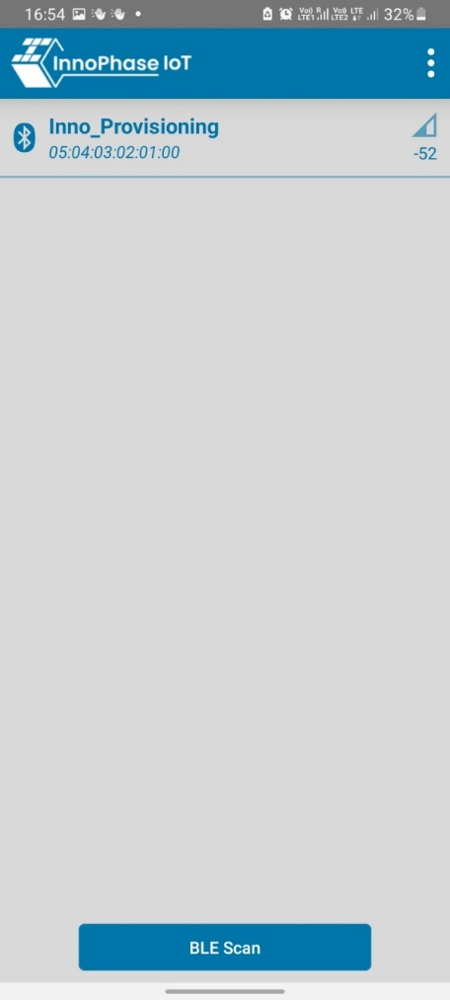

Chip Monitor
------------------

The chip monitoring service allows the application to fetch the changes
in the values of the device core temperature, Voltage of VBAT, the
external ADC and the estimated current consumption of Talaria TWO
device.

The power measurement performed on Talaria TWO device is an estimated
value based on the state that the Talaria TWO device is in and the
duration that the Talaria TWO device stays in that particular state. The
Talaria TWO device can be in any of the four possible states:

1. Suspend mode

2. CPU mode

3. Rx mode

4. Tx mode

Hence:

.. table:: Table : DTIM intervals

   +-----------------------------------------------------------------------+
   | estimated power consumption of T2 = Power consumption of the device   |
   | in a particular state x Duration for which the device stays in that   |
   | state                                                                 |
   +=======================================================================+
   +-----------------------------------------------------------------------+

Since the power consumption of Talaria TWO in a particular state is a
known value, it is possible to calculate the approximate power
consumption value by measuring the duration for which the device stays
in a particular state and multiplying it with the known power
consumption value of the device in that state.

This application note provides details on using the chip monitoring
services for the changes in the values of core temperature, voltage of
VBAT, the external ADC and the estimated current consumption of Talaria
TWO modules using:

1. A standalone application running on the Talaria TWO module which
   provides the change in the values of the services periodically when
   varied by a threshold.

2. An application running on Talaria TWO that responds to the requests
   from an application running on the host. The python script –
   talaria_cli.py present in the freertos_sdk/scripts directory will be
   used as the application running on the host PC.

Chip Monitoring Services Standalone Application
~~~~~~~~~~~~~~~~~~~~~~~~~~~~~~~~

The application running on Talaria TWO can register to any (or all) of
the chip monitoring services i.e., the core temperature of the chip,
voltage of VBAT, the external ADC to monitor the change in the values
and the estimated current consumed by the T2 module by a threshold value
set. The registered service callback will get invoked when there is a
variation of the threshold value set.

The sample application described in this application note will subscribe
to all the four chip monitoring services.

Building
~~~~~~~~~~~~~~~~~~~~~~~~~~~~~~~~

To build the sample application, execute the following commands:

+-----------------------------------------------------------------------+
| cd examples/chip_monitor                                              |
|                                                                       |
| make                                                                  |
+=======================================================================+
+-----------------------------------------------------------------------+

The make command should generate the chip_monitor.elf in the out
directory.

Chip monitor APIs
~~~~~~~~~~~~~~~~~~~~~~~~~~~~~~~~

chip_monitor_power_init()
~~~~~~~~~~~~~~~~~~~~~~~~~~~~~~~~

Allocates energy reports for power measurements. Callers who want to
subscribe on power measurement need to call this before calling
chip_monitor_start().

chip_monitor_start()
~~~~~~~~~~~~~~~~~~~~~~~~~~~~~~~~

Starts subscription for changes on specified source.

To calculate the Talaria TWO current power consumption, it is required
that chip_monitor_power_init() is called prior to chip_monitor_start().
The time for a measurement is dictated by time between the measurements
plus the possible time the chip is suspended.

chip_monitor_stop()
~~~~~~~~~~~~~~~~~~~~~~~~~~~~~~~~

Stops the subscription service.

Sample Code Walkthrough
~~~~~~~~~~~~~~~~~~~~~~~~~~~~~~~~

**chip_monitor.c**

The chip monitor sample code allows the device to subscribe to services
for measuring the estimated power consumption of Talaria TWO, changes in
core temperature, voltage and ADC.

The sample application subscribes to all the four services and sets a
threshold value of 1 to be able to print the information in the console
if there is a change from the last value captured by a threshold of 1.
The threshold value in the sample example is set to 1 for the purpose of
demonstration. The threshold value can be set to any valid value.

The registered call back service_fn_clbk gets invoked for change in the
values of the estimated power consumed, core temperature, VBAT and ADC
by a value of 1. If the threshold value is set to 0, the call back gets
invoked for the period specified by the minterval irrespective of the
change in the measured value.

The main function starts with receiving the boot arguments for the
following parameters:

1. minterval: Time interval in seconds for measuring the value of the
   subscribed chip monitor service.

2. measure_count: Total number of estimated power consumption
   measurements to be made.

+-----------------------------------------------------------------------+
| uint32_t minterval = os_get_boot_arg_int("minterval", 10);            |
|                                                                       |
| uint32_t li = os_get_boot_arg_int("li", 15);                          |
+=======================================================================+
+-----------------------------------------------------------------------+

chip_monitor_power_init() allocates energy reports for power
measurements. This API needs to be called before calling
chip_monitor_start() for the estimated power measurements on Talaria
TWO.

+-----------------------------------------------------------------------+
| chip_monitor_power_init();                                            |
|                                                                       |
| ctms_t0 = os_systime64();                                             |
+=======================================================================+
+-----------------------------------------------------------------------+

Depending on the of bootargs value (0:Service not subscribed; 1:Service
subscribed) for the following services, a service is either subscribed
or not subscribed. If a service is subscribed, the change in the
measured value of that service is notified through the registered
callback.

1. adc_service

2. vbat_service

3. temperature_service

4. power_service

By default ,all the services are subscribed.

+-----------------------------------------------------------------------+
| if(os_get_boot_arg_int("adc_service", 1) == 1)                        |
|                                                                       |
| {                                                                     |
|                                                                       |
| os_printf("Enabling ADC service\\r\\n");                              |
|                                                                       |
| enable_chip_monitor_service(CHIP_MSOURCE_ADC, true);                  |
|                                                                       |
| }                                                                     |
|                                                                       |
| if(os_get_boot_arg_int("vbat_service", 1) == 1)                       |
|                                                                       |
| {                                                                     |
|                                                                       |
| os_printf("Enabling VBAT service\\r\\n");                             |
|                                                                       |
| enable_chip_monitor_service(CHIP_MSOURCE_VBAT, true);                 |
|                                                                       |
| }                                                                     |
|                                                                       |
| if(os_get_boot_arg_int("temperature_service", 1) == 1)                |
|                                                                       |
| {                                                                     |
|                                                                       |
| os_printf("Enabling Temperature service\\r\\n");                      |
|                                                                       |
| enable_chip_monitor_service(CHIP_MSOURCE_CORE_TEMP, true);            |
|                                                                       |
| }                                                                     |
+=======================================================================+
+-----------------------------------------------------------------------+

The enable_chip_monitor_service() API subscribes or unsubscribes the
given service that is provided as an argument.

The power service will also be enabled by default if the Wi-Fi
connection is successful. The chip_monitor_wifi_conn() establishes a
Wi-Fi connection and sets the power management configuration for the
Wi-Fi interface and returns 0 upon successful Wi-Fi connection. This
sample application measures the power consumption of Talaria TWO
(estimated power consumption) with idle Wi-Fi connection.

First, The Wi-Fi network interface is created using wcm_create()and
wcm_notify_enable() enables the callback function.

+-----------------------------------------------------------------------+
| wcm_handle = wcm_create(NULL);                                        |
|                                                                       |
| wcm_notify_enable(wcm_handle, cm_wcm_notify_cb, NULL);                |
+=======================================================================+
+-----------------------------------------------------------------------+

network_profile structure adds a network profile to WCM. np_conf_path
pointer variable contains the path of the network profile file (a JSON
file) present in Talaria TWO filesystem.
network_profile_new_from_file_system()API builds a network profile from
the network profile file in the filesystem and the path to this file is
provided by the np_conf_path variable that receives the path to the
network profile file through a boot argument.

+-----------------------------------------------------------------------+
| const char \*np_conf_path = os_get_boot_arg_str("np_conf_path")?:     |
| NULL;                                                                 |
|                                                                       |
| struct network_profile \*profile;                                     |
|                                                                       |
| if (np_conf_path != NULL)                                             |
|                                                                       |
| {                                                                     |
|                                                                       |
| rval = network_profile_new_from_file_system(&profile, np_conf_path);  |
|                                                                       |
| }                                                                     |
+=======================================================================+
+-----------------------------------------------------------------------+

wcm_add_network_profile() adds the network profile to WCM and
wcm_auto_connect() starts the auto connection with Wi-Fi network.

+-----------------------------------------------------------------------+
| rval = wcm_add_network_profile(wcm_handle, profile);                  |
|                                                                       |
| if (rval < 0) {                                                       |
|                                                                       |
| pr_err("could not associate network profile to wcm %d\\n", rval);     |
|                                                                       |
| return 0; }                                                           |
|                                                                       |
| if(wcm_auto_connect(my_wcm_handle, 1) == 0)                           |
+=======================================================================+
+-----------------------------------------------------------------------+

After the Wi-Fi connection is successful, the system is triggered to
enter into the suspend state depending upon the value of the boot
argument – suspend provided.

1. suspend =1; Triggers the Talaria TWO device to enter into suspend
   state.

2. suspend =0; Talaria TWO device does not enter into suspend state.

By default, the system is not triggered to enter the suspend state.
However, for the power measurements in idle mode, Talaria TWO device
will be triggered into suspend state through the boot argument.

The os_suspend_enable()API triggers Talaria TWO into suspend state.

+-----------------------------------------------------------------------+
| if (os_get_boot_arg_int("suspend", 0) != 0)                           |
|                                                                       |
| os_suspend_enable();                                                  |
+=======================================================================+
+-----------------------------------------------------------------------+

Similarly, the gratuitous ARP can either be disabled or enabled based on
the value provided through the boot argument – arp_enable.

1. arp_enable = 0; Gratious ARP is disabled.

2. arp_enable =1; Gratious ARP is not disabled. This is the default
   setting.

The reception of multicast frames is disabled and the power management
configuration for the Wi-Fi interface is set. The li value for the power
management configuration is received as a boot argument. By default, the
value of listen interval is set to 10, the traffic time out to 12, and
the power management flags to 0.

Refer to the API Reference Guide
(*freertos_sdk_x.y/doc/api_reference_guide/T2-RM001-Vxy-Talaria_TWO_SDK_API_Reference_Guide.pdf*)
for more information on the description of all these APIs.

**Note**: x and y in freertos_sdk_x.y refer to the SDK release version.

+-----------------------------------------------------------------------+
| pm_mask \|= WIFI_PM_STA_RX_NAP \| WIFI_PM_STA_ONLY_BROADCAST \|       |
| WIFI_PM_TX_PS \| WIFI_PM_MCAST_DONT_CARE \| WIFI_PM_DTIM_ONLY;        |
|                                                                       |
| wcm_pm_config(wcm_handle, li, 12, pm_mask);                           |
+=======================================================================+
+-----------------------------------------------------------------------+

chip_monitor_wifi_conn() returns 0 upon successful Wi-Fi connection and
setting the power management configuration. Now, execution of the main
thread is suspended for a period of 15 seconds for the device to
stabilize before starting the power measurements. The power measurement
service will be enabled by default since the default value of the boot
argument - power_service is set to 1. if the value of the boot argument
– power_service is set to 0. Then the power measurement service will be
disabled.

The enable_chip_monitor_service() function enables/disables a chip
monitor service and takes the following boot arguments:

1. threshold: A threshold value to trigger the registered call back for
   a subscribed service. Any change in the measured value by the
   threshold value will trigger the call back and prints the measured
   value

2. curr_value: It is the last sample value measured. This value gets
   updated every time the measurement is made.

Depending on the arguments provided to the function,
enable_chip_monitor_service(enum chip_monitor_source service, bool
enable), the selected chip monitor service is either enabled or
disabled. The chip_monitor_start() API registers a call back function-
service_fn_clbk() for a given service.

+-----------------------------------------------------------------------+
| uint32_t threshold = os_get_boot_arg_int("threshold", 0);             |
|                                                                       |
| uint32_t curr_value = os_get_boot_arg_int("curr_value", 0);           |
|                                                                       |
| switch(service){                                                      |
|                                                                       |
| case CHIP_MSOURCE_CORE_TEMP:                                          |
|                                                                       |
| if(enable == false){                                                  |
|                                                                       |
| chip_monitor_stop(temp_serv);                                         |
|                                                                       |
| break;                                                                |
|                                                                       |
| }                                                                     |
|                                                                       |
| temp_serv = os_zalloc(sizeof \*temp_serv);                            |
|                                                                       |
| assert(temp_serv != NULL);                                            |
|                                                                       |
| chip_monitor_start(temp_serv, CHIP_MSOURCE_CORE_TEMP, curr_value,     |
| threshold, minterval, (chip_mon_notify_t)service_fn_clbk);            |
|                                                                       |
| break;                                                                |
|                                                                       |
| case CHIP_MSOURCE_VBAT:                                               |
|                                                                       |
| if(enable == false){                                                  |
|                                                                       |
| chip_monitor_stop(vbat_serv);                                         |
|                                                                       |
| break;                                                                |
|                                                                       |
| }                                                                     |
|                                                                       |
| vbat_serv = os_zalloc(sizeof \*vbat_serv);                            |
|                                                                       |
| assert(vbat_serv != NULL);                                            |
|                                                                       |
| chip_monitor_start(vbat_serv, CHIP_MSOURCE_VBAT, curr_value,          |
| threshold, minterval, (chip_mon_notify_t)service_fn_clbk);            |
|                                                                       |
| break;                                                                |
|                                                                       |
| case CHIP_MSOURCE_ADC:                                                |
|                                                                       |
| if(enable == false){                                                  |
|                                                                       |
| chip_monitor_stop(adc_serv);                                          |
|                                                                       |
| break;                                                                |
|                                                                       |
| }                                                                     |
|                                                                       |
| adc_serv = os_zalloc(sizeof \*adc_serv);                              |
|                                                                       |
| assert(adc_serv != NULL);                                             |
|                                                                       |
| chip_monitor_start(adc_serv, CHIP_MSOURCE_ADC, curr_value, threshold, |
| minterval, (chip_mon_notify_t)service_fn_clbk);                       |
|                                                                       |
| break;                                                                |
|                                                                       |
| case CHIP_MSOURCE_POWER:                                              |
|                                                                       |
| if(enable == false){                                                  |
|                                                                       |
| chip_monitor_stop(power_serv);                                        |
|                                                                       |
| break;                                                                |
|                                                                       |
| }                                                                     |
|                                                                       |
| power_serv = os_zalloc(sizeof \*power_serv);                          |
|                                                                       |
| assert(power_serv != NULL);                                           |
|                                                                       |
| chip_monitor_start(power_serv, CHIP_MSOURCE_POWER, curr_value,        |
| threshold, minterval, (chip_mon_notify_t)service_fn_clbk);            |
|                                                                       |
| break;                                                                |
+=======================================================================+
+-----------------------------------------------------------------------+

The service_fn_clbk()gets invoked if there is change by the threshold in
values measured for a given service i.e., core temperature, voltage,
ADCs or the estimated power measured.

+-----------------------------------------------------------------------+
| static void service_fn_clbk(struct chip_monitor_serv\* serv, enum     |
| chip_monitor_source source, uint32_t last_value){                     |
|                                                                       |
| ….                                                                    |
|                                                                       |
| ….                                                                    |
|                                                                       |
| switch(source){                                                       |
|                                                                       |
| case CHIP_MSOURCE_CORE_TEMP:                                          |
|                                                                       |
| os_printf("Time:%llu sec Chip Core Temp: %u C\\n", now, last_value);  |
|                                                                       |
| break;                                                                |
|                                                                       |
| case CHIP_MSOURCE_VBAT:                                               |
|                                                                       |
| os_printf("Time:%llu sec Chip Vbat: %u dV\\n", now, last_value);      |
|                                                                       |
| break;                                                                |
|                                                                       |
| case CHIP_MSOURCE_ADC:                                                |
|                                                                       |
| os_printf("Time:%llu sec Chip ADCin: %u \\n", now, last_value);       |
|                                                                       |
| break;                                                                |
|                                                                       |
| ……                                                                    |
+=======================================================================+
+-----------------------------------------------------------------------+

For the power measurement service, the average of the measured current
values has to be considered. Hence, the sum of the values measured/the
number of samples is also displayed on the console. The total number of
samples to be captured is specified through the boot argument
measure_count.

+-----------------------------------------------------------------------+
| case CHIP_MSOURCE_POWER:                                              |
|                                                                       |
| os_printf("Chip mscource power\\r\\n");                               |
|                                                                       |
| if (start_count_down == 0) {                                          |
|                                                                       |
| count++;                                                              |
|                                                                       |
| total += last_value;                                                  |
|                                                                       |
| os_printf("Average Current:%duA\\n", total/count);                    |
|                                                                       |
| if(count > measure_count){                                            |
|                                                                       |
| os_printf("Completed %d measurements\\r\\n",measure_count);           |
|                                                                       |
| chip_monitor_stop_power_measurement(); }                              |
+=======================================================================+
+-----------------------------------------------------------------------+

After capturing the total number of power measurements, the
chip_monitor_stop_power_measurement() is called to stop the measurements
after displaying the average current measured.

The chip_monitor_stop_power_measurement()function stops the power
measurement by calling the
enable_chip_monitor_service(CHIP_MSOURCE_POWER, false) function and
shutting down and cleaning up a WCM interface.

+-----------------------------------------------------------------------+
| enable_chip_monitor_service(CHIP_MSOURCE_POWER, false);               |
|                                                                       |
| wcm_remove_network(wcm_handle, ssid, NULL);                           |
|                                                                       |
| wcm_destroy(wcm_handle);                                              |
|                                                                       |
| wcm_handle = NULL;                                                    |
+=======================================================================+
+-----------------------------------------------------------------------+

The print_wifi_config() prints the Wi-Fi configuration parameters.

+-----------------------------------------------------------------------+
| void print_wifi_config()                                              |
|                                                                       |
| {                                                                     |
|                                                                       |
| uint32_t current_li;                                                  |
|                                                                       |
| uint32_t current_traffic_tmo;                                         |
|                                                                       |
| uint32_t current_pm_flags;                                            |
|                                                                       |
| int current_sleep_period;                                             |
|                                                                       |
| wcm_pm_config_get(wcm_handle,&current_li,                             |
| &current_traffic_tmo,&current_pm_flags);                              |
|                                                                       |
| wcm_pm_get_sleep_period(wcm_handle, &current_sleep_period);           |
|                                                                       |
| os_printf("\\n******\\n");                                            |
|                                                                       |
| os_printf("li: %d\\n", current_li);                                   |
|                                                                       |
| os_printf("traffic_tmo: %d\\n", current_traffic_tmo);                 |
|                                                                       |
| os_printf("pm_flags: 0x%x\\n", current_pm_flags);                     |
|                                                                       |
| os_printf("sleep_period: %d ms\\n", current_sleep_period/1000);       |
|                                                                       |
| os_printf("\******\\n");                                              |
|                                                                       |
| }                                                                     |
+=======================================================================+
+-----------------------------------------------------------------------+

Running the Application
~~~~~~~~~~~~~~~~~~~~~~~~~~~~~~~~

Programming Talaria TWO using the Download Tool
~~~~~~~~~~~~~~~~~~~~~~~~~~~~~~~~~~~~~~~~~~~~~~~

Program chip_monitor.elf
*(freertos_sdk_x.y\\examples\\chip_monitor\\bin)* using the Download
tool:

1. Launch the Download tool provided with InnoPhase Talaria TWO SDK.

2. In the GUI window:

   a. Boot Target: Select the appropriate EVK from the drop-down

   b. ELF Input: Load the ELF by clicking on Select ELF File.

   c. AP Options: Provide the SSID and Passphrase under AP Options to
      connect to an Access Point.

   d. Boot Arguments: Pass the following boot arguments to enable power
      service and disable all other services:

..

   **Enabling only Power_service**:

+-----------------------------------------------------------------------+
| adc_service=0,vbat_service=0,temperature_service=0,power              |
| _service=1,suspend=1,arp_enable=0,li=10,minterval=10,measure_count=15 |
+=======================================================================+
+-----------------------------------------------------------------------+

e. Programming: Prog RAM or Prog Flash as per requirement.

Expected Output:

On flashing the application using the Download Tool, the console output
is as follows. The application displays the current measured and the
Average current in µA.

+-----------------------------------------------------------------------+
| Y-BOOT 208ef13 2019-07-22 12:26:54 -0500 790da1-b-7                   |
|                                                                       |
| ROM yoda-h0-rom-16-0-gd5a8e586                                        |
|                                                                       |
| FLASH:PWWWWWWWAE                                                      |
|                                                                       |
| Build $Id: git-5b930c8 $                                              |
|                                                                       |
| Flash detected. flash.hw.uuid: 39483937-3207-0080-0055-ffffffffffff   |
|                                                                       |
| Bootargs: adc_service=0 vbat_service=0 temperature_service=0          |
| power_service=1 ssid=ratheesh passphrase=1122334455                   |
|                                                                       |
| === CMS - Chip Monitor Service ===                                    |
|                                                                       |
| addr e0:69:3a:00:08:38                                                |
|                                                                       |
| network profile created for ssid: ratheesh                            |
|                                                                       |
| Wait for 15 seconds for the device to stabilize before starting power |
| measurement service                                                   |
|                                                                       |
| [0.756,643] ASSOCIATION:FAIL=2,30                                     |
|                                                                       |
| [0.756,830] DISCONNECTED                                              |
|                                                                       |
| [2.857,188] CONNECT:be:2a:54:1b:92:2d Channel:6 rssi:-40 dBm          |
|                                                                       |
| wcm_notify_cb to App Layer - WCM_NOTIFY_MSG_LINK_UP                   |
|                                                                       |
| wcm_notify_cb to App Layer - WCM_NOTIFY_MSG_ADDRESS                   |
|                                                                       |
| [3.505,627] MYIP 172.20.10.2                                          |
|                                                                       |
| [3.505,675] IPv6 [fe80::e269:3aff:fe00:838]-link                      |
|                                                                       |
| Enabling power consumption service                                    |
|                                                                       |
| == Calibrating ==                                                     |
|                                                                       |
| Chip mscource power                                                   |
|                                                                       |
| Waiting to start power measurement!                                   |
|                                                                       |
| == Calibrating ==                                                     |
|                                                                       |
| Chip mscource power                                                   |
|                                                                       |
| Waiting to start power measurement!                                   |
|                                                                       |
| == Calibrating ==                                                     |
|                                                                       |
| Chip mscource power                                                   |
|                                                                       |
| Time:45 sec;Power measurement-1:7555uA                                |
|                                                                       |
| Average Current:7555uA                                                |
+=======================================================================+
+-----------------------------------------------------------------------+

**Enabling adc, vbat and temp services**:

In the GUI, Boot Arguments: Pass the following boot arguments to disable
power service and enable all other services:

Add the following boot arguments to disable power service and enable all
other services:

+-----------------------------------------------------------------------+
| adc_service=1,vbat_service=1,temperature_service=1,power_service=0    |
+=======================================================================+
+-----------------------------------------------------------------------+

Expected Output:

On flashing the application using the Download Tool, the console output
is as follows.

The application displays the raw value that varies according to the
input provided to the ADC pin. Apart from the raw value measured out of
the ADC pin, the internal temperature in °C and VBAT measured from
source in mV are also displayed.

The following is the expected output:

+-----------------------------------------------------------------------+
| Y-BOOT 208ef13 2019-07-22 12:26:54 -0500 790da1-b-7                   |
|                                                                       |
| ROM yoda-h0-rom-16-0-gd5a8e586                                        |
|                                                                       |
| FLASH:PWWWWWWWAE                                                      |
|                                                                       |
| Build $Id: git-5b930c8 $                                              |
|                                                                       |
| Flash detected. flash.hw.uuid: 39483937-3207-0080-0055-ffffffffffff   |
|                                                                       |
| Bootargs: adc_service=1 vbat_service=1 temperature_service=1          |
| power_service=0                                                       |
|                                                                       |
| === CMS - Chip Monitor Service ===                                    |
|                                                                       |
| Enabling ADC service                                                  |
|                                                                       |
| Enabling VBAT service                                                 |
|                                                                       |
| Enabling Temperature service                                          |
|                                                                       |
| == Calibrating ==                                                     |
|                                                                       |
| Time:0 sec Chip ADCin: 504                                            |
|                                                                       |
| == Calibrating ==                                                     |
|                                                                       |
| Time:0 sec Chip Vbat: 3216 dV                                         |
|                                                                       |
| == Calibrating ==                                                     |
|                                                                       |
| Time:0 sec Chip Core Temp: 25 C                                       |
|                                                                       |
| == Calibrating ==                                                     |
|                                                                       |
| Time:10 sec Chip ADCin: 7                                             |
|                                                                       |
| == Calibrating ==                                                     |
|                                                                       |
| Time:10 sec Chip Core Temp: 26 C                                      |
|                                                                       |
| == Calibrating ==                                                     |
|                                                                       |
| Time:20 sec Chip Core Temp: 25 C                                      |
|                                                                       |
| == Calibrating ==                                                     |
|                                                                       |
| Time:30 sec Chip Core Temp: 26 C                                      |
+=======================================================================+
+-----------------------------------------------------------------------+

Chip Monitoring Services - Hosted Application
~~~~~~~~~~~~~~~~~~~~~~~~~~~~~~~~

   The application running on an external host can communicate with
   Talaria TWO and fetch the information on the change in the values of
   the core temperature, External ADC, VBAT and the estimated current
   measured values. The procedure to fetch this information is described
   in the following sections.

Application Running on External Host
~~~~~~~~~~~~~~~~~~~~~~~~~~~~~~~~

The talaria_cli.py script running on the host (PC) will fetch required
information from stw application running on the Talaria TWO to fetch the
required information. The following are the steps to be executed:

1. Flash the bins/stw.elf onto Talaria TWO (refer steps in section 9.1.1
   for more details on flashing the ELF onto Talaria TWO).

..

   Console output:

+-----------------------------------------------------------------------+
| Y-BOOT 208ef13 2019-07-22 12:26:54 -0500 790dal- b- 7                 |
|                                                                       |
| ROM yoda- h0- rom- 16- 0- gd5a8e586                                   |
|                                                                       |
| FLASH: PNWWWWWAEBuild $Id: git – d468c7b54 $                          |
|                                                                       |
| Serial – to – Wireless: Ready                                         |
+=======================================================================+
+-----------------------------------------------------------------------+

2. Execute the following in Talaria TWO command line:

+-----------------------------------------------------------------------+
| python3 ./script/talaria_cli.py /dev/ttyUSB2                          |
+=======================================================================+
+-----------------------------------------------------------------------+

..

   Console output:

   |Text Description automatically generated|

Figure : Talaria TWO - Command Line Output

3. In the Talaria CLI, create a WCM handle and connect to a network.

+-----------------------------------------------------------------------+
| [talaria-2]$ create                                                   |
|                                                                       |
| [talaria-2]$ add_network <SSID> -p <Password>                         |
|                                                                       |
| [talaria-2]$ auto_connect                                             |
+=======================================================================+
+-----------------------------------------------------------------------+

..

   The execution of these commands and the output is as follows:

   |image1|

Figure : Creating a WCM handle and connecting to a network

4. Enable device suspend

+-----------------------------------------------------------------------+
| [talaria-2]$ suspend 1                                                |
+=======================================================================+
+-----------------------------------------------------------------------+

5. Execute chip_monitor to fetch data from Talaria TWO:

   a. To initiate chip_monitor, execute the following command:

+-----------------------------------------------------------------------+
| [talaria-2]$ chip_monitor -ip                                         |
+=======================================================================+
+-----------------------------------------------------------------------+

b. To start chip_monitor, execute the following command:

+-----------------------------------------------------------------------+
| [talaria-2]$ chip_monitor --start -s<0/1/2/3> -i<interval>            |
+=======================================================================+
+-----------------------------------------------------------------------+

Console outputs for the sources – Estimated Current measurement, ADC,
Internal temperature and VBAT are as follows:

1. Estimated current measurement:

|image2|

Figure : Estimated current measurement

2. ADC:

|image3|

Figure 4: ADC

3. Internal Temperature:

|image4|

Figure 5: Internal temperature

4. VBAT:

|image5|

Figure 6: VBAT

Measured Current Values for multiple DTIM Intervals
~~~~~~~~~~~~~~~~~~~~~~~~~~~~~~~~

For reference, the estimated power consumption values measured using the
chip_monitor app for various DTIM intervals (clean environment current
numbers) are provided in Table 1.

+----------------------------------+-----------------------------------+
| **DTIM**                         | **Current consumption (µA)**      |
+==================================+===================================+
| 1                                | ~395                              |
+----------------------------------+-----------------------------------+
| 3                                | ~140                              |
+----------------------------------+-----------------------------------+
| 10                               | ~52                               |
+----------------------------------+-----------------------------------+
| 100                              | ~22                               |
+----------------------------------+-----------------------------------+

