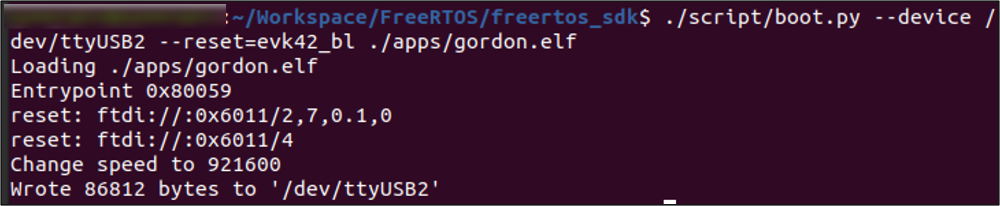
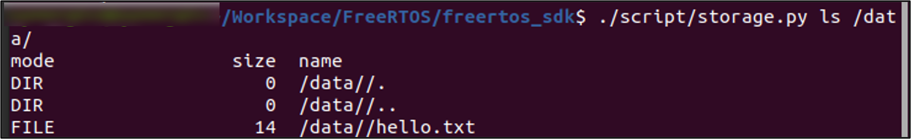
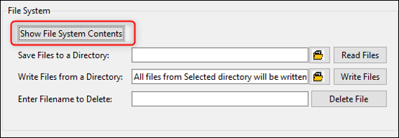
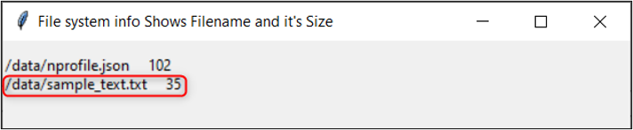
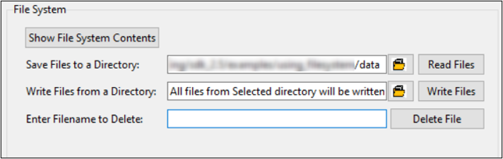
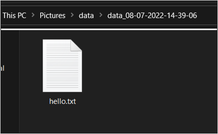

.. _ex filesystem:

Filesystem
----------------

Talaria TWO EVK has a 2MB SPI flash for storing user data. This
application note describes using the APIs to show case the filesystem
read, write, and remove functionalities on the Talaria TWO EVK.

Sample Code Walkthrough
~~~~~~~~~~~~~~~~~~~~~~~~~~~~~~~~~~

Using_filesystem
~~~~~~~~~~~~~~~~~~~~~~~~~~~~~~~~~~

The using_filesystem application illustrates performing the following
basic filesystem operations. To mount the file system,
utils_mount_rootfs() is called.

.. code:: shell

      /* Mount FS */
          os_printf("Mounting file system\n");
          ret_code = utils_mount_rootfs();
      if(ret_code != 0){
              os_printf("Failed to mount file system\n");
      	  return 0;     }
      else
          {   os_printf("File system mounted\n");  }

Read and Write
~~~~~~~~~~~~~~~~~~~~~~~~~~~~~~~~~~

To read and write, the application uses the C library APIs - fputs() and
fgets().

In this example, a new file named /data/sample_text.txt is written in
the DATA partition of the filesystem.

.. code:: shell

      /* Write file */
      sample_file = fopen(configfile, "w");
      fputs("This is testing for file system...\n", sample_file);
      fclose(sample_file);
      os_printf("Write Done.\n\n");
      
      /* Read file */
      sample_file = fopen(configfile, "r");
      fgets(str, 50, sample_file);
      os_printf("file data = %s \n", str);
      fclose(sample_file);
      os_printf("Read Done.\n\n");

Fetching the File into a Buffer
~~~~~~~~~~~~~~~~~~~~~~~~~~~~~~~~~~

The utils_file_get() API is used to get the content of a file into a
buffer.

.. code:: shell

      char *file_buf = utils_file_get(configfile, &size);
      os_printf("File Data = %s \n", file_buf);

Flashing & Running the Application
~~~~~~~~~~~~~~~~~~~~~~~~~~~~~~~~~~

In Talaria TWO module, there are two ways of writing into the file
system:

1. Manually for factory setup

2. Programmatically

Generate & Flash a Filesystem Manually for Factory Setup
~~~~~~~~~~~~~~~~~~~~~~~~~~~~~~~~~~

To create a file system manually and write the file image using the
scripts available in SDK, execute the following steps:

a. Generate an image file using the mklittlefs tool.

..

   Go to *freertos_sdk_x.y/examples/using_filesystem* folder.

.. code:: shell

      ./mklittlefs -s 0x40000 -c ./data ./flash.img  

..

   **Note**: The flash.img will contain the file(s) present in the data
   folder of current directory where this binary (mklittlefs) is
   executed.

   **Note**: Provide execute permission to mklittlefs (right click on:
   *Properties → Permissions → Allow executing file as a program*)

b. From the SDK folder, execute the remaining commands:

..

   Ensure to have a partition table containing allocation for DATA as a
   prerequisite. To manually flash an image file to a specific location,
   execute the following steps:

i. Load gordon.elf onto the Talaria TWO module.

.. code:: shell

      ./script/boot.py --device /dev/ttyUSB2 --reset=evk42_bl ./apps/gordon.elf

..

|image113|

Figure 1: Loading gordon.elf

ii. Flash the image file to the desired location on the filesystem.

.. code:: shell

      ./script/flash.py --device /dev/ttyUSB2 part_write DATA ./examples/using_filesystem/flash.img

..

|image114|

Figure 2: Flashing the image

iii. Fetch the file(s) which was flashed.

.. code:: shell

      ./script/storage.py ls /data/ 

..

|image115|

Figure 3: Fetching files from data partition

Writing into the Filesystem Programmatically
~~~~~~~~~~~~~~~~~~~~~~~~~~~~~~~~~~

Running the Application 
~~~~~~~~~~~~~~~~~~~~~~~~

Program using_fs.elf
(*freertos_sdk_x.y\\examples\\using_filesystem\\bin*) using the Download
tool (*freertos_sdk_x.y\\pc_tools\\Download_Tool\\bin*):

1. Launch the Download tool provided with InnoPhase Talaria TWO SDK.

2. In the GUI window:

   a. Boot Target: Select the appropriate EVK from the drop-down.

   b. ELF Input: Load the using_filesystem.elf by clicking on Select ELF
      File.

3. Programming: Prog RAM or Prog Flash as per requirement.

As mentioned in section 4.2, a new file named \\data\\sample_text.txt is
written in the DATA partition of the filesystem.

Expected Output
~~~~~~~~~~~~~~~

.. code:: shell

      UART:SNWWWWAE
      4 DWT comparators, range 0x8000
      Build $Id: git-ef87896f9 $
      hio.baudrate=921600
      flash: Gordon ready!
      Y-BOOT 208ef13 2019-07-22 12:26:54 -0500 790da1-b-7
      ROM yoda-h0-rom-16-0-gd5a8e586
      FLASH:PNWWWAE
      Build $Id: git-df9b9ef $
      Flash detected. flash.hw.uuid: 39483937-3207-00b0-0064-ffffffffffff
      $App:git-6600fea
      SDK Ver: FREERTOS_SDK_1.0
      Using File System Demo App
      Mounting file system
      File system mounted
      Write Done.
      File Data = This is testing for file system...
      Read Done.
      File Data = This is testing for file system...
      Before deleting (unlink) file exist
      Deleting (unlink) the file = /data/sample_text.txt
      Delete (unlink API) returns = 0
      After deleting (unlink) file does not exist
      ----------------Program Exit --------------------

After execution, for evaluation purposes, use the download tool Show
File System Contents option. Click on Show File System Contents. The
pop-up window displays the file written by the application.

|image116|

Figure 4: Download Tool - Show File System Contents

|image117|

Figure 5: Filename and size

The file size is also equal to the read value from the application.

Using the Read Files option available in the Download Tool to retrieve
the files and check the contents.

|image118|

Figure 6: Download Tool - File System: Read files

Contents are extracted into the folder specified in the Download Tool.

|image119|

Figure 7: Extracted files

.. |image114| image:: media/imag114.png
   :width: 5.7874in
   :height: 4.17818in

