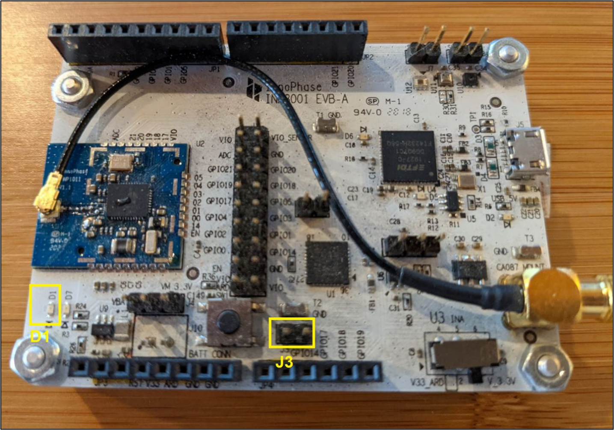
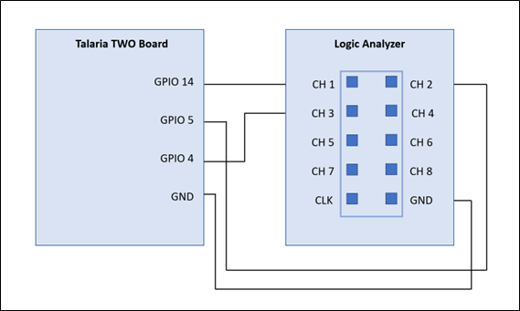
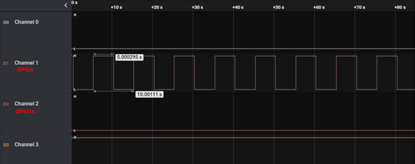
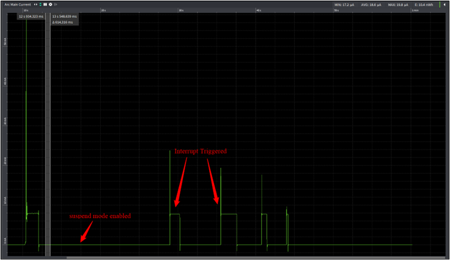

.. _ex gpio:

GPIO
----------------

This application note describes the usage of GPIO pins on Talaria TWO
module. Talaria TWO module allows up to 11 GPIOS to be configured as
digital I/O pins.

Demo Applications
~~~~~~~~~~~~~~~~~~~~~~~~~~~~~~~~~~

EVB-A Hardware Configuration
~~~~~~~~~~~~~~~~~~~~~~~~~~~~~~~~~~

The demo application utilizes the LED D1 on the Talaria TWO EVB-A board.
Use jumper on J3 header to connect LED D1 to GPIO14.

|image120|

.. rst-class:: imagefiguesclass
Figure 1: Talaria TWO EVB-A

Building
~~~~~~~~~~~~~~~~~~~~~~~~~~~~~~~~~~

To build the sample applications, execute the following commands from
the FreeRTOS SDK directory:

.. code:: shell

      cd examples/gpio
      make

The make command generates the following files in the out directory:

1. gpio_blink.elf

2. gpio_suspend.elf

3. gpio_interrupt_awake.elf

4. gpio_suspend_mask.elf

GPIO Demo APIs
~~~~~~~~~~~~~~~~~~~~~~~~~~~~~~~~~~

1. os_suspend_enable(): Enables system suspend when idle.

..

   Calling os_suspend_enable() enables system suspend (deep sleep). If
   enabled, the system will go into a suspended mode when the processor
   is idle. Entering and leaving suspend mode takes additional time.
   Hence, enabling this will affect the real-time response of the
   system.

   When in a suspended state, the system will still wake up if an
   interrupt occurs, but the latency will be much larger compared to
   running with suspend mode disabled.

2. os_suspend_disable(): Disables system suspend when idle.

..

   When disabled, the system will never go into suspend mode. When the
   system is idle, the kernel puts the CPU into low-power mode, ready to
   swiftly resume execution if an interrupt occurs.

3. os_gpio_set_irq_level_low(): Configures the GPIO input pin to signal
   interrupt on low level.

4. os_gpio_set_irq_level_high(): Configures the GPIO input pin to signal
   interrupt on high level.

5. os_gpio_set_value(os_gpio_set_t gpios_hi, os_gpio_set_t gpios_lo):
   Sets the value of GPIO pins.

..

   This function is used to change the value of several GPIO pins at
   once. The pins in the gpio_hi set will be driven to '1' and the pins
   in the gpios_lo set will be set to level '0'.

   Change of signals occur at the same time. This property might be
   important when "bit-banging" some wire protocol which requires two
   signals to change simultaneously.

   Simpler functions for changing the output value: os_gpio_set_pin,
   os_gpio_clr_pin().

6. os_gpio_request(): Allocates and setup pins as GPIO.

..

   Allocate the specified pins and configure them as GPIO. The pins are
   initially setup to be inputs. The direction of the pins can be
   changed using os_gpio_set_output().

7. os_gpio_set_input(): Sets up GPIO pins for input.

..

   Configure the specified GPIO pins to be inputs.

8.  os_gpio_set_output(): Configures the specified GPIO pins to be
    output pins.

9.  os_gpio_enable_irq(): Enables the interrupt generation for the
    specified set of GPIO input pins.

10. os_gpio_set_pull(): Configures the GPIO pull up/down, all pins
    except GPIO18 are pullup.

11. os_gpio_get_value(): Reads the value of the specified GPIO pins.

12. os_gpio_clr_pin(): Clears the specified GPIO pins. Sets the output
    value of the GPIO pins '0'.

13. os_gpio_set_pin(): Sets the specified GPIO pins. Sets the output
    value of the GPIO pins to '1'.

14. os_gpio_attach_event(): Attaches an event handler function to a GPIO
    event.

15. os_gpio_detach_event(): Detaches an attached event handler function
    from a GPIO event.

Source Code Walkthrough
~~~~~~~~~~~~~~~~~~~~~~~~~~~~~~~~~~

**Note**: All the applicable ELFs are available in the following
location of the SDK release package:
*freertos_sdk_x.y\\examples\\gpio\\bin*.

GPIO Blink Demo Example
~~~~~~~~~~~~~~~~~~~~~~~~~~~~~~~~~~

Application Flow
~~~~~~~~~~~~~~~~

The GPIO blink demo application demonstrates toggling a GPIO output and
is connected to an LED on the Talaria TWO EVB-A.

Following steps describe the flow to toggle the GPIOs:

1. Allocates the specified pins and configures them as GPIO.

2. Sets up GPIO pins as output.

3. Toggles the GPIO to high and low.

Sample Code Walkthrough
~~~~~~~~~~~~~~~~~~~~~~~

This section describes the procedure to configure the selected GPIO as
digital I/O and toggle the LEDs connected to the selected GPIOs. The
os_gpio_request() API requests the pins and configures the pin as GPIO,
os_gpio_set_output() API configures the GPIO pins as digital output
pins. os_gpio_clr_pin() is used to clear the specified GPIO pins.

.. code:: shell

      int led_pin = 1 << LED_PIN;
      os_gpio_request(led_pin);
      os_gpio_set_output(led_pin);
      os_gpio_clr_pin(led_pin);

os_gpio_set_pin() is used to set the GPIO high and os_gpio_clr_pin() is
used to set GPIO low. This is the main thread where the LED blinks every
500ms by toggling the LED to high and low.

.. code:: shell

        vTaskDelay(500);
        os_gpio_set_pin(led_pin);
        os_wait_usec(500 * 1000);
        os_gpio_clr_pin(led_pin);

Running the Application 
~~~~~~~~~~~~~~~~~~~~~~~~

Program gpio_blink.elf using the Download tool:

1. Launch the Download tool provided with InnoPhase Talaria TWO SDK.

2. In the GUI window:

   a. Boot Target: Select the appropriate EVK from the drop-down.

   b. ELF Input: Load the gpio_blink.elf by clicking on Select ELF File.

   c. Programming: Prog RAM or Prog Flash as per requirement.

Expected Output
~~~~~~~~~~~~~~~

Once the application is downloaded onto the Talaria TWO EVB-A, the LED
D1 blinks every 500ms.

.. code:: shell

      UART:SNWWWWAE
      4 DWT comparators, range 0x8000
      Build $Id: git-ef87896f9 $
      hio.baudrate=921600
      flash: Gordon ready!
      Y-BOOT 208ef13 2019-07-22 12:26:54 -0500 790da1-b-7
      ROM yoda-h0-rom-16-0-gd5a8e586
      FLASH:PNWWWWAE
      Build $Id: git-df9b9ef $
      Flash detected. flash.hw.uuid: 39483937-3207-00b0-0064-ffffffffffff
      Hello blinky

GPIO Suspend Demo Example
~~~~~~~~~~~~~~~~~~~~~~~~~~~~~~~~~~

.. _application-flow-1:

Application Flow
~~~~~~~~~~~~~~~~

The GPIO suspend demo application is to demonstrate configuring GPIO as
an interrupt and is connected to an LED on the Talaria TWO EVB-A.

Following are the steps:

1. Initialize the semaphores, threads, and timer.

2. If or else statement puts Talaria TWO into sleep or awake state by
   os_suspend_enable or disable APIs.

.. _sample-code-walkthrough-1:

Sample Code Walkthrough
~~~~~~~~~~~~~~~~~~~~~~~

This section describes the function definition for the timer call back,
xSemaphoreGive()increments the value of semaphores and wakes up the
first thread. Inside event_wakeup() configuration, the interrupt level
and sleep state of the Talaria TWO depends on its current state.

If suspend is enabled os_suspend_enable(), then the IRQ level is set to
LOW. Here, Talaria TWO is in sleep state.

If suspend is disabled os_suspend_disable(), then the IRQ level is set
to HIGH. Here, Talaria TWO is awake.

.. code:: shell

      static int __irq
      event_wakeup(uint32_t irqno, void *arg)
      {
        if (state) {
          os_suspend_enable();
          os_gpio_set_irq_level_low(wakeup_pin);
          os_gpio_set_value(led_pin, 0);
          os_printf("sleeping\n");
        } 
        else {
          os_suspend_disable();
          os_gpio_set_irq_level_high(wakeup_pin);
          os_gpio_set_value(0, led_pin);
          os_printf("awake\n");
        }
        state ^= 1;
        os_clear_event(EVENT_GPIO_3);
        return IRQ_HANDLED;
      }

This section describes the worker thread. When the state is set to 0,
the suspend is enabled. If not, it is disabled. This is commonly used as
a background task.

.. code:: shell

      /* The worker thread */
      static void my_thread(void* arg)
      {
          for (;;) {
              xSemaphoreTake(work_sem, portMAX_DELAY);
              if (state == 0) {
                  os_gpio_set_value(0, led_pin);
      
                  os_suspend_disable();
                  vTaskDelay(t_awake);
                  os_suspend_enable();
                  os_gpio_set_value(led_pin, 0);
                  os_printf(".");
              } else {
                  os_printf("'");
              }
          }
      }

This section configures GPIO as an interrupt:

.. code:: shell

      wakeup_pin = 1 << os_get_boot_arg_int("wakeup", 18);
      /* Request pin for led indication */
      os_gpio_request(led_pin);
      os_gpio_set_output(led_pin);
      os_gpio_set_value(0, led_pin);
      /* gpio wakeup */
      state = 0;
      /*Request pin for wakeup from suspend*/
      os_gpio_request(wakeup_pin);
      os_gpio_set_input(wakeup_pin);
      os_gpio_set_irq_level_low(wakeup_pin);
      /*gpio event that is wakeup capable from suspend*/
      os_gpio_enable_irq(wakeup_pin, 3);
      /*Register gpio wakeup event handler*/
      os_attach_event(EVENT_GPIO_3, event_wakeup, NULL);
      /*enable pull-up as the irq will trigger on high to low*/
      os_gpio_set_pull(GPIO_PIN(wakeup_pin));

Here, wakeup_pin (18) is configured as an interrupt which is triggered
whenever the GPIO18 is set to LOW. It is also configured to call
event_wakeup(), whenever Talaria TWO wakes up from GPIO interrupt
source.

.. _running-the-application-1:

Running the Application
~~~~~~~~~~~~~~~~~~~~~~~

Program gpio_suspend.elf using the Download tool:

1. Launch the Download tool provided with InnoPhase Talaria TWO SDK.

2. In the GUI window:

   a. Boot Target: Select the appropriate EVK from the drop-down.

   b. ELF Input: Load the gpio_suspend.elf by clicking on Select ELF
      File.

   c. Programming: Prog RAM or Prog Flash as per requirement.

.. _expected-output-1:

Expected Output
~~~~~~~~~~~~~~~

Once the application is downloaded onto the Talaria TWO EVB-A, the LED
D1 is ON.

In the demo application, Talaria TWO goes into Sleep Mode and wakes up
and prints a ‘.’ every 300ms.

Next, use a jumper on GPIO18 and pull it LOW or connect it to GND.
Connecting GPIO18 to GND will wake the Talaria TWO from sleep, and then
go back to sleep.

This is achieved by attaching a GPIO interrupt on GPIO18. It is observed
that LED D1 is turned OFF every time Talaria TWO wakes up.

.. code:: shell

      Y-BOOT 208ef13 2019-07-22 12:26:54 -0500 790da1-b-7
      ROM yoda-h0-rom-16-0-gd5a8e586
      FLASH:PNWWWWAE
      Build $Id: git-df9b9ef $
      Flash detected. flash.hw.uuid: 39483937-3207-00b0-0064-ffffffffffff
      SUSPEND test
      timer started
      .....................................awake
      sleeping
      awake
      'sleeping
      awake
      sleeping
      awake
      sleeping
      awake
      sleeping
      awake
      sleeping
      awake
      sleeping
      awake
      sleeping
      awake
      sleeping
      awake
      sleeping
      awake
      sleeping
      ......awake
      sleeping
      awake
      sleeping
      awake
      'sleeping
      awake
      sleeping
      awake
      sleeping
      awake
      sleeping
      awake
      sleeping
      awake
      sleeping
      awake
      sleeping
      awake
      sleeping
      awake
      sleeping
      awake
      sleeping
      awake
      sleeping
      awake
      'sleeping
      awake
      sleeping
      awake
      sleeping
      awake
      sleeping
      awake
      sleeping
      awake
      sleeping
      awake
      sleeping
      ..........................................

GPIO Suspend Mask Demo Example
~~~~~~~~~~~~~~~~~~~~~~~~~~~~~~~~~~

.. _application-flow-2:

Application Flow
~~~~~~~~~~~~~~~~

The GPIO suspend mask demo application demonstrates configuring the
GPIOs as input or output when the Talaria TWO module is in suspend mode.

Following are the steps:

1. Configure the GPIOs to desired state.

2. Output enable (oe) for GPIO14 and GPIO5 using bit masking.

3. GPIO5 is set to HIGH when in suspend.

4. In a while (1) loop, GPIO5 is set to HIGH when in suspend and
   previous GPIO level is restored for every configured interval (5
   seconds).

.. _sample-code-walkthrough-2:

Sample Code Walkthrough
~~~~~~~~~~~~~~~~~~~~~~~

To configure the GPIOs to a desired state when Talaria TWO is in suspend
mode, os_gpio_masks_suspend_set(struct os_gpio_masks mask) can be used
according to the os_gpio_masks struct.

.. code:: shell

      struct os_gpio_masks {
        uint32_t ie;
        uint32_t oe;
        uint32_t pe;
        uint32_t o;
      };

When the Talaria TWO module comes out of suspend mode, the kernel would
configure the GPIOs to their previous state before entering suspend.

.. code:: shell

      suspend_mask.ie = 0x00;
      suspend_mask.oe = 0b100000000100000; //OE on gpio14 and gpio5
      suspend_mask.pe = 0x00;
      suspend_mask.o = 0b000000000100000; //gpio5 set to HIGH when suspend

.. _running-the-application-2:

Running the Application
~~~~~~~~~~~~~~~~~~~~~~~

Program gpio_suspend_mask.elf using the Download Tool:

1. Launch the Download Tool provided with InnoPhase Talaria TWO SDK.

2. In the GUI window:

a. Boot Target: Select the appropriate EVK from the drop-down.

b. ELF Input: Load the gpio_suspend_mask.elf by clicking on Select ELF
   File.

c. Programming: Prog RAM or Prog Flash as per requirement.

.. _expected-output-2:

Expected Output
~~~~~~~~~~~~~~~

As shown in Figure 2, connect the Talaria TWO board with the appropriate
GPIOs to the Logic Analyzer with the required wires, and check the Logic
analyzer’s output.

|image121|

.. rst-class:: imagefiguesclass
Figure 2: GPIO suspend mask demo- Block diagram

As shown in Figure 3, GPIO 5 is set to HIGH when in suspend and previous
GPIO level is restored for every configure interval (5 seconds).

|image122|

.. rst-class:: imagefiguesclass
Figure 3: Logic Analyzer output

**Console output**:

.. code:: shell

      UART:SNWWWWAE
      Build $Id: git-b664be2af $
      hio.baudrate=921600
      flash: Gordon ready!
      Y-BOOT 208ef13 2019-07-22 12:26:54 -0500 790da1-b-7
      ROM yoda-h0-rom-16-0-gd5a8e586
      FLASH:PNWWWWAEBuild $Id: git-1ce73bb $
      Flash detected. flash.hw.uuid: 39483937-3207-0094-0054-ffffffffffff
      GPIO Mask test
      T2 sleeping
      T2 awake
      T2 sleeping
      T2 awake
      T2 sleeping
      T2 awake
      T2 sleeping
      T2 awake
      T2 sleeping
      T2 awake
      T2 sleeping
      T2 awake
      T2 sleeping
      T2 awake
      T2 sleeping
      T2 awake
      T2 sleeping
      T2 awake
      T2 sleeping
      T2 awake
      T2 sleeping
      T2 awake
      T2 sleeping
      T2 awake
      T2 sleeping
      T2 awake
      T2 sleeping
      T2 awake
      T2 sleeping
      T2 awake
      T2 sleeping
      T2 awake
      T2 sleeping
      T2 awake
      T2 sleeping
      T2 awake
      T2 sleeping

GPIO Interrupt Awake Demo Example
~~~~~~~~~~~~~~~~~~~~~~~~~~~~~~~~~~

.. _application-flow-3:

Application Flow
~~~~~~~~~~~~~~~~

The GPIO interrupt awake demo application demonstrates the configuration
of two GPIO input pins to signal interrupt on low level.

Following are the steps:

1. Initialize the wakeup parameters.

2. Select a GPIO for waking up the Talaria TWO module and attach an
   event handler function to a GPIO event.

3. Identify the wakeup source array index of the wakeup signal currently
   being debounced.

4. Debouncing logic to detect the switch debouncing.

5. Callback function to show case enabling the interrupt.

6. Detach an attached event handler function from a GPIO event.

.. _sample-code-walkthrough-3:

Sample Code Walkthrough
~~~~~~~~~~~~~~~~~~~~~~~

This section describes the main function of the gpio_interrupt_awake
application. It initializes the wakeup parameters and initiates the GPIO
configured as an interrupt pin through boot arguments.

.. code:: shell

      wakeup_init();
          wakeup_gpio = os_get_boot_arg_int("key_pin", 0xFF);
          if(wakeup_gpio != 0xFF)
          {
                 if(wakeup_gpio_select(0, wakeup_gpio, WAKEUP_TRIG_LVL_LOW,   
                    DEBOUNCE_TIME_MS, callback_1) == -1)
                 return -1;
          }
          wakeup_gpio = os_get_boot_arg_int("pir_pin", 0xFF);
          if(wakeup_gpio != 0xFF)
          {
               if(wakeup_gpio_select(1, wakeup_gpio, WAKEUP_TRIG_LVL_LOW,  
                    DEBOUNCE_TIME_MS, callback_2) == -1)
                   return -1;
           }
      
          /*Enter suspend state*/
          os_suspend_enable();
          while(1){
              vTaskDelay(10000);
          }

wakeup_init()initiates the wakeup parameters. wakeup_gpio_select()
selects a GPIO to wake up the Talaria TWO module and then the Talaria
TWO module will enter into suspend mode (sleep mode).

wakeup_gpio_select() selects a GPIO for waking up the Talaria TWO module
through an interrupt event (GPIO to which the wakeup source (Push button
switch) is connected).

os_gpio_set_irq_level_low() is a logic level of the GPIO pin when a
wakeup signal is invoked. This level is used for identifying the IRQ
level.

This block of code will attach an event handler function to a GPIO
event. The GPIO pin configured through the boot argument is an input pin
and the os_gpio_attach_event() attaches an event handler function to a
GPIO event.

**Note:** In this example we have demonstrated event 3 (gpio_event_3).

.. code:: shell

      if(!os_gpio_request(GPIO_PIN(gpio_pin)) || wakeup_index >=  
                MAX_WAKEUP_SOURCE_CNT) {
              os_printf("\n wakeup_gpio_select for gpio %d failed..!\n", 
                   gpio_pin);
      	    return -1;
          }
      wakeup_src[wakeup_index].gpio = gpio_pin;
      os_gpio_set_input(GPIO_PIN(wakeup_src[wakeup_index].gpio));
        if(trigger_level == 0){
          	wakeup_src[wakeup_index].irq_level = 0;
          	os_gpio_set_irq_level_low(GPIO_PIN(wakeup_src[wakeup_in
                 dex].gpio));
          }
      
      wakeup_src[wakeup_index].wakeup_clbk = fptr;
      wakeup_src[wakeup_index].debounce_ms = 1000UL * debounce_ms;
      
      os_gpio_attach_event(gpio_event_3, gpio_changed, NULL);
      wakeup_src[wakeup_index].xTimer = xTimerCreate(
             /* Just a text name, not used by the RTOS kernel. */
              "Timer",
              /* The timer period in ticks, must be greater than 0. */
              wakeup_src[wakeup_index].debounce_ms,
              /* The timers will auto-reload themselves when they expire. */
              pdFALSE,
              /* The ID is used to store a count of the number of times the       
                 timer has expired, which is initialised to 0. */
              (void*)0,
              /* Each timer calls the same callback when it expires. */
              vTimerCallback);
          if (wakeup_src[wakeup_index].xTimer == NULL) {
              /* The timer was not created. */
              os_printf("timer create failed.!\n");
              return -1;
          }
      
      os_gpio_enable_irq(GPIO_PIN(wakeup_src[wakeup_index].gpio), 3);         
      //Testing with gpio event 3 for key_pin
      os_printf("\n gpio-%d is selected for the interrupt \n",   
      wakeup_src[wakeup_index].gpio);
      return 0;

After attaching the event, the timer will be created to check the
interrupt occurrence in the configured GPIO PIN.

If an interrupt occurs in any of the configured GPIO pins, the
gpio_changed() handler function will be executed. The GPIO ISR handler
finds which wake-up source triggered the IRQ.

.. code:: shell

      /* find which wakeup source triggered the IRQ */
          wakeup_index = wakeup_index_from_irq();
          if (wakeup_index != 0xFF) {
              // delay for debounce
              if (xTimerStart(wakeup_src[wakeup_index].xTimer, 0) != pdPASS) {
                  while (1)
                     ;
              }
              /* disable all wakeup source IRQs, debounce one at a time */
              disable_wakeup_irqs();
              wakeup_src[wakeup_index].debouncing = true;
      }

The wakeup_index_from_irq()identifies which wakeup source is causing the
interruption.

.. code:: shell

      for(wakeup_index = 0; wakeup_index < MAX_WAKEUP_SOURCE_CNT; wakeup_index++)
          {
              if(wakeup_src[wakeup_index].gpio != 0xFF)
              {
                  if(wakeup_src[wakeup_index].invoked == true)
                  {
                      irq_level = !wakeup_src[wakeup_index].irq_level;
                  }
                  else
                  {
                      irq_level = wakeup_src[wakeup_index].irq_level;
                  }
                  gpio_val = os_gpio_get_value(
                                GPIO_PIN(wakeup_src[wakeup_index].gpio));
                  gpio_val = gpio_val >> wakeup_src[wakeup_index].gpio;
                  if(irq_level == (uint8_t)gpio_val)
                  {
                      return wakeup_index;
                  }
      }

The xTimerStart() executes the timer delay function and debounce logic
to avoid registering multiple interrupts in a short period of time. The
debouncing logic executes the 40ms debouncing time.

The disable_wakeup_irqs() will disable all wakeup source IRQs, debounce
one at a time and it will find which wakeup source is being debounced.

.. code:: shell

      uint8_t wakeup_index;
          for(wakeup_index = 0; wakeup_index < MAX_WAKEUP_SOURCE_CNT;  
                      wakeup_index++)
          {
              if(wakeup_src[wakeup_index].gpio != 0xFF)
              {
                  os_gpio_disable_irq(GPIO_PIN(
                           wakeup_src[wakeup_index].gpio));
              }
          }

The debouncing_wakeup_src()identifies the wake-up source array index of
the wake-up signal currently being debounced.

.. code:: shell

      uint8_t wakeup_index;
      for(wakeup_index = 0; wakeup_index < MAX_WAKEUP_SOURCE_CNT; 
                  wakeup_index++)
          {
              if(wakeup_src[wakeup_index].debouncing == true)
              {
                  return wakeup_index;
              }
          }

The debounce_fn()is called from the configured callout. This callout
function is for debouncing the wakeup signal. The debounce logic will
validate that the wake-up signal is in a stable state after the delay.

.. code:: shell

      uint8_t wakeup_index = debouncing_wakeup_src();
      if(wakeup_src[wakeup_index].invoked == false){
              if(wakeup_src[wakeup_index].irq_level == 0){
                 if(os_gpio_get_value
                   (GPIO_PIN(wakeup_src[wakeup_index].gpio)) == false){
                      wakeup_src[wakeup_index].invoked = true;              
                      os_gpio_set_irq_level_high
                                (GPIO_PIN(wakeup_src[wakeup_index].gpio));
                      // send message to custom task
                      wakeup_src[wakeup_index].invoke_count++;
                      wakeup_src[wakeup_index].wakeup_clbk();
                      os_suspend_disable();
                  }
              }
          }
      else{
          if(wakeup_src[wakeup_index].irq_level == 0){
                  if(os_gpio_get_value(
                          GPIO_PIN(wakeup_src[wakeup_index].gpio)) != false){
                      wakeup_src[wakeup_index].invoked = false;                
                      os_gpio_set_irq_level_low(
                              GPIO_PIN(wakeup_src[wakeup_index].gpio));
                      os_suspend_enable();
                  }
              }
          }
      if ((wakeup_src[wakeup_index].invoke_count) == 10){
          	  os_gpio_detach_event(gpio_event_3, gpio_changed);
          	  os_printf(" \n Interrupt_count exceeded to -%d \n",  
                  wakeup_src[wakeup_index].invoke_count);
          }
      enable_wakeup_irqs();
      wakeup_src[wakeup_index].debouncing = false;
      }

**Note:** The debounce logic will count the number of interrupt
occurrences. Once the number of interrupts equals 10, the
os_gpio_detach_event()will detach an attached event handler function
from a GPIO event. Also, Talaria TWO module will enter awake state.

enable_wakeup_irqs()enables the interrupt from all wake-up sources once
the switch is debounced.

.. code:: shell

      uint8_t wakeup_index;
      for(wakeup_index = 0; wakeup_index < MAX_WAKEUP_SOURCE_CNT;  
              wakeup_index++)
          {
              if(wakeup_src[wakeup_index].gpio != 0xFF)
              {
                  os_gpio_enable_irq(
                     GPIO_PIN(wakeup_src[wakeup_index].gpio), 3);
                  /*Testing with gpio event 3 for key_pin */
              }
      }

.. _running-the-application-3:

Running the Application
~~~~~~~~~~~~~~~~~~~~~~~

Program gpio_interrupt_awake.elf using the Download tool:

3. Launch the Download tool provided with InnoPhase Talaria TWO SDK.

4. In the GUI window:

d. Boot Target: Select the appropriate EVK from the drop-down.

e. ELF Input: Load the gpio_interrupt_awake.elf by clicking on Select
   ELF File.

f. Boot Arguments: Pass the following boot arguments:

.. code:: shell

      key_pin=20, pir_pin=21  

g. Programming: Prog RAM or Prog Flash as per requirement.

.. _expected-output-3:

Expected Output
~~~~~~~~~~~~~~~

In the demo application, Talaria TWO goes into Sleep Mode. Use a push
button switch on which all the GPIOs are configured as an Interrupt.
Connecting push button switch to GND will wake the Talaria TWO from
sleep, and then goes back to sleep.

After ten (10) interrupts in any one of the configured interrupt pins,
the application will detach an attached event handler function from a
GPIO event.

**Note**: In this example, GPIO 20 and 21 are used as an external
interrupt pins.

.. code:: shell

      Y-BOOT 208ef13 2019-07-22 12:26:54 -0500 790da1-b-7
      ROM yoda-h0-rom-16-0-gd5a8e586
      FLASH:PNWWWWAEBuild $Id: git-1ce73bb $
      Flash detected. flash.hw.uuid: 39483937-3207-0094-0054-ffffffffffff
      Interrupt test
      ------------------- PROG Flash: Start Time 27 Jul 2023 12:38:18 PM -------------------
      UART:SNWWWWAE
      Build $Id: git-b664be2af $
      hio.baudrate=921600
      flash: Gordon ready!
      
      Y-BOOT 208ef13 2019-07-22 12:26:54 -0500 790da1-b-7
      ROM yoda-h0-rom-16-0-gd5a8e586
      FLASH:PNWWWWWAEBuild $Id: git-1ce73bb $
      Flash detected. flash.hw.uuid: 39483937-3207-0094-0054-ffffffffffff
      Bootargs: key_pin=20 pir_pin=21
      Interrupt test
      
       gpio-20 is selected for the interrupt 
      
       gpio-21 is selected for the interrupt 
      
       Key_Pin interrupt enabled 
      
       Pir_pin interrupt enabled 
      
       Key_Pin interrupt enabled 
      
       Pir_pin interrupt enabled 
      
       Key_Pin interrupt enabled 
      
       Pir_pin interrupt enabled 

|image123|

.. rst-class:: imagefiguesclass
Figure 4: Otii capture for gpio_interrupt_awake application

