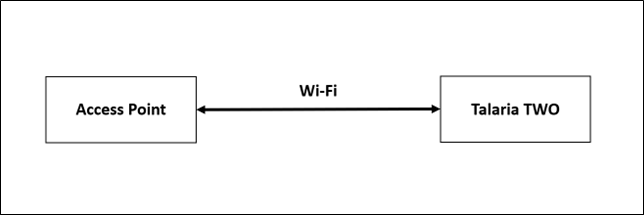
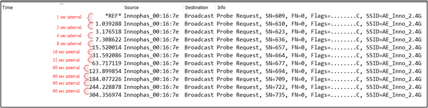
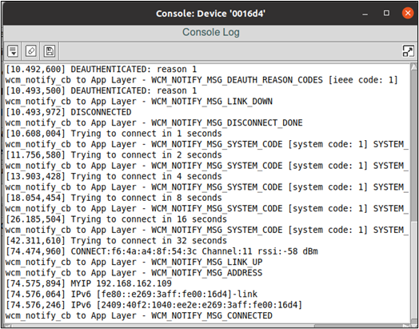
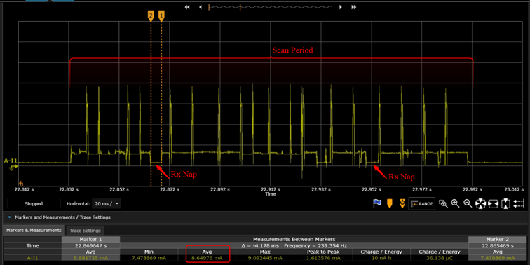
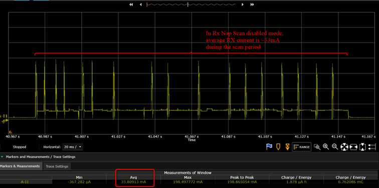

.. _ex wifi:

WI-FI
------------

This application note describes the Wi-Fi Connection Manager APIs
available in the SDK, call-back events, notifications and the data
structures associated with them. The accompanying sample codes help
achieve some of these functionalities using WCM APIs.

Topology
~~~~~~~~~~~~~~~~~~~~~~~~~~~~~~~~~~

|image124|

.. rst-class:: imagefiguesclass
Figure 1: Wi-Fi Connection Manager – Topology

Wi-Fi Connection Manager Functionalities
~~~~~~~~~~~~~~~~~~~~~~~~~~~~~~~~~~

The Wi-Fi connection manager (WCM) contains functions for establishing
and tearing down associations to Wi-Fi access points. It initiates a
four-way handshake for encrypted connections and starts the DHCP client
from LWIP for getting allocation of the IP address.

Following functionalities are achieved through these APIs:

1. Creating and destroying interfaces

2. Scanning with different scan parameters and their indication
   structure

3. Connecting and disconnecting

4. Adding network to connect and removing network

5. Querying connection information

Accompanying sample code provides more details on how to achieve some of
the listed functionalities.

List of APIs
~~~~~~~~~~~~~~~~~~~~~~~~~~~~~~~~~~

1.  os_get_boot_arg_str() - Returns the value of a boot argument as a
    null-terminated string.

2.  xSemaphoreCreateCounting ()- Creates a semaphore. This API must be
    called before calling any other semaphore related APIs.

3.  wcm_create()- Creates a Wi-Fi network interface. Only one wcm_handle
    instance is supported at the time of writing.

4.  wifi_connect_to_network()- Adds a Wi-Fi network .

5.  xSemaphoreTake ()- Locks a semaphore. If the value of the semaphore
    is greater than 0, it decrements the counter. If the value is 0, it
    puts the current thread to sleep until the value becomes positive.
    This function cannot be used in interrupt context.

6.  os_msg_release()- Frees an allocated message. Frees a message
    previously allocated.

7.  os_suspend_enable()- Enables system suspend when idle. Calling
    os_suspend_enable() will enable the suspend (deep sleep) for the
    system. If enabled, the system will go into suspend mode when there
    is nothing for the processor to do. Entering and leaving suspend
    mode takes some extra time, so enabling this will affect the
    real-time response of the system. When in suspended state, the
    system will still wakeup if an interrupt occurs, but the latency
    will be much larger compared to running with suspend mode disabled.

8.  os_get_boot_arg_int()- Returns the value of a boot argument as an
    integer

9.  wifi_init_scan_default()- Gets the default parameters for the scan
    operation. The wifi_scan_param will be updated with the default
    values for the scan operation. This function is used to get the
    default values and alter the parameters whose values are different
    from the default. Finally, provide these parameters while calling
    the wcm_scan() API.

10. wcm_scan()- Scans for Wi-Fi networks. Returns the number of networks
    found during the scan operation. In case the scan could not be
    performed, an error code (negative value) is returned. Initiate a
    network scan procedure on the specified Wi-Fi Connection Manager
    interface.

11. wifi_netinfo_get_ssid()-Gets the SSID information from netinfo.

12. wifi_netinfo_get_chan()-Gets the channel information from netinfo.

13. wcm_free_scanresult() - Frees the memory allocated by wcm_scan().

14. wcm_set_hostname() - Sets host name for DHCP client.

15. wcm_get_hostname() - Gets host name of DHCP client.

States and Events of Wi-Fi Connection Manager
~~~~~~~~~~~~~~~~~~~~~~~~~~~~~~~~~~

The architecture of the WCM, its calls and events with LWIP and Wi-Fi
stacks are described in detail through the API flow.

WCM states are explained, and notifications passed to application
programmer are described.

Initialization
~~~~~~~~~~~~~~~~~~~~~~~~~~~~~~~~~~

When the API wcm_create() is called, the following sequence of
initializations happen on the WCM:

1. LWIP stack is initiated.

2. Wi-Fi interface and resources are created with the passed hwaddr.

3. Wi-Fi interface is created in WIFI_MODE_SCAN mode and a scan client
   is attached with scan_notify() and scan_done() call-backs to get scan
   results.

4. LWIP TCP/IP stack is started with the Wi-Fi interface in
   WIFI_MODE_STA mode.

5. wcm_notify_handler() is registered with the Wi-Fi stack for listening
   to the following link status notifications:

.. code:: shell

      #define WIFI_NOTIFY_MSG_LEAVE      100    /* AP disconnected us */
      #define WIFI_NOTIFY_MSG_LOST       101    /* Lost tracking of AP */
      #define WIFI_NOTIFY_MSG_RESTARTED  102    /* Associated AP restarted */
      #define WIFI_NOTIFY_MSG_REPLAY     103     /* sequence counter replay detected */
      #define WIFI_NOTIFY_MSG_MICHAEL    104     /* Michael MIC failure de-tected */

6. wcm_netif_callback() is registered with LWIP stack for listening IP
   address change events.

7. A dedicated wcm_thread is created which takes care of WCM’s state
   transitions at various stages of Wi-Fi connection procedure based on
   the previously described call-backs from the Wi-Fi stack, scanning
   interface and LWIP stack.

States of WCM
~~~~~~~~~~~~~~~~~~~~~~~~~~~~~~~~~~

All the possible states of the WCM are defined as follows:

.. code:: shell

      enum c_state {
          C_DISCONNECTED            = 0,
          C_SCANNING                = 1,
          C_AUTHENTICATING          = 2,
          C_ASSOCIATING             = 3,
          C_WAIT_4WAY               = 4,
          C_CONNECTED               = 5,
          C_DISCONNECT_WAIT         = 6,
          C_TERMINATE               = 7,
          //[[[end]]]
      };

The message pointer \*msg has a message type associated with it.
msg->msg_type can have a value from the enum wcm_notify_msg_type,
containing message types of WCM. This will notify message callbacks as
shown:

.. code:: shell

      enum wcm_notify_msg_type {
          /** WiFi link is up */
          WCM_NOTIFY_MSG_LINK_UP         =  200,
          /** WiFi link is down */
          WCM_NOTIFY_MSG_LINK_DOWN       =  201,
          /** Address has changed. The message sent is of type @ref wcm_address_event  */
          WCM_NOTIFY_MSG_ADDRESS         =  202,
          /** WiFi disconnect complete */
          WCM_NOTIFY_MSG_DISCONNECT_DONE =  203,
          /** WiFi connect complete */
          WCM_NOTIFY_MSG_CONNECTED       =  204,
          /** WiFi deauthentication reason codes as provided by access point or by Talaria2 */
          WCM_NOTIFY_MSG_DEAUTH_REASON_CODES =  205,
          /** WiFi association status codes as provided by access point or by Talaria2 */
          WCM_NOTIFY_MSG_ASSOC_STATUS_CODES =  206,
          /** system error codes of type @ref system_notify_msg_code */
          WCM_NOTIFY_MSG_SYSTEM_CODES    =  207,
          // [[[end]]]
      };

If the notification WCM_NOTIFY_MSG_ADDRESS occurs, then the message
received is of the type wcm_address_event. The structure definition for
wcm_address_event is as follows:

.. code:: shell

      struct wcm_address_event {
          /** Message header */
          struct os_msg iev_hdr;
          /** Typically AF_INET or AF_INET6 */
          unsigned int  iev_af;
          /** The address of up to 16 bytes (IPv6) */
          unsigned char iev_address[0];
      };

Address type and address data can be retrieved by typecasting the
message to struct wcm_address_event.

Source Code Walkthrough
~~~~~~~~~~~~~~~~~~~~~~~~~~~~~~~~~~

Wifi_Connect 
~~~~~~~~~~~~~~~~~~~~~~~~~~~~~~~~~~

Overview
~~~~~~~~

The sample code in the path *apps\\using_wifi\\src\\wifi_connect.c*
showcases simple connecting to a network with the API
wifi_connect_to_network().

**Note:** Upon disconnection of station (Talaria TWO module) from the AP
due to various reasons such as AP power off, module tries to reconnect
by sending a probe request packet. Each failed connection attempt will
increase the reconnect backoff time exponentially as 1, 2, 4, 8, 16, 32,
60 seconds.

After 60 seconds, module tries to reconnect indefinitely at every 60
seconds. Below sniffer capture shows Talaria TWO’s exponential
reconnection method.

|image125|

.. rst-class:: imagefiguesclass
Figure 2: Sniffer Capture – Wi-Fi Reconnection

|image126|

.. rst-class:: imagefiguesclass
Figure 3: Talaria TWO Console Logs – Wi-Fi Reconnection

Sample Code Walkthrough
~~~~~~~~~~~~~~~~~~~~~~~

To connect to a Wi-Fi network, wcm_create()API from the Wi-Fi Connection
Manager is used. Initially, the Wi-Fi network interface is created using
wcm_create().

.. code:: shell

      h = wcm_create(NULL); 

wcm_set_hostname() API is used to set the host name in DHCP client. It
is used for identifying the client device (Talaria TWO) in the
network/AP.

Note: Default host name of Talaria TWO is talaria2.

.. code:: shell

      if(host_name != NULL)
           wcm_set_hostname(wcm_handle, host_name);
           host_name = wcm_get_hostname(wcm_handle);
           os_printf("host name %s\n", host_name);

wifi_connect_to_network()API, from components library, connects to the
Wi-Fi network using the AP credentials provided.

.. code:: shell

      rval = wifi_connect_to_network(&h, WCM_CONN_WAIT_INFINITE, &wcm_connect_success);
      if(rval < 0) {
           os_printf("\nError: Unable to connect to network\n");
           return 0;}

Running the Application
~~~~~~~~~~~~~~~~~~~~~~~

Program
wifi_connect.elf(*freertos_sdk_x.y\\examples\\using_wifi\\bin*)using the
Download tool(*freertos_sdk_x.y\\pc_tools\\Download_Tool\\bin*)provided
with InnoPhase Talaria TWO SDK.

1. Launch the Download tool.

1. In the GUI window:

   a. Boot Target: Select the appropriate EVK from the drop-down.

   a. ELF Input: Load the wifi_connect.elf by clicking on Select ELF
      File.

   a. AP Options: Pass the appropriate SSID and passphrase to connect to
      an Access Point.

   a. Boot Arguments: Add the host name as a boot argument.

.. code:: shell

      host_name=<host_name>   

..

   Note: Default host name is talaria2.

a. Programming: Prog RAM or Prog Flash as per requirement.

Expected Output
~~~~~~~~~~~~~~~

wifi_connect.elf execution displays the following output on the console
for different scenarios:

.. code:: shell

       UART:SNWWWWAE
      4 DWT comparators, range 0x8000
      Build $Id: git-ef87896f9 $
      hio.baudrate=921600
      flash: Gordon ready!
      [7.750,092] partitions mounted
      UART:SNWWWWAE
      4 DWT comparators, range 0x8000
      Build $Id: git-ef87896f9 $
      hio.baudrate=921600
      flash: Gordon ready!
      
      Y-BOOT 208ef13 2019-07-22 12:26:54 -0500 790da1-b-7
      ROM yoda-h0-rom-16-0-gd5a8e586
      FLASH:PNWWWWWWAE
      Build $Id: git-df9b9ef $
      Flash detected. flash.hw.uuid: 39483937-3207-00b0-0064-ffffffffffff
      Bootargs: host_name=InnoIot np_conf_path=/data/nprofile.json ssid=Lucy passphrase=Password@321
      $App:git-6600fea
      SDK Ver: FREERTOS_SDK_1.0
      Wifi connect Demo App
      addr e0:69:3a:00:16:d4
      [0.592,108] CONNECT:c8:e7:d8:8c:ba:3c Channel:6 rssi:-64 dBm
      [1.366,851] MYIP 192.168.1.105
      [1.367,132] IPv6 [fe80::e269:3aff:fe00:16d4]-link
      ------------- Connected to Network--------

Wi-Fi Scan 
~~~~~~~~~~~~~~~~~~~~~~~~~~~~~~~~~~

.. _overview-1:

Overview
~~~~~~~~

The sample code in the path *example\\using_wifi\\src\\wifi_scan.c*
scans for available Wi-Fi networks and prints them out.

Following are the steps:

1. Create a data structure to store the parameters and results of scan.

2. Set the default parameter for scanning using the API
   wifi_init_scan_default()

3. In a loop, let the code scan and print the nearby networks from
   vicinity for every 10 second interval of time.

.. _sample-code-walkthrough-1:

Sample Code Walkthrough
~~~~~~~~~~~~~~~~~~~~~~~

The necessary data structures to store parameters and result of scan are
created as shown:

.. code:: shell

      int main(void)
      {
          struct wcm_handle *h;
          const size_t max_nets = 64;
          struct wifi_netinfo **scan_result;
          struct wifi_scan_param param;
      …
      …
      …
          scan_result = pvPortMalloc (max_nets * sizeof(void *));
          assert(scan_result != NULL);

wifi_init_scan_default()API is used to set the default parameters for
the scanning, and wcm_scan() is used with explained parameters to start
scanning.

The example code runs in a loop, scans and prints the results using
wifi_netinfo_get_ssid() and wifi_netinfo_get_chan(), frees up the memory
allocated for scan result using wcm_free_scanresult() and waits for 10
seconds before scanning and printing again as shown in the following
code:

.. code:: shell

      wifi_init_scan_default(&param);
      	
      	// print scan parameters
      	print_scan_params(param);
      	
          for (;;) {
      		// perform scan
              int n = wcm_scan(h, &param, scan_result, max_nets);
      
      		// print out results of scan
              os_printf("Found %d nets:\n", n);
              for (int i = 0; i < n; i++) {
                  uint8_t chan;
                  struct wifi_ssid ssid;
                  wifi_netinfo_get_ssid(scan_result[i], &ssid);
                  wifi_netinfo_get_chan(scan_result[i], &chan);
                  os_printf("%6pM on channel %2d @ %3d '%s'\n",
                            scan_result[i]->ni_bssid, chan, 
                            scan_result[i]->ni_rssi, ssid.ws_ssid);
              }
              wcm_free_scanresult(scan_result, n);
              vTaskDelay(1000);
          }

.. _running-the-application-1:

Running the Application
~~~~~~~~~~~~~~~~~~~~~~~

Program wifi_scan.elf
(*freertos_sdk_x.y\\examples\\using_wifi\\bin*)using the Download tool
provided with InnoPhase Talaria TWO SDK.

Refer steps mentioned in section 8.1.3 for more details.

.. _expected-output-1:

Expected Output
~~~~~~~~~~~~~~~

wifi_scan.elf execution displays the following output on the console for
different scenarios:

.. code:: shell

      UART:SNWWWWAE
      4 DWT comparators, range 0x8000
      Build $Id: git-ef87896f9 $
      hio.baudrate=921600
      flash: Gordon ready!
      
      Y-BOOT 208ef13 2019-07-22 12:26:54 -0500 790da1-b-7
      ROM yoda-h0-rom-16-0-gd5a8e586
      FLASH:PNWWWWWAE
      Build $Id: git-831e563 $
      Flash detected. flash.hw.uuid: 39483937-3207-00b0-0064-ffffffffffff
      $App:git-e608081
      SDK Ver: FREERTOS_SDK_1.0
      Wifi Scan Demo App
      addr e0:69:3a:00:16:d4
      Scan parameters:
      	channel_masks: 255 255 255 255 255 255 255 255 
      	bssid: 0xFFFFFFFFFFFF
      	txrate: 0
      	waittime: 0
      	ie list: 0x
      Found 5 nets:
      f6:4a:a4:8f:54:3c on channel 11 @ -54 'Prasanna' 'WPA2-PSK'
      6a:22:32:2c:80:6a on channel  1 @ -69 '' 'WPA2-PSK'
      38:6b:1c:c0:da:38 on channel 13 @ -72 'connect_Idle_stability' 'WPA-PSK/WPA2-PSK Mixed Mode'
      6a:22:32:60:06:52 on channel  1 @ -90 '' 'WPA2-PSK'
      60:22:32:60:06:52 on channel  1 @ -92 'InnoIOT' 'WPA2-PSK'
      Found 10 nets:
      f6:4a:a4:8f:54:3c on channel 11 @ -52 'Prasanna' 'WPA2-PSK'
      c8:7f:54:7b:bd:80 on channel  6 @ -56 'ASUS_WIFI_TB1' 'WPA2-PSK+MFPC'
      bc:0f:9a:70:02:ef on channel 13 @ -58 'dlink_x1560wpa3' 'WPA2-PSK'
      66:22:32:2c:80:6a on channel  1 @ -64 '' 'WPA2-PSK'
      60:22:32:2c:80:6a on channel  1 @ -65 'InnoIOT' 'WPA2-PSK'
      6a:22:32:2c:80:6a on channel  1 @ -69 '' 'WPA2-PSK'
      38:6b:1c:c0:da:38 on channel 13 @ -70 'connect_Idle_stability' 'WPA-PSK/WPA2-PSK Mixed Mode'
      12:27:f5:6d:e8:74 on channel  9 @ -80 '' 'WPA2-PSK'
      10:27:f5:7d:e8:74 on channel  9 @ -80 'tplinkc6_iop' 'WPA2-PSK'
      5c:f9:fd:7c:2f:79 on channel 10 @ -94 'Airtel_Zerotouch' 'WPA-PSK/WPA2-PSK Mixed Mode'

Power Optimization with Rx Nap Scan
~~~~~~~~~~~~~~~~~~~~~~~~~~~~~~~~~~~

In a crowded environment, Rx Nap Scan feature can be enabled to save
power during the scan process. In this mode, the Rx nap function will
turn the Talaria TWO’s receiver OFF (*takes a nap*) for the duration of
the frame when there are uninteresting frames with high signal strength.
The frames of interest are probe responses and beacon frames.

This mode is enabled by default in wifi_scan.elf and can be disabled
using the following boot argument:

.. code:: shell

      wifi.nap_scan=0    

As shown in Figure 4, Talaria TWO takes naps when there are
uninteresting frames. During the naps, current consumption dips to 8mA
whereas during the scan period, the average Rx current remains at ~33mA.

|image127|

.. rst-class:: imagefiguesclass
Figure 4: Talaria TWO naps during uninteresting frames

Rx nap scan mode disabled is as shown in Figure 5.

|image128|

.. rst-class:: imagefiguesclass
Figure 5: Rx nap scan mode disabled

Wifi_Connect_Disconnect
~~~~~~~~~~~~~~~~~~~~~~~~~~~~~~~~~~

.. _overview-2:

Overview
~~~~~~~~

The sample code in the path:
*apps\\using_wifi\\src\\wifi_connect_disconnect.c* showcases connecting
to and disconnecting from a network asynchronously with the API
wcm_auto_connect() and wcm_add_network_profile().

.. _sample-code-walkthrough-2:

Sample Code Walkthrough
~~~~~~~~~~~~~~~~~~~~~~~

This example code initializes two semaphores and creates two tasks.

.. code:: shell

    /* initializes the semaphores */
    my_sem1 = xSemaphoreCreateCounting(1, 0);
    my_sem2 = xSemaphoreCreateCounting(1, 0);

    /* creates a task */
    xTaskCreate(my_app_task_func1, "task1", MY_APP_THREAD_STACK_SIZE,
      (void *)my_arg1, MY_APP_THREAD_PRIO, &task1);

    /* creates a task */
    xTaskCreate(my_app_task_func2, "task2", MY_APP_THREAD_STACK_SIZE,
      (void *)my_arg2, MY_APP_THREAD_PRIO, &task2);

    vTaskSuspend(NULL);

    return 0;

On executing, task2 enters a loop where it first waits for a semaphore
from task1.

task 1 on running, attempts wcm_add_network_profile()and
wcm_auto_connect()with param bool enable as 1 to connect, and waits for
10 seconds and finally enters a loop where it performs the following:

1. Calls wcm_auto_connect()with param bool enable as 0 to asynchronously
   disconnect, without removing the network

2. Waits for 10 seconds and unblocks task2 by posting a semaphore

3. Finally waits on a semaphore posted from task2, before looping back
   again to asynchronously disconnect attempt using wcm_auto_connect()

.. code:: shell

      /* the Task function */
      static void
      my_app_task_func1(void *arg)
      {
          os_printf("task1 prints -- %s\n", (char *)arg);
      
          /* Create a Wi-Fi network interface */
          my_wcm_handle = wcm_create(NULL);
      
          wcm_notify_enable(my_wcm_handle, my_wcm_notify_cb, NULL);
      
          /*"/data/nprofile.json" */
          const char *np_conf_path = os_get_boot_arg_str("np_conf_path") ?: NULL;
          struct network_profile *profile;
          int rval;
          if (np_conf_path != NULL) {
              /* Create a Network Profile from a configuration file in
               *the file system */
              rval = network_profile_new_from_file_system(&profile, np_conf_path);
          } else {
              /* Create a Network Profile using BOOT ARGS */
              rval = network_profile_new_from_boot_args(&profile);
          }
          if (rval < 0) {
              pr_err("could not create network profile %d\n", rval);
              return;
          }
      
          rval = wcm_add_network_profile(my_wcm_handle, profile);
          if (rval < 0) {
              pr_err("could not associate network profile to wcm %d\n", rval);
              return;
          }
      
          vTaskDelay(2000);
      
          os_printf("task1 prints -- calling api wcm_auto_connect(1) to connect to "
                    "already added network\n");
          wcm_auto_connect(my_wcm_handle, 1);
      
          os_printf("task1 prints -- will try a disconnect after 10 seconds... \n");
      
          vTaskDelay(10000);
      
          while (1) {
      
              os_printf("task1 prints -- calling api wcm_auto_connect(0) to just "
                        "disconnect without removing network..\n");
              wcm_auto_connect(my_wcm_handle, 0);
      
              vTaskDelay(10000);
      
              /* unlock Thread2 */
              xSemaphoreGive(my_sem2);
              /* block until task 2 unblocks us */
              xSemaphoreTake(my_sem1, portMAX_DELAY);
          }
      }

As noted earlier, task2 is in a loop, and when unblocked:

1. Calls wcm_auto_connect()with param bool enable as 1 to asynchronously
   connect to previously added network

2. Waits for 10 seconds and unblocks task1 by posting a semaphore

3. Enters the loop again where it finally waits on a semaphore posted
   from task1, before trying to asynchronously connect using
   wcm_auto_connect().

.. code:: shell

      /* the task function */
      static void
      my_app_task_func2(void *arg)
      {   vTaskDelay(5000);
          os_printf("task2 prints -- %s\n", (char *)arg);
          while (1) {
              /* block until task 1 unblocks us */
              xSemaphoreTake(my_sem2, portMAX_DELAY);
              os_printf("task2 prints -- calling api wcm_auto_connect(1) to connect "
                        "to already added network\n");
              wcm_auto_connect(my_wcm_handle, 1);
              vTaskDelay(10000);
      
              /* unlock Thread1 */
              xSemaphoreGive(my_sem1);
          }
      }

In this example, Talaria TWO module connects and disconnects from the
network approximately every 10 seconds without removing the network
name.

Notifications from WCM are registered and are printed similar to the
previous example.

.. _running-the-application-2:

Running the Application
~~~~~~~~~~~~~~~~~~~~~~~

Program wifi_connect_diconnect.elf
(*sdk_x.y\\examples\\using_wifi\\bin*) using the Download Tool provided
with InnoPhase Talaria TWO SDK.

Refer steps mentioned in section 8.1.3 for more details.

PMK Caching
~~~~~~~~~~~

When Talaria TWO connects to an Access Point, the PMK generated after
802.1X authentication method will be stored in Talaria TWO’s flash and
this cached PMK will be used for subsequent connections.

This ensures minimal connection latency between the Access Point and
Talaria TWO as it avoids recomputing of PMK for each connection. PMK
cache feature is supported only on WPA2-PSK or Mixed mode.

.. _expected-output-2:

Expected Output
~~~~~~~~~~~~~~~

wifi_connect_disconnect.elf execution displays the following output on
the console for different scenarios:

Case 1
^^^^^^

AP is already ON at connection attempt, connect success, alternate
connect disconnect with autoconnect API, add and remove network, as
expected.

Background notifications are received.

.. code:: shell

      Y-BOOT 208ef13 2019-07-22 12:26:54 -0500 790da1-b-7
      ROM yoda-h0-rom-16-0-gd5a8e586
      FLASH:PWWWWWWAE
      Build $Id: git-831e563 $
      Flash detected. flash.hw.uuid: 39483937-3207-0061-00a2-ffffffffffff
      Bootargs: ssid=test passphrase=12345678
      SDK Ver: FREERTOS_SDK_1.0
      Wifi Async Connect Demo App
      task1 prints -- application task1 will attempt wcm_add_network_profile() and wcm_auto_connect(1) and then disconnect with wcm_auto_connect(0) 10 seconds after every connection
      addr e0:69:3a:00:15:a8
      network profile created for ssid: test
      task1 prints -- calling api wcm_auto_connect(1) to connect to already added network
      task1 prints -- will try a disconnect after 10 seconds... 
      [4.802,027] DISCONNECTED
      [4.960,984] CONNECT:8e:44:eb:4a:ff:f2 Channel:6 rssi:-49 dBm
      wcm_notify_cb to App Layer - WCM_NOTIFY_MSG_LINK_UP
      task2 prints -- application task2 will attempt connect using wcm_auto_connect(1).
      wcm_notify_cb to App Layer - WCM_NOTIFY_MSG_ADDRESS
      [5.066,941] MYIP 192.168.122.64
      [5.067,105] IPv6 [fe80::e269:3aff:fe00:15a8]-link
      task1 prints -- calling api wcm_auto_connect(0) to just disconnect without removing network..
      wcm_notify_cb to App Layer - WCM_NOTIFY_MSG_LINK_DOWN
      [12.059,776] DISCONNECTED
      task2 prints -- calling api wcm_auto_connect(1) to connect to already added network
      [22.360,925] CONNECT:8e:44:eb:4a:ff:f2 Channel:6 rssi:-53 dBm
      wcm_notify_cb to App Layer - WCM_NOTIFY_MSG_LINK_UP
      wcm_notify_cb to App Layer - WCM_NOTIFY_MSG_ADDRESS
      [22.440,115] MYIP 192.168.122.64
      [22.440,165] IPv6 [fe80::e269:3aff:fe00:15a8]-link
      [22.440,230] IPv6 [2409:40c1:102f:5e67:e269:3aff:fe00:15a8]
      task1 prints -- calling api wcm_auto_connect(0) to just disconnect without removing network..
      wcm_notify_cb to App Layer - WCM_NOTIFY_MSG_LINK_DOWN
      [32.063,542] DISCONNECTED

Case 2
^^^^^^

AP is already ON at connection attempt, wrong password provided, connect
failure, alternate connect disconnect and add network and remove network
as expected, without any task hanging.

.. code:: shell

      Y-BOOT 208ef13 2019-07-22 12:26:54 -0500 790da1-b-7
      ROM yoda-h0-rom-16-0-gd5a8e586
      FLASH:PWWWWWWAE
      Build $Id: git-831e563 $
      Flash detected. flash.hw.uuid: 39483937-3207-0061-00a2-ffffffffffff
      Bootargs: ssid=test passphrase=123456789
      SDK Ver: FREERTOS_SDK_1.0
      Wifi Async Connect Demo App
      task1 prints -- application task1 will attempt wcm_add_network_profile() and wcm_auto_connect(1) and then disconnect with wcm_auto_connect(0) 10 seconds after every connection
      addr e0:69:3a:00:15:a8
      network profile created for ssid: test
      task1 prints -- calling api wcm_auto_connect(1) to connect to already added network
      task1 prints -- will try a disconnect after 10 seconds... 
      [2.864,106] CONNECT:da:14:ac:e6:b5:f1 Channel:6 rssi:-51 dBm
      task2 prints -- application task2 will attempt connect using wcm_auto_connect(1).
      [6.878,443] DEAUTHENTICATED: reason 15
      [6.879,737] DISCONNECTED during key negotiation, wrong key?
      [6.951,227] Trying to connect in 2 seconds
      [9.200,373] CONNECT:da:14:ac:e6:b5:f1 Channel:6 rssi:-50 dBm
      task1 prints -- calling api wcm_auto_connect(0) to just disconnect without removing network..
      [12.059,689] DISCONNECTED during key negotiation, wrong key?
      task2 prints -- calling api wcm_auto_connect(1) to connect to already added network
      [22.281,520] CONNECT:da:14:ac:e6:b5:f1 Channel:6 rssi:-57 dBm
      [26.306,590] DEAUTHENTICATED: reason 15
      [26.307,313] DISCONNECTED during key negotiation, wrong key?
      [26.378,251] Trying to connect in 2 seconds
      [28.603,887] CONNECT:da:14:ac:e6:b5:f1 Channel:6 rssi:-51 dBm
      task1 prints -- calling api wcm_auto_connect(0) to just disconnect without removing network..
      [32.061,392] DISCONNECTED during key negotiation, wrong key?
      task2 prints -- calling api wcm_auto_connect(1) to connect to already added network
      [42.343,717] CONNECT:da:14:ac:e6:b5:f1 Channel:6 rssi:-50 dBm
      [50.343,866] DISCONNECTED during key negotiation, wrong key?
      [50.419,134] Trying to connect in 2 seconds
      task1 prints -- calling api wcm_auto_connect(0) to just disconnect without removing network..
      task2 prints -- calling api wcm_auto_connect(1) to connect to already added network
      [62.319,817] CONNECT:da:14:ac:e6:b5:f1 Channel:6 rssi:-50 dBm
      [70.320,202] DISCONNECTED during key negotiation, wrong key?
      [70.391,726] Trying to connect in 2 seconds
      task1 prints -- calling api wcm_auto_connect(0) to just disconnect without removing network..

Case 3
^^^^^^

AP is switched OFF at connection attempt, alternate connect disconnected
and remove network as expected, without any task hanging.

Later, AP is switched ON, connect success, alternate connect disconnect and add remove as expected.

.. code:: shell

      Y-BOOT 208ef13 2019-07-22 12:26:54 -0500 790da1-b-7
      ROM yoda-h0-rom-16-0-gd5a8e586
      FLASH:PWWWWWWAE
      Build $Id: git-831e563 $
      Flash detected. flash.hw.uuid: 39483937-3207-0061-00a2-ffffffffffff
      Bootargs: ssid=test passphrase=12345678
      SDK Ver: FREERTOS_SDK_1.0
      Wifi Async Connect Demo App
      task1 prints -- application task1 will attempt wcm_add_network_profile() and wcm_auto_connect(1) and then disconnect with wcm_auto_connect(0) 10 seconds after every connection
      addr e0:69:3a:00:15:a8
      network profile created for ssid: test
      task1 prints -- calling api wcm_auto_connect(1) to connect to already added network
      task1 prints -- will try a disconnect after 10 seconds... 
      [2.820,409] CONNECT:56:81:d3:91:b1:08 Channel:6 rssi:-36 dBm
      wcm_notify_cb to App Layer - WCM_NOTIFY_MSG_LINK_UP
      wcm_notify_cb to App Layer - WCM_NOTIFY_MSG_ADDRESS
      [2.885,129] MYIP 192.168.122.64
      [2.885,293] IPv6 [fe80::e269:3aff:fe00:15a8]-link
      task2 prints -- application task2 will attempt connect using wcm_auto_connect(1).
      task1 prints -- calling api wcm_auto_connect(0) to just disconnect without removing network..
      wcm_notify_cb to App Layer - WCM_NOTIFY_MSG_LINK_DOWN
      [12.059,726] DISCONNECTED
      task2 prints -- calling api wcm_auto_connect(1) to connect to already added network
      [22.571,246] Trying to connect in 1 seconds
      [23.726,939] Trying to connect in 2 seconds
      [25.930,213] Trying to connect in 4 seconds
      [30.085,341] Trying to connect in 8 seconds
      task1 prints -- calling api wcm_auto_connect(0) to just disconnect without removing network..
      task2 prints -- calling api wcm_auto_connect(1) to connect to already added network
      [42.700,208] Trying to connect in 1 seconds
      [43.877,703] Trying to connect in 2 seconds
      [46.038,532] Trying to connect in 4 seconds
      [50.201,438] Trying to connect in 8 seconds
      task1 prints -- calling api wcm_auto_connect(0) to just disconnect without removing network..
      task2 prints -- calling api wcm_auto_connect(1) to connect to already added network
      [62.622,375] CONNECT:da:14:ac:e6:b5:f1 Channel:6 rssi:-42 dBm
      wcm_notify_cb to App Layer - WCM_NOTIFY_MSG_LINK_UP
      wcm_notify_cb to App Layer - WCM_NOTIFY_MSG_ADDRESS
      [62.689,656] MYIP 192.168.122.64
      [62.689,820] IPv6 [fe80::e269:3aff:fe00:15a8]-link
      [62.689,885] IPv6 [2409:40c1:102f:5e67:e269:3aff:fe00:15a8]
      task1 prints -- calling api wcm_auto_connect(0) to just disconnect without removing network..
      wcm_notify_cb to App Layer - WCM_NOTIFY_MSG_LINK_DOWN
      [72.065,233] DISCONNECTED

