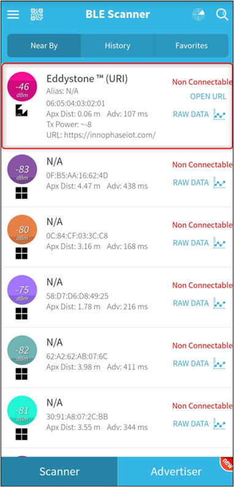
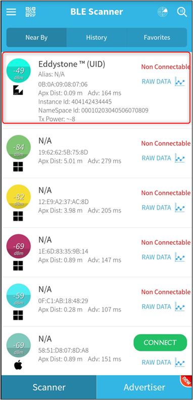
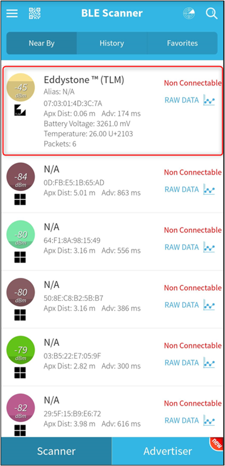

.. _ex ble beacons:

BLE Beacon
----------------

This application note covers three example codes describing the basic
concept of Eddystone Beacon. By running these examples, the board
advertises specific service data as per the protocol and allows another
BLE device or phone to recognize it if it is in the range of the Talaria
TWO device.

Eddystone Beacons
~~~~~~~~~~~~~~~~~~~~~~~~~~~~~~~~

A BLE Beacon is a device broadcasting a non-connectable advertising
packet carrying small pieces of information to nearby devices.

Eddystone is an open format Beacon protocol specification from Google,
defining BLE message format for proximity Beacon messages.

It is part of the Google Beacon Platform and defines several different
types of frames which can be used to create Beacons for a variety of
highly context−sensitive use cases and applications.

Few types of the frames format defined by Eddystone protocol are covered
in the consecutive examples and are as follows:

1. Frame Type UID – Unique identifier for the Beacon with a 10 bytes
   namespace and a 6 bytes instance component

2. Frame Type URL – Compressed web URL that can be launched by the smart
   device application

3. Frame Type TLM – Telemetry information of the beacon device. Ex:
   battery voltage and temperature

These frames are defined in more details in the Eddystone Protocol
Specification available in the following link:
https://github.com/google/eddystone/blob/master/protocol-specification.md.

In the examples described, Talaria TWO operates as a traditional
broadcaster sending periodic non-connectable advertisements consisting
of UID, URL, or TLM frames.

Non-connectable advertising mode is enabled to start sending out the
packets at the desired rate and power. For practical reasons, TLM frames
are expected to be observed less frequently than UID or URL frames.

Sample Application APIs
~~~~~~~~~~~~~~~~~~~~~~~~~~~~~~~~

bt_gap_init()
~~~~~~~~~~~~~~~~~~~~~~~~~~~~~~~~

Creates and initializes all the resources needed to run GAP Service and
must be called before using any of the other functions in the Bluetooth
GAP interface.

bt_gap_cfg_adv()
~~~~~~~~~~~~~~~~~~~~~~~~~~~~~~~~

Configures the advertisement parameters for the GAP peripheral through
which the frequency of advertisement transmission in fast and slow mode
can be adjusted. It also configures the Tx power for advertisement and
the channel map used.

.. code:: shell

      bt_gap_error_t bt_gap_cfg_adv(const uint16_t adv_fast_period, const uint16_t adv_slow_period, const uint16_t adv_fast_int, const uint16_t adv_slow_int,             const int8_t adv_tx_power , const uint8_t adv_ch_map)

It takes the following parameters as input:

1. adv_fast_period (ms): for this period, fast advertising is attempted
   every adv_fast_int interval. Once this period is over, slow
   advertising is attempted every adv_slow_int interval. Default value
   of this parameter is 0 representing period infinity, which means fast
   advertising will be attempted forever once started.

2. adv_slow_period (ms): for this period, slow advertising is attempted
   every adv_slow_int interval. Once this period is over, advertising is
   disabled. Default value of this parameter is 0 representing period
   infinity, which means slow advertising will be attempted forever once
   started.

3. adv_fast_int - In 625µs units: This sets the interval between two
   fast advertisements. Range: 0x0020 to 0x4000 (default: 200).

..

   Which implies, when this interval is represented in decimal, the
   range is between 20,000µs (20ms) to 10,240,000µs (10,240ms)
   configurable in the steps of 625µs. Default in decimal is 125,000‬µs,
   which is, every 125ms, 8 times per second.

4. adv_slow_int - In 625µs units: This sets the interval between two
   slow advertisements. Range: 0x0020 to 0x4000 (default: 1600).

..

   Which implies, when this interval is represented in decimal, the
   range is between 20,000µs (20ms) to 10,240,000 µs (10240ms)
   configurable in the steps of 625µs. Default in decimal is
   10,00,000µs, which is, every 1000ms, once per second.

5. adv_tx_power - In dBm, range: -127 to 10, and 127 (127=no preference)
   (default: 127)

6. adv_ch_map: Channel map used: bit0=ch37, bit1=ch38, bit2=ch39
   (default: 0x7)

The API returns error code from bt_gap_error_t.

bt_gap_addr_set()
~~~~~~~~~~~~~~~~~~~~~~~~~~~~~~~~

Sets the address of the GAP interface with the desired address type.

.. code:: shell

      bt_gap_error_t bt_gap_addr_set(const bt_hci_addr_type_t type, const bt_address_t addr)

The address type can be one of them from the following list:

.. code:: shell

      typedef enum {
          /* Used for Own and Peer */
          bt_hci_addr_type_public            = 0x0,
          bt_hci_addr_type_random            = 0x1,
          bt_hci_addr_type_resolvable_public = 0x2,
          bt_hci_addr_type_resolvable_random = 0x3
      } 
      bt_hci_addr_type_t;

bt_gap_connectable_mode()
~~~~~~~~~~~~~~~~~~~~~~~~~~~~~~~~

Sets the device in desired connectable mode.

.. code:: shell

      bt_gap_error_t bt_gap_connectable_mode(const gap_connectable_mode_t mode, const bt_hci_addr_type_t own_type, const bt_hci_addr_type_t peer_type, const bt_address_t peer_address, const gap_ops_t *ops)

Connection mode can be one of them from the following list:

.. code:: shell

      typedef enum {
          /** Disable connectable mode */
          GAP_CONNECTABLE_MODE_DISABLE  = 0,
          /** Do not allow a connection to be established */
          GAP_CONNECTABLE_MODE_NON      = 1,
          /** Accept a connection request from a known peer device */
          GAP_CONNECTABLE_MODE_DIRECT   = 2,
          /** Accept a connection request from a any device */
          GAP_CONNECTABLE_MODE_UNDIRECT = 3,
      } gap_connectable_mode_t;

Other input parameters to this API are:

1. own_type: Own address type: 0=public, 1=random, 2=resolvable (or
   public if no local IRK), 3=resolvable (or random if no local IRK)

2. peer_type: Peer address type: 0=public (device or identity), 1=random
   (device or identity)

3. peer_address: Peer address

4. ops: GAP callback functions. For example, connection and
   disconnection callback

bt_gap_set_adv_data()
~~~~~~~~~~~~~~~~~~~~~~~~~~~~~~~~

Sets advertising data for legacy advertising.

.. code:: shell

      bt_gap_error_t bt_gap_set_adv_data(const uint8_t length, const uint8_t data[

Error code from bt_gap_error_t.

bt_gap_destroy()
~~~~~~~~~~~~~~~~~~~~~~~~~~~~~~~~

Shuts down and cleans up the Bluetooth GAP service.

.. code:: shell

      int bt_gap_destroy(void)   

Shuts down and frees up all resources previously claimed by the
bt_gap_init() call. Returns zero on success, non-zero otherwise.

Code Walkthrough
~~~~~~~~~~~~~~~~~~~~~~~~~~~~~~~~

**Note**: All the applicable ELFs are available in the following
location of the SDK release package: *freertos_sdk_x.y\\examples\\
ble_beacons\\bin*.

x and y in freertos_sdk_x.y refer to the SDK release version. For
example: *freertos_sdk_2.4\\examples\\* *ble_beacons\\bin*.

Sample Application 1 – Eddystone URI Application
~~~~~~~~~~~~~~~~~~~~~~~~~~~~~~~~~~~~~~~~~~~~~~~~~~

Overview
~~~~~~~~~~

The sample code in the path /examples/ble_beacons/eddystone_uri/main.c
describes how the Eddystone URI Beacon packets can be formed and
advertised.

In the first 10.2 seconds, advertising frequency is per 100ms after
which it changes to once per second.

Sample Code Walkthrough
~~~~~~~~~~~~~~~~~~~~~~~~~~

Declare the advertising packet in Eddystone URI format:

.. code:: shell

      const uint8_t eddystone_url_data[] = {
      	0x03,  // Length of Service List
      	0x03,  // Param: Service List
      	0xAA, 0xFE,  // Eddystone ID
      	0x13,  // Length of Service Data
      	0x16,  // Service Data
      	0xAA, 0xFE, // Eddystone ID
      	0x10,  // Frame type: URL
      	0xF8, // Power
      	0x03, // https://
      	'i',
      	'n',
      	'n',
      	'o',
      	'p',
      	'h',
      	'a',
      	's',
      	'e',
      	'i',
      	'n',
      	'c',
      	0x00, // .com/
      	};

Declare the advertisement data by following the steps described in the
following site:
(https://github.com/google/eddystone/tree/master/eddystone-url ).

Due to the Beacon specifications, the length of the URLs must be 18
bytes or less. If the desired URL is longer, use an URL Shortener.

Initialize the GAP
~~~~~~~~~~~~~~~~~~~~~~~~~~~~~~~~

To send the Eddystone URI packet as advertising data, GAP must be
initialized first.

.. code:: shell

      bt_gap_init();    

The GAP API must be initialized before other functions in the GAP
interface are called.

Configure Advertisement URI Parameters
~~~~~~~~~~~~~~~~~~~~~~~~~~~~~~~~

For the Beacon devices, it is very important to be able to find tune the
power and frequency at which the Beacon advertisements are sent.

Faster advertising intervals allow for quicker discovery by the smart
device, while longer intervals allow for longer Beacon battery life.

We should select advertising parameters that balance Beacon power usage
with advertising frequency.

Here, bt_gap_cfg_adv() sets these parameters for advertisement.

.. code:: shell

      bt_adv_handle.fast_period = 10240;
      bt_adv_handle.slow_period = 0;
      bt_adv_handle.fast_interval = 160;
      bt_adv_handle.slow_interval = 1600;
      bt_adv_handle.tx_power = 0;
      bt_adv_handle.channel_map = 0;
      bt_gap_cfg_adv_set(&bt_adv_handle);

Parameters passed for configuring the advertisement are:

1. adv_fast_period is set to 10,240ms which is the nearest multiple of
   10 seconds in 625us units.

..

   This suggests that the fast advertising will be attempted for nearly
   10 seconds (10.24s) when advertisement is enabled after which the
   slow advertisement will be attempted.

2. adv_slow_period is set to 0, this means slow advertisement will be
   attempted indefinitely and there is no time bound programmed after
   which advertisement should stop automatically.

3. adv_fast_int is set to 160, which means (160*625us) = 100,000us =
   every 100ms is the interval at which fast advertisement will be
   attempted.

4. adv_slow_int is set to 1,600, which means (1,600*625us) = 1,000,000us
   = every second once will be the interval of slow advertising.

5. adv_tx_power (In dBm) is set to zero here but can be tweaked as per
   the usage.

Setting the BLE Address
~~~~~~~~~~~~~~~~~~~~~~~~~~~~~~~~

bt_gap_addr_set() sets our BLE address and address type. The sample code
uses a random address that does not change.

.. code:: shell

      static const bt_address_t SERVER_ADDR = {0x01, 0x02, 0x03, 0x04, 0x05, 0x06};
      /* Sets the address of the GAP interface with the desired address type. */
      bt_gap_addr_set(bt_hci_addr_type_random, SERVER_ADDR);

Set Eddystone URI Data as Advertisement Data
~~~~~~~~~~~~~~~~~~~~~~~~~~~~~~~~~~~~~~~~~~~~~~

bt_gap_set_adv_data() is used to set advertising data for legacy
advertising.

.. code:: shell

      /* Sets advertising data for legacy advertising. */
      bt_gap_set_adv_data(length, eddystone_url_data);

Set the device in non-connectable mode
~~~~~~~~~~~~~~~~~~~~~~~~~~~~~~~~~~~~~~~

.. code:: shell

    return bt_gap_connectable_mode(GAP_CONNECTABLE_MODE_NON, bt_hci_addr_type_random, addr_type_zero, address_zero, NULL);

Running the Application 
~~~~~~~~~~~~~~~~~~~~~~~~~~

Program ble_eddystone_uri.elf using the Download tool:

1. Launch the Download tool provided with InnoPhase Talaria TWO SDK.

2. In the GUI window:

   a. Boot Target: Select the appropriate EVK from the drop-down.

   b. ELF Input: Load the ble_eddystone_uri.elf by clicking on Select
      ELF File.

   c. Programming: Prog RAM or Prog Flash as per requirement.

Expected Output
~~~~~~~~~~~~~~~~~

ble_eddystone_uri.elf is created while compiling the code mentioned in
section 6.1.2 and gives the following console output when programmed to
Talaria TWO.

.. code:: shell

    Y-BOOT 208ef13 2019-07-22 12:26:54 -0500 790da1-b-7
    ROM yoda-h0-rom-16-0-gd5a8e586
    FLASH:PNWWWWAE
    Build $Id: git-df9b9ef $
    Flash detected. flash.hw.uuid: 39483937-3207-00b0-0064-ffffffffffff
    Eddystone Uri Demo App

BLE scanner mobile application by Bluepixel Technologies is used for
testing this example.

1. Open the application and Talaria TWO must be discoverable advertising
   as Eddystone URI.

2. Observer Tx Power and URL listed along with the advertisement data.

3. Click on OPEN URL link just below the CONNECT button of the BLE
   scanner application.

4. Observer that this will redirect you to the InnoPhase website
   https://innophaseiot.com.

|image134|

Figure 1: Eddystone URI beacon as seen in BLE Scanner Application

Sample Application 2 – Eddystone UID Application
~~~~~~~~~~~~~~~~~~~~~~~~~~~~~~~~~~~~~~~~~~~~~~~~~~

.. _overview-1:

Overview
~~~~~~~~

The sample code in the path /examples/ble_beacons/eddystone_uid/main.c
provides details on how the Eddystone UID Beacon packets can be formed
and advertised.

For the first 10.2 seconds, advertising frequency is per 100ms after
which it changes to once per second.

.. _sample-code-walkthrough-1:

Sample Code Walkthrough
~~~~~~~~~~~~~~~~~~~~~~~~~

Declare the advertising packet in the format of Eddystone UID:

.. code:: shell

      const uint8_t eddystone_uid_data[] = {
      	0x03,  /* Length of Service List */
      	0x03,  /* Param: Service List */
      	0xAA, 0xFE,  /* Eddystone ID */
      	0x17,  /* Length of Servic e Data */
      	0x16,  /* Service Data */
      	0xAA, 0xFE, /* Eddystone ID */
      	0x00,  /* Frame type: UID */
      	0xF8, /* Power */
      	0x00, /* namespaceID[0] = 0x00 --  10 Bytes namespace id starts from here 0x00 to 0x09 */
      	0x01, /* namespaceID[1] = 0x01 */
      	0x02, /* namespaceID[2] = 0x02 */
      	0x03, /* namespaceID[3] = 0x03 */
      	0x04, /* namespaceID[4] = 0x04 */
      	0x05, /* namespaceID[5] = 0x05 */
      	0x06, /* namespaceID[6] = 0x06 */
      	0x07, /* namespaceID[7] = 0x07 */
      	0x08, /* namespaceID[8] = 0x08 */
      	0x09, /* namespaceID[9] = 0x09 */
      	0x40, /* instanceID[0] = 0x00 --  6 Bytes instance id starts from here 0x00 to 0x09 */
      	0x41, /* instanceID[1] = 0x01 */
      	0x42, /* instanceID[2] = 0x02 */
      	0x43, /* instanceID[3] = 0x03 */
      	0x44, /* instanceID[4] = 0x04 */
      	0x45, /* instanceID[5] = 0x05 */
      	0x00, /* Reserved for future use, must be0x00 */
      	0x00, /* Reserved for future use, must be0x00 
      				}; */

Declare the advertisement data by following the details provided in the
following site:

(https://github.com/google/eddystone/tree/master/eddystone-uid).

.. _initialize-the-gap-1:

Initialize the GAP
^^^^^^^^^^^^^^^^^^^^^

To send the Eddystone UID packet as advertising data, GAP must be
initialized first

.. code:: shell

    bt_gap_init();

The GAP API must be initialized before other functions in the GAP
interface are called.

Configure the advertisement UID parameters. For Beacon devices, it is
very important to be able to fine tune the power and frequency at which
Beacon advertisements are sent. Faster advertising intervals allow for
quicker discovery by the smart device, while longer intervals allow for
longer Beacon battery life.

We should select advertising parameters that balance Beacon power usage
with advertising frequency.

Here, bt_gap_cfg_adv() sets these parameters for advertisement.

.. code:: shell

    \* Configures the advertisement parameters */
    bt_adv_handle.fast_period = 10240;
    bt_adv_handle.slow_period = 0;
    bt_adv_handle.fast_interval = 160;
    bt_adv_handle.slow_interval = 1600;
    bt_adv_handle.tx_power = 0;
    bt_adv_handle.channel_map = 0;
    bt_gap_cfg_adv_set(&bt_adv_handle);

The parameters passed for configuring the advertisement are:

1. adv_fast_period is set to 10,240ms which is nearest multiple of 10
   seconds in 625µs units. This implies the fast advertising will be
   attempted for nearly 10 seconds (10.24s) when advertisement is
   enabled after which the slow advertisement will be attempted.

2. adv_slow_period is set to 0, this means slow advertisement will be
   attempted indefinitely and there is no time bound programmed after
   which advertisement should stop automatically.

3. adv_fast_int is set to 160, which means (160*625µs) = 100,000us =
   every 100ms is the interval at which fast advertisement will be
   attempted.

4. adv_slow_int is set to 1600, which means (1600*625µs) = 1,000,000µs =
   every second once will be the interval of slow advertising.

5. adv_tx_power (In dBm) is set to zero here but can be tweaked as per
   the usage.

.. _setting-the-ble-address-1:

Setting the BLE Address:
^^^^^^^^^^^^^^^^^^^^^^^^

bt_gap_addr_set() sets our BLE address and address type. The sample code
uses a random address that does not change.

.. code:: shell

      static const bt_address_t SERVER_ADDR = {0x06, 0x07, 0x08, 0x09, 0x0a, 0x0b};
      . . .
      . . .
      
      /* Sets the address of the GAP interface with the desired address type. */
          bt_gap_addr_set(bt_hci_addr_type_random, SERVER_ADDR);

Set Eddystone UID Data as the Advertisement Data
^^^^^^^^^^^^^^^^^^^^^^^^^^^^^^^^^^^^^^^^^^^^^^^^^^

bt_gap_set_adv_data() is used to set advertising data for legacy
advertising.

.. code:: shell

      /* Sets advertising data for legacy advertising. */
         bt_gap_set_adv_data(length, eddystone_uid_data);

.. _set-the-device-in-non-connectable-mode-1:

Set the device in non-connectable mode
^^^^^^^^^^^^^^^^^^^^^^^^^^^^^^^^^^^^^^^^

.. code:: shell

      return bt_gap_connectable_mode(GAP_CONNECTABLE_MODE_NON, bt_hci_addr_type_random, addr_type_zero, address_zero, NULL);

.. _running-the-application-1:

Running the Application 
~~~~~~~~~~~~~~~~~~~~~~~~

Program ble_eddystone_uid.elf using the Download tool:

1. Launch the Download tool provided with InnoPhase Talaria TWO SDK.

2. In the GUI window:

   a. Boot Target: Select the appropriate EVK from the drop-down.

   b. ELF Input: Load the ble_eddystone_uid.elf by clicking on Select
      ELF File.

   c. Programming: Prog RAM or Prog Flash as per requirement.

.. _expected-output-1:

Expected Output
~~~~~~~~~~~~~~~~~

ble_eddystone_uid.elf is created when compiling the code mentioned in
section 6.2.2 and provides the following console output when programmed
to Talaria TWO.

.. code:: shell

      Y-BOOT 208ef13 2019-07-22 12:26:54 -0500 790da1-b-7
      ROM yoda-h0-rom-16-0-gd5a8e586
      FLASH:PNWWWWAE
      Build $Id: git-df9b9ef $
      Flash detected. flash.hw.uuid: 39483937-3207-00b0-0064-ffffffffffff
      $App:git-6600fea
      SDK Ver: FREERTOS_SDK_1.0
      Eddystone Uid Demo App

BLE scanner mobile application by Bluepixel Technologies is used for
testing this example.

1. Open the application and Talaria TWO should be discoverable
   advertising as Eddystone\ :sup:`TM` (UID)

2. Observer Tx Power and BLE address listed along with the advertisement
   data

3. Observe the Namespace ID and Instance ID programmed by the code as
   shown in Figure 2.

|image135|

Figure 2: Eddystone UID beacon as seen in BLE Scanner Application

Sample Application 3 – Eddystone TLM Application
~~~~~~~~~~~~~~~~~~~~~~~~~~~~~~~~~~~~~~~~~~~~~~~~~~

.. _overview-2:

Overview
~~~~~~~~

The sample code in the path /examples/ble_beacons/eddystone_tlm/main.c
shows how the Eddystone TLM Beacon packets can be formed and advertised.

BLE allows devices to send advertising frames, which can also carry
useful data. Part of Eddystone specification for Bluetooth Low Energy is
sending telemetry data such as temperature and operating voltage of the
Beacons.

These are special Eddystone TLM packets that contain in their first
version the information:

1. Battery voltage in mV (2-byte integer)

2. Temperature in ° C (2 bytes)

3. Number of advertising frames sent (4-byte integer)

4. Time since the last reboot in tenths of a second (4-byte integer)

TLM frames are made from latest sensor telemetry data, so unlike UID and
URL frames, the frame data must be updated with the most recent
information each time a TLM frame is broadcasted. In this example, these
fields are generated randomly by code emulating real sensors. Every 6
seconds 1 TLM frame is sent.

.. _sample-code-walkthrough-2:

Sample Code Walkthrough
~~~~~~~~~~~~~~~~~~~~~~~~~~

Declare the advertising packet in the Eddystone TLM format:

.. code:: shell

      /* TLM advertising data: */
      uint8_t advdata_tlm[] =
      {
      	0x03,			/* Length */
      	0x03,  			/* Param: Service List */
      	0xAA, 0xFE,  		/* Eddystone ID */
      	0x11,  			/* Length */
      	0x16,  			/* Service Data */
      	0xAA, 0xFE, 		/* Eddystone ID */
      	0x20,  			/* TLM flag */
      	0x00, 			/* TLM version */
      	0x06, 0x00,  		/* Battery voltage */
      	0x80, 0x00,  		/* Beacon temperature */
      	0x00, 0x00, 0x00, 0x10,	/* Advertising PDU count */
      	0x00, 0x00, 0x10, 0x00 	/* Time since reboot */
      };

Declare the advertisement data by following the steps provided in the
following site:

(https://github.com/google/eddystone/tree/master/eddystone-tlm).

.. _initialize-the-gap-2:

Initialize the GAP
^^^^^^^^^^^^^^^^^^

To send the Eddystone TLM packet as advertising data, GAP must be
initialized first.

.. code:: shell

      bt_gap_init();

The GAP API must be initialized before other functions in the GAP
interface are called.

Configure the advertisement TLM parameters. For Beacon devices it is
very important to be able to fine tune the power and frequency at which
Beacon advertisements are sent.

Faster advertising intervals allow for quicker discovery by the smart
device, while longer intervals allow for longer Beacon battery life.

We should select advertising parameters that balance Beacon power usage
with advertising frequency.

Here, bt_gap_cfg_adv() sets these parameters for advertisement.

.. code:: shell

      bt_adv_handle.fast_period = 0;
      bt_adv_handle.slow_period = 0;
      bt_adv_handle.fast_interval = 0x4000;
      bt_adv_handle.slow_interval = 0x4000;
      bt_adv_handle.tx_power = 0;
      bt_adv_handle.channel_map = BT_HCI_ADV_CHANNEL_ALL;
      bt_gap_cfg_adv_set(&bt_adv_handle);

Parameters passed for configuring the advertisement are:

1. adv_fast_period is set to 0ms, this suggests fast advertisement will
   be attempted indefinitely and there is no time limit programmed after
   which the advertisement should change to slow automatically.

2. adv_slow_period is set to 0 which means that slow advertisement will
   be attempted indefinitely after fast advertisement and there is no
   time bound programmed after which advertisement should stop
   automatically. (It is of no use here as fast advertisement itself is
   set for indefinitely.)

3. adv_fast_int is set to 0x4000 which is max range for this value. It
   means 16,384 in decimal and (16384*625us) = 10,240,000us = every
   10,240ms = every 10.24 is the interval at which fast advertisement
   will be attempted.

4. adv_fast_int is set to 0x4000 which is max range for this value. It
   means 16,384 in decimal and (16,384*625us) = 10,240,000us = every
   10,240ms = every 10.24 is the interval at which fast advertisement
   will be attempted. (It is of no use here as fast advertisement itself
   is set for indefinitely).

5. adv_tx_power (In dBm) is set to zero here but can be tweaked as per
   the usage.

Set the BLE Address
^^^^^^^^^^^^^^^^^^^

bt_gap_addr_set() sets our BLE address and address type; the sample code
uses a public address.

.. code:: shell

      bt_address_t addr = {0X7A,0X3C,0X4D,0X01,0X03,0X07};
      . . . 
      . . .
      bt_gap_addr_set(bt_hci_addr_type_public, addr);

Set Eddystone TLM Data as the Advertisement Data
^^^^^^^^^^^^^^^^^^^^^^^^^^^^^^^^^^^^^^^^^^^^^^^^

bt_gap_set_adv_data() is used to set advertising data for legacy
advertising.

.. code:: shell

      bt_gap_set_adv_data(length_tlm, advdata_tlm);    

.. _set-the-device-in-non-connectable-mode-2:

Set the Device in Non-Connectable Mode
^^^^^^^^^^^^^^^^^^^^^^^^^^^^^^^^^^^^^^

.. code:: shell

      bt_gap_connectable_mode(GAP_CONNECTABLE_MODE_NON, bt_hci_addr_type_public, 
      addr_type_zero, address_zero, NULL);

In this example, these fields are generated randomly by code emulating
real sensors.

.. code:: shell

      void printRandoms(int lower, int upper, int count) 
      { 
      	pdu_count++;
      	sensorValue = (rand() % (upper - lower + 1)) + lower; 
      	os_printf("Sensor Value%d\n", sensorValue); 
      	acquire_tlm_data();
      	vTaskDelay(1000);
      	return;	 
      }
      void acquire_tlm_data(void)
      {
      	os_printf("pdu_count=%lu\n", pdu_count);
      	temp = sensorValue*2.5;
      	os_printf("Temp=%d\n", temp); 
      
      	/*battery voltage*/
      	batteryVoltage = sensorValue * (3.6 / 1023.0);
      	os_printf("batteryVoltage=%d\n", batteryVoltage);
      
      	/*convert data to TLM frame format*/
      	int2adv(advdata_tlm, 10, (int) (750 * batteryVoltage));
      	float2adv(advdata_tlm, 12, (int) (temp*1000));
      	ulong2adv(advdata_tlm, 14, pdu_count);
      	ulong2adv(advdata_tlm, 18, (sensorValue*1931190));
      
      	return;	
      }

Every 6.4 seconds a new random sensor data is generated. GAP init, TLM
data set, advertise and GAP destroy happens in a while loop.

.. code:: shell

      while(1)
      	{
      		bt_gap_init();
      		printRandoms(512,1024,1);
      		bt_gap_set_adv_data(length_tlm, advdata_tlm);
      		os_gpio_set_value(0, TEST_LED); // LED ON
      		bt_gap_addr_set(bt_hci_addr_type_public, addr);
      		bt_gap_connectable_mode(GAP_CONNECTABLE_MODE_NON, 
                        bt_hci_addr_type_public,
                        addr_type_zero, address_zero, NULL);
      		vTaskDelay 6400);
      		bt_gap_destroy();
      		os_gpio_set_value(TEST_LED, 0);	// LED OFF
      	}
      	return 0;

In each execution of loop, only one advertisement frame per loop should
go as advertisement interval is set to maximum - 10,240ms and the while
loop starts every 6.4 seconds.

.. _running-the-application-2:

Running the Application 
~~~~~~~~~~~~~~~~~~~~~~~~

Program ble_eddystone_tlm.elf using the Download tool:

1. Launch the Download tool provided with InnoPhase Talaria TWO SDK.

2. In the GUI window:

   a. Boot Target: Select the appropriate EVK from the drop-down.

   b. ELF Input: Load the ble_eddystone_tlm.elf by clicking on Select
      ELF File.

   c. Programming: Prog RAM or Prog Flash as per requirement.

.. _expected-output-2:

Expected Output
~~~~~~~~~~~~~~~

ble_eddystone_tlm.elf is created when compiling the code mentioned in
section 6.3.2 and provides the following console output when programed
to Talaria TWO:

.. code:: shell

      Y-BOOT 208ef13 2019-07-22 12:26:54 -0500 790da1-b-7
      ROM yoda-h0-rom-16-0-gd5a8e586
      FLASH:PNWWWWAE
      Build $Id: git-df9b9ef $
      Flash detected. flash.hw.uuid: 39483937-3207-00b0-0064-ffffffffffff
      $App:git-6600fea
      SDK Ver: FREERTOS_SDK_1.0
      Eddystone Uid Demo App
      ------------------- PROG Flash: Start Time 21 Aug 2023 08:14:34 AM -------------------
      UART:SNWWWWAE
      4 DWT comparators, range 0x8000
      Build $Id: git-ef87896f9 $
      hio.baudrate=921600
      flash: Gordon ready!
      
      Y-BOOT 208ef13 2019-07-22 12:26:54 -0500 790da1-b-7
      ROM yoda-h0-rom-16-0-gd5a8e586
      FLASH:PNWWWWWAE
      Build $Id: git-df9b9ef $
      Flash detected. flash.hw.uuid: 39483937-3207-00b0-0064-ffffffffffff
      $App:git-6600fea
      SDK Ver: FREERTOS_SDK_1.0
      Eddystone Tlm Demo App
      pdu_count=1
      Temp: 25 C
      batteryVoltage: 3248 mV
      time since last boot: 11583 ms
      pdu_count=2
      Temp: 25 C
      batteryVoltage: 3248 mV
      time since last boot: 18139 ms
      pdu_count=3
      Temp: 26 C
      batteryVoltage: 3247 mV
      time since last boot: 24690 ms
      pdu_count=4
      Temp: 25 C
      batteryVoltage: 3247 mV
      time since last boot: 31241 ms
      pdu_count=5
      Temp: 26 C
      batteryVoltage: 3247 mV
      time since last boot: 37793 ms
      pdu_count=6
      Temp: 25 C
      batteryVoltage: 3249 mV
      time since last boot: 44344 ms
      pdu_count=7
      Temp: 25 C
      batteryVoltage: 3248 mV
      time since last boot: 50896 ms
      pdu_count=8
      Temp: 25 C
      batteryVoltage: 3248 mV
      time since last boot: 57447 ms
      pdu_count=9
      Temp: 25 C
      batteryVoltage: 3247 mV
      time since last boot: 63998 ms
      pdu_count=10

BLE scanner mobile application by Bluepixel Technologies is used for
testing this example:

1. Open the application and Talaria TWO should be discoverable
   advertising as Eddystone\ :sup:`TM` (TLM).

2. Talaria TWO is programmed with Mac ID: 07:03:01:4D:3C:7A, which
   should be listed in the BLE scanner application.

3. Observe the Eddystone TLM data displayed on the application. It
   updates every 6 seconds with new telemetry data

..

|image136|

Figure 3: Eddystone TLM beacon as seen in BLE Scanner Application

