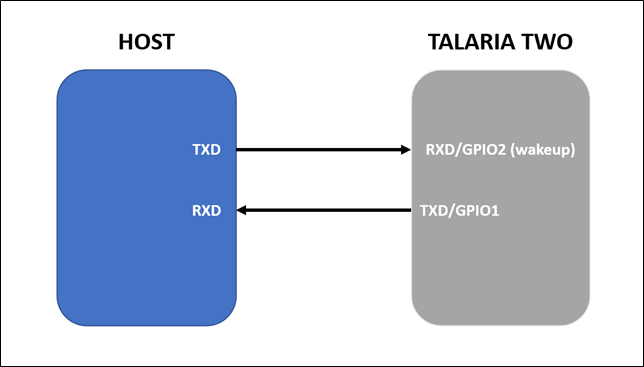
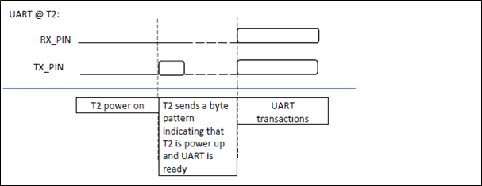
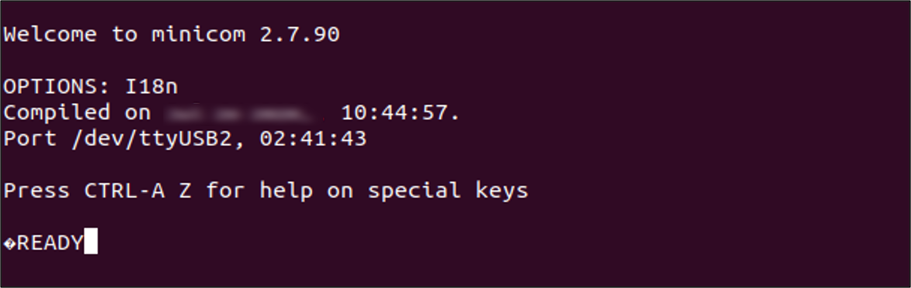
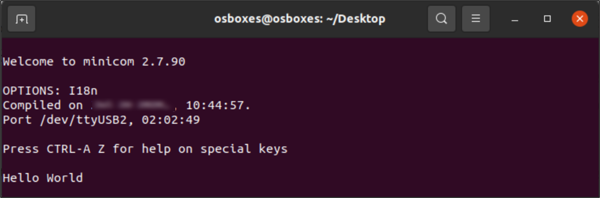
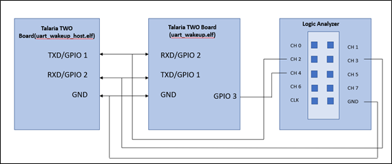
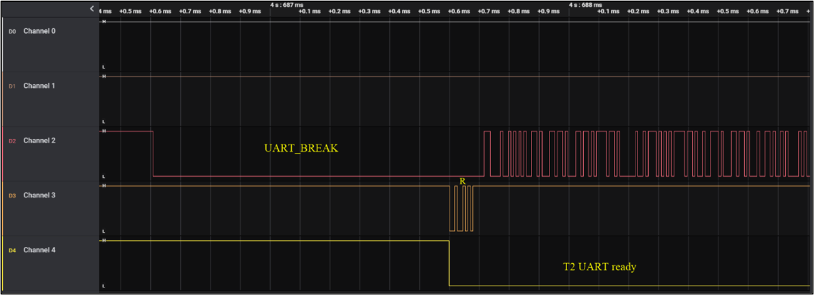
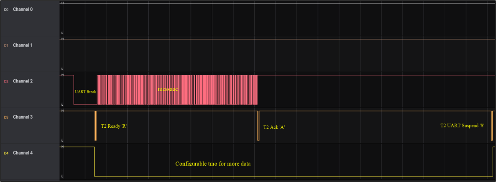

.. _ex low power uart:

Low Power UART
-----------------------

The Talaria TWO device contains one high performance UART which can
handle bitrates up to 2.4Mbps. This document describes using the UART
with the help of UART APIs provided as part of the SDK.

Current scope of this document is limited to 2-wire UART with software
flow control.

|image137|

.. rst-class:: imagefiguesclass
Figure 1: Talaria TWO device and HOST device serial communication
diagram

The following sample application code and script are included with this
application note:

.. table:: Table 1: List of files included in the application note

   +------------+---------------------------------------------------------+
   | **File**   | **Description**                                         |
   +============+=========================================================+
   | uart_tx.c  | Sample Talaria TWO application describing the procedure |
   |            | to send data on serial port using UART                  |
   +------------+---------------------------------------------------------+
   | uart_rx.c  | Sample Talaria TWO application describing the procedure |
   |            | to read data on serial port using UART                  |
   +------------+---------------------------------------------------------+
   | uar        | Sample Talaria TWO application describing sleep/wakeup  |
   | t_wakeup.c | procedure                                               |
   +------------+---------------------------------------------------------+
   | uart       | Sample HOST side implementation to wake Talaria TWO     |
   | _wakeup.py | from sleep                                              |
   +------------+---------------------------------------------------------+

Basic Usage of UART
~~~~~~~~~~~~~~~~~~~~~~~~~~~~~~~~~

This section provides a quick introduction to the UART APIs and
describes communication with the host. For a comprehensive description
of all the APIs, refer to section 7.

Opening the Serial Port
~~~~~~~~~~~~~~~~~~~~~~~~~~~~~~~~~

Before opening a serial port, a handler must first be allocated.

.. code:: shell

      struct uart \*handle;   

Once the UART handler is available, serial port can be opened using two
different functions:

1. uart_open – Opens serial port using default PINs and configured baud
   rate.

.. code:: shell

      handle = uart_open(baudrate);  

2. uart_open_ex – Opens the serial port using the configured baud rate,
   TXD, and RXD PINs.

.. code:: shell

      #define TXD_PIN 1 
      #define RXD_PIN 2 
      … 
      int baudrate = 115200; 
      handle = uart_open_ex(baudrate, TXD_PIN, RXD_PIN, 0); 

..

   Here, we configure the UART at a baud rate of 115200, GPIO1 as the
   TXD pin, and GPIO2 as the RXD pin.

Closing the Serial Port
~~~~~~~~~~~~~~~~~~~~~~~~~~~~~~~~~

uart_close is used to close the serial port.

.. code:: shell

      uart_close(handle);         

Transmitting a Single Character 
~~~~~~~~~~~~~~~~~~~~~~~~~~~~~~~~~

uart_putchar is used to transmit a single character.

.. code:: shell

      char c = ‘z’; 
      … 
      uart_putchar(handle, c); 

Transmitting a String
~~~~~~~~~~~~~~~~~~~~~~~~~~~~~~~~~

uart_puts is used to transmit a string.

.. code:: shell

      const char *message = ”Hello”; 
      … 
      uart_puts(handle, message); 

Receiving (Blocking)
~~~~~~~~~~~~~~~~~~~~~~~~~~~~~~~~~

uart_getchar is used to read a character from the serial port. This
function call blocks until a byte is read.

.. code:: shell

      int c = uart_getchar(handle);     

Receiving (Blocking with Timeout)
~~~~~~~~~~~~~~~~~~~~~~~~~~~~~~~~~

uart_getchar_tmo is used to read a character from the serial port with a
timeout. This function call blocks until a byte is read or it times out.

.. code:: shell

      int c = uart_getchar_tmo(h, 1000000); //1s sec timeout 
      if (c == -1) //uart_getchar_tmo returns -1 on timeout 
      break; 
      else 
      os_printf("%d_", c); 

Register Event Callback (called when Talaria TWO wakes from sleep)
~~~~~~~~~~~~~~~~~~~~~~~~~~~~~~~~~

.. code:: shell

      static void __irq 
      handle_event(struct uart *u, enum uart_event type, void *priv) 
      { 
      //do stuff here 
      } 
      … 
      int main() 
      { 
      … 
      uart_set_event_callback(handle, handle_event, NULL); 
      } 

Register Callback (called when special character is received)
~~~~~~~~~~~~~~~~~~~~~~~~~~~~~~~~~

.. code:: shell

      const char special = ‘z’; 
      … 
      static void uart_cb(void) 
      { 
      //do stuff here 
      } 
      … 
      int main() 
      { 
      uart_set_callback(handle, uart_cb, special); 
      }

Recommended Protocol for 2-wire UART
~~~~~~~~~~~~~~~~~~~~~~~~~~~~~~~~~

Since 2-wire UART has no hardware flow control, a software protocol is
recommended in this section.

Power-ON
~~~~~~~~~~~~~~~~~~~~~~~~~~~~~~~~~

1. After powering ON Talaria TWO, UART initialization is completed with
   required baud rate.

2. Talaria TWO then sends a known byte pattern to the host indicating
   the readiness for UART transactions as illustrated in Figure 2.

..

|image138|

.. rst-class:: imagefiguesclass
Figure 2: Recommended Talaria TWO protocol for power-ON case

UART APIs
~~~~~~~~~~~~~~~~~~~~~~~~~~~~~~~~~

1.  uart_open – Opens UART port.

2.  uart_close – Closes UART port.

3.  uart_getchar - Reads the next character from UART. If no character
    is available, the function will block the calling thread until a
    character arrives in UART.

4.  uart_getchar_tmo – Reads the next character from the UART. If no
    character is available, the function will block the calling thread
    until either timeout occurs or a character arrives in UART.

5.  uart_putchar – Write one character to UART.

6.  uart_puts - Write a string to UART.

7.  uart_flush – Flushes the output buffer.

8.  uart_open_ex – Opens UART port with extended parameters.

9.  uart_set_event_callback – Enables callback on events described by
    the enum uart_event.

10. uart_set_callback – Enables callback, when a certain character is
    entering the UART. This callback is executed in interrupt context.

11. uart_suspend_enable – Enables sleep mode.

12. os_gpio_request – Allocates and sets up PINs as GPIO.

13. os_gpio_set_output – Sets up GPIO PINs for output.

14. os_gpio_set_pin – Sets the specified GPIO PINs.

15. os_gpio_clr_pin – Clears the specified GPIO PINs.

16. uart_getchar_tmo – Reads one character from the serial port, with
    timeout.

17. uart_putchar – Writes one character to the serial port.

UART-RX 
~~~~~~~~~~~~~~~~~~~~~~~~~~~~~~~~~

Code Walkthrough 
~~~~~~~~~~~~~~~~~

uart_rx.c is used to read data on serial port using UART. This receives
the character sent from the host device to Talaria TWO through the UART.
Data will be printed on the console which can be used to verify the
working of the application.

struct uart is an opaque object representing the UART. This function
will initialize and allocate buffer space for the UART functions.

.. code:: shell

      struct uart \*handle;   

The function will return a pointer to an opaque object which is used as
a handle in subsequent calls to the UART functions. It opens the serial
port using baud rate 921600.

.. code:: shell

      handle = uart_open(921600);
      if (handle == NULL) 
      return 1; 

uart_puts() function writes the null terminated string pointed to by str
to the serial port. The terminating null byte ('\\0') will not be
written.

.. code:: shell

      int c = uart_getchar_tmo(handle, 1000000);  

uart_getchar_tmo() function reads the next character from the serial
port. If no character is available, the function will block the calling
thread with timeout. Here, the timeout is 1 second.

.. code:: shell

      if(c !=-1)
            os_printf("%c", c);

uart_close() function closes the serial port and releases the memory
claimed by the uart_open() call. Any characters left in the output
buffers will be discarded.

.. code:: shell

      uart_close(handle);   

Running the Application 
~~~~~~~~~~~~~~~~~~~~~~~~

**Note**: All applicable ELFs are available in the FreeRTOS SDK package
at: *freertos_sdk_x.y\\examples\\lp_uart\\bin*.

Program uart_rx.elf () using the Download tool:

1. Launch the Download tool provided with InnoPhase Talaria TWO SDK.

2. In the GUI window:

   a. Boot Target: Select the appropriate EVK from the drop-down

   b. ELF Input: Load the uart_rx.elf by clicking on Select ELF File.

   c. Programming: Prog RAM or Prog Flash as per requirement.

For more details on using the Download tool, refer to the document:
UG_Download_Tool.pdf (path:
*freertos_sdk_x.y\\pc_tools\\Download_Tool\\doc*).

Expected Output
~~~~~~~~~~~~~~~

uart_rx console output:

.. code:: shell

      Y-BOOT 208ef13 2019-07-22 12:26:54 -0500 790da1-b-7
      ROM yoda-h0-rom-16-0-gd5a8e586
      FLASH:PNWWWAE
      Build $Id: git-6e0f116 $
      Flash detected. flash.hw.uuid: 39483937-3207-0083-00a1-ffffffffffff
      $App:git-e8cee79
      SDK Ver: FREERTOS_SDK_1.0
      Lpuart Rx Demo App
      Starting uart_rx_thread

Open a minicom terminal with a baud rate of 921600, with no hardware
flow control and add the serial device.

Once the minicom starts, reset Talaria TWO which displays the output
string.

|image139|

.. rst-class:: imagefiguesclass
Figure 3: UART - RX Minicom Output

UART-TX
~~~~~~~~~~~~~~~~~~~~~~~~~~~~~~~~~

.. _code-walkthrough-1:

Code Walkthrough
~~~~~~~~~~~~~~~~

The uart_tx.c is used to send data on serial port using UART. This
transmits a string of data "Hello world" from Talaria TWO to host
through the UART.

The struct uart opaque object represents the UART. This function will
initialize and allocate buffer space for the UART functions.

.. code:: shell

      struct uart \*handle;  

The function will return a pointer to an opaque object that is used as a
handle in subsequent calls to the UART functions. It opens the serial
port using baud rate 921600.

.. code:: shell

      handle = uart_open(921600);
      if (handle == NULL)
      return 1;

This function will write the null terminated string pointed to by str to
the serial port. The terminating null byte ('\\0') will not be written.

.. code:: shell

      uart_puts(handle, "Hello World\\n");      

uart_flush()calls the thread until all characters currently buffered for
output have been written to the serial port.

.. code:: shell

      uart_flush(handle);  

The uart_close() function closes the serial port and releases the memory
claimed by the uart_open() call.

.. code:: shell

      uart_close(handle);   

.. _running-the-application-1:

Running the Application 
~~~~~~~~~~~~~~~~~~~~~~~~

Program uart_tx.elf using the Download tool:

1. Launch the Download tool provided with InnoPhase Talaria TWO SDK.

2. In the GUI window:

   a. Boot Target: Select the appropriate EVK from the drop-down

   b. ELF Input: Load the uart_tx.elf by clicking on Select ELF File.

   c. Programming: Prog RAM or Prog Flash as per requirement.

.. _expected-output-1:

Expected Output
~~~~~~~~~~~~~~~

uart_tx console output:

.. code:: shell

      Y-BOOT 208ef13 2019-07-22 12:26:54 -0500 790da1-b-7
      ROM yoda-h0-rom-16-0-gd5a8e586
      FLASH:PNWWWAE
      Build $Id: git-6e0f116 $
      Flash detected. flash.hw.uuid: 39483937-3207-0083-00a1-ffffffffffff
      $App:git-e8cee79
      SDK Ver: FREERTOS_SDK_1.0
      Lpuart Tx Demo App

Open a minicom terminal with a baud rate of 921600, with no Hardware
flow control and add the serial device.

Once the minicom starts, reset the Talaria TWO device which displays the
output string.

|image140|

.. rst-class:: imagefiguesclass
Figure 4: UART – TX Minicom Output

UART Suspend/Wakeup
~~~~~~~~~~~~~~~~~~~~~~~~~~~~~~~~~

.. _code-walkthrough-2:

Code Walkthrough
~~~~~~~~~~~~~~~~

uart_wakeup.c

The sample application uart_wakeup.c shows a basic implementation of
UART suspend/wakeup using UART_BREAK signal.

This section describes the state of the UART, whether the link is up or
down.

.. code:: shell

    enum uart_link_state {
    UART_LINK_UP = 0,
    UART_LINK_DOWN,
    } link

handle_event() handles the UART events and checks if the type is
UART_EVENT_WAKEUP. If yes, then the uart_status will be set to UART_WAKE
until suspend state is enabled.

.. code:: shell

      static void __irq
      handle_event(struct uart *h, enum uart_event type, void *priv)
      {
          if (type == UART_EVENT_WAKEUP)
          {
              pr_always("UART_EVENT_WAKEUP\n");
              uart_status=UART_WAKE;
              struct uart_wakeup_msg *msg
                  = (struct uart_wakeup_msg *)osal_alloc(sizeof(*msg));
              msg->event = APP_MSG_AWAKE_UART;
              xQueueSendFromISR(uart_event_queue, (void *)&msg, NULL);
          }
      }

os_gpio_request() API requests the pins and configures the pin as GPIO,
os_gpio_set_output() API configures the GPIO pins as digital output
pins, os_gpio_clr_pin() is used to clear the specified GPIO pins,
os_gpio_set_pin() is used to set the GPIO high and os_gpio_clr_pin() is
used to set GPIO low.

.. code:: shell

      void app_main(void *arg)
      {
          uint32_t ulValue, recv_status;
          struct uart_wakeup_msg *msg = NULL;
          os_gpio_request(sig_pin);
          os_gpio_set_output(sig_pin);
          uart_suspend_enable(u);
          while (1) {
      
              os_gpio_set_pin(sig_pin);
              /* blocking. */
              recv_status
                  = xQueueReceive(uart_event_queue, &ulValue, portMAX_DELAY);
              os_gpio_clr_pin(sig_pin);
      
              if (0 == recv_status)
                  continue;
              msg = (struct uart_wakeup_msg *)ulValue;
              if (msg->event == APP_MSG_AWAKE_UART) {
              {
                  if(uart_status != UART_INACTIVE)
                  {
                      int c = uart_getchar_tmo(u, UART_TMO_CLR); // read and drop garbage byte
      
                      rx_ready = true;
                      uart_putchar(u, 'R'); // can be used for syncing
                      
                      while(rx_ready)
                      {
                          c = uart_getchar_tmo(u, UART_TMO_FIRST_BYTE); //first byte may take a while depending on when the event gets triggered
                          while(c!=-1)
                          {
                              /** 
                               * We look for '*' to signify end of message. 
                               * Ideally the HOST and T2 would use an agreed upon protocol to determine length and validity of packet from HOST
                              **/
                              if((char)c == '*')
                              {
                                  uart_putchar(u, 'A');
                                  
                              }
                              c = uart_getchar_tmo(u, UART_TMO_BYTE);
                          }
      
                          // process message here
                          
                          // wait and check if HOST plans to send more packets
                          c = uart_getchar_tmo(u, UART_TMO_EXTENDED); //should catch the break
                          if(c == -1)
                          {
                              //no additional packet/s
                              rx_ready = false;
                          }
      
                      }
                      uart_putchar(u, 'S');
                      pr_always("uart_suspend_enable\n");
                      uart_suspend_enable(u);
                      uart_status=UART_INACTIVE;
                  }
              }
              osal_free(msg);        
          }
      }

wcm_create()API from the Wi-Fi Connection Manager is used to connect to
a Wi-Fi network. Initially, the Wi-Fi network interface is created using
wcm_create().

wifi_connect_to_network()API, from components library, connects to the
Wi-Fi network using the AP credentials provided.

.. code:: shell

        /*Create a Wi-Fi network interface*/
          wcm_handle = wcm_create(NULL);
      
          /* Read the configuration and connect to desired network */
          rval = wifi_connect_to_network(&wcm_handle, WCM_CONN_WAIT_INFINITE, &wcm_connected);
          if(rval < 0) {
              os_printf("\nError: Unable to connect to network\n");
              return 0;
          }
      
          if(wcm_connected != true) {
              os_printf("\nCouldn't Connect to network ");    
              wcm_disconnect(wcm_handle);
          }

uart_wakeup_host.c

The sample application uart_wakeup_host.c shows implementation of a HOST
MCU which can wakeup Talaria TWO using UART.

A serial port with a baud rate of 115200 is opened using uart_open().

**Single Packet Test**:

Single packet test prints the errors along with the 1000 packets.

Pins and GPIOs are used to emulate a long UART_BREAK signal. Here
uart_getchar_tmo() reads one character “R” from the serial port which
indicates Ready. If no character is available, the function will block
the calling thread until timeout occurs.

Host will again wait for Talaria TWO to echo back the last end sync
character which is the acknowledgement “A” packet.

.. code:: shell

      u = uart_open(115200);
      int count = 0;
      int errors = 0;
      int packets = 1000;
      char count_buffer[32];
      bool retransmit = false;
      
      os_printf("Single packet test\n");
      while(count < packets)
      {
          //Use pin ad GPIO to emulate a long UART_BREAK signal
          int tx_pin = 1 << TX_PIN;
          os_gpio_set_mode(tx_pin, GPIO_MODE);
          os_gpio_request(tx_pin);
          os_gpio_set_output(tx_pin);
          os_gpio_clr_pin(tx_pin);
          vTaskDelay(1);
          os_gpio_set_pin(tx_pin);
          os_gpio_set_input(tx_pin);
          os_gpio_set_mode(tx_pin, GPIO_FUNCTION_MODE);
          os_gpio_free(tx_pin);
      while(1)
        {
            //Wait for ready 'r' from T2
            int sync = uart_getchar_tmo(u, 1000);
            if(sync == -1)
            {
              break;
            }
            else if((char)sync == 'R')
            {
              if(retransmit)
              {
                errors++;
                os_printf("retransmitting!!!\n");
              }
              memset(count_buffer, 0, 32);
              sprintf(count_buffer, "count: %d\n", count);
              uart_write((void*)msg1, strlen(msg1));
              uart_write((void*)msg2, strlen(msg2));
              uart_write((void*)count_buffer, strlen(count_buffer));
              uart_write((void*)msg4, strlen(msg4)); //send end sync char '*'
              uart_flush(u);
              //Wait for T2 to echo back the last end sync char '*'
              sync = uart_getchar_tmo(u, 2000);
              retransmit = true;
              while(sync != -1)
              {
                if(sync == 'A')
                {
                  retransmit = false;
                  count++;
                  break;
                }
                sync = uart_getchar_tmo(u, 2000);
              }
              break;
            }
          }
      if(!retransmit)
        {
            vTaskDelay(50);
          }
        }
        os_printf("%d errors to send %d packets\n", errors, packets);

**Multiple Packet Test**:

Multiple packet test prints the errors along with the 1000 packets.

PINs and GPIOs are used to emulate a long UART_BREAK signal. Here
uart_getchar_tmo() reads one character “R” from the serial port which
indicates Ready. If no character is available, the function will block
the calling thread until timeout occurs.

Host will again wait for Talaria TWO to echo back the last end sync
character which is the acknowledgement “A” packet.

.. code:: shell

      count = 0;
        os_printf("Multi packet test\n");
        while(count < packets)
        {
          //Use pin ad GPIO to emulate a long UART_BREAK signal
          int tx_pin = 1 << TX_PIN;
          os_gpio_set_mode(tx_pin, GPIO_MODE);
          os_gpio_request(tx_pin);
          os_gpio_set_output(tx_pin);
          os_gpio_clr_pin(tx_pin);
          vTaskDelay(1);
          os_gpio_set_pin(tx_pin);
          os_gpio_set_input(tx_pin);
          os_gpio_set_mode(tx_pin, GPIO_FUNCTION_MODE);
          os_gpio_free(tx_pin);
          
      
          while(1)
          {
            //Wait for ready 'r' from T2
            int sync = uart_getchar_tmo(u, 1000);
            if(sync == -1)
            {
              break;
            }
            else if((char)sync == 'R')
            {
              if(retransmit)
              {
                errors++;
                os_printf("retransmitting!!!\n");
              }
              memset(count_buffer, 0, 32);
              sprintf(count_buffer, "count: %d\n", count);
              uart_write((void*)msg1, strlen(msg1));
              uart_write((void*)msg2, strlen(msg2));
              uart_write((void*)count_buffer, strlen(count_buffer));
              uart_write((void*)msg4, strlen(msg4)); //send end sync char '*'
              uart_flush(u);
      
              //Wait for T2 to echo back the last end sync char '*'
              sync = uart_getchar_tmo(u, 2000);
              retransmit = true;
              while(sync != -1)
              {
                if(sync == 'A')
                {
                  retransmit = false;
                  count++;
                  break;
                }
                sync = uart_getchar_tmo(u, 2000);        }

Using PINs and GPIOs emulate a long UART_BREAK signal and send the
second packet before Talaria TWO UART goes into suspend state.
uart_flush() and uart_close() are used to empty the output buffers
before closing.

.. code:: shell

      vTaskDelay(5);
      // send second packet before T2 UART goes into suspend
      //Use pin ad GPIO to emulate a long UART_BREAK signal
              tx_pin = 1 << TX_PIN;
              os_gpio_set_mode(tx_pin, GPIO_MODE);
              os_gpio_request(tx_pin);
              os_gpio_set_output(tx_pin);
              os_gpio_clr_pin(tx_pin);
              vTaskDelay(1);
              os_gpio_set_pin(tx_pin);
              os_gpio_set_input(tx_pin);
              os_gpio_set_mode(tx_pin, GPIO_FUNCTION_MODE);
              os_gpio_free(tx_pin);
              
              memset(count_buffer, 0, 32);
              sprintf(count_buffer, "count: %d\n", count);
              uart_write((void*)msg1, strlen(msg1));
              uart_write((void*)msg2, strlen(msg2));
              uart_write((void*)count_buffer, strlen(count_buffer));
              uart_write((void*)msg4, strlen(msg4)); //send end sync char '*'
              uart_flush(u);
      //Wait for T2 to echo back the last end sync char '*'
              sync = uart_getchar_tmo(u, 2000);
              retransmit = true;
              while(sync != -1)
              {
                if(sync == 'A')
                {
                  retransmit = false;
                  count++;
                  break;
                }
                sync = uart_getchar_tmo(u, 2000);
      
              }
              break;
            }
          }
          if(!retransmit)
          {
            vTaskDelay(50);
          }
        }
        os_printf("%d errors to send %d packets\n", errors, packets);
        /* Make sure the output buffers are empty before closing. */
        uart_flush(u);
        uart_close(u);
        return 0;
      }

Hardware Connection 
~~~~~~~~~~~~~~~~~~~~

Using two Talaria TWO boards and a logic analyzer make the connection
using the required wires and breadboard as shown in Figure 5.

|image141|

.. rst-class:: imagefiguesclass
Figure 5: UART suspend/wakeup - hardware connection

.. _running-the-application-2:

Running the Application 
~~~~~~~~~~~~~~~~~~~~~~~~

Program uart_wakeup_host.elf and uart_wakeup.elf onto Talaria TWO boards
using the Download tool:

1. Launch the Download Tool provided with InnoPhase Talaria TWO SDK.

2. In the GUI window:

   a. Boot Target: Select the appropriate EVK from the drop-down

   b. ELF Input: Load uart_wakeup_host.elf and uart_wakeup.elf by
      clicking on Select ELF File.

   c. AP Options: Pass the appropriate SSID and passphrase to connect to
      an Access Point for uart_wakeup.elf.

   d. Programming: Prog RAM or Prog Flash as per requirement.

.. _expected-output-2:

Expected Output
~~~~~~~~~~~~~~~

Once the hardware connection is complete as described in section 7.3.2,
flash Talaria TWO boards with uart_wakeup_host.elf and uart_wakeup.elf .
Simultaneously reset on Talaria TWO’s GUI or press the hard reset button
on Talaria TWO boards and observe the following console outputs:

uart_wakeup.elf:

.. code:: shell

      Y-BOOT 208ef13 2019-07-22 12:26:54 -0500 790da1-b-7
      ROM yoda-h0-rom-16-0-gd5a8e586
      FLASH:PNWWWWWWWAE
      Build $Id: git-6e0f116 $
      Flash detected. flash.hw.uuid: 39483937-3207-0083-00a1-ffffffffffff
      Bootargs: np_conf_path=/data/nprofile.json ssid=tplinkc6_iop passphrase=InnoQA2023$
      Sleep wakeup Test
      $App:git-894dc59
      SDK Ver: FREERTOS_SDK_1.0
      UART Wakeup
      addr e0:69:3a:00:15:b0
      
      Connecting to added network : tplinkc6_iop
      [0.868,199] CONNECT:10:27:f5:7d:e8:74 Channel:9 rssi:-27 dBm
      wcm_notify_cb to App Layer - WCM_NOTIFY_MSG_LINK_UP
      [1.071,828] MYIP 192.168.0.146
      [1.071,877] IPv6 [fe80::e269:3aff:fe00:15b0]-link
      wcm_notify_cb to App Layer - WCM_NOTIFY_MSG_CONNECTED
      wcm_notify_cb to App Layer - WCM_NOTIFY_MSG_ADDRESS
      
      Connected to added network : tplinkc6_iop
      
      os_suspend_enable
      os_suspend_enable
      [46.813,497] UART_EVENT_WAKEUP
      [46.825,104] uart_suspend_enable
      [46.825,282] UART_EVENT_WAKEUP
      [46.837,110] uart_suspend_enable
      [46.837,287] UART_EVENT_WAKEUP
      [46.849,113] uart_suspend_enable
      [46.849,292] UART_EVENT_WAKEUP
      [46.861,120] uart_suspend_enable
      [46.861,297] UART_EVENT_WAKEUP
      [46.873,123] uart_suspend_enable
      [46.873,303] UART_EVENT_WAKEUP
      [46.885,127] uart_suspend_enable
      [46.885,308] UART_EVENT_WAKEUP
      [46.897,131] uart_suspend_enable
      [46.897,313] UART_EVENT_WAKEUP
      [46.909,135] uart_suspend_enable
      [46.909,318] UART_EVENT_WAKEUP
      [46.921,139] uart_suspend_enable
      [46.921,323] UART_EVENT_WAKEUP
      [46.933,145] uart_suspend_enable
      [46.933,328] UART_EVENT_WAKEUP
      [46.945,148] uart_suspend_enable
      [46.945,334] UART_EVENT_WAKEUP
      [46.957,161] uart_suspend_enable
      [46.957,339] UART_EVENT_WAKEUP
      [46.969,164] uart_suspend_enable
      [46.969,344] UART_EVENT_WAKEUP
      [46.981,168] uart_suspend_enable
      [46.981,349] UART_EVENT_WAKEUP
      [46.993,172] uart_suspend_enable
      [46.993,354] UART_EVENT_WAKEUP
      [47.005,176] uart_suspend_enable
      [47.005,359] UART_EVENT_WAKEUP
      [47.017,182] uart_suspend_enable
      [47.017,365] UART_EVENT_WAKEUP
      [47.029,185] uart_suspend_enable
      [47.029,370] UART_EVENT_WAKEUP
      [47.041,189] uart_suspend_enable

uart_wakeup_host.elf:

.. code:: shell

      Y-BOOT 208ef13 2019-07-22 12:26:54 -0500 790da1-b-7
      ROM yoda-h0-rom-16-0-gd5a8e586
      FLASH:PNWWWWAE
      Build $Id: git-6e0f116 $
      Flash detected. flash.hw.uuid: 39483937-3207-0083-00a1-ffffffffffff
      Single packet test
      0 errors to send 1000 packets
      Multi packet test
      0 errors to send 1000 packets

Following output is observed on the logic analyzer:

The UART interface on Talaria TWO can be placed in suspend mode while
  there is no UART activity between Talaria TWO and Host.
To wake up Talaria TWO from sleep and re-enable the UART interface,
  the Host needs to send the UART_BREAK signal for a minimum duration of
  1ms.

|image142|

.. rst-class:: imagefiguesclass
Figure 6: UART suspend/wakeup - Wakeup from UART_BREAK

uart_wakeup example follows the subsequent protocol:

1. HOST sends break.

2. Talaria TWO wakes up and takes UART out of SUSPEND. Talaria TWO sends
   a byte ‘R’ to inform the Host that UART interface is ready.

3. Host (optionally) waits for ~1ms or ‘R’ and then sends data.

4. Talaria TWO receives the data.

..

   Note: Talaria TWO performs error checking and lets the Host know if
   re-transmit is required.

a. Talaria TWO can determine whether the Host is done sending either by
   a timeout or similar protocol.

b. Talaria TWO sends an acknowledgement byte ‘A’ after validating the
   packet.

c. Talaria TWO optionally waits (~10 ms) for more incoming packets.

5. Talaria TWO sends a byte ‘S’ to the Host to inform the Host that the
   UART is entering SUSPEND state.

|image143|

.. rst-class:: imagefiguesclass
Figure 7: Wakeup from UART_BREAK and IPC communication with HOST

