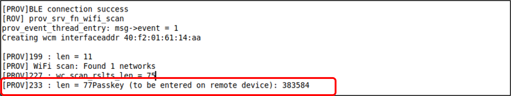

.. _ex prov:

Provisioning
--------------------

This application note demonstrates the use of APIs to create a
provisioning application using BLE as the mode of transferring
provisioning data. A reusable module is provided for provisioning the
device in the following location: *freertos_sdk_x.y\\components\\prov*.
The code in this sample application can be used in any user application
to use the provisioning feature.

For more information regarding the module and the APIs, refer:
*prov_apiref.pdf*.

Topology
========

|image144|

Figure 1: Topology

List of APIs
============

1. prov_start(): Initializes and starts the Provisioning service.

2. prov_conf_param_str_get(): Gets the configuration parameters of type
   string.

3. prov_conf_param_int_get(): Gets the configuration parameter of type
   integer.

4. prov_is_provisioned(): Checks if the device is provisioned at least
   once.

5. wcm_create(): Creates a Wi-Fi network interface.

6. wcm_add_network_profile(): Adds a network profile to WCM.

7. wcm_auto_connect(): Starts or stops auto connect.

8. wcm_notify_enable(): Enables callbacks of link and IP address
   changes.

Functionality overview
======================

Provisioning module exposes states and data through Provisioning
service. Each state and data are provided through respective
characteristics.

Following are a list of states and data exposed using the Provisioning
Service:

1. Connection state: Wi-fi connection state

2. Connect: Connect to the configured Wi-Fi N/w

3. Scan state: Wi-Fi Scanning state

4. Scan: Trigger scan

5. Scan results: Scan results

6. Conf data: Configuration data. This data can be read from and writen
   to configuration file (currently it is: /root/part.json file)

7. Reset: Device reset

8. SSID: Configure SSID

9. Passphrase: Configure Passphrase

These states and data can be used by the Provisioning application
(application running on a smart device) in various combination.

Following are the list of activities that can be executed by
Provisioning application using these states and data:

1. Trigger scan and get scan results:

Wi-Fi scan can be triggered by setting the “Scan” state. This will
trigger the Wi-Fi scan and scan results are stored in the internal
buffer in Talaria TWO. After setting the “Scan”, the application needs
to poll the “Scan state”. When the Scan state becomes 2, scan results
are ready to be read. At this point read “scan results”.

2. Get configuration data:

Configuration data can be acquired by reading the “Conf data”. This is
the entire content of the configuration file.

3. Write Configuration Data:

After changing the required configuration parameters, configuration data
can be written back(stored) to Talaria TWO by writing “Conf data”. The
updated data is stored back in the configuration file in root fs.

4. Check connectivity:

Once the configuration data is written(Provisioning is done), Wi-Fi
connectivity can be checked for. Setting “Connect” will trigger the
same.

5. SSID and Passphrase can be configured without getting the full
   configuration data. These parameters can be written using “ssid” and
   “passphrase”.

One way to provision is to change the SSID and Passphrase by writing to
“ssid” and “passphrase” characteristics. If any more parameters needs to
be changed, the following procedure needs to be followed:

Another way to provision the device would be to get the config data file
content, change the required parameters and write it back. Additionally,
before changing the config parameter like SSID, user can select the
network from the SSID list in the scan results. After provisioning,
connectivity check can also be done.

Either one of the mentioned methods/procedures need to be followed to
provision the device.

Data Exchange Formats
=====================

Scan Data
---------

This data is sent from Talaria TWO to the Provisioning application when
“scan results” is read.

Format:

.. code:: shell

      <Length of the scan data – 4 bytes>< Scan Data …>   

Scan data format:

Scan data is in the json format with one or more elements. Each element
of the array gives SSID, BSSID and the channel for a discovered network.

.. code:: shell

      { "result": [ {"ssid":<ssid string>", "bssid":"<bssid string>", "channel":<channel num str>}…….]}

Configuration Data Format
-------------------------

Configuration data is the content of part.json file. It is sent from
Talaria TWO to the Provisioning application and vice versa in the
following format:

.. code:: shell

      <Length of the config data – 4 bytes>< Config Data …>   

Configuration data is currently stored in part.json file. Hence, when
the read operation is executed on this characteristic, whole of the
part.json file content is sent as is. The configuration parameters are
stored in this file between bootargs_start and bootargs_end. The
Provisioning application changes the required parameters and sends the
entire file content back. At Talaria TWO, the file is overwritten with
new data.

Ensure that the “provisioned” is set to 1 in the updated configuration
data.

Following is the basic content of part.json file:

.. code:: shell

      {
        "image"   : [
          {
            "name"  : "fota",
            "version" : "1.0",
            "start_sector"  : 32,
            "bootargs_start": 1,
            "ssid" : "inno_test",
            "passphrase" : "1234567890",
            "bootargs_end" : 1
          },
          {
            "name"  : "test_app",
            "version" : "1.0",
            "start_sector"  : 154,
            "bootargs_start": 1,
            "ssid" : "inno_test",
            "passphrase" : "1234567890",
            "bootargs_end" : 1
          }
          ],
          "provisioned" : 0,
          "baudrate"    : 2560000,
          "timeout" : 0,
          "verbose" : 1
      }

Provisioning Profile
=====================

Provisioning profile has one service and multiple characteristics. The
service name is configurable. The following sections provide information
about the provisioning service and the characteristics.

Service
-------

Service UUID:

.. code:: shell

      11111111-1111-1111-1111111111111111  

Service name:

Configurable. Default is "Inno_Provisioning".

Characteristics
---------------

1. Connection state:

   1. UUID: 0xAB30

   2. Properties: Read

   3. Description: Gives the current state of Wi-Fi connection of
      Talaria TWO

   4. Potential Values:

.. table:: Table 1: Potential values of the connection state

+--------------------------+-------------------------------------------+
| **Value**                | **Description**                           |
+==========================+===========================================+
| Failure                  | Unable to connect to the provisioned      |
|                          | Wi-Fi network                             |
+--------------------------+-------------------------------------------+
| Success                  | Connected                                 |
+--------------------------+-------------------------------------------+
| Waiting                  | Connection in Progress                    |
+--------------------------+-------------------------------------------+

2. Connect:

   1. UUID: 0xAB31

   2. Properties: Write

   3. Description: When written, any 1-byte value (just typing 1), will
      trigger the Wi-Fi connect using the configured SSID and
      passphrase.

3. Scan State

   1. UUID: 0xAB32

   2. Properties: Read

   3. Description: Gives the current state of the Wi-Fi scanning
      activity

   4. Potential Values:

.. table:: Table 2: Potential values of the scan state

+--------------------+-------------------------------------------------+
| **Value**          | **Description**                                 |
+====================+=================================================+
| 0                  | Not Scanning                                    |
+--------------------+-------------------------------------------------+
| 1                  | Scanning Complete                               |
+--------------------+-------------------------------------------------+
| 2                  | Scanning in Progress                            |
+--------------------+-------------------------------------------------+

4.  Scan:

    1. UUID: 0xAB33

    2. Properties: Write

    3. Description: When any 1-byte value is written (just typing 1),
       will trigger Wi-Fi scan. The scan results are stored internally
       but are not sent.

5.  Scan Results:

    1. UUID: 0xAB34

    2. Properties: Read

    3. Description: When read, the scan results are sent from Talaria
       TWO to the Provisioning application. The format of the scan
       results are as provided in section: *Scan Data*. Provisioning
       application may have to read multiple times to get the full data.

6.  Configuration data:

    1. UUID: 0xAB35

    2. Properties: Read/Write

    3. Description: When read, configuration data is sent from Talaria
       TWO to the Provisioning application. The format of the scan
       results is as provided in section: *Scan Data*. Provisioning
       application may have to read multiple times to get the full data.

7.  Apply and Reset

    1. UUID: 0xAB36

    2. Properties: Write

    3. Description: When 1 is written, the configuration will be applied
       (stored into the configuration file) and the device is reset.

8.  Apply

    1. UUID: 0xAB37

    2. Properties: Write

    3. Description: When written with any 1-byte value, the
       configuration will be applied (stored into the configuration
       file).

9.  ssid

    1. UUID: 0xAB38

    2. Properties: Write

    3. Description: Write a maximum of 31 bytes of SSID.

10. passphrase

    1. UUID: 0xAB39

    2. Properties: Write

    3. Description: Write a maximum of 31 bytes of passphrase.

Code Walkthrough
================

Application Flow
----------------

In this application, provisioning is done over BLE, and the
configuration data is stored in the file system.

Following are the steps:

1. Initiate BLE provisioning by creating a GATT server.

2. Provision the SSID and passphrase by selecting the network from the
   SSID list created from scan results using the BLE Provisioning mobile
   app.

3. Store the configuration data.

4. Check Wi-Fi connectivity using the configured SSID and passphrase.

Sample Code Walkthrough
-----------------------

A user-defined data struct is created to store provisioning data.

.. code:: shell

      struct param_t {
          const char *ssid;
          const char *passphrase;
          const char *dummy;
      };

prov_start_prams_t and prov_cfg is the pointer to the data structure of
type prov_start_prams_t.

Provisioning method, device name, appearance, manufacturer name, user
callback and context pointer are passed to structure members of
prov_start_prams_t.

.. code:: shell

      if(0 == prov_is_provisioned()){
              /*Provisioning*/
              prov_start_prams_t prov_cfg = {0};
      
              prov_cfg.method = PROV_METHOD_BLE;
              prov_cfg.cb = app_prov_cb;
              /*"custparam" is configurable parameter present in part.json file
                provisioning module does not add this parametr bu default to the prov
                service. Need to add it exlicietly*/
              prov_custom_param_add(0xAA44, "custparam");
              prov_start(&prov_cfg);
              os_sem_wait(&app_lock);     }

prov_start API starts the provisioning service and prov_is_provisioned
checks if provisioning is complete. Here, the prov_conf_param_str_get
API is used to get the provisioning parameters such as SSID and
passphrase. These parameters are stored in user defined structure
param_t.

.. code:: shell

      /*if provisioning is done. use provisioned params*/
          if(prov_is_provisioned()){
              param.ssid = prov_conf_param_str_get("ssid");
              param.passphrase = prov_conf_param_str_get("passphrase");
              os_printf("\n[APP] %s %s", param.ssid, param.passphrase);  }

wcm_create()API creates a Wi-Fi network interface and connects to
network using provisioned parameters.

.. code:: shell

      wcm_handle = wcm_create(NULL);
          app_wcm_connect(wcm_handle, (char *)param.ssid, (char *)param.passphrase);
          if(!wcm_connect_success) {
              os_printf("\n[APP]Error: Failed to connect to WiFi N/w");
              goto exit;     }
          os_printf("\n[APP]Success: Connected to %s N/w", (char *)param.ssid);

Running the Application
========================

Write the Provisioning File into Talaria TWO Filesystem
-------------------------------------------------------

Using the Download Tool’s Write Files feature, write the file
(part.json) present in *freertos_sdk_x.y\\examples\\prov\\data* into
Talaria TWO filesystem.

This can be accomplished by using the option: Filesystem->Write Files
from a directory->(File Open Icon). Choose the directory
*sdk_x.y\\examples\\prov\\data* and click on Write Files option.

**Note**: To re-provision the application, write the files using the
procedure described above.

Programming Talaria TWO board with ELF
--------------------------------------

Program prov_app.elf (*examples\\prov\\bin\\prov_app.elf*) using the
Download tool.

1. Launch the Download tool provided with InnoPhase Talaria TWO SDK.

2. In the GUI window:

   a. Boot Target: Select the appropriate EVK from the drop-down.

   b. ELF Input: Load the prov_app.elf by clicking on Select ELF File.

   c. Programming: Click on Prog Flash.

..

   Once done, follow the instructions mentioned in section 7.3 to run
   the mobile

**Note**:

1. There is no requirement of boot arguments. User can run the
   application directly. On running the application, it creates a
   provisioning GATT server.

Running the Application using Android or iOS App
------------------------------------------------

1. Download and install the Android or iOS mobile application from the
   play/app store using the following links:

   a. **Android**:https://play.google.com/store/apps/details?id=com.innophase.provisioning&hl=en&gl=US

   b. **iOS**:
      https://apps.apple.com/in/app/ble-provisioning/id1627682345

..

|image145|

Figure 2: Android mobile app in play store

|image146|

Figure 3: iOS mobile app in app store

2. BLE Provisioning can be enabled via non-secure and secure BLE
   connections. Following are the three supported methods:

   a. Non-secure provisioning

   b. Secure Provisioning – Just Work Method

   c. Secure Provisioning – Passkey Method

3. Non-secure Provisioning

..

   On flashing prov_app.elf onto Talaria TWO using the Download Tool,
   the following console logs are observed.

   Talaria TWO console output:

.. code:: shell

      Y-BOOT 208ef13 2019-07-22 12:26:54 -0500 790da1-b-7
      ROM yoda-h0-rom-16-0-gd5a8e586
      FLASH:PWWWWWWAE
      Build $Id: git-2eebd42 $
      Flash detected. flash.hw.uuid: 39483937-3207-0080-0055-ffffffffffff
      Bootargs: prov_every_time=1
      
      
      Application Information:
      ------------------------
      Name       : Prov App
      Version    : 1.0
      Build Date : Sep  8 2023
      Build Time : 13:58:53
      Heap Available: 297 KB (304152 Bytes)
      
      [APP]Bootparams :
      --------------------
      ssid= <null>
      passphrase= <null>
      dummy= <null>
      secured_prov =0
      pass_key=0
      prov_every_time=1
      [APP]Bootparams end here....
      
      [PROV]prov_is_provisioned : val = 1
      	[PROV] bt_gap_init
      	[PROV] common_server_create: Inno_Provisioning InnophaseInc 0
      
      	[PROV] bt_gatt_create_service_128 ret = 0x000bf278
      	[PROV] Adding Characteristics 
      	[PROV] bt_gatt_add_service
      	[PROV] bt_gap_discoverable_mode, ret = 0

4. Secure Provisioning

..

   In case of secure BLE provisioning, flash the prov_app.elf onto
   Talaria TWO with the following boot arguments as applicable:

a. Just Work Method: secured_prov=1,pass_key=0, or

b. Passkey Method: secured_prov=1,pass_key=1

..

   Console output:

   **secured_prov=1, pass_key=0**

.. code:: shell

      Y-BOOT 208ef13 2019-07-22 12:26:54 -0500 790da1-b-7
      ROM yoda-h0-rom-16-0-gd5a8e586
      FLASH:PWWWWWWAE
      Build $Id: git-2eebd42 $
      Flash detected. flash.hw.uuid: 39483937-3207-0080-0055-ffffffffffff
      Bootargs: prov_every_time=1 secured_prov=1
      
      Application Information:
      ------------------------
      Name       : Prov App
      Version    : 1.0
      Build Date : Sep  8 2023
      Build Time : 13:58:53
      Heap Available: 297 KB (304152 Bytes)
      
      [APP]Bootparams :
      --------------------
      ssid= <null>
      passphrase= <null>
      dummy= <null>
      secured_prov =1
      pass_key=0
      prov_every_time=1
      [APP]Bootparams end here....
      
      [PROV]prov_is_provisioned : val = 1
      	[PROV] bt_gap_init
      	[PROV] common_server_create: Inno_Provisioning InnophaseInc 1
      
      	[PROV] bt_gatt_create_service_128 ret = 0x000bf278
      	[PROV] Adding Characteristics 
      	[PROV] bt_gatt_add_service
      	[PROV] bt_gap_discoverable_mode, ret = 0

..

   **secured_prov=1,pass_key=1**

.. code:: shell

      Y-BOOT 208ef13 2019-07-22 12:26:54 -0500 790da1-b-7
      ROM yoda-h0-rom-16-0-gd5a8e586
      FLASH:PWWWWWWAE
      Build $Id: git-2eebd42 $
      Flash detected. flash.hw.uuid: 39483937-3207-0080-0055-ffffffffffff
      Bootargs: prov_every_time=1 secured_prov=1 pass_key=1
      
      Application Information:
      ------------------------
      Name       : Prov App
      Version    : 1.0
      Build Date : Sep  8 2023
      Build Time : 13:58:53
      Heap Available: 297 KB (304152 Bytes)
      
      [APP]Bootparams :
      --------------------
      ssid= <null>
      passphrase= <null>
      dummy= <null>
      secured_prov =1
      pass_key=1
      prov_every_time=1
      [APP]Bootparams end here....
      
      [PROV]prov_is_provisioned : val = 1
      	[PROV] bt_gap_init
      	[PROV] common_server_create: Inno_Provisioning InnophaseInc 1
      
      	[PROV] bt_gatt_create_service_128 ret = 0x000bf278
      	[PROV] Adding Characteristics 
      	[PROV] bt_gatt_add_service
      	[PROV] bt_gap_discoverable_mode, ret = 0

5. Launch the downloaded BLE Provisioning mobile app. App icon and UI
   are as shown in Figure 4.

..

|image147|

Figure 4: BLE Provisioning home screen

6. To check the version of the Talaria TWO Provisioning App and other
   related details, user can click and open the About Us option.

..

|image148|

Figure 5: About Us

Talaria TWO Provisioning Mobile App version is displayed as shown in
Figure 6. Version varies for each release.

User has the following two options via which they can contact the
InnoPhase support team.

1. Contact the sales team via email: sales@innophaseiot.com

2. LinkedIn, which redirects them to the InnoPhase website.

|image149|

Figure 6: About Us - App version and other related details

7. Click on BLE Scan if there are no services listed.

|image150|

Figure 7: BLE Scan

8. If the user needs to scan for unknown devices, then the highlighted
   toggle switch should be enabled.

..

|image151|

Figure 8: Show/List ‘Unknown’ devices

9. Click on the Inno_Provisioning service.

|image152|

Figure 9: Starting Inno_Provisioning

Console output: **non-secured**

.. code:: shell

      [121.460,022] BT connect[0]: ia:68:be:27:2e:5f:f9 aa:05:04:03:02:01:00 phy2:0/0 phyC:00
      
      [PROV]BLE connection success
      [ROV] prov_srv_fn_wifi_scan
      prov_event_thread_entry: msg->event = 1
      Creating wcm interfaceaddr e0:69:3a:00:2c:3c
      
      [PROV]140 : len = 11
      [PROV] WiFi scan: Found 7 networks
      [PROV]168 : wc.scan_rslts_len = 75
      [PROV]168 : wc.scan_rslts_len = 128
      [PROV]168 : wc.scan_rslts_len = 194
      [PROV]168 : wc.scan_rslts_len = 257
      [PROV]168 : wc.scan_rslts_len = 322
      [PROV]168 : wc.scan_rslts_len = 382
      [PROV]168 : wc.scan_rslts_len = 446
      [PROV]174 : len = 448
      [PROV] prov_srv_fn_wifi_scan_rslts : length = 22
      
      [PROV] prov_srv_fn_wifi_scan_rslts : offset = 0
      
      [PROV] prov_wifi_scan_rslts_send : length = 22, index=0 , rslt_len=448
      
      [PROV]prov_wifi_scan_rslts_send: offset = 0 remaining_bytes = 448, copy_len = 18
      [PROV] prov_wifi_scan_rslts_send : wc.index = 18
      
      [PROV]prov_wifi_scan_rslts_send: index = 18, scan_rslts_len = 448
      
      Sending 
      {"result":[{"ssid"
      [PROV] prov_srv_fn_wifi_scan_rslts : length = 22
      
      [PROV] prov_srv_fn_wifi_scan_rslts : offset = 22
      
      [PROV] prov_wifi_scan_rslts_send : length = 22, index=18 , rslt_len=448
      
      [PROV]prov_wifi_scan_rslts_send: offset = 22 remaining_bytes = 430, copy_len = 22
      [PROV] prov_wifi_scan_rslts_send : wc.index = 40
      
      [PROV]prov_wifi_scan_rslts_send: index = 40, scan_rslts_len = 448
      
      Sending 
      :"InnoPhase_AE","bssid
      
      [PROV] prov_srv_fn_wifi_scan_rslts : length = 22
      
      [PROV] prov_srv_fn_wifi_scan_rslts : offset = 44
      
      [PROV] prov_wifi_scan_rslts_send : length = 22, index=40 , rslt_len=448
      
      [PROV]prov_wifi_scan_rslts_send: offset = 44 remaining_bytes = 408, copy_len = 22
      [PROV] prov_wifi_scan_rslts_send : wc.index = 62
      
      [PROV]prov_wifi_scan_rslts_send: index = 62, scan_rslts_len = 448
      
      Sending 
      ":"98:da:c4:73:b7:76",
      
      [PROV] prov_srv_fn_wifi_scan_rslts : length = 22
      
      [PROV] prov_srv_fn_wifi_scan_rslts : offset = 66
      
      [PROV] prov_wifi_scan_rslts_send : length = 22, index=62 , rslt_len=448
      
      [PROV]prov_wifi_scan_rslts_send: offset = 66 remaining_bytes = 386, copy_len = 22
      [PROV] prov_wifi_scan_rslts_send : wc.index = 84
      
      [PROV]prov_wifi_scan_rslts_send: index = 84, scan_rslts_len = 448
      
      Sending 
      "channel":11},{"ssid":
      
      [PROV] prov_srv_fn_wifi_scan_rslts : length = 22
      
      [PROV] prov_srv_fn_wifi_scan_rslts : offset = 88
      
      [PROV] prov_wifi_scan_rslts_send : length = 22, index=84 , rslt_len=448
      
      [PROV]prov_wifi_scan_rslts_send: offset = 88 remaining_bytes = 364, copy_len = 22
      [PROV] prov_wifi_scan_rslts_send : wc.index = 106
      
      [PROV]prov_wifi_scan_rslts_send: index = 106, scan_rslts_len = 448
      
      Sending 
      "","bssid":"aa:da:c4:7
      
      [PROV] prov_srv_fn_wifi_scan_rslts : length = 22
      
      [PROV] prov_srv_fn_wifi_scan_rslts : offset = 110
      
      [PROV] prov_wifi_scan_rslts_send : length = 22, index=106 , rslt_len=448
      
      [PROV]prov_wifi_scan_rslts_send: offset = 110 remaining_bytes = 342, copy_len = 22
      [PROV] prov_wifi_scan_rslts_send : wc.index = 128
      
      [PROV]prov_wifi_scan_rslts_send: index = 128, scan_rslts_len = 448

10. For secured BLE provisioning, pairing with the device is a must. On
    clicking Inno_Provisioning on the mobile application, a pop-up
    appears with a request to pair:

..

   **Note**: If the mobile application is already paired with an
   existing provisioning advertisement, the user will have to explicitly
   remove the same from paired devices before proceeding.

   For unpairing a device, go to:

i.  Settings → Connections → Bluetooth

ii. Click on the Settings icon on the paired device → Unpair.

a. secured_prov=1,pass_key=0

..

|image153|

Figure 10: Pairing - open networks

b. secured_prov=1,pass_key=1

..

   Enter the appropriate pass_key (PIN) from the Talaria TWO console log
   to complete pairing.

  |image154|

Figure 11: passkey (PIN) from the console log

|image155|

Figure 12: Pairing - with pass_key

   Once the pairing is complete, the screen with a list of available APs
   in the vicinity opens.

11. Available Wireless Network screen opens the AP listing available in
    the vicinity. Here, select the appropriate AP from the list.

..

|image156|

Figure 13: Selecting the appropriate AP from the list

12. Provide the passphrase for the secured AP and click on Submit. User
    can use the hide or show option to check the passphrase entered.

..

   **Note**: If the user is connecting to an open network, they can keep
   the password space empty.

|image157|

Figure 14: Connecting to InnoPhase_AE network by providing passphrase

13. On successfully connecting to the AP, the following output is
    observed:

..

|image158|

Figure 15: Successfully connected to InnoPhase network

Console output:

To connect to the configured network, “Apply and reset” is used to save
the provisioned data and reset the application.

**Note**: If there is a need to re-provision the application, follow the
procedure described in section 7.1.

**Non-secure provisioning**:

.. code:: shell

      [PROV]prov_srv_fn_cfg_ssid:9   InnoPhase_AE
      [PROV]prov_conf_update:  key = ssid, val = InnoPhase_AE
      [PROV]prov_conf_update: prov_json_object_update ret = 0
      prov_srv_fn_cfg_ssid : 1 0
      [PROV]prov_conf_update:  key = passphrase, val = Inno@1234
      [PROV]prov_conf_update: prov_json_object_update ret = 0
      prov_srv_fn_cfg_passphrase : 1 1
      prov_event_thread_entry: msg->event = 2
      ssid = InnoPhase_AE
      passphrase = Inno@1234
      [PROV]Checking connectivity to...
      	ssid = InnoPhase_AE passphrase = Inno@1234
      network profile created for ssid: InnoPhase
      
      [PROV] prov_srv_fn_wifi_conn_state: data = waiting[54.777,862] CONNECT:00:5f:67:cd:c5:a6 Channel:11 rssi:-54 dBm
      
      [PROV] prov_srv_fn_wifi_conn_state: data = waiting[55.512,208] MYIP 192.168.0.106
      [55.512,488] IPv6 [fe80::e269:3aff:fe00:1390]-link
      
      [PROV] prov_srv_fn_wifi_conn_state: data = success
      [PROV] prov_srv_fn_wifi_conn_state: data = success
      [ROV] prov_srv_fn_cfg_apply_and_reset
      [PROV]prov_conf_set_provisioned 168
      [PROV]prov_conf_set_provisioned 192
      [PROV]prov_conf_data_apply:342
      [PROV]prov_conf_data_apply:345
      {
          "image": [
              {
                  "name": "prov_app",
                  "version": "1.0",
                  "start_sector": 32,
                  "bootargs_start": 1,
                  "ssid": "InnoPhase_AE",
                  "passphrase": "Inno@1234",
                  "custparam": "inno",
                  "bootargs_end": 1
              }
          ],
          "provisioned": 1,
          "baudrate": 2560000,
          "timeout": 0,
          "verbose": 1
      }
      
      
      [PROV]prov_conf_data_apply:350
      app_prov_cb : status = 1
      Y-BOOT 208ef13 2019-07-22 12:26:54 -0500 790da1-b-7
      ROM yoda-h0-rom-16-0-gd5a8e586
      FLASH:P
      UART:SNWWWWAE
      Build $Id: git-34e3eddb8 $
      hio.baudrate=921600
      flash: Gordon ready!
      UART:SNWWWWWAEBuild $Id: git-34e3eddb8 $
      
      
      Application Information:
      ------------------------
      Name       : Prov App
      Version    : 1.0
      Build Date : Aug  3 2022
      Build Time : 03:56:17
      Heap Available: 326 KB (333976 Bytes)
      
      [APP]Bootparams :
      --------------------
      ssid= <null>
      passphrase= <null>
      dummy= <null>
      
      [APP]Bootparams end here....
      
      [PROV]prov_is_provisioned : val = 1
      [PROV]prov_is_provisioned : val = 1
      ssid = InnoPhase_AE
      passphrase = Inno@1234
      [APP] InnoPhase_AE Inno@1234addr e0:69:3a:00:13:90
      
      app_wcm_connect:144    0x000bfa20 0x000bfa78 network profile created for ssid: InnoPhase_AE
      [2.340,175] CONNECT:98:da:c4:73:b7:76 Channel:11 rssi:-33 dBm
      [2.387,308] MYIP 192.168.0.164
      [2.387,586] IPv6 [fe80::e269:3aff:fe00:1390]-link
      
      [APP]Success: Connected to InnoPhase_AE N/w
      
      [APP]------ Program Exit-------------

 **secured_prov=1, pass_key=0**

.. code:: shell

      prov_event_thread_entry[5.094,119] BT connect[0]: ia:7c:90:13:12:df:43 aa:05:04:03:02:01:00 phy2:0/0 phyC:00
      
      [PROV]BLE connection success
      [ROV] prov_srv_fn_wifi_scan
      prov_event_thread_entry: msg->event = 1
      Creating wcm interfaceaddr e0:69:3a:00:16:cc
      
      [PROV]199 : len = 11
      [PROV] WiFi scan: Found 4 networks
      [PROV]227 : wc.scan_rslts_len = 68
      [PROV]227 : wc.scan_rslts_len = 132
      [PROV]227 : wc.scan_rslts_len = 199
      [PROV]227 : wc.scan_rslts_len = 258
      [PROV]233 : len = 260Authentication succeeded.
      
      [PROV] prov_srv_fn_wifi_scan_rslts : length = 22
      [PROV] prov_srv_fn_wifi_scan_rslts : offset = 0
      [PROV] prov_wifi_scan_rslts_send : length = 22, index=0 , rslt_len=260
      [PROV]prov_wifi_scan_rslts_send: offset = 0 remaining_bytes = 260, copy_len = 18
      [PROV] prov_wifi_scan_rslts_send : wc.index = 18
      [PROV]prov_wifi_scan_rslts_send: index = 18, scan_rslts_len = 260
      [PROV] prov_srv_fn_wifi_scan_rslts : length = 22
      [PROV] prov_srv_fn_wifi_scan_rslts : offset = 44
      [PROV] prov_wifi_scan_rslts_send : length = 22, index=40 , rslt_len=260
      [PROV]prov_wifi_scan_rslts_send: offset = 44 remaining_bytes = 220, copy_len = 22
      [PROV] prov_wifi_scan_rslts_send : wc.index = 62
      [PROV]prov_wifi_scan_rslts_send: index = 62, scan_rslts_len = 260
      Sending 
      7:2c:7c:ee:f4","channe
      
      [PROV] prov_srv_fn_wifi_scan_rslts : length = 22
      [PROV] prov_srv_fn_wifi_scan_rslts : offset = 66
      [PROV] prov_wifi_scan_rslts_send : length = 22, index=62 , rslt_len=260
      [PROV]prov_wifi_scan_rslts_send: offset = 66 remaining_bytes = 198, copy_len = 22
      [PROV] prov_wifi_scan_rslts_send : wc.index = 84
      [PROV]prov_wifi_scan_rslts_send: index = 84, scan_rslts_len = 260
      
      Sending 
      l":10},{"ssid":"dlink8
      [PROV] prov_srv_fn_wifi_scan_rslts : length = 22
      [PROV] prov_srv_fn_wifi_scan_rslts : offset = 88
      [PROV] prov_wifi_scan_rslts_send : length = 22, index=84 , rslt_len=260
      [PROV]prov_wifi_scan_rslts_send: offset = 88 remaining_bytes = 176, copy_len = 22
      [PROV] prov_wifi_scan_rslts_send : wc.index = 106
      [PROV]prov_wifi_scan_rslts_send: index = 106, scan_rslts_len = 260
      Sending 
      25_iop","bssid":"34:0a
      
      [PROV] prov_srv_fn_wifi_scan_rslts : length = 22
      [PROV] prov_srv_fn_wifi_scan_rslts : offset = 110
      [PROV] prov_wifi_scan_rslts_send : length = 22, index=106 , rslt_len=260
      [PROV]prov_wifi_scan_rslts_send: offset = 110 remaining_bytes = 154, copy_len = 22
      [PROV] prov_wifi_scan_rslts_send : wc.index = 128
      [PROV]prov_wifi_scan_rslts_send: index = 128, scan_rslts_len = 260
      Sending 
      :33:91:bd:30","channel
      
      [PROV] prov_srv_fn_wifi_scan_rslts : length = 22
      [PROV] prov_srv_fn_wifi_scan_rslts : offset = 132
      [PROV] prov_wifi_scan_rslts_send : length = 22, index=128 , rslt_len=260
      [PROV]prov_wifi_scan_rslts_send: offset = 132 remaining_bytes = 132, copy_len = 22
      [PROV] prov_wifi_scan_rslts_send : wc.index = 150
      [PROV]prov_wifi_scan_rslts_send: index = 150, scan_rslts_len = 260
      Sending 
      ":1},{"ssid":"Asus_86U
      [PROV] prov_srv_fn_wifi_scan_rslts : length = 22
      [PROV] prov_srv_fn_wifi_scan_rslts : offset = 154
      [PROV] prov_wifi_scan_rslts_send : length = 22, index=150 , rslt_len=260
      [PROV]prov_wifi_scan_rslts_send: offset = 154 remaining_bytes = 110, copy_len = 22
      [PROV] prov_wifi_scan_rslts_send : wc.index = 172
      [PROV]prov_wifi_scan_rslts_send: index = 172, scan_rslts_len = 260
      Sending 
      _2G_iop","bssid":"24:4
      
      [PROV] prov_srv_fn_wifi_scan_rslts : length = 22
      [PROV] prov_srv_fn_wifi_scan_rslts : offset = 176
      [PROV] prov_wifi_scan_rslts_send : length = 22, index=172 , rslt_len=260
      [PROV]prov_wifi_scan_rslts_send: offset = 176 remaining_bytes = 88, copy_len = 22
      [PROV] prov_wifi_scan_rslts_send : wc.index = 194
      [PROV]prov_wifi_scan_rslts_send: index = 194, scan_rslts_len = 260
      Sending 
      b:fe:5e:fd:d8","channe
      
      [PROV] prov_srv_fn_wifi_scan_rslts : length = 22
      [PROV] prov_srv_fn_wifi_scan_rslts : offset = 198
      [PROV] prov_wifi_scan_rslts_send : length = 22, index=194 , rslt_len=260
      [PROV]prov_wifi_scan_rslts_send: offset = 198 remaining_bytes = 66, copy_len = 22
      [PROV] prov_wifi_scan_rslts_send : wc.index = 216
      [PROV]prov_wifi_scan_rslts_send: index = 216, scan_rslts_len = 260
      Sending 
      l":1},{"ssid":"Asus777
      
      [PROV] prov_srv_fn_wifi_scan_rslts : length = 22
      [PROV] prov_srv_fn_wifi_scan_rslts : offset = 220
      [PROV] prov_wifi_scan_rslts_send : length = 22, index=216 , rslt_len=260
      [PROV]prov_wifi_scan_rslts_send: offset = 220 remaining_bytes = 44, copy_len = 22
      [PROV] prov_wifi_scan_rslts_send : wc.index = 238
      [PROV]prov_wifi_scan_rslts_send: index = 238, scan_rslts_len = 260
      Sending 
      ","bssid":"58:11:22:71
      
      [PROV] prov_srv_fn_wifi_scan_rslts : length = 22
      [PROV] prov_srv_fn_wifi_scan_rslts : offset = 242
      [PROV] prov_wifi_scan_rslts_send : length = 22, index=238 , rslt_len=260
      [PROV]prov_wifi_scan_rslts_send: offset = 242 remaining_bytes = 22, copy_len = 22
      [PROV] prov_wifi_scan_rslts_send : wc.index = 260
      [PROV]prov_wifi_scan_rslts_send: index = 260, scan_rslts_len = 260
      Sending 
      :f2:a8","channel":6}]}
      
      [PROV]prov_srv_fn_cfg_ssid:12   dlink825_iop
      [PROV]prov_conf_update:  key = ssid, val = dlink825_iop
      [PROV]prov_conf_update: prov_json_object_update ret = 0
      prov_srv_fn_cfg_ssid : 1 0
      [PROV]prov_conf_update:  key = passphrase, val = InnoQA2023$
      [PROV]prov_conf_update: prov_json_object_update ret = 0
      prov_srv_fn_cfg_passphrase : 1 1
      prov_event_thread_entry: msg->event = 2
      ssid = dlink825_iop
      passphrase = InnoQA2023$
      [PROV]Checking connectivity to...
      	ssid = dlink825_iop passphrase = InnoQA2023$
      network profile created for ssid: dlink825_iop
      [30.915,617] CONNECT:34:0a:33:91:bd:30 Channel:1 rssi:-32 dBm
      
      [PROV] prov_srv_fn_wifi_conn_state: data = waiting[35.658,449] MYIP 192.168.1.214
      [35.658,613] IPv6 [fe80::e269:3aff:fe00:16cc]-link
      [35.661,211] DISCONNECTED
      
      [PROV] prov_srv_fn_wifi_conn_state: data = success
      [PROV] prov_srv_fn_wifi_conn_state: data = success
      [ROV] prov_srv_fn_cfg_apply
      [PROV]prov_conf_set_provisioned 173
      [PROV]prov_conf_set_provisioned 197
      [PROV]prov_conf_data_apply:347
      [PROV]prov_conf_data_apply:350
      {
          "image": [
              {
                  "name": "prov_app",
                  "version": "1.0",
                  "start_sector": 32,
                  "bootargs_start": 1,
                  "ssid": "dlink825_iop",
                  "passphrase": "InnoQA2023$",
                  "custparam": "inno",
                  "new_boot_param_key": "new_boot_param_val",
                  "bootargs_end": 1
              },
              {
                  "name": "prov_app",
                  "version": "1.0",
                  "start_sector": 208,
                  "bootargs_start": 1,
                  "ssid": "Innophasetest",
                  "passphrase": "123456789",
                  "custparam": "inno",
                  "new_boot_param_key": "new_boot_param_val",
                  "bootargs_end": 1
              }
          ],
          "provisioned": 1,
          "baudrate": 2560000,
          "timeout": 0,
          "verbose": 1
      }
      [PROV]prov_conf_data_apply:355
      app_prov_cb : status = 1
      Y-BOOT 208ef13 2019-07-22 12:26:54 -0500 790da1-b-7
      ROM yoda-h0-rom-16-0-gd5a8e586
      FLASH:PNWWWWWWAEBuild $Id: git-a042e9a42 $
      secured_prov=1 pass_key=0
      
      Application Information:
      ------------------------
      Name       : Prov App
      Version    : 1.0
      Build Date : Apr 24 2023
      Build Time : 20:57:23
      Heap Available: 323 KB (331672 Bytes)
      
      [APP]Bootparams :
      --------------------
      ssid= <null>
      passphrase= <null>
      secured_prov =1
      pass_key=0
      
      [APP]Bootparams end here....
      
      [PROV]prov_is_provisioned : val = 1
      [PROV]prov_is_provisioned : val = 1
      ssid = dlink825_iop
      passphrase = InnoQA2023$
      [APP] dlink825_iop InnoQA2023$addr e0:69:3a:00:16:cc
      network profile created for ssid: dlink825_iop
      [1.356,659] Trying to connect in 1 seconds
      [2.637,148] Trying to connect in 2 seconds
      [4.940,709] Trying to connect in 4 seconds
      [10.444,878] CONNECT:34:0a:33:91:bd:30 Channel:1 rssi:-32 dBm
      [11.800,951] MYIP 192.168.1.214
      [11.801,114] IPv6 [fe80::e269:3aff:fe00:16cc]-link
      [APP]Success: Connected to dlink825_iop N/w
      [APP]------ Program Exit-------------

**secured_prov=1,pass_key=1**

.. code:: shell

      prov_event_thread_entry[130.106,485] BT connect[0]: ia:57:34:ac:96:d3:11 aa:05:04:03:02:01:00 phy2:0/0 phyC:00
      
      [PROV]BLE connection success
      [ROV] prov_srv_fn_wifi_scan
      prov_event_thread_entry: msg->event = 1
      Creating wcm interfaceaddr e0:69:3a:00:16:cc
      
      [PROV]199 : len = 11
      [PROV] WiFi scan: Found 10 networks
      [PROV]227 : wc.scan_rslts_len = 79
      [PROV]227 : wc.scan_rslts_len = 137
      [PROV]227 : wc.scan_rslts_len = 190
      [PROV]227 : wc.scan_rslts_len = 255
      [PROV]227 : wc.scan_rslts_len = 317
      [PROV]227 : wc.scan_rslts_len = 378
      [PROV]227 : wc.scan_rslts_len = 442
      [PROV]227 : wc.scan_rslts_len = 506
      [PROV]227 : wc.scan_rslts_len = 571
      [PROV]227 : wc.scan_rslts_len = 630
      [PROV]233 : len = 632Passkey (to be entered on remote device): 455291
      
      [PROV] prov_srv_fn_wifi_scan_rslts : length = 22
      [PROV] prov_srv_fn_wifi_scan_rslts : offset = 0
      [PROV] prov_wifi_scan_rslts_send : length = 22, index=0 , rslt_len=632
      [PROV]prov_wifi_scan_rslts_send: offset = 0 remaining_bytes = 632, copy_len = 18
      [PROV] prov_wifi_scan_rslts_send : wc.index = 18
      [PROV]prov_wifi_scan_rslts_send: index = 18, scan_rslts_len = 632
      
      Sending 
      id":"ct_ds","bssid":"1
      
      [PROV] prov_srv_fn_wifi_scan_rslts : length = 22
      [PROV] prov_srv_fn_wifi_scan_rslts : offset = 110
      [PROV] prov_wifi_scan_rslts_send : length = 22, index=106 , rslt_len=632
      [PROV]prov_wifi_scan_rslts_send: offset = 110 remaining_bytes = 526, copy_len = 22
      [PROV] prov_wifi_scan_rslts_send : wc.index = 128
      [PROV]prov_wifi_scan_rslts_send: index = 128, scan_rslts_len = 632
      Sending 
      c:b7:2c:7c:ee:f4","cha
      [PROV] prov_srv_fn_wifi_scan_rslts : length = 22
      [PROV] prov_srv_fn_wifi_scan_rslts : offset = 132
      [PROV] prov_wifi_scan_rslts_send : length = 22, index=128 , rslt_len=632
      [PROV]prov_wifi_scan_rslts_send: offset = 132 remaining_bytes = 504, copy_len = 22
      [PROV] prov_wifi_scan_rslts_send : wc.index = 150
      [PROV]prov_wifi_scan_rslts_send: index = 150, scan_rslts_len = 632
      Sending 
      nnel":10},{"ssid":"","
      
      [PROV] prov_srv_fn_wifi_scan_rslts : length = 22
      [PROV] prov_srv_fn_wifi_scan_rslts : offset = 154
      [PROV] prov_wifi_scan_rslts_send : length = 22, index=150 , rslt_len=632
      [PROV]prov_wifi_scan_rslts_send: offset = 154 remaining_bytes = 482, copy_len = 22
      [PROV] prov_wifi_scan_rslts_send : wc.index = 172
      [PROV]prov_wifi_scan_rslts_send: index = 172, scan_rslts_len = 632
      Sending 
      bssid":"7c:10:c9:02:f2
      
      [PROV] prov_srv_fn_wifi_scan_rslts : length = 22
      [PROV] prov_srv_fn_wifi_scan_rslts : offset = 176
      [PROV] prov_wifi_scan_rslts_send : length = 22, index=172 , rslt_len=632
      [PROV]prov_wifi_scan_rslts_send: offset = 176 remaining_bytes = 460, copy_len = 22
      [PROV] prov_wifi_scan_rslts_send : wc.index = 194
      [PROV]prov_wifi_scan_rslts_send: index = 194, scan_rslts_len = 632
      Sending 
      id":"tplink_A91","bssi
      [PROV] prov_srv_fn_wifi_scan_rslts : length = 22
      [PROV] prov_srv_fn_wifi_scan_rslts : offset = 286
      [PROV] prov_wifi_scan_rslts_send : length = 22, index=282 , rslt_len=632
      [PROV]prov_wifi_scan_rslts_send: offset = 286 remaining_bytes = 350, copy_len = 22
      [PROV] prov_wifi_scan_rslts_send : wc.index = 304
      [PROV]prov_wifi_scan_rslts_send: index = 304, scan_rslts_len = 632
      Sending 
      d":"60:32:b1:33:b5:7b"
      [PROV] prov_srv_fn_wifi_scan_rslts : length = 22
      [PROV] prov_srv_fn_wifi_scan_rslts : offset = 308
      [PROV] prov_wifi_scan_rslts_send : length = 22, index=304 , rslt_len=632
      [PROV]prov_wifi_scan_rslts_send: offset = 308 remaining_bytes = 328, copy_len = 22
      [PROV] prov_wifi_scan_rslts_send : wc.index = 326
      [PROV]prov_wifi_scan_rslts_send: index = 326, scan_rslts_len = 632
      Sending 
      ,"channel":6},{"ssid":
      [PROV] prov_srv_fn_wifi_scan_rslts : length = 22
      [PROV] prov_srv_fn_wifi_scan_rslts : offset = 330
      [PROV] prov_wifi_scan_rslts_send : length = 22, index=326 , rslt_len=632
      [PROV]prov_wifi_scan_rslts_send: offset = 330 remaining_bytes = 306, copy_len = 22
      [PROV] prov_wifi_scan_rslts_send : wc.index = 348
      [PROV]prov_wifi_scan_rslts_send: index = 348, scan_rslts_len = 632
      Sending 
      "low_rssi","bssid":"74
      
      [PROV] prov_srv_fn_wifi_scan_rslts : length = 22
      [PROV] prov_srv_fn_wifi_scan_rslts : offset = 352
      [PROV] prov_wifi_scan_rslts_send : length = 22, index=348 , rslt_len=632
      [PROV]prov_wifi_scan_rslts_send: offset = 352 remaining_bytes = 284, copy_len = 22
      [PROV] prov_wifi_scan_rslts_send : wc.index = 370
      [PROV]prov_wifi_scan_rslts_send: index = 370, scan_rslts_len = 632
      Sending 
      :da:88:a6:9c:ea","chan
      [PROV] prov_srv_fn_wifi_scan_rslts : length = 22
      [PROV] prov_srv_fn_wifi_scan_rslts : offset = 374
      [PROV] prov_wifi_scan_rslts_send : length = 22, index=370 , rslt_len=632
      [PROV]prov_wifi_scan_rslts_send: offset = 374 remaining_bytes = 262, copy_len = 22
      [PROV] prov_wifi_scan_rslts_send : wc.index = 392
      [PROV]prov_wifi_scan_rslts_send: index = 392, scan_rslts_len = 632
      
      Sending 
      nel":11},{"ssid":"dlin
      [PROV] prov_srv_fn_wifi_scan_rslts : length = 22
      [PROV] prov_srv_fn_wifi_scan_rslts : offset = 396
      [PROV] prov_wifi_scan_rslts_send : length = 22, index=392 , rslt_len=632
      [PROV]prov_wifi_scan_rslts_send: offset = 396 remaining_bytes = 240, copy_len = 22
      [PROV] prov_wifi_scan_rslts_send : wc.index = 414
      [PROV]prov_wifi_scan_rslts_send: index = 414, scan_rslts_len = 632
      Sending 
      k650_iop","bssid":"e0:
      
      [PROV] prov_srv_fn_wifi_scan_rslts : length = 22
      [PROV] prov_srv_fn_wifi_scan_rslts : offset = 418
      [PROV] prov_wifi_scan_rslts_send : length = 22, index=414 , rslt_len=632
      [PROV]prov_wifi_scan_rslts_send: offset = 418 remaining_bytes = 218, copy_len = 22
      [PROV] prov_wifi_scan_rslts_send : wc.index = 436
      [PROV]prov_wifi_scan_rslts_send: index = 436, scan_rslts_len = 632
      
      Sending 
      1c:fc:a3:5b:04","chann
      [PROV] prov_srv_fn_wifi_scan_rslts : length = 22
      [PROV] prov_srv_fn_wifi_scan_rslts : offset = 440
      [PROV] prov_wifi_scan_rslts_send : length = 22, index=436 , rslt_len=632
      [PROV]prov_wifi_scan_rslts_send: offset = 440 remaining_bytes = 196, copy_len = 22
      [PROV] prov_wifi_scan_rslts_send : wc.index = 458
      [PROV]prov_wifi_scan_rslts_send: index = 458, scan_rslts_len = 632
      Sending 
      el":1},{"ssid":"ASUS_O
      
      [PROV] prov_srv_fn_wifi_scan_rslts : length = 22
      [PROV] prov_srv_fn_wifi_scan_rslts : offset = 462
      [PROV] prov_wifi_scan_rslts_send : length = 22, index=458 , rslt_len=632
      [PROV]prov_wifi_scan_rslts_send: offset = 462 remaining_bytes = 174, copy_len = 22
      [PROV] prov_wifi_scan_rslts_send : wc.index = 480
      [PROV]prov_wifi_scan_rslts_send: index = 480, scan_rslts_len = 632
      Sending 
      utside","bssid":"58:11
      
      [PROV] prov_srv_fn_wifi_scan_rslts : length = 22
      [PROV] prov_srv_fn_wifi_scan_rslts : offset = 484
      [PROV] prov_wifi_scan_rslts_send : length = 22, index=480 , rslt_len=632
      [PROV]prov_wifi_scan_rslts_send: offset = 484 remaining_bytes = 152, copy_len = 22
      [PROV] prov_wifi_scan_rslts_send : wc.index = 502
      [PROV]prov_wifi_scan_rslts_send: index = 502, scan_rslts_len = 632
      Sending 
      :22:71:ee:10","channel
      [PROV] prov_srv_fn_wifi_scan_rslts : length = 22
      [PROV] prov_srv_fn_wifi_scan_rslts : offset = 506
      [PROV] prov_wifi_scan_rslts_send : length = 22, index=502 , rslt_len=632
      [PROV]prov_wifi_scan_rslts_send: offset = 506 remaining_bytes = 130, copy_len = 22
      [PROV] prov_wifi_scan_rslts_send : wc.index = 524
      [PROV]prov_wifi_scan_rslts_send: index = 524, scan_rslts_len = 632
      Sending 
      ":1},{"ssid":"asusax55
      
      [PROV] prov_srv_fn_wifi_scan_rslts : length = 22
      [PROV] prov_srv_fn_wifi_scan_rslts : offset = 528
      [PROV] prov_wifi_scan_rslts_send : length = 22, index=524 , rslt_len=632
      [PROV]prov_wifi_scan_rslts_send: offset = 528 remaining_bytes = 108, copy_len = 22
      [PROV] prov_wifi_scan_rslts_send : wc.index = 546
      [PROV]prov_wifi_scan_rslts_send: index = 546, scan_rslts_len = 632
      Sending 
      u_iop","bssid":"04:42:
      [PROV] prov_srv_fn_wifi_scan_rslts : length = 22
      [PROV] prov_srv_fn_wifi_scan_rslts : offset = 550
      [PROV] prov_wifi_scan_rslts_send : length = 22, index=546 , rslt_len=632
      [PROV]prov_wifi_scan_rslts_send: offset = 550 remaining_bytes = 86, copy_len = 22
      [PROV] prov_wifi_scan_rslts_send : wc.index = 568
      [PROV]prov_wifi_scan_rslts_send: index = 568, scan_rslts_len = 632
      
      Sending 
      1a:bd:6e:08","channel"
      [PROV] prov_srv_fn_wifi_scan_rslts : length = 22
      [PROV] prov_srv_fn_wifi_scan_rslts : offset = 572
      [PROV] prov_wifi_scan_rslts_send : length = 22, index=568 , rslt_len=632
      [PROV]prov_wifi_scan_rslts_send: offset = 572 remaining_bytes = 64, copy_len = 22
      [PROV] prov_wifi_scan_rslts_send : wc.index = 590
      [PROV]prov_wifi_scan_rslts_send: index = 590, scan_rslts_len = 632
      Sending 
      :1},{"ssid":"Asus777",
      
      [PROV] prov_srv_fn_wifi_scan_rslts : length = 22
      [PROV] prov_srv_fn_wifi_scan_rslts : offset = 594
      [PROV] prov_wifi_scan_rslts_send : length = 22, index=590 , rslt_len=632
      [PROV]prov_wifi_scan_rslts_send: offset = 594 remaining_bytes = 42, copy_len = 6
      [PROV] prov_wifi_scan_rslts_send : wc.index = 596
      [PROV]prov_wifi_scan_rslts_send: index = 596, scan_rslts_len = 632
      Sending 
      "channel":6}]}
      scan_len is greaterthan index
      
      [PROV] prov_srv_fn_wifi_scan_rslts : length = 22
      [PROV] prov_srv_fn_wifi_scan_rslts : offset = 0
      [PROV] prov_wifi_scan_rslts_send : length = 22, index=0 , rslt_len=0
      [PROV] prov_wifi_scan_rslts_send : line = 253
      Authentication succeeded.
      
      [PROV]prov_srv_fn_cfg_ssid:10   tplink_A91
      [PROV]prov_conf_update:  key = ssid, val = tplink_A91
      [PROV]prov_conf_update: prov_json_object_update ret = 0
      prov_srv_fn_cfg_ssid : 1 0
      [PROV]prov_conf_update:  key = passphrase, val = InnoQA2023$
      [PROV]prov_conf_update: prov_json_object_update ret = 0
      prov_srv_fn_cfg_passphrase : 1 1
      prov_event_thread_entry: msg->event = 2
      ssid = tplink_A91
      passphrase = InnoQA2023$
      [PROV]Checking connectivity to...
      	ssid = tplink_A91 passphrase = InnoQA2023$
      network profile created for ssid: tplink_A91
      [196.123,714] CONNECT:60:32:b1:33:b5:7b Channel:6 rssi:-35 dBm
      [198.756,859] MYIP 192.168.1.15
      [198.757,022] IPv6 [fe80::e269:3aff:fe00:16cc]-link
      [198.759,544] DISCONNECTED
      
      [PROV] prov_srv_fn_wifi_conn_state: data = success
      [PROV] prov_srv_fn_wifi_conn_state: data = success
      [ROV] prov_srv_fn_cfg_apply
      [PROV]prov_conf_set_provisioned 173
      [PROV]prov_conf_set_provisioned 197
      [PROV]prov_conf_data_apply:347
      [PROV]prov_conf_data_apply:350
      {
          "image": [
              {
                  "name": "prov_app",
                  "version": "1.0",
                  "start_sector": 32,
                  "bootargs_start": 1,
                  "ssid": "tplink_A91",
                  "passphrase": "InnoQA2023$",
                  "custparam": "inno",
                  "new_boot_param_key": "new_boot_param_val",
                  "bootargs_end": 1
              },
              {
                  "name": "prov_app",
                  "version": "1.0",
                  "start_sector": 208,
                  "bootargs_start": 1,
                  "ssid": "Innophasetest",
                  "passphrase": "123456789",
                  "custparam": "inno",
                  "new_boot_param_key": "new_boot_param_val",
                  "bootargs_end": 1
              }
          ],
          "provisioned": 1,
          "baudrate": 2560000,
          "timeout": 0,
          "verbose": 1
      }
      [PROV]prov_conf_data_apply:355
      app_prov_cb : status = 1
      Y-BOOT 208ef13 2019-07-22 12:26:54 -0500 790da1-b-7
      ROM yoda-h0-rom-16-0-gd5a8e586
      FLASH:PNWWWWWWAEBuild $Id: git-a042e9a42 $
      secured_prov=1 pass_key=1
      
      Application Information:
      ------------------------
      Name       : Prov App
      Version    : 1.0
      Build Date : Apr 24 2023
      Build Time : 20:57:23
      Heap Available: 323 KB (331672 Bytes)
      
      [APP]Bootparams :
      --------------------
      ssid= <null>
      passphrase= <null>
      secured_prov =1
      pass_key=1
      
      [APP]Bootparams end here....
      
      [PROV]prov_is_provisioned : val = 1
      [PROV]prov_is_provisioned : val = 1
      ssid = tplink_A91
      passphrase = InnoQA2023$
      [APP] tplink_A91 InnoQA2023$addr e0:69:3a:00:16:cc
      network profile created for ssid: tplink_A91
      [0.930,675] CONNECT:60:32:b1:33:b5:7b Channel:6 rssi:-30 dBm
      [1.007,676] MYIP 192.168.1.15
      [1.007,841] IPv6 [fe80::e269:3aff:fe00:16cc]-link
      
      [APP]Success: Connected to tplink_A91 N/w
      
      [APP]------ Program Exit-------------

**Errors**:

1. Password length is less than 8 characters:

..

   As shown in Figure 16, if the password length is less than 8
   characters, an error message pops-up with the following message:
   Passphrase should be >= 8 characters or EMPTY for open security.

|image159|

Figure 16: Incorrect or minimum length or open security password

2. Wrong password:

..

   If user entered passphrase for secure connection is incorrect, a
   failure message on the Talaria TWO console screen and an alert
   message on the mobile app indicating the same is displayed. At this
   stage the user is required to reset the board or re-flash the
   application.

|image160|

Figure 17: Alert message in case of a wrong passphrase

