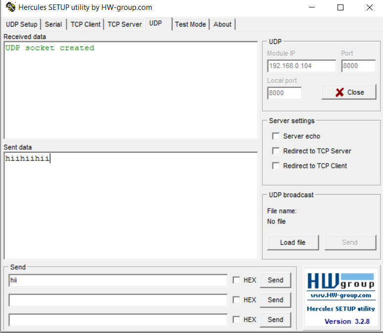
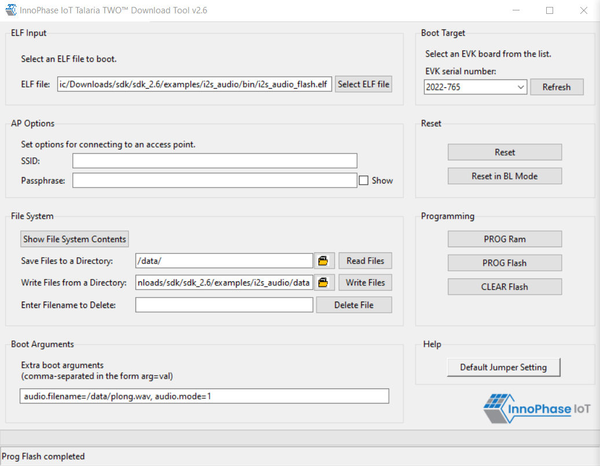

Overview
========

This application note provides details on using the Analog to Digital
Converter (ADC) peripheral of Talaria TWO modules.

Analog to Digital Converter (ADC)
=================================

Talaria TWO modules have a 10-bit effective SAR ADC for measuring the
internal supply voltage and temperature levels in addition to measuring
an external voltage level through a specified ADC port.

.. table:: Table 1: ADC Specifications

   +-----------------------------------+--------------+------------------+
   | **ADC Specification**             | **Details**  | **Unit**         |
   +===================================+==============+==================+
   | ADC Input Channels                | VBAT, TEMP,  | --               |
   |                                   | EXT          |                  |
   +-----------------------------------+--------------+------------------+
   | External Voltage Input Range      | 0 to 1.0     | V                |
   +-----------------------------------+--------------+------------------+
   | Additional Delay for ADC Ready    | 5            | μs               |
   | after Wakeup                      |              |                  |
   +-----------------------------------+--------------+------------------+

ADC block diagram
-----------------

|image1|

Figure 1: ADC - Block Diagram

 VBAT Voltage
=============

VBat is the Voltage of the Battery. It could be used to power a
component that takes Battery Voltage.

Header J4 will switch between VBat and Vm_3.3V.

|image2|

Figure 2: J10 Battery connection

When using a battery as a power source, there will be an additional
current drawn from LED (D7 or D12 depending on board version). If
attempting to measure an accurate module current drawn from the battery
connection, the LED series resistor must be removed to disconnect the
LED.

It configures the clocking and power profile of the block to match the
current source and optimize energy consumption. When the device is
powered through the VBAT Domain most of the circuits are powered down to
conserve energy.

Based on the mode, The power for module is derived from either USB or
shield header. A battery header is available which can be used as power
source as well.

a. J4 at VM_3.3V for USB power

b. J4 at VBAT and battery connect to J10 for Battery power

 VBAT block diagram
-------------------

|image3|

Figure 3: VBAT-Block Diagram

Source Code Walkthrough
=======================

Application flow
----------------

The application displays the raw value that varies according to the
input provided to the ADC pin. Apart from the raw value measured out of
the ADC pin, the internal temperature in integer Celsius and the VBAT in
mv measured from source are also displayed.

This sample application:

1. Reads the internal temperature and prints the value

2. Reads the external ADC input and prints the value

3. Prints the internal temperature in integer Celsius

ADC APIs
--------

1. os_vbat()- Reads VBAT voltage

..

   This API is used to enable the VBAT mode. A back-up source must be
   connected to VBAT pin. The voltage value (in millivolt) on the VBAT
   pin is returned.

2. os_adc()- Reads external ADC input

..

   Displays the raw value to the input provided to the ADC pin.

3. os_core_temp() – Reads internal temperature

..

   The inner temperature (in integer Celsius) of the chip core is
   displayed.

Source file
-----------

adc.c
~~~~~

Following is the example code which displays the ADC raw value for an
external input voltage fed through the the ADC pin, VBAT and internal
temperature of Talaria TWO.

1. os_adc()converts the analog input at the ADC pin and prints raw data
   as an output.

2. os_vbat()prints the VBAT voltage in millivolt from the back-up source
   on the VBAT pin

3. os_core_temp()reads the internal temperature and prints the
   temperature in internal Celsius type.

+-----------------------------------------------------------------------+
| os_msleep(1000);                                                      |
|                                                                       |
| os_printf("ADC External value: %d\\n",os_adc());                      |
|                                                                       |
| os_printf("V_BAT: %d mv\\n",os_vbat());                               |
|                                                                       |
| os_printf("Internal Temperature: %d Celsius\\n",os_core_temp());      |
+=======================================================================+
+-----------------------------------------------------------------------+

Building
========

To build the sample application, execute the following commands from SDK
directory:

+-----------------------------------------------------------------------+
| cd examples/adc                                                       |
|                                                                       |
| make                                                                  |
+=======================================================================+
+-----------------------------------------------------------------------+

The make command should generate the adc.elf in the out directory.

Running the Application
=======================

Programming Talaria TWO device using the Download Tool
------------------------------------------------------

Program adc.elf (sdk_x.y\\examples\\adc\\bin) using the Download tool:

1. Launch the Download tool provided with InnoPhase Talaria TWO SDK.

2. In the GUI window:

   a. Boot Target: Select the appropriate EVK from the drop-down.

   b. ELF Input: Load the adc.elf by clicking on Select ELF File.

   c. Programming: Click on Prog Flash.

For more details on using the Download tool, refer to the document:
UG_Download_Tool.pdf (path: *sdk_x.y/pc_tools/Download_Tool/doc*).

**Note**: x and y refer to the SDK release version. For example:
sdk_2.4/doc.

Expected Output
---------------

On flashing the application using the Download Tool, the console output
is as follows:

+-----------------------------------------------------------------------+
| UART:NWWWWAE                                                          |
|                                                                       |
| Build $Id: git-b664be2af $                                            |
|                                                                       |
| hio.baudrate=115200                                                   |
|                                                                       |
| flash: Gordon ready!                                                  |
|                                                                       |
| UART:NWWWAEBuild $Id: git-b664be2af $                                 |
|                                                                       |
| ADC Example                                                           |
|                                                                       |
| ADC External value:0                                                  |
|                                                                       |
| V_BAT:3253 mv                                                         |
|                                                                       |
| Internal Temperature:28 Celsius                                       |
|                                                                       |
| ADC External value:82                                                 |
|                                                                       |
| V_BAT:3252 mv                                                         |
|                                                                       |
| Internal Temperature:28 Celsius                                       |
|                                                                       |
| ADC External value:45                                                 |
|                                                                       |
| V_BAT:3252 mv                                                         |
|                                                                       |
| Internal Temperature:28 Celsius                                       |
|                                                                       |
| ADC External value:73                                                 |
|                                                                       |
| V_BAT:3253 mv                                                         |
|                                                                       |
| Internal Temperature:28 Celsius                                       |
|                                                                       |
| ADC External value:72                                                 |
|                                                                       |
| V_BAT:3252 mv                                                         |
|                                                                       |
| Internal Temperature:27 Celsius                                       |
|                                                                       |
| ADC External value:44                                                 |
|                                                                       |
| V_BAT:3252 mv                                                         |
|                                                                       |
| Internal Temperature:28 Celsius                                       |
|                                                                       |
| ADC External value:73                                                 |
|                                                                       |
| V_BAT:3253 mv                                                         |
|                                                                       |
| Internal Temperature:28 Celsius                                       |
|                                                                       |
| ADC External value:72                                                 |
|                                                                       |
| V_BAT:3252 mv                                                         |
|                                                                       |
| Internal Temperature:28 Celsius                                       |
|                                                                       |
| ADC External value:73                                                 |
|                                                                       |
| V_BAT:3252 mv                                                         |
|                                                                       |
| Internal Temperature:27 Celsius                                       |
|                                                                       |
| ADC External value:45                                                 |
|                                                                       |
| V_BAT:3253 mv                                                         |
|                                                                       |
| Internal Temperature:28 Celsius                                       |
|                                                                       |
| ADC External value:72                                                 |
|                                                                       |
| V_BAT:3253 mv                                                         |
|                                                                       |
| Internal Temperature:28 Celsius                                       |
|                                                                       |
| ADC External value:80                                                 |
|                                                                       |
| V_BAT:3252 mv                                                         |
|                                                                       |
| Internal Temperature:28 Celsius                                       |
|                                                                       |
| ADC External value:72                                                 |
|                                                                       |
| V_BAT:3253 mv                                                         |
|                                                                       |
| Internal Temperature:27 Celsius                                       |
|                                                                       |
| ADC External value:73                                                 |
|                                                                       |
| V_BAT:3252 mv                                                         |
|                                                                       |
| Internal Temperature:28 Celsius                                       |
|                                                                       |
| ADC External value:72                                                 |
|                                                                       |
| V_BAT:3253 mv                                                         |
|                                                                       |
| Internal Temperature:28 Celsius                                       |
|                                                                       |
| ADC External value:45                                                 |
|                                                                       |
| V_BAT:3252 mv                                                         |
|                                                                       |
| Internal Temperature:28 Celsius                                       |
|                                                                       |
| ADC External value:73                                                 |
|                                                                       |
| V_BAT:3253 mv                                                         |
|                                                                       |
| Internal Temperature:28 Celsius                                       |
|                                                                       |
| ADC External value:72                                                 |
|                                                                       |
| V_BAT:3251 mv                                                         |
+=======================================================================+
+-----------------------------------------------------------------------+

