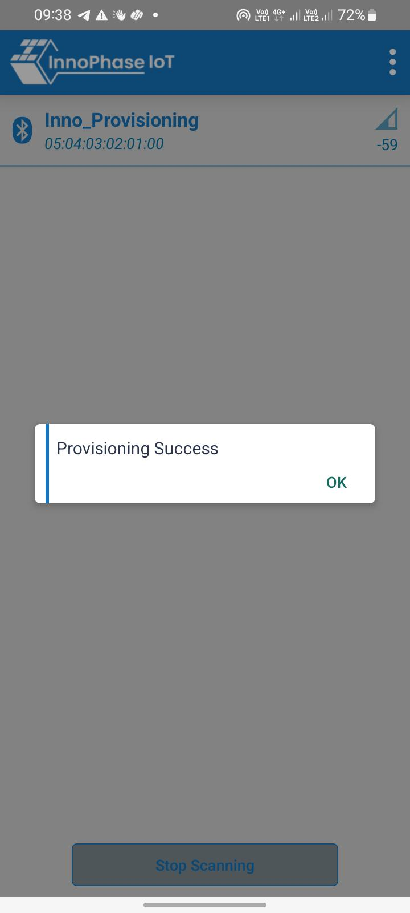

Introduction
============

The applications discussed in this document provides a brief on using
Talaria TWO board and the SDK with Amazon Web Services (AWS) IoT Core.

More information on the AWS IoT developer guide can be found at:
https://docs.aws.amazon.com/iot/latest/developerguide/.

AWS IoT Device SDK Embedded C On Talaria TWO Platform
=====================================================

Version v3.1.5 of aws-iot-device-sdk-embedded-C is ported on Talaria TWO
platform. The port along with the sample applications, is available as a
public Github repository here:
https://github.com/InnoPhaseIoT/talaria_two_aws

More information on aws-iot-device-sdk-embedded-C release tag v3.1.5 is
available here:
https://github.com/aws/aws-iot-device-sdk-embedded-C/tree/v3.1.5

API Documentation and other details specific to AWS IoT Device SDK
Embedded C release tag V3.1.5 is available here:
http://aws-iot-device-sdk-embedded-c-docs.s3-website-us-east-1.amazonaws.com/index.html

Follow the instructions in the subsequent sections to clone, patch and
compile the repository with Talaria TWO SDK.

Cloning talaria_two_aws Repository
----------------------------------

Create a new folder in any location and clone the talaria_two_aws
repository using the following command:

.. table:: Table : talaria_two_aws repository contents

   +-----------------------------------------------------------------------+
   | git clone --recursive                                                 |
   | https://github.com/InnoPhaseIoT/talaria_two_aws.git                   |
   +=======================================================================+
   +-----------------------------------------------------------------------+

**Note**: This repository uses `Git
Submodules <https://git-scm.com/book/en/v2/Git-Tools-Submodules>`__ for
its dependencies. The option --recursive is required to clone the Git
Submodule repository, further required by talaria_two_aws repository.

Patching AWS IoT Device SDK Embedded C for Talaria TWO SDK Compatibility 
-------------------------------------------------------------------------

After the clone is complete as described in section: Cloning
talaria_two_aws Repository, move the folder talaria_two_aws to the
following path: *<sdk_path>\\apps\\*.

Go to (cd) the following directory:
*<sdk_path>\\apps\\talaria_two_aws\\aws-iot-device-sdk-embedded-C* and
execute the following command to patch AWS IoT Device SDK for Talaria
TWO compatibility.

.. table:: Table : AWS Certificates

   +-----------------------------------------------------------------------+
   | <sdk_path>/apps/talaria_two_aws/aws-iot-device-sdk-embedded-C$ git    |
   | apply ../patches/t2_compatibility.patch                               |
   +=======================================================================+
   +-----------------------------------------------------------------------+

**Note**: Patching needs to be done only once after cloning is
successful.

Compiling AWS IoT SDK and Sample Applications 
----------------------------------------------

1. Once the patch is applied successfully, running Make from
   *<sdk_path>/apps/talaria_two_aws* will compile the AWS IoT SDK along
   with the Talaria TWO specific Platform Adaptation Layer and Sample
   Applications ported to Talaria TWO.

2. On running Make, the binaries for the various sample applications
   will be created in the out folder in their individual paths:
   *<sdk_path>/apps/talaria_two_aws/samples/<application_folder>/out*.

3. Applications can have their own custom configurations for SDK, based
   on their own needs, and the customized aws_iot_config.h file can be
   included by individual applications at the time of compiling the AWS
   IoT SDK.

4. All the sample applications use their own individually customizable
   aws_iot_config.h file at the following path:
   *<sdk_path>/apps/talaria_two_aws/samples/<application_folder>/src/aws_iot_config.h*.

Folder Structure talaria_two_aws Repository 
--------------------------------------------

talaria_two_aws repository includes the following directories/files:

+------------+---------------------------------------------------------+
| **Direct   | **Contents/Description**                                |
| ory/File** |                                                         |
+============+=========================================================+
| *          | AWS IoT Device SDK Embedded-C Release Tag v3.1.5        |
| aws-iot-de |                                                         |
| vice-sdk-e |                                                         |
| mbedded-C* |                                                         |
+------------+---------------------------------------------------------+
| *patches*  | Patch file t2_compatibility.patch for AWS IoT Device    |
|            | SDK V3.1.5 for Talaria TWO compatibility                |
+------------+---------------------------------------------------------+
| *talari    | Platform Adaptation Layer with Talaria TWO platform     |
| a_two_pal* | specific porting, needed to adapt to AWS IoT SDK        |
+------------+---------------------------------------------------------+
| *samples*  | Samples provided by the AWS IoT SDK covering Thing      |
|            | Shadow, Jobs and Subscribe/Publish which are ported to  |
|            | Talaria TWO. Changes done for porting the sample        |
|            | applications are related to APIs used to connect to the |
|            | network, passing connection params as boot arguments    |
|            | and using dataFS for storing the certs and keys.        |
|            |                                                         |
|            | A sensor2cloud-aws app for INP301x EVB's onboard        |
|            | sensors is also available here                          |
+------------+---------------------------------------------------------+
| *data*     | Provides the sample dataFS folder structure to be used  |
|            | while programming the AWS certs and keys to EVB-A for   |
|            | talaria_two_aws Sample Applications.                    |
+------------+---------------------------------------------------------+
| *Makefile* | Generates the sample application executable binaries    |
|            | and aws iot sdk libraries, using AWS IoT SDK source     |
|            | files, sample application source files and              |
|            | *<sdk_path>/apps/talaria_two_                           |
|            | aws/samples/<application_folder>/src/aws_iot_config.h*. |
+------------+---------------------------------------------------------+

Overview of Sample Applications
===============================

Sample Applications ported onto the Talaria TWO platform are available
at: \\talaria_two_aws\\samples. A brief overview of these applications
is provided in this section.

Subscribe-Publish Sample
------------------------

This example takes the parameters from the aws_iot_config.h file and
Talaria TWO boot arguments and establishes a connection to the AWS IoT
MQTT Platform.

It then subscribes and publishes to the topics provided as bootargs
subscribe_topic and publish_topic.

If the topic bootArgs are not provided, then it defaults to
inno_test/ctrl as the subscribe_topic and inno_test/data as the
publish_topic.

If all the certs/keys are correct, alternate QoS0 and QoS1 messages
being published to publish_topic by the application in a loop is seen on
the Talaria TWO console.

If publishCount in code is given a non-zero value, then it defines the
number of times the publish should happen. With publishCount as 0, it
keeps publishing in a loop.

*AWS IoT Console->Test* page can be used to subscribe to inno_test/data
(or Talaria TWO's publish_topic provided as the bootArg to the
application) to observe the messages published by the application.

*AWS IoT Console->Test* page can be used to publish the message to
inno_test/ctrl (or Talaria TWO's subscribe_topic provided as the bootArg
to the application), and Talaria TWO application will receive the
messages which will be visible on the Talaria TWO console.

Following JSON formatted text should be used for publishing to Talaria
TWO:

+-----------------------------------------------------------------------+
| {                                                                     |
|                                                                       |
| "from": "AWS IoT console"                                             |
|                                                                       |
| "to": "T2"                                                            |
|                                                                       |
| "msg": "Hello from AWS IoT console"                                   |
|                                                                       |
| }                                                                     |
+=======================================================================+
+-----------------------------------------------------------------------+

The application takes SSID, passphrase, aws host name, aws port and
thing name (as client-id) as mandatory bootArgs and publish_topic,
subscribe_topic and suspend as optional bootargs.

Certs and keys are stored in dataFS and read from application specific
paths defined in the sample code.

**Note**: For Subscribe Publish sample, it is not necessary to create a
Thing in the AWS IoT Core. However, it is required that the Client ID be
unique. Any string can be given if it is unique. If two devices with
same Client ID are connected, AWS IoT Core keeps only the latest device
connected, and disconnects the device connected earlier. To enforce the
unique Client ID and avoid disconnects, Thing Name is used as Client ID
for sample applications.

Shadow Sample
-------------

The goal of this sample application is to demonstrate the capabilities
of aws iot thing shadow service.

This example takes the parameters from the aws_iot_config.h file and
Talaria TWO boot arguments and establishes a connection to the AWS IoT
Shadow Service.

This device acts as a Connected Window and periodically reports (once
every 3 seconds) the following parameters to the Thing's Classic Shadow
:

1. Temperature of the room (double)

**Note**: Temperature changes are simulated.

2. Open/close status of the window (bool). Open or close as windowOpen
   true/false

The device also listens for a shadow state change for windowOpen to act
on commands from the cloud. Two variables from a device's perspective
are,

1. Double temperature

2. Bool windowOpen

Hence, the corresponding Shadow Json Document in the cloud would be as
follows:

+-----------------------------------------------------------------------+
| { "reported": {                                                       |
|                                                                       |
| "temperature": 32,                                                    |
|                                                                       |
| "windowOpen": false                                                   |
|                                                                       |
| },                                                                    |
|                                                                       |
| "desired": {                                                          |
|                                                                       |
| "windowOpen": false                                                   |
|                                                                       |
| }                                                                     |
|                                                                       |
| }                                                                     |
+=======================================================================+
+-----------------------------------------------------------------------+

The device opens or closes the window based on json object windowOpen
data (true/false) received as part of shadow delta callback. Hence, a
jsonStruct_t object windowActuator is created with pKey = "windowOpen"
of type = SHADOW_JSON_BOOL and a delta callback windowActuate_Callback.

The application then registers for a Delta callback for windowActuator
and receives a callback whenever a state change happens for this object
in Thing Shadow.

For example : Based on temperature reported, a logic running in the AWS
cloud infra can either automatically decide when to open or close the
window, and thereby control it by changing the desired state of
windowOpen or a manual input by the end-user using a web/phone
application can change the desired state of windowOpen.

For the sample application, change in desired section can be done
manually as shown:

Assume the reported and desired states of windowOpen are false as shown
in the above JSON. From AWS IoT Web Console's Thing Shadow, if the
desired section is edited/saved as shown, then a delta callback will be
received by the application as there is a difference between desired vs
reported.

+-----------------------------------------------------------------------+
|    "desired":                                                         |
|                                                                       |
| {                                                                     |
|                                                                       |
|      "windowOpen": false                                              |
|                                                                       |
|    }                                                                  |
+=======================================================================+
+-----------------------------------------------------------------------+

Received Delta message

+-----------------------------------------------------------------------+
|    "delta": {                                                         |
|                                                                       |
|      "windowOpen": true                                               |
|                                                                       |
|    }                                                                  |
+=======================================================================+
+-----------------------------------------------------------------------+

This delta message implies that the desired windowOpen variable has
changed to true. The application will act on this delta message and
publish back windowOpen as true as part of the reported section of the
shadow document from the device when the next periodic temperature value
is reported.

+-----------------------------------------------------------------------+
|    "reported":                                                        |
|                                                                       |
| {                                                                     |
|                                                                       |
|      "temperature": 28,                                               |
|                                                                       |
|      "windowOpen": true                                               |
|                                                                       |
|    }                                                                  |
+=======================================================================+
+-----------------------------------------------------------------------+

This update reported message will remove the delta that was created, as
the desired and reported states will now match. If this delta message is
not removed, then the AWS IoT Thing Shadow is always going to have a
delta, and will keep sending delta callback anytime an update is applied
to the Shadow.

**Note**: Ensure the buffer sizes in aws_iot_config.h are big enough to
receive the delta message. The delta message will also contain the
metadata with the timestamps.

The application takes SSID, passphrase, AWS host name, AWS port and
thing name as must provide bootargs and suspend as optional bootArgs.

Certs and keys are stored in dataFS and read from app specific paths
defined in the sample code.

Jobs Sample
-----------

This example takes the parameters from aws_iot_config.h file and Talaria
TWO boot arguments and establishes a connection to the AWS IoT MQTT
Platform.

It performs several operations to demonstrate the basic capabilities of
the AWS IoT Jobs platform.

If all the certs/keys are correct, a list of pending Job Executions
printed out by the iot_get_pending_callback_handler can be seen.

If there are any existing pending job executions, each will be processed
one at a time in the iot_next_job_callback_handler.

After all of the pending jobs have been processed, the program will wait
for notifications for new pending jobs and process them one at a time as
they come in.

In the main body, registration of each callback for each corresponding
Jobs topic can be seen.

The application takes SSID, passphrase, AWS host name, AWS port and
thing name as must provide bootArgs and suspend as optional bootar This
app is a reference example for sensor2cloud-aws usecase. gs.

Certs and keys are stored in dataFS and read from app specific paths
defined in the sample code.

Sensor2Cloud- AWS
-----------------

This application is a reference example of sensor2cloud for sensors
available onboard in INP301x EVB-A. It is similar to the Shadow Sample
application, which uses the same boot arguments and data from sensors
available onboard in INP301x EVB-A instead of simulated data. Boot
arguments are also similar to the Shadow Sample application with an
additional boot-arg added, named sensor_poll_interval.

The application takes SSID, passphrase, aws host name, aws port thing
name (as client-id) and sensor_poll_interval as mandatory boot arguments
and suspend as optional boot arguments.

Certs and keys are stored in dataFS and read from application specific
paths defined in the sample code.

Following are the shadow attributes used by this application:

1. temperature

2. pressure

3. humidity

4. opticalPower

5. sensorPollInterval

6. sensorSwitch

If sensorSwitch is ON, sensor values are read periodically every
sensorPollInterval (in seconds) and sent to AWS IoT Thing Shadow
associated with the thing_name passed in the boot argument. If
sensorSwitch is OFF, no values are sent, but the application waits for
incoming delta callbacks for sensorSwitch and sensorPollInterval.

On boot, sensorSwitch is forced to be ON ('true') and sensorPollInterval
is forced to be the value passed using boot arguments for
sensor_poll_interval (in seconds). This can be later controlled by
changing these attributes values from the cloud and it takes effect on
Talaria TWO running via shadow delta callbacks.

AWS Set-up
==========

1. Create an AWS IoT account

An AWS account is needed to run the sample applications. AWS accounts
include twelve months of Free Tier Access.

More information on: https://portal.aws.amazon.com/billing/signup#/start

2. Create and register device/thing

Device/thing must be registered onto the AWS IoT registry.

Use the following link to AWS IoT user guide to download the necessary
certificates and private key:
https://docs.aws.amazon.com/iot/latest/developerguide/create-iot-resources.html.

Note:

-  Ensure the downloaded certificates and private key are saved in a
   secure location as it allows the user to download only once.

-  To determine your custom AWS, download location, go to AWS IoT
   Console -> Settings

3. Save Certificate and Private Key onto the device

There are four certificates that will be downloaded from AWS for the
created Thing. Out of which Public Key will not be used in this example.

Save the certificates (as there is a need to install these in the
device) and rename them as per the following table to create file system
and write it into Talaria TWO using the download tool:

+------------------------------------+---------------------------------+
| **File Name**                      | **Rename**                      |
+====================================+=================================+
| private.pem.key                    | aws_device_pkey                 |
+------------------------------------+---------------------------------+
| device.pem.crt                     | aws_device_cert                 |
+------------------------------------+---------------------------------+
| amazon-root-CA-1.pem               | aws_root_ca                     |
+------------------------------------+---------------------------------+
| Public Key                         | Not used in these examples      |
+------------------------------------+---------------------------------+

4. Create and attach a Policy to the certificate associated with the
   device/thing. To allow interaction with all the topics and other
   resources used in the example codes, a wildcard policy is set and
   attached to the thing’s certificate. Please edit and update the
   policy as shown below:

+-----------------------------------------------------------------------+
| {                                                                     |
|                                                                       |
| "Version": "2012-10-17",                                              |
|                                                                       |
| "Statement": [                                                        |
|                                                                       |
| {                                                                     |
|                                                                       |
| "Effect": "Allow",                                                    |
|                                                                       |
| "Action": "iot:\*",                                                   |
|                                                                       |
| "Resource": "\*"                                                      |
|                                                                       |
| }                                                                     |
|                                                                       |
| ]                                                                     |
|                                                                       |
| }                                                                     |
+=======================================================================+
+-----------------------------------------------------------------------+

Programming VM-based applications
=================================

Programming Talaria TWO Board with Certificates 
------------------------------------------------

The default path for sample AWS should be: \\data\\certs\\aws\\app.

The default path for sensor2cloud-aws application:
\\data\\certs\\sensor2aws

Show File System Contents
~~~~~~~~~~~~~~~~~~~~~~~~~

Click on Show File System Contents to see the current available files in
the file system.

|image1|\ |image2|

Figure : Show File System Contents

Write Files
~~~~~~~~~~~

To write files into Talaria TWO, user must create a folder with the name
data and place all certificates either directly into the data or they
can create multiple subfolders (for example: /data/iot_aws) and place
the certificates inside the sub-directory and update the path as per the
file system in the .c file.

The default path is \\data\\certs\\aws\\app. If the user writes into
data\\iot_aws\\cert_names then the path should be updated in the .c file
accordingly.

**Note**: The default path for sensor2cloud-aws application is
\\data\\certs\\sensor2aws

All the files/folders inside data will be written to Talaria TWO dataFS.

For reference, an example data folder is provided in the talaria_two_aws
repo, in the following path: /talaria_two_aws/data.

|image3|\ |image4|

Figure : Write certificates to Talaria TWO

Programming Talaria TWO board with ELF
--------------------------------------

Program the generated ELFs onto Talaria TWO using the Download Tool
sdk_x.y\\pc_tools\\Download_Tool)provided with InnoPhase Talaria TWO
SDK.

Launch the Download tool.

1. In the GUI window:

   a. Boot Target: Select the appropriate EVK from the drop-down.

   b. ELF Input: Load the appropriate ELF by clicking on Select ELF
      File.

   c. AP Options: Provide the SSID and Passphrase under AP Options to
      connect to an Access Point.

   d. Boot arguments: Pass the following boot arguments:

..

   sensor2cloud-aws application:

+-----------------------------------------------------------------------+
| aws_host=xxxxxx.amazonaws.com,aws_                                    |
| port=8883,thing_name=xxxxx,sensor_poll_interval=<interval_in_seconds> |
+=======================================================================+
+-----------------------------------------------------------------------+

..

   All other applications:

+-----------------------------------------------------------------------+
| aws_host=xxxxxx.amazonaws.com, aws_port=8883,thing_name=xxxxx         |
+=======================================================================+
+-----------------------------------------------------------------------+

..

   **Note**: Replace the xxxxxx with the appropriate details.

   Ensure correct boot parameters are supplied of your Wi-Fi network and
   the information from the device/thing created previously on AWS.

i.  aws_host is the custom AWS location.

ii. thing_name is the name of the device/thing we created earlier.

e. Programming: Prog RAM or Prog Flash as per requirement.

For more details on using the Download tool, refer to the document:
UG_Download_Tool.pdf (path: *sdk_x.y/pc_tools/Download_Tool/doc*).

**Note**: x and y refer to the SDK release version. For example:
sdk_2.4/doc.

MQTT Publish and Subscribe
==========================

**Note**: All AWS IoT Console screenshots might not look exactly as
shown in the figures but might be a variation of the same. This is
in-line with the ever-evolving console and its layouts.

Subscribe
---------

1. In the AWS IoT Console, go to Test->MQTT test client.

2. In the Subscription topic text box, type inno_test/data and click on
   Subscribe.

|Table Description automatically generated|

Figure : Subscribe to topic

3. In the Publish to a topic tab, click on inno_test/data.

|Graphical user interface, application Description automatically
generated|

Figure : Subscriptions – inno_test/data

Running the Sample Application 
-------------------------------

1. Program the Talaria TWO board with sample_pub_sub.elf using the
   process described in section: Programming Talaria TWO board with ELF.

2. Upon successful execution, the following console output will be
   provided:

+-----------------------------------------------------------------------+
| UART:NWWWWWWAEBuild $Id: git-f92bee540 $                              |
|                                                                       |
| ssid=ACT102571068294 passphrase=43083191                              |
| aws_host=a3t0o11ohwlo2h-ats.iot.us-east-2.amazonaws.com aws_port=8883 |
| thing_name=innotest                                                   |
|                                                                       |
| Mounting file system                                                  |
|                                                                       |
| read_certs() success                                                  |
|                                                                       |
| WiFi Details SSID: ACT102571068294, PASSWORD: 43083191                |
|                                                                       |
| addr e0:69:3a:00:2c:3e                                                |
|                                                                       |
| Connecting to WiFi...                                                 |
|                                                                       |
| add network status: 0                                                 |
|                                                                       |
| added network successfully, will try connecting..                     |
|                                                                       |
| connecting to network status: 0                                       |
|                                                                       |
| [13.924,824] CONNECT:00:5f:67:cd:c5:a6 Channel:6 rssi:-33 dBm         |
|                                                                       |
| wcm_notify_cb to App Layer - WCM_NOTIFY_MSG_LINK_UP                   |
|                                                                       |
| wcm_notify_cb to App Layer - WCM_NOTIFY_MSG_ADDRESS                   |
|                                                                       |
| [14.719,734] MYIP 192.168.0.105                                       |
|                                                                       |
| [14.720,161] IPv6 [fe80::e269:3aff:fe00:2c3e]-link                    |
|                                                                       |
| wcm_notify_cb to App Layer - WCM_NOTIFY_MSG_CONNECTED                 |
|                                                                       |
| Connecting...                                                         |
|                                                                       |
| heap[265040] max contentlen[16384] sizeof IoT_Publish_Message_Params  |
| (16)                                                                  |
|                                                                       |
| . Seeding the random number generator...                              |
|                                                                       |
| . Loading the CA root certificate...                                  |
|                                                                       |
| Root Done (0 skipped)                                                 |
|                                                                       |
| . Loading the client cert and key. size TLSDataParams:2080            |
|                                                                       |
| Loading the client cert done.... ret[0]                               |
|                                                                       |
| Loading the client pkey done.... ret[0]                               |
|                                                                       |
| ok                                                                    |
|                                                                       |
| . Connecting to                                                       |
| a3t0o11ohwlo2h-ats.iot.us-east-2.amazonaws.com/8883...                |
|                                                                       |
| ok                                                                    |
|                                                                       |
| . Setting up the SSL/TLS structure...                                 |
|                                                                       |
| SSL state connect : 0                                                 |
|                                                                       |
| ok                                                                    |
|                                                                       |
| SSL state connect : 0                                                 |
|                                                                       |
| . Performing the SSL/TLS handshake...                                 |
|                                                                       |
| Verify requested for (Depth 2):                                       |
|                                                                       |
| This certificate has no flags                                         |
|                                                                       |
| Verify requested for (Depth 1):                                       |
|                                                                       |
| This certificate has no flags                                         |
|                                                                       |
| Verify requested for (Depth 0):                                       |
|                                                                       |
| This certificate has no flags                                         |
|                                                                       |
| SSL/TLS Handshake DONE.. ret:0                                        |
|                                                                       |
| ok                                                                    |
|                                                                       |
| [ Protocol is TLSv1.2 ]                                               |
|                                                                       |
| [ Ciphersuite is TLS-ECDHE-RSA-WITH-AES-128-GCM-SHA256 ]              |
|                                                                       |
| [ Record expansion is 29 ]                                            |
|                                                                       |
| . Verifying peer X.509 certificate...                                 |
|                                                                       |
| ok                                                                    |
|                                                                       |
| Subscribing...                                                        |
|                                                                       |
| Subscribed to topic [inno_test/ctrl] ret[0] qos[0] topic len[14]      |
|                                                                       |
| sleep                                                                 |
|                                                                       |
| ---> Publishing with 'Message QoS0' to Topic [inno_test/data]         |
|                                                                       |
| msg[{"from":"Talaria T2","to":"AWS","msg":"Howdy Ho","msg_id":1}]     |
|                                                                       |
| QoS0 Message Publish Successful for "msg_id":1. Return Status [0]     |
|                                                                       |
| ---> Publishing with 'Message QoS1' to Topic [inno_test/data]         |
|                                                                       |
| msg[{"from":"Talaria T2","to":"AWS","msg":"Howdy Ho","msg_id":2}]     |
|                                                                       |
| QoS1 Message Publish Successful for "msg_id":2. Return Status [0]     |
|                                                                       |
| sleep                                                                 |
|                                                                       |
| ---> Publishing with 'Message QoS0' to Topic [inno_test/data]         |
|                                                                       |
| msg[{"from":"Talaria T2","to":"AWS","msg":"Howdy Ho","msg_id":3}]     |
|                                                                       |
| QoS0 Message Publish Successful for "msg_id":3. Return Status [0]     |
|                                                                       |
| ---> Publishing with 'Message QoS1' to Topic [inno_test/data]         |
|                                                                       |
| msg[{"from":"Talaria T2","to":"AWS","msg":"Howdy Ho","msg_id":4}]     |
|                                                                       |
| QoS1 Message Publish Successful for "msg_id":4. Return Status [0]     |
|                                                                       |
| sleep                                                                 |
|                                                                       |
| ---> Publishing with 'Message QoS0' to Topic [inno_test/data]         |
|                                                                       |
| msg[{"from":"Talaria T2","to":"AWS","msg":"Howdy Ho","msg_id":5}]     |
|                                                                       |
| QoS0 Message Publish Successful for "msg_id":5. Return Status [0]     |
|                                                                       |
| ---> Publishing with 'Message QoS1' to Topic [inno_test/data]         |
|                                                                       |
| msg[{"from":"Talaria T2","to":"AWS","msg":"Howdy Ho","msg_id":6}]     |
|                                                                       |
| QoS1 Message Publish Successful for "msg_id":6. Return Status [0]     |
|                                                                       |
| sleep                                                                 |
|                                                                       |
| ---> Publishing with 'Message QoS0' to Topic [inno_test/data]         |
|                                                                       |
| msg[{"from":"Talaria T2","to":"AWS","msg":"Howdy Ho","msg_id":7}]     |
|                                                                       |
| QoS0 Message Publish Successful for "msg_id":7. Return Status [0]     |
|                                                                       |
| ---> Publishing with 'Message QoS1' to Topic [inno_test/data]         |
|                                                                       |
| msg[{"from":"Talaria T2","to":"AWS","msg":"Howdy Ho","msg_id":8}]     |
|                                                                       |
| QoS1 Message Publish Successful for "msg_id":8. Return Status [0]     |
|                                                                       |
| sleep                                                                 |
|                                                                       |
| ---> Publishing with 'Message QoS0' to Topic [inno_test/data]         |
|                                                                       |
| msg[{"from":"Talaria T2","to":"AWS","msg":"Howdy Ho","msg_id":9}]     |
|                                                                       |
| QoS0 Message Publish Successful for "msg_id":9. Return Status [0]     |
|                                                                       |
| ---> Publishing with 'Message QoS1' to Topic [inno_test/data]         |
|                                                                       |
| msg[{"from":"Talaria T2","to":"AWS","msg":"Howdy Ho","msg_id":10}]    |
|                                                                       |
| QoS1 Message Publish Successful for "msg_id":10. Return Status [0]    |
|                                                                       |
| sleep                                                                 |
+=======================================================================+
+-----------------------------------------------------------------------+

3. The AWS IoT dashboard will appear as in Figure 5.

|Graphical user interface, text, website Description automatically
generated|

Figure : AWS IoT Dashboard

Publish
-------

1. Program the Talaria TWO board with sample_pub_sub.elf using the
   process described in section: Programming Talaria TWO board with ELF.

2. In the AWS IoT Console, go to Test.

3. On the Publish topic text box, enter inno_test/ctrl.

|image5|

Figure : Publish to topic

4. Copy and paste the following json formatted text into the colored
   console as shown in Figure 6.

+-----------------------------------------------------------------------+
| {                                                                     |
|                                                                       |
| "from": "AWS IoT console"                                             |
|                                                                       |
| "to": "T2"                                                            |
|                                                                       |
| "msg": "Hello from AWS IoT console"                                   |
|                                                                       |
| }                                                                     |
+=======================================================================+
+-----------------------------------------------------------------------+

5. On clicking Publish to topic, the following output is displayed in
   the console:

+-----------------------------------------------------------------------+
| UART:NWWWWWWAEBuild $Id: git-f92bee540 $                              |
|                                                                       |
| ssid=ACT102571068294 passphrase=43083191                              |
| aws_host=a3t0o11ohwlo2h-ats.iot.us-east-2.amazonaws.com aws_port=8883 |
| thing_name=innotest                                                   |
|                                                                       |
| Mounting file system                                                  |
|                                                                       |
| read_certs() success                                                  |
|                                                                       |
| WiFi Details SSID: ACT102571068294, PASSWORD: 43083191                |
|                                                                       |
| addr e0:69:3a:00:2c:3e                                                |
|                                                                       |
| Connecting to WiFi...                                                 |
|                                                                       |
| add network status: 0                                                 |
|                                                                       |
| added network successfully, will try connecting..                     |
|                                                                       |
| connecting to network status: 0                                       |
|                                                                       |
| [13.924,824] CONNECT:00:5f:67:cd:c5:a6 Channel:6 rssi:-33 dBm         |
|                                                                       |
| wcm_notify_cb to App Layer - WCM_NOTIFY_MSG_LINK_UP                   |
|                                                                       |
| wcm_notify_cb to App Layer - WCM_NOTIFY_MSG_ADDRESS                   |
|                                                                       |
| [14.719,734] MYIP 192.168.0.105                                       |
|                                                                       |
| [14.720,161] IPv6 [fe80::e269:3aff:fe00:2c3e]-link                    |
|                                                                       |
| wcm_notify_cb to App Layer - WCM_NOTIFY_MSG_CONNECTED                 |
|                                                                       |
| Connecting...                                                         |
|                                                                       |
| heap[265040] max contentlen[16384] sizeof IoT_Publish_Message_Params  |
| (16)                                                                  |
|                                                                       |
| . Seeding the random number generator...                              |
|                                                                       |
| . Loading the CA root certificate...                                  |
|                                                                       |
| Root Done (0 skipped)                                                 |
|                                                                       |
| . Loading the client cert and key. size TLSDataParams:2080            |
|                                                                       |
| Loading the client cert done.... ret[0]                               |
|                                                                       |
| Loading the client pkey done.... ret[0]                               |
|                                                                       |
| ok                                                                    |
|                                                                       |
| . Connecting to                                                       |
| a3t0o11ohwlo2h-ats.iot.us-east-2.amazonaws.com/8883...                |
|                                                                       |
| ok                                                                    |
|                                                                       |
| . Setting up the SSL/TLS structure...                                 |
|                                                                       |
| SSL state connect : 0                                                 |
|                                                                       |
| ok                                                                    |
|                                                                       |
| SSL state connect : 0                                                 |
|                                                                       |
| . Performing the SSL/TLS handshake...                                 |
|                                                                       |
| Verify requested for (Depth 2):                                       |
|                                                                       |
| This certificate has no flags                                         |
|                                                                       |
| Verify requested for (Depth 1):                                       |
|                                                                       |
| This certificate has no flags                                         |
|                                                                       |
| Verify requested for (Depth 0):                                       |
|                                                                       |
| This certificate has no flags                                         |
|                                                                       |
| SSL/TLS Handshake DONE.. ret:0                                        |
|                                                                       |
| ok                                                                    |
|                                                                       |
| [ Protocol is TLSv1.2 ]                                               |
|                                                                       |
| [ Ciphersuite is TLS-ECDHE-RSA-WITH-AES-128-GCM-SHA256 ]              |
|                                                                       |
| [ Record expansion is 29 ]                                            |
|                                                                       |
| . Verifying peer X.509 certificate...                                 |
|                                                                       |
| ok                                                                    |
|                                                                       |
| Subscribing...                                                        |
|                                                                       |
| Subscribed to topic [inno_test/ctrl] ret[0] qos[0] topic len[14]      |
|                                                                       |
| sleep                                                                 |
|                                                                       |
| ---> Publishing with 'Message QoS0' to Topic [inno_test/data]         |
|                                                                       |
| msg[{"from":"Talaria T2","to":"AWS","msg":"Howdy Ho","msg_id":1}]     |
|                                                                       |
| QoS0 Message Publish Successful for "msg_id":1. Return Status [0]     |
|                                                                       |
| ---> Publishing with 'Message QoS1' to Topic [inno_test/data]         |
|                                                                       |
| msg[{"from":"Talaria T2","to":"AWS","msg":"Howdy Ho","msg_id":2}]     |
|                                                                       |
| QoS1 Message Publish Successful for "msg_id":2. Return Status [0]     |
|                                                                       |
| sleep                                                                 |
|                                                                       |
| ---> Publishing with 'Message QoS0' to Topic [inno_test/data]         |
|                                                                       |
| msg[{"from":"Talaria T2","to":"AWS","msg":"Howdy Ho","msg_id":3}]     |
|                                                                       |
| QoS0 Message Publish Successful for "msg_id":3. Return Status [0]     |
|                                                                       |
| ---> Publishing with 'Message QoS1' to Topic [inno_test/data]         |
|                                                                       |
| msg[{"from":"Talaria T2","to":"AWS","msg":"Howdy Ho","msg_id":4}]     |
|                                                                       |
| QoS1 Message Publish Successful for "msg_id":4. Return Status [0]     |
|                                                                       |
| sleep                                                                 |
|                                                                       |
| ---> Publishing with 'Message QoS0' to Topic [inno_test/data]         |
|                                                                       |
| msg[{"from":"Talaria T2","to":"AWS","msg":"Howdy Ho","msg_id":5}]     |
|                                                                       |
| QoS0 Message Publish Successful for "msg_id":5. Return Status [0]     |
|                                                                       |
| ---> Publishing with 'Message QoS1' to Topic [inno_test/data]         |
|                                                                       |
| msg[{"from":"Talaria T2","to":"AWS","msg":"Howdy Ho","msg_id":6}]     |
|                                                                       |
| QoS1 Message Publish Successful for "msg_id":6. Return Status [0]     |
|                                                                       |
| sleep                                                                 |
|                                                                       |
| ---> Publishing with 'Message QoS0' to Topic [inno_test/data]         |
|                                                                       |
| msg[{"from":"Talaria T2","to":"AWS","msg":"Howdy Ho","msg_id":7}]     |
|                                                                       |
| QoS0 Message Publish Successful for "msg_id":7. Return Status [0]     |
|                                                                       |
| ---> Publishing with 'Message QoS1' to Topic [inno_test/data]         |
|                                                                       |
| msg[{"from":"Talaria T2","to":"AWS","msg":"Howdy Ho","msg_id":8}]     |
|                                                                       |
| QoS1 Message Publish Successful for "msg_id":8. Return Status [0]     |
|                                                                       |
| sleep                                                                 |
|                                                                       |
| ---> Publishing with 'Message QoS0' to Topic [inno_test/data]         |
|                                                                       |
| msg[{"from":"Talaria T2","to":"AWS","msg":"Howdy Ho","msg_id":9}]     |
|                                                                       |
| QoS0 Message Publish Successful for "msg_id":9. Return Status [0]     |
|                                                                       |
| ---> Publishing with 'Message QoS1' to Topic [inno_test/data]         |
|                                                                       |
| msg[{"from":"Talaria T2","to":"AWS","msg":"Howdy Ho","msg_id":10}]    |
|                                                                       |
| QoS1 Message Publish Successful for "msg_id":10. Return Status [0]    |
|                                                                       |
| sleep                                                                 |
|                                                                       |
| ---> Publishing with 'Message QoS0' to Topic [inno_test/data]         |
|                                                                       |
| msg[{"from":"Talaria T2","to":"AWS","msg":"Howdy Ho","msg_id":11}]    |
|                                                                       |
| QoS0 Message Publish Successful for "msg_id":11. Return Status [0]    |
|                                                                       |
| ---> Publishing with 'Message QoS1' to Topic [inno_test/data]         |
|                                                                       |
| msg[{"from":"Talaria T2","to":"AWS","msg":"Howdy Ho","msg_id":12}]    |
|                                                                       |
| <--- Message Received on Subscribed Topic [inno_test/ctrl]            |
|                                                                       |
| - from: AWS IoT console                                               |
|                                                                       |
| - to: T2                                                              |
|                                                                       |
| - message: Hello from AWS IoT console                                 |
|                                                                       |
| <--- Message Received on Subscribed Topic [inno_test/ctrl]            |
|                                                                       |
| - from: AWS IoT console                                               |
|                                                                       |
| - to: T2                                                              |
|                                                                       |
| - message: Hello from AWS IoT console                                 |
|                                                                       |
| <--- Message Received on Subscribed Topic [inno_test/ctrl]            |
|                                                                       |
| - from: AWS IoT console                                               |
|                                                                       |
| - to: T2                                                              |
|                                                                       |
| - message: Hello from AWS IoT console                                 |
|                                                                       |
| <--- Message Received on Subscribed Topic [inno_test/ctrl]            |
|                                                                       |
| - from: AWS IoT console                                               |
|                                                                       |
| - to: T2                                                              |
|                                                                       |
| - message: Hello from AWS IoT console                                 |
|                                                                       |
| <--- Message Received on Subscribed Topic [inno_test/ctrl]            |
|                                                                       |
| - from: AWS IoT console                                               |
|                                                                       |
| - to: T2                                                              |
|                                                                       |
| - message: Hello from AWS IoT console                                 |
|                                                                       |
| QoS1 Message Publish Successful for "msg_id":12. Return Status [0]    |
|                                                                       |
| sleep                                                                 |
|                                                                       |
| ---> Publishing with 'Message QoS0' to Topic [inno_test/data]         |
|                                                                       |
| msg[{"from":"Talaria T2","to":"AWS","msg":"Howdy Ho","msg_id":13}]    |
|                                                                       |
| QoS0 Message Publish Successful for "msg_id":13. Return Status [0]    |
|                                                                       |
| ---> Publishing with 'Message QoS1' to Topic [inno_test/data]         |
|                                                                       |
| msg[{"from":"Talaria T2","to":"AWS","msg":"Howdy Ho","msg_id":14}]    |
|                                                                       |
| <--- Message Received on Subscribed Topic [inno_test/ctrl]            |
|                                                                       |
| - from: AWS IoT console                                               |
|                                                                       |
| - to: T2                                                              |
|                                                                       |
| - message: Hello from AWS IoT console                                 |
|                                                                       |
| <--- Message Received on Subscribed Topic [inno_test/ctrl]            |
|                                                                       |
| - from: AWS IoT console                                               |
|                                                                       |
| - to: T2                                                              |
|                                                                       |
| - message: Hello from AWS IoT console                                 |
|                                                                       |
| QoS1 Message Publish Successful for "msg_id":14. Return Status [0]    |
|                                                                       |
| sleep                                                                 |
|                                                                       |
| ---> Publishing with 'Message QoS0' to Topic [inno_test/data]         |
|                                                                       |
| msg[{"from":"Talaria T2","to":"AWS","msg":"Howdy Ho","msg_id":15}]    |
|                                                                       |
| QoS0 Message Publish Successful for "msg_id":15. Return Status [0]    |
|                                                                       |
| ---> Publishing with 'Message QoS1' to Topic [inno_test/data]         |
|                                                                       |
| msg[{"from":"Talaria T2","to":"AWS","msg":"Howdy Ho","msg_id":16}]    |
|                                                                       |
| QoS1 Message Publish Successful for "msg_id":16. Return Status [0]    |
|                                                                       |
| sleep                                                                 |
+=======================================================================+
+-----------------------------------------------------------------------+

1. 

Device Shadow
=============

.. _running-the-sample-application-1:

Running the Sample Application
------------------------------

1. In the AWS IoT Console, go to Manage -> Things ->YourThingName ->
   Shadow.

2. Program the Talaria TWO board with shadow_sample.elf using the
   process described in section: Programming Talaria TWO board with ELF.

3. On successful execution, the following console output will be
   provided:

+-----------------------------------------------------------------------+
| UART:NWWWWWWAEBuild $Id: git-f92bee540 $                              |
|                                                                       |
| ssid=ACT102571068294 passphrase=43083191                              |
| aws_host=a3t0o11ohwlo2h-ats.iot.us-east-2.amazonaws.com aws_port=8883 |
| thing_name=innotest                                                   |
|                                                                       |
| Mounting file system                                                  |
|                                                                       |
| read_certs() success                                                  |
|                                                                       |
| WiFi Details SSID: ACT102571068294, PASSWORD: 43083191                |
|                                                                       |
| addr e0:69:3a:00:2c:3e                                                |
|                                                                       |
| Connecting to WiFi...                                                 |
|                                                                       |
| add network status: 0                                                 |
|                                                                       |
| added network successfully, will try connecting..                     |
|                                                                       |
| connecting to network status: 0                                       |
|                                                                       |
| [13.939,715] CONNECT:00:5f:67:cd:c5:a6 Channel:6 rssi:-31 dBm         |
|                                                                       |
| wcm_notify_cb to App Layer - WCM_NOTIFY_MSG_LINK_UP                   |
|                                                                       |
| wcm_notify_cb to App Layer - WCM_NOTIFY_MSG_ADDRESS                   |
|                                                                       |
| [14.835,011] MYIP 192.168.0.105                                       |
|                                                                       |
| [14.835,173] IPv6 [fe80::e269:3aff:fe00:2c3e]-link                    |
|                                                                       |
| wcm_notify_cb to App Layer - WCM_NOTIFY_MSG_CONNECTED                 |
|                                                                       |
| Shadow InitShadow Connect                                             |
|                                                                       |
| . Seeding the random number generator...                              |
|                                                                       |
| . Loading the CA root certificate...                                  |
|                                                                       |
| Root Done (0 skipped)                                                 |
|                                                                       |
| . Loading the client cert and key. size TLSDataParams:2080            |
|                                                                       |
| Loading the client cert done.... ret[0]                               |
|                                                                       |
| Loading the client pkey done.... ret[0]                               |
|                                                                       |
| ok                                                                    |
|                                                                       |
| . Connecting to                                                       |
| a3t0o11ohwlo2h-ats.iot.us-east-2.amazonaws.com/8883...                |
|                                                                       |
| ok                                                                    |
|                                                                       |
| . Setting up the SSL/TLS structure...                                 |
|                                                                       |
| SSL state connect : 0                                                 |
|                                                                       |
| ok                                                                    |
|                                                                       |
| SSL state connect : 0                                                 |
|                                                                       |
| . Performing the SSL/TLS handshake...                                 |
|                                                                       |
| Verify requested for (Depth 2):                                       |
|                                                                       |
| This certificate has no flags                                         |
|                                                                       |
| Verify requested for (Depth 1):                                       |
|                                                                       |
| This certificate has no flags                                         |
|                                                                       |
| Verify requested for (Depth 0):                                       |
|                                                                       |
| This certificate has no flags                                         |
|                                                                       |
| SSL/TLS Handshake DONE.. ret:0                                        |
|                                                                       |
| ok                                                                    |
|                                                                       |
| [ Protocol is TLSv1.2 ]                                               |
|                                                                       |
| [ Ciphersuite is TLS-ECDHE-RSA-WITH-AES-128-GCM-SHA256 ]              |
|                                                                       |
| [ Record expansion is 29 ]                                            |
|                                                                       |
| . Verifying peer X.509 certificate...                                 |
|                                                                       |
| ok                                                                    |
|                                                                       |
| On Device: window state false                                         |
|                                                                       |
| Update Shadow:                                                        |
| {"state":{"reported":{"temperature":25.500000,"windowOpen":false}},   |
| "clientToken":"innotest-0"}                                           |
|                                                                       |
| Delta - Window state changed to 1                                     |
|                                                                       |
| Update Accepted !!                                                    |
|                                                                       |
| On Device: window state true                                          |
|                                                                       |
| Update Shadow:                                                        |
| {"state":{"reported":{"temperature":26.000000,"windowOpen":true}},    |
| "clientToken":"innotest-1"}                                           |
|                                                                       |
| Update Accepted !!                                                    |
|                                                                       |
| On Device: window state true                                          |
|                                                                       |
| Update Shadow:                                                        |
| {"state":{"reported":{"temperature":26.500000,"windowOpen":true}},    |
| "clientToken":"innotest-2"}                                           |
|                                                                       |
| Update Accepted !!                                                    |
|                                                                       |
| On Device: window state true                                          |
|                                                                       |
| Update Shadow:                                                        |
| {"state":{"reported":{"temperature":27.000000,"windowOpen":true}},    |
| "clientToken":"innotest-3"}                                           |
|                                                                       |
| Update Accepted !!                                                    |
|                                                                       |
| On Device: window state true                                          |
|                                                                       |
| Update Shadow:                                                        |
| {"state":{"reported":{"temperature":27.500000,"windowOpen":true}},    |
| "clientToken":"innotest-4"}                                           |
|                                                                       |
| Update Accepted !!                                                    |
|                                                                       |
| On Device: window state true                                          |
|                                                                       |
| Update Shadow:                                                        |
| {"state":{"reported":{"temperature":28.000000,"windowOpen":true}},    |
| "clientToken":"innotest-5"}                                           |
|                                                                       |
| Update Accepted !!                                                    |
|                                                                       |
| On Device: window state true                                          |
|                                                                       |
| Update Shadow:                                                        |
| {"state":{"reported":{"temperature":28.500000,"windowOpen":true}},    |
| "clientToken":"innotest-6"}                                           |
|                                                                       |
| Update Accepted !!                                                    |
|                                                                       |
| On Device: window state true                                          |
|                                                                       |
| Update Shadow:                                                        |
| {"state":{"reported":{"temperature":29.000000,"windowOpen":true}},    |
| "clientToken":"innotest-7"}                                           |
|                                                                       |
| Update Accepted !!                                                    |
+=======================================================================+
+-----------------------------------------------------------------------+

4. The AWS IoT dashboard will appear as shown in Figure 7.

|image6|

Figure : AWS IoT Dashboard

Running Jobs
============

Creating a job in AWS
---------------------

1. Create a new .json file.

+-----------------------------------------------------------------------+
| {                                                                     |
|                                                                       |
| "operation": "customJob",                                             |
|                                                                       |
| "otherInfo": "someValue"                                              |
|                                                                       |
| }                                                                     |
+=======================================================================+
+-----------------------------------------------------------------------+

2. Create a bucket to store files on your Amazon Simple Storage Service
   (Amazon S3).

More information on creating buckets on the Amazon S3 can be found here:
https://s3.console.aws.amazon.com.

|Graphical user interface, text, application, email Description
automatically generated|

Figure : Creating a bucket to store files on Amazon S3

3. Upload the new .json file onto the Amazon S3 bucket.

|Graphical user interface, text, application Description automatically
generated|

Figure : Uploading .json file onto the Amazon S3 bucket

4. In the AWS IoT Console, go to Manage -> Jobs.

5. Click on Create and then on Create custom job.

|Graphical user interface, application, email Description automatically
generated|

Figure : Creating a custom job

6. Fill the Job ID and Description as per your requirement.

7. In Select devices to update, select your thing as the device to be
   included in the job.

**Note**: If your thing name is not found in the dropdown, then make
sure to select the correct region available at the top right side of AWS
IoT console.

|image7|

Figure : Selecting devices to update

8. In Add a job file, go ahead, and select the job file uploaded into
   your S3 bucket.

|image8|

Figure : Adding a job file

9.  Click on Next. In the next window, click on Create.

10. The new job you created will now appear on the AWS IoT Console.

|image9|

Figure : AWS IoT Console – new job created

.. _running-the-sample-application-2:

Running the Sample Application
------------------------------

1. Program the Talaria TWO board with jobs_sample.elf using the process
   described in section: Programming Talaria TWO board with ELF.

2. Boot arguments: Pass the following boot arguments

3. On successful execution, the following console output will be
   provided:

+-----------------------------------------------------------------------+
| UART:NWWWWWWAEBuild $Id: git-f92bee540 $                              |
|                                                                       |
| ssid=ACT102571068294 passphrase=43083191                              |
| aws_host=a3t0o11ohwlo2h-ats.iot.us-east-2.amazonaws.com aws_port=8883 |
| thing_name=innotest                                                   |
|                                                                       |
| Mounting file system                                                  |
|                                                                       |
| read_certs() success                                                  |
|                                                                       |
| WiFi Details SSID: ACT102571068294, PASSWORD: 43083191                |
|                                                                       |
| addr e0:69:3a:00:2c:3e                                                |
|                                                                       |
| Connecting to WiFi...                                                 |
|                                                                       |
| add network status: 0                                                 |
|                                                                       |
| added network successfully, will try connecting..                     |
|                                                                       |
| connecting to network status: 0                                       |
|                                                                       |
| [13.968,534] CONNECT:00:5f:67:cd:c5:a6 Channel:6 rssi:-27 dBm         |
|                                                                       |
| wcm_notify_cb to App Layer - WCM_NOTIFY_MSG_LINK_UP                   |
|                                                                       |
| wcm_notify_cb to App Layer - WCM_NOTIFY_MSG_ADDRESS                   |
|                                                                       |
| [14.771,379] MYIP 192.168.0.105                                       |
|                                                                       |
| [14.771,541] IPv6 [fe80::e269:3aff:fe00:2c3e]-link                    |
|                                                                       |
| wcm_notify_cb to App Layer - WCM_NOTIFY_MSG_CONNECTED                 |
|                                                                       |
| Connecting...                                                         |
|                                                                       |
| heap[263664] max contentlen[16384] sizeof IoT_Publish_Message_Params  |
| (16)                                                                  |
|                                                                       |
| . Seeding the random number generator...                              |
|                                                                       |
| . Loading the CA root certificate...                                  |
|                                                                       |
| Root Done (0 skipped)                                                 |
|                                                                       |
| . Loading the client cert and key. size TLSDataParams:2080            |
|                                                                       |
| Loading the client cert done.... ret[0]                               |
|                                                                       |
| Loading the client pkey done.... ret[0]                               |
|                                                                       |
| ok                                                                    |
|                                                                       |
| . Connecting to                                                       |
| a3t0o11ohwlo2h-ats.iot.us-east-2.amazonaws.com/8883...                |
|                                                                       |
| ok                                                                    |
|                                                                       |
| . Setting up the SSL/TLS structure...                                 |
|                                                                       |
| SSL state connect : 0                                                 |
|                                                                       |
| ok                                                                    |
|                                                                       |
| SSL state connect : 0                                                 |
|                                                                       |
| . Performing the SSL/TLS handshake...                                 |
|                                                                       |
| Verify requested for (Depth 2):                                       |
|                                                                       |
| This certificate has no flags                                         |
|                                                                       |
| Verify requested for (Depth 1):                                       |
|                                                                       |
| This certificate has no flags                                         |
|                                                                       |
| Verify requested for (Depth 0):                                       |
|                                                                       |
| This certificate has no flags                                         |
|                                                                       |
| SSL/TLS Handshake DONE.. ret:0                                        |
|                                                                       |
| ok                                                                    |
|                                                                       |
| [ Protocol is TLSv1.2 ]                                               |
|                                                                       |
| [ Ciphersuite is TLS-ECDHE-RSA-WITH-AES-128-GCM-SHA256 ]              |
|                                                                       |
| [ Record expansion is 29 ]                                            |
|                                                                       |
| . Verifying peer X.509 certificate...                                 |
|                                                                       |
| ok                                                                    |
|                                                                       |
| Success subscribing JOB_GET_PENDING_TOPIC: 0                          |
|                                                                       |
| Success subscribing JOB_NOTIFY_NEXT_TOPIC: 0                          |
|                                                                       |
| Success subscribing JOB_DESCRIBE_TOPIC ($next): 0                     |
|                                                                       |
| Success subscribing JOB_UPDATE_TOPIC/accepted: 0                      |
|                                                                       |
| Success subscribing JOB_UPDATE_TOPIC/rejected: 0                      |
|                                                                       |
| Success calling aws_iot_jobs_send_query: 0                            |
|                                                                       |
| Success aws_iot_jobs_describe: 0                                      |
|                                                                       |
| JOB_GET_PENDING_TOPIC callback                                        |
|                                                                       |
| topic: $aws/things/innotest/jobs/get/accepted                         |
|                                                                       |
| payload: {"timestamp":1649755900,"inProgressJobs":[],"queuedJobs":[]} |
|                                                                       |
| inProgressJobs: []                                                    |
|                                                                       |
| queuedJobs: []                                                        |
|                                                                       |
| JOB_NOTIFY_NEXT_TOPIC / JOB_DESCRIBE_TOPIC($next) callback            |
|                                                                       |
| topic: $aws/things/innotest/jobs/$next/get/accepted                   |
|                                                                       |
| payload: {"timestamp":1649755901}                                     |
|                                                                       |
| execution property not found, nothing to do                           |
|                                                                       |
| aws_iot_mqtt_yield: 0                                                 |
|                                                                       |
| aws_iot_mqtt_yield: 0                                                 |
|                                                                       |
| aws_iot_mqtt_yield: 0                                                 |
|                                                                       |
| aws_iot_mqtt_yield: 0                                                 |
|                                                                       |
| JOB_NOTIFY_NEXT_TOPIC / JOB_DESCRIBE_TOPIC($next) callback            |
|                                                                       |
| topic: $aws/things/innotest/jobs/notify-next                          |
|                                                                       |
| payload:                                                              |
| {"timestamp":1649756                                                  |
| 136,"execution":{"jobId":"v315_test","status":"QUEUED","queuedAt":164 |
| 9756135,"lastUpdatedAt":1649756135,"versionNumber":1,"executionNumber |
| ":1,"jobDocument":{"operation":"customJob","otherInfo":"someValue"}}} |
|                                                                       |
| execution:                                                            |
| {"jobId":"v315_test","status":"QUEUED","queuedAt":16                  |
| 49756135,"lastUpdatedAt":1649756135,"versionNumber":1,"executionNumbe |
| r":1,"jobDocument":{"operation":"customJob","otherInfo":"someValue"}} |
|                                                                       |
| jobId: v315_test                                                      |
|                                                                       |
| jobDocument: {"operation":"customJob","otherInfo":"someValue"}        |
|                                                                       |
| JOB_UPDATE_TOPIC / accepted callback                                  |
|                                                                       |
| topic: $aws/things/innotest/jobs/v315_test/update/accepted            |
|                                                                       |
| payload: {"timestamp":1649756136}                                     |
|                                                                       |
| JOB_NOTIFY_NEXT_TOPIC / JOB_DESCRIBE_TOPIC($next) callback            |
|                                                                       |
| topic: $aws/things/innotest/jobs/notify-next                          |
|                                                                       |
| payload: {"timestamp":1649756137}                                     |
|                                                                       |
| execution property not found, nothing to do                           |
|                                                                       |
| aws_iot_mqtt_yield: 0                                                 |
|                                                                       |
| aws_iot_mqtt_yield: 0                                                 |
|                                                                       |
| aws_iot_mqtt_yield: 0                                                 |
|                                                                       |
| aws_iot_mqtt_yield: 0                                                 |
+=======================================================================+
+-----------------------------------------------------------------------+

4. The AWS IoT Console will display as completed once the job is
   completed.

|image10|

Figure : AWS IoT Console – Job Completed

5. You can continue creating new jobs which will be executed by your
   device/thing.

Sensor2Cloud – AWS 
===================

Hardware Settings and EVB Sensors
---------------------------------

1. Install jumper on J8 and J7 of EVB-A to enable SCL and SDA I2C line

2. Install jumper on J1 header to supply 3.3v on vio_sensor

3. There are 3 sensor chips available

   a. U10(SHTC)  --> Temperature/Humidity

   b. U11(BMP)   -->  Temperature/Pressure

   c. U12(OPT)   -->  Light (Optical Power)

.. _running-the-sample-application-3:

Running the Sample Application
------------------------------

1. Program the Talaria TWO board with sensor2cloud-aws_inp301x_app.elf
   using the process described in section: *Programming Talaria TWO
   board with ELF*.

2. Boot arguments: Pass the following boot arguments:

+-----------------------------------------------------------------------+
| aws_host=xxxxxx.amazonaws.com,aws_                                    |
| port=8883,thing_name=xxxxx,sensor_poll_interval=<interval_in_seconds> |
+=======================================================================+
+-----------------------------------------------------------------------+

3. On successful execution, the following console output can be
   observed:

+-----------------------------------------------------------------------+
| Y-BOOT 208ef13 2019-07-22 12:26:54 -0500 790da1-b-7                   |
|                                                                       |
| ROM yoda-h0-rom-16-0-gd5a8e586                                        |
|                                                                       |
| FLASH:PNWWWWWAEBuild $Id: git-8c1adea94 $                             |
|                                                                       |
| aws_host=a3t0o11ohwlo2h-ats.iot.us-east-2.amazonaws.com aws_port=8883 |
| thing_name=AEInnoIOThing suspend=1 sensor_poll_interval=10            |
| sensorSwitch=OFF np_conf_path=/data/nprofile.json                     |
|                                                                       |
| Mounting file system                                                  |
|                                                                       |
| read_certs() success                                                  |
|                                                                       |
| Initializing bmp388...                                                |
|                                                                       |
| Initializing opt3002...                                               |
|                                                                       |
| Initializing shtc3...                                                 |
|                                                                       |
| bmp388 ID: 0x50                                                       |
|                                                                       |
| opt3002 ID: 0x5449                                                    |
|                                                                       |
| shtc3 ID: 0x7D5A011F                                                  |
|                                                                       |
| addr e0:69:3a:00:2d:fc                                                |
|                                                                       |
| Connecting to WiFi...                                                 |
|                                                                       |
| added network profile successfully, will try connecting..             |
|                                                                       |
| connecting to network status: 0                                       |
|                                                                       |
| [1.799,058] CONNECT:e4:ca:12:af:7b:16 Channel:6 rssi:-48 dBm          |
|                                                                       |
| wcm_notify_cb to App Layer - WCM_NOTIFY_MSG_LINK_UP                   |
|                                                                       |
| wcm_notify_cb to App Layer - WCM_NOTIFY_MSG_ADDRESS                   |
|                                                                       |
| [8.232,356] MYIP 192.168.1.6                                          |
|                                                                       |
| [8.232,477] IPv6 [fe80::e269:3aff:fe00:2dfc]-link                     |
|                                                                       |
| wcm_notify_cb to App Layer - WCM_NOTIFY_MSG_CONNECTED                 |
|                                                                       |
| Timestamp: 8232932 uS                                                 |
|                                                                       |
| Pressure: 91338.5 Pa                                                  |
|                                                                       |
| Temperature (bmp): 3.9 C                                              |
|                                                                       |
| Optical power: 19315.2 nW/cm2                                         |
|                                                                       |
| Humidity: 46.7 %                                                      |
|                                                                       |
| Temperature (shtc): 30.3 C                                            |
|                                                                       |
| Shadow Connect                                                        |
|                                                                       |
| . Seeding the random number generator...                              |
|                                                                       |
| . Loading the CA root certificate...                                  |
|                                                                       |
| Root Done (0 skipped)                                                 |
|                                                                       |
| . Loading the client cert and key. size TLSDataParams:2080            |
|                                                                       |
| Loading the client cert done.... ret[0]                               |
|                                                                       |
| Loading the client pkey done.... ret[0]                               |
|                                                                       |
| ok                                                                    |
|                                                                       |
| . Connecting to                                                       |
| a3t0o11ohwlo2h-ats.iot.us-east-2.amazonaws.com/8883...                |
|                                                                       |
| ok                                                                    |
|                                                                       |
| . Setting up the SSL/TLS structure...                                 |
|                                                                       |
| SSL state connect : 0                                                 |
|                                                                       |
| ok                                                                    |
|                                                                       |
| SSL state connect : 0                                                 |
|                                                                       |
| . Performing the SSL/TLS handshake...                                 |
|                                                                       |
| Verify requested for (Depth 2):                                       |
|                                                                       |
| This certificate has no flags                                         |
|                                                                       |
| Verify requested for (Depth 1):                                       |
|                                                                       |
| This certificate has no flags                                         |
|                                                                       |
| Verify requested for (Depth 0):                                       |
|                                                                       |
| This certificate has no flags                                         |
|                                                                       |
| SSL/TLS Handshake DONE.. ret:0                                        |
|                                                                       |
| ok                                                                    |
|                                                                       |
| [ Protocol is TLSv1.2 ]                                               |
|                                                                       |
| [ Ciphersuite is TLS-ECDHE-RSA-WITH-AES-128-GCM-SHA256 ]              |
|                                                                       |
| [ Record expansion is 29 ]                                            |
|                                                                       |
| . Verifying peer X.509 certificate...                                 |
|                                                                       |
| ok                                                                    |
|                                                                       |
| Shadow Connected                                                      |
|                                                                       |
| init_and_connect_aws_iot. ret:0                                       |
|                                                                       |
| Update Shadow: {"state":{"desired":{"sensorSwitch":true}},            |
| "clientToken":"AEInnoIOThing-0"}                                      |
|                                                                       |
| Update Accepted !!                                                    |
|                                                                       |
| Update Shadow: {"state":{"desired":{"sensorPollInterval":10}},        |
| "clientToken":"AEInnoIOThing-1"}                                      |
|                                                                       |
| Registering for Delta callbacks on shadow attributes                  |
| :sensorPollInterval                                                   |
|                                                                       |
| Update Accepted !!                                                    |
|                                                                       |
| Registering for Delta callbacks on shadow attributes :sensorSwitch    |
|                                                                       |
| Update Shadow:                                                        |
| {"state":{"reported":{"temperature":29.990000,"press                  |
| ure":91340.429688,"humidity":46.882000,"opticalPower":19276.800781}}, |
| "clientToken":"AEInnoIOThing-2"}                                      |
|                                                                       |
| Update Accepted !!                                                    |
|                                                                       |
| Update Shadow:                                                        |
| {"state":{"reported":{"temperature":30.030001,"press                  |
| ure":91341.890625,"humidity":46.659000,"opticalPower":19123.199219}}, |
| "clientToken":"AEInnoIOThing-3"}                                      |
|                                                                       |
| Update Accepted !!                                                    |
|                                                                       |
| Update Shadow:                                                        |
| {"state":{"reported":{"temperature":30.080000,"press                  |
| ure":91336.226562,"humidity":46.759998,"opticalPower":19008.000000}}, |
| "clientToken":"AEInnoIOThing-4"}                                      |
|                                                                       |
| Update Accepted !!                                                    |
+=======================================================================+
+-----------------------------------------------------------------------+

.. |image1| image:: media/image1.png
   :width: 0.58333in
.. |image2| image:: media/image2.png
   :width: 7.09583in
   :height: 3.85417in
.. |image3| image:: media/image1.png
   :width: 0.58333in
.. |image4| image:: media/image2.png
   :width: 7.09583in
   :height: 3.85417in
.. |Table Description automatically generated| image:: media/image3.png
   :width: 5.75in
   :height: 1.375in
.. |Graphical user interface, application Description automatically generated| image:: media/image4.png
   :width: 5.75in
   :height: 2.65833in
.. |Graphical user interface, text, website Description automatically generated| image:: media/image5.png
   :width: 5.75in
   :height: 4.85in
.. |image5| image:: media/image6.png
   :width: 5.75in
   :height: 2.49167in

.. |Graphical user interface, text, application, email Description automatically generated| image:: media/image8.png
   :width: 5.51181in
   :height: 1.55769in
.. |Graphical user interface, text, application Description automatically generated| image:: media/image9.png
   :width: 5.51181in
   :height: 2.1568in
.. |Graphical user interface, application, email Description automatically generated| image:: media/image10.png
   :width: 5.75in
   :height: 4.45833in

.. |image8| image:: media/image12.png
   :width: 5.75in
   :height: 1.5125in
.. |image9| image:: media/image13.png
   :width: 5.74167in
   :height: 2.74167in

