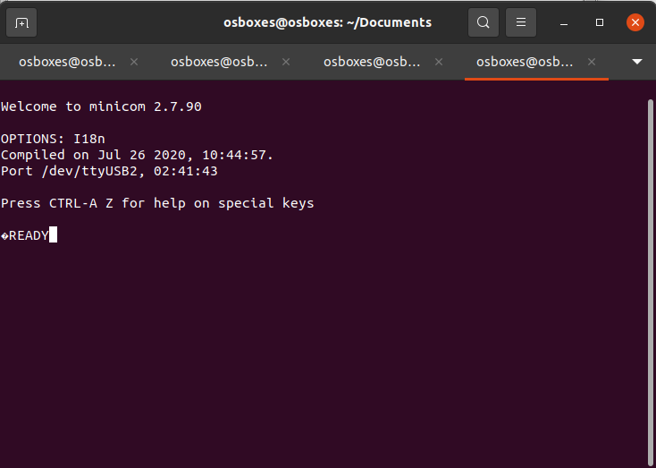
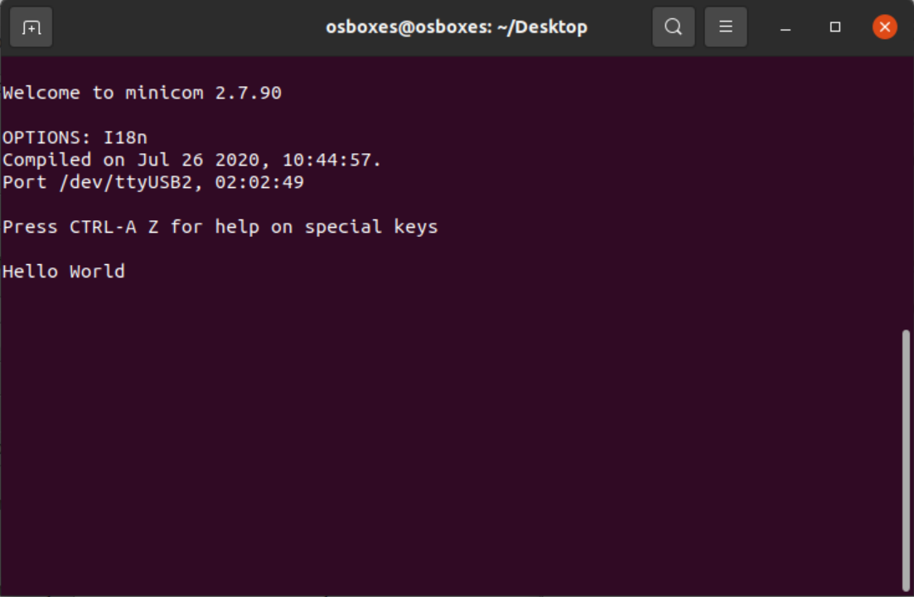
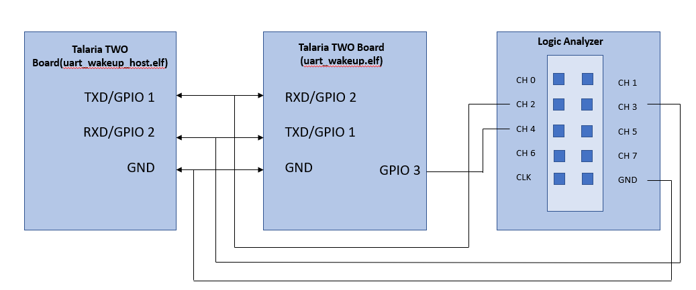

Introduction 
=============

This document describes using the mDNS APIs provided by the mDNS module
in: sdk_x.y/components/mdns. This application demonstrates using these
APIs to advertise and discover the services on the local network.

For more details regarding the features and limitations of mDNS
implementation and APIs, refer document in the following location:
components/mdns/doc/mdns_apiref.pdf.

Code Walkthrough for mDNS
=========================

Application Flow
----------------

mDNS is a protocol that provides DNS like facility to advertise and
discover services in a local area network.

Following are the steps:

1. Connects to a Wi-fi network.

2. Registers to the hostname and services.

3. Acts as a mDNS announce or discovery according to the boot arguments
   passed.

Sample Code Walkthrough 
------------------------

A user-defined data struct is created to store the data of the mDNS:

+-----------------------------------------------------------------------+
| #define APP_NAME "mDNS application"                                   |
|                                                                       |
| #define APP_VERSION "2.0"                                             |
|                                                                       |
| OS_APPINFO {.stack_size = 4096};                                      |
|                                                                       |
| #define INPUT_PARAMETER_SSID "ssid"                                   |
|                                                                       |
| #define INPUT_PARAMETER_PASSPHRASE "passphrase"                       |
|                                                                       |
| #define INPUT_PARAMETER_HOST "host"                                   |
|                                                                       |
| #define INPUT_PARAMETER_URL "url"                                     |
|                                                                       |
| #define INPUT_PARAMETER_PATH "path"                                   |
|                                                                       |
| #define INPUT_PARAMETER_PORT "port"                                   |
|                                                                       |
| #define INPUT_PARAMETER_SECURED "secured"                             |
|                                                                       |
| #define INPUT_PARAMETER_METHOD "method"                               |
|                                                                       |
| #define INPUT_PARAMETER_CA "ca_cert"                                  |
|                                                                       |
| #define INPUT_PARAMETER_POST_LEN "post_len"                           |
|                                                                       |
| #define INPUT_PARAMETER_CLIENT_CERT "client_cert"                     |
|                                                                       |
| #define INPUT_PARAMETER_CLIENT_KEY "client_key"                       |
|                                                                       |
| #define INPUT_PARAMETER_TEST_ITER "test_iterations"                   |
|                                                                       |
| #define INPUT_PARAMETER_USE_CA_BUNDLE "use_ca_bundle"                 |
|                                                                       |
| #define NULL_STR ""                                                   |
|                                                                       |
| struct param_t {                                                      |
|                                                                       |
| const char \*ssid;                                                    |
|                                                                       |
| const char \*passphrase;                                              |
|                                                                       |
| const char \*url;                                                     |
|                                                                       |
| const char \*host;                                                    |
|                                                                       |
| const char \*path;                                                    |
|                                                                       |
| const char \*port;                                                    |
|                                                                       |
| const char \*secured;                                                 |
|                                                                       |
| const char \*ca_cert;                                                 |
|                                                                       |
| const char \*client_cert;                                             |
|                                                                       |
| const char \*client_key;                                              |
|                                                                       |
| const char \*test_iterations;                                         |
|                                                                       |
| const char \*use_ca_bundle;                                           |
|                                                                       |
| };                                                                    |
|                                                                       |
| /\*CA certificate bundle*/                                            |
|                                                                       |
| extern uint8_t ca_bundle_start[] asm("\_binary_ca_bundle_start");     |
|                                                                       |
| extern uint8_t ca_bundle_end[] asm("\_binary_ca_bundle_end");         |
|                                                                       |
| struct param_t param;                                                 |
|                                                                       |
| char default_port[8];                                                 |
|                                                                       |
| char default_secured[8];                                              |
|                                                                       |
| struct os_semaphore app_wcm_lock;                                     |
|                                                                       |
| int wcm_connect_success = 0;                                          |
|                                                                       |
| static char host[128];                                                |
|                                                                       |
| static char path[128];                                                |
+=======================================================================+
+-----------------------------------------------------------------------+

The following boot arguments are passed in this application:

1. SSID and passphrase to connect to the Wi-Fi network.

2. Hostname, service name, service type, proto, port, text key and
   value.

3. SD service type and proto, and action.

+-----------------------------------------------------------------------+
| static int                                                            |
|                                                                       |
| parse_boot_args(void)                                                 |
|                                                                       |
| {                                                                     |
|                                                                       |
| int ret = 0;                                                          |
|                                                                       |
| param.ssid= os_get_boot_arg_str(INPUT_PARAMETER_SSID);                |
|                                                                       |
| param.passphrase= os_get_boot_arg_str(INPUT_PARAMETER_PASSPH);        |
|                                                                       |
| param.hostname= os_get_boot_arg_str(INPUT_PARAMETER_HOST_NAME);       |
|                                                                       |
| param.servicename= os_get_boot_arg_str(INPUT_PARAMETER_SRVC_NAME);    |
|                                                                       |
| param.service_type= os_get_boot_arg_str(INPUT_PARAMETER_SRVC_TYPE);   |
|                                                                       |
| param.proto= os_get_boot_arg_str(INPUT_PARAMETER_PROTO);              |
|                                                                       |
| param.port = os_get_boot_arg_str(INPUT_PARAMETER_PORT);               |
|                                                                       |
| param.txt_key = os_get_boot_arg_str(INPUT_PARAMETER_TXT_KEY);         |
|                                                                       |
| param.txt_val = os_get_boot_arg_str(INPUT_PARAMETER_TXT_VAL);         |
|                                                                       |
| param.sd_srvc_type =                                                  |
| os_get_boot_arg_str(INPUT_PARAMETER_SD_SRVC_TYPE);                    |
|                                                                       |
| param.sd_srvc_proto =                                                 |
| os_get_boot_arg_str(INPUT_PARAMETER_SD_SRVC_PROTO);                   |
|                                                                       |
| param.action = os_get_boot_arg_str(INPUT_PARAMETER_ACTION);           |
+=======================================================================+
+-----------------------------------------------------------------------+

app_wcm_notify_cb() function enables the callbacks.

+-----------------------------------------------------------------------+
| switch(msg->msg_type) {                                               |
|                                                                       |
| case(WCM_NOTIFY_MSG_LINK_UP):                                         |
|                                                                       |
| break;                                                                |
|                                                                       |
| case(WCM_NOTIFY_MSG_LINK_DOWN):                                       |
|                                                                       |
| os_sem_post(&app_wcm_lock);                                           |
|                                                                       |
| break;                                                                |
|                                                                       |
| case(WCM_NOTIFY_MSG_ADDRESS):                                         |
|                                                                       |
| break;                                                                |
|                                                                       |
| case WCM_NOTIFY_MSG_CONNECTED:                                        |
|                                                                       |
| wcm_connect_success = 1;                                              |
|                                                                       |
| os_sem_post(&app_wcm_lock);                                           |
|                                                                       |
| break;                                                                |
|                                                                       |
| }                                                                     |
|                                                                       |
| os_msg_release(msg);                                                  |
|                                                                       |
| }                                                                     |
+=======================================================================+
+-----------------------------------------------------------------------+

To connect to a Wi-Fi network, wcm_create()API from the Wi-Fi Connection
Manager is used. Initially, the Wi-Fi network interface is created using
wcm_create().

+-----------------------------------------------------------------------+
| h = wcm_create(NULL);                                                 |
+=======================================================================+
+-----------------------------------------------------------------------+

..

   wifi_connect_to_network()API, from components library, connects to
   the Wi-Fi network using the AP credentials provided.

+-----------------------------------------------------------------------+
| rval = wifi_connect_to_network(&h, WCM_CONN_WAIT_INFINITE,            |
| &wcm_connect_success);                                                |
|                                                                       |
| if(rval < 0) {                                                        |
|                                                                       |
| os_printf("\\nError: Unable to connect to network\\n");               |
|                                                                       |
| return 0;                                                             |
|                                                                       |
| }                                                                     |
+=======================================================================+
+-----------------------------------------------------------------------+

Here, the data structure mdns_srvc_info_t is used to pass information
about the discovered service such as service instance, protocol, type,
port and IP address. Information is passed through the callback function
provided while calling the mdns_service_discover API from main function.

+-----------------------------------------------------------------------+
| void app_dns_sd_cb(void \*data_ptr,                                   |
|                                                                       |
| const mdns_srvc_info_t \*srvinfo,                                     |
|                                                                       |
| uint32_t status)                                                      |
|                                                                       |
| {                                                                     |
|                                                                       |
| os_print                                                              |
| f("\\n------------------------------------------------------------"); |
|                                                                       |
| os_printf("\\n[APP]%s:Discovered service info:", \__FUNCTION\_\_);    |
|                                                                       |
| os_printf("\\n\\tInstance = %s \\n\\tservice type = %s \\n\\tprotocol |
| = %s\\n\\t"                                                           |
|                                                                       |
| "txt info = %s \\n\\tport = %d \\n\\tipaddr = %x\\n",                 |
|                                                                       |
| srvinfo->instance, srvinfo->srvc_type, srvinfo->protocol,             |
|                                                                       |
| srvinfo->txtInfo, srvinfo->port, srvinfo->ipaddr);                    |
|                                                                       |
| os_printf("\\n");                                                     |
|                                                                       |
| os_print                                                              |
| f("\\n------------------------------------------------------------"); |
+=======================================================================+
+-----------------------------------------------------------------------+

If the action parameter is set to 0, mDNS will register and advertise
the service.

The data structure mdns_hnreg_param_t is used to pass parameters while
registering the Host Name. Set a unique host name for a device by using
mac address. Add domain name as MDNS_LOCAL_DOMAIN and IP address in
little endian format.

+-----------------------------------------------------------------------+
| mdns_hnreg_param_t hn_reg_prm = {0};                                  |
|                                                                       |
| hn_reg_prm.hostname = (!param.hostname)?                              |
|                                                                       |
| (uint8_t \*)"InnophaseDev" : (uint8_t \*)param.hostname;              |
|                                                                       |
| hn_reg_prm.domain = (uint8_t \*)MDNS_LOCAL_DOMAIN;                    |
|                                                                       |
| hn_reg_prm.ipaddr = ntohl(ipaddr);                                    |
+=======================================================================+
+-----------------------------------------------------------------------+

The function mdns_hostname_reg is used for registering the host name of
the interface.

+-----------------------------------------------------------------------+
| mdns_hostname_reg(mc, &hn_reg_prm);                                   |
|                                                                       |
| os_printf("\\n[APP]Host name Reg done");                              |
+=======================================================================+
+-----------------------------------------------------------------------+

The data structure mdns_srvreg_param_t is used to pass the parameters
while registering a service.

+-----------------------------------------------------------------------+
| mdns_srvreg_param_t srv_reg = {0};                                    |
|                                                                       |
| srv_reg.srvc_name = (uint8_t \*)param.servicename;                    |
|                                                                       |
| srv_reg.srvc_type = (uint8_t \*)param.service_type;                   |
|                                                                       |
| srv_reg.srvc_proto = (!param.proto) ?                                 |
|                                                                       |
| (uint8_t \*)"\_tcp": (uint8_t \*)param.proto;                         |
|                                                                       |
| srv_reg.port = (!param.port)? 80 : atoi(param.port);                  |
|                                                                       |
| srv_reg.domain = (uint8_t \*)MDNS_LOCAL_DOMAIN;                       |
+=======================================================================+
+-----------------------------------------------------------------------+

The function mdns_service_register is used for registering the service.
Once registered, response for any matching query will be given
internally.

+-----------------------------------------------------------------------+
| mdns_service_register(mc, &srv_reg);                                  |
|                                                                       |
| os_printf("\\n[APP]Service Reg done");                                |
+=======================================================================+
+-----------------------------------------------------------------------+

The following section provides information on how the discovery of the
service happens when the action parameter is not set to 0.

The data structure mdns_srvcdisc_param_t is used for passing the
parameters while discovering for service of specific type.

+-----------------------------------------------------------------------+
| os_printf("\\n[APP]Discovering Service");                             |
|                                                                       |
| mdns_srvcdisc_param_t sd_param = {0};                                 |
|                                                                       |
| sd_param.srvc_sub_type = NULL;                                        |
|                                                                       |
| sd_param.srvc_type = (!param.sd_srvc_type)?                           |
|                                                                       |
| (uint8_t \*)"\_http": (uint8_t \*)param.sd_srvc_type;                 |
|                                                                       |
| sd_param.srvc_proto =(!param.sd_srvc_proto)?                          |
|                                                                       |
| (uint8_t \*)"\_tcp": (uint8_t \*)param.sd_srvc_proto;                 |
|                                                                       |
| sd_param.domain = (uint8_t \*)MDNS_LOCAL_DOMAIN;                      |
|                                                                       |
| sd_param.scope = MDNS_SCOPE_IPV4_LOCAL;                               |
|                                                                       |
| sd_param.cb = app_dns_sd_cb;                                          |
|                                                                       |
| mdns_service_discover(mc, &sd_param);                                 |
+=======================================================================+
+-----------------------------------------------------------------------+

Running the Application 
========================

Programming Talaria TWO Board with Certificates 
------------------------------------------------

Show File System Contents
~~~~~~~~~~~~~~~~~~~~~~~~~

Click on Show File System Contents to see the current available files in
the file system.

|image1|

Figure 1: Show File System Content

Write Files
~~~~~~~~~~~

Before writing the file(s) into Talaria TWO, user must create a folder
with the name data and place the certificate either directly into the
data or they can create multiple subfolders (for example: data/ or
data/certs/https_client/app ) and place the certificates inside the
sub-directory. The certificate shall be present in the data fs with the
same name as in the boot arguments.

To write files into Talaria TWO File System, use the Download Tool as
shown in Figure 2. After clicking on “Select Path to Write Files”,
select the data directory from the host in which the certificate is
stored and then click on “Write Files” to write the certificate into the
File System.

**Note:** When trying to access a secured web server, keep only the CA
certificate specific to that server in data fs. Do not use bundle of CA
certificates intended for a browser.

|image2|

Figure 2: Write certificates to Talaria TWO

Programming Talaria TWO board with ELF
--------------------------------------

Execute make command to generate out/ folder.

+-----------------------------------------------------------------------+
| sdk_x.y/examples/mdns$ make                                           |
+=======================================================================+
+-----------------------------------------------------------------------+

Program app_mdns.elf (examples/mdns/out/app_mdns.elf) using the Download
tool:

1. Launch the Download tool provided with InnoPhase Talaria TWO SDK.

2. In the GUI window:

   a. Boot Target: Select the appropriate EVK from the drop-down.

   b. ELF Input: Load the app_mdns.elf by clicking on Select ELF File.

   c. AP Options: Pass the SSID and Passphrase to connect to an Access
      Point.

   d. Boot Arguments: Pass the appropriate boot arguments.

   e. Programming: Prog RAM or Prog Flash as per requirement.

For more details on using the Download tool, refer to the document:
UG_Download_Tool.pdf (path: *sdk_x.y/pc_tools/Download_Tool/doc*).

**Note**: x and y refer to the SDK release version. For example:
sdk_2.5/doc.

Using the Application
=====================

Following are the list of boot arguments:

1.  ssid: SSID of the Wi-Fi network to connect to.

2.  passphrase: Passphrase of the network.

3.  hostname: Hostname of the device. For example: “InnoDev”.

4.  service_name: Service name. For example: “Prov”.

5.  service_type: Type of service. For example: "\_http".

6.  proto: Protocol type. For example: "\_tcp" / "\_udp".

7.  port: Get/Post.

8.  txt_key: “key” part of the one key-val pair of txt data.

9.  txt_val: “val” part of the one key-val pair of txt data. Only one
    Key-val pair can be set.

10. sd_srvc_type: Type of service to discover.

11. sd_srvc_proto: Type of protocol to discover.

12. action:

    a. 0 – Register and Advertise a service.

    b. 1 – Discover a service. The combination of sd_srvc_type and
       sd_srvc_proto are used for discovering the service. Providing
       both the parameters is a must for discovering a service.

Example Bootargs for mDNS Service Register and Announce
-------------------------------------------------------

+-----------------------------------------------------------------------+
| ssid=<ssid>,passphrase=<passphrase>,host=Innodev, service_name =Prov, |
| serv                                                                  |
| ice_type=_http,proto=_tcp,port=80,txt_key=path,txt_val=/data,action=0 |
+=======================================================================+
+-----------------------------------------------------------------------+

Console output:

+-----------------------------------------------------------------------+
| Y-BOOT 208ef13 2019-07-22 12:26:54 -0500 790da1-b-7                   |
|                                                                       |
| ROM yoda-h0-rom-16-0-gd5a8e586                                        |
|                                                                       |
| FLASH:PNWWWWWAEBuild $Id: git-34e3eddb8 $                             |
|                                                                       |
| host=Innodev service_name=Prov service_type=_http proto=_tcp port=80  |
| txt_key=path txt_val=/data action=0 np_conf_path=/data/nprofile.json  |
| ssid=InnoPhase_AE passphrase=Inno@1234                                |
|                                                                       |
| $App:git-fc1c5cb4                                                     |
|                                                                       |
| SDK Ver: sdk_2.5                                                      |
|                                                                       |
| MDNS Demo App                                                         |
|                                                                       |
| Application Information:                                              |
|                                                                       |
| ------------------------                                              |
|                                                                       |
| Name : MDNS application                                               |
|                                                                       |
| Version : 1.0                                                         |
|                                                                       |
| Build Date : Jul 23 2022                                              |
|                                                                       |
| Build Time : 03:55:09                                                 |
|                                                                       |
| Heap Available: 333 KB (341912 Bytes)                                 |
|                                                                       |
| [APP]Bootparams:                                                      |
|                                                                       |
| hostname=<null>                                                       |
|                                                                       |
| port = 80                                                             |
|                                                                       |
| servicename = Prov                                                    |
|                                                                       |
| service_type = \_http                                                 |
|                                                                       |
| proto = \_tcp                                                         |
|                                                                       |
| key = path                                                            |
|                                                                       |
| val = /data                                                           |
|                                                                       |
| sd_service_type = <null>                                              |
|                                                                       |
| sd_service_proto = <null>                                             |
|                                                                       |
| [APP]Bootparams check done....ret = 0                                 |
|                                                                       |
| addr e0:69:3a:00:2c:3c                                                |
|                                                                       |
| Connecting to added network : InnoPhase_AE                            |
|                                                                       |
| [0.814,996] CONNECT:98:da:c4:73:b7:76 Channel:11 rssi:-35 dBm         |
|                                                                       |
| wcm_notify_cb to App Layer - WCM_NOTIFY_MSG_LINK_UP                   |
|                                                                       |
| wcm_notify_cb to App Layer - WCM_NOTIFY_MSG_ADDRESS                   |
|                                                                       |
| [0.878,041] MYIP 192.168.0.130                                        |
|                                                                       |
| [0.878,320] IPv6 [fe80::e269:3aff:fe00:2c3c]-link                     |
|                                                                       |
| wcm_notify_cb to App Layer - WCM_NOTIFY_MSG_CONNECTED                 |
|                                                                       |
| Connected to added network : InnoPhase_AE                             |
|                                                                       |
| [APP]Starting Mdns                                                    |
|                                                                       |
| [APP]Mdns init done                                                   |
|                                                                       |
| [APP]Advertising Service                                              |
|                                                                       |
| [APP]WCM interface ip addr = 8200a8c0                                 |
|                                                                       |
| [APP]Host name Reg done                                               |
|                                                                       |
| [APP]Service Reg done                                                 |
|                                                                       |
| [APP]Hostname and Service Announce done                               |
|                                                                       |
| [APP]Service is Now discoverable by other devices in the N/w          |
+=======================================================================+
+-----------------------------------------------------------------------+

Once mDNS Service Register and Announce is started, start any of the
discovery apps and scan for the services that are announced by Talaria
TWO. Following are some of the options for the user for the service
discovery:

**Option 1:** Mobile application: mDNS Discovery

1. Install and launch the mDNS Discovery app on the mobile.

..

   |image3|

Figure : mDNS Discovery app

2. Add the service type i.e., HTTP in the search option, enable TCP
   which is the proto and click on Search.

|image4|

Figure : Add service type

3. Now the announced service from Talaria TWO can be found as shown in
   Figure 5.

..

   |image5|

Figure : Discovered service

**Option 2**: Command line on Windows OS

Prerequisite: Install the Bonjour Browser from the following link to run
the command line on Windows OS:
https://hobbyistsoftware.com/bonjourbrowser.

1. Service discovery can be done from a Windows command line, using the
   dns-sd command to browse for services that are being broadcast on the
   local network by Talaria TWO.

..

   |image6|

Figure : Service discovery from Windows command line

**Option 3**: User can also use two Talaria TWO modules: One for service
register and announce from section 6.1 and one more for service
discovery from section 6.2 to load the application. On the service
discovery console, the announced service can be observed.

Example Bootargs for mDNS Service Discovery
-------------------------------------------

+-----------------------------------------------------------------------+
| ssid=<ssid>,passphrase=<passphrase>, sd_srvc_type=_http,              |
| sd_srvc_proto=_tcp, action=1                                          |
+=======================================================================+
+-----------------------------------------------------------------------+

Console output:

+-----------------------------------------------------------------------+
| UART:SNWWWWAE                                                         |
|                                                                       |
| 4 DWT comparators, range 0x8000                                       |
|                                                                       |
| Build $Id: git-f072f2582 $                                            |
|                                                                       |
| hio.baudrate=921600                                                   |
|                                                                       |
| flash: Gordon ready!                                                  |
|                                                                       |
| UART:SNWWWWWAE4 DWT comparators, range 0x8000                         |
|                                                                       |
| Build $Id: git-f072f2582 $                                            |
|                                                                       |
| sd_srvc_type=_http sd_srvc_proto=_tcp action=1                        |
| np_conf_path=/data/nprofile.json ssid=InnoPhase passphrase=43083191   |
|                                                                       |
| $App:git-9cd56f11                                                     |
|                                                                       |
| SDK Ver: sdk_2.5alpha                                                 |
|                                                                       |
| MDNS Demo App                                                         |
|                                                                       |
| Application Information:                                              |
|                                                                       |
| ------------------------                                              |
|                                                                       |
| Name : MDNS application                                               |
|                                                                       |
| Version : 1.0                                                         |
|                                                                       |
| Build Date : Jul 4 2022                                               |
|                                                                       |
| Build Time : 11:29:41                                                 |
|                                                                       |
| Heap Available: 329 KB (337304 Bytes)                                 |
|                                                                       |
| [APP]Bootparams:                                                      |
|                                                                       |
| hostname=<null>                                                       |
|                                                                       |
| port = <null>                                                         |
|                                                                       |
| servicename = <null>                                                  |
|                                                                       |
| service_type = <null>                                                 |
|                                                                       |
| proto = <null>                                                        |
|                                                                       |
| key = <null>                                                          |
|                                                                       |
| val = <null>                                                          |
|                                                                       |
| sd_service_type = \_http                                              |
|                                                                       |
| sd_service_proto = \_tcp                                              |
|                                                                       |
| [APP]Bootparams check done....ret = 0                                 |
|                                                                       |
| addr e0:69:3a:00:13:90                                                |
|                                                                       |
| Connecting to added network : InnoPhase                               |
|                                                                       |
| [2.239,308] CONNECT:00:5f:67:cd:c5:a6 Channel:11 rssi:-50 dBm         |
|                                                                       |
| wcm_notify_cb to App Layer - WCM_NOTIFY_MSG_LINK_UP                   |
|                                                                       |
| wcm_notify_cb to App Layer - WCM_NOTIFY_MSG_ADDRESS                   |
|                                                                       |
| [2.976,703] MYIP 192.168.0.106                                        |
|                                                                       |
| [2.976,751] IPv6 [fe80::e269:3aff:fe00:1390]-link                     |
|                                                                       |
| wcm_notify_cb to App Layer - WCM_NOTIFY_MSG_CONNECTED                 |
|                                                                       |
| Connected to added network : InnoPhase                                |
|                                                                       |
| [APP]Starting Mdns                                                    |
|                                                                       |
| [APP]Mdns init done                                                   |
|                                                                       |
| [APP]Discovering Service                                              |
|                                                                       |
| ------------------------------------------------------------          |
|                                                                       |
| [APP]app_dns_sd_cb:Discovered service info:                           |
|                                                                       |
| Instance = HP Smart Tank 530 series [F66927]                          |
|                                                                       |
| service type = \_http                                                 |
|                                                                       |
| protocol = \_tcp                                                      |
|                                                                       |
| txt info =                                                            |
|                                                                       |
| port = 80                                                             |
|                                                                       |
| ipaddr = 0                                                            |
|                                                                       |
| ------------------------------------------------------------          |
|                                                                       |
| ------------------------------------------------------------          |
+=======================================================================+
+-----------------------------------------------------------------------+

.. |image1| image:: media/image1.png
   :width: 6.41744in
   :height: 2.7899in
.. |image2| image:: media/image2.png
   :width: 5.11811in
   :height: 4.02276in
.. |image3| image:: media/image3.png
   :width: 3.14961in
   :height: 6.39128in

