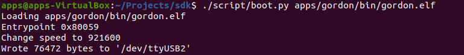
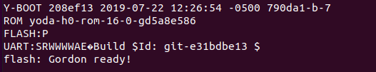

Primary Scripts for CLI Operations
==================================

Written in the Python language, three script files for executing CLI
operations are provided in the SDK for the user’s convenience that can
be used for evaluation, testing, and development of Talaria TWO based
systems.

1. sdk/script/boot.py

2. sdk/script/flash.py

3. sdk/script/storage.py

Based on the arguments provided command line, the scripts performs
various functions.

boot.py
-------

Following are the basic functionalities of boot.py:

1. Load app to memory (RAM) on Talaria TWO module:

This script reads the application (in ELF format) provided in command
line, along with the arguments to load the app to Talaria TWO in its
memory, via the host and device interface. USB is used only in the
evaluation, development or testing phase.

2. Write app to flash on Talaria TWO module:

This script reads the application (in ELF format) provided in command
line, along with the arguments to write the app to Talaria TWO in its
flash, with the default handling by the script, via the host and device
interface. USB is used only in the evaluation, development or testing
phase.

3. Create .img file from ELF file

This script reads the name of the app file (in ELF format) provided in
command line to generate the .img file for flash download.

**Note**: Refer section `Using boot.py <#_Using_boot.py>`__ for more
details.

flash.py
--------

Script to read and write to the flash, which requires gordon.elf
application.

This section provides details on script usage and prerequisites.

**Note**: Refer section `Using flash.py <#_Using_flash.py>`__ for more
details.

**Prerequisite/precondition to run flash.py**:

4. Program Talaria TWO with the Gordon app (gordon.elf)

5. gordon.elf application is available from the following folder:
   sdk/apps/gordon/bin/gordon.

6. Gordon is an application that enables access to Talaria TWO's flash
   over Host I/O, including partitioning and filesystem access and raw
   reads/writes to flash.

7. Boot.py script is used to program the gordon.elf onto Talaria TWO.
   Execute the following command to accomplish the same:

+-----------------------------------------------------------------------+
| ./script/boot.py [device] <path>/gordon.elf                           |
+=======================================================================+
+-----------------------------------------------------------------------+

|image1|

   Figure 1: gordon.elf - teminal output

|Text Description automatically generated|

   Figure 2: gordon.elf - console output

**Load app .img file to flash on Talaria TWO module:**

This script reads the name of the app file (in .img format) provided in
command line, along with the arguments to write the app to Talaria TWO
in its flash with the write command and user-specified location (in
hex), via the host and device interface (USB/Serial).

Create image file (.img) from the ELF file of an application:

+-----------------------------------------------------------------------+
| ./script/boot.py –output <output_path>/app.img <elf_path>/app.elf     |
+=======================================================================+
+-----------------------------------------------------------------------+

**Read/Write Partition Table on module:**

This script reads from/writes the partition table on the device (in the
json file).

storage.py
----------

Storage file access utility. Following are the basic file system access
functionalities of storage.py:

1. Display the file system contents

2. Read file from the device to store in the location on host

3. Write file from the host to the device

4. Write the network config file (**.json file**) into Talaria TWO file
   system to configure L2 parameters such as SSID, passphrase, BSSID,
   security type and certificates for EAP authentication

Refer section `Storage Data & File: Read/Write <#_Storage_Data_&>`__ for
the details.

