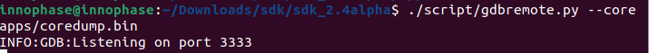
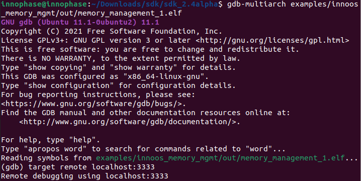
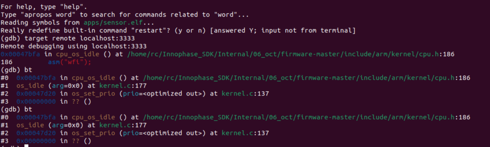
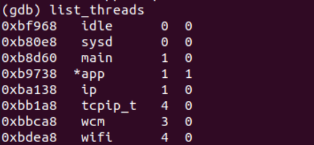
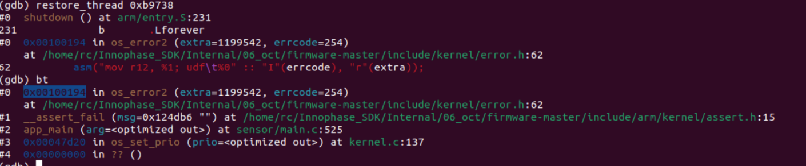
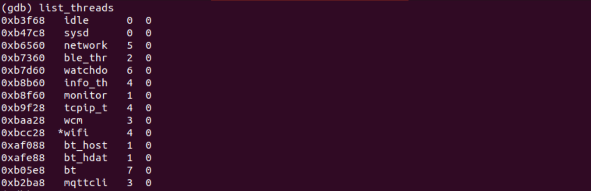
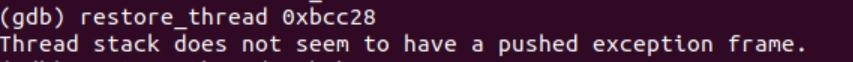
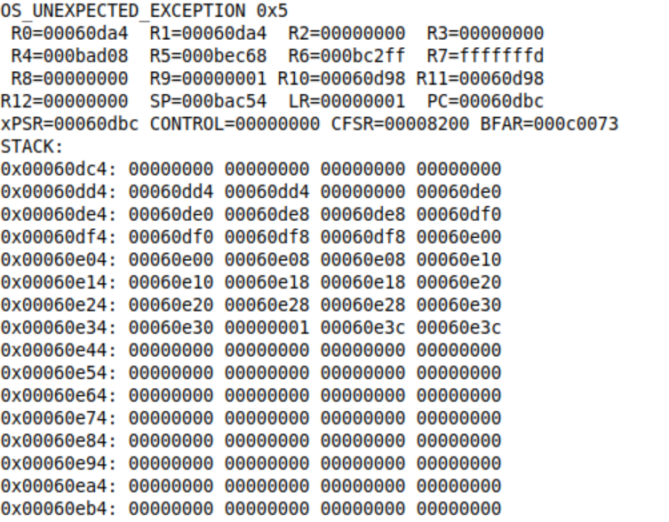
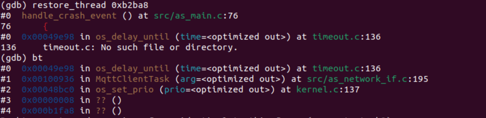

Analyzing the Coredump
======================

The coredump analysis will be done after capturing the coredump file to
identify the section of the code that caused the crash. The following
procedure describes the core dump analysis.

1. Start GDB server with the coredump file from the SDK directory:

+-----------------------------------------------------------------------+
| ./script/gdbremote.py --core coredump.bin                             |
+=======================================================================+
+-----------------------------------------------------------------------+

and the GDB will start listening on port 3333.

|image1|

Figure 3: GDB listening on port 3333

2. Start GDB to inspect the coredump in a separate terminal from the SDK
   directory:

+-----------------------------------------------------------------------+
| gdb-multiarch apps/my-program.elf                                     |
+=======================================================================+
+-----------------------------------------------------------------------+

and the GDB prompt is observed.

3. In the GDB prompt execute the following command:

+-----------------------------------------------------------------------+
| (gdb) target remote localhost:3333                                    |
+=======================================================================+
+-----------------------------------------------------------------------+

The following output is observed once the remote debugging has started.

|image2|

Figure 4: Remote debugging

Capturing a Back Trace 
-----------------------

Backtrace shows the point of crash which helps identify the problem. It
shows the contents of the stack. In this section, the analysis of the
coredump is done for two applications that has crashed for different
reasons.

**Sample application-1:**

1. Execute the following instruction:

+-----------------------------------------------------------------------+
| (gdb) bt                                                              |
+=======================================================================+
+-----------------------------------------------------------------------+

The bt instructions prints the content of the stack.

|Text Description automatically generated|

Figure 5: Contents of the stack

2. Execute the instruction list_thread to display the address of the
   thread and the last thread executed prior to the crash. In the sample
   app sensor.elf, a thread with the name app is executed prior to the
   crash. The thread app is indicated with \* mark as shown in Figure 6
   when the list_thread instruction is executed.

|Text Description automatically generated with medium confidence|

Figure 6: app - list_thread instruction

3. The address of the app thread of the sensor application as shown in
   Figure 6 is 0xb9738. Now, resolve thread <address of the thread>
   instruction is executed to point to the location of the instruction
   in the code that was executed just before the crash.

|image3|

Figure 7: Resolve thread instruction

4. Last instruction executed was from the file sensor/main.c at line
   number 525. An assert function was called to crash the application at
   this point.

This helps identify the problem by pointing to the last instruction
executed prior to the crash that could be the reason for the crash.

**Sample application 2:**

1. The coredump for the sample application 2 is captured using the same
   procedure described in section: *Generate Coredump from within GDB*.

2. The output of list_threads instruction for the sample application 2
   displays the following:

|Shape, rectangle Description automatically generated|

Figure 8: list_threads output

3. The last thread executed just before the crash is wifi as shown in
   Figure 8. However, when the restore_thread command is executed, the
   following output is observed:

|image4|

Figure 9: restore_thread output

Looking back at the crash log captured in the download tool’s console,
The PC and BFAR values shows that address 0x60dbc (callback from the
app) tries to access address 0xc0073 (outside RAM area). This is done in
an interrupt context and is the reason why the list_threads do not
provide the right information running in process context.

|Table Description automatically generated|

Figure 10: Download tool - crash log

4. When the restore_thread is executed for a different thread – mqttcli,
   the following output is observed:

|image5|

Figure 11: restore_thread for - mqttcli

It is observed that there is no message Thread stack does not seem to
have a pushed exception frame when the restore_thread command is
executed. This is checked on the mqttcli thread as this thread is
receiving the data from a callouts handler that is executing in the
interrupt context. After checking the mqttcli thread, it is observed
that the reason for the crash is because a pointer is accessed and freed
with out allocating any memory for it.

