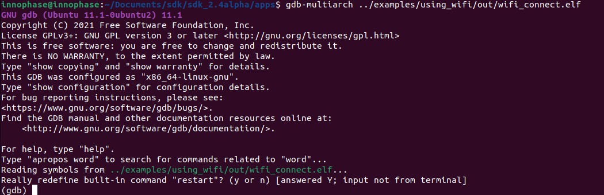

Connecting JTAG/SWD to Talaria TWO module
=========================================

Talaria TWO device allows programming and debugging through either of
JTAG or SWD interfaces. This section describes the hardware connections
between a debugger and Talaria TWO device.

**Note**: The Talaria TWO EVB already has the required hardware support
for JTAG.

|Chart Description automatically generated with medium confidence|

Figure 1: Hardware connections - JTAG

Pins 18,19,20 and 21 of Talaria TWO module are used for JTAG. However,
these pins can also be used as GPIOs for the application by disabling
the JTAG in the application.

Similar to JTAG, SWD also allows programming and debugging on Talaria
TWO but with a reduced hardware connection as shown in Figure 2.

|A diagram of a computer Description automatically generated|

Figure 2: Hardware connections - SWD

For more information on GDB commands, refer:
https://sourceware.org/gdb/current/onlinedocs/gdb/.

Procedure to Debug using GDB through JTAG
-----------------------------------------

This section provides details regarding debugging the application
through JTAG. Make the connection between the debugger and Talaria TWO
device as shown in Figure 3.

1. Open the SDK folder in Ubuntu terminal and type the following command
   to start OpenOCD:

+-----------------------------------------------------------------------+
| openocd -s ./conf -f ftdi.cfg -f t2.cfg                               |
+=======================================================================+
+-----------------------------------------------------------------------+

Console output:

|A computer screen with white and blue text Description automatically
generated|

Figure 3: Running OpenOCD for JTAG

2. In a separate terminal, run the following command from the apps
   directory. In this directory, there is a .gdbinit file that
   configures the GDB. Here, the RAM portion of the ELF gets loaded.

+-----------------------------------------------------------------------+
| gdb-multiarch ../examples/using_wifi/out/wifi_connect.elf             |
+=======================================================================+
+-----------------------------------------------------------------------+

Console output:

|A computer screen shot of a program Description automatically
generated|

Figure 4: Running GDB for JTAG

Follow the procedure mentioned in section: **Error! Reference source not
found.** to execute the GDB command.

Procedure to Debug using GDB through SWD
----------------------------------------

This section provides details regarding debugging the application
through SWD. Make the connection between the debugger and Talaria TWO
device as shown in Figure 2.

1. Open the SDK folder in Ubuntu terminal and type the following command
   to start OpenOCD:

+-----------------------------------------------------------------------+
| openocd -s ./conf -f ftdi_swd.cfg -f t2_swd.cfg                       |
+=======================================================================+
+-----------------------------------------------------------------------+

Console output:

|A computer screen shot of a computer program Description automatically
generated|

Figure 5: Running OpenOCD for JTAG

2. In a separate terminal, run the following command from the apps
   directory. In this directory, there is a .gdbinit file that
   configures the GDB. Here, the RAM portion of the ELF gets loaded.

+-----------------------------------------------------------------------+
| gdb-multiarch ../examples/using_wifi/out/wifi_connect.elf             |
+=======================================================================+
+-----------------------------------------------------------------------+

Console output:

|A computer screen shot of a program Description automatically
generated|

Figure 6: Running GDB for JTAG

Follow the procedure mentioned in section: **Error! Reference source not
found.** to run the GDB commands.

.. |Chart Description automatically generated with medium confidence| image:: media/image1.png
   :width: 3.93701in
   :height: 2.09164in
.. |A diagram of a computer Description automatically generated| image:: media/image2.png
   :width: 3.8519in
   :height: 2.31114in
.. |A computer screen with white and blue text Description automatically generated| image:: media/image3.png
   :width: 6.29921in
   :height: 2.25143in

.. |A computer screen shot of a computer program Description automatically generated| image:: media/image5.png
   :width: 6.29921in
   :height: 2.36147in
