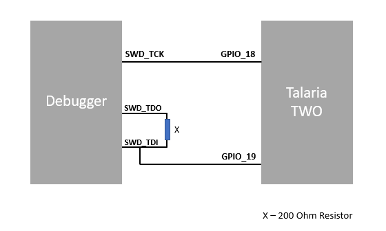

Procedure to Debug using GDB
============================

Following is the procedure to debug the VM-based applications using GDB:

1. Open the SDK folder in Ubuntu terminal and type the following command
   to start OpenOCD:

+-----------------------------------------------------------------------+
| sudo openocd -s ./conf -f ftdi.cfg -f t2.cfg                          |
+=======================================================================+
+-----------------------------------------------------------------------+

..

   Console output:

   |image1|

Figure 3: Starting openOCD

2. In a separate terminal, flash the virtual image from the SDK
   directory.

..

   For example: Consider wifi_connect.elf.

+-----------------------------------------------------------------------+
| ./script/boot.py --reset=evk42_bl --speed=2457600 --gdb               |
| examples/using_wifi/out/wifi_connect.elf                              |
+=======================================================================+
+-----------------------------------------------------------------------+

..

   **Note**: For the GDB to work, ELF needs to be loaded. By default,
   the SDK package contains ELF files in the bin folder (which are
   stripped ELF files). Hence, user needs to build the sample
   application, generate the ELF file (by default, it gets generated in
   the out folder) and load this ELF for debugging.

   Execute make for using_wifi example application
   (sdk_2.4/examples/using_wifi) to generate the ELFs under the out
   folder.

   |image2|

Figure 4: make command output for using_wifi

   Following is the output for a sample application wifi_connect.elf.
   The total number of bytes displayed in Figure 5 will vary with the
   ELF of the application being flashed.

   |image3|

Figure 5: Flashing the application from SDK directory

   .gdbinit initialization file contains the information on Talaria
   TWO’s memory regions and the required scripts of the GDB sources.
   gdbinit file is present under the apps folder. To start the GDB
   session, gdb-multiarch should be started from this folder.

   Command line method of configuring the gdbinit file

   GDB method relies on the GDB scripts. Initially, GDB needs to be
   configured to allow auto-load.

+-----------------------------------------------------------------------+
| echo "set auto-load safe-path /" > ~/.gdbinit                         |
+=======================================================================+
+-----------------------------------------------------------------------+

..

   Manual method of configuring the gdbinit file:

   If there are any warnings as shown in Figure 6, the gdb-multiarch
   does not work for GDB commands. Hence, create a file named gdbinit in
   the home directory to allow auto-load.

|image4|

Figure 6: Warning for .gdbinit file

   In the created gdbinit file add the following path:

   add-auto-load-safe-path/home/innophase/Downloads/sdk/sdk_2.4/apps/.gdbinit.

|image5|

Figure 7: Configuring the gdbinit file

Start the GDB Session 
----------------------

In a separate terminal, run the following command from the sdk_x.y/apps
directory. In this directory, there is a .gdbinit file that configures
the GDB. Here, the RAM portion of the ELF gets loaded.

**Note**: x and y in sdk_x.y refer to the SDK release version.

+-----------------------------------------------------------------------+
| gdb-multiarch ../examples/using_wifi/out/wifi_connect.elf             |
+=======================================================================+
+-----------------------------------------------------------------------+

Console output:

|image6|

Figure 8: Running GDB

1. Connect to OpenOCD by running ocd in the GDB prompt.

+-----------------------------------------------------------------------+
| ocd                                                                   |
+=======================================================================+
+-----------------------------------------------------------------------+

2. Set a break point at main:

+-----------------------------------------------------------------------+
| b main                                                                |
+=======================================================================+
+-----------------------------------------------------------------------+

3. Run the application by executing:

+-----------------------------------------------------------------------+
| R                                                                     |
+=======================================================================+
+-----------------------------------------------------------------------+

4. The information on the break points set can be seen by issuing:

+-----------------------------------------------------------------------+
| info b                                                                |
+=======================================================================+
+-----------------------------------------------------------------------+

5. A break point at a line number of a particular source file can be set
   using:

+-----------------------------------------------------------------------+
| b <filename>: <linenum>                                               |
+=======================================================================+
+-----------------------------------------------------------------------+

6. If the line to be executed is a function call, GDB will step into
   that function and start executing its code one line at a time.

+-----------------------------------------------------------------------+
| s                                                                     |
+=======================================================================+
+-----------------------------------------------------------------------+

7. If the entire function needs to be executed with one keypress, type
   next or n.

+-----------------------------------------------------------------------+
| next                                                                  |
+=======================================================================+
+-----------------------------------------------------------------------+

8. Continue running the program (after stopping, for example at a
   breakpoint).

+-----------------------------------------------------------------------+
| continue                                                              |
+=======================================================================+
+-----------------------------------------------------------------------+

9. Step out is the operation that resumes execution after the function
   the program is executing terminates. The debugger will stop at the
   statement after the function call.

+-----------------------------------------------------------------------+
| finish                                                                |
+=======================================================================+
+-----------------------------------------------------------------------+

Example 1: Following is the output while debugging the wifi_connect.elf
using GDB:

+-----------------------------------------------------------------------+
| (gdb) ocd                                                             |
|                                                                       |
| 0x00023f36 in ?? ()                                                   |
|                                                                       |
| (gdb) b main                                                          |
|                                                                       |
| Breakpoint 1 at 0x100020: file wifi_connect/main.c, line 23.          |
|                                                                       |
| Note: automatically using hardware breakpoints for read-only          |
| addresses.                                                            |
|                                                                       |
| (gdb) R                                                               |
|                                                                       |
| JTAG tap: talaria_two.cpu tap/device found: 0x4ba00477 (mfg: 0x23b    |
| (ARM Ltd), part: 0xba00, ver: 0x4)                                    |
|                                                                       |
| target halted due to debug-request, current mode: Thread              |
|                                                                       |
| xPSR: 0x01000000 pc: 0x00020f90 msp: 0x00041a78                       |
|                                                                       |
| Loading section .text, size 0x1c538 lma 0x42000                       |
|                                                                       |
| Loading section .data, size 0x490 lma 0x5e538                         |
|                                                                       |
| Loading section .virt, size 0x24658 lma 0x2000000                     |
|                                                                       |
| Start address 0x0004ea1e, load size 266272                            |
|                                                                       |
| Transfer rate: 71 KB/sec, 14014 bytes/write.Breakpoint 1, main () at  |
| wifi_connect/main.c:23                                                |
|                                                                       |
| 23 const char \*ssid = os_get_boot_arg_str("ssid");                   |
|                                                                       |
| (gdb) info b                                                          |
|                                                                       |
| Num Type Disp Enb Address What                                        |
|                                                                       |
| 1 breakpoint keep y 0x00100020 in main at wifi_connect/main.c:23      |
|                                                                       |
| breakpoint already hit 1 time                                         |
|                                                                       |
| (gdb) del 1                                                           |
|                                                                       |
| (gdb) info b                                                          |
|                                                                       |
| No breakpoints or watchpoints.                                        |
|                                                                       |
| (gdb) b main.c:29                                                     |
|                                                                       |
| Breakpoint 2 at 0x10003c: file wifi_connect/main.c, line 29.          |
|                                                                       |
| (gdb) R                                                               |
|                                                                       |
| JTAG tap: talaria_two.cpu tap/device found: 0x4ba00477 (mfg: 0x23b    |
| (ARM Ltd), part: 0xba00, ver: 0x4)                                    |
|                                                                       |
| target halted due to debug-request, current mode: Thread              |
|                                                                       |
| xPSR: 0x01000000 pc: 0x00020f90 msp: 0x00041a78                       |
|                                                                       |
| Loading section .text, size 0x1c538 lma 0x42000                       |
|                                                                       |
| Loading section .data, size 0x490 lma 0x5e538                         |
|                                                                       |
| Loading section .virt, size 0x24658 lma 0x2000000                     |
|                                                                       |
| Start address 0x0004ea1e, load size 266272                            |
|                                                                       |
| Transfer rate: 71 KB/sec, 14014 bytes/write.Breakpoint 2, main () at  |
| wifi_connect/main.c:29                                                |
|                                                                       |
| 29 os_printf("Need to specify ssid and passphrase boot                |
| arguments\\n");                                                       |
|                                                                       |
| (gdb)                                                                 |
+=======================================================================+
+-----------------------------------------------------------------------+

Example 2 : Following is the output while debugging the wcma.elf using
GDB:

+-----------------------------------------------------------------------+
| (gdb) ocd                                                             |
|                                                                       |
| 0x00023f36 in ?? ()                                                   |
|                                                                       |
| (gdb) b wcma_test.c:73                                                |
|                                                                       |
| Breakpoint 1 at 0x10038c: file src/wcma_test.c, line 99.              |
|                                                                       |
| Note: automatically using hardware breakpoints for read-only          |
| addresses.                                                            |
|                                                                       |
| (gdb) R                                                               |
|                                                                       |
| JTAG tap: talaria_two.cpu tap/device found: 0x4ba00477 (mfg: 0x23b    |
| (ARM Ltd), part: 0xba00, ver: 0x4)                                    |
|                                                                       |
| target halted due to debug-request, current mode: Thread              |
|                                                                       |
| xPSR: 0x01000000 pc: 0x00020f90 msp: 0x00041a78                       |
|                                                                       |
| Loading section .text, size 0x19f78 lma 0x42000                       |
|                                                                       |
| Loading section .data, size 0x470 lma 0x5bf78                         |
|                                                                       |
| Loading section .virt, size 0x1bcb4 lma 0x2000000                     |
|                                                                       |
| Start address 0x0004cb8e, load size 221340                            |
|                                                                       |
| Transfer rate: 58 KB/sec, 13833 bytes/write.                          |
|                                                                       |
| Breakpoint 1, wcma_thread (arg=<optimized out>) at src/wcma_test.c:99 |
|                                                                       |
| 99 wcma_scan_retry(h, 3, &ap_manager);                                |
|                                                                       |
| (gdb) s                                                               |
|                                                                       |
| wcma_scan_retry (handle=0xbf8b0, retries=retries@entry=3,             |
| manager=manager@entry=0x5c3e8 <ap_manager>) at src/wcma_test.c:318    |
|                                                                       |
| 318 scan_result = os_alloc(max_nets \* sizeof(void \*));              |
|                                                                       |
| (gdb) b wcma_test.c:109                                               |
|                                                                       |
| Breakpoint 2 at 0x1003a8: file src/wcma_test.c, line 109.             |
|                                                                       |
| (gdb) R                                                               |
|                                                                       |
| JTAG tap: talaria_two.cpu tap/device found: 0x4ba00477 (mfg: 0x23b    |
| (ARM Ltd), part: 0xba00, ver: 0x4)                                    |
|                                                                       |
| target halted due to debug-request, current mode: Thread              |
|                                                                       |
| xPSR: 0x01000000 pc: 0x00020f90 msp: 0x00041a78                       |
|                                                                       |
| Loading section .text, size 0x19f78 lma 0x42000                       |
|                                                                       |
| Loading section .data, size 0x470 lma 0x5bf78                         |
|                                                                       |
| Loading section .virt, size 0x1bcb4 lma 0x2000000                     |
|                                                                       |
| Start address 0x0004cb8e, load size 221340                            |
|                                                                       |
| Transfer rate: 58 KB/sec, 13833 bytes/write.                          |
|                                                                       |
| Breakpoint 1, wcma_thread (arg=<optimized out>) at src/wcma_test.c:99 |
|                                                                       |
| 99 wcma_scan_retry(h, 3, &ap_manager);                                |
|                                                                       |
| (gdb) info b                                                          |
|                                                                       |
| Num Type Disp Enb Address What                                        |
|                                                                       |
| 1 breakpoint keep y 0x0010038c in wcma_thread at src/wcma_test.c:99   |
|                                                                       |
| breakpoint already hit 2 times                                        |
|                                                                       |
| 2 breakpoint keep y 0x001003a8 in wcma_thread at src/wcma_test.c:109  |
|                                                                       |
| (gdb) continue                                                        |
|                                                                       |
| Continuing.                                                           |
|                                                                       |
| Breakpoint 2, wcma_thread (arg=<optimized out>) at                    |
| src/wcma_test.c:109                                                   |
|                                                                       |
| 109 if(connection_status == AP_DISCONNECTED && reconnect_next_ap)     |
|                                                                       |
| (gdb) next                                                            |
|                                                                       |
| 116 if((os_systime() - last_disconnect_time) > 35000000) /\* 35       |
| seconds \*/                                                           |
+=======================================================================+
+-----------------------------------------------------------------------+

.. |image4| image:: media/image4.png
   :width: 6.69291in
   :height: 2.25822in

