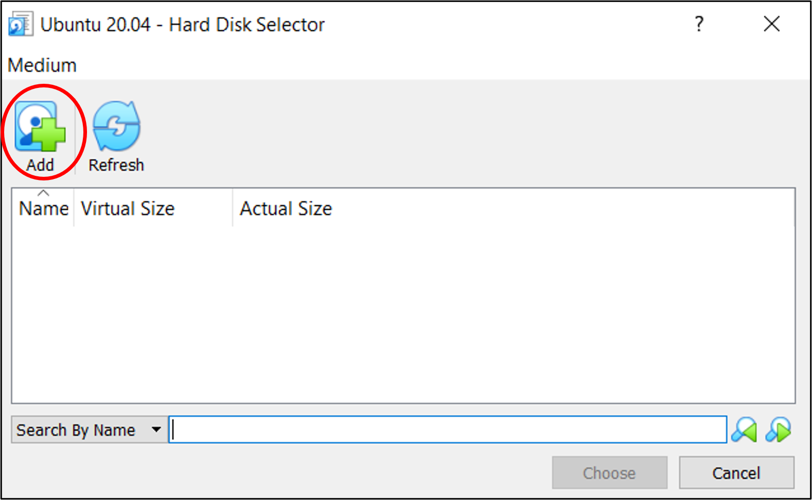
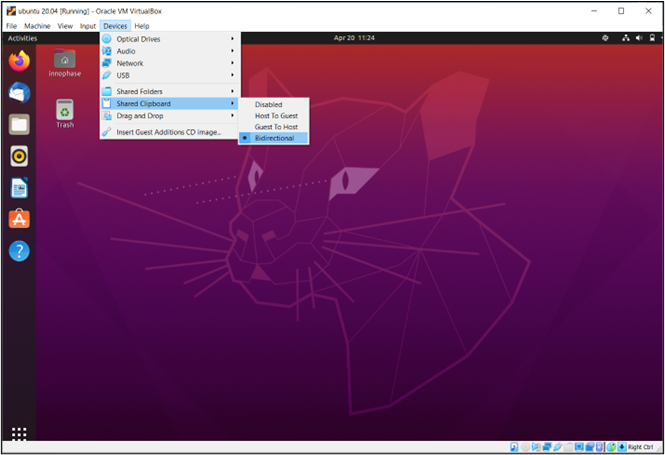
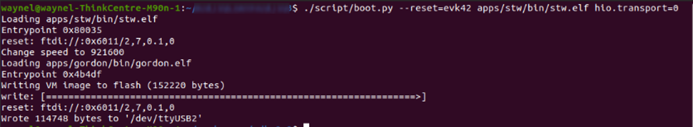

.. _env setup for linux - software installation:

Software Installation
=====================

VirtualBox Ubuntu 20.04
-----------------------

**Downloading the VirtualBox Ubuntu Image**
~~~~~~~~~~~~~~~~~~~~~~~~~~~~~~~~~~~~~~~~~~~

Navigate to https://www.osboxes.org/ubuntu/ and download the Ubuntu
20.04 image for VirtualBox:

|image1|

.. rst-class:: imagefiguesclass
Figure 1: Ubuntu VirtualBox image

Installing 7-Zip
~~~~~~~~~~~~~~~~

The downloaded file Ubuntu-20.04-VB-64bit is a 7-Zip archive containing
the Ubuntu VirtualBox image. 7- Zip will need to be installed to extract
the image. If you already have 7-Zip installed, skip to the next
section: *Extracting the Ubuntu Image*.

Navigate to https://www.7-zip.org/ and download the 7-Zip installer:

|image2|

.. rst-class:: imagefiguesclass
Figure 2: 7-Zip installer download

Run the downloaded .exe and follow the prompts to install 7-Zip.

Extracting the Ubuntu Image
~~~~~~~~~~~~~~~~~~~~~~~~~~~

With 7-Zip installed, right click on Ubuntu-20.04-VB-64bit.7z from the
downloads within Windows Explorer and select 7-Zip –> Extract Files:

|image3|

.. rst-class:: imagefiguesclass
Figure 3:To extract the vdi files

Create a path in the D drive to store the VDI file and add the path from
drop down menu or from the tab (|image4|), in this case the path is
D:\\Innophase\\VirtualBox VMs

|image5|

.. rst-class:: imagefiguesclass
Figure 4: Extracting the Ubuntu VirtualBox image to D drive path

This will create a folder containing Ubuntu 20.04 (64bit), the Ubuntu
20.04 VirtualBox disk image (VDI) file.

|image6|

.. rst-class:: imagefiguesclass
Figure 5: Extracted VDI file

Installing VirtualBox
~~~~~~~~~~~~~~~~~~~~~

1. Navigate to https://www.virtualbox.org/wiki/Downloads and download
   VirtualBox 6.1.18 for Windows hosts:

..

   |image7|

.. rst-class:: imagefiguesclass
Figure 6: VirtualBox binary download

2. Run the downloaded.exe and follow the prompts to install VirtualBox.
   Ensure VirtualBox USB Support is selected (this is the default).

..

   |image8|

.. rst-class:: imagefiguesclass
Figure 7: Leave VirtualBox USB Support enabled

3. Follow the rest of the prompts to complete installation.

Setting up the Virtual Machine
~~~~~~~~~~~~~~~~~~~~~~~~~~~~~~

1. Launch VirtualBox, and you will be presented with the VirtualBox
   Manager. Click New to create a new virtual machine

..

   |image9|

.. rst-class:: imagefiguesclass
Figure 8: The VirtualBox Manager

2. Give the virtual machine a descriptive name, for example, Ubuntu
   20.04. Verify that VirtualBox has picked up the correct Type and
   Version for the virtual machine and click Next.

..

   |image10|

.. rst-class:: imagefiguesclass
Figure 9: Creating a new virtual machine

3. You will now be prompted to allocate memory to the virtual machine.
   Provide at least 4GB for smooth operation and press Next

..

   |image11|

.. rst-class:: imagefiguesclass
Figure 10: Virtual machine memory allocation

4. Before proceeding with virtual machine creation, see if the Ubuntu
   20.04 VirtualBox disk image (VDI) file into the appropriate
   VirtualBox VM folder that has been created. Open a Windows Explorer
   window, type the following into the address bar, and press Enter

.. code:: shell

      %HOMEPATH%\VirtualBox VMs\64bit\Ubuntu 20.04 (64bit)

**Note:** %HOMEPATH% is the path of the newly created VDI path of D
drive.

5. Return to the virtual machine creation wizard using the Windows
   taskbar. When prompted to add a virtual hard disk, select Use an
   existing virtual hard disk file and click on the folder icon.

..

   |image12|

.. rst-class:: imagefiguesclass
Figure 11: Virtual machine hard disk selection

6. In the dialog that appears, click the Add button.

|image13|

.. rst-class:: imagefiguesclass
Figure 12: Adding an existing virtual hard disk

7. Navigate to the VDI file you just moved and select it.

..

   |image14|

.. rst-class:: imagefiguesclass
Figure 13: Selecting the existing virtual hard disk

8. Accept this virtual hard disk as the disk for the virtual machine in
   the dialog boxes.

9. Press Create to create the virtual machine. Once the virtual machine
   has been created, start it from the VirtualBox Manager by pressing
   the Start button.

|image15|

.. rst-class:: imagefiguesclass
Figure 14: Press the Start button to start the virtual machine

10. The virtual machine should now start. If it does not, you may be
    presented with an error saying that VT-x or AMD-V is disabled in the
    BIOS.

|image16|

.. rst-class:: imagefiguesclass
Figure 15: Error message reporting that VT-x is disabled

11. Hardware virtualization (VT-x / AMD-V) is required to run a 64-bit
    guest in VirtualBox and you will therefore be required to enable it
    from within the BIOS settings of your computer. The procedure for
    doing this varies from computer to computer, so detailed
    instructions are not supplied here. However, the general procedure
    involves rebooting your computer and pressing a key before Windows
    boots to access the BIOS settings menu. Once in the BIOS settings
    menu, enable hardware virtualization and boot into Windows. Open the
    VirtualBox Manager and try to start the virtual machine again.

12. When the virtual machine starts, login with the following when
    prompted:

    a. Username: osboxes.org

    b. Password: osboxes.org

Installing Guest Additions
~~~~~~~~~~~~~~~~~~~~~~~~~~

1. From the virtual machine menu, select Devices –> Insert Guest
   Additions CD image

..

   |image17|

.. rst-class:: imagefiguesclass
Figure 16: Inserting the guest additions CD

When prompted, select Run to run the software from the Guest Additions
CD. Allow the Guest Additions software to install, entering the password
osboxes.org and following any prompts as required. After the install has
completed, eject the Guest Additions CD from the desktop and reboot the
virtual machine.

**Enabling Shared Clipboard**
~~~~~~~~~~~~~~~~~~~~~~~~~~~~~

1. From the virtual machine menu, select Devices –> Shared Clipboard –>
   Bidirectional

..

   |image18|

.. rst-class:: imagefiguesclass
Figure 17: Virtual machine shared clipboard

It will now be possible to copy and paste text between the host
(Windows) and the guest (Ubuntu).

Opening a Terminal
~~~~~~~~~~~~~~~~~~

1. Further steps in this guide will require you to open a terminal
   window in Ubuntu. Right click from any location in Files, the
   graphical filesystem explorer, and select Open in Terminal

|image19|

.. rst-class:: imagefiguesclass
Figure 18: Opening a terminal in Ubuntu

This will open a terminal window in that directory in which commands can
be typed.

   |image20|

.. rst-class:: imagefiguesclass
Figure 19: A terminal window

Installing Necessary Packages
~~~~~~~~~~~~~~~~~~~~~~~~~~~~~

In any terminal window, execute the following commands, enter the
password which was used for the creation in section: *Setting up the
Virtual Machine*, point 12.

.. code:: shell

      sudo apt update
      sudo apt install build-essential libc6-armel-cross libc6-dev-armel-cross binutils-arm-linux-gnueabi libncurses5-dev -y

Downloading the ARM Toolchain
~~~~~~~~~~~~~~~~~~~~~~~~~~~~~

1. From within a directory of your choice, execute the following command
   in a terminal window to download the ARM toolchain archive

.. code:: shell

      wget https://developer.arm.com/-/media/Files/downloads/gnu-rm/10.3-2021.10/gcc-arm-none-eabi-10.3-2021.10-x86_64-linux.tar.bz2

2. Execute the following command to extract the toolchain from the
   archive

.. code:: shell

      tar xvf *gcc-arm-none-eabi-10.3-2021.10-x86_64-linux.tar.bz2* 

3. Execute the following command to move the toolchain to the common usr
   folder, enter the password as prompted

.. code:: shell

      sudo mv *gcc-arm-none-eabi-10.3-2021.10* /usr/   

**Note**: The following two steps (step 4and 5) and should be followed
**only** while using a virtual machine and **must be skipped** while
using the standalone OS.

4. Execute the following commands to set up the toolchain path

.. code:: shell

      echo >> ~/.profile
      echo 'export PATH=/usr/ gcc-arm-none-eabi-10.3-2021.10/bin:$PATH' >> ~/.profile

5. Reboot the virtual machine so that the changes to PATH are applied

Installing Python3 and dependencies 
~~~~~~~~~~~~~~~~~~~~~~~~~~~~~~~~~~~~

In any terminal window, execute the following commands to install
Python3 and other Python packages that will be needed. Enter the
password as prompted

.. code:: shell

      sudo apt install python3 -y
      sudo apt install python3-pip -y
      pip3 install pyelftools pyserial pyusb pyftdi ecdsa pycryptodome

Installing OpenOCD
~~~~~~~~~~~~~~~~~~

In any terminal window, execute the following command to install
OpenOCD. Enter the password as prompted

.. code:: shell

      sudo apt install openocd -y

Downloading and Compiling the InnoPhase SDK
~~~~~~~~~~~~~~~~~~~~~~~~~~~~~~~~~~~~~~~~~~~

*Check with your InnoPhase support team to obtain the latest version of
the SDK*.

Download the SDK zip file in the Ubuntu virtual machine. Open a terminal
in the directory in which you downloaded the SDK and execute the
following commands:

.. code:: shell

      unzip sdk<version>.zip (Example: unzip sdk_2.3.zip)
      cd sdk/apps/
      make

This will create an ELF file for each of the applications shared with
the SDK.

Setting Execute Permissions for SDK Scripts
~~~~~~~~~~~~~~~~~~~~~~~~~~~~~~~~~~~~~~~~~~~

This step ensures that the file permissions for the Python scripts in
the SDK are set to allow for execution. To accomplish this, open a
terminal in the SDK directory and execute the following command:

.. code:: shell

      cd ..
      chmod -R u+x ./script/*.py

Connecting the EVK board
~~~~~~~~~~~~~~~~~~~~~~~~

1. Connect the EVK board to the PC using the provided Micro USB cable.
   Transfer port access rights to the Ubuntu virtual machine. From the
   virtual machine menu select Devices –> USB -> InnoPhase EVB[0800] or
   FTDI InnoPhase T2 Evaluation Board [0800].

..

   |image21|

.. rst-class:: imagefiguesclass
Figure 20: Transferring port access rights to the Ubuntu virtual
   machine

2. In any terminal window, execute the following commands to ensure
   Ubuntu recognizes the EVK board

.. code:: shell

      lsusb  

The following USB device should be listed in the output:

   |Text Description automatically generated|

.. rst-class:: imagefiguesclass
Figure 21: Verifying that Ubuntu recognizes the EVK board

To ensure atleast four USB serial devices are listed, execute the
following command:

.. code:: shell

      ls /dev/ttyUSB\*     

At least four USB serial devices should be listed:

   |image22|

.. rst-class:: imagefiguesclass
Figure 22: USB serial devices

**Note:** This output should contain 4 entries. In some cases, the
entries could be different - /dev/ttyUSBX, where X is not between 1-4
(Eg.: /dev/ttyUSB5 instead of /dev/ttyUSB4), which is acceptable

Opening the Console
~~~~~~~~~~~~~~~~~~~

In any terminal window, execute the following command to open a CONSOLE
to Talaria TWO

.. code:: shell

      sudo apt install python3-serial
      miniterm /dev/ttyUSB3 2457600

The connection should be established without errors.

|image23|

.. rst-class:: imagefiguesclass
Figure 23: Establishment of a CONSOLE to the T2

Hardware setup is now complete.

Download and Test Provided Sample Application 
~~~~~~~~~~~~~~~~~~~~~~~~~~~~~~~~~~~~~~~~~~~~~~

With the software and hardware setup complete, you are now ready to
download an application to Talaria TWO. Before following these steps,
ensure that you have a CONSOLE open to Talaria TWO, as described in the
section: *Installing Guest Additions*.

1. Press the Reset button on the EVK board. Open a terminal in the SDK
   directory and browse through the path "/SDK_x.y/". , then execute the
   following commands:

**Load the flash helper**:

.. code:: shell

      ./script/boot.py --device /dev/ttyUSB2 --reset=evk42_bl ./apps/gordon/bin/gordon.elf

Expected output:

|image24|

.. rst-class:: imagefiguesclass
Figure 24: Load the flash helper

**Invalidate the boot image**:

.. code:: shell

      dd if=/dev/zero of=./empty.img bs=1K count=1 

Expected output:

|image25|

.. rst-class:: imagefiguesclass
Figure 25: Invalidate the boot image

**Clear the flash**:

.. code:: shell

      ./script/flash.py --device /dev/ttyUSB2 write 0x1000 ./empty.img  

Expected output:

|image26|

.. rst-class:: imagefiguesclass
Figure 26: Clear flash

**Program the application**:

.. code:: shell

      ./script/boot.py --device /dev/ttyUSB2 --reset=evk42 binaries/product/at/bin/t2_atcmds.elf hio.transport=0

Expected output:

|image27|

.. rst-class:: imagefiguesclass
Figure 27: Program the application

**Note**:

a. Place the --reset=evk42 before the target elf file path.

b. hio.transport=<value> is the interface type for command link.

..

   where, <value> can be one of the following:

   0: UART

   1: SPI

Expected output:

|image28|

.. rst-class:: imagefiguesclass
Figure 28: Downloading the Serial to Wi-Fi application

Console output:

|image29|

.. rst-class:: imagefiguesclass
Figure 29: CONSOLE output when downloading the Serial to Wi-Fi
   application

2. From within your terminal window, start the host side script to
   interact with Talaria TWO by executing the following command:

.. code:: shell

      ./script/talaria_cli.py /dev/ttyUSB2 

3. You will be presented with a list of commands and a dropped into a
   CLI prompt. Type create and press Enter.

..

   |image30|

.. rst-class:: imagefiguesclass
Figure 30: Execution of the CLI application on the host

Console output:

**Note**: Console output can vary between SDK releases

   |image31|

.. rst-class:: imagefiguesclass
Figure 31: CONSOLE output when executing the "create" command

A Wi-Fi interface has been created. Now, other commands available in the
CLI prompt can be tried for further use.

.. |image1| image:: media/image1.tmp
   :width: 4.72441in
   :height: 1.75325in

.. |image24| image:: media/image24.png
   :width: 5.70866in
   :height: 1.2955in
.. |image25| image:: media/image24.png
   :width: 5.70866in
   :height: 0.72137in
.. |image26| image:: media/image24.png
   :width: 5.70866in
   :height: 0.58971in
.. |image27| image:: media/image24.png
   :width: 5.70866in
   :height: 2.1432in

