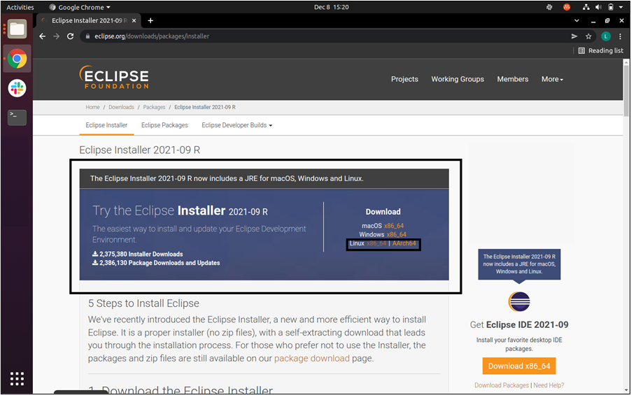

Linux - Eclipse IDE installer
=============================

The Eclipse Installer automates the installation of Eclipse development
environments.

Download the Eclipse Linux installer from
*https://www.eclipse.org/downloads/packages/installer*

as depicted in Figure 2.

**Note:** This document currently includes information supporting
Eclipse IDE Version: 2021-09 (4.25). However, Eclipse IDE Version of
2023-06 (4.28) or lower can be installed.

|image28|

Figure 1: Download Eclipse Installer

