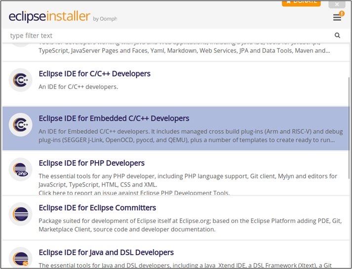
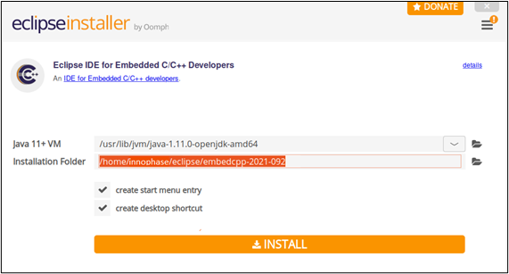
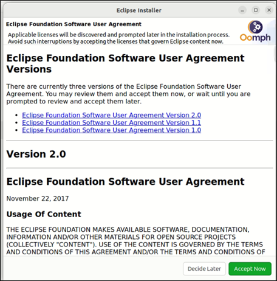
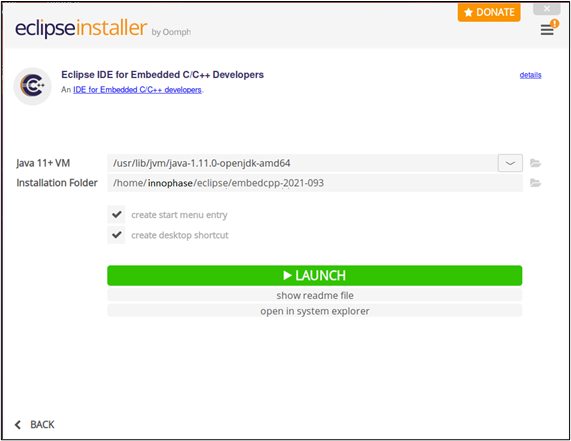

.. _eclipse setup linux - eclipse ide installation:

Linux – Eclipse IDE Installation
================================

There is more than one way to install the Eclipse IDE in Linux.
Installing Eclipse installer from eclipse.org is the simplest way. Start
by extracting the installation archive and executing the installer file.
On executing the eclipse-inst application file, the following screen
should appear.

|image29|

.. rst-class:: imagefiguesclass
Figure 1: Selecting the Eclipse IDE for Embedded C/C++ developers

Click on the Eclipse IDE for Embedded C/C++ developers. This will
redirect to the installation window shown in Figure 2. Java JDK path of
the user’s machine is taken as default as Eclipse uses externally
installed JDKs to run itself. Select the installation folder for Eclipse
and click Install.

|image30|

.. rst-class:: imagefiguesclass
Figure 2: Eclipse IDE for Embedded C/C++ developers’ installation window

Accept the Eclipse Foundation Software User Agreement shown in Figure 3.

|image31|

.. rst-class:: imagefiguesclass
Figure 3: Eclipse IDE for Embedded C/C++ developers’ Eclipse User
Agreement

After completing installation, Eclipse installer prompts for permission
to launch. Click on LAUNCH.

|image32|

.. rst-class:: imagefiguesclass
Figure 32: Eclipse IDE for Embedded C/C++ developers launch window

