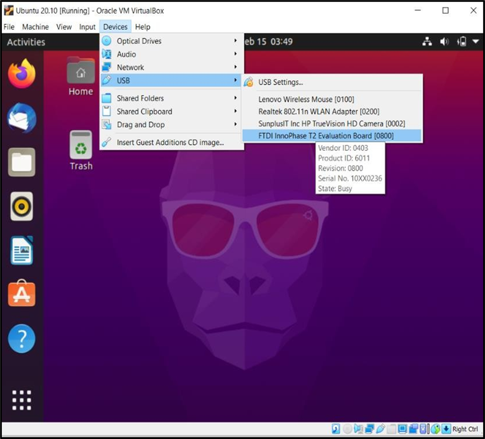

.. _eclipse setup connecting the evb:

Connecting the EVB
==================

Connect the EVB to the PC using the Micro USB cable provided.

In case of a virtual machine, transfer port access rights to the Ubuntu
virtual machine. From the virtual machine menu select Devices –> USB ->
FTDI InnoPhase T2 Evaluation Board [0800] as shown in Figure 1.

|image33|

Figure 1: Transferring port access rights to Ubuntu virtual machine

