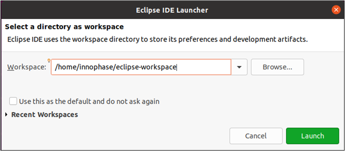

Starting Eclipse IDE
====================

On starting Eclipse for the first time, the following pop-up window will
appear. Select a workspace directory and click on Launch.

|image34|

Figure 1: Selecting a workspace directory

It is recommended to create a unique workspace that will be used
exclusively for the projects related to the GCC toolchain. The workspace
selected should not have a path name that is excessively long, and it is
best to avoid spaces in the path name.

