.. _eclipse setup application dev - manual procedure:

Application Development - Manual Procedure
==========================================

This section describes the manual procedure for developing the
application for InnoPhase IoT product using Eclipse IDE.

Import Talaria TWO Example Project 
-----------------------------------

Procedure to import an example project remains the same as *Import
Talaria TWO Example Project* for Eclipse plugin.

Configuring the Eclipse Project
-------------------------------

1. Click on your project, right click, and select Properties.

..

|image35|

Figure 1: Select Properties

2. Select Settings under C/C++ build and click on Toolchains. Add the
   tool chain path and build tools path through global, workspace and
   project links. Click Apply and Close.

..

   |image36|

Figure 2: Include toolchain properties

3. Click on OpenOCD Path, provide the OpenOCD as the executable, click
   on Browse and point to the OpenOCD installed location.

..

   |image37|

Figure 3: Add OpenOCD path

Building Application in Eclipse
-------------------------------

1. To build a project, Click Project -> Build Project.

..

   |image38|

Figure 4: Building the Application

2. On successfully building the application, an out directory containing
   the .elf file is created inside the application.

..

   |image39|

Figure 5: Build Console

Debug Configuration Setting up in Eclipse
-----------------------------------------

1. To start debugging the application, select the Project and right
   click on it. Choose debug as -> debug configuration.

..

   |image40|

Figure 6: Selecting debug configuration

2. Double click on GDB OpenOCD Debugging and the debug configuration of
   the project is seen. Select the configuration and then point to the
   generated ELF of the application present in the out directory as
   shown in Figure 43.

..

   |image41|

Figure 7: Changing debug configuration

3. Under Debugger Settings, select the executable path as an OpenOCD
   installed path by clicking on Browse.

..

   |image42|

Figure 8: Debugger config window

   In Config options, enter the path of configuration files available in
   conf directory of the SDK. These two files contain the configuration
   settings of the Talaria TWO EVB. Configuration path should be as
   follows:

.. code:: shell

      -s /home/<PATH TO SDK>/sdk_x.y/conf -f ftdi.cfg -f t2.cfg 

..

   **Note:** For SWD debugging, use the following configuration in
   Config options:

.. code:: shell

      -s C:/<PATH TO SDK>/sdk_x.y/conf -f ftdi_swd.cfg -f t2_swd.cfg

..

   |image43|

Figure 9: Debugger config window for SWD Configuration

4. In GDB client setup, select the variable and select the project_loc.

..

   **Note**: Copy the gdbinit files from apps folder to the application
   directory for debugging the particular application.

   |image44|

Figure 10: Selecting the variable

   Using project_path variable, locate the gdb-multiarch for the GDB
   client setup. For example:

.. code:: shell

      /usr/bin/${ project_path: <location of apps directory in sdk>}gdb-multiarch

5. Click Apply.

Programming Talaria TWO EVB
---------------------------

Program the ELF onto Talaria TWO using the Download tool.

For more information on flashing the ELF using the Download Tool, refer:
UG_Download_Tool.pdf (path: *sdk_x.y\\pc_tools\\Download_Tool\\doc*).

Click on Clear Flash on the Download Tool and ensure the output is as
shown in Figure 11.

|image45|

Figure 11: Download Tool Console

Debugging in Eclipse
--------------------

The debugger provides for the control of program execution by setting
breakpoints, suspending executed programs, stepping through the code,
and examining the contents of variables.

1. Click on Start-up tab and select the following options:

   a. Initial Reset

   b. Load symbols

   c. Load executable

   d. Debug in RAM

..

   Click on Debug in the Start-up tab.

   |image46|

Figure 12: Debug startup window

2. On being prompted to switch to the Debug perspective, click Switch.

..

   |image47|

Figure 13: Confirm Perspective Switch

3. The Debug perspective appears with the iperf3.elf application window
   open. The eclipse IDE repositions into debug perspective.

..

   |image48|

Figure 14: GDB OpenOCD Debugging – Start-up

4. Break Points:

..

|image49|

Figure 15: Setting breakpoints

5. Execution will stop at the first breakpoint added to the c file. As
   shown in Figure 15, breakpoint is set at line 5.

6. To continue execution, click the Resume button on the
   toolbar of the Debug view. This will resume execution of the program
   and stop at the next breakpoint.

7. Step into and step over can also be used to continue the execution of
   the next line.

8. While debugging the application, the application’s prints will be
   visible on the Download Tool’s console window.

..

   |image50|

Figure :16 Application prints in the Download Tool console

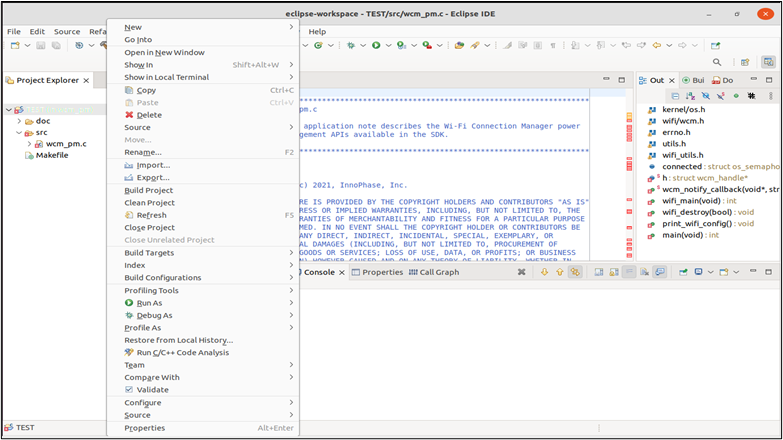
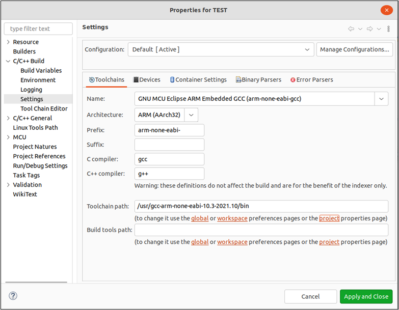
.. |image37| image:: media/image37.tmp
   :width: 6.49606in
   :height: 6.47371in
.. |image38| image:: media/image38.tmp
   :width: 4.72441in
   :height: 3.4609in
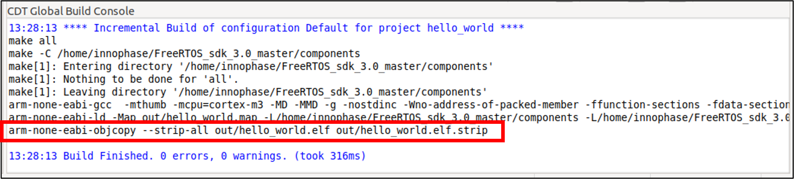
.. |image40| image:: media/image40.tmp
   :width: 6.29921in
   :height: 3.98774in
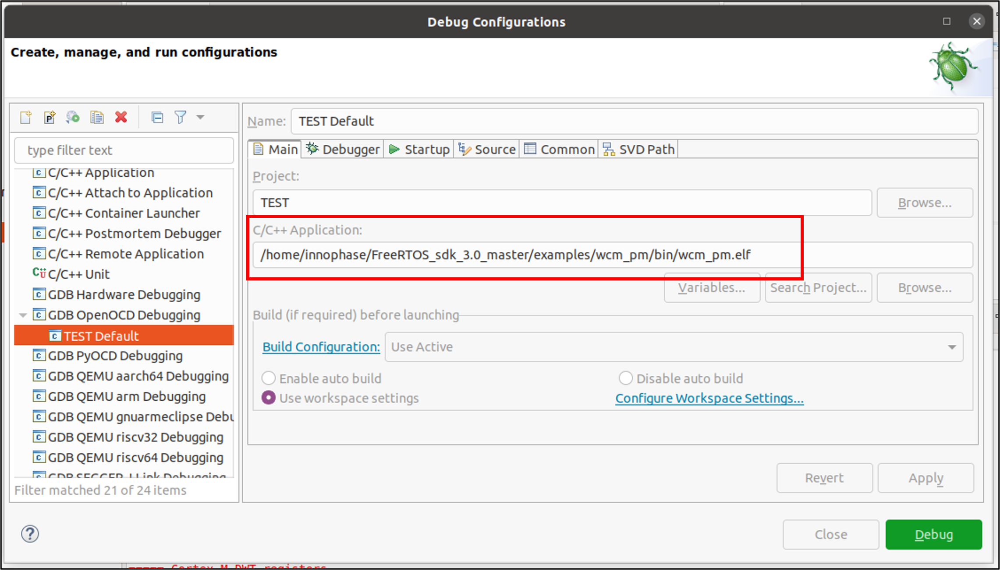
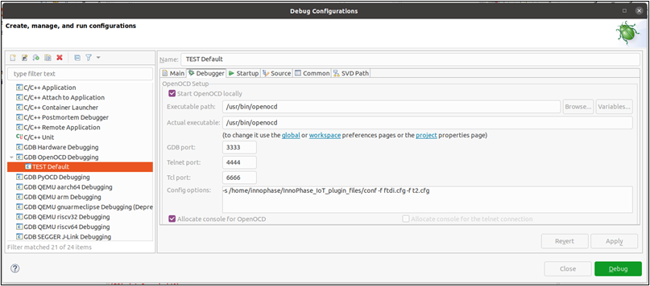
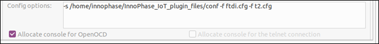
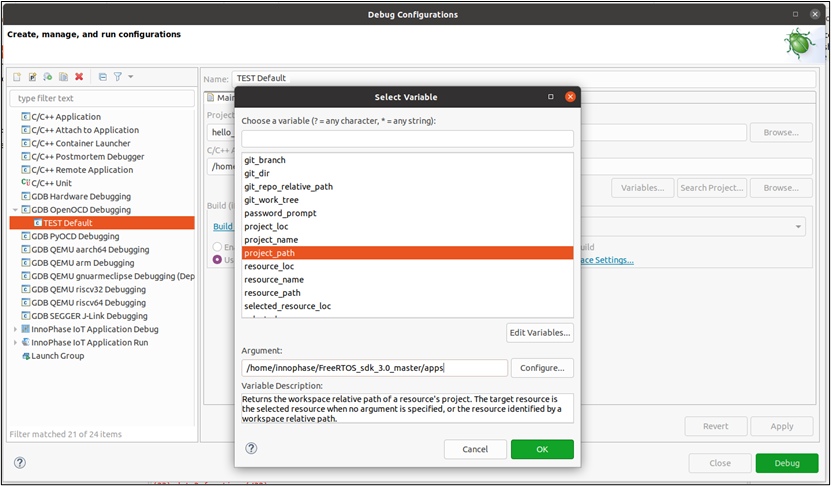
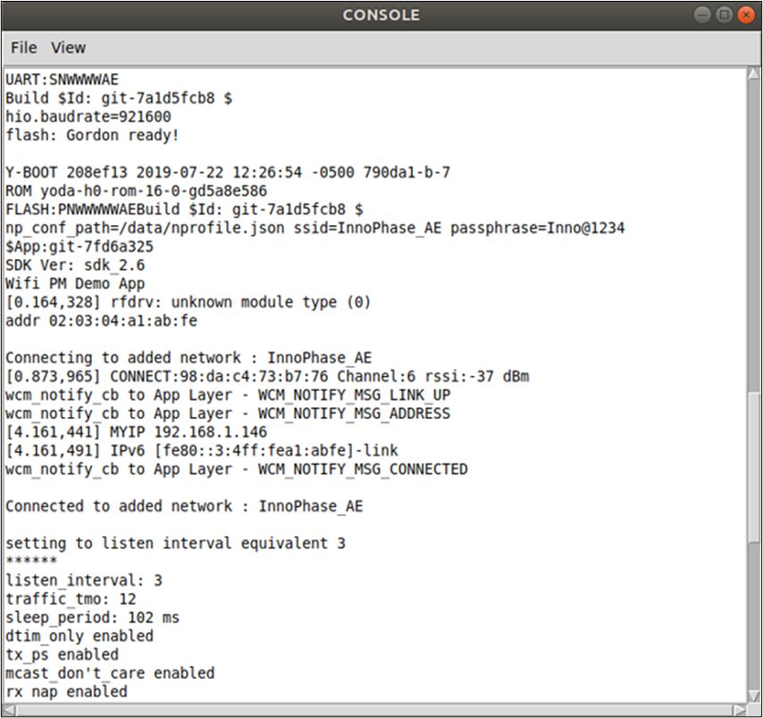
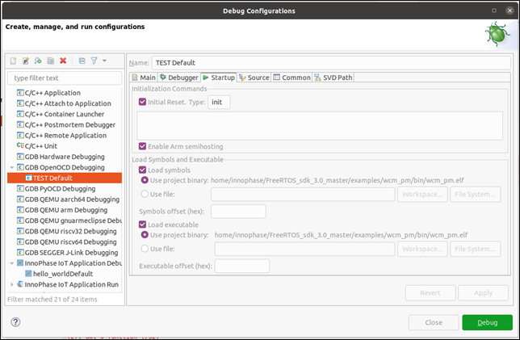
.. |image47| image:: media/image47.tmp
   :width: 4.72441in
   :height: 2.18109in
.. |image48| image:: media/image48.tmp
   :width: 6.69291in
   :height: 4.24259in
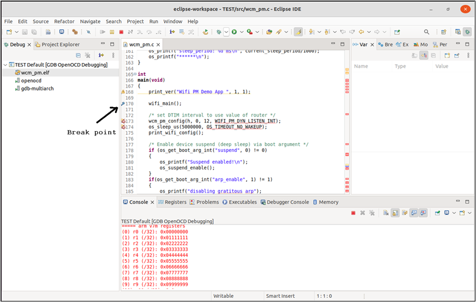
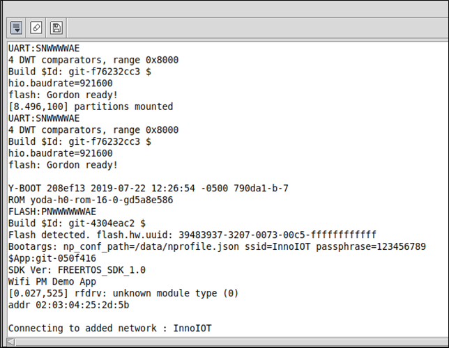

