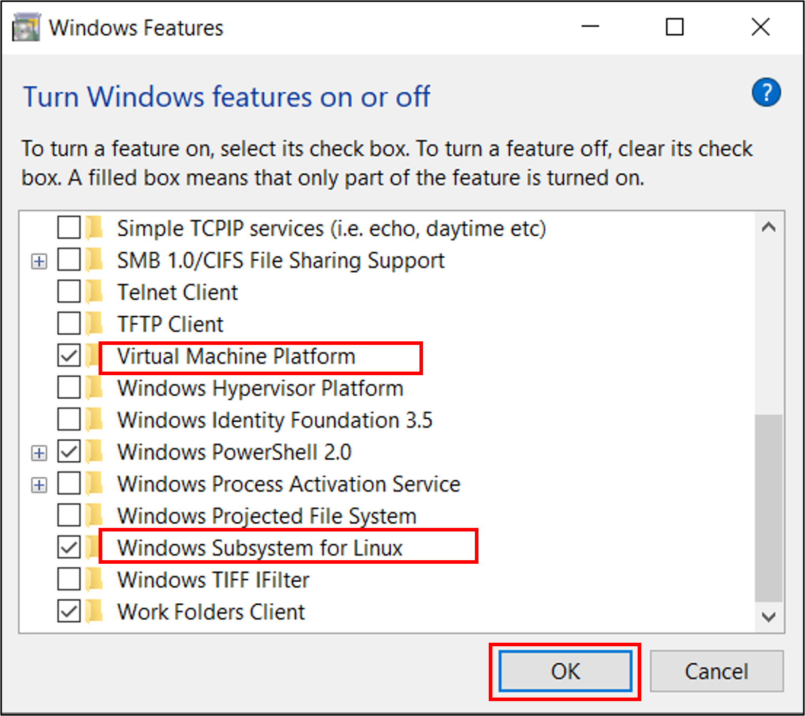
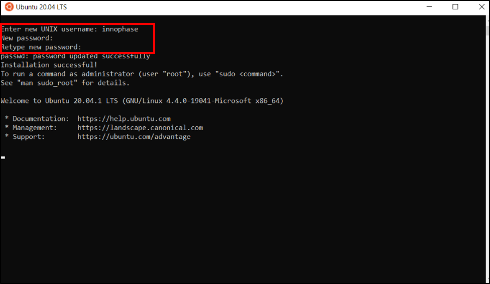
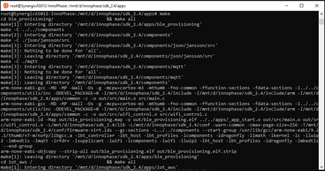

.. _wsl prerequisites:

Prerequisites Windows
=====================

Windows Subsystem for Linux
---------------------------

Windows Subsystem for Linux is a compatibility layer for running Linux
binary executables natively on Windows OS.

1. Control Panel -> Programs -> Programs and Features -> Click Turn
   Windows feature on and off

..

   |image1|

.. rst-class:: imagefiguesclass
Figure 1: Programs and features

2. Tick for Virtual Machine Platform and Windows Subsystem for Linux ->
   OK

..

   |image2|

.. rst-class:: imagefiguesclass
Figure 2: Turn Windows features ON or OFF

3. Restart the system at this stage by clicking on Restart now.

|image3|

.. rst-class:: imagefiguesclass
Figure 3: Restart the system

Installing Linux
----------------

Install the latest version of Linux:

1. Menu tab -> Microsoft store -> In Search option type Ubuntu. Which
   will show the results for Ubuntu, Click on Get to download the latest
   version of Ubuntu.

..

   |image4|

.. rst-class:: imagefiguesclass
Figure 4: Open Microsoft store to install Ubuntu

2. Once the download is complete, open Ubuntu from the Menu tab and
   provide the following when prompted:

   a. Enter new UNIX username

   b. New password

   c. Retype new password

..

   |image5|

.. rst-class:: imagefiguesclass
Figure 5: Username and password

3. This will open a terminal window in the directory in which commands
   can be typed.

..

|image6|

.. rst-class:: imagefiguesclass
Figure 6: Terminal window

Installing Necessary Packages
-----------------------------

In the terminal window, execute the following commands entering the
password which was set in Figure 6 when prompted.

.. code:: shell

      sudo apt update   

.. code:: shell

      sudo apt upgrade 

.. code:: shell

      sudo apt-get update   

.. code:: shell

      lsb_release -a

Console output:

|image7|

.. rst-class:: imagefiguesclass
Figure 7: Installing necessary packages

Accessing WSL Files from Windows
--------------------------------

An important thing to note about WSL is that it hosts its own file
system. The files you access within the WSL terminal are separate from
your regular Windows file system. You can integrate your WSL files into
the Windows File Explorer by changing to a particular directory in the
WSL terminal and using the command:

.. code:: shell

      explorer.exe  

Install arm-none-eabi Toolchain
-------------------------------

Install the GCC compiler packages.

.. code:: shell

      sudo apt install gcc-arm-none-eabi    

.. code:: shell

      arm-none-eabi-gcc --version

Console output:

|image8|

.. rst-class:: imagefiguesclass
Figure 8: GCC compiler packages

Install Python3 and packages
----------------------------

In any terminal window, execute the following commands to install
Python3 and other Python packages that will be needed. Enter the
password as prompted which was set in Figure 6.

.. code:: shell

      sudo apt install python3 -y    

.. code:: shell

      sudo apt install python3-pip -y  

.. code:: shell

      python3 --version 

Console output:

|image9|

.. rst-class:: imagefiguesclass
Figure 9: Installing Python3 & packages

Setting Execute Permissions for SDK Scripts
-------------------------------------------

Compile the InnoPhase SDK

1. Open a terminal in the directory, for example: *sdk_x.y/apps*

2. Execute the make command. Use the ELFs generated in the application’s
   out folder.

.. code:: shell

      make

**Note**: User can also compile the required application, for example:
*sdk_x.y/apps/helloworld/*.

3. By default, in the SDK package, the ELFs can be used from the
   application’s bin folder.

|image10|

.. rst-class:: imagefiguesclass
Figure 10: Compiling the InnoPhase SDK

Programming Talaria TWO using Download Tool
-------------------------------------------

Program the helloworld.elf (*sdk_x.y\\apps\\helloworld\\bin*) onto
Talaria TWO using the Download Tool:

1. Launch the Download tool provided with InnoPhase Talaria TWO SDK.

2. In the GUI window:

   a. Programming: Click on Clear Flash and ensure the output is as
      follows:

.. code:: shell

      UART:NWWWWWAEBuild $Id: git-b664be2af $
      app=gordon
      flash: Gordon ready!
      
      Y-BOOT 208ef13 2019-07-22 12:26:54 -0500 790da1-b-7
      ROM yoda-h0-rom-16-0-gd5a8e586
      FLASH:P

b. Boot Target: Select the appropriate EVK from the drop-down

c. ELF Input: Load the helloworld.elf by clicking on Select ELF File.

d. Programming: Prog RAM or Prog Flash as per requirement.

Console output:

.. code:: shell

      UART:NWWWWWAEBuild $Id: git-b664be2af $
      app=gordon
      flash: Gordon ready!
      
      Y-BOOT 208ef13 2019-07-22 12:26:54 -0500 790da1-b-7
      ROM yoda-h0-rom-16-0-gd5a8e586
      FLASH:PNWWWAEBuild $Id: git-b664be2af $
      Hello World

.. |image1| image:: media/image1.png
   :width: 8in

