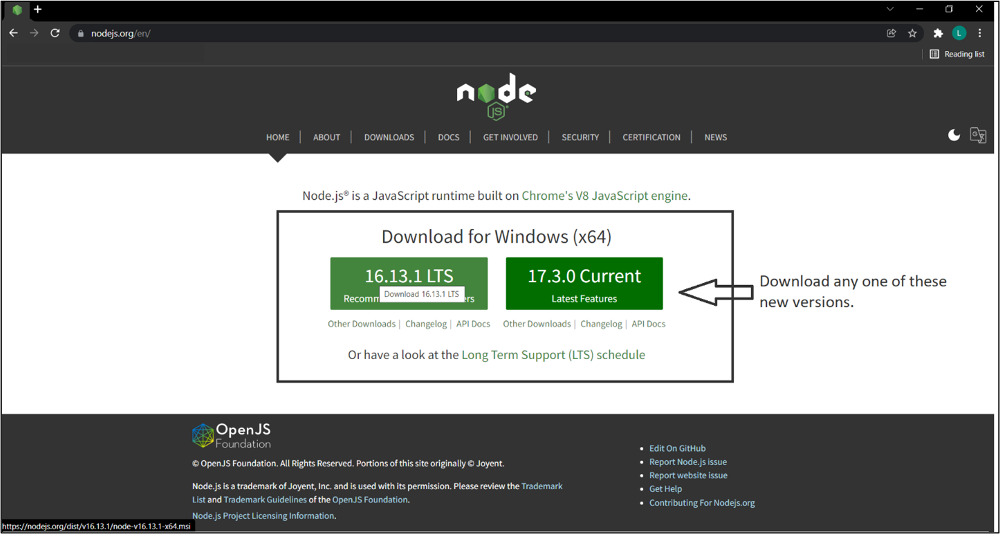
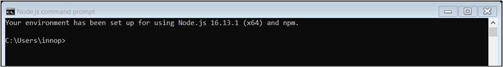
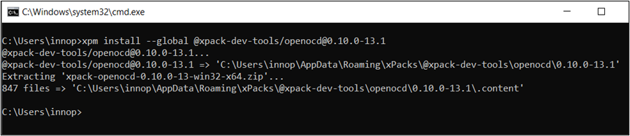

.. _eclipse setup windows prerequisites:

Prerequisites 
==============

1. Talaria TWO SDK.

2. PC with Windows 10 or higher.

JDK Installation 
=================

Eclipse requires JDK as a prerequisite since Eclipse is running in
externally installed JDKs. Download and install the JDK 11 installer
from the following link and install it administrative rights:
https://www.oracle.com/in/java/technologies/javase/jdk11-archive-downloads.html.

|image1|

.. rst-class:: imagefiguesclass
Figure 1: JDK installer for Windows

**Note**:

1. The latest version can be installed, for example jdk-11.0.12 is shown
   in Figure 1.

2. JDK installer download will require an Oracle account login. User
   must have/create an Oracle account to successfully download the
   installer.

Prerequisites for Eclipse
=========================

Node.js Installation 
---------------------

Node.js is an open source java script run-time environment.

Download the Windows Installer (.msi) from the Node.js download page and
install it with administrative rights: https://nodejs.org/en/.

|image2|

.. rst-class:: imagefiguesclass
Figure 2: Node.js installation

Installation results in a folder similar to: C:\\Program Files\\nodejs
and is added to the system path since it includes the node.exe binary.

NPM Installation 
-----------------

NPM (Node Package Manager) is the package manager for the Node
JavaScript platform. It installs the modules and organizes them so the
node.js can locate the modules. To install NPM, execute the following
steps:

1. Launch the node command prompt.

|image3|

.. rst-class:: imagefiguesclass
Figure 3: Node command prompt

2. To install latest version of NPM through node.js command line,
   execute the following command:

.. code:: shell

      npm install --global npm@latest   

|image4|

.. rst-class:: imagefiguesclass
Figure 4: NPM latest version installation

XPM Installation 
-----------------

XPM is the xPack Project Manager. XPM is mainly intended to manage
projects during development and build configurations to run actions
associated with various build steps.

To install the latest version of XPM through node.js command line,
execute the following command:

.. code:: shell

      npm install --global xpm@latest 

|image5|

.. rst-class:: imagefiguesclass
Figure 5: XPM installation

Windows-Build-Tools Installation
--------------------------------

To build projects on Windows it is necessary to install make, which is
available from the xPack Windows Build Tools. Running builds on Windows
requires tools that Microsoft does not include in the base distribution
and hence needs to be installed separately.

To install the windows-build-tools through node.js command line ,
execute the following command:

.. code:: shell

      xpm install --global @xpack-dev-tools/windows-build-tools@4.3.0-1.1

|image6|

.. rst-class:: imagefiguesclass
Figure 6: Windows-build-tools installation

Arm Tool Chain Installation
---------------------------

This toolchain contains integrated and validated packages featuring the
compiler, libraries, and other tools necessary for software development.
To build ARM projects, an ARM toolchain xPack GNU Arm Embedded GCC is
required.

To install latest version of the ARM tool chain, execute the following
command:

.. code:: shell

      xpm install @xpack-dev-tools/arm-none-eabi-gcc@11.2.1-1.1.1  

|image7|

.. rst-class:: imagefiguesclass
Figure 7: ARM tool chain installation

OpenOCD Installation
--------------------

OpenOCD is used for on-chip debugging. . In a terminal window, execute
the following command to install OpenOCD (For example: version 0.10.0):

.. code:: shell

      xpm install --global @xpack-dev-tools/openocd@0.10.0-13.1 

|image8|

.. rst-class:: imagefiguesclass
Figure 8: OpenOCD installation

All xPacks are installed in a central folder similar to the one in the
following location: C:\\Users\\<User name>\\AppData\\Roaming.

Ensure to check the XPM output for the actual location.

