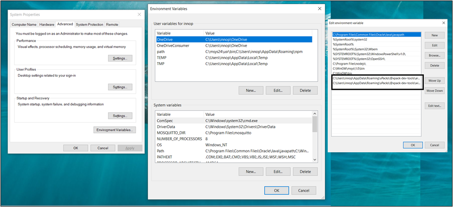

.. _eclipse setup windows add paths to env var:

Add Paths to the Environment Variable
=====================================

After completing the installation, add environment variables using the
following path : Control Panel -> System and Security -> System ->
Advanced System Settings -> Environment Variables -> System Variable ->
Path -> Edit -> New.

|image9|

Figure 1: Adding environment variables

Add the tool chain and build tools path to the environment variable
under System Variables. xPacks installs tools under Appdata/Roming/
directory in Windows.

Steps to add the Environment Variable:

1. Click on New.

2. A new column opens up where the environment path can be added.

3. Add the Path of the built tools bin directory.

[For Ex:
C:\\Users\\innop\\AppData\\Roaming\\xPacks\\@xpack-dev-tools\\windows-build-tools\\4.3.0-1.1\\.content\\bin]

4. After adding the build tools path, click on New.

5. Add the Path of the ARM tool chain bin directory.

[For Ex:
C:\\Users\\innop\\AppData\\Roaming\\xPacks\\@xpack-dev-tools\\arm-none-eabi-gcc\\11.2.1-1.1.1\\.content\\bin]

6. Click OK.

