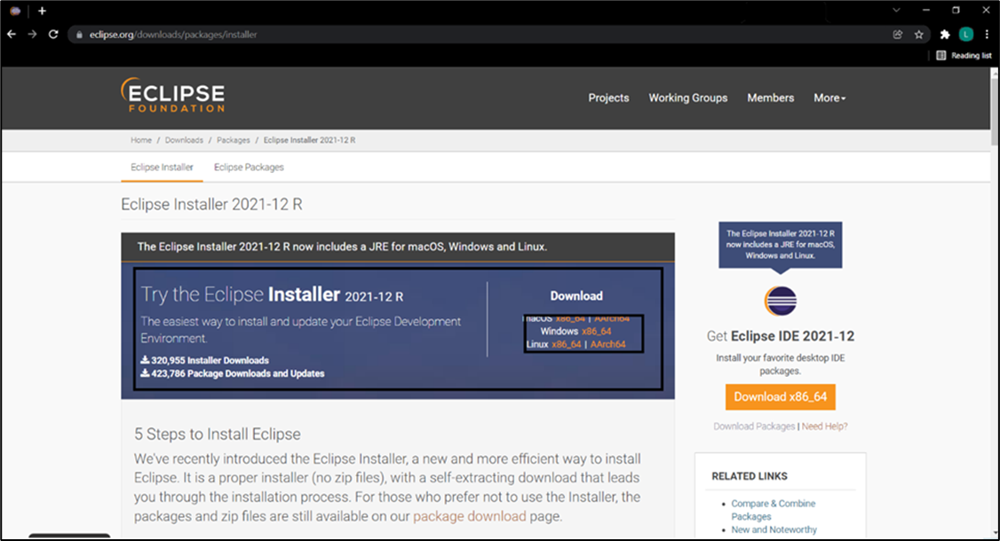

.. _eclipse setup windows - eclipse ide installer:

Windows - Eclipse IDE Installer
===============================

The Eclipse installer automates the installation of Eclipse development
environment.

Download the Eclipse windows installer from the following link:
https://www.eclipse.org/downloads/packages/installer.

**Note**: This document currently includes information supporting
Eclipse IDE Version: 2021-12 (4.22). However, Eclipse IDE Version of
2023-06 (4.28) or lower can be installed..

|image10|

.. rst-class:: imagefiguesclass
Figure 1: Windows-Eclipse IDE installer

