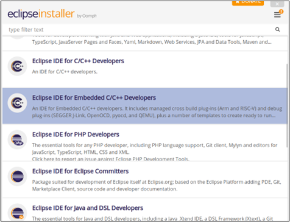
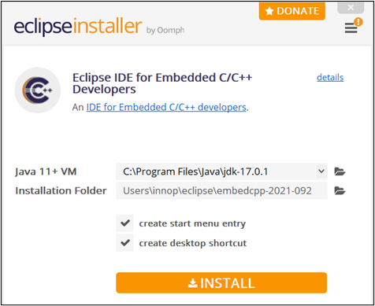
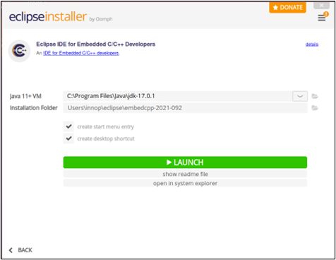

.. _eclipse setup windows - eclipse ide installation:

Windows – Eclipse IDE Installation
==================================

1. Start the Eclipse IDE installation by extracting the archive and
   executing the installer file. On executing eclipse-inst-jre-win64.exe
   application file, the following window pops-up:

|image11|

.. rst-class:: imagefiguesclass
Figure 1: Selecting the Eclipse IDE for Embedded C/C++ developers

2. Clicking on Eclipse IDE for Embedded C/C++ developers redirects to
   the installation window.

|image12|

.. rst-class:: imagefiguesclass
Figure 2: Installation of Eclipse IDE for Embedded C/C++ developers

3. The installer takes the default JDK path of the user’s machine as
   Eclipse uses externally installed JDKs to run itself. Select the
   installation folder for eclipse and click INSTALL.

|image13|

.. rst-class:: imagefiguesclass
Figure 3: Eclipse IDE for Embedded C/C++ developers launch window

4. After completing the installation, the Eclipse installer prompts for
   permission to launch. Click on LAUNCH.

