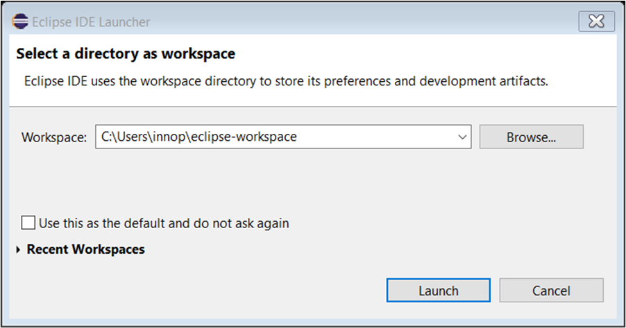

.. _eclipse setup windows starting eclipse ide:

Starting Eclipse IDE
====================

On starting Eclipse for the first time, the following pop-up window will
appear.

|image14|

.. rst-class:: imagefiguesclass
Figure 1: Workspace directory

Select a workspace directory and click on Launch.

It is recommended to create a unique workspace that will be used
exclusively for the projects related to the GCC toolchain. The workspace
selected should not have a path name that is excessively long, and it is
best to avoid spaces in the path name.

