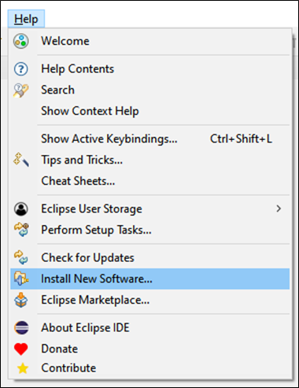
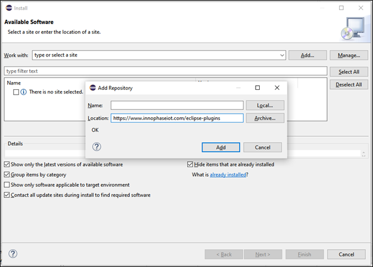
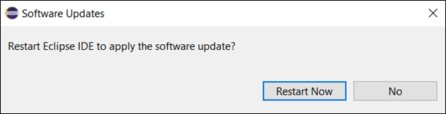
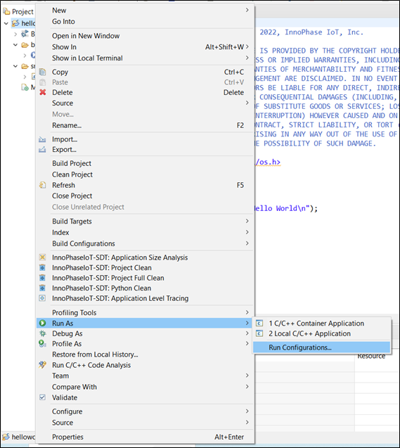
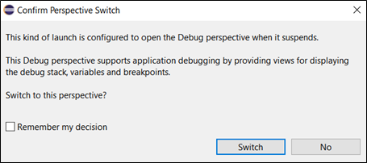

.. _eclipse setup windows eclipse plugin:

Eclipse Plugin: InnoPhase IoT Software Development Tool for Application Development
===================================================================================

InnoPhase IoT Software Development Tool is an Eclipse plugin which
simplifies the application development for InnoPhase IoT product using
Eclipse IDE.

**Note**:

1. Currently, the plugin supports only one connected device. In case
more than one device is connected, the plugin might not function as
expected.

2. Steps for manually developing the application are available in
section: *Application Development - Manual Procedure* .

InnoPhase IoT Software Development Tool Installation
----------------------------------------------------

Install plugin InnoPhase IoT Software Development Tool onto Eclipse
using following steps:

1. Help -> Install New Software

..

|image15|

.. rst-class:: imagefiguesclass
Figure 1: Plugin installation – Install new software

2. Add -> Location to https://www.innophaseiot.com/eclipse-plugins ->
      Add

..

   |image16|

.. rst-class:: imagefiguesclass
Figure 2: Plugin installation – Add Repository Location

3. Select the check box: InnoPhase IoT -> Next

..

   |image17|

.. rst-class:: imagefiguesclass
Figure 3: Plugin installation – Choose available software to install

   Once done, Eclipse begins to calculate the requirements and
   dependencies.

|image18|

.. rst-class:: imagefiguesclass
Figure 4: Plugin installation – Calculating requirements and
dependencies

4. Select radial button “\ *Keep my installation the same and modify the
      items being installed to be compatible*\ ” -> Next

..

   |image19|

Figure 5: Plugin installation – Install remediation page

5. Press Next to continue.

..

   |image20|

.. rst-class:: imagefiguesclass
Figure 6: Plugin installation – Install details

6. Accept terms -> Finish

..

   |image21|

.. rst-class:: imagefiguesclass
Figure 7: Plugin installation – Review licenses

7. Select the check box Unsigned & Always trust all content and Click on
      Trust Selected -> Yes, I Accept the Risk

..

   |image22|

.. rst-class:: imagefiguesclass
Figure 8: Plugin installation – Trust unsigned content

|image23|

.. rst-class:: imagefiguesclass
Figure 9: Plugin installation – Trust unsigned content

8. Software begins to install, which is indicated in the status bar.

..

   |image24|

.. rst-class:: imagefiguesclass
Figure 10: Plugin installation – Installing software status

9. Once software installation is complete, a pop-up message for
      restarting appears. Click on Restart Now.

..

   |image25|

.. rst-class:: imagefiguesclass
Figure 11: Plugin installation – Restart after installation

10. On successful installation, Eclipse IDE will have a tab for
       InnoPhase IoT on restarting.

..

   |image26|

.. rst-class:: imagefiguesclass
Figure 12: Plugin installation – InnoPhase IoT tab

Download and Configure Support Files for Plugin
-----------------------------------------------

InnoPhase IoT Software Development Tool plugin requires supporting
files, which need to be configured before use. Follow the subsequent
steps to configure the supporting files:

1. InnoPhase IoT -> Download and Configure Support Files

..

   |image27|

.. rst-class:: imagefiguesclass
Figure 13: Download and configure support files menu

2. Browse and choose a directory to download and configure support files
   for *InnoPhase IoT Software Development Tool* plugin.

..

   |image28|

.. rst-class:: imagefiguesclass
Figure 14: Download and configure support files - Input window

   **Note**: If the plugin support files are already available, check
   the box: Use an existing InnoPhase IoT support directory file system
   and choose the existing folder.

3. Click Finish. Support files will be downloaded and saved in the
   selected folder. A pop-up message will confirm once the download is
   completed.

..

   |image29|

.. rst-class:: imagefiguesclass
Figure 15: Download and configure support files – Status message

Import Talaria TWO Example Project
----------------------------------

1. Import an existing example as a make file project in eclipse:

   a. Download and unzip Talaria SDK provided

   b. Open Eclipse

   c. Click on File -> Import

..

   |image30|

.. rst-class:: imagefiguesclass
Figure 16: Import an existing example in Eclipse

2. Under C/C++, Click Existing code as Makefile Project and then click
   Next.

..

   |image31|

.. rst-class:: imagefiguesclass
Figure 17: Import existing code as makefile project

3. Enter the project name, select any of the applications or examples
   available in SDK package, select the Toolchain as ARM cross GCC and
   click Finish.

4. Project is imported with the source code and existing make file.

..

   |image32|

.. rst-class:: imagefiguesclass
Figure 18: Project imported

Run Configuration Set-up
------------------------

InnoPhase IoT Software Development Tool provides *the Run Configuration
set-up to Build and Flash the Application to connected Talaria TWO EVB*.
Steps for setting up the run configuration is as follows:

1. Right click on Project and select Run As ->Run Configurations.

..

   |image33|

.. rst-class:: imagefiguesclass
Figure 19: Eclipse Run As – Select Run Configuration

2. Right click on InnoPhase IoT Application Run configuration and select
   New Configuration.

..

   |image34|

.. rst-class:: imagefiguesclass
Figure 20: InnoPhase IoT Software Development Tool – New run
configuration

3. Plugin will create a new configuration, automatically fill the
      required default values. Other values are required to be filled by
      the user as per the required the application.

..

   |image35|

.. rst-class:: imagefiguesclass
Figure 21: InnoPhase IoT Software Development Tool – Run configuration
input window

4. User inputs are required for only the Main tab. Input parameters for
      this tab are as follows:

   a. **Name:** Name of the run configuration. Automatically filled with
      default name. Can be changed as per requirement.

   a. **Project:** By default, the active project name will be selected.
         Use the Browser button to change the project.

   b. **C/C++ Application:** Depending on the project selected, default
         application file is selected as
         *project_path\\out\\project_name.elf*.

..

   For example: If the project name is helloworld and the project path
   is ..\\helloworld, then the default value will be
   ..\\helloworld\\out\\helloworld.elf.

   In case the correct file is not selected, use the Browse button to
   select the correct file.

c. **Working Directory:** Selected by default.

d. **Talaria TWO Filesystem:** Is empty by default. Select the folder
      which contains files/folders to be added to the Talaria TWO
      filesystem.

..

   **Note**: Only files/folders inside the selected folder will be added
   to the Talaria TWO filesystem. Selected folder will not be added.

e. **Wi-Fi Network Name:** Is empty by default. Add the name of the
      Wi-Fi API to which Talaria TWO needs to connect.

f. **Wi-Fi Network Password:** Is empty by default. Add the password of
      the Wi-Fi API provided in the Wi-Fi network name.

g. **Boot Arguments:** Is empty by default. Add the boot argument
      required by the C/C++ application selected.

5. Click Apply once the inputs are filled.

6. Click Run to build and flash the application to Talaria TWO EVB
   device.

   a. In case the device is not connected to the system, only the
      application is built. Application build output can be seen on the
      console window CDT Build Console.

..

   |image36|

.. rst-class:: imagefiguesclass
Figure 22: Console window – CDT build console

   **Note**: Use Display Selected Console to select the required console
   window.

b. In case the device is connected to the system, the application flash
   and device console output can be seen on the console window InnoPhase
   IoT T2 Device Monitor.

..

   |image37|

.. rst-class:: imagefiguesclass
Figure 23: InnoPhase IoT T2 Device Monitor console window – Run
configuration

Debug Configuration Set-up
--------------------------

InnoPhase IoT Software Development Tool provides debug configuration
set-up to build, flash application to the connected Talaria TWO EVB and
debug the application.

Steps to set-up the debug configuration settings are as follows:

1. Right click on Project and select Debug As ->Debug Configurations.

..

   |image38|

.. rst-class:: imagefiguesclass
Figure 24: Eclipse Debug – Select debug configuration

2. Right click on InnoPhase IoT Application Debug configuration and
   select New Configuration.

..

   |image39|

.. rst-class:: imagefiguesclass
Figure 25: InnoPhase IoT Software Development Tool – New debug
configuration

3. Plugin will create a new configuration and automatically fill-in the
      required default values for debugging. As required, the user can
      fill in the other values.

..

   |image40|

.. rst-class:: imagefiguesclass
Figure 26: InnoPhase IoT Software Development Tool – Debug configuration
input window

   The plugin will automatically fill in the inputs for the Debugger
   tab. For more details on providing the inputs manually, refer *Debug
   Configuration Set-up in Eclipse*.

   User inputs are required for the Main tab. Input parameters are as
   follows:

a. **Name:** Name of the debug configuration. Filled with default name,
   the user can change the name as required.

b. **Project:** By default, the active project name is selected. Use the
   Browser button to change the project.

c. **C/C++ Application:** Dependent on the project selected. Default
   application file is selected as
   *project_path\\out\\project_name.elf*.

..

   For example: If the project name is helloworld and the project path
   is *..\\helloworld*, then the default value is
   *..\\helloworld\\out\\helloworld.elf*.

   In case the correct file is not selected, use the Browse button to
   select the correct file.

d. **Wi-Fi Network Name:** Is empty by default. Add the name of the
   Wi-Fi AP to which Talaria TWO needs to be connected to.

e. **Wi-Fi Network Password:** Is empty by default. Add the password of
   the Wi-Fi AP provided in the Wi-Fi network name.

f. **Boot Arguments:** Is empty by default. Add the boot argument
   required by the C/C++ application selected.

4. Click the Apply button once the inputs are filled.

5. Click Debug to build, flash the application onto Talaria TWO EVB and
   start debugging.

   a. In case the device is not connected to the system, only
         application will get build. Application build output can be
         seen in Console window “CDT Build Console”, refer Figure 22.

   b. In case the device is connected to the system:

      i.  The application flash and device console output can be seen in
          the console window InnoPhase IoT T2 Device Monitor, refer
          Figure 23.

      ii. Once the application is flashed successfully onto Talaria TWO
          EVB, Eclipse may prompt to switch to Debug Perspective. Press
          Switch to continue debugging.

..

   |image41|

.. rst-class:: imagefiguesclass
Figure 27: InnoPhase IoT Software Development Tool – Debug perspective switch

c. Eclipse will begin to debug and the same is displayed in Debug
   Perspective as shown in Figure 28.

..

   |image42|

.. rst-class:: imagefiguesclass
Figure 28: InnoPhase IoT Software Development Tool – Debug begins

6. Debug the application with Eclipse’s general debugging procedure
   (refer points 4 to 7 of section *Debugging in Eclipse*).

7. While debugging the application, the application’s prints will be
   visible on the console window InnoPhase IoT T2 Device Monitor as
   shown in Figure 23.

.. |image17| image:: media/image17.png
   :width: 6.49606in
   :height: 5.67924in

.. |image30| image:: media/image30.png
   :width: 3.93701in
   :height: 4.04292in

.. |image42| image:: media/image42.png
   :width: 6.10236in
   :height: 2.30025in
