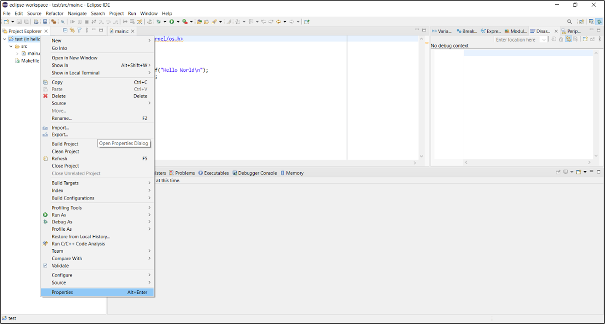

.. _eclipse setup windows application dev - manual procedure:

Application Development - Manual Procedure 
===========================================

This section describes the manual procedure for developing the
application for InnoPhase IoT product using Eclipse IDE.

Import Talaria TWO Example Project 
-----------------------------------

Procedure to import an example project remains the same as *Import
Talaria TWO Example Project* for Eclipse plugin.

Configuring the Eclipse Project
-------------------------------

1. Click on your project, right click and select Properties.

..

|image43|

.. rst-class:: imagefiguesclass
Figure 1: Select Properties

2. Select Settings under C/C++ build and click on Toolchains. Add the
   tool chain path and build tools path through global, workspace and
   project links. Click Apply and Close.

..

|image44|

.. rst-class:: imagefiguesclass
Figure 2: Settings Window

3. Click on ARM Toolchains Path option available under MCU.

4. Click on xPack. and a window opens as shown in the picture below.

5. Select the version of the toolchain and click ‘OK’.

6. Click ‘Apply’.

..

|image45|

.. rst-class:: imagefiguesclass
Figure 3: Adding ARM Tool Chain Path

7.  Click on Build Tools Path option available under MCU.

8.  Click on xPack and a window opens as shown in the picture below.

9.  Select the version of the buildtools and click OK.

10. Click Apply.

..

|image46|

.. rst-class:: imagefiguesclass
Figure 4: Adding Buildtools Path

11. Click on OpenOCD Path, provide the OpenOCD as the executable.

12. Click on xPack, select the version of OpenOCD and click OK.

13. Click on ‘Apply’ and then ‘Apply and Close’.

..

|image47|

.. rst-class:: imagefiguesclass
Figure 5: Adding OpenOCD Path

14. Includes directory of the project is added.

..

|image48|

.. rst-class:: imagefiguesclass
Figure 6: Includes directory of the project

Building Application in Eclipse
-------------------------------

1. To build a project, click Project -> Build Project.

..

|image49|

.. rst-class:: imagefiguesclass
Figure 7: Building the Application

2. On successfully building the application, an out directory containing
   the .elf file is created inside the application.

..

|image50|

.. rst-class:: imagefiguesclass
Figure 8: Build console

Debug Configuration Set-up in Eclipse
-------------------------------------

1. To start debugging the application, select the project and right
   click on it. Choose Debug As -> Debug Configuration.

..

|image51|

.. rst-class:: imagefiguesclass
Figure 9: Debug configuration settings

2. Double click on GDB OpenOCD Debugging and the debug configuration of
   the project is seen. Select the configuration and then point to the
   generated ELF of the application present in the out directory.

..

|image52|

.. rst-class:: imagefiguesclass
Figure 10: GDB OpenOCD Debugging settings

3. Under Debugger Settings, select the executable path as an OpenOCD
   installed path by clicking on Browse.

..

|image53|

.. rst-class:: imagefiguesclass
Figure 11: Debugger settings – OpenOCD installed path

   In Config options, enter the path of configuration files available in
   conf directory of the SDK. These two files contain the configuration
   settings of Talaria TWO EVB. Configuration path should be as follows:

.. code:: shell

      -s C:/<PATH TO SDK>/sdk_x.y/conf -f ftdi.cfg -f t2.cfg   

..

   **Note:** For SWD debugging, use the following configuration in
   Config options:

.. code:: shell

      -s C:/<PATH TO SDK>/sdk_x.y/conf -f ftdi_swd.cfg -f t2_swd.cfg      

|image54|

.. rst-class:: imagefiguesclass
Figure 12: Debugger config window for SWD Configuration

4. In GDB client setup, Select the actual executable arm-none-eabi-gdb
   as shown in Figure 13. Add the following commands in commands tab:

.. code:: shell

      set mem inaccessible-by-default off
      set substitute-path /tmp/build-2_gctshx/ "C:/data/"
      mem 0 0x40000 ro
      mem 0x40000 0xc0000 rw
      mem 0x100000 0x200000 ro
      mem 0xfc0000 0x1000000 rw
      mem 0x2000000 0x2100000 rw

..

|image55|

.. rst-class:: imagefiguesclass
Figure 13: Debugger settings

5. Click on Apply.

Programming Talaria TWO EVB
---------------------------

Flash the ELF onto Talaria TWO using the Download tool. Point to the elf
file and click on PROG Flash to flash the application.

Ensure that the output is as shown in Figure 14. If not, Click on Clear
Flash on the Download Tool and program the elf onto Talaria TWO again.

|image56|

.. rst-class:: imagefiguesclass
Figure 14: Download Tool Console

Debugging in Eclipse
--------------------

To debug the application the debugger provides control of program
execution by setting breakpoints, suspending executed programs, stepping
through the code and examining the contents of variables.

1. Click on Start-up tab and select the following options:

   a. Initial Reset

   b. Load symbols

   c. Load executable

   d. Debug in RAM

   e. Click on Debug in the start-up tab

..

|image57|

.. rst-class:: imagefiguesclass
Figure 15: Debug start-up settings

2. On being prompted to switch to the Debug perspective, click Switch.

..

|image58|

.. rst-class:: imagefiguesclass
Figure 16: Confirm Perspective Switch

3. The Debug perspective appears with the application window open.
   Eclipse IDE re-positions into debug perspective.

..

|image59|

.. rst-class:: imagefiguesclass
Figure 17: Debug perspective

4. Breakpoints can be set by double-clicking to
   the left of the line number. The blue circle indicates that the
   breakpoint is set. Similarly, multiple breakpoints can be added. To
   start debugging, click on the pause/play button.

..

|image60|

.. rst-class:: imagefiguesclass
Figure 18: Setting breakpoint

5. The execution will stop at the first breakpoint added to the c file.
   As shown in Figure 18, breakpoint is set at line 6.

6. To continue execution, click the Resume button on the
   toolbar of the Debug view. This will resume execution of the program
   and stop at the next breakpoint.

7. Step into and step over can also be used to continue execution of the
   next line.

8. While debugging the application, the application’s prints will be
   visible on Download Tool’s console window.

..

|image61|

.. rst-class:: imagefiguesclass
Figure 19: Step run output in console

.. |image50| image:: media/image50.png
   :width: 8in

