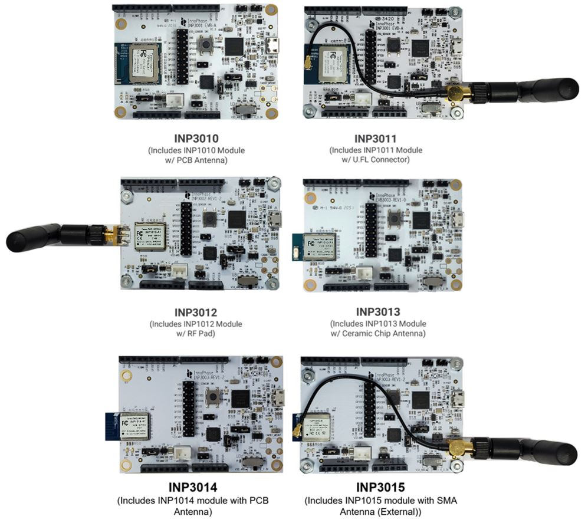

INP301x Talaria TWO evaluation board is designed as an evaluation
platform for the INP101x modules.

INP301x Package Contents
========================

The package contains:

- 1. INP3010\*, INP3014\*, INP3011*\*, INP3015*\*, INP3012 or INP3013 board
- 2. Micro USB cable
- 3. Antenna (INP3011 and INP3012 boards)
- 4. Battery box

|image1|
            Figure 1: INP301x EVB-A Board with INP101x module board installed

Description of the Board
========================

Block Diagram
-------------

|image2|

Figure 2: Block diagram of INP301x Evaluation Board

The block diagram of the INP301x Evaluation board is shown in Figure 2.
The main component on the board is the INP101x module. Key features of
the evaluation board are:

1. Standalone mode vs. Shield mode: Using the mode switch U3, either
   standalone mode or shield mode can be selected.

   a. In standalone mode, the INP101x can be accessed via micro-USB
      cable for programming and debugging. This mode is recommended for
      standalone application development.

   b. In shield mode, the INP101x module can be interfaced with any host
      CPU and can provide serial to Wi-Fi capabilities.

2. A peripheral IO header (J1) is available using which all the IO’s of
   the INP101x module can be accessed.

3. Power supply section: Based on the mode, the power for module is
   derived from either USB or shield header. A battery header is
   available which can be used as power source as well.
   a. J4 at VM_3.3V for USB power
   b. J4 at VBAT and battery connect to J10 for Battery power

4. On board sensors are available to develop sensor to cloud
   applications.

5. Switch:
   a. Set U3 switch to V33_ARD for Shield mode
   b. Set U3 switch to V_3.3V for Standalone mode

INP3000 Programmer Board
INP3000 programmer board provides a programming interface for Talaria
TWO modules. It can be used in conjunction with the factory_loader
scripts or other companion scripts found in Talaria TWO standalone
solution package – SDK.

There are three versions of the INP3000 board which could be used for
different applications:

.. |image2| image:: media/images2.jpeg
   :width: 4.92153in
   :height: 2.91528in
