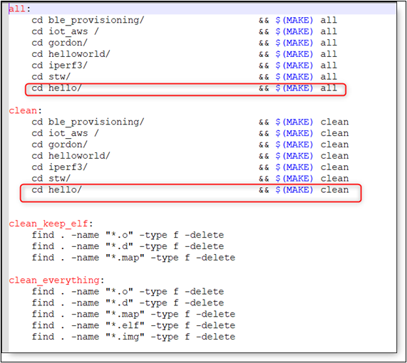

Programming Basic Applications 
-------------------------------

Linux/CLI Method
~~~~~~~~~~~~~~~~~~~~~~~

**Note**: In the following sections, we continue with Linux and CLI
method of creating applications. However, you can also choose to use
Eclipse as your development environment.

Hello-World Application
~~~~~~~~~~~~~~~~~~~~~~~

**Note**: This section is recommended for Linux/Windows users familiar
with command line tools. The assumption is that the users use their own
text editor.

In this first example, we begin by creating a very simple application
that outputs a string "hello world." to the console. The application
shall be located inside a folder that holds all the applications in the
SDK folder tree (i.e., *freertos_sdk\\apps*).

**Note**: Only create a new folder or a file if it does not exist
already.

1. To begin with, create a folder called helloworld inside apps
   directory (i.e., \\apps\\helloworld).

2. Create a file called my_app.c inside the folder *\\apps\\helloworld*
   using any text editor (my_app.c will be under
   *apps\\helloworld\\my_app.c*).

3. Copy/paste the following piece of code to my_app.c file.

+-----------------------------------------------------------------------+
| #include <kernel/io.h>                                                |
|                                                                       |
| #include <kernel/debug.h>                                             |
|                                                                       |
| int main()                                                            |
|                                                                       |
| {                                                                     |
|                                                                       |
| os_printf("Hello World.\\n");                                         |
|                                                                       |
| return 0;                                                             |
|                                                                       |
| }                                                                     |
+=======================================================================+
+-----------------------------------------------------------------------+

Just like in any C program, we declare the function int main () which is
the first point of entry into our application. Then we call an OS
dependent function, os_printf() to output the string on the console.
Finally, we call return which in this case returns a zero.

Makefiles - Compiling Applications for Non-Eclipse Users Only
~~~~~~~~~~~~~~~~~~~~~~~~~~~~~~~~~~~~~~~~~~~~~~~~~~~~~~~~~``

To compile our applications, we use the SDK libraries that provide all
function calls necessary.

1. Using a text editor of your choice (and *inside\\apps*), create a
   file called Makefile (i.e., *apps\\Makefile*). If the file Makefile
   already exists, edit it [ONLY] by adding your own entry as shown in
   Figure 1.

|image1|

Figure 1: Editing the Makefile

**Note**: For Windows OS users navigate till SDK conf folder, open file
sdk.mak and find ${LIBGCC} in the line DEFAULTLIBS = -lkernel -lc
${LIBGCC} and replace it ${LIBGCC}, i.e., DEFAULTLIBS = -lkernel -lc
${LIBGCC}.

   **
   **

2. Create another Makefile which will help compile the application we
   just wrote.

+-----------------------------------------------------------------------+
| #Makefile for compiling applications into Talaria (TM) TWO            |
|                                                                       |
| include ../../conf/sdk.mak                                            |
|                                                                       |
| HELLO_APPS=../helloworld                                              |
|                                                                       |
| all: helloworld.elf                                                   |
|                                                                       |
| #HELLO                                                                |
|                                                                       |
| helloworld.elf: $(HELLO_APPS)/ my_app.o \_app_start.S                 |
+=======================================================================+
+-----------------------------------------------------------------------+

The code above is the Makefile for my_app.c (i.e.,
*apps\\helloworld\\Makefile*). The first line in this Makefile is just a
comment (i.e., all lines inside a Makefile beginning with # are
comments). The line, *include ../conf/sdk.mak* includes the file sdk.mak
which specifies all the rules on how our binary file is obtained. The
variable HELLO_APPS is the path where our application file is located.
We also define a rule as all: helloworld.elf and this tells us, that
when we invoke make, which binary file(s) will be generated.

The line *$(HELLO_APPS)\\my_app.o* \_app_start.o tells us that the file
helloworld.elf, depends on object file(s) declared in HELLO_APPS. The
file \_app_start.o, defines how our application starts (alternatively,
copy \_app_start.S directly into your *apps\\helloworld* directory).

3. After creating Makefile inside the current directory (i.e.,
   *apps\\helloworld*), run make or make -j4. Invoking make will compile
   your application and place a file called helloworld.elf into the
   *apps\\helloworld* directory. This helloworld.elf (firmware file)
   will be used to flash the Talaria TWO device as shown in the section:
   *Downloading Firmware to the Talaria TWO for Test & Evaluation*.

Programmer Tool 
~~~~~~~~~~~~~~~~~~~~~~~

Program the helloworld.elf from sdk_x.y\\apps\\helloworld\\bin using the
Download tool(sdk_x.y\\pc_tools\\Download_Tool\\bin) provided with
InnoPhase Talaria TWO SDK.

Launch the Download tool and configure the following in the GUI window:

1. Boot Target: Select the appropriate EVK from the drop-down

2. ELF Input: Load the helloworld.elf by clicking on Select ELF File.

3. Programming: Click PROG Flash to Program Talaria TWO with
   helloworld.elf

**Note**: x and y refer to the SDK release version. For example:
sdk_2.6\\doc.

Console output

+-----------------------------------------------------------------------+
| UART:SNWWWWAE                                                         |
|                                                                       |
| Build $Id: git-7a1d5fcb8 $                                            |
|                                                                       |
| hio.baudrate=921600                                                   |
|                                                                       |
| flash: Gordon ready!                                                  |
|                                                                       |
| Y-BOOT 208ef13 2019-07-22 12:26:54 -0500 790da1-b-7                   |
|                                                                       |
| ROM yoda-h0-rom-16-0-gd5a8e586                                        |
|                                                                       |
| FLASH:PNWWWAEBuild $Id: git-7a1d5fcb8 $                               |
|                                                                       |
| Hello World                                                           |
+=======================================================================+
+-----------------------------------------------------------------------+

