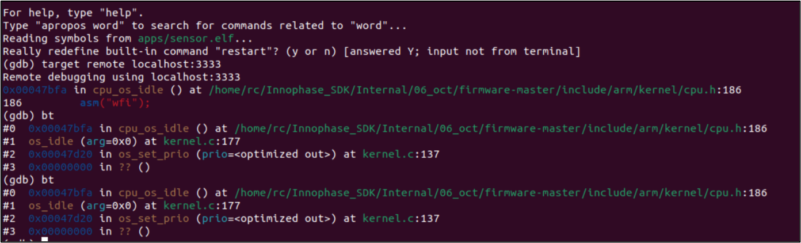
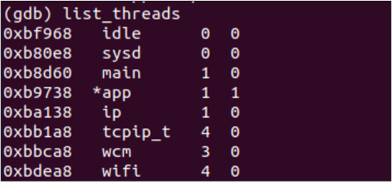
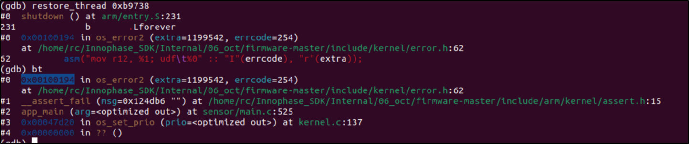
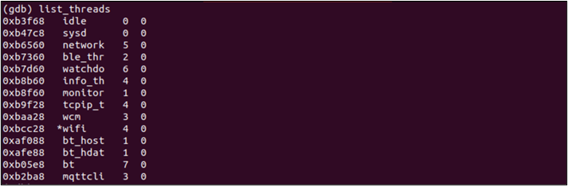
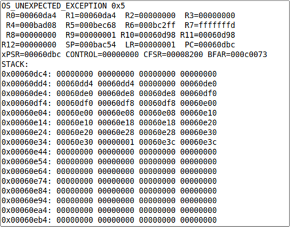
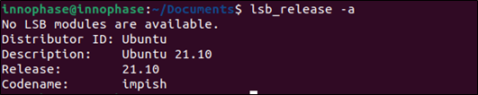
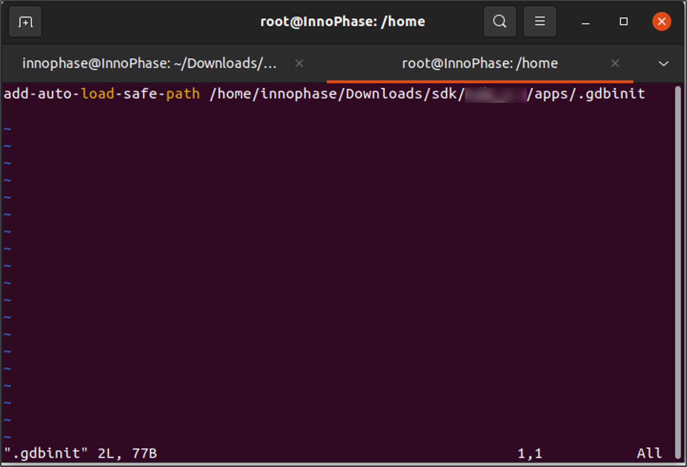

.. _Debugging using GDB:

This section describes the procedure for debugging the applications
using GDB to work with OpenOCD.

Prerequisites 
==============

Install Talaria TWO SDK 
------------------------

1. Download Talaria TWO SDK from the InnoPhase portal:
   https://innophaseiot.com/portal/portal-hub/

2. Unzip the SDK in an appropriate location as per requirement.

Required Software 
------------------

    - PC with Ubuntu 20.04 (or higher).
    - GNU GDB v.10.1 (or higher).

For the above Linux set-up, refer the following user guide:
UG_Environment_Setup_for_Linux.pdf.

Execute the following Linux command in any terminal window to determine
the versions of Ubuntu and GNU GDB:

For Ubuntu version:

.. code:: shell

    lsb_release -a

Console output:

|image1|

Figure : Ubuntu version

For GNU GDB version:

.. code:: shell

    gdb --version

**Note:** In case of Ubuntu 20.04, default version of the GDB is 9.2.
Hence, GDB needs to be updated

to version 10.2 by executing the following commands:

.. code:: powershell

    sudo add-apt-repository ppa:ubuntu-toolchain-r/test
    sudo apt-get update
    sudo apt-get -y --force-yes install gdb

Console output:

|image2|

Figure : GNU GDB version

Installing necessary packages
-----------------------------

In any terminal window, execute the following commands:

.. code:: powershell

    sudo apt update
    sudo apt install build-essential libc6-armel-cross
    libc6-dev-armel-cross binutils-arm-linux-gnueabi libncurses5-dev -y

Installing ARM toolchain
------------------------

From within a directory of your choice, execute the following command in
a terminal window to download the ARM toolchain:

.. code:: shell

    sudo apt install gcc-arm-none-eabi

Installing Python3 and dependencies 
------------------------------------

In any terminal window, execute the following commands to install
Python3 and other Python packages that will be needed. Enter the
password as prompted.

.. code:: shell

    sudo apt install python3 -y
    sudo apt install python3-pip -y
    pip3 install pyelftools pyserial pyusb pyftdi ecdsa pycryptodome

Installing OpenOCD
------------------

In any terminal window, execute the following command to install
OpenOCD. Enter the password as prompted.

.. code:: shell

    sudo apt install openocd -y

Install gdb-multiarch in any terminal window. Execute the following
command to install gdb-multiarch:

.. code:: shell

    sudo apt-get install gdb-multiarch

VM versus Non VM based application
==================================

There are two types of application that could be generated based on the
virtual memory usage for executing the application on Talaria TWO:

1. **VM based application:**

In case of a VM based application, a portion of the flash memory is
allocated to be used as virtual memory. The application stored in
Talaria TWO’s FLASH/ROM is loaded into virtual memory for execution by
the MCU.

2. **Non-VM based application:**

In case of a Non-VM image, no virtual memory is allocated and the MCU
executes the application by directly fetching it from Talaria TWO’s
ROM/Flash.

Procedure to Debug using GDB
============================

Following is the procedure to debug the VM-based applications using GDB:

1. Open the SDK folder in Ubuntu terminal and type the following command
   to start OpenOCD:

.. code:: shell

    sudo apt-get install gdb-multiarch

..

   Console output:

   |image3|

Figure : Starting openOCD

2. In a separate terminal, flash the virtual image from the SDK
   directory.

..

   For example: Consider wifi_connect.elf.

.. code:: shell

    ./script/boot.py --reset=evk42_bl --speed=2457600 --gdb
    examples/using_wifi/out/wifi_connect.elf

..

   **Note**: For the GDB to work, ELF needs to be loaded. By default,
   the SDK package contains ELF files in the bin folder (which are
   stripped ELF files). Hence, user needs to build the sample
   application, generate the ELF file (by default, it gets generated in
   the out folder) and load this ELF for debugging.

   Execute make for using_wifi example application
   (sdk_2.4/examples/using_wifi) to generate the ELFs under the out
   folder.

   |image4|

Figure : make command output for using_wifi

   Following is the output for a sample application wifi_connect.elf.
   The total number of bytes displayed in Figure 5 will vary with the
   ELF of the application being flashed.

   |image5|

Figure : Flashing the application from SDK directory

   .gdbinit initialization file contains the information on Talaria
   TWO’s memory regions and the required scripts of the GDB sources.
   gdbinit file is present under the apps folder. To start the GDB
   session, gdb-multiarch should be started from this folder.

   Command line method of configuring the gdbinit file

   GDB method relies on the GDB scripts. Initially, GDB needs to be
   configured to allow auto-load.

.. code:: shell

    echo "set auto-load safe-path /" > ~/.gdbinit

..

   Manual method of configuring the gdbinit file:

   If there are any warnings as shown in Figure 6, the gdb-multiarch
   does not work for GDB commands. Hence, create a file named gdbinit in
   the home directory to allow auto-load.

|image6|

Figure : Warning for .gdbinit file

   In the created gdbinit file add the following path:

   add-auto-load-safe-path/home/innophase/Downloads/sdk/sdk_2.4/apps/.gdbinit.

|image7|

Figure : Configuring the gdbinit file

Start the GDB Session 
----------------------

In a separate terminal, run the following command from the sdk_x.y/apps
directory. In this directory, there is a .gdbinit file that configures
the GDB. Here, the RAM portion of the ELF gets loaded.

**Note**: x and y in sdk_x.y refer to the SDK release version.

.. code:: shell

    gdb-multiarch ../examples/using_wifi/out/wifi_connect.elf

Console output:

|image8|

Figure : Running GDB

1. Connect to OpenOCD by running ocd in the GDB prompt.

.. code:: shell

    ocd

2. Set a break point at main:

.. code:: shell

    b main

3. Run the application by executing:

.. code:: shell

    R

4. The information on the break points set can be seen by issuing:

.. code:: shell

    info b

5. A break point at a line number of a particular source file can be set
   using:

.. code:: shell

    b <filename>: <linenum>

6. If the line to be executed is a function call, GDB will step into
   that function and start executing its code one line at a time.

.. code:: shell

    s

7. If the entire function needs to be executed with one keypress, type
   next or n.

+-----------------------------------------------------------------------+
| next                                                                  |
+=======================================================================+
+-----------------------------------------------------------------------+

8. Continue running the program (after stopping, for example at a
   breakpoint).

+-----------------------------------------------------------------------+
| continue                                                              |
+=======================================================================+
+-----------------------------------------------------------------------+

9. Step out is the operation that resumes execution after the function
   the program is executing terminates. The debugger will stop at the
   statement after the function call.

+-----------------------------------------------------------------------+
| finish                                                                |
+=======================================================================+
+-----------------------------------------------------------------------+

Example 1: Following is the output while debugging the wifi_connect.elf
using GDB:

+-----------------------------------------------------------------------+
| (gdb) ocd                                                             |
|                                                                       |
| 0x00023f36 in ?? ()                                                   |
|                                                                       |
| (gdb) b main                                                          |
|                                                                       |
| Breakpoint 1 at 0x100020: file wifi_connect/main.c, line 23.          |
|                                                                       |
| Note: automatically using hardware breakpoints for read-only          |
| addresses.                                                            |
|                                                                       |
| (gdb) R                                                               |
|                                                                       |
| JTAG tap: talaria_two.cpu tap/device found: 0x4ba00477 (mfg: 0x23b    |
| (ARM Ltd), part: 0xba00, ver: 0x4)                                    |
|                                                                       |
| target halted due to debug-request, current mode: Thread              |
|                                                                       |
| xPSR: 0x01000000 pc: 0x00020f90 msp: 0x00041a78                       |
|                                                                       |
| Loading section .text, size 0x1c538 lma 0x42000                       |
|                                                                       |
| Loading section .data, size 0x490 lma 0x5e538                         |
|                                                                       |
| Loading section .virt, size 0x24658 lma 0x2000000                     |
|                                                                       |
| Start address 0x0004ea1e, load size 266272                            |
|                                                                       |
| Transfer rate: 71 KB/sec, 14014 bytes/write.Breakpoint 1, main () at  |
| wifi_connect/main.c:23                                                |
|                                                                       |
| 23 const char \*ssid = os_get_boot_arg_str("ssid");                   |
|                                                                       |
| (gdb) info b                                                          |
|                                                                       |
| Num Type Disp Enb Address What                                        |
|                                                                       |
| 1 breakpoint keep y 0x00100020 in main at wifi_connect/main.c:23      |
|                                                                       |
| breakpoint already hit 1 time                                         |
|                                                                       |
| (gdb) del 1                                                           |
|                                                                       |
| (gdb) info b                                                          |
|                                                                       |
| No breakpoints or watchpoints.                                        |
|                                                                       |
| (gdb) b main.c:29                                                     |
|                                                                       |
| Breakpoint 2 at 0x10003c: file wifi_connect/main.c, line 29.          |
|                                                                       |
| (gdb) R                                                               |
|                                                                       |
| JTAG tap: talaria_two.cpu tap/device found: 0x4ba00477 (mfg: 0x23b    |
| (ARM Ltd), part: 0xba00, ver: 0x4)                                    |
|                                                                       |
| target halted due to debug-request, current mode: Thread              |
|                                                                       |
| xPSR: 0x01000000 pc: 0x00020f90 msp: 0x00041a78                       |
|                                                                       |
| Loading section .text, size 0x1c538 lma 0x42000                       |
|                                                                       |
| Loading section .data, size 0x490 lma 0x5e538                         |
|                                                                       |
| Loading section .virt, size 0x24658 lma 0x2000000                     |
|                                                                       |
| Start address 0x0004ea1e, load size 266272                            |
|                                                                       |
| Transfer rate: 71 KB/sec, 14014 bytes/write.Breakpoint 2, main () at  |
| wifi_connect/main.c:29                                                |
|                                                                       |
| 29 os_printf("Need to specify ssid and passphrase boot                |
| arguments\\n");                                                       |
|                                                                       |
| (gdb)                                                                 |
+=======================================================================+
+-----------------------------------------------------------------------+

Example 2 : Following is the output while debugging the wcma.elf using
GDB:

+-----------------------------------------------------------------------+
| (gdb) ocd                                                             |
|                                                                       |
| 0x00023f36 in ?? ()                                                   |
|                                                                       |
| (gdb) b wcma_test.c:73                                                |
|                                                                       |
| Breakpoint 1 at 0x10038c: file src/wcma_test.c, line 99.              |
|                                                                       |
| Note: automatically using hardware breakpoints for read-only          |
| addresses.                                                            |
|                                                                       |
| (gdb) R                                                               |
|                                                                       |
| JTAG tap: talaria_two.cpu tap/device found: 0x4ba00477 (mfg: 0x23b    |
| (ARM Ltd), part: 0xba00, ver: 0x4)                                    |
|                                                                       |
| target halted due to debug-request, current mode: Thread              |
|                                                                       |
| xPSR: 0x01000000 pc: 0x00020f90 msp: 0x00041a78                       |
|                                                                       |
| Loading section .text, size 0x19f78 lma 0x42000                       |
|                                                                       |
| Loading section .data, size 0x470 lma 0x5bf78                         |
|                                                                       |
| Loading section .virt, size 0x1bcb4 lma 0x2000000                     |
|                                                                       |
| Start address 0x0004cb8e, load size 221340                            |
|                                                                       |
| Transfer rate: 58 KB/sec, 13833 bytes/write.                          |
|                                                                       |
| Breakpoint 1, wcma_thread (arg=<optimized out>) at src/wcma_test.c:99 |
|                                                                       |
| 99 wcma_scan_retry(h, 3, &ap_manager);                                |
|                                                                       |
| (gdb) s                                                               |
|                                                                       |
| wcma_scan_retry (handle=0xbf8b0, retries=retries@entry=3,             |
| manager=manager@entry=0x5c3e8 <ap_manager>) at src/wcma_test.c:318    |
|                                                                       |
| 318 scan_result = os_alloc(max_nets \* sizeof(void \*));              |
|                                                                       |
| (gdb) b wcma_test.c:109                                               |
|                                                                       |
| Breakpoint 2 at 0x1003a8: file src/wcma_test.c, line 109.             |
|                                                                       |
| (gdb) R                                                               |
|                                                                       |
| JTAG tap: talaria_two.cpu tap/device found: 0x4ba00477 (mfg: 0x23b    |
| (ARM Ltd), part: 0xba00, ver: 0x4)                                    |
|                                                                       |
| target halted due to debug-request, current mode: Thread              |
|                                                                       |
| xPSR: 0x01000000 pc: 0x00020f90 msp: 0x00041a78                       |
|                                                                       |
| Loading section .text, size 0x19f78 lma 0x42000                       |
|                                                                       |
| Loading section .data, size 0x470 lma 0x5bf78                         |
|                                                                       |
| Loading section .virt, size 0x1bcb4 lma 0x2000000                     |
|                                                                       |
| Start address 0x0004cb8e, load size 221340                            |
|                                                                       |
| Transfer rate: 58 KB/sec, 13833 bytes/write.                          |
|                                                                       |
| Breakpoint 1, wcma_thread (arg=<optimized out>) at src/wcma_test.c:99 |
|                                                                       |
| 99 wcma_scan_retry(h, 3, &ap_manager);                                |
|                                                                       |
| (gdb) info b                                                          |
|                                                                       |
| Num Type Disp Enb Address What                                        |
|                                                                       |
| 1 breakpoint keep y 0x0010038c in wcma_thread at src/wcma_test.c:99   |
|                                                                       |
| breakpoint already hit 2 times                                        |
|                                                                       |
| 2 breakpoint keep y 0x001003a8 in wcma_thread at src/wcma_test.c:109  |
|                                                                       |
| (gdb) continue                                                        |
|                                                                       |
| Continuing.                                                           |
|                                                                       |
| Breakpoint 2, wcma_thread (arg=<optimized out>) at                    |
| src/wcma_test.c:109                                                   |
|                                                                       |
| 109 if(connection_status == AP_DISCONNECTED && reconnect_next_ap)     |
|                                                                       |
| (gdb) next                                                            |
|                                                                       |
| 116 if((os_systime() - last_disconnect_time) > 35000000) /\* 35       |
| seconds \*/                                                           |
+=======================================================================+
+-----------------------------------------------------------------------+

Connecting JTAG/SWD to Talaria TWO module
=========================================

Talaria TWO device allows programming and debugging through either of
JTAG or SWD interfaces. This section describes the hardware connections
between a debugger and Talaria TWO device.

**Note**: The Talaria TWO EVB already has the required hardware support
for JTAG.

|Chart Description automatically generated with medium confidence|

Figure : Hardware connections - JTAG

Pins 18,19,20 and 21 of Talaria TWO module are used for JTAG. However,
these pins can also be used as GPIOs for the application by disabling
the JTAG in the application.

Similar to JTAG, SWD also allows programming and debugging on Talaria
TWO but with a reduced hardware connection as shown in Figure 10.

|image9|

Figure : Hardware connections - SWD

For more information on GDB commands, refer:
https://sourceware.org/gdb/current/onlinedocs/gdb/.

Procedure to Debug using GDB through JTAG
-----------------------------------------

This section provides details regarding debugging the application
through JTAG. Make the connection between the debugger and Talaria TWO
device as shown in Figure 11.

1. Open the SDK folder in Ubuntu terminal and type the following command
   to start OpenOCD:

+-----------------------------------------------------------------------+
| openocd -s ./conf -f ftdi.cfg -f t2.cfg                               |
+=======================================================================+
+-----------------------------------------------------------------------+

Console output:

|image10|

Figure : Running OpenOCD for JTAG

2. In a separate terminal, run the following command from the apps
   directory. In this directory, there is a .gdbinit file that
   configures the GDB. Here, the RAM portion of the ELF gets loaded.

+-----------------------------------------------------------------------+
| gdb-multiarch ../examples/using_wifi/out/wifi_connect.elf             |
+=======================================================================+
+-----------------------------------------------------------------------+

Console output:

|image11|

Figure : Running GDB for JTAG

Follow the procedure mentioned in section: *Start the GDB Session* to
execute the GDB command.

Procedure to Debug using GDB through SWD
----------------------------------------

This section provides details regarding debugging the application
through SWD. Make the connection between the debugger and Talaria TWO
device as shown in Figure 10.

1. Open the SDK folder in Ubuntu terminal and type the following command
   to start OpenOCD:

+-----------------------------------------------------------------------+
| openocd -s ./conf -f ftdi_swd.cfg -f t2_swd.cfg                       |
+=======================================================================+
+-----------------------------------------------------------------------+

Console output:

|image12|

Figure : Running OpenOCD for JTAG

2. In a separate terminal, run the following command from the apps
   directory. In this directory, there is a .gdbinit file that
   configures the GDB. Here, the RAM portion of the ELF gets loaded.

+-----------------------------------------------------------------------+
| gdb-multiarch ../examples/using_wifi/out/wifi_connect.elf             |
+=======================================================================+
+-----------------------------------------------------------------------+

Console output:

|image13|

Figure : Running GDB for JTAG

3. Follow the procedure mentioned in section: *Start the GDB Session* to
   run the GDB commands.

Procedure to Debug using GDB in Windows CMD
===========================================

.. _prerequisites-1:

Prerequisites
-------------

1. Windows PC

2. OpenOCD setup

3. GDB-Multiarch setup

OpenOCD Setup
-------------

To install the environment for GDB debugging in Windows, follow the
instructions described in sections: *Prerequisites for Eclipse* and *Add
Paths to the Environment Variable* of the document:
UG_Eclipse_Setup_Windows.docx
(*sdk_x.y\\doc\\user_guides\\ug_eclipse_setup_windows\\*).

GDB-Multiarch
-------------

MSYS2 is a collection of tools and libraries, which provides an
easy-to-use environment for building, installing and running in native
Windows software. MSYS2 allows user to install GDB-Multiarch in windows
machine.

Download the installer from the following link:
https://www.msys2.org/\ *.*

Follow the installation procedure available in the above link. After
completing the installation, click on Finish, which will create a popup
for MSYS2 CMD line interface.

|image14|

Figure : Running MSYS2

Run the following command in MSYS2 terminal and proceed with
installation.

+-----------------------------------------------------------------------+
| pacman -Syu                                                           |
+=======================================================================+
+-----------------------------------------------------------------------+

|image15|

Figure : Installing mingw setup

Once the installation is complete, the window will be automatically
closed. Run MSYS2 MSYS from the Start menu and run the following command
in terminal to update the rest of the base packages.

Proceed with installation.

+-----------------------------------------------------------------------+
| pacman -Syu                                                           |
+=======================================================================+
+-----------------------------------------------------------------------+

After completing the installation, run the following command to install
GDB-Multiarch:

+-----------------------------------------------------------------------+
| pacman -S --needed base-devel mingw-w64-x86_64-toolchain              |
+=======================================================================+
+-----------------------------------------------------------------------+

Enter a selection number, for GDB-Multiarch as shown in figure.

|image16|

Figure : Iinstalling gdb-multiarch

Add MSYS2 path in environmental variable to access GDB-Multiarch in
command line. To add path to environment variable, follow the steps
mentioned in section: *Add Paths to the Environment Variable* of the
document for MSYS2: UG_Eclipse_Setup_Windows.pdf
((*sdk_x.y\\doc\\user_guides\\ug_eclipse_setup_windows\\*).

|image17|

Figure : Adding environment variable

.. _procedure-to-debug-using-gdb-1:

Procedure to Debug using GDB
----------------------------

Following is the procedure to debug the VM-based applications using GDB:

1. Open the SDK folder in windows command line and type the following
   command to start OpenOCD:

+-----------------------------------------------------------------------+
| openocd -s .\\conf -f ftdi.cfg -f t2.cfg                              |
+=======================================================================+
+-----------------------------------------------------------------------+

Console output:

|image18|

Figure : Running Openocd in windows CMD

2. Use the Download Tool to flash the virtual image from the SDK
   directory.

For example: Consider wifi_connect.elf.

**Note**: For the GDB to work, ELF needs to be loaded. By default, the
SDK package contains ELF files in the bin folder (which are stripped ELF
files). Hence, the user needs to build the sample application, generate
the ELF file (by default, the ELF gets generated in the out folder) and
load this ELF for debugging.

For building in windows, follow the steps described in section:
*Building Application in Eclipse* of the document:
UG_Eclipse_Setup_Windows.pdf
((*sdk_x.y\\doc\\user_guides\\ug_eclipse_setup_windows\\*).

Execute the make for using_wifi example application
(*sdk_x.y\\examples\\using_wifi*) to generate the ELFs under the out
folder.

|image19|

Figure : Running make command in windows CMD

.gdbinit initialization file contains the information on Talaria TWO’s
memory and the required scripts of the GDB sources. gdbinit file is
present under the *apps\\* folder. To start the GDB session,
gdb-multiarch should be started from this folder.

Manual method of configuring the gdbinit file:

If there are any warnings as shown in Figure 6, the gdb-multiarch will
not work for GDB commands. Hence, create a file named gdbinit in the
home directory to allow auto-load.

|image20|

Figure : Warning for .gdbinit file

In the created gdbinit file, add the following path:

add-auto-load-safe-path
C:\\Users\\innop\\Music\\sdk_2.5alpha\\apps\\.gdbinit

|image21|

Figure : Configuring the gdbinit file

Start a GDB session
-------------------

In a separate terminal, run the following command from the
*sdk_x.y\\apps* folder. In this directory, there is a .gdbinit file that
configures the GDB. Here, the RAM portion of the ELF gets loaded.

|image22|

Figure Running GDB

1. Connect to OpenOCD by running ocd in the GDB prompt.

+-----------------------------------------------------------------------+
| ocd                                                                   |
+=======================================================================+
+-----------------------------------------------------------------------+

2. Set a break point at main:

+-----------------------------------------------------------------------+
| b main                                                                |
+=======================================================================+
+-----------------------------------------------------------------------+

3. Run the application by executing:

+-----------------------------------------------------------------------+
| R                                                                     |
+=======================================================================+
+-----------------------------------------------------------------------+

4. Information on the break points set can be seen by issuing:

+-----------------------------------------------------------------------+
| info b                                                                |
+=======================================================================+
+-----------------------------------------------------------------------+

5. A break point at a line number of a particular source file can be set
   using:

+-----------------------------------------------------------------------+
| b <filename>: <linenum>                                               |
+=======================================================================+
+-----------------------------------------------------------------------+

6. If the line to be executed is a function call, GDB will step into
   that function and start executing its code one line at a time.

+-----------------------------------------------------------------------+
| s                                                                     |
+=======================================================================+
+-----------------------------------------------------------------------+

7. If the entire function needs to be executed with one key press, type
   next or n.

+-----------------------------------------------------------------------+
| next                                                                  |
+=======================================================================+
+-----------------------------------------------------------------------+

8. Continue running the program (after stopping, for example at a
   breakpoint).

+-----------------------------------------------------------------------+
| continue                                                              |
+=======================================================================+
+-----------------------------------------------------------------------+

9. Step out is the operation that resumes execution after the function
   the program is executing terminates. The debugger will stop at the
   statement after the function call.

+-----------------------------------------------------------------------+
| finish                                                                |
+=======================================================================+
+-----------------------------------------------------------------------+

Example 1: Following is the output while debugging the wifi_connect.elf
using GDB:

+-----------------------------------------------------------------------+
| (gdb) ocd                                                             |
|                                                                       |
| warning: A handler for the OS ABI "Windows" is not built into this    |
| configuration                                                         |
|                                                                       |
| of GDB. Attempting to continue with the default armv7 settings.       |
|                                                                       |
| 0x00023f36 in ?? ()                                                   |
|                                                                       |
| (gdb) b main                                                          |
|                                                                       |
| Breakpoint 1 at 0x150e04: file src/wifi_connect.c, line 79.           |
|                                                                       |
| Note: automatically using hardware breakpoints for read-only          |
| addresses.                                                            |
|                                                                       |
| (gdb) R                                                               |
|                                                                       |
| JTAG tap: talaria_two.cpu tap/device found: 0x4ba00477 (mfg: 0x23b    |
| (ARM Ltd.), part: 0xba00, ver: 0x4)                                   |
|                                                                       |
| target halted due to debug-request, current mode: Thread              |
|                                                                       |
| xPSR: 0x01000000 pc: 0x00020f90 msp: 0x00041a78                       |
|                                                                       |
| Loading section .text, size 0x13778 lma 0x42000                       |
|                                                                       |
| Loading section .data, size 0x520 lma 0x55778                         |
|                                                                       |
| Loading section .virt0, size 0x10a28 lma 0x2000000                    |
|                                                                       |
| Loading section .virt1, size 0x17c98 lma 0x3000000                    |
|                                                                       |
| Loading section .virt2, size 0x22824 lma 0x4000000                    |
|                                                                       |
| Loading section .virt3, size 0x628 lma 0x5000000                      |
|                                                                       |
| Loading section .virt4, size 0x5704 lma 0x6000000                     |
|                                                                       |
| Loading section .virt5, size 0x2ec lma 0x7000000                      |
|                                                                       |
| Start address 0x00047d00, load size 412564                            |
|                                                                       |
| Transfer rate: 71 KB/sec, 13308 bytes/write.                          |
|                                                                       |
| Program received signal SIGTRAP, Trace/breakpoint trap.               |
|                                                                       |
| shutdown () at arm/entry.S:196                                        |
|                                                                       |
| 196 arm/entry.S: No such file or directory.                           |
|                                                                       |
| (gdb) info b                                                          |
|                                                                       |
| Num Type Disp Enb Address What                                        |
|                                                                       |
| 1 breakpoint keep y 0x00150e04 in main at src/wifi_connect.c:79       |
|                                                                       |
| (gdb) del 1                                                           |
|                                                                       |
| (gdb) info b                                                          |
|                                                                       |
| No breakpoints or watchpoints.                                        |
|                                                                       |
| (gdb) b main.c:29                                                     |
|                                                                       |
| Breakpoint 2 at 0x112704: file core/main.c, line 30.                  |
|                                                                       |
| (gdb) R                                                               |
|                                                                       |
| JTAG tap: talaria_two.cpu tap/device found: 0x4ba00477 (mfg: 0x23b    |
| (ARM Ltd.), part: 0xba00, ver: 0x4)                                   |
|                                                                       |
| target halted due to debug-request, current mode: Thread              |
|                                                                       |
| xPSR: 0x01000000 pc: 0x00020f90 msp: 0x00041a78                       |
|                                                                       |
| Loading section .text, size 0x13778 lma 0x42000                       |
|                                                                       |
| Loading section .data, size 0x520 lma 0x55778                         |
|                                                                       |
| Loading section .virt0, size 0x10a28 lma 0x2000000                    |
|                                                                       |
| Loading section .virt1, size 0x17c98 lma 0x3000000                    |
|                                                                       |
| Loading section .virt2, size 0x22824 lma 0x4000000                    |
|                                                                       |
| Loading section .virt3, size 0x628 lma 0x5000000                      |
|                                                                       |
| Loading section .virt4, size 0x5704 lma 0x6000000                     |
|                                                                       |
| Loading section .virt5, size 0x2ec lma 0x7000000                      |
|                                                                       |
| Start address 0x00047d00, load size 412564                            |
|                                                                       |
| Transfer rate: 71 KB/sec, 13308 bytes/write.                          |
|                                                                       |
| Program received signal SIGTRAP, Trace/breakpoint trap.               |
|                                                                       |
| shutdown () at arm/entry.S:196                                        |
|                                                                       |
| 196 in arm/entry.S                                                    |
|                                                                       |
| (gdb)                                                                 |
+=======================================================================+
+-----------------------------------------------------------------------+

.. |image22| image:: media/image21.png
   :width: 5.90551in
   :height: 2.31644in
