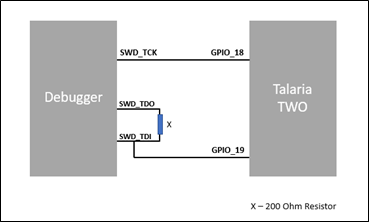
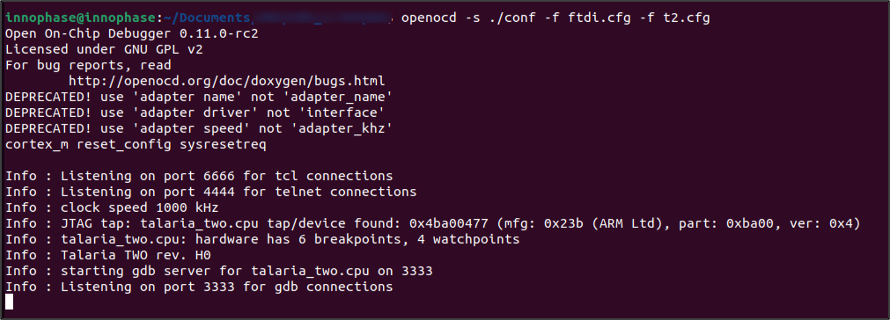
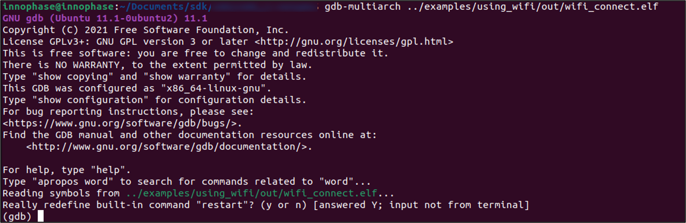
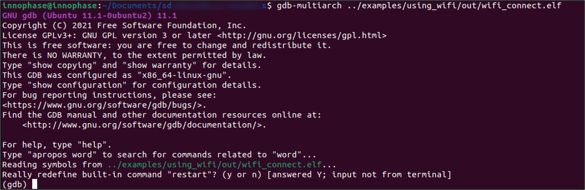

.. _Debugging using Coredump:

Debugging using Coredump
########################

This section describes the procedure for generating a core dump and
analyzing it to understand the possible reasons for the software crash.

Prerequisites 
==============

Install Talaria TWO SDK
-----------------------

1. Download Talaria TWO FreeRTOS SDK from the InnoPhase portal:
   https://innophaseiot.com/portal/portal-hub/

2. Unzip the SDK in an appropriate location as per requirement.

Required Software
-----------------

1. PC with Ubuntu 20.04 (or higher).

2. GNU GDB v.10.1 (or higher).

**Note**: For details regarding Linux set-up, refer the following
document: UG_Environment_Setup_for_Linux.pdf.

Talaria TWO Software Crash
==========================

When the application on Talaria TWO crashes, a coredump file can be
generated. Coredump captures the working memory of the application and
firmware and generates a coredump file that is used for analyzing the
cause of the crash.

Following method is used to collect the coredump:

Assuming Talaria TWO has already crashed for a particular reason and is
currently in a crashed state, open a new terminal window in Linux and
execute the commands mentioned in the following section to collect core
dump.

Generate Coredump from within GDB 
----------------------------------

1. Execute the following command in VM UBUNTU Linux shell

.. code:: shell

    echo "set auto-load safe-path /" > ~/.gdbinit

2. Change directory to conf folder in SDK

.. code:: shell

    cd ~/sdks/freertos_sdk_x.y

3. Execute the following command from the same shell as mentioned in
   step 2

.. code:: shell

     openocd -s ./conf -f ftdi.cfg -f t2.cfg

4. Let the openocd run in the current shell and open a new Linux shell
   to execute the following. The output of the openocd execution is
   shown in Figure 1.

|image21|

Figure 1: Terminal output

5. Execute the following command from apps folder

**Note**: The default elf given with the SDK package under bin will be a
stripped one and this cannot be used for coredump analysis. Hence, do a
make for the application which needs to be tested and use the elf from
the out folder.

.. code:: shell

    gdb-multiarch ./my_test.elf

6. gdb session will start now and execute the command ocd in GDB
   session.

.. code:: shell

    ocd

7. Collect the core dump using the following command:

.. code:: shell

     (gdb) coredump coredump_any_filename.bin

8. Core dump is collected in coredump_any_filename.bin.

9. Core dump file can be opened using xxd editor to check the content\
   from the Linux shell.

.. code: shell

     xxd coredump_any_filename.bin

Output for the sample elf is as shown in Figure 2.

|image22|

Figure 2: Opening the coredump file

Analyzing the Coredump
======================

The coredump analysis will be done after capturing the coredump file to
identify the section of the code that caused the crash. The following
procedure describes the core dump analysis.

1. Start GDB server with the coredump file from the SDK directory:

.. code:: shell

     ./script/gdbremote.py --core coredump.bin 

and the GDB will start listening on port 3333.

|image23|

Figure 3: GDB listening on port 3333

2. Start GDB to inspect the coredump in a separate terminal from the SDK
   directory:

.. code:: shell

      gdb-multiarch apps/my-program.elf   

and the GDB prompt is observed.

3. In the GDB prompt execute the following command:

.. code:: shell

     (gdb) target remote localhost:3333   

The following output is observed once the remote debugging has started.

|image24|

Figure 4: Remote debugging

Capturing a Back Trace 
-----------------------

Backtrace shows the point of crash which helps identify the problem. It
shows the contents of the stack. In this section, the analysis of the
coredump is done for two applications that has crashed for different
reasons.

**Sample application-1:**

1. Execute the following instruction:

.. code:: shell

     (gdb) bt

The bt instructions prints the content of the stack.

|image25|

Figure 5: Contents of the stack

