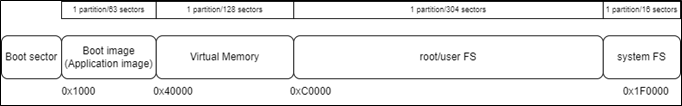
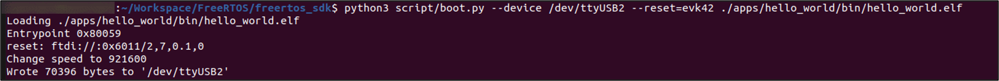
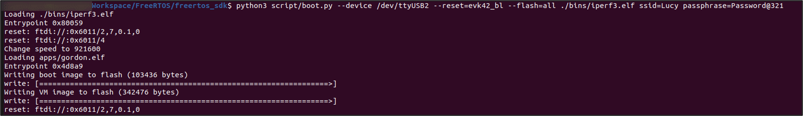
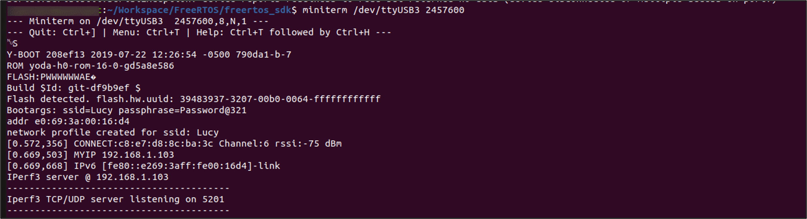
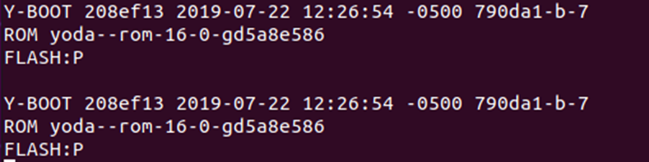

.. _memory mapping page:

Memory Mapping
##############

This section describes the flash memory mapping of standard applications
with details on the flash memory layout in both development and
production phase.

Memory Mapping of a Standard Application
========================================

There is a total of 512KB RAM in Talaria TWO. RAM address starts from
0x40000 to 0xBFFFF. Figure 1 shows the logical RAM address. Boot.py
writes to this memory address on executing Program RAM.

When an ELF is created, the map file of the application includes
multiple sections like .text, .data and .bss.

Size of the on-module Flash is 2MB. On executing PROG Flash, boot.py
will look for the boot partition sector for flashing the Non-VM part and
VM partition sector for flashing the VM part which is 0x1000 and 0x40000
in-line with the latest default.json.

BOOT, SYS, VIRT sections of the partition table are fixed, whereas the
DATA section can be manipulated. There are a total of 511 sectors i.e. 0
to 511, where each sector is 4096 bytes.

|image1|

Figure 1: Memory mapping - standard application

Flash Layout – Development
==========================

Figure 2 shows the entire filesystem layout. The boot sector starts from
0x0000 to 0x1F0000.

1. Boot sector: This sector stores the following information:

   a. Secure vault data

   b. PUF data

   c. Partition table

   d. Device information – this includes MAC address, Bluetooth MAC
      address, module testing location, station ID, etc.

2. Application Image: On boot-up, a device executes necessary actions
   and begins to load the application from 0x1000 onwards. In case of a
   VM application, the application is loaded from 0x40000 onwards.

..

   Any application size can be known using the following command:

.. code:: shell

     arm-none-eabi-size app_name.elf  

3. data/user filesystem: User data is stored in this sector. Maximum
   size of the user filesystem is 300 sectors, close to half of the
   flash memory. Typical files stored in the user filesystem are AWS
   certificates, regularly required look up tables.

..

   For example: the Write Files/Read Files data from the Download Tool
   is stored in this sector.

4. sysfs: Calibration information generated during production or testing
   (RF testing) is stored in this sector starting from 0x1F0000.

The flash layout shown in Figure 2 is followed when the customer is in
the development phase and is using the Download Tool for loading a
single application.

|image2|

Figure 2: Flash layout

Memory Mapping – VM based application
=====================================

Figure 3 shows the memory layout for an ELF.

VM application is used to allow more memory available to the
application.

|image3|

Figure 3: Memory mapping - VM based application

Flash Layout 
=============

**Note**: SSBL support is not provided with the current release of the
SDK.

Once the customer moves from the development phase to the production
phase, there are two types of flash layouts which the customer could
follow:

1. For loading a single image/ELF as shown in Figure 4.

2. For loading multiple images/ELFs (This also represents the flash
   layout for SSBL) as shown in Figure 5.

..

   Following are the components of the flash layout when using SSBL:

1. Boot sector: This sector stores the following information:

   a. Secure vault data

   b. PUF data

   c. Partition table

   d. Device information – this includes MAC address, Bluetooth MAC
      address, module testing location, station ID, etc.

2. Boot Image: The SSBL application upon flashing is stored here
   starting from 0x1000

..

   **Note**:

a. When using SSBL, SSBL is loaded at 0x1000 (Boot image) and based on
   the SSBL configuration, application/elf image is loaded.

b. Without SSBL, the application which is flashed is loaded onto Virtual
   Memory at 0x40000 if it is a VM application, otherwise, it is loaded
   at 0x1000.

3. Sectors available for apps: Multiple ELFs/applications can be stored
   in this sector. A total of 352 sectors are made available for the
   same. Depending on the instructions provided in the partition table,
   SSBL will load the appropriate application.

..

   For more information on SSBL application, refer to the following
   document:
   *freertos_sdk_x.y/apps/ssbl/doc/Application_for_using_SSBL.pdf*.

4. root/user FS: User data is stored in this sector.

5. system FS: Calibration information generated during production or
   testing (RF testing) is stored in this sector.

|image4|

Figure 4: Flash layout - when using SSBL

|image5|

Figure 5: Flash layout - without using SSBL

Program RAM
===========

Prog RAM will write the application to SRAM (Static RAM). This
application gets erased on reset. If VM partition is not present,
boot.py will create a VM partition and add it to partition table.

Command:

.. code:: shell

      python3 script/boot.py --device /dev/ttyUSB2 --reset=evk42
      ./apps/hello_world/bin/hello_world.elf    

|image6|

Figure 6: Program RAM – Terminal

|image7|

Figure 7: Program RAM - Console output

Program Flash
=============

Prog Flash writes the application onto Talaria TWO’s Flash. The
application is stored in the non-volatile region of the memory where it
is not erased even after reset.

Command:

.. code:: shell

     python3 script/boot.py --device /dev/ttyUSB2 --reset=evk42_bl
     --flash=all ./bins/iperf3.elf ssid=xxxxxxxx passphrase=xxxxxxx

|image8|

Figure 8: Program Flash - Terminal

Expected output:

|image9|

Figure 9: Program Flash - Console output

Erase Flash
===========

For erase flash, load Gordon in BL mode and then erase the boot sector.
Erase flash will only erase the first sector i.e., sector number 1. Boot
sector starts from 1 to 63.

Bootloader is used to boot the application. In the case of SSBL, SSBL is
flashed post which SSBL loads any required application. Gordon image is
a utility which helps write data/application onto Talaria TWO Flash. On
executing Prog Flash, Gordon is initialized and it helps write
applications to Flash.

**Note**:

1. Console window will be lost as we are loading Gordon in BL mode.

2. Currently, one cannot erase the user filesystem. To erase the
   filesystem, user can write an empty file using the Download Tool.

Loading gordon.elf:

.. code:: shell

      python3 script/boot.py --device /dev/ttyUSB2 --reset=evk42_bl
      apps/gordon.elf 

|image10|

Figure 10: Loading gordon.elf - Terminal

Erasing the boot sector:

.. code:: shell

    python3 script/flash.py --device /dev/ttyUSB2 erase 1 63   

|image11|

Figure 11: Erasing the boot sector – Terminal

Expected output:

|image12|

Figure 12: Erase Flash - Console output

Write Filesystem to Flash
=========================

For this mklittlefs tool is required, which can be found at:
tools/mklittlefs.

Create root.img:

.. code:: shell

      ./mklittlefs -s 0x40000 -c ../../root_fs/root root.img 

Load Gordon and write root.img:

.. code:: shell

      python3 script/boot.py --device /dev/ttyUSB2 --reset=evk42
      apps/gordon.elf  

Write image to flash:

.. code:: shell

      python3 script/flash.py --device /dev/ttyUSB2 write 0xD0000
      ./tools/mklittlefs/root.img   

**Note**: 0xD0000 is used as DATA sector starts with sector number 208
(208*4096 = 0xD0000).

|image13|

Figure 13: Sector number

.. |image3| image:: media/image3.png
   :width: 7.48031in
   :height: 1.47581in

.. |image11| image:: media/image11.png
   :width: 7.48031in
   :height: 1.07287in

