Command Line Interface Commands
---------------------------------

This section serves as a reference guide for Talaria TWO CLI commands,
its usage, use case or examples in different scenarios supported by
Talaria TWO modules.

Introduction 
~~~~~~~~~~~~~~~~~

The subsequent sections introduce the use of commands in the CLI
environment to access the Talaria TWO (T2) module and configure the
device to perform various development, automation and testing tasks.

These commands run Python scripts from the host machine (Windows or
Linux), in conjunction with the application software that are loaded to
and are running in the Talaria TWO device. The script files and the
Talaria TWO reference/example applications are provided in the Talaria
TWO SDK release package in the following folders:

1. freertos_sdk/apps: Talaria TWO applications that are the core and
   basic release applications.

2. freertos_sdk/examples: Collection of Talaria TWO software apps along
   with components for Talaria TWO software development. They are
   organized in various technology areas and implementation examples,
   together with the projects and make files.

3. freertos_sdk/script: Python scripts/utilities to configure and
   program the device.

4. Other folders.

Primary Scripts for CLI Operations
~~~~~~~~~~~~~~~~~~~~~~~~~~~~~~~~~~~

Written in the Python language, three script files for executing CLI
operations are provided in the SDK for the user’s convenience that can
be used for evaluation, testing, and development of Talaria TWO based
systems.

1. sdk/script/boot.py

2. sdk/script/flash.py

3. sdk/script/storage.py

Based on the arguments provided command line, the scripts performs
various functions.

boot.py
~~~~~~~~~~~~~~~~~

Following are the basic functionalities of boot.py:

1. Load app to memory (RAM) on Talaria TWO module:

This script reads the application (in ELF format) provided in command
line, along with the arguments to load the app to Talaria TWO in its
memory, via the host and device interface. USB is used only in the
evaluation, development or testing phase.

2. Write app to flash on Talaria TWO module:

This script reads the application (in ELF format) provided in command
line, along with the arguments to write the app to Talaria TWO in its
flash, with the default handling by the script, via the host and device
interface. USB is used only in the evaluation, development or testing
phase.

3. Create .img file from ELF file

This script reads the name of the app file (in ELF format) provided in
command line to generate the .img file for flash download.

**Note**: Refer section `Using boot.py <#using-boot.py>`__ for more
details.

flash.py
~~~~~~~~~~~~~~~~~

Script to read and write to the flash, which requires gordon.elf
application.

This section provides details on script usage and prerequisites.

**Note**: Refer section `Using flash.py <#using-flash.py>`__ for more
details.

**Prerequisite/precondition to run flash.py**:

4. Program Talaria TWO with the Gordon app (gordon.elf)

5. gordon.elf application is available from the following folder:
   *freertos_sdk_x.y/apps/gordon.elf*.

6. Gordon is an application that enables access to Talaria TWO's flash
   over Host I/O, including partitioning and filesystem access and raw
   reads/writes to flash.

7. Boot.py script is used to program the gordon.elf onto Talaria TWO.
   Execute the following command to accomplish the same:

+-----------------------------------------------------------------------+
| ./script/boot.py [device] <path>/gordon.elf                           |
+=======================================================================+
+-----------------------------------------------------------------------+

**Load app .img file to flash on Talaria TWO module:**

This script reads the name of the app file (in .img format) provided in
command line, along with the arguments to write the app to Talaria TWO
in its flash with the write command and user-specified location (in
hex), via the host and device interface (USB/Serial).

Create image file (.img) from the ELF file of an application:

+-----------------------------------------------------------------------+
| ./script/boot.py –output <output_path>/app.img <elf_path>/app.elf     |
+=======================================================================+
+-----------------------------------------------------------------------+

**Read/Write Partition Table on module:**

This script reads from/writes the partition table on the device (in the
json file).

storage.py
~~~~~~~~~~~~~~~~~

Storage file access utility. Following are the basic file system access
functionalities of storage.py:

1. Display the file system contents

2. Read file from the device to store in the location on host

3. Write file from the host to the device

4. Write the network config file (.json file) into Talaria TWO file
   system to configure L2 parameters such as SSID, passphrase, BSSID,
   security type and certificates for EAP authentication

Refer section `Storage Data & File:
Read/Write <#storage-data-file-readwrite>`__ for the details.

Device Interface on Host Machine
~~~~~~~~~~~~~~~~~

CLI commands are supported on both Linux and Windows OS. However, there
are some limitations on the same functionality in the Windows
environment, which are highlighted in the respective sections.

Device Port Identification on Linux OS
~~~~~~~~~~~~~~~~~

Generally, the host interface connected to the device takes the form of
the device USB ports on Linux OS, /dev/ttyUSBn. Once connected to
Talaria TWO EVB, the host detects 4 USB ports for the connected device.

Type in the Ls command in Linux to list the USB ports:

+-----------------------------------------------------------------------+
| $ ls /dev/ttyUSB\*                                                    |
+=======================================================================+
+-----------------------------------------------------------------------+

|Text Description automatically generated with medium confidence|

Figure : USB ports

From the ports listed, identify the following ports:

1. /dev/ttyUSB2: Connected to the peripheral UART of Talaria TWO module

2. /dev/ttyUSB3: Connected to the console port (GPIO17) which is
   unidirectional UART from the Talaria TWO module. It operates at a
   high baud rate 2457600 (default), used for debug prints.

With this information available, all CLI commands should use the
following argument for the peripheral port to the device in the command
line:

+-----------------------------------------------------------------------+
| ./script/boot.py --device /dev/ttyUSB2 --reset=evk42_bl               |
| ./apps/hello_world/bin/hello_world.elf                                |
+=======================================================================+
+-----------------------------------------------------------------------+

This loads the helloworld app provided in SDK to Talaria TWO memory.

Launch miniterm, a small terminal application, to open the /dev/ttyUSB3
device port.

+-----------------------------------------------------------------------+
| $ miniterm /dev/ttyUSB3 2457600                                       |
+=======================================================================+
+-----------------------------------------------------------------------+

When an application runs on the device, it prints out debug messages
through the console port.

|Text Description automatically generated|

Figure : Debug messages displayed through console port

If there are multiple Talaria TWO devices where each of them has their
own console port connected to the host via the USB interface, it will be
sufficient to use the respective /dev/ttyUSBn with the command.

For instance, two Talaria TWO devices with USB connected.

|image1|\ |image2|\ |image3|

Figure : 2 Talaria TWO devices with USB connected

Figure 4 and Figure 5 show that the miniterm app is run on two separate
terminals using respective device ports to communicate with the
respective device.

|image4|\ |image5|

Figure : /dev/ttyUSB3

|image6|\ |image7|

Figure : /dev/ttyUSB7

Device Port Identification on Windows OS
~~~~~~~~~~~~~~~~~~~~~~~~~~~~~~~~~~~~~~

On a Windows platform, some control functionalities associated with the
CLI device-reset feature requires additional support provided by
installation of the libusbK library.

There are two ways for a Windows host to interface with the device EVB
connected to the host via USB interface:

1. A Windows system with the libusbK installed (recommend)

The library can be installed with the Zadig tool: https://zadig.akeo.ie/

2. A Windows system without the libusbK installed

This is the default configuration when the EVB with USB is detected by
Windows. It finds a generic, default USB/Serial driver to handle the
device interface. In this setup, not all functionalities offered by the
script tools are available.

Depending on the environment where the libusbK is installed or not, CLI
use can be described as follows:

**On Windows Platform with libusbK installed (recommended)**

On this serial communication setup, Windows host is communicating with
the device using the libusbK driver.

The libusbK’s installation and use by the host can be checked from the
Windows Device Manager display.

|Graphical user interface, text Description automatically generated|

Figure : libusbK driver installation

If there are multiple Talaria TWO devices connected, the Windows Device
Manager appears:

|Graphical user interface, text, application Description automatically
generated|

Figure : Multiple Talaria TWO devices connected

With this setup in place, all CLI commands should use the following
argument for the input port to the device in command line:

+-----------------------------------------------------------------------+
| ftdi://ftdi:4232/3                                                    |
+=======================================================================+
+-----------------------------------------------------------------------+

where,

3. 4232: Device ID for the FTDI 4232H device on EVK

4. 3: FTDI UART interface ID for the input/programming on EVK

With this information available, all CLI commands should use the
following argument for the peripheral port to the device in the command
line:

+-----------------------------------------------------------------------+
| python script\\boot.py --device ftdi://ftdi:4232/3 --reset=evk42_bl   |
| apps/hello_world/bin/hello_world.elf                                  |
+=======================================================================+
+-----------------------------------------------------------------------+

|image8|

Figure : Flashing to Talaria TWO

This command loads the helloworld app provided in SDK to Talaria TWO
memory.

If there are multiple Talaria TWO devices where each of them has their
own peripheral port connected to the host via the USB interface, the
device specifier must be expanded with the serial ID of the device in
the command line. This is accomplished with the keyword --SN. Execute
the following steps:

1. Append to the device port with the following string:

+-----------------------------------------------------------------------+
| ftdi://ftdi:4232:**<device_serial_id>**/3, which is followed by: --SN |
| **<device_serial_id>**                                                |
+=======================================================================+
+-----------------------------------------------------------------------+

2. Peripheral port to the device in the command line:

+-----------------------------------------------------------------------+
| python script\\boot.py --device ftdi://ftdi:4232:**10110001**/3       |
| --reset=evk42_bl --SN **10110001**                                    |
| apps/hello_world/bin/hello_world.elf                                  |
+=======================================================================+
+-----------------------------------------------------------------------+

|image9|

Figure 9: Expanding the device specifier

<device_serial_id>:

The hyphen ‘-‘ is a valid character in a serial ID of a device, if
present. In other words, a serial ID of 11010391 is considered different
than 1101-0391.

Example of a device with serial ID 00166d4:

+-----------------------------------------------------------------------+
| python script\\boot.py --device ftdi://ftdi:4232:**0016d4**/3         |
| --reset=evk42_bl --SN **0016d4** apps/hello_world/bin/hello_world.elf |
+=======================================================================+
+-----------------------------------------------------------------------+

|image10|

Figure : Device with serial ID 0016d4

**On Windows Platform using COM port (without the libusbK installed)**

On this serial communication environment, Windows host is communicating
with the device using the standard (default) USB/Serial driver.

|Graphical user interface, text, application, chat or text message
Description automatically generated|

Figure : Standard (default) USB/serial driver

In the listed ports, identify the following ports:

1. COM6: Connected to the peripheral UART of Talaria TWO module

2. COM7: Connected to the console port (GPIO17) which is unidirectional
   UART from Talaria TWO module and operates at a high baud rate 2457600
   (default), used for debug print

With this setup in place, all CLI commands can use the following
argument for the input port to the device in the command line:

+-----------------------------------------------------------------------+
| python script\\boot.py --device COM6 apps\\gordon.elf                 |
+=======================================================================+
+-----------------------------------------------------------------------+

This command loads the gordon app provided in SDK to Talaria TWO memory.

CLI Command Syntax and List Parameters
~~~~~~~~~~~~~~~~~~~~~~~~~~~~~

All commands with arguments are entered in a space-separated fashion.

Positional and Optional Arguments

Arguments should be passed on to the app to be loaded into the Talaria
TWO device with the script. There are two different types of arguments:

1. Positional Arguments

Positional arguments must be included in the right order. Their
positions in the sequence should be correct.

2. Optional Arguments

Optional arguments are optional. Defaults will be used when the
arguments are not specified in the command line.

Using boot.py
~~~~~~~~~~~~~~~~~

1. Command syntax to run boot.py

+-----------------------------------------------------------------------+
| <path_script>/boot.py [device] <path_app_elf>/app.elf [boot_args]     |
+=======================================================================+
+-----------------------------------------------------------------------+

2. where,

   a. <path_script>: Path to the script file. Default: Current folder

   b. [device]: Communication device ID with path.

      i.   If there is only one Talaria TWO device with USB interface
           connected:

      ii.  Examples: COMn(Windows), /dev/ttyUSBn(Linux),
           ftdi://ftdi:xxxxxx(Windows libusbK installed).

      iii. If there are multiple Talaria TWO devices where each of them
           has their own peripheral port connected to the host via the
           USB interface:

      iv.  The device specifier must be expanded with the serial ID of
           the device in the command line. This is accomplished with the
           keyword --SN. Execute the following:

      v.   Command for device ID to the device port as shown above with
           the string is as follows:

+-----------------------------------------------------------------------+
| ./script/boot.py --device /dev/ttyUSB2 --SN 15100010 --reset=evk42_bl |
| bins/iperf3.elf ssid=InnoPhase passphrase=Inno@9070                   |
+=======================================================================+
+-----------------------------------------------------------------------+

..

   Refer section `Device Interface on Host
   Machine <#device-interface-on-host-machine>`__ for information on
   multiple device connection on the host machine (Linux and Windows).

   Default: Windows-none, Linux-/dev/ttyUSB2

3. <path_app_elf>: Path to the app ELF file

4. [boot_args]: Bootargs. Examples: ssid=InnoPhase, passphrase=Inno@9070

Examples:

1. If there is only one Talaria TWO device with USB interface connected:

+-----------------------------------------------------------------------+
| Note: A single line command                                           |
|                                                                       |
| ./script/boot.py --device /dev/ttyUSB2 --reset=evk42_bl               |
| bins/iperf3.elf ssid=InnoPhase passphrase=Inno@9070                   |
+=======================================================================+
+-----------------------------------------------------------------------+

|image11|\ |image12|

Figure : Single Talaria TWO device with USB interface

2. If there are multiple Talaria TWO devices connected:

+-----------------------------------------------------------------------+
| Note: A single line command                                           |
|                                                                       |
| ./script/boot.py --device /dev/ttyUSB2 --SN 0016d4 --reset=evk42_bl   |
| bins/iperf3.elf ssid=Lucy passphrase=Password@321                     |
+=======================================================================+
+-----------------------------------------------------------------------+

|image13|\ |image14|

Figure : Multiple Talaria TWO devices connected

List Parameters (Manual in Script)

Type boot.py --help to bring up the manual of the boot.py command list:

|image15|\ |image16|

|image17|

Figure : boot.py - command list

Using flash.py
~~~~~~~~~~~~~~~~~

1. Command syntax to run flash.py

+-----------------------------------------------------------------------+
| <path_script>/flash.py [device] <pos_arg> [boot_args]                 |
+=======================================================================+
+-----------------------------------------------------------------------+

where:

a. <path_script>: Path to the script file. Default: Current folder

b. [device]: Communication device ID with path.

..

   For example: COMn(Windows), /dev/ttyUSBn(Linux),
   ftdi://ftdi:xxxxxx(Windows libusbK installed).

   Default: Windows-none, Linux-/dev/ttyUSB2

c. <pos_arg>: Positional argument

d. [boot_args]: Bootargs

Example:

+-----------------------------------------------------------------------+
| ./script/flash.py --device /dev/ttyUSB2 to_json ./brd_0183_part.json  |
+=======================================================================+
+-----------------------------------------------------------------------+

2. List Parameters (Manual in Script)

Type flash.py --help to bring up the manual of the flash.py command
list:

|image18|\ |image19|

|image20|

Figure : flash.py - command list

Using storage.py
~~~~~~~~~~~~~~~~~

1. Command syntax to run storage.py

+-----------------------------------------------------------------------+
| <path_script>/storage.py [device] <pos_arg> [boot_args]               |
+=======================================================================+
+-----------------------------------------------------------------------+

where:

a. <path_script>: Path to the script file. Default: Current folder

b. [device]: Communication device ID with path.

..

   For example: COMn, /dev/ttyUSBn, ftdi://ftdi:xxxxxx. Default:
   Windows-none, Linux-/dev/ttyUSB2

c. <pos_arg>: Positional argument

d. [boot_args]: Bootargs

Example:

Connect to the Access Point configured in your nprofile.json as

+-----------------------------------------------------------------------+
| ./script/storage.py write nprofile.json /data/ nprofile.json          |
+=======================================================================+
+-----------------------------------------------------------------------+

2. List Parameters (Manual in Script)

Type storage.py --help to bring up the manual of the storage.py command
list:

|image21|\ |image22|

Figure : storage.py command script

Use Cases 
~~~~~~~~~~~~~~~~~

Linux Platform
~~~~~~~~~~~~~~~~~

Reset Device
~~~~~~~~~~~~

1. **Normal Device Reset**

Reset the device.

**Command syntax**:

+-----------------------------------------------------------------------+
| ./script/boot.py [device] **--reset=evk42_bl**                        |
+=======================================================================+
+-----------------------------------------------------------------------+

|image23|\ |image24|\ |image25|

Figure : Normal device reset - terminal output

1. **Device Reset with Inhibiting-flash-boot (Boot loader mode)**

..

   Reset the device with the inhibiting-flash-boot feature.

   If the device has app code stored in flash from which the device will
   boot, this special reset command is required which will allow
   flashing of a new app code.

   **Command syntax**:

+-----------------------------------------------------------------------+
| ./script/boot.py [device] **--reset=evk42_bl**                        |
+=======================================================================+
+-----------------------------------------------------------------------+

..

   |image26|\ |image27|

Figure : inhibiting-flash-boot - terminal output

   This reset will trigger Talaria TWO to abort from device port link
   (expected).

   |image28|

Figure : Abort from device port link

   Launch miniterm to resume the device port connection.

   |image29|

Figure : Resume device port connection

2. **Reset with Inhibiting-flash-boot with booting Gordon**

..

   Reset the device with inhibiting-flash-boot and boot the gordon app.

   This combination of commands is for the host to obtain access to the
   storage on Talaria TWO and operate read/write data.

   **Command syntax**:

+-----------------------------------------------------------------------+
| ./script/boot.py [device] **--reset=evk42_bl** apps/gordon.elf        |
+=======================================================================+
+-----------------------------------------------------------------------+

..

   |image30|\ |image31|\ |image32|

Figure : Inhibiting-flash-boot with booting Gordon - terminal output

Program App in Memory
~~~~~~~~~~~~~~~~~~~~~

Program app in Talaria TWO memory.

**Command syntax**:

+-----------------------------------------------------------------------+
| ./script/boot.py [device] **--reset=evk42** <path>/app.elf [boot_args |
| list]                                                                 |
+=======================================================================+
+-----------------------------------------------------------------------+

|image33| |image34|

Figure : Programming app in Talaria TWO memory - terminal output

Erase Image or Program New Image in Flash
~~~~~~~~~~~~~~~~~~~~~~~~~~~~~~~~~~~~~~~~~

1. Erase Image in Flash

The following command erases the app code in flash:

a. Reset device with inhibiting-flash-boot and load gordon.elf (if not
   done already)

b. Flash empty.img

**Command syntax**:

+-----------------------------------------------------------------------+
| ./script/flash.py [device] **write 0x1000 <path>/empty.img**          |
+=======================================================================+
+-----------------------------------------------------------------------+

|image35|

Figure : Flash empty.img

Button reset to confirm the erase operation is a success.

|image36|

Figure : Erase operation success

2. Program New Image in Flash

**Command syntax**:

+-----------------------------------------------------------------------+
| ./script/boot.py [device] **--reset=evk42_bl** **--flash=all**        |
| <path>/app.elf [boot_args_list]                                       |
+=======================================================================+
+-----------------------------------------------------------------------+

|image37|\ |image38|\ |image39|

Figure : Program new image to flash

Button reset to confirm the flash operation a success.

|image40|

Figure : Flash operation success

Storage Data & File: Read/Write
~~~~~~~~~~~~~~~~~~~~~~~~~~~~~~~

1. **Read Partition Table from Device (to_json)**

Reading file from device involves storage access. Hence, running of
Gordon on the device is necessary.

a. Reset device with inhibiting-flash-boot and load gordon.elf (if not
   done already)

b. Run the flash.py with the command: to_json

**Command syntax**:

+-----------------------------------------------------------------------+
| ./script/flash.py [device] **to_json**                                |
| <user_specify_path>/<user_spefcify_name>.json                         |
+=======================================================================+
+-----------------------------------------------------------------------+

|image41|\ |image42|\ |image43|

Figure : Inhibiting-flash-boot and load gordon.elf

Display of the board_356.json file

|Text, timeline Description automatically generated|

Figure : Display of the board_356.json file

2. **Write Partition Table in Device (from_json)**

Writing file to device involves storage access. Hence, running of Gordon
on the device is necessary.

a. Reset device with inhibiting-flash-boot and load gordon.elf (if not
   done already)

b. Run the flash.py with the command: from_json

**Command syntax**:

+-----------------------------------------------------------------------+
| ./script/boot.py [device] **--reset=evk42_bl** <path>/gordon.elf      |
|                                                                       |
| ./script/flash.py [device] **from_json**                              |
| <user_specify_path>/<user_spefcify_name>.json                         |
+=======================================================================+
+-----------------------------------------------------------------------+

3. **Show File System Contents**

Display the file system contents.

a. Reset device with inhibiting-flash-boot and load gordon.elf (if not
   done already)

b. Run the storage.py with the command: tree

**Command syntax**:

+-----------------------------------------------------------------------+
| ./script/storage.py **tree**                                          |
+=======================================================================+
+-----------------------------------------------------------------------+

|image44|

Figure : Show file system contents

4. **Read File and Store to Location on Host**

Read file from the file system and store it in host.

a. Reset device with inhibiting-flash-boot and load gordon.elf (if not
   done already)

b. Run the storage.py with the command: read

**Command syntax**:

+-----------------------------------------------------------------------+
| ./script/storage.py **read** <path_read>/<file_name_read>             |
| **--output** <path_write>/<file_name_write>                           |
+=======================================================================+
+-----------------------------------------------------------------------+

The file is created:

|Shape, rectangle Description automatically generated with medium
confidence|

Figure : File creation

5. **Write File to Device**

Write file from host to the device in file system.

a. Reset device with inhibiting-flash-boot and load gordon.elf (if not
   done already)

b. Run the storage.py with the command: write

**Command syntax**:

+-----------------------------------------------------------------------+
| ./script/storage.py **write** <path_read>/<file_name_read>            |
| <path_write>/file_name_write>                                         |
+=======================================================================+
+-----------------------------------------------------------------------+

|image45|\ |image46|

Figure : Running storage.py - write

Use ./script/storage.py tree command to check the new file on Talaria
TWO file system:

|image47|\ |image48|\ |image49|

Figure : Check new file on Talaria TWO file system

Example: Load certificates

a. $ ./script/storage.py write rootCACert.pem /data/ca.pem

b. $ ./script/storage.py write client_cert.pem /data/client.pem

c. $ ./script/storage.py write client_key.pem /data/client.key

Network Profile
~~~~~~~~~~~~~~~

The Wi-Fi network profile stores the configuration of the Wi-Fi network
with parameters such as SSID, passphrase, BSSID, security type etc.
Network profile can be created from the JSON data.

JSON data can be stored in either:

1. The filesystem: Build a network profile from a file in Talaria TWO
   filesystem given by the path in Talaria TWO filesystem

or

2. A string: JSON string which describes and parses the network profile

Characteristics of creating JSON network profile:

1. All network profiles MUST start with { and end with }.

2. The network profile contents use the form ("key": "value") pairs.

3. All the ("key": "value") pairs MUST be followed by a comma (,) EXCEPT
   the last row.

4. There is NO COMMA at the end of the network profile.

5. Mandatory fields MUST always be present, otherwise, parsing the
   network profile will fail.

6. If a passphrase contains double quotes, for example: "my_secret", a
   backslash MUST preceded the double quotes, i.e., "passphrase":
   "\\"my_secret\\"".

**Note**:

To avoid recomputing the PMK for each connection (WPA/WPA2-PSK), it can
be stored in Talaria TWO’s flash. This can be done by a pmk_path key and
the location of PMK file in Talaria TWO flash. There are two new keys to
make it easier in creating network profiles:

1. security_type key which replaces the old np_type in network profiles
   and can have the following values depending the type of the network:

   a. open

   b. wpa_psk or wpa2_psk

   c. wpa3_psk

   d. wpa23_psk

   e. enterprise

2. auth_type key which can ONLY be used when configuring enterprise
   network profiles and describes the authentication protocol. Values
   for auth_type can be:

   a. eap_psk

   b. eap_tls

   c. eap_peap

Following are some examples of JSON data specifying different network
profiles:

1. **Open security**:

+-----------------------------------------------------------------------+
| {                                                                     |
|                                                                       |
| “security_type”: “open”                                               |
|                                                                       |
| “ssid”: “my_ap_ssid”                                                  |
|                                                                       |
| }                                                                     |
+=======================================================================+
+-----------------------------------------------------------------------+

Profile fields:

a. Mandatory – security_type, ssid

b. Optional – bssid

2. **WPA/WPA2-PSK**:

+-----------------------------------------------------------------------+
| {                                                                     |
|                                                                       |
| "security_type": "wpa23_psk",                                         |
|                                                                       |
| "ssid": "my_wpa2_ap_ssid",                                            |
|                                                                       |
| "passphrase": "my_wpa2_passphrase"                                    |
|                                                                       |
| “pmk_path”: “sys/pmkey_fname.data”                                    |
|                                                                       |
| }                                                                     |
+=======================================================================+
+-----------------------------------------------------------------------+

Profile fields:

a. Mandatory – security_type, ssid, passphrase

b. Optional – bssid, pmk_path

3. **WPA/WPA2-PSK** specifying one specific AP among several with same
   SSID. BSSID is the APs mac address:

+-----------------------------------------------------------------------+
| {                                                                     |
|                                                                       |
| "security_type": "wpa2_psk",                                          |
|                                                                       |
| "ssid": "my_wpa2_ap_ssid",                                            |
|                                                                       |
| "passphrase": "my_wpa2_passphrase",                                   |
|                                                                       |
| "bssid": "my_ap_bssid"                                                |
|                                                                       |
| “pmk_path”: “/data/pmkey.data”                                        |
|                                                                       |
| }                                                                     |
+=======================================================================+
+-----------------------------------------------------------------------+

Profile fields:

a. Mandatory – security_type, ssid, passphrase

b. Optional – bssid, pmk_path

4. **WPA3-PSK (SAE)** only:

+-----------------------------------------------------------------------+
| {                                                                     |
|                                                                       |
| "security_type": "wpa3_psk",                                          |
|                                                                       |
| "ssid": "my_wpa3_ap_ssid",                                            |
|                                                                       |
| "sae_password": "my_sae_password"                                     |
|                                                                       |
| }                                                                     |
+=======================================================================+
+-----------------------------------------------------------------------+

Profile fields

a. Mandatory: security_type, ssid, sae_password

b. Optional : sae_password_id, bssid

5. **WPA/WPA2-PSK and WPA3-PSK.** If WPA3 is available, it will be given
   a higher priority:

+-----------------------------------------------------------------------+
| {                                                                     |
|                                                                       |
| "security_type": "wpa23_psk",                                         |
|                                                                       |
| "ssid": "my_wpa2_wpa3_ap_ssid",                                       |
|                                                                       |
| "sae_password": "my_sae_password"                                     |
|                                                                       |
| "passphrase": "my_wpa2_passphrase"                                    |
|                                                                       |
| }                                                                     |
+=======================================================================+
+-----------------------------------------------------------------------+

Profile fields

a. Mandatory: security_type, ssid, sae_password, passphrase

b. Optional : bssid

6. **EAP-PSK** Enterprise security:

+-----------------------------------------------------------------------+
| {                                                                     |
|                                                                       |
| "security_type": "enterprise",                                        |
|                                                                       |
| "auth_type": "eap_psk",                                               |
|                                                                       |
| "ssid": "my_eap_psk_ap_ssid",                                         |
|                                                                       |
| "passphrase": "my_eap_psk_passphrase",                                |
|                                                                       |
| "identity": "my_eap_identity"                                         |
|                                                                       |
| }                                                                     |
|                                                                       |
| Profile fields                                                        |
|                                                                       |
| Mandatory: security_type, auth_type, ssid, passphrase, identity       |
|                                                                       |
| Optional : bssid }                                                    |
+=======================================================================+
+-----------------------------------------------------------------------+

**
**

7. **EAP-TLS** Enterprise security.

**Note**: Storing the certificate and key files on flash is not part of
the network profile functionality.

+-----------------------------------------------------------------------+
| {                                                                     |
|                                                                       |
| "security_type": "enterprise",                                        |
|                                                                       |
| "auth_type": "eap_tls",                                               |
|                                                                       |
| "ssid": "my_eap_tls_ap_ssid",                                         |
|                                                                       |
| "identity": "my_eap_tls_identity",                                    |
|                                                                       |
| "ca_path": "/data/ca.pem",                                            |
|                                                                       |
| "cert_path": "/data/client.pem",                                      |
|                                                                       |
| "pkey_path": "/data/client.key",                                      |
|                                                                       |
| "pkey_pwd": "my_key_password"                                         |
|                                                                       |
| }                                                                     |
|                                                                       |
| Profile fields                                                        |
|                                                                       |
| Mandatory: security_type, auth_type, ssid, identity, ca_path,         |
| cert_path, pkey_path                                                  |
|                                                                       |
| Optional : bssid, pkey_pwd, dh_path, server_hostname                  |
+=======================================================================+
+-----------------------------------------------------------------------+

8. **EAP-PEAP/MSCHAPv2** Enterprise security:

+-----------------------------------------------------------------------+
| {                                                                     |
|                                                                       |
| "security_type": "enterprise",                                        |
|                                                                       |
| "auth_type": "eap_peap",                                              |
|                                                                       |
| "ssid": "my_eap_peap-mschapv2_ssid",                                  |
|                                                                       |
| "identity": "my_eap_peap_identity",                                   |
|                                                                       |
| "ca_path": "/data/ca.pem",                                            |
|                                                                       |
| "identity2": "eap-peap",                                              |
|                                                                       |
| "password": "password",                                               |
|                                                                       |
| "phase2auth":"MSCHAPv2"                                               |
|                                                                       |
| }                                                                     |
+=======================================================================+
+-----------------------------------------------------------------------+

Profile fields

a. Mandatory: security_type, auth_type, ssid, identity, ca_path,
   identity2, password, phase2auth

b. Optional : bssid, server_hostname.

..

   **Note**: For "phase2auth", the key MUST always be "phase2auth":
   while the VALUE can be, For example: "MSCHAPv2", "mschapv2" or
   "MsChAPv2" or any other similar lower/upper case letter combination.

   **
   **

**Prerequisites:**

To upload network profile into Talaria TWO file system, running of
Gordon on the device is necessary.

1. Reset device with inhibiting-flash-boot and load gordon.elf (if not
   done already)

2. Write network profile JSON to Talaria TWO

**Command syntax:**

+-----------------------------------------------------------------------+
| ./script/storage.py [device] write                                    |
| <user_specify_path>/<user_spefcify_name>.json                         |
| /data/<user_specify_name>.json                                        |
+=======================================================================+
+-----------------------------------------------------------------------+

**Note**: It is a single line command.

**Steps:**

1. Create a Network Profile File(JSON file).

Create a file and name anywhere in your PC and name it **nprofile.json**
or **<file_name>.json**, and copy the following contents (we assume we
are connecting to a WPA2-PSK network):

+-----------------------------------------------------------------------+
| {                                                                     |
|                                                                       |
| "security_type":"wpa23_psk",                                          |
|                                                                       |
| "ssid": "My-AP-Name",                                                 |
|                                                                       |
| "passphrase": "0CD7AC607B"                                            |
|                                                                       |
| }                                                                     |
|                                                                       |
| nprofile.json file:                                                   |
+=======================================================================+
+-----------------------------------------------------------------------+

2. To upload our network profile into Talaria file system, start
   **gordon.elf** and reset in bootloader mode.

+-----------------------------------------------------------------------+
| ./script/boot.py --reset=evk42_bl apps/gordon.elf                     |
+=======================================================================+
+-----------------------------------------------------------------------+

|image50|\ |image51|\ |image52|

Figure : Starting gordon.elf

3. Use **storage.py** to write the network config file
   (**nprofile.json**) into Talaria TWO file system in the partition
   /data.

+-----------------------------------------------------------------------+
| ./script/storage.py write nprofile.json /data/nprofile.json           |
+=======================================================================+
+-----------------------------------------------------------------------+

Command Log:

|image53|\ |image54|\ |image55|

Figure : Writing network config file

4. Program (RAM/FLASH) application to connect to the Access Point
   configured in **nprofile.json** as:

   a. Program RAM:

+-----------------------------------------------------------------------+
| ./script/boot.py --reset=evk42_bl                                     |
| examples/using_wifi/bin/wifi_connect.elf                              |
| np_conf_path=/data/nprofile.json                                      |
+=======================================================================+
+-----------------------------------------------------------------------+

..

   Command Log:

   |image56|\ |image57|

Figure : Program RAM to connect to AP

b. Program FLASH:

+-----------------------------------------------------------------------+
| python ./script/boot.py --reset=evk42_bl --flash=all                  |
| examples/using_wifi/bin/wifi_connect.elf                              |
| np_conf_path=/data/nprofile.json                                      |
+=======================================================================+
+-----------------------------------------------------------------------+

..

   Command Log:

   |image58|\ |image59|

Figure : Program Flash to connect to AP

Windows Platform – libusbK Installed
~~~~~~~~~~~~~~~~~~~~~~~~~~~~~~~~~~~~~

.. _reset-device-1:

Reset Device
~~~~~~~~~~~~

1. **Device Reset**

Reset the device.

**Command syntax**:

+-----------------------------------------------------------------------+
| python script\\boot.py [device] **--reset=evk42**                     |
+=======================================================================+
+-----------------------------------------------------------------------+

|image60|

Figure : Device reset

2. **Device Reset with Inhibiting-flash-boot**

Reset the device with the inhibiting-flash-boot feature.

If the device has app code stored in flash from which the device will
boot, this special reset command is required which will allow to flash a
new app code.

**Command syntax**:

+-----------------------------------------------------------------------+
| python script\\boot.py [device] **--reset=evk42_bl**                  |
+=======================================================================+
+-----------------------------------------------------------------------+

|image61|

Figure : Device Reset with Inhibiting-flash-boot

The device has been put into the programming mode
(inhibiting-flash-boot).

3. **Reset with Inhibiting-flash-boot and booting Gordon**

Reset the device with inhibiting-flash-boot and boot Gordon app.

This combination of commands is for the host to obtain access to the
storage on Talaria TWO and operate read/write data.

**Command syntax:**

+-----------------------------------------------------------------------+
| python script\\boot.py [device] **--reset=evk42_bl** apps\\gordon.elf |
+=======================================================================+
+-----------------------------------------------------------------------+

|image62|

Figure : Reset with Inhibiting-flash-boot with booting Gordon

.. _program-app-in-memory-1:

Program App in Memory
~~~~~~~~~~~~~~~~~~~~~

Program app in Talaria TWO memory, assuming Talaria TWO has no code
stored in flash to boot from.

**Command syntax**:

+-----------------------------------------------------------------------+
| python script\\boot.py [device] **--reset=evk42** <path>\\app.elf     |
| [boot_args_list]                                                      |
+=======================================================================+
+-----------------------------------------------------------------------+

|image63|

Figure : Program app in Talaria TWO memory

.. _erase-image-or-program-new-image-in-flash-1:

Erase Image or Program New Image in Flash
~~~~~~~~~~~~~~~~~~~~~~~~~~~~~~~~~~~~~~~~~

**Erase Image in Flash**

The following command erases the app code in flash:

a. Reset device with inhibiting-flash-boot and load gordon.elf (if not
   done so)

b. Flash empty.img

**Command syntax**:

+-----------------------------------------------------------------------+
| python script\\flash.py [device] **write 0x1000 <path>\\empty.img**   |
+=======================================================================+
+-----------------------------------------------------------------------+

|image64|

Figure : Erase image in flash

**Program New Image in Flash**

**Command syntax**:

+-----------------------------------------------------------------------+
| python script\\boot.py [device] **--reset=evk42_bl** **--flash=all**  |
| <path>\\app.elf [boot_args_list]                                      |
+=======================================================================+
+-----------------------------------------------------------------------+

|image65|

Figure : Program new image in flash

.. _storage-data-file-readwrite-1:

Storage Data & File: Read/Write
~~~~~~~~~~~~~~~~~~~~~~~~~~~~~~~

1. **Read Partition Table from Device (to_json)**

Reading file from device involves storage access. Hence, the running of
Gordon on the device is necessary.

a. Reset device with inhibiting-flash-boot and load gordon.elf (if not
   done already)

b. Run the flash.py with the command: to_json

**Command syntax:**

+-----------------------------------------------------------------------+
| python script\\flash.py [device] **to_json**                          |
| <user_specify_path>\\<user_spefcify_name>.json                        |
+=======================================================================+
+-----------------------------------------------------------------------+

|image66|

Figure : Read Partition Table from device

Display of the board_0183.json file

|image67|

Figure : Display of the board_0183.json file

2. **Write Partition Table in Device (from_json)**

Writing file to device involves storage access. Hence, running of Gordon
on the device is necessary.

a. Reset device with inhibiting-flash-boot and load gordon.elf (if not
   done already)

b. Run the flash.py with the command: from_json

**Command syntax:**

+-----------------------------------------------------------------------+
| python script\\flash.py [device] **from_json**                        |
| <user_specify_path>/<user_spefcify_name>.json                         |
+=======================================================================+
+-----------------------------------------------------------------------+

|image68|

Figure : Write Partition Table in device

3. **Show File System Contents**

Display the file system contents.

a. Reset device with inhibiting-flash-boot and load gordon.elf (if not
   done already)

b. Run the storage.py with the command: tree

**Command syntax**:

+-----------------------------------------------------------------------+
| python script\\storage.py [device] **tree**                           |
+=======================================================================+
+-----------------------------------------------------------------------+

|image69|

Figure : Show file system contents

4. **Read File and Store to Location on Host**

Read file from the file system and store it in host.

a. Reset device with inhibiting-flash-boot and load gordon.elf (if not
   done already)

b. Run the storage.py with the command: read

**Command syntax**:

+-----------------------------------------------------------------------+
| python script\\storage.py [device] **read**                           |
| <path_read>\\<file_name_read> **--output**                            |
| <path_write>/<file_name_write>                                        |
+=======================================================================+
+-----------------------------------------------------------------------+

**Note**: Single line command.

|image70|

Figure : Read file and store to location on host

The file is created as per user entry:

|image71|

Figure : File creation

5. **Write File to Device**

Write file from host to the device in file system.

a. Reset device with inhibiting-flash-boot and load gordon.elf (if not
   done already)

b. Run the storage.py with the command: write

**Command syntax:**

+-----------------------------------------------------------------------+
| python script\\storage.py [device] **write**                          |
| <path_read>\\<file_name_read> <path_write>\\file_name_write>          |
+=======================================================================+
+-----------------------------------------------------------------------+

**Note**: A single line command.

|image72|

Figure : Write file to device

Use the ./script/storage.py tree command to check the new file on
Talaria TWO file system:

|image73|

Figure : Check new file on Talaria TWO file system

Windows Platform – With COM Port
++++++++++++++++++++++++++++++++

To retrieve the COM ports on the device, the libusbK drivers need to be
uninstalled.

For more details on updating the libusbK drivers to COM port, refer
section: *Update Driver from libusbK to COM Port* of document
UG_Download_Tool.pdf (*freertos_sdk_x.y\\pc_tools\\Download_Tool\\doc*).

**Note**: x and y in freertos_sdk_x.y refer to the SDK release version.

.. _reset-device-2:

Reset Device
~~~~~~~~~~~~

All command reset is not supported under this setup.

Depending on the requirement to reset the device manually, execute the
following steps:

1. Reset the device manually:

   a. Press the RESET button on Talaria TWO EVB

2. Inhibiting-flash-boot (to re-enable programming):

   a. Short GPIO17 to GND

   b. Press the RESET button on EVB

   c. Un-short GPIO17 and GND

   d. Load gordon.elf from host, using boot.py

Load Gordon
~~~~~~~~~~~

Load Gordon app to run the flash.py from host, assuming the image in
device flash has been erased or has been placed in the
inhibiting-flash-boot state.

**Command syntax:**

+-----------------------------------------------------------------------+
| python script\\boot.py [device] apps\\gordon.elf                      |
+=======================================================================+
+-----------------------------------------------------------------------+

Erase Image
~~~~~~~~~~~

The following command erases the app code in flash.

1. Reset device with inhibiting-flash-boot and load gordon.elf (if not
   done so)

2. Flash empty.img

**Command syntax**:

+-----------------------------------------------------------------------+
| python script\\flash.py [device] **write 0x1000 <path>\\empty.img**   |
+=======================================================================+
+-----------------------------------------------------------------------+

|image74|

Figure : Erase image

Button reset to confirm the erase operation is a success.

.. _storage-data-file-readwrite-2:

Storage Data & File: Read/Write
~~~~~~~~~~~~~~~~~~~~~~~~~~~~~~~

1. **Read Partition Table from Device (to_json)**

Reading file from device involves storage access. Hence, running of
Gordon on the device is necessary.

a. Reset device with inhibiting-flash-boot and load gordon.elf (if not
   done already)

b. Run the flash.py with the command: to_json

**Command syntax**:

+-----------------------------------------------------------------------+
| python script\\flash.py [device] **to_json**                          |
| <user_specify_path>\\<user_spefcify_name>.json                        |
+=======================================================================+
+-----------------------------------------------------------------------+

Display of the board_0407.json file

|image75|

Figure : Display of the board_0407.json file

2. **Write Partition Table in Device (from_json)**

Writing file to device involves storage access. Hence, running of Gordon
on the device is necessary.

a. Reset device with inhibiting-flash-boot and load gordon.elf (if not
   done already)

b. Run the flash.py with the command: from_json

**Command syntax**:

+-----------------------------------------------------------------------+
| python script\\flash.py [device] **from_json**                        |
| <user_specify_path>/<user_spefcify_name>.json                         |
+=======================================================================+
+-----------------------------------------------------------------------+

3. **Show File System Contents**

Display the file system contents.

a. Reset device with inhibiting-flash-boot and load gordon.elf (if not
   done already)

b. Run the storage.py with the command: tree

**Command syntax**:

+-----------------------------------------------------------------------+
| python script\\storage.py [device] **tree**                           |
+=======================================================================+
+-----------------------------------------------------------------------+

|A screen shot of a computer Description automatically generated|

Figure : Show file system contents

4. **Read File and Store to Location on Host**

Read file from the file system and store it in host.

a. Reset device with inhibiting-flash-boot and load gordon.elf (if not
   done already)

b. Run the storage.py with the command: read

**Command syntax:**

+-----------------------------------------------------------------------+
| python script\\storage.py [device] **read**                           |
| <path_read>\\<file_name_read> **--output**                            |
| <path_write>/<file_name_write>                                        |
+=======================================================================+
+-----------------------------------------------------------------------+

**Note**: A single line command.

|image76|

Figure : Read file and store to location on host

The file is created per user entry:

|image77|

Figure : File creation

3. **Write File to Device**

Write file from the host to the device in file system.

a. Reset device with inhibiting-flash-boot and load gordon.elf (if not
   done already)

b. Run the storage.py with the command: write

**Command syntax**:

+-----------------------------------------------------------------------+
| python script\\storage.py [device] **write**                          |
| <path_read>\\<file_name_read> <path_write>\\file_name_write>          |
+=======================================================================+
+-----------------------------------------------------------------------+

**Note**: A single line command.

|image78|

Figure : Write file to device

Use the ./script/storage.py tree command to check the new file on
Talaria TWO file system:

|image79|

Figure : Check new file on Talaria TWO filesystem

Sequence of CLI Commands
~~~~~~~~~~~~~~~~~~~~~~~~

1. **Reset with inhibiting-flash-boot and load Gordon**

**Command Syntax:**

+-----------------------------------------------------------------------+
| ./script/boot.py --device /dev/ttyUSB2 --reset=evk42_bl               |
| apps/gordon.elf                                                       |
+=======================================================================+
+-----------------------------------------------------------------------+

2. **Write the Partition Table**

Write the Partition Table which is a standard configuration,
standard_part_table.json, to Talaria TWO device:

**Command Syntax**:

+-----------------------------------------------------------------------+
| ./script/flash.py --device /dev/ttyUSB2 from_json                     |
| tools/partition_files/standard_part_table.json                        |
+=======================================================================+
+-----------------------------------------------------------------------+

**Note**: A single line command.

3. **Flash New App to Device**

Write a new application, iperf3 with bootargs, to the device.

**Command Syntax**:

+-----------------------------------------------------------------------+
| ./script/boot.py --device /dev/ttyUSB2 --reset=evk42_bl --flash=all   |
| ./bins/iperf3.elf ssid=TP-LINK_Guest_864F passphrase=test13579        |
+=======================================================================+
+-----------------------------------------------------------------------+

Re-launch the console terminal app and reset Talaria TWO device.

Flash New App to Device with an Existing App
~~~~~~~~~~~~~~~~~~~~~~~~~~~~~~~~~~~~~~~~~~

Write the new app, stw.elf, to flash.

Command Syntax:

+-----------------------------------------------------------------------+
| ./script/boot.py --device /dev/ttyUSB2 --reset=evk42_bl --flash=all   |
| ./bins/stw.elf                                                        |
+=======================================================================+
+-----------------------------------------------------------------------+

Re-launch the console terminal app and reset Talaria TWO device.

.. |Text Description automatically generated with medium confidence| image:: media/image1.png
   :width: 7.48031in
   :height: 0.93674in
.. |Text Description automatically generated| image:: media/image2.png
   :width: 7.48031in
   :height: 1.6598in
.. |image1| image:: media/image3.png
   :width: 3.26695in
   :height: 0.25836in
.. |image2| image:: media/image3.png
   :width: 3.26695in
   :height: 0.25836in
.. |image3| image:: media/image4.png
   :width: 7.48031in
   :height: 1.0419in

.. |image5| image:: media/image6.png
   :width: 7.48031in
   :height: 1.50444in

.. |image7| image:: media/image7.png
   :width: 7.48031in
   :height: 1.35847in

.. |Graphical user interface, text, application Description automatically generated| image:: media/image9.png
   :width: 7.48031in
   :height: 1.62708in
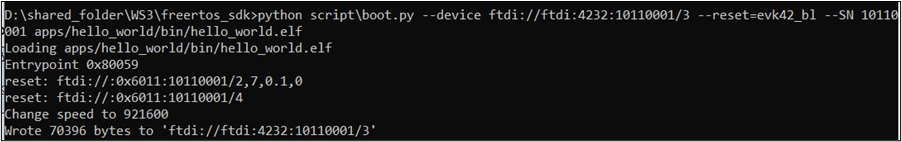

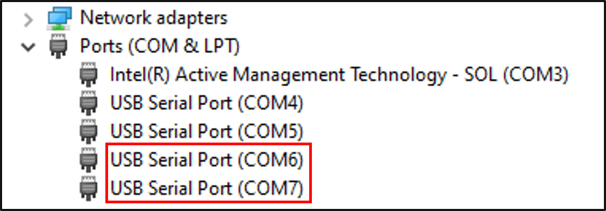

.. |image11| image:: media/image14.png
   :width: 1.475in
   :height: 0.14167in
.. |image12| image:: media/image15.png
   :width: 6.69291in
   :height: 2.31306in
.. |image13| image:: media/image14.png
   :width: 1.475in
   :height: 0.14167in
.. |image14| image:: media/image16.png
   :width: 6.69291in
   :height: 2.46249in
.. |image15| image:: media/image14.png
   :width: 1.475in
   :height: 0.14167in
.. |image16| image:: media/image17.png
   :width: 7.48031in
   :height: 7.58782in
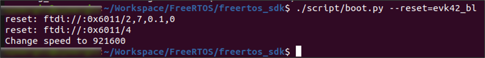
.. |image18| image:: media/image14.png
   :width: 0.7in

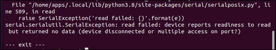
.. |image21| image:: media/image14.png
   :width: 0.86765in

.. |image23| image:: media/image14.png
   :width: 1.475in
   :height: 0.14167in
.. |image24| image:: media/image14.png
   :width: 1.475in
   :height: 0.14167in
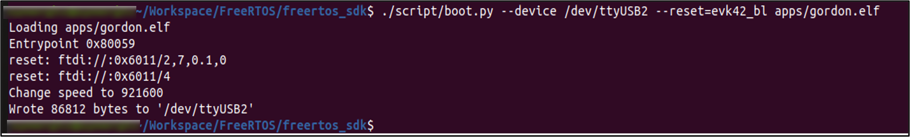
.. |image26| image:: media/image14.png
   :width: 0.91667in

.. |image30| image:: media/image14.png
   :width: 0.84236in
.. |image31| image:: media/image14.png
   :width: 0.86765in
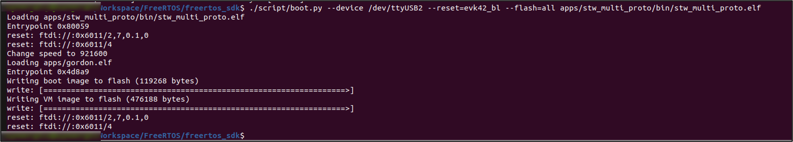
.. |image33| image:: media/image14.png
   :width: 0.86736in

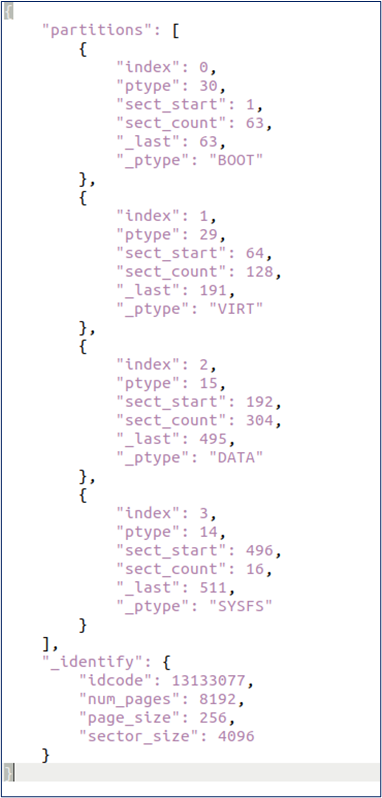
.. |image37| image:: media/image14.png
   :width: 0.86765in
.. |image38| image:: media/image14.png
   :width: 0.86765in
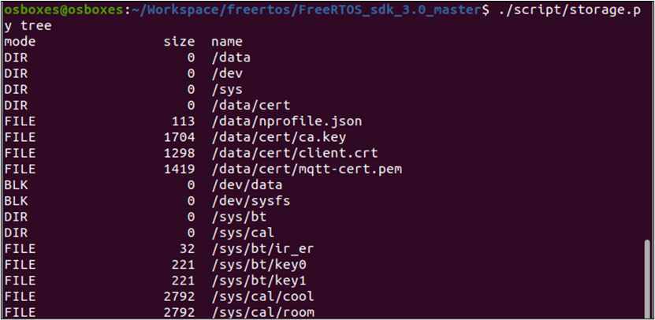

.. |image41| image:: media/image14.png
   :width: 0.86736in
.. |image42| image:: media/image14.png
   :width: 0.86736in

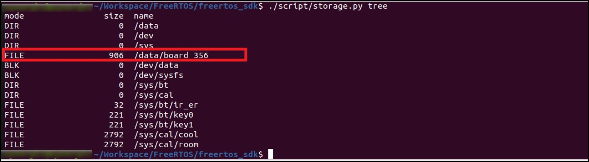
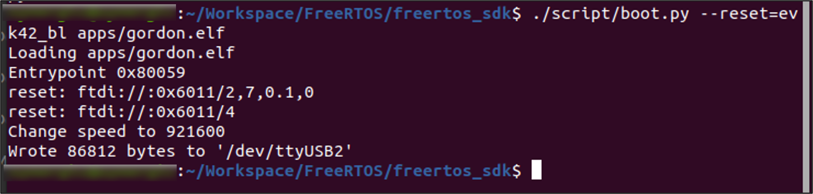
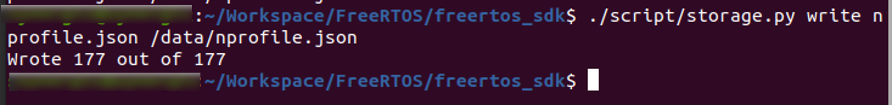
.. |image45| image:: media/image14.png
   :width: 0.94488in
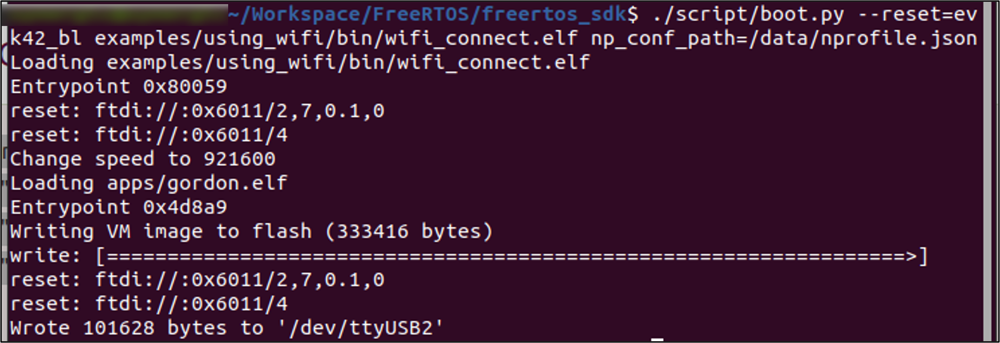
.. |image47| image:: media/image14.png
   :width: 1.07083in
   :height: 0.10285in
.. |image48| image:: media/image14.png
   :width: 1.07083in
   :height: 0.10285in

.. |image50| image:: media/image14.png
   :width: 1.475in
   :height: 0.14167in
.. |image51| image:: media/image14.png
   :width: 1.475in
   :height: 0.14167in
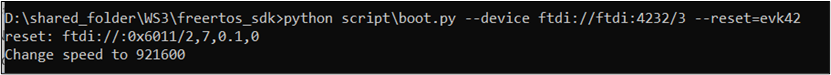
.. |image53| image:: media/image14.png
   :width: 1.475in
   :height: 0.14167in
.. |image54| image:: media/image14.png
   :width: 1.475in
   :height: 0.14167in

.. |image56| image:: media/image14.png
   :width: 1.475in
   :height: 0.14167in

.. |image58| image:: media/image14.png
   :width: 1.475in
   :height: 0.14167in
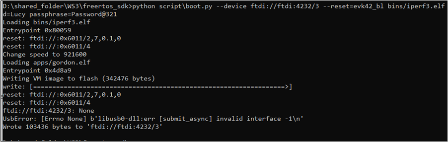

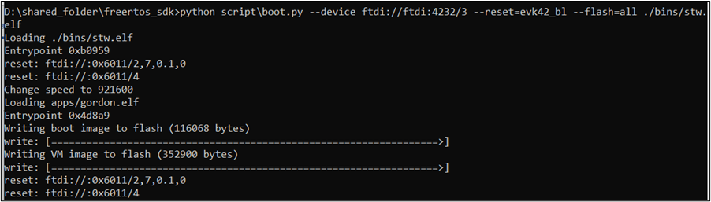
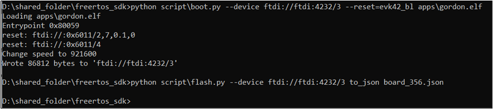
.. |image63| image:: media/image45.png
   :width: 7.48031in
   :height: 2.35145in
.. |image64| image:: media/image46.png
   :width: 7.48031in
   :height: 0.62845in

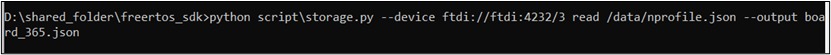

.. |image70| image:: media/image51.png
   :width: 6.88976in
   :height: 0.42423in
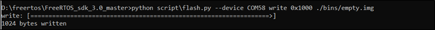
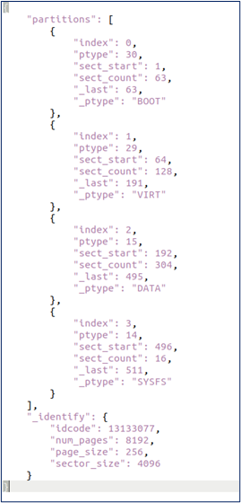

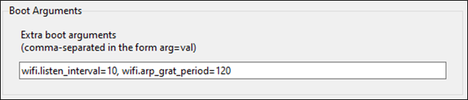
.. |image79| image:: media/image60.png
   :width: 6.88976in
   :height: 2.12115in
