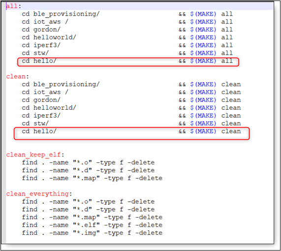
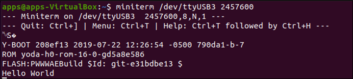
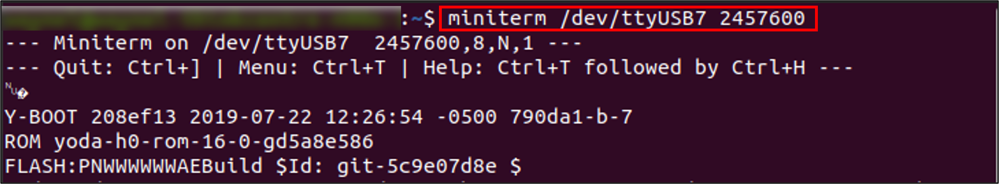
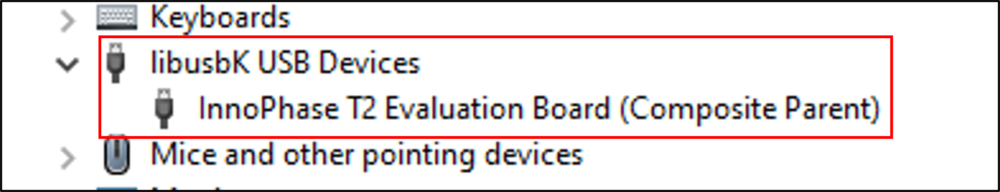
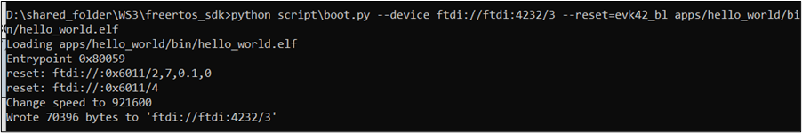
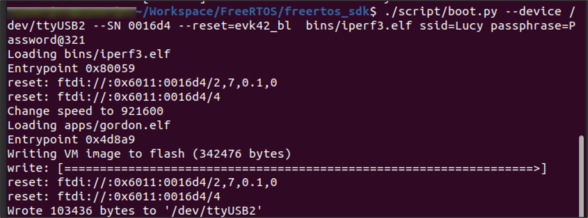
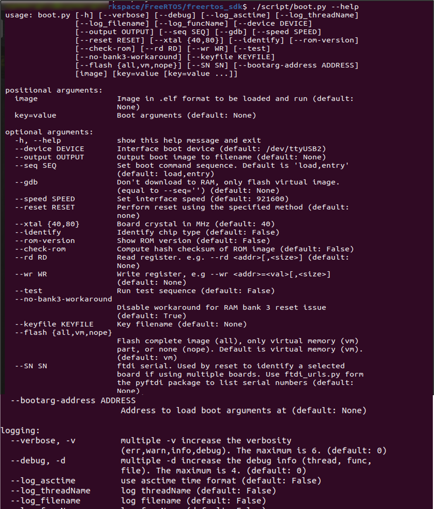
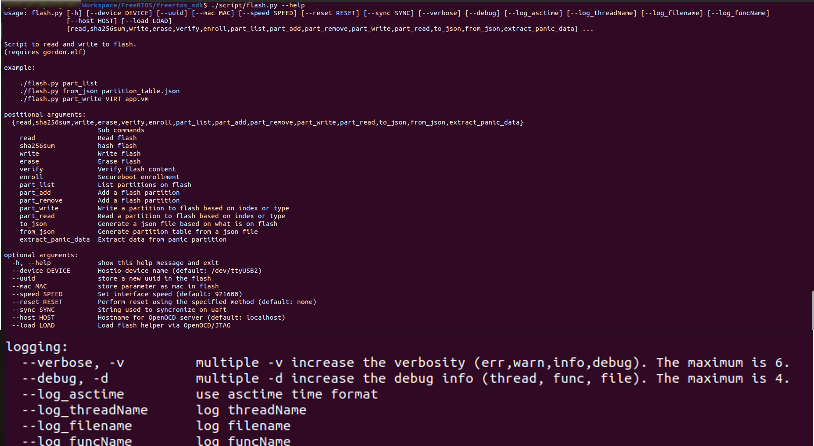
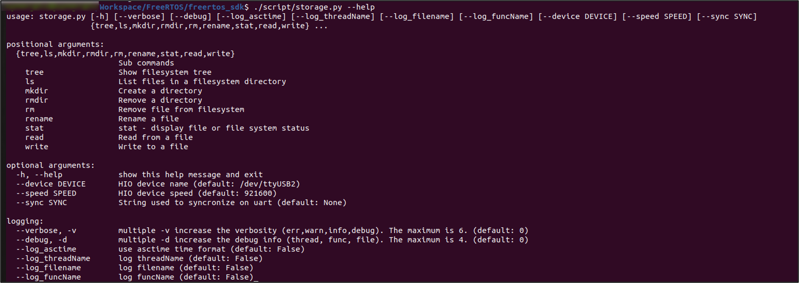

This section serves a reference guide for using Talaria TWO boot
arguments (bootargs) and its usage in different scenarios using
different feature and protocols. It is to be used as a reference guide
for using bootargs/set of bootargs customized as per the application
requirement.

This section provides bootargs use case or examples for all layers from
hardware interface to Wi-Fi configurations and it needs to be used as
reference only.

Boot Arguments
--------------

Boot arguments are a list of key value pairs of the form <key>=<value>
passed to the booted image

as an array of null-terminated strings (using the boot protocol). This
is intended as a simple way to pass configuration to an application
during development.

Generic Syntax for Passing Boot Arguments
^^^^^^^^^^^^^^^^^^^

1. Used with Talaria TWO Download Tool
   (*freertos_sdk_x.y/pc_tools/Download_Tool/bin*).

The bootargs, if applicable by an application, should be entered in the
Boot Arguments field, in a comma-separated form, as shown in Figure 1.

|Table Description automatically generated with medium confidence|

Figure : Boot arguments for Download Tool

2. Used in CLI/command line

In general, bootargs, if applicable, are appended to the string of
commands with path to the files (as illustrated with [boot-args]), in a
space-separated format.

Following are the two scripts used for CLI operations:

a. boot.py – Script used to program RAM/Flash of Talaria TWO module and
   create .img file from .elf file.

b. flash.py – Script to read and write to flash, which requires
   gordon.elf application.

**Note**:

1. Arguments in [ ] are optional and those in <> are mandatory.

2. Boot arguments are separated by a space “ “ in command line and by a
   comma “,” in the Download Tool GUI.

a. Program RAM:

.. table:: : List of bootargs

   +-----------------------------------------------------------------------+
   | <path_script>/boot.py [device] <path_app_elf>/app.elf [boot_args]     |
   +=======================================================================+
   +-----------------------------------------------------------------------+

..

b. Program Flash:

+-----------------------------------------------------------------------+
| <path_script>/boot.py [device] --reset=evk42_bl_bl --flash=all        |
| [additional commands] <path_app_elf>/app.elf [boot_args]              |
+=======================================================================+
+-----------------------------------------------------------------------+

Based on the OS of the host machine and the interface in which the above
commands are sent from, the [device] keyword can take different forms.

The [device] can be one of the following:

a. On Linux machine: --device /dev/ttyUSBn

b. On Windows machine:

   a. If libusbK installed (recommended): --device ftdi://ftdi:4232/3

   b. If libusbK not installed: --device COMn

Refer the following document for more details:
RG_Talaria_TWO_CLI_Commands.pdf (*freertos_sdk_x.y\\doc\\
reference_guides\\cli_reference_guide*).

List of Bootargs
^^^^^^^^^^^^^^

This section describes the list of boot arguments available to configure
various software/hardware modules. Such as hardware/host interface, pin
configuration, serial console, Wi-Fi operations, miscellaneous etc.

+-------------------+----------+------+-----+------------------------+
| **Argument name** | **B      | **Ty | **  | **Description**        |
|                   | ootarg** | pe** | Def |                        |
|                   |          |      | aul |                        |
|                   |          |      | t** |                        |
+===================+==========+======+=====+========================+
| Host interface    | hio.     | int  | 921 | Select the baudrate    |
| baud rate         | baudrate |      | 600 | for the HIO interface  |
+-------------------+----------+------+-----+------------------------+
| Host interface    | hio      | int  | 1   | Configure the maximum  |
| max message size  | .maxsize |      | 600 | size of a host         |
|                   |          |      |     | interface message sent |
|                   |          |      |     | to Talaria TWO         |
+-------------------+----------+------+-----+------------------------+
| Host interface    | hio.t    | int  | NA  | Select the HIO         |
| transport type    | ransport |      |     | interface as           |
|                   |          |      |     | UART/SPI/SDIO:         |
|                   |          |      |     |                        |
|                   |          |      |     | -  hio.transport=uart  |
+-------------------+----------+------+-----+------------------------+
| Default MAC       | hwaddr   | st   | (r  | Default MAC address    |
| address           |          | ring | and | for the device         |
|                   |          |      | om) |                        |
+-------------------+----------+------+-----+------------------------+
| Console baud rate | krn.     | int  | 2   | Baudrate for the       |
|                   | console. |      | 457 | serial interface for   |
|                   | baudrate |      | 600 | console output         |
+-------------------+----------+------+-----+------------------------+
| Console buffer    | k        | int  | 1   | Select the size of the |
|                   | rn.conso |      | 024 | console output buffer. |
|                   | le.bufsz |      |     | The value should be an |
|                   |          |      |     | even power-of-two (if  |
|                   |          |      |     | not it will be rounded |
|                   |          |      |     | down to the nearest    |
|                   |          |      |     | lower power of two)    |
+-------------------+----------+------+-----+------------------------+
| Core dump         | krn.     | bool | 0   | Enable support for     |
|                   | coredump |      |     | download of coredump   |
|                   |          |      |     | using UART after a     |
|                   |          |      |     | crash                  |
+-------------------+----------+------+-----+------------------------+
| Pin configuration | krn.gpio | st   | --- | Configure the state of |
|                   |          | ring | --- | the 23 GPIO pins. Set  |
|                   |          |      | --- | 23 characters          |
|                   |          |      | --- | (starting with GPIO 0) |
|                   |          |      | --- | with the following     |
|                   |          |      | --- | meaning: '-' = No      |
|                   |          |      | --- | change, 'k' = Power    |
|                   |          |      | --- | save keep, 'K' = Power |
|                   |          |      |     | save keep with pull    |
|                   |          |      |     | up, 'H' = Output high, |
|                   |          |      |     | 'L' = Output low, 'i'  |
|                   |          |      |     | = Input, 'I' = Input   |
|                   |          |      |     | with pull up, 'p' = No |
|                   |          |      |     | pull up, 'P' = Pull up |
+-------------------+----------+------+-----+------------------------+
| Initialize system | krn      | int  | 0   | Initialize system time |
| time              | .systime |      |     | to this number in      |
|                   |          |      |     | seconds.               |
+-------------------+----------+------+-----+------------------------+
| Set antenna gain  | rf.ante  | Posi | 0   | Set antenna gain in    |
|                   | nna_gain | tive |     | dBi, e.g. "2.15". Is   |
|                   |          | dec  |     | used in calculation of |
|                   |          | imal |     | output power to comply |
|                   |          | nu   |     | with regulatory domain |
|                   |          | mber |     | settings               |
+-------------------+----------+------+-----+------------------------+
| Virtual memory    | v        | int  | N   | The recommended way to |
| flash location    | m.flash_ |      | one | place virtual memory   |
|                   | location |      |     | image on flash is to   |
|                   |          |      |     | add a dedicated        |
|                   |          |      |     | partition. This        |
|                   |          |      |     | setting makes it       |
|                   |          |      |     | possible to use        |
|                   |          |      |     | virtual memory without |
|                   |          |      |     | such a partition       |
+-------------------+----------+------+-----+------------------------+
| Virtual memory    | vm.pages | int  | 256 | Set the virtual memory |
| cache size        |          |      |     | cache size in number   |
|                   |          |      |     | of pages. Each page is |
|                   |          |      |     | 256 bytes, so the      |
|                   |          |      |     | default results in 64  |
|                   |          |      |     | kilobytes of cache     |
+-------------------+----------+------+-----+------------------------+
| Wi-Fi Announce    | wi       | bool | 1   | Announce that the      |
| AMSDU capability  | fi.amsdu |      |     | device can receive     |
|                   |          |      |     | AMSDUs                 |
+-------------------+----------+------+-----+------------------------+
| Gratuitous ARP    | wifi     | int  | 60  | Period in seconds for  |
| period            | .arp_gra |      |     | gratuitous ARP         |
|                   | t_period |      |     | announcements. Set to  |
|                   |          |      |     | zero to disable        |
+-------------------+----------+------+-----+------------------------+
| Wi-Fi Channels    | wifi.    | st   | 1   | Set which Wi-Fi        |
|                   | channels | ring | -13 | channels to use. Set   |
|                   |          |      |     | "1-11,13" to use       |
|                   |          |      |     | channels 1 to 11 and   |
|                   |          |      |     | 13.                    |
+-------------------+----------+------+-----+------------------------+
| Wi-Fi Cloud Power | wifi.    | bool | 0   | Reduced power          |
| Mode              | cloud_pm |      |     | consumption for units  |
|                   |          |      |     | only communicating     |
|                   |          |      |     | with the cloud.        |
|                   |          |      |     | Internal LAN traffic   |
|                   |          |      |     | may not work.          |
+-------------------+----------+------+-----+------------------------+
| Wi-Fi Dynamic     | wif      | bool | 0   | Listen to all beacons  |
| listen interval   | i.dyn_li |      |     | if there has been      |
|                   | sten_int |      |     | traffic recently       |
+-------------------+----------+------+-----+------------------------+
| Wi-Fi             | wifi.ht  | bool | 1   | Enable or disable HT   |
| Enable/disable HT |          |      |     | mode (802.11n). When   |
| (802.11n)         |          |      |     | disabled 802.11bg is   |
|                   |          |      |     | enabled                |
+-------------------+----------+------+-----+------------------------+
| Wake time after   | w        | int  | 8   | Time in milliseconds   |
| keep alive        | ifi.keep |      |     | to stay awake after a  |
|                   | _alive_w |      |     | keep alive NULL frame  |
|                   | ake_time |      |     |                        |
+-------------------+----------+------+-----+------------------------+
| Wi-Fi Beacon      | wifi     | int  | 0   | Configure how often    |
| listen interval   | .listen_ |      |     | the device shall wake  |
|                   | interval |      |     | up to listen for       |
|                   |          |      |     | beacons. Set to 0 to   |
|                   |          |      |     | listen to every DTIM   |
|                   |          |      |     | beacon. Set to 1 to    |
|                   |          |      |     | listen to every        |
|                   |          |      |     | beacon.                |
+-------------------+----------+------+-----+------------------------+
| Wi-Fi Max idle    | wifi     | int  | 1   | This parameter         |
| period            | .max_idl |      | 800 | specifies how many     |
|                   | e_period |      |     | seconds the device can |
|                   |          |      |     | be idle before it must |
|                   |          |      |     | send a keep alive to   |
|                   |          |      |     | the AP                 |
+-------------------+----------+------+-----+------------------------+
| Wi-Fi MSDU        | wi       | int  | 500 | This parameter         |
| lifetime          | fi.msdu_ |      |     | specifies the time in  |
|                   | lifetime |      |     | milliseconds for which |
|                   |          |      |     | the WiFi MAC layer     |
|                   |          |      |     | will try to send the   |
|                   |          |      |     | frame before it is     |
|                   |          |      |     | discarded              |
+-------------------+----------+------+-----+------------------------+
| Wi-Fi Nap scan    | wifi.    | int  | 1   | Turn off receiver for  |
|                   | nap_scan |      |     | uninteresting frames   |
|                   |          |      |     | during scan. When the  |
|                   |          |      |     | receiver has started   |
|                   |          |      |     | to receive a frame     |
|                   |          |      |     | with high signal       |
|                   |          |      |     | strength, and this     |
|                   |          |      |     | frame is not a beacon  |
|                   |          |      |     | or probe response, it  |
|                   |          |      |     | can turn off the       |
|                   |          |      |     | receiver ("take a      |
|                   |          |      |     | nap") for the duration |
|                   |          |      |     | of this frame to save  |
|                   |          |      |     | power                  |
+-------------------+----------+------+-----+------------------------+
| Wi-Fi Nap scan    | wi       | int  | -70 | Threshold to determine |
| RSSI threshold    | fi.nap_s |      |     | if a frame is strong   |
|                   | can_rssi |      |     | or not when using the  |
|                   |          |      |     | wifi.nap_scan function |
+-------------------+----------+------+-----+------------------------+
| Wi-Fi Nap in      | wifi     | int  | 0   | Turn off receiver for  |
| station mode      | .nap_sta |      |     | uninteresting frames   |
| (associated)      |          |      |     | in associated station  |
|                   |          |      |     | mode                   |
+-------------------+----------+------+-----+------------------------+
| Wi-Fi Don’t       | wif      | int  | 0   | "Take a nap" for       |
| receive multicast | i.only_b |      |     | multicast frames which |
| frames which are  | roadcast |      |     | are not broadcast      |
| not broadcast     |          |      |     | (address               |
|                   |          |      |     | ff:ff:ff:ff:ff:ff)     |
+-------------------+----------+------+-----+------------------------+
| Wi-Fi PS poll     | wifi     | bool | 0   | Use Power Save poll to |
|                   | .ps_poll |      |     | fetch incoming packets |
|                   |          |      |     | when a beacon was      |
|                   |          |      |     | missed                 |
+-------------------+----------+------+-----+------------------------+
| Wi-Fi Scan max    | w        | int  | 24  | Maximum time in        |
| listen time       | ifi.scan |      |     | milliseconds to listen |
|                   | _max_lis |      |     | on a channel during    |
|                   | ten_time |      |     | scan. The time to send |
|                   |          |      |     | the probe requests is  |
|                   |          |      |     | not included in this   |
|                   |          |      |     | time                   |
+-------------------+----------+------+-----+------------------------+
| Wi-Fi Scan max    | wifi.sc  | int  | 0   | When this number of    |
| responses         | an_max_r |      |     | responses has been     |
|                   | esponses |      |     | reached, the scan will |
|                   |          |      |     | be stopped             |
+-------------------+----------+------+-----+------------------------+
| Wi-Fi Scan min    | w        | int  | 8   | Minimum time in        |
| listen time       | ifi.scan |      |     | milliseconds to listen |
|                   | _min_lis |      |     | on a channel during    |
|                   | ten_time |      |     | scan                   |
+-------------------+----------+------+-----+------------------------+
| Wi-Fi Scan number | wifi     | int  | 2   | Number of probe        |
| of probes         | .scan_nu |      |     | requests to send on    |
|                   | m_probes |      |     | each channel during    |
|                   |          |      |     | scan. Set to 1 or 2    |
+-------------------+----------+------+-----+------------------------+
| Wi-Fi Scan wait   | wif      | int  | 0   | Wait time in           |
| time between      | i.scan_w |      |     | milliseconds between   |
| channels          | ait_time |      |     | channel during scan    |
+-------------------+----------+------+-----+------------------------+
| Wi-Fi Traffic     | wifi     | int  | 12  | Set power save traffic |
| timeout           | .traffic |      |     | timeout. The device    |
|                   | _timeout |      |     | will stay awake and    |
|                   |          |      |     | listen for incoming    |
|                   |          |      |     | frames this time (in   |
|                   |          |      |     | ms) after other frames |
|                   |          |      |     | has been sent or       |
|                   |          |      |     | received               |
+-------------------+----------+------+-----+------------------------+
| Wi-Fi Tx power    | wi       | bool | 0   | Outgoing frames will   |
| save              | fi.tx_ps |      |     | be sent with the power |
|                   |          |      |     | save bit set in the    |
|                   |          |      |     | frame                  |
+-------------------+----------+------+-----+------------------------+
| Wi-Fi DTIM only   | wifi.d   | bool | 0   | Only listens to DTIMs  |
|                   | tim_only |      |     | (no ps-poll at beacon  |
|                   |          |      |     | miss).                 |
+-------------------+----------+------+-----+------------------------+

Boot Arguments
^^^^^^^^^^^^^^

Host Interface 
````````````

Host Interface Transport Type
~~~~~~~~~~~~~~~~~~~~~~~~~~~~~

Specify the Host Interface (HIO) transport type, using the UART/SPI/SDIO
interface.

Syntax
^^^^^^

+-----------------------------------------------------------------------+
| hio.transport=<transport_tpye>                                        |
|                                                                       |
| <transport_type>:                                                     |
|                                                                       |
| Type: int                                                             |
|                                                                       |
| Range: 0-2                                                            |
|                                                                       |
| Value: 0-UART (default),1-SPI, 2-SDIO                                 |
|                                                                       |
| **Note**: SDIO is not supported in the current release.               |
+=======================================================================+
+-----------------------------------------------------------------------+

Example
^^^^^^^

Configuring host interface transport type as UART.

**Command**:

+-----------------------------------------------------------------------+
| ./script/boot.py --device /dev/ttyUSB2 --reset=evk42_bl_bl            |
| ./apps/hello_world/bin/hello_world.elf **hio.transport=0**            |
+=======================================================================+
+-----------------------------------------------------------------------+

**Note**: Single line command.

|image1|\ |image2|

Figure : Configuring host interface transport type as UART\ **
**

Host Interface Baudrate
~~~~~~~~~~~~~~~~~~~~~~~

Set the baudrate for the HIO interface

.. _syntax-1:

Syntax
^^^^^^

+-----------------------------------------------------------------------+
| hio.baudrate=<baud_rate>                                              |
|                                                                       |
| <baud_rate>:                                                          |
|                                                                       |
| Type: int                                                             |
|                                                                       |
| Range: 300-921600                                                     |
|                                                                       |
| Value: 921600(default)                                                |
|                                                                       |
| Valid baudrate values: 300, 600, 1200, 2400, 4800, 9600, 14400,       |
| 19200, 38400, 57600, 115200, 230400, 460800, 921600                   |
+=======================================================================+
+-----------------------------------------------------------------------+

.. _example-1:

Example
^^^^^^^

Set the baudrate for the HIO interface at 921600.

**Command**:

+-----------------------------------------------------------------------+
| ./script/boot.py --device /dev/ttyUSB2 --reset=evk42_bl_bl            |
| ./apps/hello_world/bin/hello_world.elf                                |
| **krn.console.baudrate=921600**                                       |
+=======================================================================+
+-----------------------------------------------------------------------+

**Note**: Single line command.

|image3|\ |image4|

Figure : Setting host interface baudrate

Host Interface Max Message Size
~~~~~~~~~~~~~~~~~~~~~~~~~~~~~~~

Configure the maximum size of a host interface message sent to Talaria
TWO

.. _syntax-2:

Syntax
^^^^^^

+-----------------------------------------------------------------------+
| hio.maxsize=<size_bytes>                                              |
|                                                                       |
| <size_bytes>:                                                         |
|                                                                       |
| Type: int                                                             |
|                                                                       |
| Value: 1600 (default)                                                 |
+=======================================================================+
+-----------------------------------------------------------------------+

.. _example-2:

Example
^^^^^^^

Set the maximum size of a host message 1024 (bytes).

**Command**:

+-----------------------------------------------------------------------+
| ./script/boot.py --device /dev/ttyUSB2 --reset=evk42_bl_bl --speed    |
| 2457600 ./apps/gordon.elf **hio.maxsize=1024**                        |
+=======================================================================+
+-----------------------------------------------------------------------+

**Note**: Single line command.

|image5|\ |image6|

Figure : Set maximum size of host message

Default MAC Address for the Device
~~~~~~~~~~~~~~~~~~~~~~~~~~~~~~~~~~

Set default MAC address for the device.

.. _syntax-3:

Syntax
^^^^^^

+-----------------------------------------------------------------------+
| hwaddr =<mac_addr>                                                    |
|                                                                       |
| <mac_addr>:                                                           |
|                                                                       |
| Type: string                                                          |
|                                                                       |
| Value: no default.                                                    |
+=======================================================================+
+-----------------------------------------------------------------------+

.. _example-3:

Example
^^^^^^^

Set the default MAC address of the device as 01:02:03:04:05:06.

**Command**:

+-----------------------------------------------------------------------+
| ./script/boot.py --device /dev/ttyUSB2 --reset=evk42_bl               |
| apps/hello_world/bin/hello_world.elf **hwaddr=01:02:03:04:05:06**     |
+=======================================================================+
+-----------------------------------------------------------------------+

**Note**: Single line command.

|image7|\ |image8|

Figure : Set default MAC address of the device

Console Baudrate
~~~~~~~~~~~~~~~~

Set the baudrate for the serial interface for console output.

.. _syntax-4:

Syntax
^^^^^^

+-----------------------------------------------------------------------+
| krn.console.baudrate=<baudrate>                                       |
|                                                                       |
| <baudrate>:                                                           |
|                                                                       |
| Type: int                                                             |
|                                                                       |
| Value: 2457600 (default)                                              |
|                                                                       |
| Valid baudrate values: 1200, 2400, 4800, 9600, 14400, 19200, 38400,   |
| 57600, 115200, 230400, 460800, 921600, 2457600                        |
+=======================================================================+
+-----------------------------------------------------------------------+

.. _example-4:

Example
^^^^^^^

Set the baudrate for device console output at 115200.

**Command**:

+-----------------------------------------------------------------------+
| ./script/boot.py --device /dev/ttyUSB2 --reset=evk42_bl               |
| apps/hello_world/bin/hello_world.elf **krn.console.baudrate=115200**  |
+=======================================================================+
+-----------------------------------------------------------------------+

**Note**: Single line command.

|image9|\ |image10|

Figure : Set baudrate for device console output

Coredump
~~~~~~~~

Enable support for download of coredump using UART after a crash.

.. _syntax-5:

Syntax
^^^^^^

+-----------------------------------------------------------------------+
| krn.coredump=<ena/dis>                                                |
|                                                                       |
| <ena/dis>:                                                            |
|                                                                       |
| Type: int                                                             |
|                                                                       |
| Range: 0-1                                                            |
|                                                                       |
| Value: 0-disabled (default), 1-enabled                                |
+=======================================================================+
+-----------------------------------------------------------------------+

.. _example-5:

Example
^^^^^^^

Enable the coredump via UART after a crash.

**Command:**

+-----------------------------------------------------------------------+
| ./script/boot.py --device /dev/ttyUSB2 --reset=evk42_bl               |
| apps/hello_world/bin/hello_world.elf **krn.coredump=1**               |
+=======================================================================+
+-----------------------------------------------------------------------+

**Note**: Single line command.

|image11|\ |image12|

Figure : Enable coredump via UART after crash

PIN Configuration
~~~~~~~~~~~~~~~~~

Configure the state of the 23 GPIO PINS.

.. _syntax-6:

Syntax
^^^^^^

+-----------------------------------------------------------------------+
| krn.gpio=-----------------------                                      |
|                                                                       |
| <----------------------->:                                            |
|                                                                       |
| Type: String of 23 characters                                         |
|                                                                       |
| Options for each character:                                           |
|                                                                       |
| -  '-' : No change                                                    |
|                                                                       |
| -  'k' : Power save keep                                              |
|                                                                       |
| -  'K' : Power save keep with pull up                                 |
|                                                                       |
| -  'H' : Output high                                                  |
|                                                                       |
| -  'L' : Output low                                                   |
|                                                                       |
| -  'i' : Input                                                        |
|                                                                       |
| -  'I' : Input with pull up                                           |
|                                                                       |
| -  'p' : No pull up                                                   |
|                                                                       |
| -  'P' : Pull up                                                      |
|                                                                       |
| No default                                                            |
+=======================================================================+
+-----------------------------------------------------------------------+

.. _example-6:

Example
^^^^^^^

Set the GPIO 13 pin as input with pull up:

**Command:**

+-----------------------------------------------------------------------+
| ./script/boot.py --device /dev/ttyUSB2 --reset=evk42_bl               |
| apps/hello_world/bin/hello_world.elf                                  |
| **krn.gpio=-------------I---------**                                  |
+=======================================================================+
+-----------------------------------------------------------------------+

**Note**: Single line command.

|image13|\ |image14|

Figure : Set the GPIO 13 pin as input with pull up

Gratuitous ARP Period
~~~~~~~~~~~~~~~~~~~~~

Set the ARP period in seconds for gratuitous ARP announcements. Set to
zero to disable.

.. _syntax-7:

Syntax
^^^^^^

+-----------------------------------------------------------------------+
| wifi.arp_grat_period=<arp_period>                                     |
|                                                                       |
| <arp_period>:                                                         |
|                                                                       |
| Type: int                                                             |
|                                                                       |
| Value: 0-disabled, 60-default, N-arp period in seconds                |
+=======================================================================+
+-----------------------------------------------------------------------+

.. _example-7:

Example
^^^^^^^

Set the ARP period to 90 (s).

**Command**:

+-----------------------------------------------------------------------+
| ./script/boot.py --device /dev/ttyUSB2 --reset=evk42_bl               |
| examples/using_wifi/bin/wifi_connect.elf                              |
| np_conf_path=/data/nprofile.json **wifi.arp_grat_period=90**          |
+=======================================================================+
+-----------------------------------------------------------------------+

**Note**: Single line command.

|image15|\ |image16|

Figure : Set the ARP period to 90 (s)

Wi-Fi Channels
~~~~~~~~~~~~~~

Set which Wi-Fi channels to use.

.. _syntax-8:

Syntax
^^^^^^

+-----------------------------------------------------------------------+
| wifi.channels=<channels>                                              |
|                                                                       |
| <channels>:                                                           |
|                                                                       |
| Type: string                                                          |
|                                                                       |
| Range: 1-13                                                           |
|                                                                       |
| Value: enter as a range and/or individual channels                    |
+=======================================================================+
+-----------------------------------------------------------------------+

.. _example-8:

Example
^^^^^^^

Set the Wi-Fi to use channels 1 to 6 and 11.

**Command:**

+-----------------------------------------------------------------------+
| ./script/boot.py --device /dev/ttyUSB2 --reset=evk42_bl               |
| examples/using_wifi/bin/wifi_connect.elf                              |
| np_conf_path=/data/nprofile.json **wifi.channels=1-6,11**             |
+=======================================================================+
+-----------------------------------------------------------------------+

**Note**: Single line command.

|image17|\ |image18|

Figure : Set the Wi-Fi to use channels 1 to 6 and 11

Wi-Fi Dynamic Listen Interval
~~~~~~~~~~~~~~~~~~~~~~~~~~~~~

Configure the dynamic listening interval

.. _syntax-9:

Syntax
^^^^^^

+-----------------------------------------------------------------------+
| wifi.dyn_listen_int=<dyn_listen_int>                                  |
|                                                                       |
| <dyn_listen_int>:                                                     |
|                                                                       |
| Type: int                                                             |
|                                                                       |
| Range: 0-1                                                            |
|                                                                       |
| Value: 0-disabled,1-listen to all beacons if there has been traffic   |
| recently                                                              |
+=======================================================================+
+-----------------------------------------------------------------------+

.. _example-9:

Example
^^^^^^^

Turn dynamic listening ON.

**Command:**

+-----------------------------------------------------------------------+
| ./script/boot.py --device /dev/ttyUSB2 --reset=evk42_bl               |
| examples/using_wifi/bin/wifi_connect.elf                              |
| np_conf_path=/data/nprofile.json **wifi.dyn_listen_int=1**            |
+=======================================================================+
+-----------------------------------------------------------------------+

**Note**: Single line command.

|image19|\ |image20|

Figure : Turning dynamic listening ON

Wi-Fi Beacon Listen Interval
~~~~~~~~~~~~~~~~~~~~~~~~~~~~

Configure how often the device should wake up to listen for beacons.

.. _syntax-10:

Syntax
^^^^^^

+-----------------------------------------------------------------------+
| wifi.listen_interval=<listen_interval>                                |
|                                                                       |
| <listen_interval>:                                                    |
|                                                                       |
| Type: int                                                             |
|                                                                       |
| Range: 0-255                                                          |
|                                                                       |
| Value: 0-disabled, 1-listen to every beacon, N-listen to every N      |
| beacon elapsed                                                        |
+=======================================================================+
+-----------------------------------------------------------------------+

.. _example-10:

Example
^^^^^^^

Set the beacon listening interval to 10.

**Command:**

+-----------------------------------------------------------------------+
| ./script/boot.py --device /dev/ttyUSB2 --reset=evk42_bl               |
| examples/using_wifi/bin/wifi_connect.elf                              |
| np_conf_path=/data/nprofile.json **wifi.listen_interval=10**          |
+=======================================================================+
+-----------------------------------------------------------------------+

**Note**: Single line command.

|image21|\ |image22|

Figure : Set the beacon listening interval to 10

Wi-Fi Max Idle Period
~~~~~~~~~~~~~~~~~~~~~

Specifies how many seconds the device can be idle for before it must
send a keep alive to the AP.

.. _syntax-11:

Syntax
^^^^^^

+-----------------------------------------------------------------------+
| wifi.max_idle_period=<max_idle>                                       |
|                                                                       |
| <max_idle>:                                                           |
|                                                                       |
| Type: int                                                             |
|                                                                       |
| Value: 1800 (default), N-max idle time in seconds                     |
+=======================================================================+
+-----------------------------------------------------------------------+

.. _example-11:

Example 
^^^^^^^^

Set the max idle time to 300 (s).

**Command:**

+-----------------------------------------------------------------------+
| ./script/boot.py --device /dev/ttyUSB2 --reset=evk42_bl               |
| examples/using_wifi/bin/wifi_connect.elf                              |
| np_conf_path=/data/nprofile.json **wifi.max_idle_period=300**         |
+=======================================================================+
+-----------------------------------------------------------------------+

**Note**: Single line command.

|image23|\ |image24|

Figure : Set the max idle time to 300 (s)

Wi-Fi Traffic Timeout
~~~~~~~~~~~~~~~~~~~~~

Sets the time in milliseconds in which the device will stay awake after
incoming or outgoing traffic.

It is possible to increase the default value to decrease latency to the
expense of higher power consumption. A traffic timeout value of 0 will
keep the device awake forever.

.. _syntax-12:

Syntax
^^^^^^

+-----------------------------------------------------------------------+
| wifi.traffic_timeout=<timeout>                                        |
|                                                                       |
| <timeout>:                                                            |
|                                                                       |
| Type: int                                                             |
|                                                                       |
| Value: 12 (default), 0 (Disables sleep)                               |
+=======================================================================+
+-----------------------------------------------------------------------+

.. _example-12:

Example
^^^^^^^

Set the traffic timeout value to 24 (ms).

**Command:**

+-----------------------------------------------------------------------+
| ./script/boot.py --device /dev/ttyUSB2 --reset=evk42_bl               |
| examples/using_wifi/bin/wifi_connect.elf                              |
| np_conf_path=/data/nprofile.json **wifi.traffic_timeout=24**          |
+=======================================================================+
+-----------------------------------------------------------------------+

**Note**: Single line command.

|image25|\ |image26|

Figure : Set the traffic timeout value to 24 (ms)

Wi-Fi Tx Power Save
~~~~~~~~~~~~~~~~~~~

When this mode is enabled, outgoing frames will be sent with the power
save bit set in the frame.

.. _syntax-13:

Syntax
^^^^^^

+-----------------------------------------------------------------------+
| wifi.tx_ps=<dis/ena>                                                  |
|                                                                       |
| <dis/ena>:                                                            |
|                                                                       |
| Type: int                                                             |
|                                                                       |
| Range: 0-1                                                            |
|                                                                       |
| Value: 0-disabled (default), 1–enabled                                |
+=======================================================================+
+-----------------------------------------------------------------------+

.. _example-13:

Example
^^^^^^^

Turn ON the Wi-Fi Tx power save mode.

**Command:**

+-----------------------------------------------------------------------+
| ./script/boot.py --device /dev/ttyUSB2 --reset=evk42_bl               |
| examples/using_wifi/bin/wifi_connect.elf                              |
| np_conf_path=/data/nprofile.json **wifi.tx_ps=1**                     |
+=======================================================================+
+-----------------------------------------------------------------------+

**Note**: Single line command.

|image27|\ |image28|

Figure : Turn ON the Wi-Fi Tx power save mode

Wi-Fi DTIM Only Listening
~~~~~~~~~~~~~~~~~~~~~~~~~

When this mode is enabled, the device will not listen to every beacon in
case of beacon misses. It wakes up only at the effective listen
interval.

.. _syntax-14:

Syntax
^^^^^^

+-----------------------------------------------------------------------+
| wifi.dtim_only = < dtim_only >                                        |
|                                                                       |
| < dtim_only > :                                                       |
|                                                                       |
| Type: int                                                             |
|                                                                       |
| Range: 0-1                                                            |
|                                                                       |
| Value: 0-disabled, 1-Does not switch to listen mode for every beacon  |
| in case of beacon miss                                                |
+=======================================================================+
+-----------------------------------------------------------------------+

.. _example-14:

Example
^^^^^^^

Turn DTIM only ON.

**Command:**

+-----------------------------------------------------------------------+
| ./script/boot.py --device /dev/ttyUSB2 --reset=evk42_bl               |
| examples/using_wifi/bin/wifi_connect.elf                              |
| np_conf_path=/sys/nprofile.json wifi.dtim_only=1                      |
+=======================================================================+
+-----------------------------------------------------------------------+

**Note**: Single line command.

|image29|\ |image30|

Figure : Turn ON the Wi-Fi DTIM only listening mode






.. |image6| image:: media/image5.png
   :width: 7.48031in
   :height: 1.5167in





.. |image12| image:: media/image8.png
   :width: 7.48031in
   :height: 1.68877in



.. |image16| image:: media/image10.png
   :width: 7.48031in
   :height: 2.75913in

.. |image18| image:: media/image11.png
   :width: 7.48031in
   :height: 2.76309in

.. |image20| image:: media/image12.png
   :width: 7.48031in
   :height: 2.88989in

.. |image22| image:: media/image13.png
   :width: 7.48031in
   :height: 2.83842in








