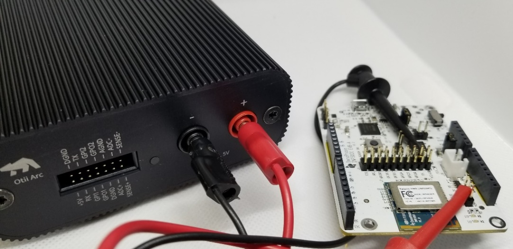
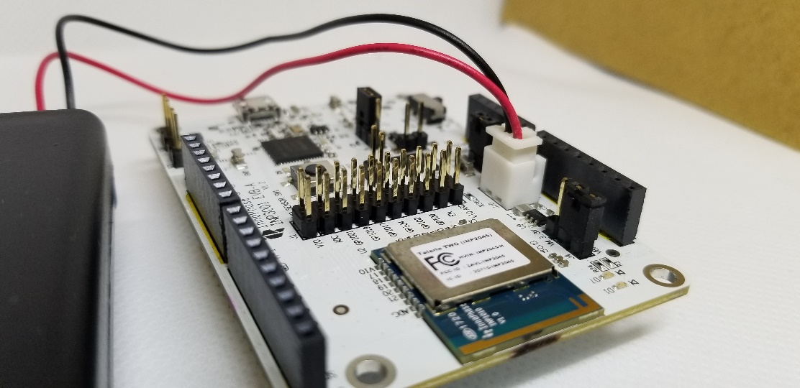

.. _power management:

Power Management
~~~~~~~~~~~~~~~~~

The power consumption of the INP101x module is measured by either
connecting a DMM on the jumper J4 or supplying power directly on J4
using specialty power supplies like Otti Arc from Qiotech. Figure 9
shows the connection setup to measure current consumption using Otti
Arc.

|A picture containing electronics Description automatically generated| \ Figure 9: Current measurement setup using Otti Arc

Using Battery as Power Source
++++++++++++++++++++++++++++++

Header J4 will switch between VBat and Vm_3.3V. Figure 10 shows VBat
connection.

|image1| \ Figure 10: J10 Battery connection

**Note**: When using a battery as a power source there will be an
additional current draw from LED (D7 or D12 depending on board version).
If attempting to measure an accurate module current draw from the
battery connection, the LED series resistor must be removed to
disconnect the LED.

For more information on the Wi-Fi Connection Manager’s power management
APIs, refer: the Wi-Fi Power Management application note.

