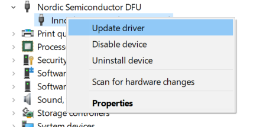

Getting Started
===============

Hostless or Standalone solution is one of the solution architectures
offered by InnoPhase IoT. In this case, there is no external host
involved and the application runs on the internal MCU of the Talaria
TWO.

This solution is available as part of the SDK release package. For
example: sdk_x.y.zip.

Note: x and y in sdk_x.y refers to the SDK version of the release
package.

The standalone solution is beneficial for development of integrated
applications on Talaria TWO with InnoOS RTOS, lwIP network stack and GCC
compiler-based SDK. It helps enable applications, networking and
wireless (BLE/Wi-Fi) functionality on Talaria TWO.

Key Features
------------

1.  Ultra-low power 2.4GHz 802.11 b/g/n Wi-Fi connectivity

2.  Support for WPA2 (Personal & Enterprise) and WPA3

3.  DTIM10 at 57uA enables Wi-Fi connected battery-based applications

4.  Full stack including MQTT, mbedTLS for supporting IoT
    Direct-to-Cloud for a variety of cloud services (AWS, Azure, Google
    Cloud, IBM Watson, etc.)

5.  BLE5.0 w/ Advanced Features LE Coding/FEC (Long-Range), 2M PHY,
    Extended Advertising

6.  Supports Wi-Fi Provisioning over BLE and local device management,
    plus BLE to Wi-Fi bridging

7.  Bluetooth GATT/GAP Profile support, and HCI interface option for
    host MCU-based BLE profile stacks

8.  Advanced security features including Secure Boot, PUF (Physically
    Unclonable Function) and hardware Crypto Engines

9.  Embedded 80MHz Arm Cortex-M3 w/ 512KB SRAM and 2MB Flash

10. Eleven (11) configurable GPIO plus Tx Console port (on GPIO17)

11. Dedicated ADC Input pin

12. Integrated clocks and power management – only a single 3.3V supply
    needed

13. PCB antenna, U.FL antenna connector, RF Pin, and ceramic antenna
    options

Prerequisites
-------------

Hardware-Prerequisites
~~~~~~~~~~~~~~~~~~~~~

INP301x Talaria TWO evaluation board is designed as an evaluation
platform for the INP101x modules.

INP301x Package Contents
++++++++

The package contains:
    • ``1. INP3010\*, INP3014\*, INP3011*\*, INP3015*\*, INP3012 or INP3013 board``
    • ``2. Micro USB cable``
    • ``3. Antenna (INP3011 and INP3012 boards)``
    • ``4. Battery box``

|image1|bdiya

Figure 1: INP301x EVB-A Board with INP101x module board installed

Description of the Board
+++++++

Block Diagram
++++++++

|image2|

Figure 2: Block diagram of INP301x Evaluation Board

The block diagram of the INP301x Evaluation board is shown in Figure 2.
The main component on the board is the INP101x module. Key features of
the evaluation board are:

* Standalone mode vs. Shield mode: Using the mode switch U3, either standalone mode or shield mode can be selected.
   a. In standalone mode, the INP101x can be accessed via micro-USB cable for programming and debugging. This mode is recommended for standalone application development.
   b. In shield mode, the INP101x module can be interfaced with any host CPU and can provide serial to Wi-Fi capabilities.

* A peripheral IO header (J1) is available using which all the IO’s of the INP101x module can be accessed.
* Power supply section: Based on the mode, the power for module is derived from either USB or shield header. A battery header is available which can be used as power source as well.
   a. J4 at VM_3.3V for USB power
   b. J4 at VBAT and battery connect to J10 for Battery power
* On board sensors are available to develop sensor to cloudapplications.
* Switch:
   a. Set U3 switch to V33_ARD for Shield mode
   b. Set U3 switch to V_3.3V for Standalone mode

**INP3000**

INP3000 programmer board provides a programming interface for Talaria TWO modules. It can be used in conjunction with the factory_loader scripts or other companion scripts found in Talaria TWO standalone solution package – SDK.
There are three versions of the INP3000 board which could be used for different applications:
    • ``INP3000 Programmer Board VERSION 4.0``
    • ``INP3000 Programmer Board VERSION 3.0``
    • ``INP3000 Programmer Board VERSION 2.1``

.. |image1| image:: media/image1.JPG
   :width: 5.90551in
   :height: 5.25375in
.. |image2| image:: media/image2.png
   :width: 4.92153in
   :height: 2.91528in

Software-Prerequisites
~~~~~~~~~~~~~~~~~~~~~

Following are the software prerequisites to get started with the standalone solution:
  • ``1. Windows/Linux PC``
  • ``2. Wi-Fi Access Point``
  • ``3. Minicom/TeraTerm VT Utility installed on PC (add a download link)``
  • ``4. EVK package``
  • ``5. SDK package``

Evaluation Kit (EVK)
++++++++

Download the Evaluation Software Package (EVK) 
++++++++

The EVK package (Open_Web_SDK_x.y) includes various evaluation binaries
and the associated programming tools for the INP301x EVB-A boards to
enable quick evaluation of the INP101x modules.

Download the software package from the InnoPhase website:
https://innophaseiot.com/talaria-two-modules/#product-availability.

|image1|

EVK Package Contents Walkthrough
^^^^^^^^^^^^^^^^^^^^^^^^^^^^^^^^

The EVK package contains the following folders:

1. alexa_ready: Firmware images for Alexa_Ready application which can be
   used to understand the protocols and functionality supported on
   Talaria TWO.

2. at: Firmware images for AT Commands application.

3. Download_Tool: Talaria TWO programming tool (available for both
   Windows & Linux platforms)

4. I-CUBE-T2-STW-lib: STM software package for STM’s NUCLEO-STM32L4A6ZG
   or NUCLEO-STM32L433RC-P with ready-to-run firmware examples to
   support quick evaluation and development of MQTT/HTTP/AWS/AZURE and
   HTTPS IoT Cloud applications on STM32L4 Nucleo boards with InnoPhase
   Talaria TWO Wi-Fi add-on boards.

..

   Folder details are as follows:

a. Documentation: This folder includes all applications related to
   Talaria TWO and STMCubeL4.

b. Drivers: This folder includes BSP files for STM32L4 Nucleo boards.
   Refer to release notes for further details

c. Middleware: This folder includes Middleware FreeRTOS and third-Party
   Middleware InnoPhase-HAPI to act as a host interface for Talaria TWO
   Modules (INP101X) Wi-Fi devices

d. Projects: This folder includes the applications to demonstrate the
   INP101X features such as Wi-Fi, BLE, cloud apps on modules
   32L4A6ZG-NUCLEO and 32L433RC-P-NUCLEO. Refer to release notes for
   further details.

e. Utilities: This folder includes Download tool GUI and the firmware
   binary for Talaria TWO EVB (INP301x)

5. MPD: Multi-purpose Demo GUI for evaluating example applications and
   network protocols

:mark:`
`

**Software Development Kit**

Download the Software Development Package (SDK)
^^^^^^^^^^^^^^^^^^^^^^^^^^^^^^^^^^^^^^^^^^^^^^^

To download the software development package, execute the following
steps:

1. Go to the InnoPhase website (https://innophaseiot.com/) and click on
   Register.

|A screenshot of a computer Description automatically generated|

2. Provide the appropriate details to register onto the InnoPhase
   Customer Portal.

**Note**: InnoPhase requires a signed MNDA and Development Tool License
Agreement (DTLA) to be signed prior to granting access to the Customer
Portal.

3. On successfully registering to the Customer Portal, the following
   screen will appear:

|image2|\ |image3|

4. Navigate to the Software Tab and download the appropriate software
   package(s):

|image4|

SDK Package Contents Walkthrough
^^^^^^^^^^^^^^^^^^^^^^^^^^^^^^^^

The SDK software package (sdk_x.y.zip) provides software APIs with
ready-to-run firmware examples to support quick evaluation and
development of MQTT/HTTP/HTTPS/AWS and AZURE IoT Cloud applications with
Talaria TWO.

Folder details are as follows:

1. **pc_tools**: Programming (Download), multi-purpose demo GUI and
   T2_Flasher tools. These tools are available for both Windows and
   Linux platforms.

2. **binaries**: Firmware images which can be used to understand the
   protocols and functionality supported on Talaria TWO. The eval folder
   consists of firmware image for MPD and Alexa_Ready application, while
   the product folder consists of the firmware image for AT commands.

3. **apps**: production ready example applications that the user can run
   on Talaria TWO. Following applications are available in the release
   package:

+-------------------------+--------------------------------------------+
| **Protocol**            | **Description**                            |
+=========================+============================================+
| alarm                   | Describes alarm functionality in Talaria   |
|                         | TWO.                                       |
+-------------------------+--------------------------------------------+
| filesystem              | Contains APIs to check and mount Talaria   |
|                         | TWO's file system                          |
+-------------------------+--------------------------------------------+
| fota                    | Demonstrates the FOTA (Firmware Over The   |
|                         | Air) process                               |
+-------------------------+--------------------------------------------+
| gordon                  | Flashing utility using UART interface      |
+-------------------------+--------------------------------------------+
| gordon-jtag             | Flashing utility using JTAG / SWD          |
|                         | interface                                  |
+-------------------------+--------------------------------------------+
| helloworld              | Basic helloworld application               |
+-------------------------+--------------------------------------------+
| iot_aws                 | Demonstrates using Talaria TWO board and   |
|                         | the SDK with Amazon Web Services (AWS) IoT |
+-------------------------+--------------------------------------------+
| iot_azure               | Readme file containing the link to         |
|                         | IoT_Azure application note present in      |
|                         | Github                                     |
+-------------------------+--------------------------------------------+
| iperf3                  | iperf3 server application on Talaria TWO   |
+-------------------------+--------------------------------------------+
| ssbl                    | Demonstrates running and switching between |
|                         | multiple applications on Talaria TWO using |
|                         | SSBL                                       |
+-------------------------+--------------------------------------------+
| stw                     | Serial to Wi-Fi application over HIO       |
+-------------------------+--------------------------------------------+
| stw_multi_proto         | Serial to Wi-Fi application used in hosted |
|                         | mode of operation                          |
+-------------------------+--------------------------------------------+

4. **examples**: Demo/sample applications that the user can run on
   Talaria TWO firmware. Following examples are available:

+---------------------------+------------------------------------------+
| **Protocol**              | **Description**                          |
+===========================+==========================================+
| adc                       | Example for using the Analog to Digital  |
|                           | Convertor (ADC) peripheral of Talaria    |
|                           | TWO modules                              |
+---------------------------+------------------------------------------+
| at_custom_cmd             | Demonstrates custom AT commands which    |
|                           | the user can use apart from the standard |
|                           | commands                                 |
+---------------------------+------------------------------------------+
| ble_beacons               | Example codes describing the basic       |
|                           | concept of Eddystone Beacon              |
|                           |                                          |
|                           | -  Eddystone UID                         |
|                           |                                          |
|                           | -  Eddystone URL                         |
|                           |                                          |
|                           | -  Eddystone TLM                         |
+---------------------------+------------------------------------------+
| ble_wifi_bridge           | Example code for receiving a text        |
|                           | message from a connected BLE client and  |
|                           | publishing it to a CloudMQTT broker      |
+---------------------------+------------------------------------------+
| chip_monitor              | Describes the application for fetching   |
|                           | the changes in the values of device core |
|                           | temperature, Voltage of VBAT, external   |
|                           | ADC and estimated current consumption of |
|                           | Talaria TWO device                       |
+---------------------------+------------------------------------------+
| crash_handling            | Example code for using the crash handler |
|                           | API to handle and debug error cases      |
+---------------------------+------------------------------------------+
| gpio                      | Example codes for using the interface    |
|                           | for GPIO                                 |
+---------------------------+------------------------------------------+
| http_client               | Example codes for using HTTP client APIs |
|                           | to connect to HTTP servers in secured    |
|                           | (HTTPS) and non-secured way              |
+---------------------------+------------------------------------------+
| i2c                       | Demonstrates usage of I2C on Talaria TWO |
+---------------------------+------------------------------------------+
| i2s_audio                 | Example codes for using I2S peripheral   |
|                           | of INP1010/INP1011/INP1012/INP1013       |
|                           | Talaria TWO modules for playing audio    |
+---------------------------+------------------------------------------+
| ifttt                     | Example application for using Talaria    |
|                           | TWO with IFTTT                           |
+---------------------------+------------------------------------------+
| innoos_memory_mgmt        | Example code for basic memory management |
|                           | and error handling                       |
+---------------------------+------------------------------------------+
| innoos_msg_q              | Example codes describing the use of      |
|                           | message queue APIs                       |
+---------------------------+------------------------------------------+
| innoos_threads_semaphores | Example codes describing the use of      |
|                           | threads and semaphore APIs               |
+---------------------------+------------------------------------------+
| innoos_timers_callouts    | Example codes describing the use of      |
|                           | Timers and Callout APIs                  |
+---------------------------+------------------------------------------+
| innoos_work_q             | Example codes describing the use of Work |
|                           | Queue APIs                               |
+---------------------------+------------------------------------------+
| lp_scan                   | Demonstrates the basics of the Low Power |
|                           | Wi-Fi scan feature in InnoOS™            |
+---------------------------+------------------------------------------+
| lp_uart                   | Example codes describing the use of UART |
|                           | APIs                                     |
+---------------------------+------------------------------------------+
| mdns                      | Demonstrates using the mDNS APIs         |
|                           | provided by the mDNS module              |
+---------------------------+------------------------------------------+
| mqtt                      | Example codes for using the              |
|                           | publish/subscribe operation of MQTT in   |
|                           | both secured and non-secured modes       |
+---------------------------+------------------------------------------+
| prov                      | A demo Provisioning application using    |
|                           | BLE for provisioning AP credentials at   |
|                           | Talaria TWO from a mobile application    |
+---------------------------+------------------------------------------+
| pwm                       | Demonstrates usage of Pulse Width        |
|                           | Modulation peripheral of                 |
|                           | INP1010/INP1011/INP1012/INP1013 Talaria  |
|                           | TWO modules                              |
+---------------------------+------------------------------------------+
| radio_module_params       | Describes using the Radio and Module     |
|                           | parameters on the Talaria TWO module     |
+---------------------------+------------------------------------------+
| sleep_enable_disable      | Demonstrates the basics of sleep         |
|                           | management in InnoOS™                    |
|                           | (os_suspend_enable() and                 |
|                           | os_suspend_disable() functions)          |
+---------------------------+------------------------------------------+
| socket_wakeup             | Demonstrates the basics of sleep         |
|                           | management in InnoOS™ (Talaria TWO       |
|                           | wake-up from sleep mode)                 |
+---------------------------+------------------------------------------+
| spi                       | Demonstrates the usage of the Software   |
|                           | SPI Master (SSM) on Talaria TWO          |
+---------------------------+------------------------------------------+
| spi_flash                 | Example codes describing using of SPI    |
|                           | Flash APIs for Talaria TWO EVK           |
+---------------------------+------------------------------------------+
| un-assoc                  | Example codes describing Wi-Fi           |
|                           | un-associated mode transmission APIs     |
|                           | available in the SDK, call-back events,  |
|                           | notifications and associated data        |
|                           | structures                               |
+---------------------------+------------------------------------------+
| using_ble                 | Introduction to BLE APIs through code    |
|                           | samples consisting of a server and       |
|                           | client application                       |
+---------------------------+------------------------------------------+
| using_filesystem          | Demonstrates using the filesystem APIs   |
|                           | to show case the filesystem              |
|                           | functionalities on the Talaria TWO EVK   |
+---------------------------+------------------------------------------+
| using_hio                 | Demonstrates the fundamentals of         |
|                           | developing HIO based application on both |
|                           | host and the Talaria TWO EVK             |
+---------------------------+------------------------------------------+
| using_sntp                | Demonstrates fetching time from NTP      |
|                           | server using SNTP                        |
+---------------------------+------------------------------------------+
| using_wifi                | Example codes describing the Wi-Fi       |
|                           | connection manager APIs                  |
+---------------------------+------------------------------------------+
| watchdog_timer            | Demonstrates managing Talaria TWO        |
|                           | watchdog timer using the functions       |
|                           | provided by the watchdog driver          |
+---------------------------+------------------------------------------+
| wcm_multi_ap              | Demonstrates the application example of  |
|                           | Wi-Fi Connection with Multi-Access Point |
|                           | (WCM_MULTI_AP) available in the SDK      |
+---------------------------+------------------------------------------+
| wcm_pm                    | Demonstrates the Wi-Fi Connection        |
|                           | Manager power management APIs            |
+---------------------------+------------------------------------------+
| websocket                 | Demonstrates using the WebSocket client  |
|                           | APIs provided by the WebSocket module    |
+---------------------------+------------------------------------------+

5. **conf**: Make and debugger configuration files. These files include
   Id and linker scripts and make file rules used for firmware
   configuration.

6. **doc**:

The doc folder contains the following sub-folders:

a. reference_guides

   i.   api_reference_guide: API reference guide describes the
        programmers APIs.

   ii.  bootargs_reference_guide: Bootargs reference guide describes the
        use of Talaria TWO boot arguments (bootargs) in different
        scenarios using different feature and protocols.

   iii. cli_reference_guide: CLI reference guide serves as a reference
        guide for Talaria TWO CLI commands, its usage, use case or
        examples in different scenarios supported by Talaria TWO
        modules.

b. user guides.

   i.    ug_evb_a: Talaria TWO Evaluation Board an overview of the
         evaluation board explaining its key features and functions

   ii.   ug_eclipse_setup_windows: Eclipse setup in Windows describes
         developing an application using Eclipse and Talaria TWO SDK

   iii.  ug_eclipse_setup_linux: Eclipse setup in Linux describes the
         procedure to build and debug an application on Eclipse IDE
         using Talaria TWO SDK

   iv.   ug_env_setup_linux: Environment set-up with Talaria TWO for
         Linux describes setting up the development environment for
         Talaria TWO\ :sup:`TM` SDK on an Ubuntu VirtualBox with a
         Windows 10 host

   v.    ug_wsl: Windows Subsystem for Linux describes developing an
         application using Windows Subsystem for Linux (WSL) and Talaria
         TWO SDK

   vi.   ug_coredump_generation_and_anaysis: Coredump generation and
         analysis describes generating a coredump file used for
         analyzing the cause of the crash

   vii.  ug_debugging_using_gdb: Debugging using GDB describes the
         procedure for debugging the applications using GDB to work with
         OpenOCD

   viii. porting_guide_freertos_to_innoos: Porting guide describes the
         procedure to port FreeRTOS code to InnoOS

   ix.   porting_guide_zephyros_to_innoos: Porting guide describes
         porting of the ZephyrOS code to InnoOS

   x.    ug_firmware_sdk: Firmware SDK user guide describes developing
         applications for the Talaria TWO device

   xi.   ug_programming_using_black_magic_board: Black magic board user
         guide describes the Black Magic Programmer Board which provides
         a programming and debugging interface for Talaria TWO modules

   xii.  ug_programming_using_INP3000: The INP3000 programming user
         guide describes the INP3000 programmer board which provides a
         programming interface for Talaria TWO modules

   xiii. ug_visual_studio_setup_windows: Visual Studio Setup in Windows
         user guide describes the procedure to build and debug an
         application on Visual Studio Code Editor in Windows using
         Talaria TWO SDK

7.  **components**: Files which serve as common components which all
    applications can make use of. It acts as a library, where an
    application like HTTP, SNTP, etc., can link to this library and
    directly use the function. The following protocols are available in
    the components folder serving as a library for applications:

    a. alarm
    b. checksum
    c. fota
    d. http
    e. json
    f. mdns
    g. mqtt
    h. out
    i. prov
    j. sntp
    k. ssl_wrap
    l. utils
    m. websocket

8.  **include**: SDK include files (.h files) for all
    applications/examples in the release package.

9.  **lib**: SDK library files which can be used by all
    applications/examples.

10. **script**: Helper scripts/utilities used to achieve multiple
    functionalities like program, read, write and so on.

11. **tools**: Certain tools, supporting files and scripts used for
    development on Talaria TWO. This directory further contains the
    following three directories:

    a. fletcher32 - tool used to create checksum files for checking the
       integrity of the configuration files. Currently part.json,
       boot.json and fota_config.json files’ integrity is checked using
       the checksum.

    b. mklittlefs - tool used to create the file system image.

    c. partition_files - flash partition files used with SSBL setup
       (ssbl_part_table.json) and without SSBL setup
       (standard_part_table.json).

12. **root_fs**: Basic files that need to be present in root_fs image as
    required for SSBL. It also contains the script to build the root_fs.

13. **solutions**: Contains pre-built binaries, source code for custom
    applications, library, json file and root files for Dual-Stack
    solution.

.. |image1| image:: media/image1.png
   :width: 6.29921in
   :height: 3.29782in
.. |A screenshot of a computer Description automatically generated| image:: media/image2.png
   :width: 5.90551in
   :height: 2.5654in
.. |image2| image:: media/image3.png
   :width: 0.53778in
   :height: 0.12222in

Evaluation and Developement
-------------
.. toctree::
   :maxdepth: 2

   Evaluation&Developement-Landing
   Programming_Basic_Applications-Dev
   Programming_Talaria_TWO-Eval

 

